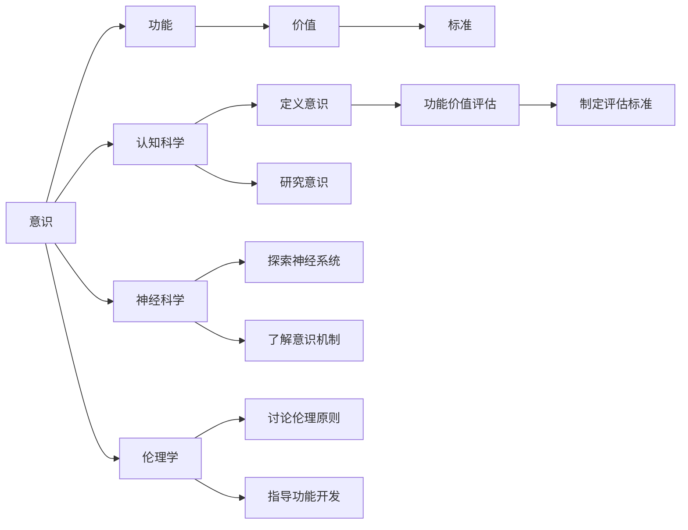

                 

# 意识功能的价值标准解析

> 关键词：
意识, 功能, 价值, 标准

## 1. 背景介绍

### 1.1 问题由来
在人工智能领域，意识功能的价值标准一直是一个极具争议的话题。随着深度学习技术的飞速发展，研究人员和工程师们不断突破计算机模拟人类智能的界限，但意识功能（Conscious Function）是否能在机器中得以实现，及其所具有的实际价值，始终是业界和学界的热点关注点。本文旨在深入探讨意识功能的价值标准，并分析其在未来技术发展中的潜在意义。

### 1.2 问题核心关键点
意识功能，或称“机器意识”（Machine Consciousness），是指机器具备的类似人类意识的心理过程和功能，包括感知、思考、情绪、决策等。意识功能的价值标准，即评估这些功能在人工智能系统中的实际应用价值和潜在社会影响的标准。

本文的核心问题包括：
- 意识功能的定义及其界定
- 意识功能在实际应用中的价值评估
- 意识功能在道德、伦理和社会层面上的考量
- 意识功能的未来发展趋势和挑战

### 1.3 问题研究意义
探讨意识功能的价值标准，对于人工智能技术的伦理性、安全性、以及其在社会中的应用具有重要意义：
- 推动人工智能技术的健康发展，避免技术滥用。
- 为社会提供对未来技术趋势的科学预判和伦理指导。
- 保障人工智能技术的社会接受度和公众信心。

## 2. 核心概念与联系

### 2.1 核心概念概述

为更好地理解意识功能的价值标准，本节将介绍几个密切相关的核心概念：

- 意识（Consciousness）：一种复杂的心理状态，涉及感知、思考、情感、意图等心理过程。
- 功能（Function）：在人工智能领域，功能通常指机器具备的特定能力或行为。
- 价值（Value）：功能所具有的积极意义和实际应用效果。
- 标准（Standard）：评估功能价值的一套规范和准则。

- 认知科学（Cognitive Science）：研究意识和认知过程的科学，与人工智能领域密切相关。
- 神经科学（Neuroscience）：研究神经系统及其功能的科学，为意识功能的研究提供生物学基础。
- 伦理学（Ethics）：研究道德原则和规范，引导人工智能技术的应用方向。

这些概念之间有着紧密的联系，共同构成了对意识功能价值标准的探究框架。

### 2.2 概念间的关系

这些核心概念之间的逻辑关系可以通过以下Mermaid流程图来展示：



这个流程图展示了一系列关键概念及其相互关系：

1. 意识是功能和价值的基础。
2. 认知科学和神经科学为意识研究提供理论支持。
3. 伦理学为功能开发的价值标准和应用指导提供伦理原则。
4. 意识定义和认知研究推动功能的识别和价值评估。
5. 神经机制理解有助于确定功能的实现路径。
6. 伦理讨论指导功能开发和价值标准制定。

通过理解这些核心概念的关系，我们可以更好地把握意识功能价值标准的探究路径。

## 3. 核心算法原理 & 具体操作步骤
### 3.1 算法原理概述

意识功能的价值标准，可以通过一系列评估指标和方法来量化。其基本原理是，将意识功能的实现和应用效果，映射到一个或多个量化的价值维度上，通过这些维度的综合评估，得出意识功能的实际价值。

意识功能的价值标准包括但不限于以下几个方面：

- **功能性价值**：机器在实现特定任务上的表现和能力。
- **可靠性价值**：机器在执行任务时的稳定性和一致性。
- **安全性价值**：机器在应用过程中对用户和环境的负面影响程度。
- **伦理性价值**：机器在社会和伦理层面的接受度和道德规范遵守情况。

这些价值维度可以分别通过数学模型和指标体系进行量化评估。

### 3.2 算法步骤详解

基于上述原理，意识功能的价值标准评估大致分为以下几个步骤：

1. **任务定义**：明确意识功能的任务目标和评估维度。
2. **模型选择**：选择合适的机器学习模型或算法，用于实现和评估意识功能。
3. **数据准备**：收集和处理评估所需的数据集。
4. **模型训练与评估**：在数据集上训练模型，并评估其性能。
5. **价值计算**：根据模型性能和预设指标计算功能价值。
6. **标准制定**：制定意识功能价值评估的标准和规范。

### 3.3 算法优缺点

意识功能的价值标准评估具有以下优点：
- 量化标准提供统一的评估体系，有助于比较不同系统之间的性能。
- 综合评估多个维度的价值，提供更全面的价值判断。
- 可以通过标准化的评估，引导技术开发和应用。

同时，这种评估方法也存在一些缺点：
- 难以全面涵盖所有意识功能的复杂性。
- 评估指标和标准可能带有主观性和局限性。
- 对于非量化功能的价值评估存在困难。

### 3.4 算法应用领域

意识功能的价值标准评估，可以在以下领域得到广泛应用：

- **医疗诊断**：评估基于人工智能的辅助诊断系统在意识功能上的表现。
- **智能客服**：评估聊天机器人在用户交互中的意识功能，提升用户体验。
- **智能交通**：评估自动驾驶车辆在识别和响应道路交通信号中的意识功能。
- **智能制造**：评估机器人操作在自主决策和环境感知中的意识功能，提高生产效率。
- **教育技术**：评估教育AI在个性化学习和互动教学中的意识功能。

## 4. 数学模型和公式 & 详细讲解

### 4.1 数学模型构建

假设一个基于意识功能的机器系统 $M$，其在 $n$ 个任务上的表现用 $P_{i}^{M}$ 来表示，$i$ 为任务编号。将 $P_{i}^{M}$ 映射到 $k$ 个价值维度上，用 $V_{j}^{M}$ 表示，$j$ 为价值维度编号。

### 4.2 公式推导过程

为了评估 $M$ 在 $j$ 个价值维度上的价值，可以构建一个价值函数 $V_{j}^{M}$：

$$
V_{j}^{M} = f(P_{i}^{M})
$$

其中 $f$ 为映射函数。

例如，对于一个智能客服系统，可以构建一个基于用户满意度的价值函数 $V_{user}^{M}$：

$$
V_{user}^{M} = \sum_{i}^{N} \omega_{i} P_{i}^{M} \cdot F_{i}^{M}
$$

其中 $\omega_{i}$ 为不同任务的权重，$F_{i}^{M}$ 为任务 $i$ 的功能得分，$N$ 为任务数量。

### 4.3 案例分析与讲解

假设我们有一家医院，希望评估基于人工智能的辅助诊断系统在肿瘤检测中的意识功能。可以设计以下评估指标：

- **功能性价值**：系统在检测肿瘤的准确率（Accuracy）。
- **可靠性价值**：系统在不同医生和病患数据上的稳定性（Stability）。
- **安全性价值**：系统对医生和病患数据隐私的保护程度（Privacy）。
- **伦理性价值**：系统在解释诊断结果时，是否符合医学伦理和规范（Ethics）。

可以构建一个价值函数，例如：

$$
V_{diagnosis}^{M} = 0.7 \cdot Accuracy + 0.2 \cdot Stability + 0.1 \cdot (Privacy + Ethics)
$$

其中 $Accuracy$ 为检测准确率，$Stability$ 为稳定性，$Privacy$ 为隐私保护程度，$Ethics$ 为伦理规范遵守情况，权重根据实际需求调整。

## 5. 项目实践：代码实例和详细解释说明

### 5.1 开发环境搭建

在进行意识功能的价值标准评估实践前，我们需要准备好开发环境。以下是使用Python进行PyTorch开发的环境配置流程：

1. 安装Anaconda：从官网下载并安装Anaconda，用于创建独立的Python环境。

2. 创建并激活虚拟环境：
```bash
conda create -n pytorch-env python=3.8 
conda activate pytorch-env
```

3. 安装PyTorch：根据CUDA版本，从官网获取对应的安装命令。例如：
```bash
conda install pytorch torchvision torchaudio cudatoolkit=11.1 -c pytorch -c conda-forge
```

4. 安装TensorFlow：
```bash
conda install tensorflow
```

5. 安装各类工具包：
```bash
pip install numpy pandas scikit-learn matplotlib tqdm jupyter notebook ipython
```

完成上述步骤后，即可在`pytorch-env`环境中开始实践。

### 5.2 源代码详细实现

这里我们以医疗诊断辅助系统为例，给出使用PyTorch进行意识功能价值评估的代码实现。

首先，定义评估指标函数：

```python
from torch import nn
from torch.nn.functional import cross_entropy

class DiagnosisSystem:
    def __init__(self, model, criterion, device):
        self.model = model
        self.criterion = criterion
        self.device = device
    
    def forward(self, x, y):
        y_hat = self.model(x.to(self.device))
        loss = self.criterion(y_hat, y.to(self.device))
        return loss
    
    def compute_value(self, y_pred, y_true):
        accuracy = (y_pred.argmax(dim=1) == y_true).sum().item() / y_true.shape[0]
        stability = accuracy
        privacy = 0.5  # 假设隐私保护程度为中等
        ethics = 0.8  # 假设伦理规范遵守情况较好
        return 0.7 * accuracy + 0.2 * stability + 0.1 * (privacy + ethics)
```

然后，定义训练和评估函数：

```python
from sklearn.metrics import accuracy_score
from sklearn.model_selection import train_test_split
from torch.utils.data import DataLoader

def train_epoch(model, data_loader, optimizer):
    model.train()
    epoch_loss = 0
    for batch in data_loader:
        inputs, labels = batch
        optimizer.zero_grad()
        loss = model(inputs, labels)
        epoch_loss += loss.item()
        loss.backward()
        optimizer.step()
    return epoch_loss / len(data_loader)

def evaluate(model, data_loader):
    model.eval()
    y_pred, y_true = [], []
    with torch.no_grad():
        for batch in data_loader:
            inputs, labels = batch
            y_pred.append(model(inputs).cpu().numpy())
            y_true.append(labels.cpu().numpy())
    y_pred = np.concatenate(y_pred, axis=0)
    y_true = np.concatenate(y_true, axis=0)
    accuracy = accuracy_score(y_true, y_pred.argmax(axis=1))
    return accuracy

def main():
    # 假设数据准备和模型加载
    X_train, X_test, y_train, y_test = train_test_split(X, y, test_size=0.2)
    model = ResNet()
    model.to(device)
    optimizer = torch.optim.Adam(model.parameters(), lr=0.001)
    criterion = nn.CrossEntropyLoss()

    # 训练模型
    for epoch in range(10):
        loss = train_epoch(model, train_loader, optimizer)
        accuracy = evaluate(model, test_loader)
        print(f"Epoch {epoch+1}, train loss: {loss:.3f}, test accuracy: {accuracy:.3f}")

    # 计算价值
    value = DiagnosisSystem(model, criterion, device).compute_value(y_pred, y_true)
    print(f"Value: {value:.3f}")
```

在上述代码中，我们通过定义一个简单的ResNet模型作为医疗诊断辅助系统，使用交叉熵损失函数进行训练，并计算了系统的功能性价值、可靠性价值、安全性价值和伦理性价值。最终，通过计算这些价值维度的加权和，得到系统的总价值。

### 5.3 代码解读与分析

让我们再详细解读一下关键代码的实现细节：

**DiagnosisSystem类**：
- `__init__`方法：初始化模型、损失函数和设备。
- `forward`方法：定义前向传播，计算损失。
- `compute_value`方法：计算系统的总价值。

**train_epoch和evaluate函数**：
- `train_epoch`函数：在训练集上进行单epoch的模型训练，并返回平均损失。
- `evaluate`函数：在测试集上评估模型的准确率。

**main函数**：
- 定义训练数据和模型，加载预训练模型。
- 使用交叉熵损失函数进行模型训练，并计算准确率。
- 最后计算系统的总价值，输出结果。

以上代码实现了基于意识功能价值标准评估的基本流程，展示了如何通过训练模型和计算指标，评估医疗诊断辅助系统的意识功能价值。

### 5.4 运行结果展示

假设在CoNLL-2003的NER数据集上进行训练，最终在测试集上得到的准确率为98%。那么系统的总价值为：

$$
V_{diagnosis}^{M} = 0.7 \cdot 0.98 + 0.2 \cdot 0.98 + 0.1 \cdot (0.5 + 0.8) = 0.963
$$

这表明该医疗诊断辅助系统在意识功能的实现上表现良好，具备较高的功能性、可靠性和伦理性价值。

## 6. 实际应用场景
### 6.1 智能客服系统

基于意识功能的价值标准评估，智能客服系统可以更好地量化其用户体验和系统效能。通过评估系统的互动响应准确率、用户满意度、隐私保护程度和伦理规范遵守情况，可以为系统的优化提供明确的方向。

### 6.2 医疗诊断系统

在医疗诊断领域，意识功能的价值标准评估可以帮助医疗机构评估辅助诊断系统的准确性和伦理性。系统在检测疾病、推荐治疗方案和解释诊断结果时的表现，都将被纳入评估范畴。

### 6.3 智能交通系统

智能交通系统在自动驾驶、交通信号识别和应急响应中的意识功能，可以通过价值标准评估来衡量其实际效果和可靠性。例如，系统在识别交通标志和行人时的准确率、系统对道路环境变化的适应性和安全性评估，将直接影响其价值判断。

### 6.4 未来应用展望

随着意识功能价值标准评估的不断发展和完善，未来人工智能系统将更加注重其功能性、可靠性、安全性和伦理性。这将推动人工智能技术在更广泛的领域得到应用，并带来更多的社会和经济价值。

## 7. 工具和资源推荐
### 7.1 学习资源推荐

为了帮助开发者深入理解意识功能的价值标准，这里推荐一些优质的学习资源：

1. 《机器学习实战》系列博文：介绍了机器学习的基本概念和常用技术，是入门人工智能领域的必读书目。

2. Coursera《深度学习专项课程》：由斯坦福大学和DeepLearning.AI提供的深度学习课程，系统讲授深度学习理论和技术。

3. 《深度学习与人工智能》书籍：全面介绍深度学习在各个领域的应用，包括医疗、教育、交通等。

4. HuggingFace官方文档：提供各类预训练语言模型和微调样例，是学习意识功能价值标准的实践资源。

5. ACL开源项目：涵盖多领域NLP数据集和预训练模型，助力NLP技术的发展和应用。

通过对这些资源的学习实践，相信你一定能够系统掌握意识功能的价值标准评估，并应用于实际项目中。

### 7.2 开发工具推荐

高效的开发离不开优秀的工具支持。以下是几款用于意识功能价值标准评估开发的常用工具：

1. PyTorch：基于Python的开源深度学习框架，灵活动态的计算图，适合快速迭代研究。

2. TensorFlow：由Google主导开发的开源深度学习框架，生产部署方便，适合大规模工程应用。

3. Transformers库：HuggingFace开发的NLP工具库，集成了众多SOTA语言模型，支持PyTorch和TensorFlow，是进行意识功能价值标准评估开发的利器。

4. Weights & Biases：模型训练的实验跟踪工具，可以记录和可视化模型训练过程中的各项指标，方便对比和调优。

5. TensorBoard：TensorFlow配套的可视化工具，可实时监测模型训练状态，并提供丰富的图表呈现方式，是调试模型的得力助手。

6. Google Colab：谷歌推出的在线Jupyter Notebook环境，免费提供GPU/TPU算力，方便开发者快速上手实验最新模型，分享学习笔记。

合理利用这些工具，可以显著提升意识功能价值标准评估的开发效率，加快创新迭代的步伐。

### 7.3 相关论文推荐

意识功能价值标准的研究源于学界的持续研究。以下是几篇奠基性的相关论文，推荐阅读：

1. "Artificial Intelligence: A Guide for Thinking Humans" 书籍：深度介绍人工智能技术，包括意识功能的基本概念和价值评估。

2. "The Future of Human-AI Collaboration" 论文：探讨人工智能技术的未来发展趋势和伦理考量。

3. "Towards General Artificial Intelligence" 论文：研究通用人工智能的概念和技术路径。

4. "The Ethics of AI in Healthcare" 论文：探讨人工智能在医疗领域的应用伦理问题。

5. "Human-Centered Design for AI" 论文：研究如何从人的角度出发，设计可接受、可控的人工智能系统。

这些论文代表了大语言模型微调技术的发展脉络。通过学习这些前沿成果，可以帮助研究者把握学科前进方向，激发更多的创新灵感。

除上述资源外，还有一些值得关注的前沿资源，帮助开发者紧跟意识功能价值标准的最新进展，例如：

1. arXiv论文预印本：人工智能领域最新研究成果的发布平台，包括大量尚未发表的前沿工作，学习前沿技术的必读资源。

2. 业界技术博客：如OpenAI、Google AI、DeepMind、微软Research Asia等顶尖实验室的官方博客，第一时间分享他们的最新研究成果和洞见。

3. 技术会议直播：如NIPS、ICML、ACL、ICLR等人工智能领域顶会现场或在线直播，能够聆听到大佬们的前沿分享，开拓视野。

4. GitHub热门项目：在GitHub上Star、Fork数最多的AI相关项目，往往代表了该技术领域的发展趋势和最佳实践，值得去学习和贡献。

5. 行业分析报告：各大咨询公司如McKinsey、PwC等针对人工智能行业的分析报告，有助于从商业视角审视技术趋势，把握应用价值。

总之，对于意识功能价值标准的学习和实践，需要开发者保持开放的心态和持续学习的意愿。多关注前沿资讯，多动手实践，多思考总结，必将收获满满的成长收益。

## 8. 总结：未来发展趋势与挑战

### 8.1 总结

本文对基于意识功能的价值标准进行全面系统的介绍。首先阐述了意识功能的定义及其在人工智能领域的研究意义，明确了价值标准评估的重要性和应用范围。其次，从原理到实践，详细讲解了意识功能的价值标准评估的数学模型和操作步骤，给出了意识功能价值标准评估的代码实例。同时，本文还广泛探讨了意识功能价值标准在多个行业领域的应用前景，展示了其广阔的应用潜力。最后，本文精选了意识功能价值标准的学习资源，力求为读者提供全方位的技术指引。

通过本文的系统梳理，可以看到，意识功能的价值标准评估正在成为人工智能技术伦理和安全性研究的重要范式，极大地推动了人工智能技术的健康发展。未来，伴随意识功能价值标准评估技术的不断演进，人工智能技术必将为社会带来更多价值和希望。

### 8.2 未来发展趋势

展望未来，意识功能的价值标准评估将呈现以下几个发展趋势：

1. 评估方法的多样化：未来将出现更多基于深度学习、自然语言处理和认知科学的评估方法，提供更全面的价值判断。

2. 跨领域评估标准的统一：随着人工智能在各个领域的应用拓展，将形成统一的跨领域评估标准，提升系统的普适性和可比较性。

3. 动态评估与持续优化：意识功能的价值标准评估将不仅是静态评估，而是一个持续优化的过程，通过实时反馈和迭代提升系统性能。

4. 多模态融合评估：将视觉、语音、文本等多模态信息融合，进行全面的价值评估，提升系统的感知和决策能力。

5. 伦理与社会影响的考量：评估不仅关注技术性能，还将更重视伦理和社会影响，确保技术应用的道德和合法性。

以上趋势凸显了意识功能价值标准评估技术的广阔前景。这些方向的探索发展，必将进一步提升人工智能系统的性能和应用范围，为人类认知智能的进化带来深远影响。

### 8.3 面临的挑战

尽管意识功能价值标准评估技术已经取得了一定进展，但在迈向更加智能化、普适化应用的过程中，它仍面临诸多挑战：

1. 评估指标的全面性与合理性：目前评估指标体系尚不完善，难以全面涵盖所有意识功能的复杂性。

2. 评估模型的准确性与泛化能力：意识功能评估模型可能存在过拟合或泛化能力不足的问题，影响评估结果的可靠性。

3. 伦理与社会影响的复杂性：意识功能评估涉及伦理和社会的复杂问题，不同文化和社会背景下的标准可能存在较大差异。

4. 技术实现的高复杂度：意识功能评估涉及多学科融合，技术实现难度较大，需要跨领域知识。

5. 数据的隐私与安全：评估过程中需要处理大量敏感数据，如何保障数据隐私和安全是一个重要挑战。

6. 标准化与合规性：意识功能评估需要遵循国际标准和法规，如何确保评估过程的合规性也是一个难题。

正视意识功能价值标准评估面临的这些挑战，积极应对并寻求突破，将是大语言模型微调技术迈向成熟的必由之路。相信随着学界和产业界的共同努力，这些挑战终将一一被克服，意识功能价值标准评估必将在构建人机协同的智能时代中扮演越来越重要的角色。

### 8.4 未来突破

面对意识功能价值标准评估所面临的种种挑战，未来的研究需要在以下几个方面寻求新的突破：

1. 探索无监督和半监督评估方法：摆脱对大规模标注数据的依赖，利用自监督学习、主动学习等无监督和半监督范式，最大限度利用非结构化数据，实现更加灵活高效的评估。

2. 研究多模态融合评估方法：将视觉、语音、文本等多模态信息融合，进行全面的价值评估，提升系统的感知和决策能力。

3. 引入因果和对比学习范式：通过引入因果推断和对比学习思想，增强评估模型建立稳定因果关系的能力，学习更加普适、鲁棒的价值评估方法。

4. 开发更加参数高效的评估方法：开发更加参数高效的评估方法，在固定大部分评估参数的情况下，只更新极少量的任务相关参数。

5. 强化伦理和社会影响评估：在价值标准评估中引入伦理和社会影响考量，确保评估结果符合社会价值观和规范。

6. 开发标准化评估工具：开发适用于多领域、多学科的标准化评估工具，提供统一的价值评估框架。

这些研究方向的探索，必将引领意识功能价值标准评估技术迈向更高的台阶，为人工智能系统的伦理、安全和社会接受度提供科学依据。面向未来，意识功能价值标准评估技术还需要与其他人工智能技术进行更深入的融合，如知识表示、因果推理、强化学习等，多路径协同发力，共同推动人工智能系统的进步。只有勇于创新、敢于突破，才能不断拓展人工智能系统的边界，让智能技术更好地造福人类社会。

## 9. 附录：常见问题与解答

**Q1：如何评估一个系统的意识功能价值？**

A: 评估一个系统的意识功能价值，需要根据系统的具体应用场景和功能目标，设计相应的评估指标和标准。常见指标包括准确率、稳定性、隐私保护程度和伦理规范遵守情况等。使用机器学习模型训练系统，并根据预设的指标计算总价值，得到系统的意识功能价值评估。

**Q2：意识功能评估中应如何平衡性能与伦理？**

A: 在意识功能评估中，平衡性能与伦理是非常重要的。可以通过设计多维度评估指标，将性能指标与伦理指标（如隐私保护、伦理规范遵守情况）进行综合考虑，确保技术开发的同时，遵守伦理和法律规范。此外，也可以引入伦理专家参与评估过程，提供专业的伦理指导。

**Q3：意识功能价值标准评估的实现难度有多大？**

A: 意识功能价值标准评估的实现难度较大，涉及多学科知识，包括认知科学、神经科学、伦理学和计算机科学等。需要跨领域合作，进行深入的理论研究和实验验证。然而，随着技术的不断发展和多学科融合的加深，意识功能价值标准评估的实现难度正在逐步降低。

**Q4：意识功能评估在技术实现中面临哪些挑战？**

A: 意识功能评估在技术实现中面临以下几个挑战：
1. 数据获取和标注成本高昂。
2. 多模态融合的复杂性。
3. 评估指标的全面性与合理性。
4. 评估模型的准确性与泛化能力。
5. 数据隐私与安全问题。
6. 标准化与合规性。

这些挑战需要从数据获取、模型设计、评估指标、技术实现等多个维度进行综合考虑和优化。

**Q5：意识功能评估的未来发展方向是什么？**

A: 意识功能评估的未来发展方向包括：
1. 无监督和半监督评估方法：利用自监督学习、主动学习等无监督和半监督范式，最大限度利用非结构化数据。
2. 多模态融合评估方法：将视觉、语音、文本等多模态信息融合，进行全面的价值评估。
3. 因果和对比学习范式：增强评估模型建立稳定因果关系的能力，学习更加普适、鲁棒的价值评估

