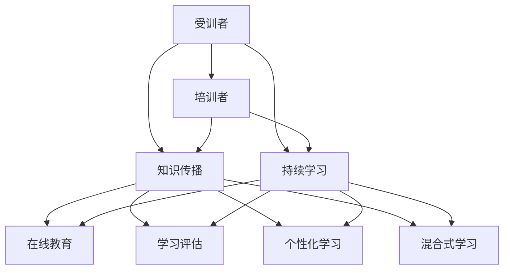
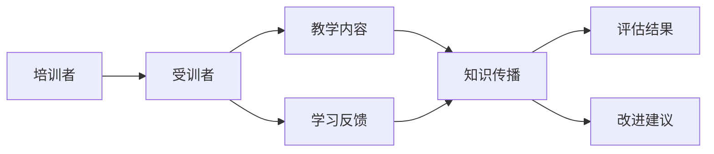
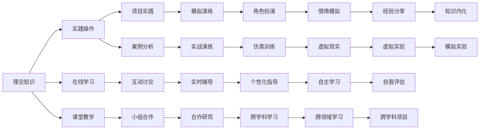
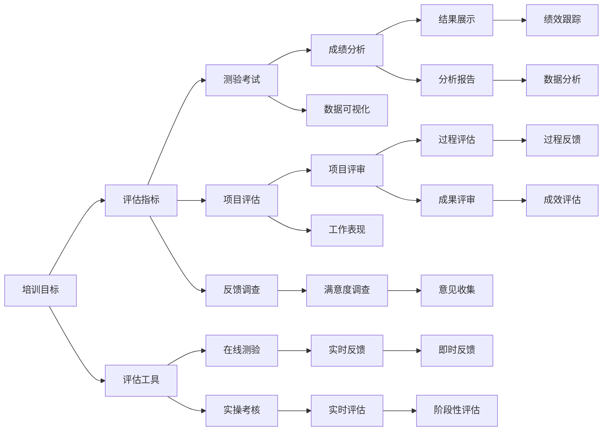
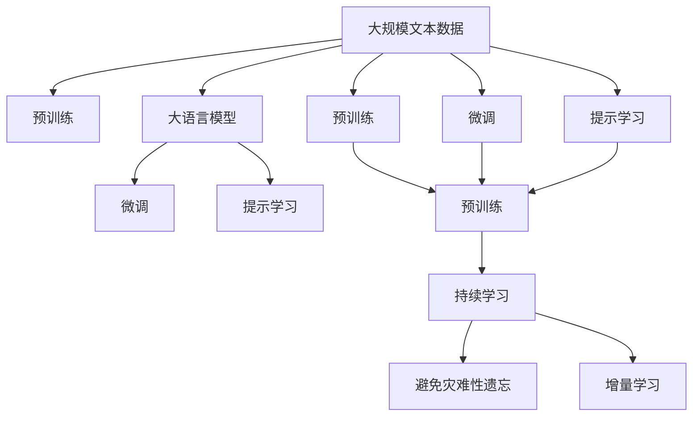

                 

# 技术培训：从受训者到培训者

> 关键词：技术培训, 知识传播, 受训者, 培训者, 成人学习, 学习方法, 个性化教学, 持续学习, 在线教育, 技术评估

## 1. 背景介绍

### 1.1 问题由来
在当前知识爆炸、技术更新的时代背景下，技术培训作为提升个人专业能力、促进职业发展的关键手段，变得愈发重要。然而，随着技术的不断进步，新的知识和技能层出不穷，传统的基于面对面授课的模式已难以满足学习者的个性化需求。同时，培训课程内容更新频率加快，受训者如何高效、系统地学习，培训者如何高效、有针对性地进行培训，成为业界关注的焦点。

### 1.2 问题核心关键点
技术培训的核心在于知识传播和技能提升，其关键点包括：
1. 了解受训者的学习习惯和需求，制定个性化的培训计划。
2. 设计有效的教学方法，提升学习效率和理解深度。
3. 使用合适的培训工具和资源，增强培训效果。
4. 进行持续评估和反馈，不断优化培训过程。
5. 保持学习资源的更新和迭代，确保培训内容的前沿性和实用性。

### 1.3 问题研究意义
技术培训的顺利进行，对于提升技术水平、推动技术创新、促进技术应用具有重要意义：

1. 提升个人职业竞争力。通过系统的培训，受训者能够掌握最新技术，提升工作能力，增强职业竞争力。
2. 推动技术产业发展。技术培训是技术知识传播和应用的重要渠道，有助于技术在新领域、新行业的应用和推广。
3. 促进教育公平。通过线上线下结合的培训模式，更多人能够接触和应用先进技术，促进教育公平和社会进步。
4. 加速技术创新。培训过程中，受训者和培训者可以共同探讨技术问题，激发创新思维，推动技术创新。
5. 支持技术落地。技术培训能够提供实际应用指导，帮助受训者快速上手新技术，支持技术在实际项目中的应用和推广。

## 2. 核心概念与联系

### 2.1 核心概念概述

为更好地理解技术培训的核心概念及其应用，本节将介绍几个关键概念及其联系：

- **受训者(Learner)**：参加培训课程的个人或团队，需具备一定基础和自学能力。
- **培训者(Trainer)**：负责设计、实施和评估培训课程的专业人士，需具备专业知识、教学经验和课程设计能力。
- **技术培训**：通过有组织的知识传播，提升受训者技术水平和应用能力的过程。
- **知识传播**：以各种方式（如授课、实践、交流等）传递技术知识，帮助受训者掌握新技能。
- **持续学习(Continuous Learning)**：学习者不断更新知识、提升技能的过程，强调学习和实践的连贯性。
- **在线教育(E-learning)**：利用互联网技术进行远程培训，具有灵活、便捷、个性化的特点。
- **学习评估**：通过各种手段（如测验、项目、反馈等）评估受训者的学习效果，指导培训过程的改进。
- **个性化学习(Learning-by-Doing)**：强调通过实际操作和项目实践进行学习，提升理解和应用能力。
- **混合式学习(Blended Learning)**：结合线上和线下教学资源，提供灵活、系统的培训方案。

这些概念之间的联系可以通过以下Mermaid流程图来展示：



这个流程图展示了一个技术培训系统的基本架构，各个概念之间的关系和作用：

1. **受训者**通过**知识传播**环节获取新知识，**持续学习**不断更新和巩固这些知识。
2. **培训者**设计**知识传播**和**持续学习**方案，使用**在线教育**、**学习评估**等工具辅助教学。
3. **个性化学习**和**混合式学习**使学习过程更加灵活和系统，适应不同学习者的需求。

### 2.2 概念间的关系

这些核心概念之间存在着紧密的联系，构成了技术培训的基本生态系统。下面我们通过几个Mermaid流程图来展示这些概念之间的关系。

#### 2.2.1 培训者与受训者的关系



这个流程图展示了培训者与受训者的互动关系，以及培训过程中的知识传播和反馈机制。

#### 2.2.2 培训方法的多样性



这个流程图展示了培训方法的多种形式，包括理论知识与实践操作的结合，以及线上线下、互动讨论、小组合作等多种教学模式。

#### 2.2.3 培训效果评估



这个流程图展示了培训效果评估的基本流程，包括评估指标、评估工具和评估结果的处理与反馈。

### 2.3 核心概念的整体架构

最后，我们用一个综合的流程图来展示这些核心概念在技术培训中的整体架构：



这个综合流程图展示了从预训练到微调，再到持续学习的完整过程。培训者通过选择合适的预训练模型，设计合适的微调策略和提示学习模板，对受训者进行技能提升，使其在实际应用中更加高效和精准。

## 3. 核心算法原理 & 具体操作步骤
### 3.1 算法原理概述

技术培训的核心算法原理包括受训者的个性化学习、培训者的个性化教学和持续学习的管理。

**个性化学习**的原理是通过对受训者的学习习惯、知识背景、技能水平进行详细了解，制定个性化的学习计划。具体实现上，可以利用问卷调查、学习记录、项目反馈等手段获取受训者的学习特征，结合机器学习算法生成个性化学习路径。

**个性化教学**的原理是通过对培训者教学风格、教学内容、教学效果进行评估，制定个性化的教学策略。具体实现上，可以通过学习分析工具获取教学数据，结合教学评估结果，优化教学内容和方法。

**持续学习**的原理是通过不断的评估和学习，使受训者保持知识的更新和技能的提升。具体实现上，可以利用在线学习平台和评估工具，提供及时的学习反馈和调整建议。

### 3.2 算法步骤详解

技术培训的具体操作步骤可以总结为以下几个关键步骤：

**Step 1: 需求调研与分析**
- 通过问卷调查、访谈等方式，了解受训者的背景信息、学习目标和需求。
- 分析受训者的知识水平、技能水平和学习习惯，生成个性化的学习需求。

**Step 2: 设计培训方案**
- 根据受训者的学习需求，选择合适的培训目标和教学内容。
- 设计个性化的教学路径和学习资源，包括理论课程、实践项目、在线课程等。
- 制定评估指标和标准，确保培训效果的可量化和可评估。

**Step 3: 实施培训**
- 利用线上线下结合的方式，提供灵活、系统的培训课程。
- 通过互动讨论、小组合作、项目实践等形式，提升学习效果。
- 使用实时反馈和评估工具，及时了解学习进展和问题，及时调整教学策略。

**Step 4: 评估与反馈**
- 通过各种评估手段（如测验、项目、反馈调查等），评估受训者的学习效果。
- 收集受训者的反馈和建议，持续优化培训方案和教学方法。
- 利用数据分析工具，生成评估报告，指导持续学习过程。

**Step 5: 持续学习**
- 建立持续学习的机制，定期更新学习资源和评估标准。
- 利用在线学习平台，提供灵活的学习路径和资源。
- 通过学习评估和反馈机制，保持学习者的持续进步和技能提升。

### 3.3 算法优缺点

技术培训具有以下优点：
1. 定制化高。通过个性化学习和个性化教学，可以满足不同学习者的需求。
2. 灵活性高。线上线下结合的培训模式，提供了灵活的学习时间和地点。
3. 互动性强。互动讨论、小组合作等形式，增强了学习者和培训者的互动。
4. 评估精准。通过多种评估手段，可以全面了解学习效果，及时发现和解决问题。

同时，技术培训也存在以下缺点：
1. 实施难度高。个性化设计和持续优化需要大量的时间和资源。
2. 评估复杂性。多种评估手段的组合使用，增加了评估的复杂性和难度。
3. 培训效果依赖于培训者的专业水平。培训者的教学能力和经验直接影响培训效果。
4. 受训者自主学习能力要求高。受训者需要具备良好的自主学习能力和时间管理能力。

### 3.4 算法应用领域

技术培训的应用领域非常广泛，包括但不限于以下几个方面：

- **软件开发**：帮助开发者掌握新技术、新框架，提升编码能力和项目开发效率。
- **数据分析**：通过数据科学培训，提升数据分析技能，支持业务决策和产品优化。
- **人工智能**：培训数据科学家和工程师，掌握机器学习、深度学习等前沿技术。
- **项目管理**：帮助项目经理提升项目管理和团队协作能力，支持企业高效运营。
- **营销与销售**：培训营销人员和销售人员，掌握数字营销和客户管理技能。
- **教育培训**：提升教师的教学能力，提升学生的学习效果，推动教育公平。

## 4. 数学模型和公式 & 详细讲解 & 举例说明
### 4.1 数学模型构建

技术培训的数学模型主要涉及受训者学习效果和培训效果的量化评估。设受训者数量为 $N$，学习效果向量为 $x$，学习目标向量为 $y$，学习评估向量为 $z$。数学模型可以表示为：

$$
f(x, y) = \min \| z - (x \cdot y)^T \|
$$

其中 $f$ 为评估函数，$\| \cdot \|$ 为范数，$x \cdot y$ 为内积操作。

### 4.2 公式推导过程

我们以受训者在完成一个编程项目后的效果评估为例，进行公式推导：

假设受训者完成一个编程项目，项目目标为解决特定问题，学习效果向量 $x$ 可以表示为：
- 编码能力：$x_1$
- 测试覆盖率：$x_2$
- 代码质量和可读性：$x_3$

项目目标向量 $y$ 可以表示为：
- 问题解决：$y_1$
- 代码质量：$y_2$
- 项目效率：$y_3$

评估向量 $z$ 可以表示为：
- 项目评分：$z_1$
- 代码质量评分：$z_2$
- 时间消耗：$z_3$

则有：

$$
f(x, y) = \min \sqrt{\sum_{i=1}^3 (z_i - (x_i \cdot y_i))^2}
$$

该公式表示了受训者在项目中的学习效果与项目目标之间的差距，通过最小化范数，可以找到最佳的学习效果向量 $x^*$。

### 4.3 案例分析与讲解

假设有一个软件开发团队，每个成员在完成一个新项目后，培训者需要进行效果评估。设每个成员的编码能力、测试覆盖率和代码质量分别为 $x_1, x_2, x_3$，项目目标为问题解决、代码质量和项目效率分别为 $y_1, y_2, y_3$。根据实际项目评分、代码质量评分和时间消耗，可以得到评估向量 $z = (z_1, z_2, z_3)$。

通过求解上述公式，可以计算出每个成员在项目中的最佳学习效果向量 $x^*$，从而指导后续培训方案的优化。

## 5. 项目实践：代码实例和详细解释说明
### 5.1 开发环境搭建

在进行技术培训项目实践前，我们需要准备好开发环境。以下是使用Python进行Django开发的环境配置流程：

1. 安装Anaconda：从官网下载并安装Anaconda，用于创建独立的Python环境。

2. 创建并激活虚拟环境：
```bash
conda create -n pytorch-env python=3.8 
conda activate pytorch-env
```

3. 安装Django：
```bash
pip install django
```

4. 安装各类工具包：
```bash
pip install numpy pandas scikit-learn matplotlib tqdm jupyter notebook ipython
```

完成上述步骤后，即可在`pytorch-env`环境中开始技术培训项目实践。

### 5.2 源代码详细实现

下面我们以一个简单的在线学习平台为例，给出使用Django进行技术培训项目开发的PyTorch代码实现。

首先，定义学习者和课程模型：

```python
from django.db import models
from django.contrib.auth.models import User

class Learner(models.Model):
    user = models.OneToOneField(User, on_delete=models.CASCADE)
    name = models.CharField(max_length=100)
    email = models.EmailField()
    learning_profile = models.TextField()

class Course(models.Model):
    name = models.CharField(max_length=100)
    description = models.TextField()
    instructor = models.ForeignKey(User, on_delete=models.CASCADE)
    start_date = models.DateTimeField()
    end_date = models.DateTimeField()
    learning_resources = models.TextField()
    student_count = models.IntegerField(default=0)
```

然后，定义学习效果和评估模型：

```python
class LearningEffect(models.Model):
    learner = models.ForeignKey(Learner, on_delete=models.CASCADE)
    course = models.ForeignKey(Course, on_delete=models.CASCADE)
    effective_time = models.DateTimeField()
    learning_score = models.DecimalField(max_digits=5, decimal_places=2)
    feedback = models.TextField()

class LearningEvaluation(models.Model):
    learner = models.ForeignKey(Learner, on_delete=models.CASCADE)
    course = models.ForeignKey(Course, on_delete=models.CASCADE)
    evaluation_date = models.DateTimeField()
    evaluation_score = models.DecimalField(max_digits=5, decimal_places=2)
    evaluation_feedback = models.TextField()
```

接着，定义视图函数和模板：

```python
from django.shortcuts import render, redirect
from .models import Learner, Course, LearningEffect, LearningEvaluation

def course_list(request):
    courses = Course.objects.all()
    return render(request, 'course_list.html', {'courses': courses})

def course_detail(request, course_id):
    course = Course.objects.get(id=course_id)
    learners = Learner.objects.filter(course=course).all()
    return render(request, 'course_detail.html', {'course': course, 'learners': learners})

def learner_detail(request, learner_id):
    learner = Learner.objects.get(id=learner_id)
    courses = learner.course_set.all()
    return render(request, 'learner_detail.html', {'learner': learner, 'courses': courses})
```

最后，定义URL路由和模板：

```python
from django.urls import path
from . import views

urlpatterns = [
    path('courses/', views.course_list, name='course_list'),
    path('courses/<int:course_id>/', views.course_detail, name='course_detail'),
    path('learners/', views.learner_detail, name='learner_detail'),
]
```

### 5.3 代码解读与分析

让我们再详细解读一下关键代码的实现细节：

**Learner和Course模型**：
- `Learner`模型表示学习者，包含了用户信息、学习资料和个人学习档案。
- `Course`模型表示课程，包含了课程名称、描述、讲师、开始和结束时间、学习资料和学习者数量。

**LearningEffect和LearningEvaluation模型**：
- `LearningEffect`模型表示学习效果，包含了学习者、课程、学习时间、学习成绩和反馈。
- `LearningEvaluation`模型表示学习评估，包含了学习者、课程、评估日期、评估成绩和反馈。

**视图函数和模板**：
- `course_list`函数展示所有课程列表。
- `course_detail`函数展示课程详细信息，包括学习者列表。
- `learner_detail`函数展示学习者详细信息，包括课程列表。

**URL路由**：
- 定义了课程列表、课程详情和学员详情的URL路径。

完成上述步骤后，一个简单的在线学习平台框架便搭建完成。开发者可以进一步完善系统功能，如登录注册、项目提交、评估反馈等，提供更加丰富的学习体验。

### 5.4 运行结果展示

假设我们在平台上发布了一个Python编程课程，受训者在该课程中完成了多个项目，最终在评估时获得如下成绩：

- 第一个项目：学习效果为 $x_1=0.8, x_2=0.9, x_3=0.7$，评估成绩为 $z_1=4, z_2=3.5, z_3=2$。
- 第二个项目：学习效果为 $x_1=0.9, x_2=0.95, x_3=0.85$，评估成绩为 $z_1=4.5, z_2=4.0, z_3=2.5$。
- 第三个项目：学习效果为 $x_1=0.9, x_2=0.8, x_3=0.8$，评估成绩为 $z_1=4.2, z_2=3.8, z_3=2.5$。

通过上述公式，可以计算出每个项目的最佳学习效果向量 $x^*$，并生成评估报告，指导后续的培训改进。

## 6. 实际应用场景
### 6.1 智能培训系统

智能培训系统通过人工智能技术，实现个性化学习路径和动态调整，提供更加高效、精准的培训服务。在实际应用中，智能培训系统可以包括以下几个关键功能：

- **个性化推荐**：根据受训者的学习历史和评估结果，推荐合适的课程和学习资源。
- **动态调整**：根据受训者的学习效果和反馈，动态调整学习路径和教学内容。
- **实时评估**：通过实时监控和反馈，及时了解受训者的学习进度和效果。
- **模拟测试**：通过模拟测试，评估受训者的学习效果，提供具体的改进建议。

例如，一个软件开发团队的智能培训系统，可以根据成员的编码能力和项目完成情况，推荐合适的编程课程和资料，并通过动态调整，优化培训方案，提升团队整体技能水平。

### 6.2 在线教育平台

在线教育平台通过网络技术，提供灵活、便捷的学习方式，打破时间和空间的限制，满足更多学习者的需求。在实际应用中，在线教育平台可以包括以下几个关键功能：

- **多样化课程**：提供丰富多样的课程资源，涵盖各个领域和层次。
- **互动教学**：通过在线讨论、视频讲解等形式，增强互动性。
- **实时反馈**：通过实时评估和反馈，及时了解学习效果和问题。
- **持续学习**：通过在线学习平台，提供灵活的学习路径和资源，支持持续学习。

例如，一个在线教育平台可以为全球的学生提供多样化的学习资源，帮助他们掌握各领域的知识，实现个人职业发展和学术提升。

### 6.3 企业培训系统

企业培训系统通过企业内部的数据和技术资源，为员工提供系统化、个性化的培训服务，提升团队整体能力和企业竞争力。在实际应用中，企业培训系统可以包括以下几个关键功能：

- **定制化培训**：根据企业需求和员工特点，设计定制化的培训方案。
- **实战演练**：通过模拟项目和实际演练，提升员工实际应用能力。
- **效果评估**：通过评估和反馈，持续优化培训方案和效果。
- **持续学习**：通过在线学习平台，支持员工持续学习和技能提升。

例如，一家金融企业可以为员工提供系统的金融分析培训，帮助他们掌握最新的金融工具和方法，提升业务水平和企业竞争力。

## 7. 工具和资源推荐
### 7.1 学习资源推荐

为了帮助开发者系统掌握技术培训的理论基础和实践技巧，这里推荐一些优质的学习资源：

1. **《学习之道》(Learning How to Learn)**：一本关于科学学习的经典书籍，介绍了多种学习方法和技巧，帮助读者提升学习效果。
2. **Coursera和edX**：提供大量在线课程，涵盖各个领域的知识和技术，适合自学和系统学习。
3. **Udacity和Udemy**：提供各种实战课程和项目，帮助学习者掌握具体技能和工具。
4. **Kaggle**：一个数据科学和机器学习竞赛平台，提供大量数据集和实战项目，适合技术培训和竞赛。
5. **Google Developers和Microsoft Learn**：提供丰富的技术文档和教程，帮助开发者学习和应用新技术。

通过对这些资源的学习实践，相信你一定能够快速掌握技术培训的精髓，并用于解决实际的培训问题。

### 7.2 开发工具推荐

高效的开发离不开优秀的工具支持。以下是几款用于技术培训开发的常用工具：

1. **Django**：一个开源的Web框架，支持灵活的URL路由和模板设计，适合快速开发和管理培训平台。
2. **Django REST framework**：一个基于Django的RESTful API开发工具，支持API的灵活设计和访问控制。
3. **Flask**：一个轻量级的Web框架，支持快速开发小型培训应用。
4. **SQLAlchemy**：一个Python SQL工具包，支持数据库的灵活操作和ORM设计。
5. **Jupyter Notebook**：一个交互式的编程环境，适合数据分析和机器学习项目的学习和实践。

合理利用这些工具，可以显著提升技术培训任务的开发效率，加快创新迭代的步伐。

### 7.3 相关论文推荐

技术培训的深入研究源于学界的持续探索。以下是几篇奠基性的相关论文，推荐阅读：

1. **《学习者模型构建》(Learner Model Construction)**：介绍如何构建学习者模型，量化学习者的认知、情感和学习风格等特性。
2. **《在线学习平台的设计与实现》(Design and Implementation of Online Learning Platform)**：介绍如何设计灵活、高效的在线学习平台，支持多样化学习路径和实时反馈。
3. **《个性化学习路径的优化》(Optimization of Personalized Learning Path)**：介绍如何使用机器学习算法，优化个性化学习路径，提升学习效果。
4. **《企业培训系统的设计与实现》(Design and Implementation of Enterprise Training System)**：介绍如何设计定制化、系统化的企业培训系统，提升团队整体能力和企业竞争力。
5. **《智能培训系统的发展趋势》(Trends and Challenges of Smart Training Systems)**：介绍智能培训系统的发展现状和未来趋势，探讨其应用前景和挑战。

这些论文代表了大语言模型微调技术的发展脉络。通过学习这些前沿成果，可以帮助研究者把握学科前进方向，激发更多的创新灵感。

除上述资源外，还有一些值得关注的前沿资源，帮助开发者紧跟技术培训技术的发展方向，例如：

1. **arXiv论文预印本**：人工智能领域最新研究成果的发布平台，包括大量尚未发表的前沿工作，学习前沿技术的必读资源。
2. **业界技术博客**：如Coursera、edX、Udacity等在线教育平台和Coursera的官方博客，第一时间分享他们的最新研究成果和洞见。
3. **技术会议直播**：如NIPS、ICML、ACL、ICLR等人工智能领域顶会现场或在线直播，能够聆听到大佬们的前沿分享，开拓

