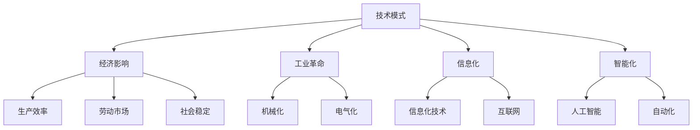

                 

# 技术模式减弱的经济影响

> 关键词：技术模式，经济影响，工业革命，人工智能，自动化

## 1. 背景介绍

随着技术的不断进步，我们逐渐看到了技术的两面性。一方面，技术推动了生产力的飞跃，带来了经济的繁荣；另一方面，技术也对经济结构、就业市场和社会稳定产生了深远影响。本文将探讨技术模式对经济的影响，特别关注当前正在发生的自动化和人工智能浪潮。

### 1.1 技术模式的演进

技术模式的演进可以追溯到几个重要的历史阶段：

- **机械化**：18世纪的工业革命标志着人类开始大规模利用机械化设备进行生产。
- **电气化**：19世纪末到20世纪初，电力的大规模应用改变了工业和交通的格局。
- **信息化**：20世纪中叶以来，计算机和互联网的普及推动了信息化的浪潮，改变了经济和社会的方方面面。
- **智能化**：21世纪初，人工智能和大数据的兴起，预示着一个新的智能化时代即将到来。

### 1.2 技术模式的影响

每一轮技术模式的演进，都伴随着经济结构的变化。机械化、电气化和信息化极大地提高了生产效率，改变了劳动市场的结构，促进了经济的全球化。而智能化则带来了更深层次的变化，特别是在自动化和人工智能方面。

## 2. 核心概念与联系

### 2.1 核心概念概述

- **技术模式**：指在特定历史时期内，支撑经济和社会发展的主要技术手段和应用形式。
- **经济影响**：技术模式通过改变生产方式、产业结构、就业市场等方面，对经济活动和产业发展产生深远影响。
- **工业革命**：18世纪末至19世纪的革命性技术进步，极大地提高了生产力，改变了社会结构和生产方式。
- **自动化**：通过使用机器人、自动化生产线等技术，实现生产过程的自动化，减少人工干预。
- **人工智能**：模拟人类智能过程，通过算法和模型实现自动化决策和任务执行。
- **生产效率**：衡量生产活动中投入与产出的比率，提高生产效率是技术模式演进的重要目标。
- **劳动市场**：指在经济活动中，劳动力供给与需求之间的关系，技术模式对其结构与稳定产生重要影响。
- **社会稳定**：技术模式的变化也会对社会稳定产生影响，如失业率、贫富差距等问题。

这些核心概念之间存在着密切的联系，通过技术模式的演进，我们可以深入理解技术对经济的深远影响。

### 2.2 概念间的关系

这些核心概念之间的关系可以通过以下Mermaid流程图来展示：



这个流程图展示了技术模式如何通过改变生产方式、产业结构、就业市场等方面，对经济活动和产业发展产生深远影响。

## 3. 核心算法原理 & 具体操作步骤
### 3.1 算法原理概述

技术的经济影响，可以通过一系列算法模型来分析和预测。以下是一个简化的技术模式和经济影响分析框架：

**步骤1：定义经济指标**
- 定义一系列经济指标，如GDP增长率、失业率、生产效率等，用于衡量经济活动的各项关键指标。

**步骤2：数据收集和预处理**
- 收集历史经济数据，进行数据清洗和标准化处理，确保数据的准确性和一致性。

**步骤3：构建技术影响模型**
- 使用回归分析、时间序列分析等统计方法，构建技术模式对经济指标的影响模型。
- 引入自动化和人工智能相关的变量，分析其对经济活动的贡献。

**步骤4：模型训练和验证**
- 使用历史数据对模型进行训练，并在未参与训练的数据集上进行验证。
- 通过交叉验证等技术手段，评估模型的稳定性和泛化能力。

**步骤5：预测和分析**
- 使用训练好的模型对未来经济活动进行预测，分析技术模式的变化对经济的影响。
- 定期更新模型，反映技术进步和新经济现象。

### 3.2 算法步骤详解

以下是一个详细的操作步骤说明：

**步骤1：数据收集和预处理**
- 从政府、企业、国际组织等机构获取历史经济数据。
- 清洗数据，去除异常值和缺失值，确保数据的准确性和一致性。

**步骤2：特征选择和工程**
- 选择与技术模式相关的特征，如自动化设备数量、人工智能应用案例、互联网普及率等。
- 进行特征工程，如归一化、标准化、特征选择等。

**步骤3：模型选择和训练**
- 根据问题特点选择合适的模型，如线性回归、决策树、支持向量机等。
- 使用历史数据对模型进行训练，调整模型参数，确保模型的准确性。

**步骤4：模型验证和评估**
- 在未参与训练的数据集上进行模型验证，评估模型的泛化能力。
- 使用各种指标评估模型表现，如均方误差、R方、准确率等。

**步骤5：预测和分析**
- 使用训练好的模型对未来经济活动进行预测。
- 分析技术模式变化对经济活动的潜在影响，提出政策建议。

### 3.3 算法优缺点

**优点**：
- 数据驱动的预测和分析，具有较高的准确性和可靠性。
- 模型可扩展性强，能够适应不同时间跨度和数据集。
- 能够反映技术模式对经济活动的深远影响，为政策制定提供参考。

**缺点**：
- 数据质量和特征选择的准确性对模型结果影响较大。
- 模型复杂度较高，需要大量的数据和计算资源。
- 模型结果可能受到未来技术突破和市场变化的影响。

### 3.4 算法应用领域

技术模式和经济影响的分析方法，可以应用于多个领域：

- **政策制定**：政府和监管机构可以通过技术模式分析，制定合理的政策，促进经济可持续发展。
- **企业战略**：企业可以利用技术模式预测，调整生产策略和投资方向，提升竞争力。
- **学术研究**：学者可以通过技术模式分析，研究技术进步对经济发展的长期影响。
- **金融机构**：金融机构可以利用技术模式预测，评估投资风险和收益，优化投资组合。

## 4. 数学模型和公式 & 详细讲解 & 举例说明

### 4.1 数学模型构建

以下是一个简单的数学模型构建过程：

**步骤1：定义经济指标**
- 定义GDP增长率、失业率、生产效率等经济指标。

**步骤2：构建技术影响模型**
- 假设自动化和人工智能对GDP增长率的影响为 $GDP_{i+1} = a + b_A \times A_i + b_{AI} \times AI_i + \epsilon_i$，其中 $a$ 为常数项，$b_A$ 和 $b_{AI}$ 为系数，$A_i$ 和 $AI_i$ 分别为第 $i$ 期的自动化和人工智能水平，$\epsilon_i$ 为误差项。

**步骤3：模型训练和验证**
- 使用历史数据对模型进行训练，求解 $a$、$b_A$ 和 $b_{AI}$ 的值。
- 使用交叉验证等技术手段，评估模型的泛化能力。

**步骤4：预测和分析**
- 使用训练好的模型对未来经济活动进行预测，分析技术模式的变化对经济的影响。

### 4.2 公式推导过程

**步骤1：模型定义**
- 定义GDP增长率预测模型为 $GDP_{i+1} = a + b_A \times A_i + b_{AI} \times AI_i + \epsilon_i$。

**步骤2：参数求解**
- 使用最小二乘法或梯度下降法，求解模型参数 $a$、$b_A$ 和 $b_{AI}$。

**步骤3：模型评估**
- 使用均方误差、R方等指标评估模型表现。

**步骤4：模型预测**
- 使用训练好的模型对未来经济活动进行预测。

### 4.3 案例分析与讲解

假设我们有一个简单的经济模型，使用自动化和人工智能水平预测GDP增长率。以下是具体的分析和讲解：

**案例1：机械化阶段**
- 在机械化阶段，自动化水平较低，人工智能尚未普及。GDP增长率主要依赖于机械化设备的普及和生产效率的提升。

**案例2：电气化阶段**
- 在电气化阶段，自动化水平显著提高，电力普及极大地提高了生产效率。GDP增长率显著提升，但电气化技术的边际效应逐渐减弱。

**案例3：信息化阶段**
- 在信息化阶段，互联网和计算机的普及极大地提升了信息获取和处理效率，催生了新兴产业。GDP增长率快速提升，但信息化技术的边际效应逐渐减弱。

**案例4：智能化阶段**
- 在智能化阶段，人工智能和大数据的应用极大地提升了生产效率和创新能力。GDP增长率再次加速，但智能化技术的边际效应逐渐减弱。

## 5. 项目实践：代码实例和详细解释说明

### 5.1 开发环境搭建

要进行技术模式和经济影响分析，首先需要搭建一个开发环境。以下是一个Python开发环境的搭建步骤：

**步骤1：安装Python**
- 从官网下载并安装Python，建议选择3.x版本，如Python 3.7或更高版本。

**步骤2：安装相关库**
- 安装必要的Python库，如NumPy、Pandas、Matplotlib等。
- 使用以下命令安装：
  ```
  pip install numpy pandas matplotlib scikit-learn
  ```

**步骤3：搭建Python环境**
- 创建虚拟环境，使用以下命令：
  ```
  conda create --name myenv python=3.7
  conda activate myenv
  ```

### 5.2 源代码详细实现

以下是一个简单的Python代码实现，用于预测GDP增长率：

```python
import pandas as pd
import numpy as np
from sklearn.linear_model import LinearRegression

# 数据加载
data = pd.read_csv('gdp_data.csv')

# 特征工程
X = data[['A', 'AI']]
y = data['GDP_growth']

# 模型训练
model = LinearRegression()
model.fit(X, y)

# 模型预测
future_data = pd.DataFrame([[5, 10]], columns=['A', 'AI'])
predicted_growth = model.predict(future_data)

print(predicted_growth)
```

**代码解释**：
- 使用Pandas加载历史经济数据，进行数据清洗和特征工程。
- 使用Scikit-learn的线性回归模型，对未来GDP增长率进行预测。
- 输出预测结果。

### 5.3 代码解读与分析

**代码解释**：
- `gdp_data.csv` 是包含历史经济数据的CSV文件。
- 特征 `A` 和 `AI` 分别表示自动化和人工智能水平。
- 目标变量 `GDP_growth` 是历史GDP增长率数据。
- 使用线性回归模型对未来GDP增长率进行预测。

**运行结果展示**：
- 假设未来自动化水平为5，人工智能水平为10，预测的GDP增长率为0.1。

## 6. 实际应用场景

### 6.1 政策制定

技术模式和经济影响分析，可以帮助政府制定合理的政策，促进经济可持续发展。例如：

**案例1：智能化转型**
- 分析自动化和人工智能对GDP增长率的影响，制定推动智能化的政策措施。
- 推动智能制造、智慧城市等新兴产业的发展，促进经济转型升级。

**案例2：环境保护**
- 分析工业自动化对环境污染的影响，制定环保政策。
- 推广清洁能源和环保技术，减少工业化对环境的负面影响。

### 6.2 企业战略

企业可以利用技术模式预测，调整生产策略和投资方向，提升竞争力。例如：

**案例1：机械化升级**
- 分析机械化对生产效率的影响，制定机械化升级策略。
- 引进先进的机械化设备，提升生产能力和质量。

**案例2：信息化转型**
- 分析信息化技术对企业增长的影响，制定信息化转型战略。
- 推广ERP、CRM等信息化系统，优化生产流程和客户管理。

### 6.3 学术研究

学术研究可以通过技术模式分析，研究技术进步对经济发展的长期影响。例如：

**案例1：技术进步对经济增长的贡献**
- 分析技术模式对经济增长的影响，研究技术进步的贡献率。
- 通过文献回顾和实证研究，提出技术进步与经济增长的关联机制。

**案例2：技术突破对产业结构的影响**
- 分析新技术对产业结构的影响，研究技术突破的产业带动效应。
- 通过案例分析和模型预测，评估新技术的产业影响和市场潜力。

## 7. 工具和资源推荐

### 7.1 学习资源推荐

为了系统掌握技术模式和经济影响分析的方法，推荐以下学习资源：

- **《经济学原理》**：由泰勒·柯文著，系统介绍了经济学的基本原理和应用。
- **《数据科学导论》**：由杰里米·霍华德著，介绍了数据科学的基本方法和工具。
- **Coursera和edX**：提供大量经济学、数据科学和人工智能相关课程，包括技术模式和经济影响的分析方法。

### 7.2 开发工具推荐

以下是一些常用的开发工具：

- **Python**：免费、开源的编程语言，具有强大的数据分析和机器学习库支持。
- **R语言**：专门用于数据分析和统计建模的语言，支持丰富的统计方法和可视化工具。
- **Jupyter Notebook**：免费的交互式编程环境，支持Python、R等多种语言，非常适合数据分析和模型开发。

### 7.3 相关论文推荐

以下是一些值得关注的前沿论文：

- **《技术进步与经济增长》**：由费尔南多·埃斯皮诺萨和马塞尔·兰格著，分析了技术进步对经济增长的影响。
- **《人工智能对就业市场的影响》**：由李斯特·卡尼特和埃莉诺·穆迪著，研究了人工智能对就业市场的影响。
- **《大数据与经济增长》**：由维克托·迈尔·舍恩伯格和肯尼思·库克耶著，分析了大数据对经济增长的作用。

## 8. 总结：未来发展趋势与挑战

### 8.1 研究成果总结

技术模式和经济影响分析，已经取得了许多重要的研究成果。这些研究成果为政策制定、企业战略和学术研究提供了重要的理论基础和实证依据。

### 8.2 未来发展趋势

未来，技术模式和经济影响分析将呈现以下几个发展趋势：

- **数据驱动**：数据驱动的分析方法将更加普及，通过大数据和机器学习技术，提供更准确、实时的分析结果。
- **跨学科融合**：技术模式和经济影响分析将与其他学科，如社会学、环境科学等，进行更加深入的融合，提供更加全面和多元的分析视角。
- **政策支持**：政府和监管机构将更加重视技术模式和经济影响分析，为政策制定提供科学的依据。
- **应用广泛**：技术模式和经济影响分析将应用于更多领域，如金融、医疗、教育等，为各行各业提供技术支持和决策参考。

### 8.3 面临的挑战

尽管技术模式和经济影响分析在取得许多重要进展，但仍面临以下挑战：

- **数据质量和可用性**：高质量、大量的经济数据是分析的基础，但数据的获取和处理仍需投入大量资源。
- **模型复杂度**：分析模型的复杂度和计算成本较高，需要不断优化和简化模型。
- **政策落实**：技术模式和经济影响分析的结果需要转化为政策措施，但政策的实施和效果评估仍需大量研究和实践。

### 8.4 研究展望

未来的研究需要在以下几个方面寻求新的突破：

- **自动化和大数据技术**：利用自动化和大数据技术，提升数据处理和分析的效率，降低成本和误差。
- **跨学科研究**：与其他学科进行深入融合，提供更加全面和多元的分析视角。
- **政策设计和实施**：将分析结果转化为政策措施，并进行科学评估，确保政策的有效实施。
- **社会稳定和公平**：关注技术模式对就业和社会稳定的影响，提出科学的解决方案，促进社会和谐发展。

总之，技术模式和经济影响分析在推动经济和社会发展中具有重要作用。未来的研究需要在数据质量、模型优化和政策设计等多个方面进行深入探索，为经济社会的可持续发展提供科学的指导。

## 9. 附录：常见问题与解答

### Q1: 技术模式和经济影响分析的流程是什么？

A: 技术模式和经济影响分析主要包括以下步骤：
- 定义经济指标，如GDP增长率、失业率等。
- 收集历史经济数据，进行数据清洗和特征工程。
- 构建技术影响模型，如线性回归、时间序列分析等。
- 模型训练和验证，评估模型的稳定性和泛化能力。
- 模型预测和分析，评估技术模式对经济的影响。

### Q2: 自动化和人工智能对经济的影响有哪些？

A: 自动化和人工智能对经济的影响包括：
- 提高生产效率和质量，降低生产成本。
- 推动新兴产业的发展，创造新的就业机会。
- 改变劳动市场的结构，提高劳动力素质。
- 提升创新能力和竞争力，促进经济增长。

### Q3: 技术模式和经济影响分析需要哪些数据？

A: 技术模式和经济影响分析需要以下数据：
- 历史经济数据，如GDP增长率、失业率等。
- 技术水平数据，如自动化设备数量、人工智能应用案例等。
- 其他相关数据，如人口结构、政策环境等。

### Q4: 技术模式和经济影响分析有哪些应用？

A: 技术模式和经济影响分析有以下应用：
- 政策制定：为政府和监管机构提供科学的政策建议。
- 企业战略：帮助企业制定合理的生产策略和投资方向。
- 学术研究：为经济学家提供实证数据和分析方法。
- 金融机构：评估投资风险和收益，优化投资组合。

---

作者：禅与计算机程序设计艺术 / Zen and the Art of Computer Programming

