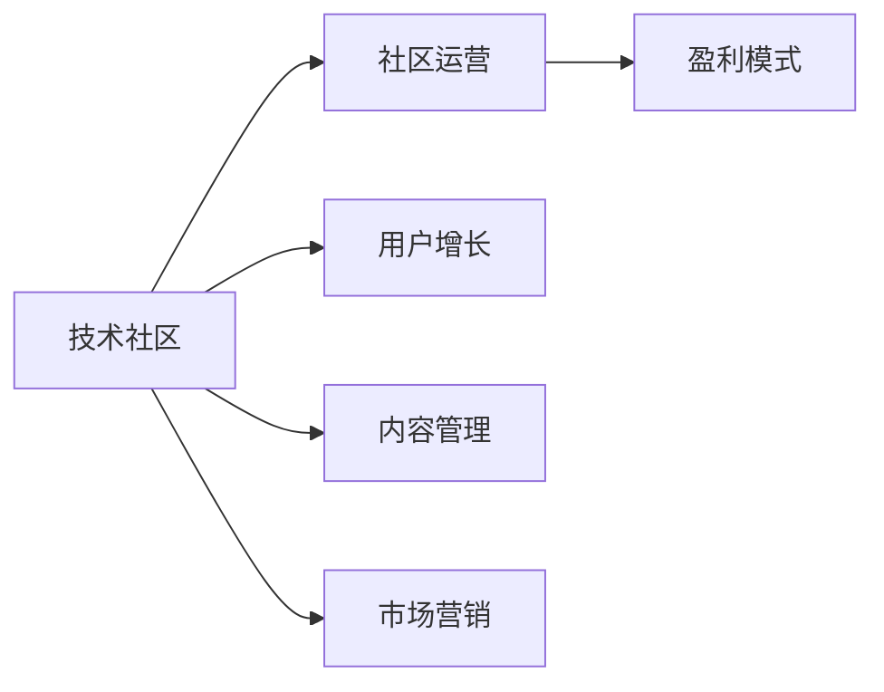
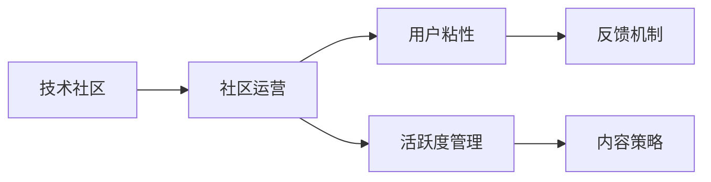
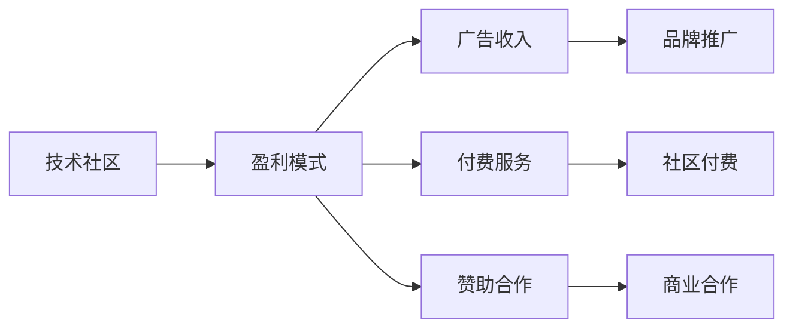
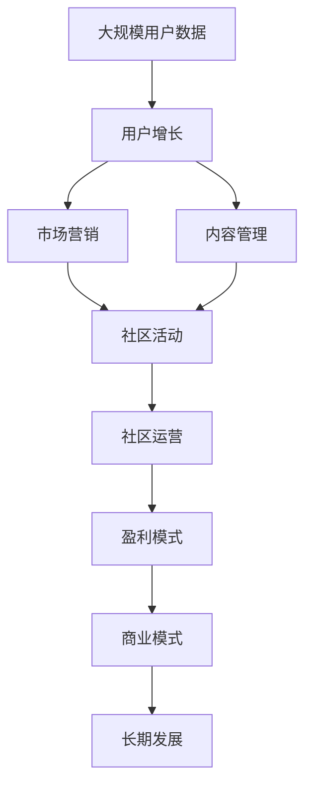

                 

# 技术社区运营：从管理到盈利模式

> 关键词：技术社区,运营管理,盈利模式,用户增长,市场营销,内容管理

## 1. 背景介绍

### 1.1 问题由来
在互联网时代，技术社区已成为连接开发者、企业、教育机构等各方的重要桥梁。技术社区不仅提供交流平台，还推动技术知识的传播、应用，促进技术生态的繁荣发展。然而，如何构建一个成功且持续运营的技术社区，并实现盈利，是许多社区运营者面临的共同挑战。

### 1.2 问题核心关键点
构建和运营一个成功技术社区的关键点包括：
1. **目标明确**：清晰定义社区的使命、愿景和核心价值。
2. **用户需求**：精准定位用户需求，提供有价值的服务和内容。
3. **活跃度管理**：保持社区活跃，增加用户粘性。
4. **商业模式**：探索和实施可持续的盈利模式。
5. **社区文化**：培养和维护良好的社区文化和氛围。

### 1.3 问题研究意义
研究技术社区的运营和管理模式，对于提升社区活跃度、扩大用户基础、实现商业变现具有重要意义。技术社区的成功不仅为开发者提供了一个高质量的交流平台，也为行业带来了创新和合作机会，是推动技术发展和社会进步的重要力量。

## 2. 核心概念与联系

### 2.1 核心概念概述

为更好地理解技术社区运营和管理，本节将介绍几个核心概念：

- **技术社区（Technical Community）**：以技术交流和知识分享为主要目标，聚集大量技术开发者、专家和爱好者，提供交流平台和资源分享的网络社区。

- **社区运营（Community Operation）**：通过一系列策略和措施，保障社区的活跃度和稳定性，促进技术知识的传播和应用，吸引和留存用户的过程。

- **盈利模式（Revenue Model）**：技术社区通过提供服务、广告、会员费等方式，实现收入的可持续增长的模式。

- **用户增长（User Growth）**：通过有效的市场营销、社区活动等手段，增加社区用户的数量和活跃度。

- **内容管理（Content Management）**：制定和实施内容策略，确保社区内容的质量和多样性，提升用户满意度和忠诚度。

- **市场营销（Marketing）**：利用各种渠道和手段，推广社区品牌，吸引潜在用户，提高社区知名度和影响力。

这些核心概念之间的关系可以通过以下Mermaid流程图来展示：



这个流程图展示了技术社区的核心概念及其之间的关系：

1. 技术社区通过社区运营保障活跃度和稳定性，吸引和留存用户。
2. 社区运营依赖于用户增长和内容管理策略。
3. 市场营销助力社区提升知名度，吸引新用户。
4. 盈利模式通过服务、广告等手段实现商业变现，支持社区的长期发展。

### 2.2 概念间的关系

这些核心概念之间存在着紧密的联系，形成了技术社区运营的整体生态系统。下面我通过几个Mermaid流程图来展示这些概念之间的关系。

#### 2.2.1 社区运营与管理



这个流程图展示了社区运营的主要管理活动：

1. 社区运营通过提升用户粘性和管理活跃度，保障社区的健康发展。
2. 用户粘性和活跃度管理依赖于合理的反馈机制和有效的用户互动。
3. 内容策略是活跃度和用户粘性的重要保障。

#### 2.2.2 盈利模式选择



这个流程图展示了常见的盈利模式及其应用：

1. 社区运营通过多种盈利模式，如广告、付费服务、赞助合作等，实现商业变现。
2. 不同的盈利模式适用于不同的用户群体和社区特色。
3. 盈利模式的灵活选择和组合，可以提升社区的可持续性。

### 2.3 核心概念的整体架构

最后，我们用一个综合的流程图来展示这些核心概念在大规模运营中的整体架构：



这个综合流程图展示了从用户增长到盈利模式的完整流程：

1. 大规模用户数据为社区运营提供了基础。
2. 用户增长和市场营销为社区运营提供动力。
3. 内容管理为社区运营提供核心支持。
4. 社区运营通过多种策略保障社区的长期发展。
5. 盈利模式为社区的长期发展提供保障。

通过这些流程图，我们可以更清晰地理解技术社区运营过程中各个环节的逻辑关系，为后续深入讨论具体的运营策略和技术实践奠定基础。

## 3. 核心算法原理 & 具体操作步骤

### 3.1 算法原理概述

技术社区的运营和管理，本质上是数据驱动的决策过程。运营者通过收集、分析和利用用户行为数据，不断调整和优化运营策略，以提升用户满意度和社区活跃度，最终实现盈利目标。

### 3.2 算法步骤详解

技术社区的运营和管理主要包括以下几个关键步骤：

**Step 1: 用户行为分析**

- **收集数据**：通过用户注册、登录、互动、贡献内容等行为数据，收集社区内的用户信息。
- **数据清洗**：对收集的数据进行去重、去噪、处理缺失值等预处理操作，确保数据的准确性和完整性。
- **数据分析**：利用数据挖掘、统计分析等方法，从数据中提取有价值的信息和洞见，指导社区运营策略的制定。

**Step 2: 用户增长策略**

- **渠道分析**：识别社区的主要用户来源渠道，评估各渠道的转化率和用户质量。
- **营销策略**：根据渠道分析结果，制定针对不同渠道的营销策略，如SEO优化、社交媒体营销、邮件营销等。
- **活动策划**：组织和策划社区活动，如技术分享会、技术竞赛、直播讲座等，吸引和留存用户。

**Step 3: 内容管理**

- **内容策略**：制定内容策略，确保社区内容的多样性和高质量，吸引用户关注和参与。
- **内容审核**：建立和维护严格的内容审核机制，确保内容的合规性和可信度。
- **用户激励**：设计并实施用户激励机制，如积分奖励、徽章制度、排名机制等，鼓励用户积极贡献内容。

**Step 4: 社区运营**

- **互动管理**：通过在线聊天、论坛讨论、技术问答等形式，加强用户之间的互动和交流。
- **用户反馈**：建立和维护用户反馈机制，收集用户意见和建议，持续改进社区服务。
- **问题处理**：快速响应和处理用户投诉和问题，提升用户体验。

**Step 5: 盈利模式探索**

- **广告收入**：在社区内植入广告，通过展示广告、横幅广告等方式实现收入。
- **付费服务**：提供高级会员、专家咨询、专业培训等付费服务，提升社区的盈利能力。
- **赞助合作**：与企业和技术公司合作，获取赞助和广告资源，提升社区的品牌影响力。

通过以上步骤，运营者可以系统地管理和运营技术社区，提升用户满意度和社区活跃度，最终实现商业变现的目标。

### 3.3 算法优缺点

技术社区的运营和管理方法具有以下优点：

1. **数据驱动**：通过分析用户行为数据，可以精准定位用户需求，制定有效的运营策略。
2. **可操作性强**：各项运营策略和措施具有明确的操作流程，易于实施和评估。
3. **效果显著**：通过数据驱动的决策，可以快速调整和优化运营策略，提升用户满意度和社区活跃度。

同时，该方法也存在以下缺点：

1. **数据依赖**：对数据的收集和分析能力要求较高，数据质量不佳可能导致决策失误。
2. **成本较高**：大规模数据分析和用户运营需要投入大量人力和时间成本。
3. **灵活性不足**：过度依赖数据驱动可能导致策略过于保守，缺乏创新和灵活性。

尽管存在这些局限性，但数据驱动的方法仍然是技术社区运营的主流范式，在实践中得到了广泛应用。

### 3.4 算法应用领域

技术社区的运营和管理方法广泛应用于各个领域，包括：

1. **开源社区**：如GitHub、Stack Overflow等，通过数据分析、用户激励等方式，保持社区的活跃度，吸引开发者贡献代码和参与讨论。
2. **技术论坛**：如CSDN、知乎等，通过内容管理和用户互动，提供高质量的技术交流平台。
3. **技术博客**：如Medium、博客园等，通过文章质量和用户互动，吸引和留存用户，提升品牌影响力。
4. **技术培训平台**：如Udacity、Coursera等，通过内容管理和付费服务，提供高质量的技术培训课程。

## 4. 数学模型和公式 & 详细讲解 & 举例说明

### 4.1 数学模型构建

技术社区的运营和管理可以构建如下数学模型：

设社区用户数为 $N$，平均活跃用户数为 $A$，新增用户数为 $G$，用户流失率为 $R$，社区活跃度为 $B$。则有：

$$
N = A + G - R
$$

其中，用户活跃度 $B$ 可以通过社区互动率、内容贡献率等指标衡量。

社区运营的目标是最大化 $A$，即保持社区用户的活跃度。为此，我们需要调整和优化各项运营策略，以提升 $A$ 的值。

### 4.2 公式推导过程

设社区的日活跃用户数为 $B$，则社区的日新增用户数 $G$ 和日流失用户数 $R$ 可以通过以下公式推导：

$$
G = \sum_{i=1}^{D} I(x_i > threshold)
$$

$$
R = \sum_{i=1}^{D} I(x_i < threshold)
$$

其中，$x_i$ 表示第 $i$ 天的用户活跃度，$threshold$ 为设定的活跃度阈值。

通过这些公式，我们可以计算出社区的日新增用户数和日流失用户数，从而评估社区的用户增长和流失情况。

### 4.3 案例分析与讲解

以GitHub为例，GitHub通过收集用户行为数据，利用机器学习模型分析用户活跃度，制定了多项运营策略：

1. **用户增长策略**：GitHub通过社交媒体广告、邮件营销、开源项目推广等方式，吸引新用户注册和参与社区。
2. **内容管理**：GitHub通过代码审查、贡献者表彰、高质量问题标签等方式，鼓励开发者贡献高质量的内容。
3. **社区运营**：GitHub通过在线聊天、问题反馈、技术问答等方式，加强用户之间的互动和交流。

通过这些策略，GitHub不仅保持了庞大的用户基础，还持续吸引高质量的开发者和项目，成为全球最大的开源社区之一。

## 5. 项目实践：代码实例和详细解释说明

### 5.1 开发环境搭建

在进行社区运营和管理实践前，我们需要准备好开发环境。以下是使用Python进行数据分析和建模的环境配置流程：

1. 安装Anaconda：从官网下载并安装Anaconda，用于创建独立的Python环境。

2. 创建并激活虚拟环境：
```bash
conda create -n pydata-env python=3.8 
conda activate pydata-env
```

3. 安装相关依赖：
```bash
conda install pandas numpy scikit-learn matplotlib seaborn
```

4. 配置Jupyter Notebook：
```bash
jupyter labextension install widgets-extension
```

完成上述步骤后，即可在`pydata-env`环境中开始社区运营和管理的实践。

### 5.2 源代码详细实现

这里我们以社区活跃度的分析为例，给出使用Pandas库进行数据分析的Python代码实现。

首先，加载社区用户行为数据：

```python
import pandas as pd

# 读取用户行为数据
user_data = pd.read_csv('user_data.csv')

# 显示数据集前几行
user_data.head()
```

然后，统计每天的新增用户数和流失用户数：

```python
# 计算每天的新增用户数和流失用户数
user_data['user_id'] = user_data['user_id'].apply(lambda x: int(x.split('_')[0]))
user_data['create_date'] = pd.to_datetime(user_data['create_date'])
user_data['last_active_date'] = pd.to_datetime(user_data['last_active_date'])

# 统计每天的活跃用户数和新增用户数
daily_active = user_data.groupby('create_date')['last_active_date'].count()
daily_signup = user_data.groupby('create_date')['last_active_date'].nunique()
```

接着，绘制用户活跃度的变化趋势：

```python
import matplotlib.pyplot as plt

# 绘制用户活跃度变化趋势
plt.figure(figsize=(10, 5))
plt.plot(daily_signup, label='Daily Signups')
plt.plot(daily_active, label='Daily Active')
plt.xlabel('Date')
plt.ylabel('Number of Users')
plt.legend()
plt.show()
```

最后，分析用户流失的原因：

```python
# 分析用户流失的原因
user流失原因 = user_data[user_data['last_active_date'] < pd.to_datetime('2023-01-01')]
print(user流失原因.describe())
```

以上就是使用Pandas库进行社区运营数据分析的完整代码实现。

### 5.3 代码解读与分析

让我们再详细解读一下关键代码的实现细节：

**用户数据加载**：
- 通过`pd.read_csv`函数读取社区用户行为数据，存储在`user_data`数据框中。
- 显示数据框的前几行，便于初步了解数据结构和内容。

**用户行为处理**：
- 使用`lambda`函数将用户ID和活跃日期转换为整数和日期类型，方便后续的统计和绘图。
- 使用`groupby`函数按照创建日期分组，统计每天的活跃用户数和新增用户数。

**用户活跃度分析**：
- 使用`plt.plot`函数绘制用户活跃度的变化趋势图，横轴为日期，纵轴为活跃用户数。
- 使用`user流失原因`切片，分析用户流失的原因，如活跃度下降、注册时间较久等。

通过上述代码实现，可以看出数据分析在社区运营中的应用，可以实时监控和评估社区的用户行为和活跃度，为运营决策提供依据。

## 6. 实际应用场景

### 6.1 用户增长

技术社区的运营离不开用户增长。通过精准定位目标用户和市场，制定有效的营销策略，可以显著提升社区的用户基础。

以Stack Overflow为例，Stack Overflow通过以下策略实现用户增长：

1. **精准定位**：聚焦于程序员和软件开发领域的用户，避免泛泛而谈。
2. **内容吸引**：提供高质量的技术问答和文章，解决用户实际问题，提升用户满意度。
3. **市场营销**：通过SEO优化、社交媒体营销、合作推广等方式，提升社区的知名度和影响力。

通过这些策略，Stack Overflow吸引了大量高质量的开发者和技术爱好者，成为全球知名的技术问答社区。

### 6.2 内容管理

内容管理是技术社区运营的核心。高质量的内容不仅能够吸引用户，还能提升社区的品牌价值和影响力。

以CSDN为例，CSDN通过以下策略实现内容管理：

1. **内容策略**：制定严格的内容审核机制，确保内容的高质量和合规性。
2. **用户激励**：提供积分奖励、徽章制度、排名机制等，激励用户积极贡献高质量内容。
3. **社区互动**：通过在线聊天、技术问答、技术讨论等方式，促进用户之间的互动和交流。

通过这些策略，CSDN吸引了大量开发者和内容创作者，成为国内最大的技术社区之一。

### 6.3 社区运营

社区运营是保持社区活跃度的关键。通过有效的互动和反馈机制，提升用户的满意度和粘性，能够保持社区的长期稳定发展。

以博客园为例，博客园通过以下策略实现社区运营：

1. **互动管理**：提供在线聊天、技术问答、技术讨论等功能，加强用户之间的互动和交流。
2. **用户反馈**：建立和维护用户反馈机制，及时响应和处理用户意见和建议。
3. **问题处理**：快速响应和处理用户投诉和问题，提升用户体验。

通过这些策略，博客园保持了庞大的用户基础，成为国内最具影响力的技术社区之一。

## 7. 工具和资源推荐

### 7.1 学习资源推荐

为了帮助开发者系统掌握技术社区运营的理论基础和实践技巧，这里推荐一些优质的学习资源：

1. **《社区运营的艺术》（《The Art of Community Operation》）**：详细介绍了社区运营的基本概念、策略和技巧，适用于社区运营的入门学习。

2. **Coursera的社区运营课程**：由知名高校和公司提供，涵盖社区运营的基本原理和实战案例，适合系统学习。

3. **Medium社区的运营博客**：Medium社区提供大量的运营策略和实践案例，是学习社区运营的宝贵资源。

4. **《社区管理与运营》（《Community Management and Operation》）**：介绍社区管理的各个方面，如用户增长、内容管理、社区运营等，适用于系统学习。

5. **Kaggle社区运营竞赛**：参加Kaggle的社区运营竞赛，实践数据分析和运营策略，提升实战能力。

通过对这些资源的学习实践，相信你一定能够快速掌握技术社区运营的精髓，并用于解决实际的社区运营问题。

### 7.2 开发工具推荐

高效的开发离不开优秀的工具支持。以下是几款用于技术社区运营开发的常用工具：

1. **Pandas**：数据处理和分析库，支持高效的数据处理和数据分析，适用于社区运营的数据分析。

2. **Matplotlib**：数据可视化库，支持各种图表的绘制，适用于社区运营的数据可视化。

3. **Jupyter Notebook**：交互式编程环境，支持数据分析和可视化的快速迭代，适用于社区运营的开发和实验。

4. **Trello**：项目管理工具，支持任务分配和进度跟踪，适用于社区运营的项目管理和协调。

5. **Slack**：即时通信工具，支持团队协作和沟通，适用于社区运营的内部沟通和项目管理。

合理利用这些工具，可以显著提升技术社区运营的效率和质量，加快创新迭代的步伐。

### 7.3 相关论文推荐

技术社区的运营和管理依赖于多种学科的知识，如数据科学、市场营销、心理学等。以下是几篇相关领域的经典论文，推荐阅读：

1. **《社区用户行为分析与建模》（《Community User Behavior Analysis and Modeling》）**：介绍了社区用户行为数据分析的方法和策略。

2. **《社区运营策略与绩效评估》（《Community Operation Strategies and Performance Evaluation》）**：分析了社区运营策略对用户活跃度的影响。

3. **《社区管理与运营的心理学视角》（《Psychological Perspectives of Community Management and Operation》）**：探讨了社区管理中的人际互动和心理因素。

4. **《社交媒体营销与社区运营》（《Social Media Marketing and Community Operation》）**：介绍了社交媒体营销在社区运营中的应用。

5. **《大数据与社区运营的实践》（《Big Data and Community Operation Practice》）**：分析了大数据技术在社区运营中的应用，如用户行为分析、营销策略等。

这些论文代表了大数据、社区运营、市场营销等领域的最新研究成果，是深入理解技术社区运营的重要参考。

除上述资源外，还有一些值得关注的前沿资源，帮助开发者紧跟技术社区运营的最新进展，例如：

1. **社区运营会议和论坛**：如Meetup、CSDN开发者大会等，可以听取业界专家分享社区运营的经验和洞见。

2. **社区运营博客和文章**：如Medium、博客园等平台，提供大量的社区运营实践案例和心得。

3. **社区运营书籍和报告**：如《社区运营之道》、《社区运营管理》等，涵盖社区运营的各个方面，提供系统的理论支持。

总之，对于技术社区运营技术的学习和实践，需要开发者保持开放的心态和持续学习的意愿。多关注前沿资讯，多动手实践，多思考总结，必将收获满满的成长收益。

## 8. 总结：未来发展趋势与挑战

### 8.1 总结

本文对技术社区运营和管理的核心概念、原理和操作步骤进行了全面系统的介绍。首先阐述了技术社区的目标、核心价值和关键运营环节，明确了社区运营的必要性和挑战。其次，从原理到实践，详细讲解了社区运营的数据驱动方法和核心算法，给出了社区运营的完整代码实例。同时，本文还探讨了社区运营在用户增长、内容管理、社区运营等方面的应用，展示了社区运营的广阔前景。此外，本文精选了社区运营的相关学习资源、开发工具和经典论文，力求为读者提供全方位的技术指引。

通过本文的系统梳理，可以看到，技术社区运营是社区运营和管理的重要分支，其成功的关键在于精准定位用户需求、制定有效的运营策略、保障社区的活跃度和稳定性。社区运营不仅能够推动技术知识的传播和应用，还能实现商业变现，对技术生态的发展具有重要意义。

### 8.2 未来发展趋势

展望未来，技术社区的运营和管理将呈现以下几个发展趋势：

1. **数据驱动**：随着数据量的不断增加，数据驱动的运营策略将更加精准和高效。大数据、人工智能等技术的应用，将进一步提升社区运营的自动化和智能化水平。

2. **用户体验优化**：用户体验是社区运营的关键指标。未来社区运营将更加注重用户需求和体验的提升，通过个性化推荐、用户激励等方式，提升用户满意度和粘性。

3. **多渠道营销**：社区运营将更多地利用社交媒体、搜索引擎、内容平台等渠道，提升社区的知名度和影响力。

4. **内容生态建设**：社区运营将更加注重内容的生态建设，通过高质量的内容吸引和留存用户，形成良性互动和知识共享。

5. **社区自治化**：社区运营将更多地依赖用户自治，如用户评选、社区活动等，提升用户的参与感和社区的活跃度。

以上趋势凸显了技术社区运营的未来发展方向，这些方向的探索发展，必将进一步提升社区的可持续性和用户满意度。

### 8.3 面临的挑战

尽管技术社区的运营和管理技术已经取得了显著进展，但在迈向更加智能化、普适化应用的过程中，仍面临诸多挑战：

1. **数据质量**：社区运营依赖于高质量的数据，数据收集、清洗和分析的复杂性和成本较高，数据质量不佳可能导致决策失误。

2. **用户多样性**：社区运营需要针对不同用户群体制定差异化的策略，如何有效覆盖和满足多样化的用户需求，是社区运营的一大挑战。

3. **技术门槛**：社区运营需要运用多种技术和工具，对技术水平和资源投入有较高要求，小型社区难以全面掌握。

4. **运营成本**：社区运营需要投入大量人力、时间和资源，成本较高，如何平衡成本和收益，是社区运营的重要课题。

5. **用户行为变化**：用户行为和需求的变化较快，如何灵活调整和优化运营策略，保持社区的长期发展，是社区运营的持续挑战。

正视社区运营面临的这些挑战，积极应对并寻求突破，将使社区运营走向更加成熟和可持续。

### 8.4 研究展望

面对社区运营面临的挑战，未来的研究需要在以下几个方面寻求新的突破：

1. **数据自动化采集和处理**：利用机器学习和数据自动化技术，提升数据收集和处理的效率和质量，降低运营成本。

2. **用户行为预测**：利用人工智能和大数据分析技术，预测用户行为和需求，提升社区运营的精准度和效率。

3. **用户激励机制设计**：设计更加公平、多样化的用户激励机制，激发用户的积极性和参与感，提升社区的活跃度和用户粘性。

4. **社区自治化机制**：建立和完善社区自治机制，如用户评选、社区活动等，提升用户的参与感和社区的自治水平。

5. **多渠道融合**：利用多种渠道和技术手段，提升社区的曝光度和影响力，形成多渠道、多层次的运营模式。

6. **用户体验优化**：通过个性化推荐、用户反馈机制等方式，提升用户体验，增强用户的满意度和忠诚度。

这些研究方向将为技术社区的运营和管理提供新的思路和方法，推动社区运营技术的不断进步。

## 9. 附录：常见问题与解答

**Q1：如何提高技术社区的活跃度？**

A: 提高技术社区的活跃度主要依赖以下策略：
1. **高质量内容**：提供有价值、实用性强的内容，吸引用户关注和参与。
2. **用户互动**：建立和维护用户互动机制，如在线聊天、技术问答、技术讨论等，增强用户之间的互动。
3. **用户激励**：设计并实施用户激励机制，如积分奖励、徽章制度、排名机制等，鼓励用户积极贡献内容。
4. **社区活动**：组织和策划社区活动，如技术分享会、技术竞赛、直播讲座等，吸引和留存用户。

**Q2：如何平衡社区运营的成本和收益？**

A: 平衡社区运营的成本和收益主要依赖以下策略：
1. **精准定位**：精准定位目标用户和市场，避免泛泛而谈，提高运营效率。
2. **自动化运营**：利用机器学习和数据自动化技术，提升数据收集和处理的效率和质量，降低运营成本。
3. **多渠道营销**

