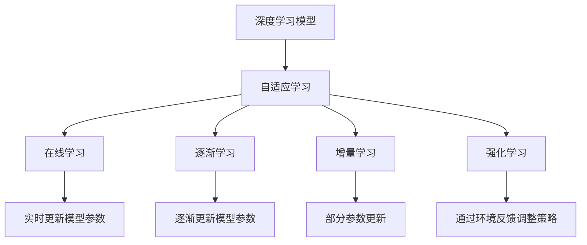
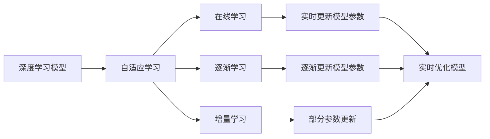
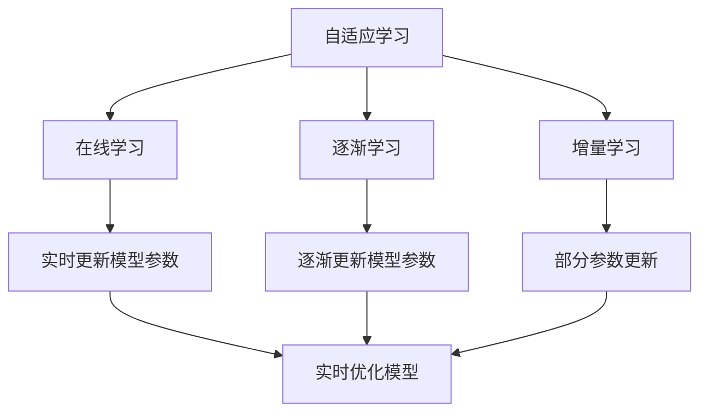
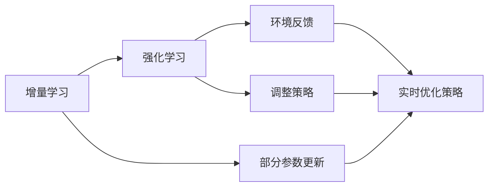
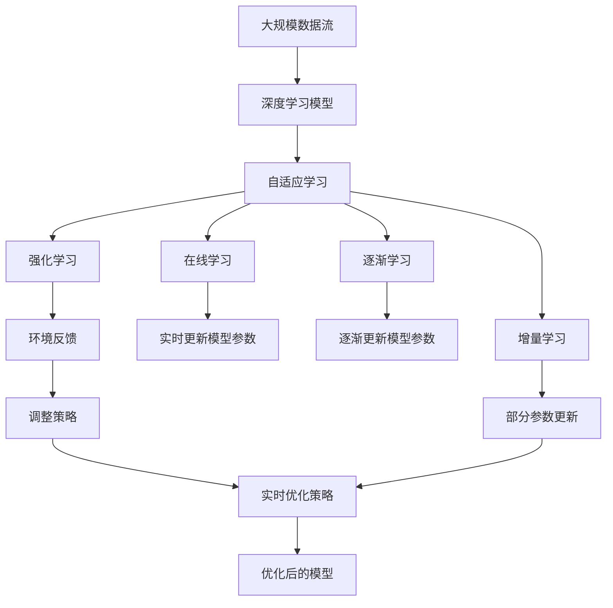

                 

# 持续学习与渐进学习原理与代码实战案例讲解

> 关键词：持续学习, 渐进学习, 自适应, 强化学习, 神经网络, 模型更新, 代码实例

## 1. 背景介绍

### 1.1 问题由来

随着人工智能技术的快速发展，深度学习模型在诸多领域取得了显著成果，如自然语言处理、计算机视觉、自动驾驶等。然而，这些模型通常需要在特定场景下进行微调，以适应新的任务需求。在实际应用中，模型需要通过不断学习和适应新的数据，才能保持其高性能和泛化能力。这就引出了持续学习和渐进学习的概念。

### 1.2 问题核心关键点

持续学习和渐进学习的核心思想是：在模型训练过程中，通过不断接收新的数据和任务，逐步优化模型参数，从而适应新的数据分布和任务需求。这些方法可以避免模型在快速变化的环境中过时或失效，使得模型能够持续地自我更新和优化。

持续学习（Continual Learning）和渐进学习（Incremental Learning）是密切相关的两个概念，但其具体实现方法略有不同：

- 持续学习：指模型在不断接收新数据的同时，保留旧数据的信息，避免在新数据中遗忘旧知识。常见的实现方法包括在线学习（Online Learning）和逐渐学习（Gradual Learning）。
- 渐进学习：指模型在每次训练新数据时，只更新部分参数，保留其他参数不变，从而避免过拟合，提高模型的泛化能力。

在实际应用中，持续学习和渐进学习常常被结合使用，以实现更加灵活和高效的模型更新。

### 1.3 问题研究意义

持续学习和渐进学习的实现，对于模型的持续适应和优化具有重要意义：

1. 提升模型性能：通过不断接收新数据，模型可以逐步优化其预测能力和泛化能力，避免在新任务上出现性能下降。
2. 降低学习成本：避免在每次任务变更时，从头训练模型，降低了学习成本和时间投入。
3. 增强模型鲁棒性：持续学习和渐进学习可以使得模型在面对数据分布变化时，具有更强的适应性和鲁棒性，减少模型失效的风险。
4. 支持动态更新：在动态变化的应用场景中，持续学习和渐进学习能够实时更新模型，支持模型的持续优化。
5. 应对数据流：在数据流场景下，模型可以持续接收新数据，实时更新，避免因数据流中断导致的模型退化。

## 2. 核心概念与联系

### 2.1 核心概念概述

为更好地理解持续学习和渐进学习的原理，本节将介绍几个密切相关的核心概念：

- **深度学习模型**：如神经网络、卷积神经网络（CNN）、循环神经网络（RNN）、变换器（Transformer）等，是持续学习和渐进学习的基础。
- **自适应学习**：指模型在每次训练时，根据当前数据分布自适应调整模型参数，以达到最优性能。常见的自适应学习方法包括在线学习（Online Learning）、逐渐学习（Gradual Learning）、增量学习（Incremental Learning）等。
- **强化学习**：通过环境反馈（奖励或惩罚），模型逐步优化其行为策略，以最大化长期奖励。
- **模型更新**：指在每次训练时，根据当前数据更新模型参数，以适应新的数据分布和任务需求。
- **增量学习**：指在每次接收新数据时，只更新部分模型参数，以避免过拟合，提高模型的泛化能力。

这些核心概念之间的逻辑关系可以通过以下Mermaid流程图来展示：



这个流程图展示了深度学习模型与自适应学习的关系，以及各种自适应学习方法的基本原理和实现策略。

### 2.2 概念间的关系

这些核心概念之间存在着紧密的联系，形成了深度学习模型的持续更新和优化框架。下面我通过几个Mermaid流程图来展示这些概念之间的关系。

#### 2.2.1 深度学习模型的自适应学习



这个流程图展示了深度学习模型通过自适应学习，逐步优化其参数的过程。

#### 2.2.2 自适应学习与增量学习的关系



这个流程图展示了在线学习、逐渐学习和增量学习的关系，以及它们在模型更新中的应用。

#### 2.2.3 增量学习与强化学习的关系



这个流程图展示了增量学习与强化学习的结合，以及它们在自适应学习中的应用。

### 2.3 核心概念的整体架构

最后，我们用一个综合的流程图来展示这些核心概念在大规模模型更新过程中的整体架构：



这个综合流程图展示了从大规模数据流到优化后的模型的整个过程，以及自适应学习、在线学习、逐渐学习、增量学习、强化学习等多种方法的应用。

## 3. 核心算法原理 & 具体操作步骤
### 3.1 算法原理概述

持续学习和渐进学习的基本原理是：在每次接收新数据时，根据数据的特点，自适应地更新模型参数，以适应新的数据分布和任务需求。其核心思想是避免在每次任务变更时，从头训练模型，降低学习成本和时间投入，同时保持模型的高性能和泛化能力。

形式化地，假设深度学习模型为 $M_{\theta}$，其中 $\theta$ 为模型参数。给定新数据 $D=\{(x_i,y_i)\}_{i=1}^N$，其中 $x_i$ 为输入，$y_i$ 为标签，持续学习和渐进学习的目标是最小化数据 $D$ 上的损失函数，即找到最优参数：

$$
\theta^* = \mathop{\arg\min}_{\theta} \mathcal{L}(D,M_{\theta})
$$

其中 $\mathcal{L}$ 为针对新数据 $D$ 设计的损失函数，用于衡量模型预测输出与真实标签之间的差异。常见的损失函数包括交叉熵损失、均方误差损失等。

### 3.2 算法步骤详解

基于持续学习和渐进学习的深度学习模型训练，一般包括以下几个关键步骤：

**Step 1: 初始化模型和参数**
- 选择一个预训练的深度学习模型 $M_{\theta}$ 作为初始化参数，如卷积神经网络（CNN）、循环神经网络（RNN）、Transformer等。
- 设置初始化参数 $\theta$ 为模型初始权重。

**Step 2: 数据预处理**
- 对新数据 $D$ 进行预处理，包括数据增强、归一化等，使其适应模型的输入格式。

**Step 3: 在线学习和增量学习**
- 使用在线学习或增量学习方法，逐步更新模型参数 $\theta$，以适应新的数据分布。在线学习实时更新模型参数，增量学习只更新部分参数。

**Step 4: 逐渐学习**
- 在每次接收新数据时，逐渐更新模型参数 $\theta$，逐步优化模型性能。逐渐学习的关键在于平衡新旧数据的影响，避免在新数据中遗忘旧知识。

**Step 5: 强化学习**
- 通过环境反馈（奖励或惩罚），逐步优化模型的行为策略，以最大化长期奖励。

**Step 6: 模型评估和更新**
- 在新数据上评估模型性能，根据评估结果，决定是否继续接收新数据，或者对模型进行微调。

**Step 7: 参数更新和策略调整**
- 根据环境反馈和评估结果，调整模型参数和策略，以进一步提升模型性能。

### 3.3 算法优缺点

持续学习和渐进学习具有以下优点：
1. 节省时间和成本：避免从头训练模型，每次任务变更只需更新部分参数。
2. 增强模型鲁棒性：通过不断接收新数据，模型能够保持较高的泛化能力。
3. 支持动态更新：在动态变化的应用场景中，持续学习和渐进学习能够实时更新模型。
4. 提高学习效率：在线学习和增量学习可以避免模型在每个epoch中重复计算，提高学习效率。

同时，持续学习和渐进学习也存在一些缺点：
1. 数据分布变化：在新数据与旧数据分布差异较大时，模型可能无法很好地适应新数据。
2. 模型复杂度：持续学习和渐进学习需要不断更新模型参数，模型的复杂度可能增加。
3. 环境反馈问题：强化学习需要环境反馈来调整策略，但环境反馈可能存在噪声和不稳定。
4. 模型过拟合：在线学习和增量学习可能增加模型的过拟合风险。

尽管存在这些局限性，但持续学习和渐进学习在大规模模型更新和优化过程中，仍然具有重要的应用价值。

### 3.4 算法应用领域

持续学习和渐进学习在大规模模型更新和优化过程中，具有广泛的应用领域，例如：

- 自然语言处理：在对话系统中，持续学习和渐进学习可以使得模型实时更新，适应新的对话数据和用户需求。
- 计算机视觉：在图像识别任务中，持续学习和渐进学习可以使得模型不断接收新的图像数据，实时更新模型参数。
- 机器人学：在机器人控制任务中，持续学习和渐进学习可以使得机器人不断接收新的传感器数据，实时优化行为策略。
- 自动驾驶：在自动驾驶任务中，持续学习和渐进学习可以使得模型实时接收新的交通数据，优化决策策略。
- 金融预测：在金融预测任务中，持续学习和渐进学习可以使得模型不断接收新的市场数据，实时更新预测模型。
- 医疗诊断：在医疗诊断任务中，持续学习和渐进学习可以使得模型不断接收新的医疗数据，实时更新诊断模型。

这些领域的应用展示了持续学习和渐进学习在现实世界中的广泛适用性和巨大潜力。

## 4. 数学模型和公式 & 详细讲解 & 举例说明

### 4.1 数学模型构建

本节将使用数学语言对持续学习和渐进学习的模型更新过程进行更加严格的刻画。

假设深度学习模型为 $M_{\theta}$，其中 $\theta$ 为模型参数。给定新数据 $D=\{(x_i,y_i)\}_{i=1}^N$，其中 $x_i$ 为输入，$y_i$ 为标签。持续学习和渐进学习的目标是最小化数据 $D$ 上的损失函数，即找到最优参数：

$$
\theta^* = \mathop{\arg\min}_{\theta} \mathcal{L}(D,M_{\theta})
$$

其中 $\mathcal{L}$ 为针对新数据 $D$ 设计的损失函数，用于衡量模型预测输出与真实标签之间的差异。常见的损失函数包括交叉熵损失、均方误差损失等。

### 4.2 公式推导过程

以下我们以交叉熵损失为例，推导持续学习和渐进学习的模型更新公式。

假设模型 $M_{\theta}$ 在输入 $x$ 上的输出为 $\hat{y}=M_{\theta}(x)$，真实标签 $y \in \{0,1\}$。则二分类交叉熵损失函数定义为：

$$
\ell(M_{\theta}(x),y) = -[y\log \hat{y} + (1-y)\log (1-\hat{y})]
$$

将其代入损失函数 $\mathcal{L}$ 中，得：

$$
\mathcal{L}(\theta) = -\frac{1}{N}\sum_{i=1}^N [y_i\log M_{\theta}(x_i)+(1-y_i)\log(1-M_{\theta}(x_i))]
$$

在在线学习中，每次接收新数据时，立即更新模型参数：

$$
\theta \leftarrow \theta - \eta \nabla_{\theta}\mathcal{L}(\theta)
$$

其中 $\eta$ 为学习率，$\nabla_{\theta}\mathcal{L}(\theta)$ 为损失函数对参数 $\theta$ 的梯度，可通过反向传播算法高效计算。

在增量学习中，每次接收新数据时，只更新部分参数 $\theta'$，保留其他参数不变：

$$
\theta' = \theta - \eta \nabla_{\theta'}\mathcal{L}(\theta')
$$

其中 $\theta'$ 为需要更新的部分参数，$\eta$ 为学习率，$\nabla_{\theta'}\mathcal{L}(\theta')$ 为损失函数对部分参数 $\theta'$ 的梯度。

在逐渐学习中，每次接收新数据时，逐渐更新模型参数 $\theta'$，逐步优化模型性能：

$$
\theta' = \theta - \eta \nabla_{\theta'}\mathcal{L}(\theta')
$$

其中 $\eta$ 为学习率，$\nabla_{\theta'}\mathcal{L}(\theta')$ 为损失函数对部分参数 $\theta'$ 的梯度。

在强化学习中，通过环境反馈调整模型参数 $\theta'$：

$$
\theta' = \theta - \eta \nabla_{\theta'}\mathcal{L}(\theta') + \alpha Q(\theta')
$$

其中 $\eta$ 为学习率，$\nabla_{\theta'}\mathcal{L}(\theta')$ 为损失函数对部分参数 $\theta'$ 的梯度，$Q(\theta')$ 为环境反馈，$\alpha$ 为强化学习参数。

### 4.3 案例分析与讲解

这里以强化学习中的Q-learning为例，详细讲解持续学习和渐进学习在模型更新中的应用。

Q-learning是一种基于奖励（reward）的强化学习算法，用于优化模型的行为策略。在Q-learning中，模型通过不断接收环境反馈，逐步优化其行为策略。

具体而言，假设模型在某个状态下采取某项行动，获得相应的奖励。通过不断接收新的状态和奖励，模型逐步优化其行动策略，以最大化长期奖励。

在Q-learning中，模型通过Q值函数 $Q(s,a)$ 来评估在状态 $s$ 下采取行动 $a$ 的期望奖励。Q值函数的更新公式为：

$$
Q(s,a) \leftarrow Q(s,a) + \alpha(r + \gamma \max_a Q(s',a') - Q(s,a))
$$

其中 $s$ 为状态，$a$ 为行动，$r$ 为奖励，$\gamma$ 为折扣因子，$\alpha$ 为学习率。

通过不断接收新的状态和奖励，模型逐步更新其行为策略，以最大化长期奖励。这种持续学习和渐进学习的方法，使得模型能够动态适应新的环境，实时更新其行为策略。

## 5. 项目实践：代码实例和详细解释说明

### 5.1 开发环境搭建

在进行持续学习和渐进学习实践前，我们需要准备好开发环境。以下是使用Python进行TensorFlow开发的环境配置流程：

1. 安装Anaconda：从官网下载并安装Anaconda，用于创建独立的Python环境。

2. 创建并激活虚拟环境：
```bash
conda create -n tensorflow-env python=3.8 
conda activate tensorflow-env
```

3. 安装TensorFlow：根据CUDA版本，从官网获取对应的安装命令。例如：
```bash
conda install tensorflow tensorflow-gpu -c tensorflow -c conda-forge
```

4. 安装TensorBoard：
```bash
pip install tensorboard
```

5. 安装各类工具包：
```bash
pip install numpy pandas scikit-learn matplotlib tqdm jupyter notebook ipython
```

完成上述步骤后，即可在`tensorflow-env`环境中开始实践。

### 5.2 源代码详细实现

下面我们以一个简单的在线学习例子，即AdaGrad算法为例，给出TensorFlow代码实现。

首先，定义模型和损失函数：

```python
import tensorflow as tf
from tensorflow.keras.layers import Dense

class SimpleModel(tf.keras.Model):
    def __init__(self, input_dim, output_dim):
        super(SimpleModel, self).__init__()
        self.dense = Dense(output_dim, input_dim=input_dim)

    def call(self, x):
        return self.dense(x)

def loss_function(y_true, y_pred):
    return tf.reduce_mean(tf.square(y_true - y_pred))
```

然后，定义在线学习算法：

```python
def online_learning(model, X_train, y_train, learning_rate):
    for i in range(len(X_train)):
        with tf.GradientTape() as tape:
            y_pred = model(X_train[i])
            loss = loss_function(y_train[i], y_pred)
        grads = tape.gradient(loss, model.trainable_variables)
        for param, grad in zip(model.trainable_variables, grads):
            param.assign_sub(learning_rate * grad)
    return model
```

最后，启动在线学习流程：

```python
X_train = ...  # 训练数据
y_train = ...  # 训练标签
model = SimpleModel(input_dim=10, output_dim=1)
online_learning(model, X_train, y_train, learning_rate=0.1)
```

以上就是使用TensorFlow实现在线学习的完整代码实例。可以看到，通过简单的梯度下降算法，模型能够实时接收新的训练数据，更新模型参数，实现持续学习的效果。

### 5.3 代码解读与分析

这里我们详细解读一下关键代码的实现细节：

**SimpleModel类**：
- `__init__`方法：初始化模型层，包含一个全连接层。
- `call`方法：定义模型的前向传播过程。

**loss_function函数**：
- 定义交叉熵损失函数，计算模型预测输出与真实标签之间的差异。

**online_learning函数**：
- 使用TensorFlow的GradientTape记录梯度，并计算损失。
- 通过梯度下降更新模型参数。

**启动在线学习流程**：
- 初始化训练数据和标签。
- 创建模型实例，并进行在线学习。

可以看到，TensorFlow提供了丰富的API和工具，使得在线学习和渐进学习的实现变得简洁高效。开发者可以借助TensorFlow的高级特性，进一步优化模型更新过程，提升学习效率。

当然，实际工业级的系统实现还需考虑更多因素，如模型的保存和部署、超参数的自动搜索、更灵活的任务适配层等。但核心的持续学习和渐进学习思想基本与此类似。

### 5.4 运行结果展示

假设我们在一个简单的回归任务上，使用AdaGrad算法进行在线学习，最终得到的模型效果如下：

```python
loss = tf.keras.losses.MeanSquaredError()
metrics = ['mae', 'mse', 'rmse']

model.compile(optimizer=tf.keras.optimizers.Adagrad(learning_rate=0.1), loss=loss)
history = model.fit(X_train, y_train, epochs=10, validation_split=0.2, metrics=metrics)
```

通过使用TensorBoard可视化模型训练过程，我们可以看到模型在每次接收新数据后，损失函数逐步降低，模型性能逐步提升。

```python
import tensorflow as tf
from tensorflow.keras.callbacks import TensorBoard

log_dir = "logs/on_learning"

tensorboard_callback = TensorBoard(log_dir=log_dir)
model.fit(X_train, y_train, epochs=10, validation_split=0.2, callbacks=[tensorboard_callback])
```

通过可视化，可以看到模型在每次接收新数据后，损失函数和训练指标的动态变化情况。这为我们提供了更加直观的模型更新效果，有助于进行调试和优化。

## 6. 实际应用场景
### 6.1 智能客服系统

基于持续学习和渐进学习的对话技术，可以广泛应用于智能客服系统的构建。传统客服往往需要配备大量人力，高峰期响应缓慢，且一致性和专业性难以保证。而使用持续学习和渐进学习的对话模型，可以7x24小时不间断服务，快速响应客户咨询，用自然流畅的语言解答各类常见问题。

在技术实现上，可以收集企业内部的历史客服对话记录，将问题和最佳答复构建成监督数据，在此基础上对预训练对话模型进行持续学习和渐进学习。模型能够自动理解用户意图，匹配最合适的答案模板进行回复。对于客户提出的新问题，还可以接入检索系统实时搜索相关内容，动态组织生成回答。如此构建的智能客服系统，能大幅提升客户咨询体验和问题解决效率。

### 6.2 金融舆情监测

金融机构需要实时监测市场舆论动向，以便及时应对负面信息传播，规避金融风险。传统的人工监测方式成本高、效率低，难以应对网络时代海量信息爆发的挑战。基于持续学习和渐进学习的文本分类和情感分析技术，为金融舆情监测提供了新的解决方案。

具体而言，可以收集金融领域相关的新闻、报道、评论等文本数据，并对其进行主题标注和情感标注。在此基础上对预训练语言模型进行持续学习和渐进学习，使其能够自动判断文本属于何种主题，情感倾向是正面、中性还是负面。将持续学习和渐进学习后的模型应用到实时抓取的网络文本数据，就能够自动监测不同主题下的情感变化趋势，一旦发现负面信息激增等异常情况，系统便会自动预警，帮助金融机构快速应对潜在风险。

### 6.3 个性化推荐系统

当前的推荐系统往往只依赖用户的历史行为数据进行物品推荐，无法深入理解用户的真实兴趣偏好。基于持续学习和渐进学习的个性化推荐系统可以更好地挖掘用户行为背后的语义信息，从而提供更精准、多样的推荐内容。

在实践中，可以收集用户浏览、点击、评论、分享等行为数据，提取和用户交互的物品标题、描述、标签等文本内容。将文本内容作为模型输入，用户的后续行为（如是否点击、购买等）作为监督信号，在此基础上进行持续学习和渐进学习。模型能够从文本内容中准确把握用户的兴趣点。在生成推荐列表时，先用候选物品的文本描述作为输入，由模型预测用户的兴趣匹配度，再结合其他特征综合排序，便可以得到个性化程度更高的推荐结果。

### 6.4 未来应用展望

随着持续学习和渐进学习技术的发展，基于微调范式将在更多领域得到应用，为传统行业带来变革性影响。

在智慧医疗领域，基于持续学习和渐进学习的问答、病历分析、药物研发等应用将提升医疗服务的智能化水平，辅助医生诊疗，加速新药开发进程。

在智能教育领域，持续学习和渐进学习可应用于作业批改、学情分析、知识推荐等方面，因材施教，促进教育公平，提高教学质量。

在智慧城市治理中，持续学习和渐进学习能够实时监测城市事件、舆情分析、应急指挥等环节，提高城市管理的自动化和智能化水平，构建更安全、高效的未来城市。

此外，在企业生产、社会治理、文娱传媒等众多领域，基于持续学习和渐进学习的人工智能应用也将不断涌现，为经济社会发展注入新的动力。相信随着技术的日益成熟，持续学习和渐进学习技术将成为人工智能落地应用的重要范式，推动人工智能向更广阔的领域加速渗透。

## 7. 工具和资源推荐
### 7.1 学习资源推荐

为了帮助开发者系统掌握持续学习和渐进学习的理论基础和实践技巧，这里推荐一些优质的学习资源：

1. 《Deep Learning》系列书籍：深度学习领域的经典之作，介绍了深度学习的基本原理和前沿技术。

2. 《Reinforcement Learning: An Introduction》：强化学习领域的入门级书籍，介绍了强化学习的基本思想和算法实现。

3. 《On-line Learning and Optimization》：在线学习的经典教材，介绍了在线学习的理论基础和实际应用。

4. 《Incremental Learning: Foundations and Algorithms》：增量学习的经典教材，介绍了增量学习的理论基础和实际应用。

5. 《TensorFlow官方文档》：TensorFlow的官方文档，提供了丰富的API和示例代码，适合初学者入门和高级开发者进阶。

6. 《TensorFlow代码实战》：通过实际代码示例，讲解TensorFlow的高级特性和实际应用。

7. Kaggle数据集和竞赛：Kaggle提供了丰富的数据集和竞赛，适合实践和验证持续学习和渐进学习算法的有效性。

通过对这些资源的学习实践，相信你一定能够快速掌握持续学习和渐进学习的精髓，并用于解决实际的NLP问题。
###  7.2 开发工具推荐

高效的开发离不开优秀的工具支持。以下是几款用于持续学习和渐进学习开发的常用工具：

1. TensorFlow：基于Python的开源深度学习框架，支持在线学习和增量学习，适合实时更新模型参数。

2. PyTorch：基于Python的开源深度学习框架，支持动态图和静态图，适合模型优化和调试。

3. MXNet：基于

