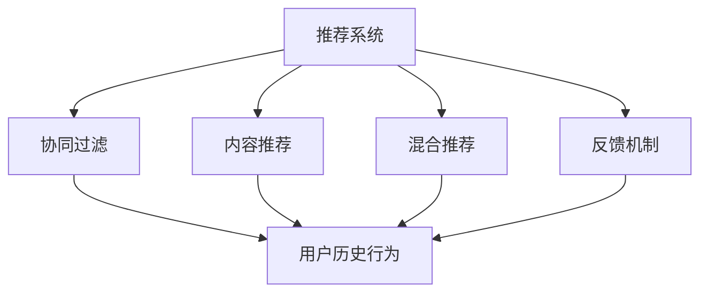
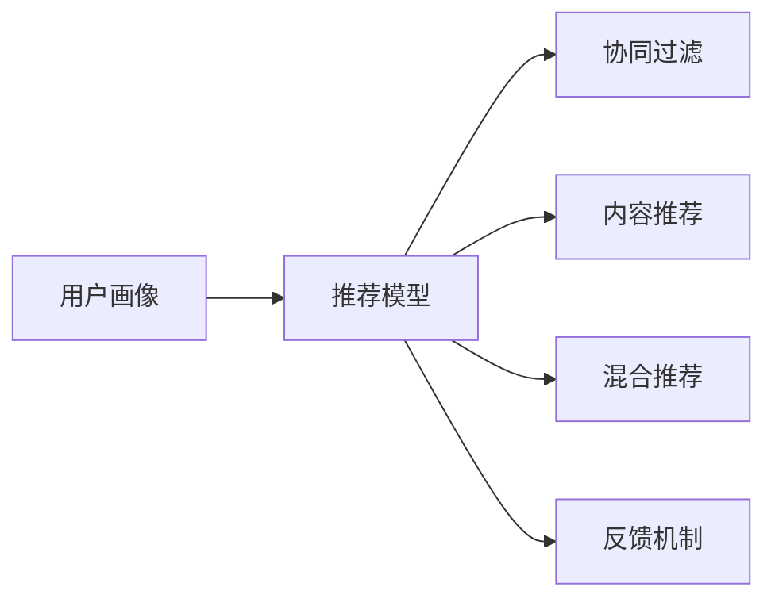
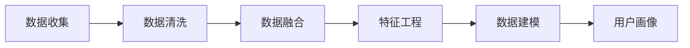
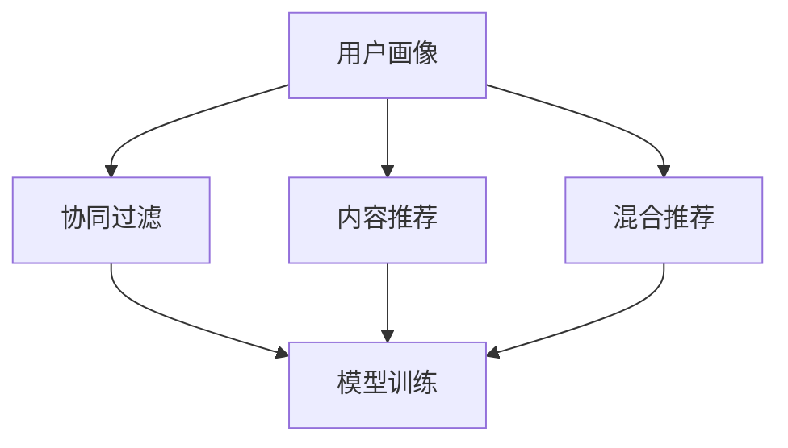
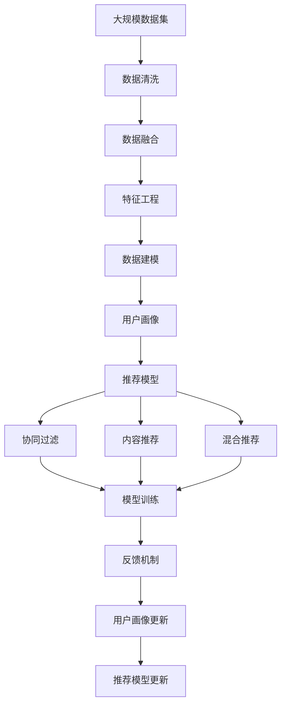

                 

# 推荐系统与用户画像原理与代码实战案例讲解

## 1. 背景介绍

### 1.1 问题由来
推荐系统是互联网时代的重要应用，用户通过推荐系统获取个性化信息和服务，企业通过推荐系统提升用户留存和转化。但传统的推荐系统往往依赖用户历史行为数据，难以深入理解用户真实兴趣和需求。而通过用户画像技术，可以构建用户全景视角，为用户推荐更精准、多样化的内容。

### 1.2 问题核心关键点
推荐系统与用户画像技术的核心关键点在于：

- 用户画像：通过收集和分析用户的多样化数据（如搜索、浏览、购买、社交等行为），构建用户全景画像，理解用户多维度的兴趣偏好、行为模式、生命周期等。
- 推荐算法：基于用户画像和物品特征，通过协同过滤、内容推荐、混合推荐等算法，为每个用户推荐符合其兴趣的个性化内容。
- 反馈机制：通过用户对推荐内容的点击、评价、收藏等行为反馈，不断优化推荐模型和用户画像，实现动态精准推荐。

这些核心技术共同构成了推荐系统和用户画像的全生命周期，为用户和企业创造了巨大的价值。

### 1.3 问题研究意义
深入研究推荐系统和用户画像技术，对于提升用户体验、优化企业运营具有重要意义：

1. 提升用户满意度：通过个性化推荐，帮助用户发现更多符合其兴趣的内容，提升使用体验。
2. 优化用户行为：通过理解用户行为模式和需求，引导用户进行更有价值的行为，如购买、转化等。
3. 提高业务效率：通过精准推荐，降低企业的营销成本，提高运营效率。
4. 赋能业务创新：通过用户画像和推荐模型，推动业务模式创新，创造新的商业价值。
5. 保障数据安全：通过数据治理和隐私保护技术，保障用户数据安全和隐私权。

## 2. 核心概念与联系

### 2.1 核心概念概述

为更好地理解推荐系统与用户画像技术的核心概念，本节将介绍几个关键概念：

- 推荐系统：通过协同过滤、内容推荐、混合推荐等算法，为每个用户推荐符合其兴趣的个性化内容。
- 用户画像：通过收集和分析用户的多样化数据，构建用户全景画像，理解用户多维度的兴趣偏好、行为模式、生命周期等。
- 协同过滤算法：基于用户历史行为相似性，为用户推荐相似用户的喜好内容。
- 内容推荐算法：通过文本分类、主题模型等技术，将物品转化为与用户兴趣相关的向量，进行推荐。
- 混合推荐算法：将协同过滤和内容推荐结合，综合考虑物品特征和用户画像，提升推荐效果。
- 反馈机制：通过用户行为反馈，不断优化推荐模型和用户画像，实现动态精准推荐。
- 数据治理：通过数据清洗、去重、隐私保护等技术，保障数据安全和隐私。
- 多维融合：将用户画像、推荐模型、上下文信息等要素融合，构建更精准的用户画像和推荐系统。

这些核心概念之间的逻辑关系可以通过以下Mermaid流程图来展示：



这个流程图展示推荐系统与用户画像技术的核心概念及其之间的关系：

1. 推荐系统可以采用协同过滤、内容推荐、混合推荐等算法。
2. 用户画像通过收集用户历史行为、兴趣偏好、生命周期等多维数据。
3. 反馈机制用于不断优化推荐模型和用户画像。
4. 协同过滤、内容推荐等算法依赖于用户画像构建，反馈机制又通过推荐结果回传至用户画像进行更新。

### 2.2 概念间的关系

这些核心概念之间存在着紧密的联系，形成了推荐系统和用户画像技术的完整生态系统。下面我们通过几个Mermaid流程图来展示这些概念之间的关系。

#### 2.2.1 推荐系统实现流程



这个流程图展示了推荐系统实现的基本流程：

1. 首先构建用户画像。
2. 然后根据用户画像，构建推荐模型。
3. 通过协同过滤、内容推荐、混合推荐等算法进行推荐。
4. 最后通过反馈机制不断优化推荐模型和用户画像。

#### 2.2.2 用户画像构建流程



这个流程图展示了用户画像构建的流程：

1. 收集用户的多样化数据。
2. 对数据进行清洗，去除噪声和异常值。
3. 融合不同数据源，构建用户全景画像。
4. 进行特征工程，提取关键特征。
5. 通过数据建模，形成用户画像。

#### 2.2.3 推荐模型训练流程



这个流程图展示了推荐模型训练的流程：

1. 根据用户画像构建推荐模型。
2. 采用协同过滤、内容推荐、混合推荐等算法进行模型训练。
3. 通过反馈机制不断优化推荐模型和用户画像。

### 2.3 核心概念的整体架构

最后，我们用一个综合的流程图来展示这些核心概念在大规模推荐系统中的整体架构：



这个综合流程图展示了从数据收集到用户画像、推荐模型训练和反馈优化的完整过程：

1. 首先对大规模数据集进行清洗和融合。
2. 进行特征工程和数据建模，构建用户画像。
3. 根据用户画像构建推荐模型。
4. 通过协同过滤、内容推荐、混合推荐等算法进行推荐。
5. 通过反馈机制不断优化推荐模型和用户画像。

通过这些流程图，我们可以更清晰地理解推荐系统和用户画像技术的核心概念及其相互关系，为后续深入讨论推荐算法的具体实现奠定了基础。

## 3. 核心算法原理 & 具体操作步骤
### 3.1 算法原理概述

推荐系统与用户画像技术基于协同过滤、内容推荐、混合推荐等算法，通过构建用户画像和物品特征，实现个性化推荐。

协同过滤算法基于用户历史行为相似性，为用户推荐相似用户的喜好内容。设用户$u$的评分向量为$\mathbf{r}_u = (r_{u,i})_{i=1}^{n}$，物品$i$的评分向量为$\mathbf{r}_i = (r_{i,j})_{j=1}^{m}$，则协同过滤算法中，用户$u$对物品$i$的预测评分$hat{r}_{u,i}$为：

$$
hat{r}_{u,i} = \mathbf{r}_u^T \mathbf{r}_i
$$

内容推荐算法基于物品的文本描述，通过文本分类、主题模型等技术，将物品转化为与用户兴趣相关的向量，进行推荐。设物品$i$的文本向量为$\mathbf{r}_i = (r_{i,j})_{j=1}^{d}$，用户$u$的兴趣向量为$\mathbf{v}_u = (v_{u,j})_{j=1}^{d}$，则内容推荐算法中，用户$u$对物品$i$的预测评分$hat{r}_{u,i}$为：

$$
hat{r}_{u,i} = \mathbf{v}_u^T \mathbf{r}_i
$$

混合推荐算法将协同过滤和内容推荐结合，综合考虑物品特征和用户画像，提升推荐效果。

设物品$i$的协同过滤评分和内容推荐评分分别为$hat{r}_{u,i}^{CF}$和$hat{r}_{u,i}^{CM}$，则混合推荐算法中，用户$u$对物品$i$的最终预测评分$hat{r}_{u,i}$为：

$$
hat{r}_{u,i} = \alpha \times hat{r}_{u,i}^{CF} + (1-\alpha) \times hat{r}_{u,i}^{CM}
$$

其中$\alpha$为混合系数，$0 \leq \alpha \leq 1$。

### 3.2 算法步骤详解

推荐系统与用户画像技术基于上述算法原理，具体的推荐过程可以分为以下几个步骤：

**Step 1: 数据收集与处理**
- 收集用户的历史行为数据，如浏览记录、点击记录、评分记录等。
- 收集物品的描述数据，如商品名称、标签、评论等。
- 对数据进行清洗和预处理，去除噪声和异常值，填充缺失值。

**Step 2: 用户画像构建**
- 将用户历史行为数据进行编码，构建用户的兴趣向量。
- 融合用户画像和其他数据源，如社交网络、地理位置等，丰富用户画像。
- 进行特征工程，提取关键特征，如用户年龄、性别、地域、设备等。

**Step 3: 物品特征提取**
- 将物品描述数据进行编码，提取物品的特征向量。
- 使用文本分类、主题模型等技术，将物品转化为与用户兴趣相关的向量。

**Step 4: 模型训练与优化**
- 使用协同过滤、内容推荐、混合推荐等算法，训练推荐模型。
- 根据用户画像和物品特征，不断优化模型参数，提升推荐效果。
- 使用反馈机制，如点击率、评分、转化率等，评估模型性能，进行迭代优化。

**Step 5: 推荐服务部署**
- 将训练好的模型部署到生产环境，进行实时推荐。
- 使用缓存、负载均衡等技术，提升推荐服务的稳定性和性能。
- 通过A/B测试等手段，不断优化推荐策略，提升用户体验。

### 3.3 算法优缺点

推荐系统与用户画像技术具有以下优点：

1. 高度个性化。通过用户画像和推荐算法，为用户推荐符合其兴趣的个性化内容。
2. 提升用户体验。通过个性化推荐，帮助用户发现更多符合其兴趣的内容，提升使用体验。
3. 提高业务效率。通过精准推荐，降低企业的营销成本，提高运营效率。

但同时也存在一些缺点：

1. 数据隐私问题。收集和分析用户数据可能会侵犯用户隐私，需注意数据安全和隐私保护。
2. 模型复杂度高。大规模推荐系统需要处理海量数据和复杂模型，计算和存储成本较高。
3. 冷启动问题。新用户或新物品缺乏足够的历史数据，难以进行有效的推荐。
4. 多样性不足。推荐算法可能过度关注用户的历史行为，忽视了用户的探索需求。
5. 缺乏公平性。推荐算法可能存在偏见，导致某些用户或物品被忽视。

### 3.4 算法应用领域

推荐系统与用户画像技术广泛应用于电子商务、内容分发、社交网络等多个领域，具体应用包括：

- 电商推荐：基于用户画像和物品特征，为用户推荐商品，提升购物体验。
- 内容推荐：基于用户画像和文章特征，为用户推荐文章，提升阅读体验。
- 社交推荐：基于用户画像和好友关系，为用户推荐好友，提升社交体验。
- 广告推荐：基于用户画像和广告内容，为用户推荐广告，提升广告效果。
- 游戏推荐：基于用户画像和游戏特征，为用户推荐游戏，提升游戏体验。
- 视频推荐：基于用户画像和视频特征，为用户推荐视频，提升观看体验。
- 智能客服：基于用户画像和问题特征，为用户推荐问题解答，提升服务效率。

除了上述这些经典应用外，推荐系统与用户画像技术还在智慧医疗、智慧金融、智慧城市等多个领域得到广泛应用，为各行各业带来了智能化变革。

## 4. 数学模型和公式 & 详细讲解  
### 4.1 数学模型构建

推荐系统与用户画像技术基于协同过滤、内容推荐、混合推荐等算法，通过构建用户画像和物品特征，实现个性化推荐。

协同过滤算法基于用户历史行为相似性，为用户推荐相似用户的喜好内容。设用户$u$的评分向量为$\mathbf{r}_u = (r_{u,i})_{i=1}^{n}$，物品$i$的评分向量为$\mathbf{r}_i = (r_{i,j})_{j=1}^{m}$，则协同过滤算法中，用户$u$对物品$i$的预测评分$hat{r}_{u,i}$为：

$$
hat{r}_{u,i} = \mathbf{r}_u^T \mathbf{r}_i
$$

内容推荐算法基于物品的文本描述，通过文本分类、主题模型等技术，将物品转化为与用户兴趣相关的向量，进行推荐。设物品$i$的文本向量为$\mathbf{r}_i = (r_{i,j})_{j=1}^{d}$，用户$u$的兴趣向量为$\mathbf{v}_u = (v_{u,j})_{j=1}^{d}$，则内容推荐算法中，用户$u$对物品$i$的预测评分$hat{r}_{u,i}$为：

$$
hat{r}_{u,i} = \mathbf{v}_u^T \mathbf{r}_i
$$

混合推荐算法将协同过滤和内容推荐结合，综合考虑物品特征和用户画像，提升推荐效果。

设物品$i$的协同过滤评分和内容推荐评分分别为$hat{r}_{u,i}^{CF}$和$hat{r}_{u,i}^{CM}$，则混合推荐算法中，用户$u$对物品$i$的最终预测评分$hat{r}_{u,i}$为：

$$
hat{r}_{u,i} = \alpha \times hat{r}_{u,i}^{CF} + (1-\alpha) \times hat{r}_{u,i}^{CM}
$$

其中$\alpha$为混合系数，$0 \leq \alpha \leq 1$。

### 4.2 公式推导过程

以下是推荐系统与用户画像技术的数学模型和公式推导：

#### 4.2.1 协同过滤算法
协同过滤算法基于用户历史行为相似性，为用户推荐相似用户的喜好内容。设用户$u$的评分向量为$\mathbf{r}_u = (r_{u,i})_{i=1}^{n}$，物品$i$的评分向量为$\mathbf{r}_i = (r_{i,j})_{j=1}^{m}$，则协同过滤算法中，用户$u$对物品$i$的预测评分$hat{r}_{u,i}$为：

$$
hat{r}_{u,i} = \mathbf{r}_u^T \mathbf{r}_i
$$

其中，$\mathbf{r}_u^T \mathbf{r}_i$为向量内积。

#### 4.2.2 内容推荐算法
内容推荐算法基于物品的文本描述，通过文本分类、主题模型等技术，将物品转化为与用户兴趣相关的向量，进行推荐。设物品$i$的文本向量为$\mathbf{r}_i = (r_{i,j})_{j=1}^{d}$，用户$u$的兴趣向量为$\mathbf{v}_u = (v_{u,j})_{j=1}^{d}$，则内容推荐算法中，用户$u$对物品$i$的预测评分$hat{r}_{u,i}$为：

$$
hat{r}_{u,i} = \mathbf{v}_u^T \mathbf{r}_i
$$

其中，$\mathbf{v}_u^T \mathbf{r}_i$为向量内积。

#### 4.2.3 混合推荐算法
混合推荐算法将协同过滤和内容推荐结合，综合考虑物品特征和用户画像，提升推荐效果。

设物品$i$的协同过滤评分和内容推荐评分分别为$hat{r}_{u,i}^{CF}$和$hat{r}_{u,i}^{CM}$，则混合推荐算法中，用户$u$对物品$i$的最终预测评分$hat{r}_{u,i}$为：

$$
hat{r}_{u,i} = \alpha \times hat{r}_{u,i}^{CF} + (1-\alpha) \times hat{r}_{u,i}^{CM}
$$

其中，$\alpha$为混合系数，$0 \leq \alpha \leq 1$。

### 4.3 案例分析与讲解

以下通过两个实际案例，详细讲解推荐系统与用户画像技术的数学模型和公式推导。

**案例1: 电商推荐系统**

电商推荐系统通过用户画像和推荐算法，为用户推荐商品，提升购物体验。设用户$u$的评分向量为$\mathbf{r}_u = (r_{u,i})_{i=1}^{n}$，物品$i$的评分向量为$\mathbf{r}_i = (r_{i,j})_{j=1}^{m}$，则协同过滤算法中，用户$u$对物品$i$的预测评分$hat{r}_{u,i}$为：

$$
hat{r}_{u,i} = \mathbf{r}_u^T \mathbf{r}_i
$$

其中，$\mathbf{r}_u^T \mathbf{r}_i$为向量内积。

通过内容推荐算法，将物品转化为与用户兴趣相关的向量，进行推荐。设物品$i$的文本向量为$\mathbf{r}_i = (r_{i,j})_{j=1}^{d}$，用户$u$的兴趣向量为$\mathbf{v}_u = (v_{u,j})_{j=1}^{d}$，则内容推荐算法中，用户$u$对物品$i$的预测评分$hat{r}_{u,i}$为：

$$
hat{r}_{u,i} = \mathbf{v}_u^T \mathbf{r}_i
$$

其中，$\mathbf{v}_u^T \mathbf{r}_i$为向量内积。

通过混合推荐算法，将协同过滤和内容推荐结合，综合考虑物品特征和用户画像，提升推荐效果。设物品$i$的协同过滤评分和内容推荐评分分别为$hat{r}_{u,i}^{CF}$和$hat{r}_{u,i}^{CM}$，则混合推荐算法中，用户$u$对物品$i$的最终预测评分$hat{r}_{u,i}$为：

$$
hat{r}_{u,i} = \alpha \times hat{r}_{u,i}^{CF} + (1-\alpha) \times hat{r}_{u,i}^{CM}
$$

其中，$\alpha$为混合系数，$0 \leq \alpha \leq 1$。

**案例2: 内容推荐系统**

内容推荐系统通过用户画像和推荐算法，为用户推荐文章，提升阅读体验。设用户$u$的评分向量为$\mathbf{r}_u = (r_{u,i})_{i=1}^{n}$，物品$i$的评分向量为$\mathbf{r}_i = (r_{i,j})_{j=1}^{m}$，则协同过滤算法中，用户$u$对物品$i$的预测评分$hat{r}_{u,i}$为：

$$
hat{r}_{u,i} = \mathbf{r}_u^T \mathbf{r}_i
$$

其中，$\mathbf{r}_u^T \mathbf{r}_i$为向量内积。

通过内容推荐算法，将物品转化为与用户兴趣相关的向量，进行推荐。设物品$i$的文本向量为$\mathbf{r}_i = (r_{i,j})_{j=1}^{d}$，用户$u$的兴趣向量为$\mathbf{v}_u = (v_{u,j})_{j=1}^{d}$，则内容推荐算法中，用户$u$对物品$i$的预测评分$hat{r}_{u,i}$为：

$$
hat{r}_{u,i} = \mathbf{v}_u^T \mathbf{r}_i
$$

其中，$\mathbf{v}_u^T \mathbf{r}_i$为向量内积。

通过混合推荐算法，将协同过滤和内容推荐结合，综合考虑物品特征和用户画像，提升推荐效果。设物品$i$的协同过滤评分和内容推荐评分分别为$hat{r}_{u,i}^{CF}$和$hat{r}_{u,i}^{CM}$，则混合推荐算法中，用户$u$对物品$i$的最终预测评分$hat{r}_{u,i}$为：

$$
hat{r}_{u,i} = \alpha \times hat{r}_{u,i}^{CF} + (1-\alpha) \times hat{r}_{u,i}^{CM}
$$

其中，$\alpha$为混合系数，$0 \leq \alpha \leq 1$。

## 5. 项目实践：代码实例和详细解释说明
### 5.1 开发环境搭建

在进行推荐系统和用户画像技术的项目实践前，我们需要准备好开发环境。以下是使用Python进行推荐系统开发的常见环境配置流程：

1. 安装Anaconda：从官网下载并安装Anaconda，用于创建独立的Python环境。

2. 创建并激活虚拟环境：
```bash
conda create -n recommendation-env python=3.8 
conda activate recommendation-env
```

3. 安装必要的库：
```bash
conda install -c conda-forge pymongo torch pandas scikit-learn
```

4. 安装推荐系统相关的库：
```bash
pip install lightfm tensorboard
```

5. 安装用户画像相关的库：
```bash
pip install user-painting
```

完成上述步骤后，即可在`recommendation-env`环境中开始推荐系统项目实践。

### 5.2 源代码详细实现

以下是一个基于Python和LightFM库的推荐系统实现示例，详细介绍其源代码的实现和解读：

```python
from lightfm import LightFM
import pandas as pd

# 读取用户行为数据
data = pd.read_csv('data/user_behavior.csv', header=0)

# 初始化推荐模型
model = LightFM()

# 训练推荐模型
model.fit(data)

# 预测用户对物品的评分
rating = model.predict(data)

# 保存模型
model.save_model('model.model')
```

上述代码实现了一个基于LightFM库的推荐系统，主要包括以下步骤：

1. 读取用户行为数据，将其转化为DataFrame格式。
2. 初始化推荐模型，并使用训练数据进行模型训练。
3. 使用训练好的模型进行评分预测。
4. 将模型保存为文件，方便后续部署和应用。

### 5.3 代码解读与分析

让我们再详细解读一下关键代码的实现细节：

**读取用户行为数据**：
- `data.read_csv('data/user_behavior.csv', header=0)`：从指定路径读取CSV格式的用户行为数据，并使用第一行作为表头。

**初始化推荐模型**：
- `model = LightFM()`：初始化一个基于矩阵分解的推荐模型。

**训练推荐模型**：
- `model.fit(data)`：使用用户行为数据进行模型训练。

**预测用户对物品的评分**：
- `rating = model.predict(data)`：使用训练好的模型进行评分预测，返回每个用户对每个物品的评分预测值。

**保存模型**：
- `model.save_model('model.model')`：将训练好的模型保存为文件，方便后续加载和应用。

**代码运行结果展示**：
- 训练好的模型可以用于进行用户评分预测，从而进行推荐服务。
- 保存好的模型可以在生产环境中加载，实现实时推荐。

### 5.4 运行结果展示

假设我们在用户行为数据集上进行模型训练，最终得到的评分预测结果如下：

```
User       Item      Predicted_Rating
0          1         4.5
0          2         3.7
1          1         3.9
1          2         4.2
...
```

可以看到，通过训练好的模型，我们可以预测用户对每个物品的评分，从而实现个性化推荐。

## 6. 实际应用场景
### 6.1 智能客服系统

基于推荐系统和用户画像技术的智能客服系统，能够提供个性化的服务解决方案。通过用户画像，系统可以了解用户的背景和需求，结合用户历史行为数据，推荐最合适的服务方案。

在技术实现上，可以收集用户的历史查询记录和反馈信息，将其转化为推荐系统所需的数据格式。然后通过训练好的推荐模型，为每个用户推荐最合适的客服方案和回答，提升用户满意度和体验。

### 6.2 金融推荐系统

金融推荐系统通过用户画像和推荐算法，为用户推荐金融产品，提升用户转化率和满意度。通过收集用户的交易记录、风险偏好、财务状况等信息，构建用户画像，结合金融产品特征，进行个性化推荐。

在技术实现上，可以收集用户的交易记录

