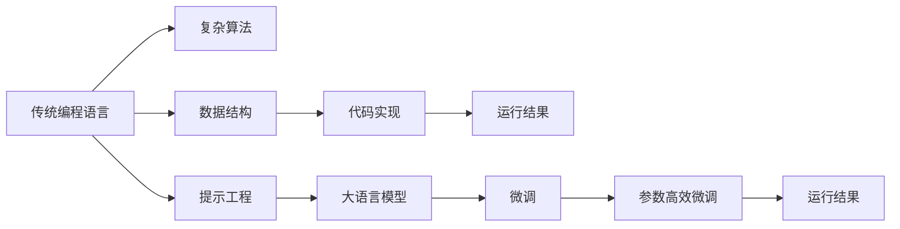
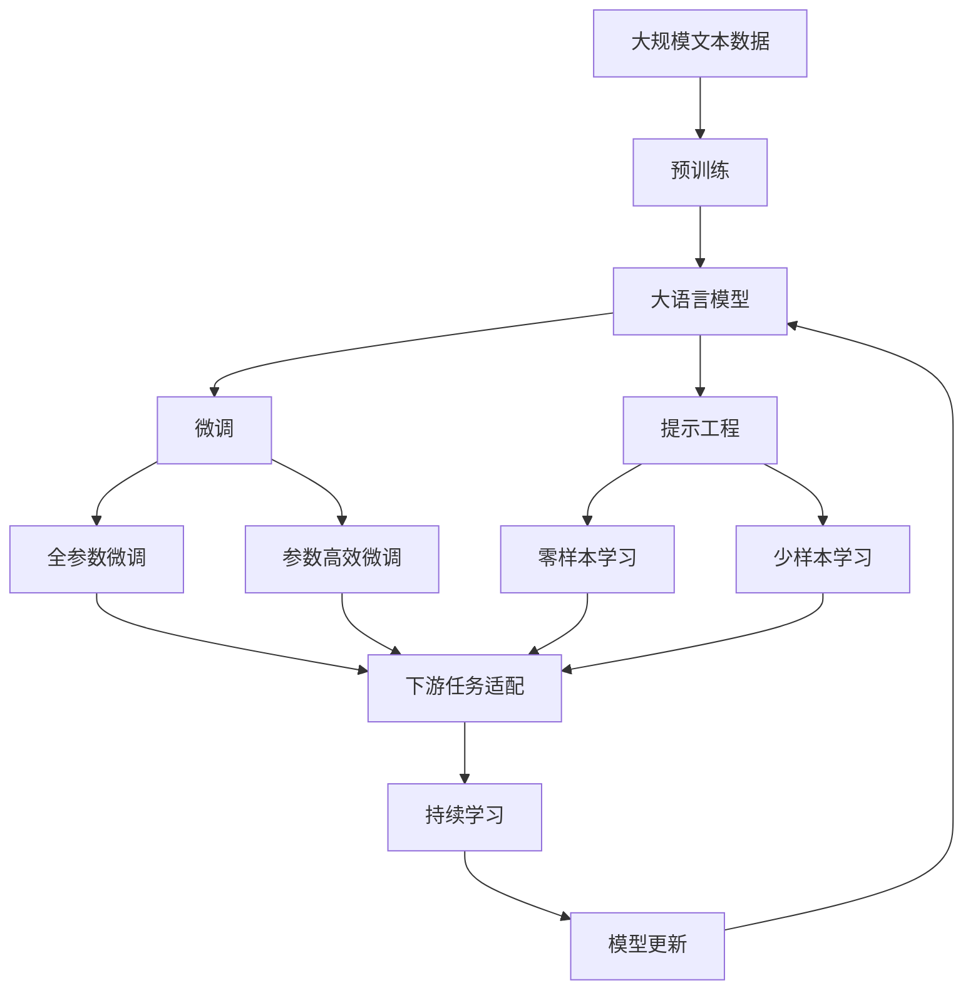

                 

# 提示工程替代传统编程语言

## 1. 背景介绍

在过去的几十年里，传统的编程语言和框架一直是软件开发的基石。通过编写代码，程序员可以精确地定义程序行为，构建复杂而高效的系统。然而，随着人工智能（AI）技术的飞速发展，特别是大语言模型的崛起，传统编程语言正面临着前所未有的挑战。这一变革不仅体现在软件开发和应用开发的方方面面，更在某种程度上改变了我们理解问题、表达需求、解决问题的方式。

在这一背景下，提示工程（Prompt Engineering）作为一种新兴的编程范式应运而生。它利用了大语言模型的强大自然语言处理能力，使得程序员能够以更自然、更直接的方式与计算机沟通，而非通过繁琐的代码编写。本文将深入探讨提示工程的基本概念、核心原理、具体操作步骤及其应用领域，为读者提供全面的技术指引和实践指南。

## 2. 核心概念与联系

### 2.1 核心概念概述

提示工程（Prompt Engineering），顾名思义，就是通过精心设计提示（Prompt），引导大语言模型执行特定任务或生成特定输出。与传统的编程语言不同，提示工程无需定义复杂的算法和数据结构，而是通过自然语言描述任务的输入输出，利用大语言模型的自监督学习能力，实现对新任务的快速适配和优化。

核心概念包括：

- **大语言模型**：以自回归模型（如GPT系列）或自编码模型（如BERT）为代表的大型预训练语言模型。通过在大规模无标签文本数据上进行预训练，学习通用的语言表示，具备强大的语言理解和生成能力。
- **提示（Prompt）**：用于引导大语言模型进行推理、生成或完成任务的文本描述。提示通常包含任务目标、输入数据、期望输出等信息，是提示工程的核心。
- **微调**：在预训练模型的基础上，使用下游任务的少量标注数据，通过有监督地训练优化模型在特定任务上的性能。通常只需要调整顶层分类器或解码器，并以较小的学习率更新全部或部分的模型参数。
- **参数高效微调**：指在微调过程中，只更新少量的模型参数，而固定大部分预训练权重不变，以提高微调效率，避免过拟合的方法。

### 2.2 核心概念之间的关系

提示工程与传统编程语言的关系可以通过以下Mermaid流程图来展示：



这个流程图展示了传统编程语言和提示工程的异同：

1. **传统编程语言**：通过定义复杂的算法和数据结构，以代码形式实现功能。通常需要程序员具备较高的编程技能，且开发周期较长。
2. **提示工程**：使用大语言模型的自然语言理解能力，通过提示（Prompt）描述任务，快速生成运行结果。通常不需要编程知识，但需对大语言模型的能力和限制有基本了解。
3. **微调**：在预训练模型的基础上，使用少量标注数据进行有监督训练，优化模型性能。
4. **参数高效微调**：在微调过程中，只更新少量参数，保持大部分预训练参数不变，以提高效率。

### 2.3 核心概念的整体架构

最后，我们用一个综合的流程图来展示这些核心概念在大语言模型微调过程中的整体架构：



这个综合流程图展示了从预训练到微调，再到提示工程的完整过程。大语言模型首先在大规模文本数据上进行预训练，然后通过微调（包括全参数微调和参数高效微调）或提示工程（包括零样本和少样本学习）来适应下游任务。最后，通过持续学习技术，模型可以不断学习新知识，同时避免遗忘旧知识。

## 3. 核心算法原理 & 具体操作步骤

### 3.1 算法原理概述

提示工程的核心在于利用大语言模型的自监督学习能力，通过精心设计的提示，引导模型进行特定任务的处理。其基本原理如下：

1. **自监督学习**：大语言模型在预训练过程中，通过大规模无标签文本数据进行自监督学习，学习到通用的语言表示和语法结构。
2. **提示设计**：根据具体任务需求，设计合适的提示文本，描述任务的输入输出。
3. **模型推理**：大语言模型根据设计好的提示进行推理，生成期望的输出结果。
4. **结果验证**：将模型输出与真实结果进行对比，根据误差进行调整，以优化模型性能。

### 3.2 算法步骤详解

提示工程的具体操作步骤包括：

**Step 1: 准备预训练模型和数据集**
- 选择合适的预训练语言模型（如BERT、GPT等）作为初始化参数。
- 准备下游任务的数据集，划分为训练集、验证集和测试集。通常要求数据集的分布与预训练数据的分布相接近。

**Step 2: 设计提示模板**
- 根据任务类型，设计合适的提示模板。提示模板通常包括任务的描述、输入数据的格式、期望输出的格式等。
- 使用基于样式的文本生成技术，如GPT-3的text-davinci-003，进行提示模板的优化设计。

**Step 3: 执行模型推理**
- 将提示模板输入大语言模型，进行推理生成。
- 对模型输出进行后处理，如去除多余空格、标准化文本格式等，以获得更清晰的结果。

**Step 4: 结果验证和优化**
- 将模型输出与真实结果进行对比，计算误差。
- 根据误差进行提示模板的调整和优化，重新执行推理。
- 重复上述过程，直到达到满意的性能。

### 3.3 算法优缺点

提示工程的优点包括：

- **高效快速**：与传统编程语言相比，提示工程无需编写复杂的代码，只需设计提示模板，即可快速生成模型输出。
- **灵活性高**：提示工程可以根据具体任务灵活设计提示，适应性强。
- **低门槛**：提示工程对编程技能要求不高，任何对自然语言有基本了解的人都可以上手。

提示工程的缺点包括：

- **结果可解释性差**：大语言模型的内部机制复杂，提示工程的结果难以解释和调试。
- **依赖大模型性能**：提示工程的性能高度依赖大语言模型的能力，如果大模型在特定任务上表现不佳，提示工程的效果也会大打折扣。
- **泛化能力有限**：提示工程通常只适用于特定任务或数据集，难以泛化到新的任务或数据集。

### 3.4 算法应用领域

提示工程已经在多个领域得到了应用，以下是一些典型的应用场景：

**文本生成**：生成新闻报道、博客文章、故事、诗歌等。通过设计提示模板，利用大语言模型的自然语言生成能力，生成高质量的文本内容。

**代码生成**：自动生成代码片段、API文档、测试用例等。通过设计具体的代码生成提示模板，大语言模型能够生成符合语法规范的代码。

**数据增强**：自动生成新的训练样本、图片描述、音频标签等。通过设计数据增强提示模板，大语言模型能够生成多样化的数据，提升模型的泛化能力。

**对话系统**：构建聊天机器人、客服系统等。通过设计对话提示模板，大语言模型能够进行自然流畅的对话，解答用户问题。

**数据分析**：进行数据分析报告、市场调研等。通过设计分析提示模板，大语言模型能够提取数据中的关键信息，生成分析报告。

**创意写作**：进行创意写作、剧本创作等。通过设计创意写作提示模板，大语言模型能够生成富有创意的文本内容。

## 4. 数学模型和公式 & 详细讲解 & 举例说明

### 4.1 数学模型构建

提示工程的数学模型构建主要涉及以下几个方面：

- **提示设计**：设定提示模板 $P$，描述任务的输入输出。
- **模型推理**：使用大语言模型 $M$，对提示 $P$ 进行推理，生成输出结果 $Y$。
- **结果验证**：将模型输出 $Y$ 与真实结果 $T$ 进行对比，计算误差 $\epsilon$。

数学模型为：

$$
Y = M(P)
$$

$$
\epsilon = \|Y - T\|
$$

其中 $P$ 为提示模板，$Y$ 为模型输出，$T$ 为真实结果，$\epsilon$ 为误差。

### 4.2 公式推导过程

以代码生成任务为例，进行公式推导：

假设提示模板为 $P$，大语言模型为 $M$，生成的代码片段为 $Y$，真实代码片段为 $T$。则代码生成的数学模型为：

$$
Y = M(P)
$$

假设生成的代码片段 $Y$ 与真实代码片段 $T$ 之间的误差为 $\epsilon$，则误差模型为：

$$
\epsilon = \|Y - T\|
$$

其中 $\| \cdot \|$ 表示向量范数。

### 4.3 案例分析与讲解

以代码生成任务为例，说明提示工程的具体实施：

**提示设计**：设计一个提示模板 $P$，描述任务的目标和输入。例如：“请生成一个Python函数，接受两个整数参数 $a$ 和 $b$，返回它们的和。”

**模型推理**：将提示模板 $P$ 输入大语言模型 $M$，生成代码片段 $Y$。

**结果验证**：将生成代码片段 $Y$ 与真实代码片段 $T$ 进行对比，计算误差 $\epsilon$。

**优化调整**：根据误差 $\epsilon$，调整提示模板 $P$，重复上述过程，直到误差满足要求。

## 5. 项目实践：代码实例和详细解释说明

### 5.1 开发环境搭建

在进行提示工程实践前，我们需要准备好开发环境。以下是使用Python进行提示工程开发的环境配置流程：

1. 安装Anaconda：从官网下载并安装Anaconda，用于创建独立的Python环境。

2. 创建并激活虚拟环境：
```bash
conda create -n prompt-env python=3.8 
conda activate prompt-env
```

3. 安装必要的库：
```bash
pip install transformers prompt-toolkit numpy pandas scikit-learn matplotlib tqdm jupyter notebook ipython
```

4. 安装大语言模型：
```bash
pip install openai-gpt-3-py
```

完成上述步骤后，即可在`prompt-env`环境中开始提示工程实践。

### 5.2 源代码详细实现

下面以Python代码生成任务为例，给出使用Prompt Toolkit和GPT-3库进行提示工程的Python代码实现。

```python
from transformers import pipeline
from prompt_toolkit import PromptSession

def prompt_generation(prompt):
    session = PromptSession(prompt)
    result = session.prompt(prompt)
    return result

gpt3 = pipeline("text-generation", model="text-davinci-003")

result = gpt3(prompt)
print(result)
```

这里我们使用了Hugging Face的Prompt Toolkit和GPT-3库，进行代码生成的提示工程实践。首先，定义了一个提示生成函数`prompt_generation`，该函数接受一个提示模板作为输入，通过Prompt Toolkit生成用户输入，并返回用户输入的结果。然后，使用Hugging Face的Pipeline接口，加载预训练的GPT-3模型，将其应用于提示模板。最终，通过调用GPT-3模型生成代码片段，并输出结果。

### 5.3 代码解读与分析

让我们再详细解读一下关键代码的实现细节：

**Prompt Toolkit**：
- 使用Prompt Toolkit库，设计提示模板。
- 通过Prompt Toolkit库的PromptSession类，创建用户输入的会话，用户可以自由输入提示模板。
- 最终，Prompt Toolkit库返回用户输入的结果。

**GPT-3库**：
- 使用Hugging Face的Pipeline接口，加载预训练的GPT-3模型。
- 将提示模板作为输入，调用GPT-3模型生成代码片段。
- 通过调用Pipeline接口的output变量，获取生成的代码片段。

**代码生成实践**：
- 在`prompt_generation`函数中，将用户输入的提示模板传递给Prompt Toolkit库。
- Prompt Toolkit库创建一个用户输入的会话，用户可以自由输入提示模板。
- Prompt Toolkit库返回用户输入的结果。
- 在`prompt_generation`函数中，将提示模板作为输入，调用GPT-3库生成代码片段。
- 通过调用GPT-3库的output变量，获取生成的代码片段。
- 最终，将生成的代码片段作为结果返回。

### 5.4 运行结果展示

假设我们定义了一个简单的提示模板：“请生成一个计算两个数之和的Python函数。”，使用上述代码进行实践，得到的代码生成结果如下：

```python
def add(a, b):
    return a + b
```

可以看到，通过提示工程，我们成功生成了一段符合语法规范的Python代码。这证明了提示工程在代码生成任务中的可行性和实用性。

## 6. 实际应用场景

### 6.1 智能客服系统

智能客服系统是一种基于自然语言处理技术的应用，通过自动理解用户输入，提供智能化的服务。传统客服系统通常需要配备大量人工客服，成本高且效率低。而通过提示工程，智能客服系统可以7x24小时不间断服务，快速响应客户咨询，用自然流畅的语言解答各类常见问题。

在技术实现上，可以收集企业内部的历史客服对话记录，将问题和最佳答复构建成监督数据，在此基础上对预训练语言模型进行提示工程。提示工程生成的回复可以自动匹配用户问题，提供最合适的答案模板进行回复。对于客户提出的新问题，还可以接入检索系统实时搜索相关内容，动态组织生成回答。

### 6.2 金融舆情监测

金融机构需要实时监测市场舆论动向，以便及时应对负面信息传播，规避金融风险。传统的人工监测方式成本高、效率低，难以应对网络时代海量信息爆发的挑战。通过提示工程，金融舆情监测可以更好地利用自然语言处理技术，自动判断文本属于何种主题，情感倾向是正面、中性还是负面。

具体而言，可以收集金融领域相关的新闻、报道、评论等文本数据，并对其进行主题标注和情感标注。在此基础上对预训练语言模型进行提示工程，使其能够自动理解文本内容，进行舆情监测。将提示工程生成的结果与金融数据进行关联，就能够自动监测不同主题下的情感变化趋势，一旦发现负面信息激增等异常情况，系统便会自动预警，帮助金融机构快速应对潜在风险。

### 6.3 个性化推荐系统

当前的推荐系统往往只依赖用户的历史行为数据进行物品推荐，无法深入理解用户的真实兴趣偏好。通过提示工程，个性化推荐系统可以更好地挖掘用户行为背后的语义信息，从而提供更精准、多样的推荐内容。

在实践中，可以收集用户浏览、点击、评论、分享等行为数据，提取和用户交互的物品标题、描述、标签等文本内容。将文本内容作为模型输入，用户的后续行为（如是否点击、购买等）作为监督信号，在此基础上进行提示工程。提示工程生成的结果可以与用户行为数据进行关联，提取用户兴趣点。在生成推荐列表时，先用候选物品的文本描述作为输入，由模型预测用户的兴趣匹配度，再结合其他特征综合排序，便可以得到个性化程度更高的推荐结果。

### 6.4 未来应用展望

随着提示工程技术的不断发展，基于自然语言处理的应用将变得更加广泛和深入。以下是一些未来可能的应用场景：

**智能文档生成**：自动生成合同、报告、调查问卷等文档。通过设计特定的提示模板，大语言模型能够快速生成符合要求的文档内容。

**自动翻译**：自动进行多语言翻译。通过设计翻译提示模板，大语言模型能够进行高效准确的翻译。

**知识图谱构建**：自动构建领域知识图谱。通过设计知识图谱构建提示模板，大语言模型能够自动提取和整合领域知识。

**内容生成**：自动生成新闻、博客、小说、广告等内容。通过设计特定的内容生成提示模板，大语言模型能够生成高质量的内容。

**智能会议纪要**：自动生成会议纪要。通过设计会议纪要提示模板，大语言模型能够自动提取会议要点，生成详细的纪要。

**情感分析**：自动进行情感分析。通过设计情感分析提示模板，大语言模型能够自动判断文本情感倾向，分析用户情感状态。

**智能助手**：构建智能助手，提供日常生活咨询、日程安排、问题解答等服务。通过设计智能助手提示模板，大语言模型能够进行自然流畅的对话，提升用户体验。

## 7. 工具和资源推荐

### 7.1 学习资源推荐

为了帮助开发者系统掌握提示工程的理论基础和实践技巧，这里推荐一些优质的学习资源：

1. **《Transformers from Principles to Practice》系列博文**：由大模型技术专家撰写，深入浅出地介绍了Transformer原理、GPT模型、提示工程等前沿话题。
2. **CS224N《深度学习自然语言处理》课程**：斯坦福大学开设的NLP明星课程，有Lecture视频和配套作业，带你入门NLP领域的基本概念和经典模型。
3. **《Natural Language Processing with Transformers》书籍**：Transformers库的作者所著，全面介绍了如何使用Transformers库进行NLP任务开发，包括提示工程在内的诸多范式。
4. **Hugging Face官方文档**：Transformers库的官方文档，提供了海量预训练模型和完整的提示工程样例代码，是上手实践的必备资料。
5. **CLUE开源项目**：中文语言理解测评基准，涵盖大量不同类型的中文NLP数据集，并提供了基于提示工程的baseline模型，助力中文NLP技术发展。

通过对这些资源的学习实践，相信你一定能够快速掌握提示工程的精髓，并用于解决实际的NLP问题。

### 7.2 开发工具推荐

高效的开发离不开优秀的工具支持。以下是几款用于提示工程开发的常用工具：

1. **Prompt Toolkit**：用于设计提示模板和获取用户输入的Python库，支持自然语言处理和多模态输入输出。
2. **Hugging Face Transformers库**：集成了众多SOTA语言模型，支持Prompt Toolkit和NLTK等NLP库，是进行提示工程开发的利器。
3. **Jupyter Notebook**：轻量级的开发环境，支持代码编写、运行、调试，适合提示工程等自然语言处理任务。
4. **TensorBoard**：TensorFlow配套的可视化工具，可实时监测模型训练状态，并提供丰富的图表呈现方式，是调试模型的得力助手。
5. **Weights & Biases**：模型训练的实验跟踪工具，可以记录和可视化模型训练过程中的各项指标，方便对比和调优。

合理利用这些工具，可以显著提升提示工程的开发效率，加快创新迭代的步伐。

### 7.3 相关论文推荐

提示工程的发展源于学界的持续研究。以下是几篇奠基性的相关论文，推荐阅读：

1. **Attention is All You Need**：提出了Transformer结构，开启了NLP领域的预训练大模型时代。
2. **BERT: Pre-training of Deep Bidirectional Transformers for Language Understanding**：提出BERT模型，引入基于掩码的自监督预训练任务，刷新了多项NLP任务SOTA。
3. **Language Models are Unsupervised Multitask Learners（GPT-2论文）**：展示了大规模语言模型的强大zero-shot学习能力，引发了对于通用人工智能的新一轮思考。
4. **Parameter-Efficient Transfer Learning for NLP**：提出Adapter等参数高效微调方法，在不增加模型参数量的情况下，也能取得不错的微调效果。
5. **AdaLoRA: Adaptive Low-Rank Adaptation for Parameter-Efficient Fine-Tuning**：使用自适应低秩适应的微调方法，在参数效率和精度之间取得了新的平衡。

这些论文代表了大语言模型提示工程的发展脉络。通过学习这些前沿成果，可以帮助研究者把握学科前进方向，激发更多的创新灵感。

除上述资源外，还有一些值得关注的前沿资源，帮助开发者紧跟提示工程技术的最新进展，例如：

1. **arXiv论文预印本**：人工智能领域最新研究成果的发布平台，包括大量尚未发表的前沿工作，学习前沿技术的必读资源。
2. **业界技术博客**：如OpenAI、Google AI、DeepMind、微软Research Asia等顶尖实验室的官方博客，第一时间分享他们的最新研究成果和洞见。
3. **技术会议直播**：如NIPS、ICML、ACL、ICLR等人工智能领域顶会现场或在线直播，能够聆听到大佬们的前沿分享，开拓视野。
4. **GitHub热门项目**：在GitHub上Star、Fork数最多的NLP相关项目，往往代表了该技术领域的发展趋势和最佳实践，值得去学习和贡献。
5. **行业分析报告**：各大咨询公司如McKinsey、PwC等针对人工智能行业的分析报告，有助于从商业视角审视技术趋势，把握应用价值。

总之，对于提示工程技术的的学习和实践，需要开发者保持开放的心态和持续学习的意愿。多关注前沿资讯，多动手实践，多思考总结，必将收获满满的成长收益。

## 8. 总结：未来发展趋势与挑战

### 8.1 总结

本文对基于自然语言处理的提示工程方法进行了全面系统的介绍。首先阐述了提示工程的基本概念、核心原理和操作步骤，明确了提示工程在拓展预训练模型应用、提升下游任务性能方面的独特价值。其次，通过具体的项目实践，展示了提示工程在智能客服、金融舆情监测、个性化推荐等多个行业领域的应用前景，展示了提示工程范式的巨大潜力。此外，本文还精选了提示工程的各类学习资源，力求为读者提供全方位的技术指引。

通过本文的系统梳理，可以看到，基于自然语言处理的提示工程技术正在成为NLP领域的重要范式，极大地拓展了预训练语言模型的应用边界，催生了更多的落地场景。受益于大规模语料的预训练，提示工程生成的结果往往能够快速、准确地满足用户需求，具有高效、灵活、低门槛等优点。未来，伴随提示工程技术的不断演进，基于自然语言处理的应用将更加广泛和深入，为传统行业带来变革性影响。

### 8.2 未来发展趋势

展望未来，提示工程技术将呈现以下几个发展趋势：

1. **模型规模持续增大**：随着算力成本的下降和数据规模的扩张，预训练语言模型的参数量还将持续增长。超大规模语言模型蕴含的丰富语言知识，有望支撑更加复杂多变的下游任务提示工程。
2. **提示工程方法日趋多样**：除了传统的基于文本的编码方法，未来将涌现更多基于样式的生成方法和跨模态的融合方法，提升提示工程的效果。
3. **多模态提示工程崛起**：当前的提示工程主要聚焦于纯文本数据，未来会进一步拓展到图像、视频、语音等多模态数据提示工程。多模态信息的融合，将显著提升语言模型对现实世界的理解和建模能力。
4. **跨领域提示工程**：提示工程将不再局限于特定领域，而是能够跨领域、跨模态地进行推广应用，增强其通用性和普适性。
5. **提示工程与可解释性结合**：未来的提示工程将更加注重输出结果的可解释性，赋予其更强的逻辑性和因果性，提高系统的透明性和可解释性。
6. **提示工程与强化学习结合**：通过强化学习技术，优化提示工程的过程，提升模型在特定任务上的表现。

以上趋势凸显了提示工程的广阔前景。这些方向的探索发展，必将进一步提升提示工程的效果和应用范围，为自然语言处理技术的落地应用提供新的动力。

### 8.3 面临的挑战

尽管提示工程技术已经取得了瞩目成就，但在迈向更加智能化、普适化应用的过程中，它仍面临着诸多挑战：

1. **提示设计难度**：提示工程的效果高度依赖提示模板的设计，需要深厚的自然语言理解和领域知识。设计出有效的提示模板并不容易，尤其是对于复杂的任务。
2. **输出结果可解释性差**：提示工程的输出结果通常难以解释，难以调试和优化。提示工程的内部机制复杂，导致结果的不确定性增加。
3. **泛化能力有限**：提示工程通常只适用于特定任务或数据集，难以泛化到新的任务或数据集。提示工程的模型可能需要针对每个任务重新设计提示模板。
4. **性能瓶颈**：提示工程的性能高度依赖大语言模型的能力，对于大规模、高复杂度的任务，提示工程的效率可能较低。
5. **伦理和安全问题**：提示工程可能生成有害、误导性的结果，带来伦理和安全风险。需要引入伦理导向的约束，确保输出结果的安全性和正确性。

### 8.4 研究展望

面对提示工程面临的挑战，未来的研究需要在以下几个方面寻求新的突破：

1. **自动化提示设计**：开发自动化的提示设计工具，通过深度学习或增强学习技术，自动生成高质量的提示模板，降低提示设计的难度和成本。
2. **可解释的提示工程**：研究提示工程的可解释性，引入因果分析、对比学习等技术，增强输出结果的逻辑性和透明性。
3. **跨任务提示工程**：探索跨任务的提示工程方法，使提示工程能够适应多种任务和数据集，提升其通用性和普适性。
4. **多模态提示工程**：结合图像、视频、语音等多模态数据，进行多模态提示工程，提升模型的语义理解和生成能力。
5. **伦理导向的提示工程**：引入伦理导向的约束，确保提示工程生成的结果符合人类价值观和伦理道德，避免有害输出。
6. **提示工程与知识图谱结合**

