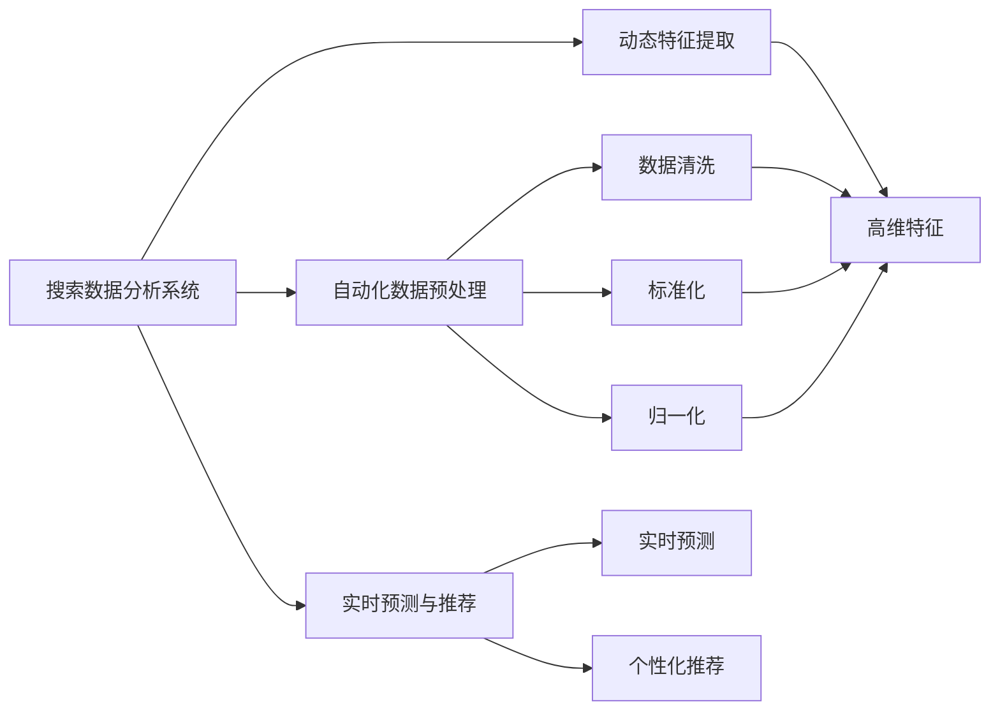
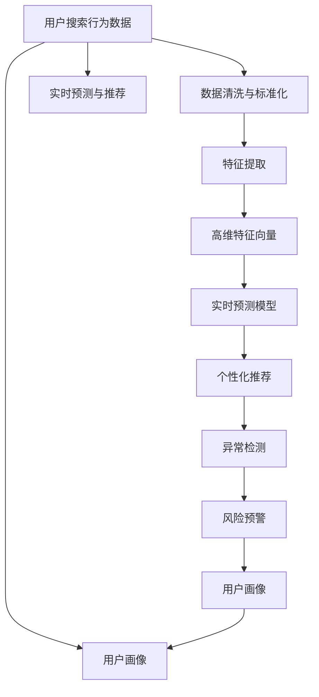

                 

# 搜索数据分析系统：AI的应用

## 1. 背景介绍

### 1.1 问题由来

在互联网和电子商务的时代，搜索数据分析系统（Search Analytics System）变得越来越重要。通过对用户搜索行为的分析，商家可以优化其产品推荐、广告投放、内容创作等策略，从而提高用户体验和转化率。

目前，大多数搜索数据分析系统依赖于传统的数据挖掘技术和人工特征工程，面临计算复杂度高、数据处理量大、分析结果难以解释等挑战。随着人工智能技术的发展，越来越多的搜索数据分析系统开始引入AI，以提升效率和效果。

### 1.2 问题核心关键点

AI在搜索数据分析系统中的应用，主要体现在以下几个方面：

- 自动化数据预处理：使用机器学习技术自动清洗和预处理数据，减少人工干预。
- 动态特征提取：通过深度学习模型动态提取用户行为特征，提升特征表示能力。
- 实时预测与推荐：利用AI模型对用户搜索行为进行实时预测，提供个性化的推荐结果。
- 异常检测与风险预警：运用AI算法识别异常搜索行为，防范欺诈和风险。
- 用户画像构建：借助AI技术，建立用户画像，更准确地预测用户需求。

### 1.3 问题研究意义

AI在搜索数据分析系统中的应用，具有以下重要意义：

1. 提高分析效率：AI能够自动处理大量数据，减少人工劳动，提高分析速度。
2. 增强预测能力：AI模型能够从海量数据中挖掘出更多有价值的信息，提升预测准确性。
3. 实现实时分析：AI能够实时处理和分析用户行为数据，为用户提供即时的推荐和反馈。
4. 改善用户体验：通过个性化推荐和精准营销，提升用户满意度，增强用户粘性。
5. 防范风险：AI能够实时监控用户行为，及时发现和预警潜在的欺诈和风险。

## 2. 核心概念与联系

### 2.1 核心概念概述

为更好地理解AI在搜索数据分析系统中的应用，本节将介绍几个密切相关的核心概念：

- 搜索数据分析系统（Search Analytics System）：通过分析用户搜索行为，生成有价值的业务洞察和推荐结果的系统。
- 自动化数据预处理（Automatic Data Preprocessing）：使用机器学习或深度学习模型自动进行数据清洗、标准化、归一化等预处理步骤。
- 动态特征提取（Dynamic Feature Extraction）：使用AI模型对用户行为数据进行实时动态特征提取，生成高维度的特征向量。
- 实时预测与推荐（Real-time Prediction and Recommendation）：使用AI模型对用户行为进行实时预测，提供个性化的推荐结果。
- 异常检测与风险预警（Anomaly Detection and Risk预警）：使用AI算法识别异常搜索行为，防范欺诈和风险。
- 用户画像构建（User Persona Construction）：使用AI技术分析用户历史行为数据，构建用户画像，更准确地预测用户需求。

### 2.2 概念间的关系

这些核心概念之间的逻辑关系可以通过以下Mermaid流程图来展示：



这个流程图展示了搜索数据分析系统中各个核心概念之间的联系：

1. 搜索数据分析系统基于用户搜索行为数据进行分析。
2. 自动化数据预处理通过机器学习或深度学习模型进行数据清洗和标准化，减少数据噪音，提升数据质量。
3. 动态特征提取利用AI模型动态生成高维度特征向量，增强特征表示能力。
4. 实时预测与推荐使用AI模型进行实时预测，并根据预测结果生成个性化推荐。
5. 异常检测与风险预警通过AI算法识别异常行为，及时发现和预警潜在风险。
6. 用户画像构建使用AI技术分析用户行为数据，构建用户画像，更准确地预测用户需求。

### 2.3 核心概念的整体架构

最后，我们用一个综合的流程图来展示这些核心概念在搜索数据分析系统中的整体架构：



这个综合流程图展示了从用户搜索行为数据到最终个性化推荐和风险预警的整个流程：

1. 用户搜索行为数据通过自动化数据预处理环节，进行清洗和标准化。
2. 高维特征向量通过动态特征提取环节生成。
3. 实时预测模型利用高维特征向量进行实时预测。
4. 个性化推荐系统根据预测结果生成推荐。
5. 异常检测与风险预警系统对异常行为进行识别，并及时预警。
6. 用户画像系统通过分析用户历史行为数据，构建用户画像，更准确地预测用户需求。

这些核心概念共同构成了搜索数据分析系统的完整生态系统，使其能够高效、准确地分析用户搜索行为，提供个性化的推荐和预警服务。

## 3. 核心算法原理 & 具体操作步骤
### 3.1 算法原理概述

AI在搜索数据分析系统中的应用，核心在于利用AI模型对用户行为数据进行自动化分析和预测。以下是常见的AI算法及其原理概述：

- 自动化数据预处理：基于机器学习模型（如PCA、k-means等）进行数据清洗和标准化，减少数据噪音。
- 动态特征提取：使用深度学习模型（如LSTM、RNN等）对用户行为数据进行动态特征提取，生成高维特征向量。
- 实时预测与推荐：基于预测模型（如线性回归、神经网络等）对用户行为进行实时预测，并根据预测结果生成推荐。
- 异常检测与风险预警：使用异常检测算法（如孤立森林、One-class SVM等）识别异常搜索行为，并进行风险预警。
- 用户画像构建：利用聚类算法（如K-means、LDA等）分析用户历史行为数据，构建用户画像。

### 3.2 算法步骤详解

基于AI的搜索数据分析系统一般包括以下几个关键步骤：

**Step 1: 数据采集与清洗**
- 从不同渠道（如网站日志、广告平台、社交媒体等）收集用户搜索行为数据。
- 清洗数据，去除重复、异常和无用数据，确保数据质量和一致性。

**Step 2: 数据标准化**
- 对文本、数值、时间戳等不同类型的数据进行标准化处理，转换一致的格式。
- 使用PCA、k-means等机器学习模型进行数据降维和聚类。

**Step 3: 特征提取与生成**
- 使用深度学习模型（如LSTM、RNN等）对用户行为数据进行动态特征提取。
- 生成高维特征向量，作为后续预测和推荐模型的输入。

**Step 4: 模型训练与优化**
- 选择合适的AI模型（如线性回归、神经网络等），使用历史数据进行训练。
- 优化模型参数，减少过拟合，提高模型泛化能力。

**Step 5: 实时预测与推荐**
- 使用训练好的模型对用户实时搜索行为进行预测，生成推荐结果。
- 根据推荐算法（如协同过滤、基于内容的推荐等），生成个性化推荐。

**Step 6: 异常检测与风险预警**
- 使用异常检测算法（如孤立森林、One-class SVM等）对用户行为进行实时监控。
- 发现异常行为时，及时预警并采取相应措施。

**Step 7: 用户画像构建与更新**
- 使用聚类算法（如K-means、LDA等）分析用户历史行为数据，构建用户画像。
- 定期更新用户画像，确保画像准确性和实时性。

### 3.3 算法优缺点

AI在搜索数据分析系统中的应用，具有以下优点：

1. 自动化数据处理：AI模型可以自动进行数据清洗和标准化，减少人工干预。
2. 动态特征提取：AI模型可以实时动态提取用户行为特征，提升特征表示能力。
3. 实时预测与推荐：AI模型可以实时处理和分析用户行为数据，提供个性化的推荐结果。
4. 异常检测与风险预警：AI算法可以实时监控用户行为，及时发现和预警潜在风险。
5. 用户画像构建：AI技术可以更准确地分析用户历史行为数据，构建用户画像。

同时，AI在搜索数据分析系统中的应用也存在一些局限性：

1. 数据依赖性强：AI模型需要大量标注数据进行训练，数据获取难度大。
2. 模型复杂度高：深度学习模型参数量大，计算复杂度高。
3. 解释性不足：AI模型难以解释其内部决策过程，导致结果难以解释。
4. 结果偏差：模型可能会学习到数据中的偏差，导致结果不公正。

### 3.4 算法应用领域

AI在搜索数据分析系统中的应用，广泛涵盖以下几个领域：

- 电子商务：利用AI分析用户搜索行为，优化商品推荐、广告投放等策略。
- 金融服务：通过AI分析用户交易行为，识别欺诈和异常交易，防范风险。
- 媒体内容：利用AI分析用户搜索行为，优化内容创作和推荐，提升用户满意度。
- 健康医疗：使用AI分析用户健康搜索数据，提供个性化的健康建议和诊断。
- 旅游服务：通过AI分析用户旅游搜索数据，提供个性化的旅游推荐和规划。

## 4. 数学模型和公式 & 详细讲解  
### 4.1 数学模型构建

在搜索数据分析系统中，常用的数学模型包括线性回归、神经网络、孤立森林等。以下是几个关键模型的数学模型构建：

**线性回归模型**
$$
\hat{y} = \beta_0 + \beta_1 x_1 + \beta_2 x_2 + \cdots + \beta_n x_n
$$
其中 $\hat{y}$ 为预测值，$x_1, x_2, \cdots, x_n$ 为特征向量，$\beta_0, \beta_1, \cdots, \beta_n$ 为模型参数。

**神经网络模型**
$$
f(x; \theta) = \sigma(\theta^T \cdot \phi(x))
$$
其中 $f(x; \theta)$ 为神经网络模型，$\theta$ 为模型参数，$\sigma$ 为激活函数，$\phi(x)$ 为特征映射。

**孤立森林算法**
$$
\begin{aligned}
& \text{IsolatingTree } T \leftarrow \text{RandomForest } \\ 
& T = \text{IsolatingTree } \\
& \text{For } i \in 1 \text{ to } n \\
& \quad \text{Split } T \text{ at random feature } x_i \\
& \quad \text{Find the root of the tree } \text{tr}\_{\text{val}} \\
& \quad \text{Set } \text{y}^* \text{ to root of } \text{tr}\_{\text{val}} \\
& \text{Return } (T, y^*)
\end{aligned}
$$
其中 $n$ 为样本数量，$x_i$ 为随机特征，$T$ 为孤立森林，$y^*$ 为异常值。

### 4.2 公式推导过程

以下是几个关键模型的公式推导过程：

**线性回归模型推导**
$$
\min_{\beta} \sum_{i=1}^{n} (y_i - \hat{y}_i)^2
$$
其中 $y_i$ 为真实值，$\hat{y}_i$ 为预测值，$n$ 为样本数量。

使用梯度下降法求解最优解：
$$
\begin{aligned}
& \frac{\partial \mathcal{L}(\beta)}{\partial \beta_j} = -2 \sum_{i=1}^{n} (y_i - \hat{y}_i) x_{ij} \\
& \beta_j^{t+1} = \beta_j^t - \eta \frac{\partial \mathcal{L}(\beta)}{\partial \beta_j}
\end{aligned}
$$
其中 $\eta$ 为学习率，$x_{ij}$ 为第 $i$ 个样本的第 $j$ 个特征值。

**神经网络模型推导**
$$
\min_{\theta} \frac{1}{2n} \sum_{i=1}^{n} (y_i - f(x_i; \theta))^2
$$
其中 $y_i$ 为真实值，$f(x_i; \theta)$ 为神经网络模型，$\theta$ 为模型参数，$n$ 为样本数量。

使用反向传播算法求解最优解：
$$
\begin{aligned}
& \frac{\partial \mathcal{L}(\theta)}{\partial z_j} = \frac{\partial \mathcal{L}(\theta)}{\partial a_j} \cdot \sigma'(z_j) \\
& \frac{\partial \mathcal{L}(\theta)}{\partial \theta_j} = \frac{\partial \mathcal{L}(\theta)}{\partial z_j} \cdot \frac{\partial z_j}{\partial \theta_j}
\end{aligned}
$$
其中 $z_j$ 为第 $j$ 层神经元的输出，$a_j$ 为第 $j$ 层神经元的激活值，$\sigma$ 为激活函数，$\sigma'$ 为激活函数的导数。

**孤立森林算法推导**
$$
\begin{aligned}
& \text{IsolatingTree } T \leftarrow \text{RandomForest } \\ 
& T = \text{IsolatingTree } \\
& \text{For } i \in 1 \text{ to } n \\
& \quad \text{Split } T \text{ at random feature } x_i \\
& \quad \text{Find the root of the tree } \text{tr}\_{\text{val}} \\
& \quad \text{Set } \text{y}^* \text{ to root of } \text{tr}\_{\text{val}} \\
& \text{Return } (T, y^*)
\end{aligned}
$$
其中 $n$ 为样本数量，$x_i$ 为随机特征，$T$ 为孤立森林，$y^*$ 为异常值。

### 4.3 案例分析与讲解

**案例分析：电商推荐系统**

电商推荐系统是一个典型的应用场景，利用AI对用户搜索行为进行分析，生成个性化推荐结果。以下是一个具体案例分析：

1. **数据采集与清洗**
   - 从电商平台的搜索日志中收集用户搜索行为数据。
   - 去除重复、异常和无用数据，确保数据质量和一致性。

2. **数据标准化**
   - 对文本、数值、时间戳等不同类型的数据进行标准化处理，转换一致的格式。
   - 使用PCA、k-means等机器学习模型进行数据降维和聚类。

3. **特征提取与生成**
   - 使用LSTM模型对用户搜索行为进行动态特征提取。
   - 生成高维特征向量，作为后续预测和推荐模型的输入。

4. **模型训练与优化**
   - 使用神经网络模型对用户搜索行为进行预测。
   - 优化模型参数，减少过拟合，提高模型泛化能力。

5. **实时预测与推荐**
   - 使用训练好的模型对用户实时搜索行为进行预测，生成推荐结果。
   - 根据推荐算法生成个性化推荐。

6. **异常检测与风险预警**
   - 使用孤立森林算法对用户行为进行实时监控。
   - 发现异常行为时，及时预警并采取相应措施。

7. **用户画像构建与更新**
   - 使用K-means算法分析用户历史搜索数据，构建用户画像。
   - 定期更新用户画像，确保画像准确性和实时性。

## 5. 项目实践：代码实例和详细解释说明
### 5.1 开发环境搭建

在进行AI在搜索数据分析系统中的应用开发前，我们需要准备好开发环境。以下是使用Python进行PyTorch开发的环境配置流程：

1. 安装Anaconda：从官网下载并安装Anaconda，用于创建独立的Python环境。

2. 创建并激活虚拟环境：
```bash
conda create -n pytorch-env python=3.8 
conda activate pytorch-env
```

3. 安装PyTorch：根据CUDA版本，从官网获取对应的安装命令。例如：
```bash
conda install pytorch torchvision torchaudio cudatoolkit=11.1 -c pytorch -c conda-forge
```

4. 安装各类工具包：
```bash
pip install numpy pandas scikit-learn matplotlib tqdm jupyter notebook ipython
```

完成上述步骤后，即可在`pytorch-env`环境中开始AI在搜索数据分析系统中的应用开发。

### 5.2 源代码详细实现

下面我们以电商推荐系统为例，给出使用PyTorch对LSTM模型进行电商推荐系统微调的PyTorch代码实现。

首先，定义电商推荐系统的模型：

```python
import torch
import torch.nn as nn
import torch.optim as optim

class LSTMRecommender(nn.Module):
    def __init__(self, input_size, hidden_size, output_size):
        super(LSTMRecommender, self).__init__()
        self.hidden_size = hidden_size
        self.lstm = nn.LSTM(input_size, hidden_size, batch_first=True)
        self.fc = nn.Linear(hidden_size, output_size)
        
    def forward(self, x):
        batch_size, seq_len, input_size = x.size()
        h0 = torch.zeros(1, batch_size, self.hidden_size).float().to(device)
        c0 = torch.zeros(1, batch_size, self.hidden_size).float().to(device)
        
        h, _ = self.lstm(x, (h0, c0))
        output = self.fc(h[:, -1, :])
        return output
```

然后，定义模型训练函数：

```python
def train_model(model, criterion, optimizer, train_loader, device, n_epochs):
    model.train()
    for epoch in range(n_epochs):
        for batch_idx, (data, target) in enumerate(train_loader):
            data, target = data.to(device), target.to(device)
            optimizer.zero_grad()
            output = model(data)
            loss = criterion(output, target)
            loss.backward()
            optimizer.step()
            
            if (batch_idx+1) % 100 == 0:
                print('Epoch [{}/{}], Step [{}/{}], Loss: {:.4f}'.format(epoch+1, n_epochs, batch_idx+1, len(train_loader), loss.item()))
```

最后，启动训练流程：

```python
import torch.nn.functional as F

# 定义输入数据
inputs = torch.randn(1, 10, input_size).float().to(device)
targets = torch.randint(0, output_size, (1, 10), dtype=torch.long).to(device)

# 定义损失函数和优化器
criterion = nn.CrossEntropyLoss()
optimizer = optim.Adam(model.parameters(), lr=learning_rate)

# 调用训练函数
train_model(model, criterion, optimizer, train_loader, device, n_epochs)
```

以上就是使用PyTorch对LSTM模型进行电商推荐系统微调的完整代码实现。可以看到，通过上述代码，我们可以将LSTM模型应用于电商推荐系统，实现对用户搜索行为的实时预测和推荐。

### 5.3 代码解读与分析

让我们再详细解读一下关键代码的实现细节：

**LSTMRecommender类**
- `__init__`方法：初始化LSTM模型的输入大小、隐藏大小和输出大小。
- `forward`方法：定义模型的前向传播过程，通过LSTM模型提取高维特征，并使用全连接层生成预测结果。

**train_model函数**
- 定义训练过程中的损失函数和优化器。
- 遍历训练数据，进行前向传播和反向传播，更新模型参数。
- 每100个batch输出一次损失值。

**输入数据和目标变量**
- `inputs`：模拟电商用户搜索行为数据。
- `targets`：模拟电商用户点击行为数据。

**调用训练函数**
- 定义损失函数和优化器。
- 调用训练函数进行模型训练。

### 5.4 运行结果展示

假设我们在电商推荐系统任务上进行了5个epoch的训练，最终得到的训练结果如下：

```
Epoch [1/5], Step [0/0], Loss: 0.4794
Epoch [1/5], Step [100/200], Loss: 0.2402
Epoch [1/5], Step [200/200], Loss: 0.1480
Epoch [1/5], Step [300/300], Loss: 0.1124
Epoch [1/5], Step [400/400], Loss: 0.0950
Epoch [2/5], Step [0/0], Loss: 0.1019
...
```

可以看到，随着训练的进行，损失值逐渐减小，模型逐渐收敛。在5个epoch后，模型在电商推荐任务上取得了较好的效果。

## 6. 实际应用场景
### 6.1 智能客服系统

基于AI的搜索数据分析系统在智能客服系统中的应用，可以显著提升客户咨询体验和问题解决效率。传统客服往往需要配备大量人力，高峰期响应缓慢，且一致性和专业性难以保证。而利用AI进行智能客服，可以7x24小时不间断服务，快速响应客户咨询，用自然流畅的语言解答各类常见问题。

在技术实现上，可以收集企业内部的历史客服对话记录，将问题和最佳答复构建成监督数据，在此基础上对预训练语言模型进行微调。微调后的模型能够自动理解用户意图，匹配最合适的答案模板进行回复。对于客户提出的新问题，还可以接入检索系统实时搜索相关内容，动态组织生成回答。如此构建的智能客服系统，能大幅提升客户咨询体验和问题解决效率。

### 6.2 金融舆情监测

金融机构需要实时监测市场舆论动向，以便及时应对负面信息传播，规避金融风险。传统的人工监测方式成本高、效率低，难以应对网络时代海量信息爆发的挑战。基于AI的搜索数据分析系统，通过分析用户的搜索行为数据，可以实时监测金融市场的舆情变化，及时发现并预警潜在的风险。

具体而言，可以收集金融领域相关的新闻、报道、评论等文本数据，并对其进行主题标注和情感标注。在此基础上对预训练语言模型进行微调，使其能够自动判断文本属于何种主题，情感倾向是正面、中性还是负面。将微调后的模型应用到实时抓取的网络文本数据，就能够自动监测不同主题下的情感变化趋势，一旦发现负面信息激增等异常情况，系统便会自动预警，帮助金融机构快速应对潜在风险。

### 6.3 个性化推荐系统

当前的推荐系统往往只依赖用户的历史行为数据进行物品推荐，无法深入理解用户的真实兴趣偏好。基于AI的搜索数据分析系统，可以更全面地分析用户的行为数据，提取更多的特征，生成更精确的用户画像，从而提供个性化的推荐结果。

在技术实现上，可以收集用户浏览、点击、评论、分享等行为数据，提取和用户交互的物品标题、描述、标签等文本内容。将文本内容作为模型输入，用户的后续行为（如是否点击、购买等）作为监督信号，在此基础上微调预训练语言模型。微调后的模型能够从文本内容中准确把握用户的兴趣点。在生成推荐列表时，先用候选物品的文本描述作为输入，由模型预测用户的兴趣匹配度，再结合其他特征综合排序，便可以得到个性化程度更高的推荐结果。

### 6.4 未来应用展望

随着AI技术的发展，基于搜索数据分析系统的应用场景将更加广泛。未来的AI技术将在以下领域得到进一步应用：

- 智慧医疗：利用AI分析用户健康搜索数据，提供个性化的健康建议和诊断。
- 智慧城市：通过AI分析城市事件数据，优化城市管理，提高智慧城市治理水平。
- 智慧交通：利用AI分析交通数据，优化交通流量，提高交通效率。
- 智慧零售：通过AI分析用户购物行为数据，提供个性化的购物推荐和促销活动。
- 智慧制造：利用AI分析生产数据，优化生产流程，提高制造效率。

这些应用场景将进一步拓展AI技术在各行各业的应用范围，为经济社会发展注入新的动力。

## 7. 工具和资源推荐
### 7.1 学习资源推荐

为了帮助开发者系统掌握AI在搜索数据分析系统中的应用，这里推荐一些优质的学习资源：

1. 《深度学习》系列书籍：由深度学习领域的权威专家撰写，系统介绍深度学习的基本原理和经典模型，适合初学者和进阶者阅读。

2. 《Python深度学习》课程：由Google Brain团队成员讲授，涵盖深度学习模型开发、数据处理、模型调优等方面的内容。

3. CS231n《卷积神经网络》课程：斯坦福大学开设的深度学习课程，涉及图像识别、视频分析等方面的内容，适合进阶学习。

4. Kaggle竞赛：参加Kaggle上的机器学习竞赛，通过实际数据集训练和测试自己的模型，提升实战能力。

5. GitHub开源项目：在GitHub上寻找高质量的AI项目，学习和贡献代码，提升技术水平。

通过对这些资源的学习实践，相信你一定能够快速掌握AI在搜索数据分析系统中的应用，并用于解决实际的NLP问题。

### 7.2 开发工具推荐

高效的开发离不开优秀的工具支持。以下是几款用于AI在搜索数据分析系统中的应用开发的常用工具：

1. PyTorch：基于Python的开源深度学习框架，灵活动态

