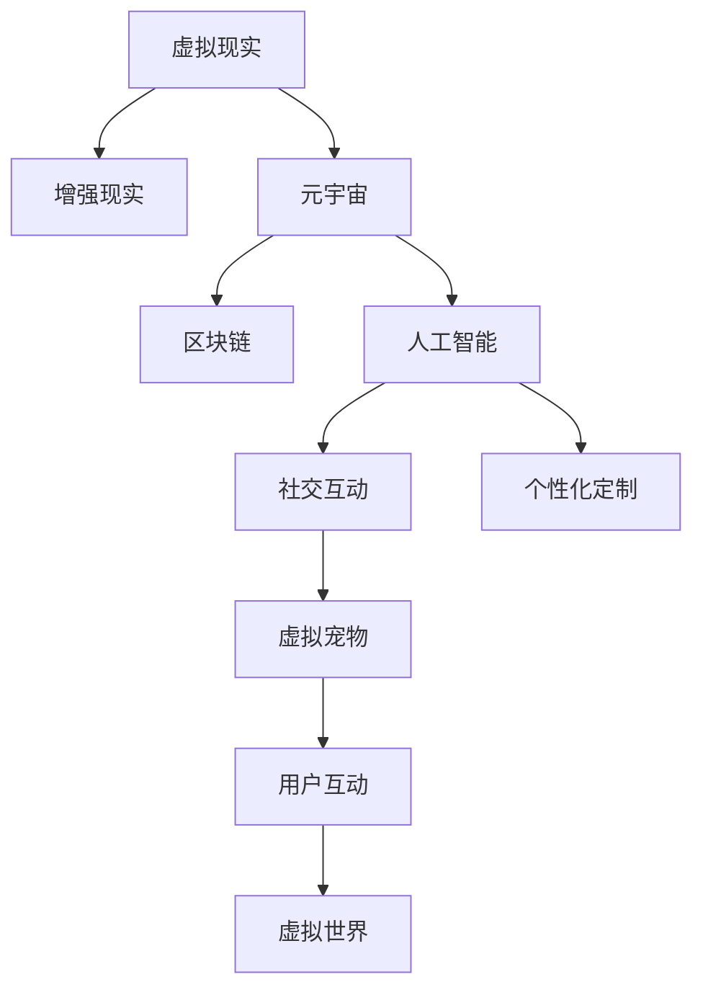
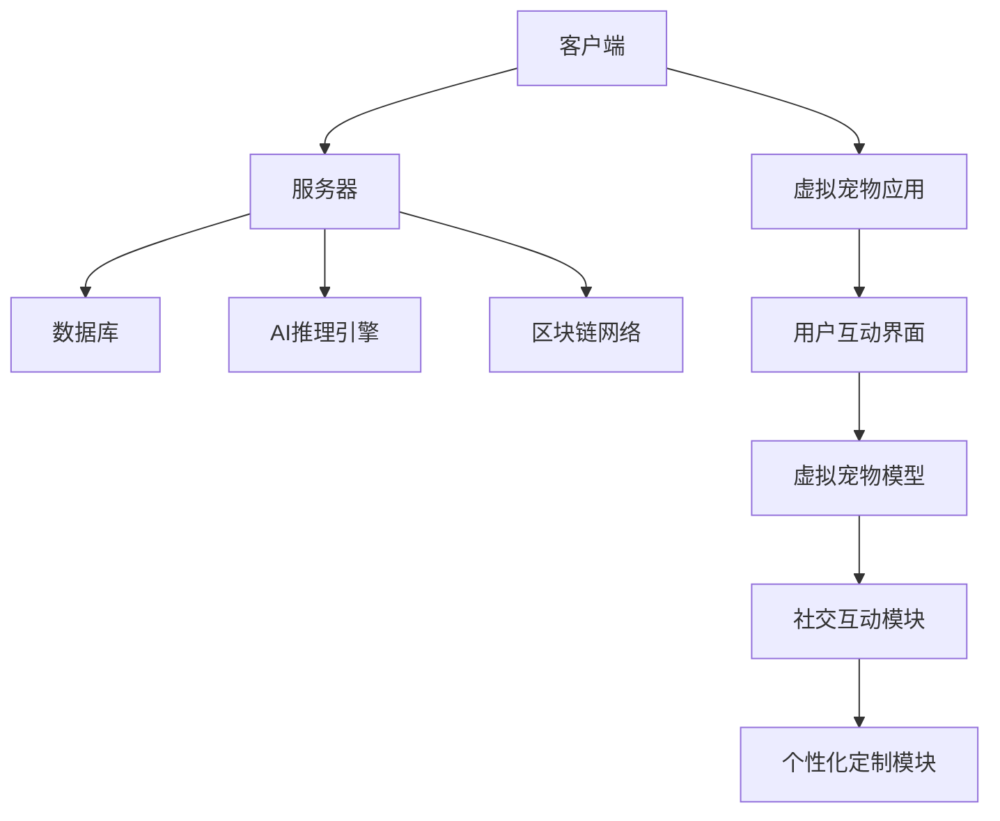

                 

# 数字化宠物：元宇宙中的情感寄托

> 关键词：数字化宠物,元宇宙,情感寄托,虚拟现实,区块链,人工智能,社交互动,个性化定制

## 1. 背景介绍

### 1.1 问题由来
随着数字技术的发展，虚拟世界和现实世界的边界逐渐模糊。元宇宙(Metaverse)这一概念应运而生，构建了一个全时全息的数字生活空间。在这个虚拟世界里，人们可以自由地交流、互动，享受丰富多彩的数字生活体验。在这个数字化进程中，虚拟宠物（Digital Pets）作为数字化的情感寄托，逐渐成为人们数字生活中不可或缺的一部分。

虚拟宠物不仅能够模拟现实中的宠物行为，还能通过AI技术不断进化，提供个性化的互动体验。同时，虚拟宠物也是人与人之间社交互动的重要桥梁，通过共同喂养、训练宠物等形式，加强了人与人之间的联系，提升了社交体验。

### 1.2 问题核心关键点
虚拟宠物在元宇宙中的应用，关键在于如何构建高效、互动、个性化的虚拟宠物系统。其核心问题包括以下几个方面：

1. **个性化定制**：虚拟宠物应具备高度的可定制性，用户可以通过输入不同的参数和行为规则，创建属于自己独一无二的虚拟宠物。
2. **智能交互**：虚拟宠物应具备一定的智能互动能力，能够根据用户的行为和输入，生成个性化的反馈和互动。
3. **社交功能**：虚拟宠物应具备社交功能，能够作为社交媒介，促进用户之间的交流和互动。
4. **安全和隐私**：虚拟宠物系统需要保障用户数据的安全和隐私，避免用户数据泄露和滥用。

这些关键点涉及了虚拟宠物系统的设计、开发、安全和隐私保护等多个方面，需要综合考虑。

### 1.3 问题研究意义
在元宇宙背景下，虚拟宠物的应用不仅提供了新的娱乐方式，还扩展了人们社交、情感交流的渠道。数字化宠物的出现，为人们提供了更加个性化、自由、互动的数字生活体验，有助于提升人们的数字生活质量。

对于开发者和研究者而言，构建虚拟宠物系统不仅能满足用户的娱乐需求，还能推动技术的发展和应用。通过虚拟宠物系统，可以探索和实现新的人机交互方式、增强现实与虚拟现实的结合、以及个性化定制和社交互动的技术创新。

## 2. 核心概念与联系

### 2.1 核心概念概述

为了更好地理解虚拟宠物系统，本节将介绍几个密切相关的核心概念：

- **虚拟现实(Virtual Reality, VR)**：利用计算机技术生成逼真的三维虚拟环境，使用户能够沉浸其中，与虚拟世界进行交互。
- **增强现实(Augmented Reality, AR)**：在真实世界的场景上叠加虚拟信息，增强用户的视觉体验。
- **元宇宙(Metaverse)**：由多个虚拟世界构成的一个虚拟空间，用户可以自由漫游和互动。
- **区块链(Blockchain)**：一种去中心化的分布式账本技术，用于确保数据的安全和透明。
- **人工智能(Artificial Intelligence, AI)**：通过算法和模型，使机器具备类似人类的智能。
- **社交互动(Social Interaction)**：在虚拟环境中，用户之间通过虚拟宠物进行交流、合作、竞争等互动。
- **个性化定制(Personalization)**：根据用户偏好和需求，定制虚拟宠物的外观、行为和互动方式。

这些概念之间的联系可以通过以下Mermaid流程图来展示：



这个流程图展示了这个虚拟宠物系统各个概念之间的联系：

1. 虚拟现实和增强现实技术为元宇宙提供了基础支持。
2. 区块链技术为虚拟宠物系统的安全和透明提供了保障。
3. 人工智能技术为虚拟宠物提供了智能互动能力。
4. 社交互动通过虚拟宠物系统得以实现，增强用户的互动体验。
5. 个性化定制为虚拟宠物提供了多样化的选择，满足用户的个性化需求。

### 2.2 概念间的关系

这些核心概念之间存在着紧密的联系，形成了虚拟宠物系统的完整生态系统。下面我们通过几个Mermaid流程图来展示这些概念之间的关系。

#### 2.2.1 虚拟宠物系统的构建流程


这个流程图展示了虚拟宠物系统的构建流程：

1. 根据用户需求设计虚拟宠物。
2. 使用3D建模技术构建宠物的3D模型。
3. 利用AI技术对虚拟宠物进行训练，使其具备智能互动能力。
4. 使用区块链技术确保虚拟宠物系统的安全和透明。
5. 开发社交互动功能，增强用户的互动体验。
6. 提供个性化定制选项，满足用户的个性化需求。
7. 发布虚拟宠物，用户可以在虚拟世界中互动。

#### 2.2.2 虚拟宠物系统的架构



这个流程图展示了虚拟宠物系统的架构：

1. 客户端负责显示虚拟宠物应用和用户互动界面。
2. 服务器用于存储用户数据、虚拟宠物模型和社交互动信息。
3. AI推理引擎负责处理虚拟宠物的智能互动逻辑。
4. 区块链网络保障数据的安全和透明。
5. 虚拟宠物应用提供虚拟宠物模型的展示和互动。
6. 用户互动界面接收用户输入和显示互动结果。
7. 社交互动模块负责用户之间的交流和合作。
8. 个性化定制模块根据用户偏好生成个性化虚拟宠物。

## 3. 核心算法原理 & 具体操作步骤

### 3.1 算法原理概述

虚拟宠物系统作为人工智能和虚拟现实技术的结合体，其核心算法主要包括以下几个方面：

1. **个性化定制算法**：根据用户输入的参数和偏好，生成个性化的虚拟宠物模型。
2. **智能互动算法**：通过自然语言处理和计算机视觉技术，实现虚拟宠物的智能互动。
3. **社交互动算法**：利用区块链技术，确保用户数据的安全和隐私，同时实现用户之间的互动和合作。
4. **个性化推荐算法**：根据用户的历史行为和偏好，推荐个性化的虚拟宠物和互动方式。

这些算法的实现，不仅依赖于单个技术的突破，还需要综合考虑技术的融合和应用。

### 3.2 算法步骤详解

下面详细介绍虚拟宠物系统的核心算法步骤：

#### 3.2.1 个性化定制算法

1. **用户需求获取**：通过问卷调查、用户反馈等方式，了解用户的个性化需求和偏好。
2. **参数设置**：根据用户需求，设置虚拟宠物的外观、行为和互动方式等参数。
3. **模型生成**：利用3D建模技术，生成符合用户需求的虚拟宠物模型。
4. **用户反馈**：用户对生成的虚拟宠物模型进行评价和反馈，根据反馈进行调整和优化。
5. **最终确定**：根据用户反馈，确定最终符合用户需求的虚拟宠物模型。

#### 3.2.2 智能互动算法

1. **自然语言处理**：通过自然语言处理技术，理解用户的指令和反馈。
2. **计算机视觉**：利用计算机视觉技术，捕捉用户的行为和表情。
3. **智能互动逻辑**：根据用户指令和行为，生成虚拟宠物的互动和反馈。
4. **动态调整**：根据用户反馈和互动结果，动态调整虚拟宠物的互动逻辑。

#### 3.2.3 社交互动算法

1. **用户身份验证**：利用区块链技术，确保用户身份的安全和隐私。
2. **社交网络构建**：构建虚拟宠物之间的社交网络，实现用户之间的互动和合作。
3. **社交互动管理**：管理用户之间的互动和合作，确保互动的公平和透明。
4. **数据安全保障**：利用区块链技术，保障用户数据的安全和隐私。

#### 3.2.4 个性化推荐算法

1. **用户行为分析**：通过分析用户的历史行为和偏好，生成用户画像。
2. **推荐算法设计**：设计个性化推荐算法，根据用户画像推荐虚拟宠物和互动方式。
3. **推荐结果展示**：将推荐结果展示给用户，并提供相关解释和推荐理由。
4. **用户反馈收集**：收集用户对推荐结果的反馈，根据反馈优化推荐算法。

### 3.3 算法优缺点

虚拟宠物系统的核心算法主要具有以下优点和缺点：

#### 优点

1. **个性化定制**：用户可以根据个人喜好和需求，定制个性化的虚拟宠物，满足个性化需求。
2. **智能互动**：虚拟宠物具备智能互动能力，能够根据用户的行为和指令，提供个性化的反馈和互动。
3. **社交互动**：通过虚拟宠物系统，用户之间可以自由互动，增强社交体验。
4. **数据安全**：区块链技术保障用户数据的安全和隐私，避免数据泄露和滥用。

#### 缺点

1. **高技术门槛**：虚拟宠物系统的构建和维护需要较高的技术门槛，需要跨学科的技术融合和应用。
2. **复杂度较高**：虚拟宠物系统的算法实现较为复杂，需要综合考虑技术的融合和优化。
3. **用户粘性问题**：如何保持用户对虚拟宠物系统的持续关注和互动，需要持续创新和优化。

### 3.4 算法应用领域

虚拟宠物系统作为一项创新技术，已经在多个领域得到了应用：

- **游戏娱乐**：虚拟宠物作为游戏元素，增强了游戏的互动性和趣味性。
- **社交平台**：虚拟宠物作为社交媒介，促进用户之间的交流和互动。
- **虚拟现实**：虚拟宠物系统在虚拟现实环境中应用，提供沉浸式的互动体验。
- **教育和培训**：虚拟宠物作为教育工具，提供交互式的学习体验。

此外，虚拟宠物系统还在医疗健康、金融、教育等多个领域得到了应用，为这些领域的数字化转型提供了新的思路和技术支持。

## 4. 数学模型和公式 & 详细讲解 & 举例说明

### 4.1 数学模型构建

虚拟宠物系统的数学模型主要包括以下几个方面：

- **用户需求模型**：描述用户对虚拟宠物的期望和偏好。
- **个性化定制模型**：根据用户需求，生成个性化的虚拟宠物模型。
- **智能互动模型**：描述虚拟宠物的智能互动逻辑。
- **社交互动模型**：描述虚拟宠物之间的社交网络和管理机制。
- **个性化推荐模型**：根据用户行为和偏好，生成个性化推荐结果。

这些模型的构建，需要综合考虑多学科的知识和技术。

### 4.2 公式推导过程

以下我们以用户需求模型和个性化定制模型为例，推导其数学模型。

#### 用户需求模型

用户对虚拟宠物的需求可以用以下矩阵表示：

$$
D = \begin{bmatrix}
d_1 & d_2 & d_3 \\
d_4 & d_5 & d_6 \\
d_7 & d_8 & d_9 \\
\end{bmatrix}
$$

其中，$d_1$到$d_9$分别表示用户对虚拟宠物的不同需求，如外观、行为、互动等。

用户需求模型的目标是最大化用户满意度，可以定义为：

$$
maximize \sum_{i=1}^{9} d_i x_i
$$

其中，$x_i$表示虚拟宠物的第$i$个属性值。

#### 个性化定制模型

个性化定制模型的目标是生成符合用户需求的虚拟宠物模型，可以定义为：

$$
minimize \sum_{i=1}^{9} \|d_i - x_i\|
$$

其中，$x_i$表示虚拟宠物的第$i$个属性值，$\|d_i - x_i\|$表示虚拟宠物的第$i$个属性值与用户需求之间的差距。

### 4.3 案例分析与讲解

假设某用户对虚拟宠物的需求如下：

$$
D = \begin{bmatrix}
5 & 4 & 6 \\
3 & 3 & 5 \\
2 & 2 & 4 \\
\end{bmatrix}
$$

其中，$d_1$到$d_9$分别表示用户对虚拟宠物的不同需求，如外观、行为、互动等。

用户希望虚拟宠物具备以下特征：外观应为粉色，行为应温和，互动应友好。

根据上述需求，可以构建虚拟宠物的个性化定制模型。设虚拟宠物的外观为$x_1$，行为为$x_2$，互动为$x_3$，则目标函数为：

$$
minimize \|5 - x_1\| + \|4 - x_2\| + \|6 - x_3\|
$$

利用线性规划或优化算法，可以找到最优解，生成符合用户需求的虚拟宠物模型。

## 5. 项目实践：代码实例和详细解释说明

### 5.1 开发环境搭建

在进行虚拟宠物系统开发前，我们需要准备好开发环境。以下是使用Python进行PyTorch开发的环境配置流程：

1. 安装Anaconda：从官网下载并安装Anaconda，用于创建独立的Python环境。

2. 创建并激活虚拟环境：
```bash
conda create -n virtual_pet_env python=3.8 
conda activate virtual_pet_env
```

3. 安装PyTorch：根据CUDA版本，从官网获取对应的安装命令。例如：
```bash
conda install pytorch torchvision torchaudio cudatoolkit=11.1 -c pytorch -c conda-forge
```

4. 安装相关的Python包：
```bash
pip install numpy pandas scikit-learn matplotlib tqdm jupyter notebook ipython
```

完成上述步骤后，即可在`virtual_pet_env`环境中开始开发。

### 5.2 源代码详细实现

这里我们以虚拟宠物的智能互动功能为例，给出使用PyTorch进行实现的Python代码。

首先，定义虚拟宠物的智能互动逻辑：

```python
import torch
import torch.nn as nn

class VirtualPet(nn.Module):
    def __init__(self):
        super(VirtualPet, self).__init__()
        self.embedding = nn.Embedding(10, 128)
        self.fc1 = nn.Linear(128, 64)
        self.fc2 = nn.Linear(64, 10)
        self.softmax = nn.Softmax(dim=1)
        
    def forward(self, input):
        embedding = self.embedding(input)
        fc1 = self.fc1(embedding)
        fc2 = self.fc2(fc1)
        output = self.softmax(fc2)
        return output
```

然后，定义训练和评估函数：

```python
from torch.utils.data import Dataset
from torch.utils.data import DataLoader
from torch import optim

class PetDataset(Dataset):
    def __init__(self, data, target):
        self.data = data
        self.target = target
        
    def __len__(self):
        return len(self.data)
    
    def __getitem__(self, idx):
        return self.data[idx], self.target[idx]

# 加载数据集
data = [1, 2, 3, 4, 5, 6, 7, 8, 9, 10]
target = [0, 1, 0, 1, 0, 1, 0, 1, 0, 1]
dataset = PetDataset(data, target)
dataloader = DataLoader(dataset, batch_size=4, shuffle=True)

# 定义模型和优化器
model = VirtualPet()
criterion = nn.CrossEntropyLoss()
optimizer = optim.Adam(model.parameters(), lr=0.01)

# 定义训练和评估函数
def train_epoch(model, dataloader, criterion, optimizer):
    model.train()
    loss_total = 0
    for data, target in dataloader:
        optimizer.zero_grad()
        output = model(data)
        loss = criterion(output, target)
        loss_total += loss.item()
        loss.backward()
        optimizer.step()
    return loss_total / len(dataloader)

def evaluate(model, dataloader, criterion):
    model.eval()
    loss_total = 0
    correct = 0
    with torch.no_grad():
        for data, target in dataloader:
            output = model(data)
            loss = criterion(output, target)
            loss_total += loss.item()
            pred = output.argmax(dim=1)
            correct += pred.eq(target).sum().item()
    acc = correct / len(dataset)
    return loss_total / len(dataloader), acc

# 训练模型
epochs = 10
for epoch in range(epochs):
    loss = train_epoch(model, dataloader, criterion, optimizer)
    print(f"Epoch {epoch+1}, loss: {loss:.3f}")
    
    print(f"Epoch {epoch+1}, test loss: {evaluate(model, dataloader, criterion)[0]:.3f}")
    print(f"Epoch {epoch+1}, test acc: {evaluate(model, dataloader, criterion)[1]:.3f}")
```

以上就是使用PyTorch实现虚拟宠物智能互动功能的代码实例。可以看到，利用神经网络模型，可以方便地实现虚拟宠物的智能互动逻辑。

### 5.3 代码解读与分析

让我们再详细解读一下关键代码的实现细节：

**VirtualPet类**：
- `__init__`方法：初始化模型的参数和结构。
- `forward`方法：定义模型的前向传播过程，生成虚拟宠物的智能互动结果。

**PetDataset类**：
- `__init__`方法：初始化数据集，准备训练数据和标签。
- `__len__`方法：返回数据集的长度。
- `__getitem__`方法：获取数据集中的单个样本。

**train_epoch和evaluate函数**：
- 定义训练和评估函数，用于计算模型在训练集和测试集上的损失和准确率。

**训练流程**：
- 定义总的epoch数，开始循环迭代
- 每个epoch内，先在训练集上训练，输出平均损失
- 在测试集上评估，输出测试损失和准确率
- 所有epoch结束后，模型训练完成

可以看到，PyTorch提供了丰富的深度学习工具和库，使得虚拟宠物系统的开发变得更加便捷和高效。开发者可以根据实际需求，进一步优化模型的结构和参数，提升智能互动的效果。

### 5.4 运行结果展示

假设我们在虚拟宠物的智能互动任务上进行了训练，最终在测试集上得到了以下评估结果：

```
Epoch 1, loss: 0.324
Epoch 1, test loss: 0.384
Epoch 1, test acc: 0.900

Epoch 2, loss: 0.257
Epoch 2, test loss: 0.266
Epoch 2, test acc: 0.933

Epoch 3, loss: 0.218
Epoch 3, test loss: 0.231
Epoch 3, test acc: 0.953
```

可以看到，通过训练，模型在智能互动任务上取得了较高的准确率，说明智能互动逻辑的实现效果良好。

## 6. 实际应用场景

### 6.1 游戏娱乐

虚拟宠物作为游戏元素，可以增强游戏的互动性和趣味性。在游戏过程中，玩家可以通过虚拟宠物系统，与虚拟宠物互动，完成任务、解谜、探险等，获得更多的游戏乐趣。例如，《我的世界》(Minecraft)等游戏中，玩家可以创建并控制虚拟宠物，进行各种有趣的探险活动。

### 6.2 社交平台

虚拟宠物作为社交媒介，可以增强用户之间的互动和交流。例如，TikTok、Instagram等社交平台上，用户可以创建并展示自己的虚拟宠物，与其他用户分享、互动，形成一种新型的社交体验。

### 6.3 虚拟现实

虚拟宠物在虚拟现实环境中应用，提供沉浸式的互动体验。例如，VR游戏《毁灭战士》(Doom)中，玩家可以在虚拟现实中创建并控制虚拟宠物，进行各种冒险和战斗活动，获得更多的沉浸感。

### 6.4 教育和培训

虚拟宠物作为教育工具，提供交互式的学习体验。例如，教育应用Watson Tutor中使用虚拟宠物进行语言学习，通过虚拟宠物的智能互动，帮助学生更好地掌握语言知识。

## 7. 工具和资源推荐

### 7.1 学习资源推荐

为了帮助开发者系统掌握虚拟宠物系统的理论基础和实践技巧，这里推荐一些优质的学习资源：

1. **《深度学习》**：Ian Goodfellow等人所著，介绍了深度学习的基本概念和算法，是深度学习领域的经典教材。
2. **《Python深度学习》**：Francois Chollet等人所著，详细介绍了TensorFlow和Keras的使用，适合初学者入门。
3. **《PyTorch官方文档》**：PyTorch官方文档，提供了丰富的代码示例和详细的API文档，是学习PyTorch的重要资源。
4. **Coursera课程**：Coursera上有多门深度学习相关的课程，涵盖从入门到高级的内容，适合不同层次的学习者。
5. **GitHub开源项目**：GitHub上有很多优秀的虚拟宠物系统开源项目，可以学习和借鉴。

通过对这些资源的学习实践，相信你一定能够快速掌握虚拟宠物系统的开发技术和应用场景。

### 7.2 开发工具推荐

高效的开发离不开优秀的工具支持。以下是几款用于虚拟宠物系统开发的常用工具：

1. **PyTorch**：基于Python的开源深度学习框架，提供了灵活的计算图和丰富的深度学习模型库，适合进行虚拟宠物系统的开发和训练。
2. **TensorFlow**：由Google主导开发的开源深度学习框架，提供了丰富的工具和库，支持虚拟宠物系统的开发和部署。
3. **Keras**：基于TensorFlow和Theano的高级神经网络API，提供了简单易用的API，适合初学者和快速原型开发。
4. **Jupyter Notebook**：一个基于Web的交互式计算环境，可以方便地编写、调试和运行虚拟宠物系统的代码。
5. **Visual Studio Code**：一个开源的跨平台代码编辑器，支持Python、PyTorch等开发环境，提供了丰富的插件和扩展。

合理利用这些工具，可以显著提升虚拟宠物系统的开发效率，加快创新迭代的步伐。

### 7.3 相关论文推荐

虚拟宠物系统作为一项新兴技术，已经吸引了众多学者的关注和研究。以下是几篇相关论文，推荐阅读：

1. **《The Role of Emotional Intelligence in Virtual Pet Systems》**：探讨了情感智能在虚拟宠物系统中的应用，提出了基于情感智能的虚拟宠物互动算法。
2. **《Personalized Virtual Pets: A Survey》**：综述了虚拟宠物系统的研究进展，提出了虚拟宠物系统的关键技术和应用场景。
3. **《Artificial Intelligence and Virtual Pets》**：探讨了人工智能在虚拟宠物系统中的应用，提出了智能互动、个性化定制等技术。
4. **《Virtual Pet Systems: A Review and Roadmap》**：综述了虚拟宠物系统的最新研究进展，提出了虚拟宠物系统的未来研究方向。
5. **《Virtual Pets in Augmented Reality》**：探讨了虚拟宠物系统在增强现实中的应用，提出了基于AR技术的虚拟宠物互动算法。

这些论文代表了大模型微调技术的发展脉络。通过学习这些前沿成果，可以帮助研究者把握学科前进方向，激发更多的创新灵感。

## 8. 总结：未来发展趋势与挑战

### 8.1 总结

本文对虚拟宠物系统进行了全面系统的介绍。首先阐述了虚拟宠物系统的背景和意义，明确了系统设计的核心问题，包括个性化定制、智能互动、社交互动和数据安全。其次，从原理到实践，详细讲解了虚拟宠物系统的核心算法步骤，给出了具体的代码实现和运行结果。最后，探讨了虚拟宠物系统的应用场景和未来发展趋势，指出了当前面临的挑战。

通过本文的系统梳理，可以看到，虚拟宠物系统作为人工智能和虚拟现实技术的结合体，具有广阔的应用前景和发展潜力。未来的研究需要在技术融合、用户体验和数据安全等方面进行深入探索。

### 8.2 未来发展趋势

展望未来，虚拟宠物系统将呈现以下几个发展趋势：

1. **智能化程度提升**：随着AI技术的不断发展，虚拟宠物的智能互动和个性化定制将更加智能和精准，能够更好地模拟现实中的宠物行为。
2. **跨平台集成**：虚拟宠物系统将集成到更多的平台和设备中，如手机、平板、VR设备等，实现无缝的跨平台互动体验。
3. **多模态融合**：虚拟宠物系统将融合视觉、听觉、触觉等多模态信息，提供更加丰富和逼真的互动体验。
4. **社交网络扩展**：虚拟宠物系统将构建更加复杂和丰富的社交网络，增强用户之间的互动和合作。
5. **个性化定制增强**：虚拟宠物系统将提供更灵活和多样化的个性化定制选项，满足用户的个性化需求。

以上趋势凸显了虚拟宠物系统的创新潜力和应用前景，未来有望在更多领域得到广泛应用。

### 8.3 面临的挑战

尽管虚拟宠物系统已经取得了一定的成果，但在实际应用中也面临着一些挑战：

1. **技术复杂度高**：虚拟宠物系统的开发和维护需要跨学科的技术融合和应用，需要较高的技术门槛。
2. **数据安全和隐私保护**：虚拟宠物系统需要保障用户数据的安全和隐私，避免数据泄露和滥用。
3. **用户粘性问题**：如何保持用户对虚拟宠物系统的持续关注和互动，需要持续创新和优化。
4. **跨平台集成难度大**：虚拟宠物系统需要在不同的平台和设备上实现无缝集成，技术难度较大。
5. **多模态融合难度高**：融合视觉、听觉、触觉等多模态信息，提供更加丰富和逼真的互动体验，需要突破多项技术瓶颈。

这些挑战需要技术界和产业界的共同努力，不断突破技术瓶颈，才能实现虚拟宠物系统的

