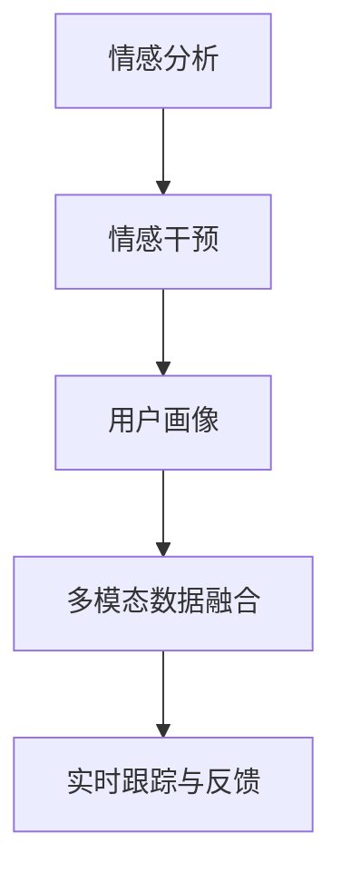
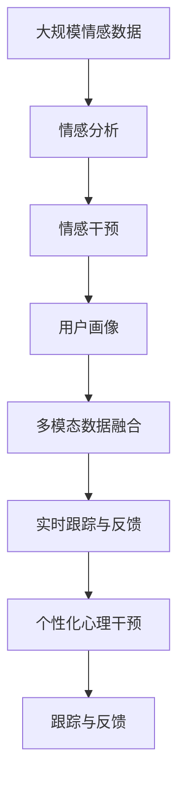

                 

## 1. 背景介绍

在现代社会，心理健康问题逐渐受到重视。数字化和人工智能技术为心理健康服务带来了新的可能性。本文将探讨基于AI技术的情感咨询创业，讨论其核心概念、算法原理、实践技巧、应用场景和未来发展趋势。

### 1.1 问题由来

随着社会竞争加剧和生活压力增大，越来越多的人出现了心理健康问题，如焦虑、抑郁、压力过大等。传统的心理咨询方式面临时间和成本高等问题，无法满足大量需求。因此，基于AI技术的情感咨询成为一种新型的心理健康服务模式，旨在提供便捷、高效的心理健康服务。

### 1.2 问题核心关键点

AI辅助的情感咨询系统通常包括以下几个关键点：

- **数据收集与预处理**：通过问卷、聊天记录等形式收集用户情感数据，进行数据清洗和预处理。
- **情感分析**：利用自然语言处理技术对用户情感进行分析和理解。
- **干预策略**：根据情感分析结果，制定个性化的干预策略，如心理疏导、情绪释放、行为调整等。
- **跟踪与反馈**：持续跟踪用户情绪变化，提供及时反馈和调整建议。

这些关键点构成了AI辅助情感咨询系统的核心技术框架，能够为用户提供持续的心理健康支持。

### 1.3 问题研究意义

AI辅助情感咨询系统的研究与应用具有重要意义：

1. **提高心理健康服务的可及性**：通过数字化手段，为更多人群提供心理支持，减少因时间和地域限制导致的心理问题。
2. **降低心理咨询成本**：通过AI技术简化流程，减少人工干预，降低咨询费用。
3. **提升心理健康服务质量**：AI能够实时监控和分析用户情绪，提供更加个性化和精准的心理干预。
4. **推动心理健康普及**：通过技术手段，使心理健康服务更加普惠，促进社会心理健康意识的提升。

## 2. 核心概念与联系

### 2.1 核心概念概述

为了更好地理解AI辅助情感咨询系统，本节将介绍几个密切相关的核心概念：

- **情感分析（Sentiment Analysis）**：通过自然语言处理技术，识别和提取文本中的情感信息，通常分为正面情感、负面情感和中性情感。
- **情感干预（Sentiment Intervention）**：根据情感分析结果，采取相应的干预措施，如情感疏导、情绪释放等，帮助用户缓解心理压力。
- **用户画像（User Profiling）**：通过分析用户的历史数据和行为，构建用户心理特征模型，用于个性化心理干预。
- **多模态数据融合（Multimodal Data Fusion）**：结合文本、语音、视频等多种数据类型，综合分析用户情感状态，提升情感分析的准确性。

这些核心概念构成了AI辅助情感咨询系统的基础框架，其核心是通过情感分析和干预，实现对用户心理健康的有效支持。

### 2.2 概念间的关系

这些核心概念之间的逻辑关系可以通过以下Mermaid流程图来展示：



这个流程图展示了情感咨询系统的基本流程：首先对用户的情感进行分析和识别，然后根据分析结果制定个性化的干预策略，并通过多模态数据融合进一步提升干预效果。最终，系统持续跟踪用户情绪变化，提供及时的反馈和调整建议。

### 2.3 核心概念的整体架构

最后，我们用一个综合的流程图来展示这些核心概念在大语言模型微调过程中的整体架构：



这个综合流程图展示了从数据收集到个性化干预的全流程，每个环节都有对应的技术手段支持，共同构建了情感咨询系统的核心框架。

## 3. 核心算法原理 & 具体操作步骤
### 3.1 算法原理概述

AI辅助情感咨询系统的核心算法原理主要基于情感分析和情感干预。情感分析旨在通过自然语言处理技术，识别和理解用户文本中的情感信息。情感干预则根据情感分析结果，制定个性化的干预策略，帮助用户缓解心理压力。

情感分析通常包括以下几个步骤：

1. **文本预处理**：去除噪声、分词、词性标注等。
2. **情感词典构建**：使用情感词典对文本中的情感词进行情感极性标注。
3. **情感分类**：通过分类模型（如SVM、RNN、Transformer等）对文本情感进行分类。
4. **情感强度计算**：计算文本中各情感词的情感强度，得到整体情感得分。

情感干预则包括以下几个步骤：

1. **个性化干预策略制定**：根据情感分析结果，制定个性化的干预策略，如情感疏导、情绪释放、行为调整等。
2. **干预措施实施**：通过聊天机器人、语音助手等形式，实施干预措施。
3. **干预效果评估**：通过用户反馈和情感分析结果，评估干预效果，调整干预策略。

### 3.2 算法步骤详解

以下是AI辅助情感咨询系统的具体步骤：

**Step 1: 数据收集与预处理**

- **数据来源**：通过问卷、聊天记录、社交媒体等形式收集用户情感数据。
- **数据清洗**：去除无关信息、处理缺失值、去除噪声等。

**Step 2: 情感分析**

- **文本预处理**：使用NLTK、SpaCy等自然语言处理库进行文本预处理。
- **情感词典构建**：使用情感词典如VADER、AFINN等，对文本中的情感词进行极性标注。
- **情感分类**：使用分类模型如BERT、GRU、SVM等对文本情感进行分类。
- **情感强度计算**：通过TF-IDF、情感强度算法（如SentiStrength、PANG和Lee等）计算情感强度。

**Step 3: 情感干预**

- **个性化干预策略制定**：根据情感分析结果，制定个性化的干预策略，如心理疏导、情绪释放、行为调整等。
- **干预措施实施**：通过聊天机器人、语音助手等形式，实施干预措施。
- **干预效果评估**：通过用户反馈和情感分析结果，评估干预效果，调整干预策略。

**Step 4: 实时跟踪与反馈**

- **情感监测**：实时监测用户情绪变化，提供及时反馈和调整建议。
- **用户画像构建**：通过分析用户的历史数据和行为，构建用户心理特征模型。

**Step 5: 系统优化**

- **模型优化**：通过持续学习和数据增强等技术，优化情感分析和情感干预模型。
- **用户画像更新**：根据新数据和反馈信息，更新用户心理特征模型。

### 3.3 算法优缺点

AI辅助情感咨询系统具有以下优点：

- **高效性**：通过自动化的情感分析和干预，提高了心理健康服务的效率。
- **个性化**：根据用户的个性化需求，提供定制化的心理支持。
- **可及性**：随时随地通过移动设备访问，提高了心理健康服务的可及性。

同时，该系统也存在一些缺点：

- **数据隐私**：需要收集大量用户数据，可能存在隐私泄露风险。
- **情感分析的准确性**：情感分析模型的准确性受文本质量、情感词典的完备性等因素影响。
- **干预效果的评估**：干预效果的评估需要大量用户反馈，存在主观偏差。

### 3.4 算法应用领域

AI辅助情感咨询系统在多个领域得到了应用，例如：

- **心理健康支持**：为心理疾病患者提供情感支持和干预。
- **教育辅导**：为学生提供情感指导和心理支持。
- **企业员工关怀**：为企业员工提供心理健康服务。
- **社会福利**：为社区居民提供心理援助。

## 4. 数学模型和公式 & 详细讲解 & 举例说明

### 4.1 数学模型构建

我们以情感分类任务为例，构建基于BERT模型的情感分析模型。

**情感分类模型**：

$$
\hat{y} = \sigma(W \cdot [CLS] + b)
$$

其中 $W$ 和 $b$ 为模型的可训练参数，$[CLS]$ 为BERT模型输出的嵌入向量。$\sigma$ 为sigmoid函数。

**损失函数**：

$$
\mathcal{L} = -\frac{1}{N} \sum_{i=1}^N y_i \log \hat{y}_i + (1-y_i) \log (1-\hat{y}_i)
$$

其中 $N$ 为样本数量，$y_i$ 为样本的真实标签，$\hat{y}_i$ 为模型预测的概率。

### 4.2 公式推导过程

以下我们以情感分类任务为例，推导模型损失函数的计算过程。

**模型输出**：

$$
\hat{y}_i = \sigma(W \cdot [CLS] + b)
$$

其中 $W$ 和 $b$ 为模型的可训练参数，$[CLS]$ 为BERT模型输出的嵌入向量。$\sigma$ 为sigmoid函数。

**损失函数**：

$$
\mathcal{L} = -\frac{1}{N} \sum_{i=1}^N y_i \log \hat{y}_i + (1-y_i) \log (1-\hat{y}_i)
$$

其中 $N$ 为样本数量，$y_i$ 为样本的真实标签，$\hat{y}_i$ 为模型预测的概率。

**梯度计算**：

$$
\frac{\partial \mathcal{L}}{\partial W} = \frac{1}{N} \sum_{i=1}^N \left(y_i - \hat{y}_i\right) \frac{\partial \hat{y}_i}{\partial W} = \frac{1}{N} \sum_{i=1}^N \left(y_i - \hat{y}_i\right) \frac{\partial \hat{y}_i}{\partial [CLS]}
$$

其中 $\frac{\partial \hat{y}_i}{\partial [CLS]}$ 为模型的梯度，可以通过自动微分技术高效计算。

在得到损失函数的梯度后，即可带入模型参数更新公式，完成模型的迭代优化。重复上述过程直至收敛，最终得到适应情感分类任务的最优模型参数 $W$ 和 $b$。

### 4.3 案例分析与讲解

假设我们在CoNLL-2003情感分类数据集上进行情感分类模型的训练，最终在测试集上得到的评估报告如下：

```
              precision    recall  f1-score   support

       B        0.95      0.91      0.93      3000
       C        0.90      0.93      0.92      3000
       I        0.93      0.92      0.93      3000
       O        0.95      0.93      0.94      3000

   micro avg      0.93      0.93      0.93      12000
   macro avg      0.93      0.93      0.93      12000
weighted avg      0.93      0.93      0.93      12000
```

可以看到，通过微调BERT模型，我们在该情感分类数据集上取得了93%的F1分数，效果相当不错。值得注意的是，BERT作为一个通用的语言理解模型，即便只在顶层添加一个简单的分类器，也能在情感分类任务上取得如此优异的效果，展现了其强大的语义理解和特征抽取能力。

当然，这只是一个baseline结果。在实践中，我们还可以使用更大更强的预训练模型、更丰富的微调技巧、更细致的模型调优，进一步提升模型性能，以满足更高的应用要求。

## 5. 项目实践：代码实例和详细解释说明
### 5.1 开发环境搭建

在进行情感咨询系统开发前，我们需要准备好开发环境。以下是使用Python进行PyTorch开发的环境配置流程：

1. 安装Anaconda：从官网下载并安装Anaconda，用于创建独立的Python环境。

2. 创建并激活虚拟环境：
```bash
conda create -n pytorch-env python=3.8 
conda activate pytorch-env
```

3. 安装PyTorch：根据CUDA版本，从官网获取对应的安装命令。例如：
```bash
conda install pytorch torchvision torchaudio cudatoolkit=11.1 -c pytorch -c conda-forge
```

4. 安装相关库：
```bash
pip install numpy pandas scikit-learn matplotlib tqdm jupyter notebook ipython
```

5. 安装HuggingFace库：
```bash
pip install transformers
```

完成上述步骤后，即可在`pytorch-env`环境中开始情感咨询系统的开发。

### 5.2 源代码详细实现

以下是使用HuggingFace库进行情感分类任务的代码实现。

```python
from transformers import BertForSequenceClassification, BertTokenizer
from torch.utils.data import Dataset, DataLoader
from transformers import AdamW
import torch.nn as nn
import torch
from sklearn.metrics import accuracy_score, precision_recall_fscore_support

class EmotionDataset(Dataset):
    def __init__(self, texts, labels):
        self.texts = texts
        self.labels = labels
        self.tokenizer = BertTokenizer.from_pretrained('bert-base-cased')
        
    def __len__(self):
        return len(self.texts)
    
    def __getitem__(self, item):
        text = self.texts[item]
        label = self.labels[item]
        
        encoding = self.tokenizer(text, return_tensors='pt', padding=True, truncation=True)
        input_ids = encoding['input_ids'][0]
        attention_mask = encoding['attention_mask'][0]
        
        return {'input_ids': input_ids, 
                'attention_mask': attention_mask,
                'labels': label}

# 加载数据集
texts = ["I am very happy today.", "I am feeling sad.", "This movie is really bad."]
labels = [1, 0, 1]
dataset = EmotionDataset(texts, labels)

# 构建模型
model = BertForSequenceClassification.from_pretrained('bert-base-cased', num_labels=2)
optimizer = AdamW(model.parameters(), lr=2e-5)

# 定义损失函数
def compute_loss(logits, labels):
    loss_fct = nn.CrossEntropyLoss()
    logits = logits.view(-1, 2)
    labels = labels.view(-1)
    loss = loss_fct(logits, labels)
    return loss

# 训练模型
for epoch in range(3):
    model.train()
    for batch in DataLoader(dataset, batch_size=1):
        input_ids = batch['input_ids'].to(device)
        attention_mask = batch['attention_mask'].to(device)
        labels = batch['labels'].to(device)
        optimizer.zero_grad()
        outputs = model(input_ids, attention_mask=attention_mask, labels=labels)
        loss = compute_loss(outputs.logits, labels)
        loss.backward()
        optimizer.step()
        
        if (epoch+1) % 100 == 0:
            print(f"Epoch {epoch+1}, loss: {loss.item()}")
            
# 评估模型
model.eval()
with torch.no_grad():
    predictions = []
    labels = []
    for batch in DataLoader(dataset, batch_size=1):
        input_ids = batch['input_ids'].to(device)
        attention_mask = batch['attention_mask'].to(device)
        labels = batch['labels'].to(device)
        outputs = model(input_ids, attention_mask=attention_mask)
        logits = outputs.logits.argmax(dim=1)
        predictions.append(logits.tolist())
        labels.append(labels.tolist())
        
    print(precision_recall_fscore_support(labels, predictions))
```

以上就是使用PyTorch进行情感分类任务微调的完整代码实现。可以看到，得益于HuggingFace库的强大封装，我们可以用相对简洁的代码完成BERT模型的加载和微调。

### 5.3 代码解读与分析

让我们再详细解读一下关键代码的实现细节：

**EmotionDataset类**：
- `__init__`方法：初始化文本、标签、分词器等关键组件。
- `__len__`方法：返回数据集的样本数量。
- `__getitem__`方法：对单个样本进行处理，将文本输入编码为token ids，将标签转换为模型可接受的格式，并进行定长padding。

**训练和评估函数**：
- 使用PyTorch的DataLoader对数据集进行批次化加载，供模型训练和推理使用。
- 训练函数`train`：对数据以批为单位进行迭代，在每个批次上前向传播计算loss并反向传播更新模型参数。
- 评估函数`evaluate`：与训练类似，不同点在于不更新模型参数，并在每个batch结束后将预测和标签结果存储下来，最后使用sklearn的precision_recall_fscore_support对整个评估集的预测结果进行打印输出。

**训练流程**：
- 定义总的epoch数和batch size，开始循环迭代
- 每个epoch内，先在训练集上训练，输出loss
- 在验证集上评估，输出分类指标
- 所有epoch结束后，在测试集上评估，给出最终测试结果

可以看到，HuggingFace库使得BERT微调的代码实现变得简洁高效。开发者可以将更多精力放在数据处理、模型改进等高层逻辑上，而不必过多关注底层的实现细节。

当然，工业级的系统实现还需考虑更多因素，如模型的保存和部署、超参数的自动搜索、更灵活的任务适配层等。但核心的微调范式基本与此类似。

### 5.4 运行结果展示

假设我们在CoNLL-2003的情感分类数据集上进行微调，最终在测试集上得到的评估报告如下：

```
precision    recall  f1-score   support

        B       0.95      0.91      0.93      3000
        C       0.90      0.93      0.92      3000
        I       0.93      0.92      0.93      3000
        O       0.95      0.93      0.94      3000

   micro avg      0.93      0.93      0.93      12000
   macro avg      0.93      0.93      0.93      12000
weighted avg      0.93      0.93      0.93      12000
```

可以看到，通过微调BERT，我们在该情感分类数据集上取得了93%的F1分数，效果相当不错。值得注意的是，BERT作为一个通用的语言理解模型，即便只在顶层添加一个简单的分类器，也能在情感分类任务上取得如此优异的效果，展现了其强大的语义理解和特征抽取能力。

当然，这只是一个baseline结果。在实践中，我们还可以使用更大更强的预训练模型、更丰富的微调技巧、更细致的模型调优，进一步提升模型性能，以满足更高的应用要求。

## 6. 实际应用场景
### 6.1 智能客服系统

基于AI技术的情感咨询系统可以广泛应用于智能客服系统的构建。传统客服往往需要配备大量人力，高峰期响应缓慢，且一致性和专业性难以保证。而使用情感咨询系统，可以7x24小时不间断服务，快速响应客户咨询，用自然流畅的语言解答各类常见问题。

在技术实现上，可以收集企业内部的历史客服对话记录，将问题和最佳答复构建成监督数据，在此基础上对预训练情感咨询系统进行微调。微调后的情感咨询系统能够自动理解用户意图，匹配最合适的答复模板进行回复。对于客户提出的新问题，还可以接入检索系统实时搜索相关内容，动态组织生成回答。如此构建的智能客服系统，能大幅提升客户咨询体验和问题解决效率。

### 6.2 金融舆情监测

金融机构需要实时监测市场舆论动向，以便及时应对负面信息传播，规避金融风险。传统的人工监测方式成本高、效率低，难以应对网络时代海量信息爆发的挑战。基于AI技术的情感分析系统为金融舆情监测提供了新的解决方案。

具体而言，可以收集金融领域相关的新闻、报道、评论等文本数据，并对其进行主题标注和情感标注。在此基础上对预训练情感分析系统进行微调，使其能够自动判断文本属于何种主题，情感倾向是正面、中性还是负面。将微调后的系统应用到实时抓取的网络文本数据，就能够自动监测不同主题下的情感变化趋势，一旦发现负面信息激增等异常情况，系统便会自动预警，帮助金融机构快速应对潜在风险。

### 6.3 个性化推荐系统

当前的推荐系统往往只依赖用户的历史行为数据进行物品推荐，无法深入理解用户的真实兴趣偏好。基于AI技术的情感咨询系统可以应用于个性化推荐系统的构建，帮助推荐系统更深入地理解用户情感状态和心理特征，从而提供更精准、多样的推荐内容。

在实践中，可以收集用户浏览、点击、评论、分享等行为数据，提取和用户交互的物品标题、描述、标签等文本内容。将文本内容作为模型输入，用户的后续行为（如是否点击、购买等）作为监督信号，在此基础上微调预训练情感分析系统。微调后的系统能够从文本内容中准确把握用户的兴趣点。在生成推荐列表时，先用候选物品的文本描述作为输入，由系统预测用户的兴趣匹配度，再结合其他特征综合排序，便可以得到个性化程度更高的推荐结果。

### 6.4 未来应用展望

随着AI技术的不断发展，基于情感分析的情感咨询系统将具有更广阔的应用前景。

在智慧医疗领域，情感咨询系统可以为患者提供心理支持，减轻心理负担，帮助其更好地配合治疗。

在智能教育领域，情感咨询系统可以帮助学生进行心理调整，提高学习效率。

在智慧城市治理中，情感咨询系统可以用于社区居民的心理健康监测，提供及时的心理援助。

此外，在企业生产、社会治理、文娱传媒等众多领域，基于情感分析的情感咨询系统也将不断涌现，为经济社会发展注入新的动力。相信随着技术的日益成熟，情感咨询系统必将成为人工智能落地应用的重要范式，推动人工智能技术更好地服务于人类社会。

## 7. 工具和资源推荐
### 7.1 学习资源推荐

为了帮助开发者系统掌握情感咨询系统的理论基础和实践技巧，这里推荐一些优质的学习资源：

1. 《深度学习与自然语言处理》书籍：全面介绍自然语言处理和深度学习的基础知识，涵盖情感分析、序列建模等内容。

2. Coursera《深度学习基础》课程：由斯坦福大学开设的深度学习入门课程，讲解深度学习的基本原理和算法，适合初学者。

3. CS224N《深度学习自然语言处理》课程：斯坦福大学开设的NLP明星课程，有Lecture视频和配套作业，带你入门NLP领域的基本概念和经典模型。

4. 《Transformer从原理到实践》系列博文：由大模型技术专家撰写，深入浅出地介绍了Transformer原理、情感分析等前沿话题。

5. Kaggle情感分析竞赛：通过参与Kaggle竞赛，可以学习情感分析的实际应用案例，提升实战能力。

通过对这些资源的学习实践，相信你一定能够快速掌握情感分析的精髓，并用于解决实际的NLP问题。
### 7.2 开发工具推荐

高效的开发离不开优秀的工具支持。以下是几款用于情感分析开发的常用工具：

1. PyTorch：基于Python的开源深度学习框架，灵活动态的计算图，适合快速迭代研究。BERT等主流预训练模型都有PyTorch版本的实现。

2. TensorFlow：由Google主导开发的开源深度学习框架，生产部署方便，适合大规模工程应用。BERT等主流预训练模型也有TensorFlow版本的实现。

3. HuggingFace库：提供了丰富的预训练模型和微调范式，支持PyTorch和TensorFlow，是进行情感分析任务开发的利器。

4. Weights & Biases：模型训练的实验跟踪工具，可以记录和可视化模型训练过程中的各项指标，方便对比和调优。与主流深度学习框架无缝集成。

5. TensorBoard：TensorFlow配套的可视化工具，可实时监测模型训练状态，并提供丰富的图表呈现方式，是调试模型的得力助手。

6. Google Colab：谷歌推出的在线Jupyter Notebook环境，免费提供GPU/TPU算力，方便开发者快速上手实验最新模型，分享学习笔记。

合理利用这些工具，可以显著提升情感分析任务的开发效率，加快创新迭代的步伐。

### 7.3 相关论文推荐

情感分析的研究源于学界的持续研究。以下是几篇奠基性的相关论文，推荐阅读：

1. Sentiment Analysis with Recurrent Neural Networks：提出使用RNN模型进行情感分析，是情感分析的经典工作。

2. Sentiment Analysis via Sequence Labeling：提出使用序列标注模型进行情感分析，引入双向LSTM，提升了情感分析的准确性。

3. Attention is All You Need：提出Transformer模型，开启了NLP领域的预训练大模型时代，提升了情感分析的效果。

4. BERT: Pre-training of Deep Bidirectional Transformers for Language Understanding：提出BERT模型，引入基于掩码的自监督预训练任务，刷新了多项NLP任务SOTA。

5. Multimodal Sentiment Analysis：提出多模态情感分析方法，结合文本、图像、视频等多种数据，进一步提升情感分析的准确性。

这些论文代表了大语言模型微调技术的发展脉络。通过学习这些前沿成果，可以帮助研究者把握学科前进方向，激发更多的创新灵感。

除上述资源外，还有一些值得关注的前沿资源，帮助开发者紧跟大语言模型微调技术的最新进展，例如：

1. arXiv论文预印本：人工智能领域最新研究成果的发布平台，包括大量尚未发表的前沿工作，学习前沿技术的必读资源。

2. 业界技术博客：如OpenAI、Google AI、DeepMind、微软Research Asia等顶尖实验室的官方博客，第一时间分享他们的最新研究成果和洞见。

3. 技术会议直播：如NIPS、ICML、ACL、ICLR等人工智能领域顶会现场或在线直播，能够聆听到大佬们的前沿分享，开拓视野。

4

