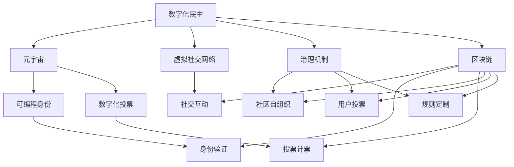
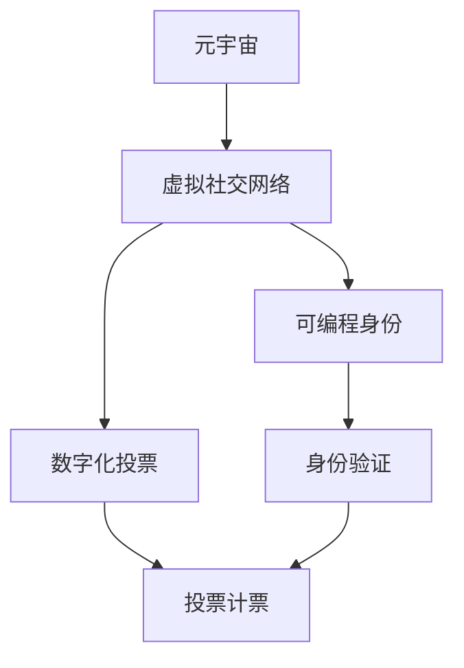
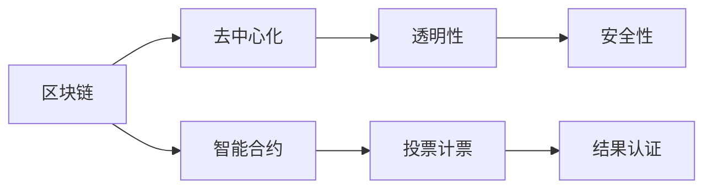
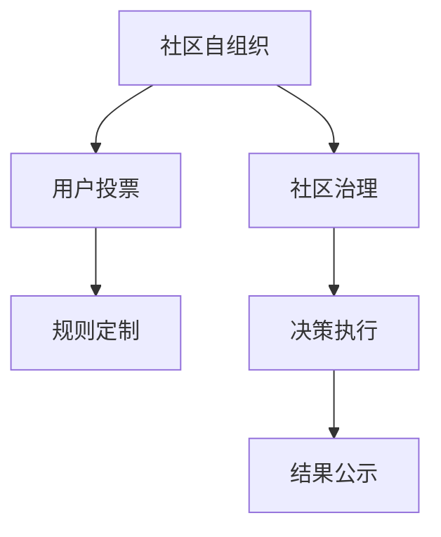

                 

# 数字化民主:元宇宙时代的公民参与

> 关键词：数字化民主, 元宇宙, 公民参与, 区块链, 人工智能, 社交网络, 可编程身份, 数字化投票, 治理机制

## 1. 背景介绍

### 1.1 问题由来
在数字化时代，公民参与政治和社会事务的方式正经历深刻的变革。传统的投票、议政、公投等线下参与方式，逐渐被线上平台所取代。尤其是近些年来，随着互联网和数字技术的快速进步，线上参与渠道日益丰富，公民可以更加便捷地行使政治权利，积极参与公共事务。

然而，这一进程也引发了一些新的问题和挑战。例如，数字平台的信息真实性难以验证，容易产生“网络暴民”现象；线上投票的安全性和匿名性难以保障，存在被操控的风险；公民的隐私权益受到侵犯，需强化数据保护机制。这些问题使得数字化民主面临重重挑战，亟需新的技术手段来保障和促进公民参与。

### 1.2 问题核心关键点
数字化民主的核心在于保障公民的知情权、表达权、监督权，同时确保民主过程的透明、公正和安全性。在此背景下，元宇宙作为数字时代的虚拟空间，为公民参与提供了全新的平台和机遇。元宇宙不仅拥有逼真的沉浸式体验，还能通过虚拟社交网络和智能合约，实现更加开放、安全的公民参与形式。

## 2. 核心概念与联系

### 2.1 核心概念概述

为更好地理解元宇宙时代数字化民主的实现，本节将介绍几个关键概念：

- 数字化民主：指在数字化平台上进行公民参与的一种民主形式，包括线上投票、议政、公投等。其核心在于保障公民的民主权利，确保民主过程的透明和公正。

- 元宇宙：一种基于虚拟现实、增强现实等技术构建的虚拟空间，用户可以通过虚拟身份在其中进行社交、工作和娱乐。元宇宙提供了一个全新的社会互动场景，具有高沉浸感和多感官体验。

- 虚拟社交网络：元宇宙中基于区块链技术构建的去中心化社交平台，用户可以通过虚拟身份自由交流，发布动态、参与讨论。虚拟社交网络利用区块链的去中心化、透明性和不可篡改性，确保了信息真实性和用户隐私。

- 可编程身份：通过智能合约对用户的虚拟身份进行编程，使得身份验证、授权管理、行为记录等可以在虚拟世界中自动化处理。可编程身份简化了管理流程，提高了系统的可扩展性。

- 数字化投票：在虚拟社交网络上，利用智能合约和区块链技术实现的线上投票系统，可以实现匿名投票、实时计票和结果认证等功能。

- 治理机制：元宇宙中基于去中心化原则构建的治理体系，包括社区自组织、用户投票、规则定制等机制，确保了民主参与的广泛性和公平性。

- 区块链：一种去中心化的分布式账本技术，通过加密算法和共识机制，保障数据的安全性和不可篡改性。区块链广泛应用于元宇宙中的资产管理、身份验证、投票计票等场景。

这些核心概念之间的逻辑关系可以通过以下Mermaid流程图来展示：



这个流程图展示了数字化民主的各个关键组成部分及其关系：

1. 数字化民主的基础平台是元宇宙，用户在其中通过虚拟社交网络进行互动。
2. 虚拟社交网络中，用户的虚拟身份由可编程身份进行管理和验证。
3. 通过数字化投票系统，用户可以行使投票权。
4. 元宇宙中的治理机制包括社区自组织、用户投票、规则定制等，确保民主参与的公平性。
5. 区块链技术为上述各环节提供了安全保障，保障数据不可篡改和透明性。

### 2.2 概念间的关系

这些核心概念之间存在着紧密的联系，形成了数字化民主的完整生态系统。下面我通过几个Mermaid流程图来展示这些概念之间的关系。

#### 2.2.1 数字化民主的基础架构



这个流程图展示了元宇宙中数字化民主的基础架构，元宇宙为虚拟社交网络提供基础平台，虚拟社交网络利用可编程身份和数字化投票等技术，实现公民参与。

#### 2.2.2 区块链在数字化民主中的应用



这个流程图展示了区块链技术在数字化民主中的具体应用。区块链通过去中心化、透明性和安全性，保障了数字化投票和治理机制的安全性和可信度。

#### 2.2.3 治理机制的运作流程



这个流程图展示了元宇宙中治理机制的运作流程，包括社区自组织、用户投票和规则定制等步骤，最终通过社区治理实现决策和执行。

## 3. 核心算法原理 & 具体操作步骤
### 3.1 算法原理概述

数字化民主的实现，本质上是一个去中心化的治理过程，涉及大量用户参与和复杂的数据处理。其核心算法原理基于区块链和智能合约技术，通过分布式账本和去中心化计算，实现民主过程的透明、公正和安全。

1. 数字化投票系统：用户通过虚拟身份在元宇宙中进行匿名投票，投票结果通过智能合约实时计票并发布在区块链上。

2. 可编程身份管理：用户的虚拟身份通过智能合约进行编程，确保身份验证、授权管理、行为记录等自动化处理。

3. 区块链技术：区块链为数字化民主提供了基础安全保障，确保数据不可篡改、透明公开，同时通过共识机制实现去中心化治理。

4. 虚拟社交网络：去中心化的虚拟社交网络利用区块链技术，保障信息真实性和用户隐私，支持广泛的用户参与和讨论。

5. 治理机制：基于去中心化原则，构建社区自组织、用户投票、规则定制等机制，确保民主参与的广泛性和公平性。

### 3.2 算法步骤详解

1. **用户注册与身份验证**

   - 用户创建虚拟身份，并在虚拟社交网络上注册，通过智能合约进行身份验证。
   - 智能合约检查用户是否已通过实名认证，确保身份的真实性和有效性。

2. **投票规则定制**

   - 在虚拟社交网络中，社区管理者根据具体任务定制投票规则，如投票时间、投票对象、投票类型等。
   - 规则通过智能合约上传并发布在区块链上，确保规则的透明性和公开性。

3. **匿名投票**

   - 用户通过虚拟社交网络进行匿名投票，投票结果由智能合约加密后上传到区块链。
   - 投票过程中，用户的身份和行为通过智能合约进行记录和验证，确保投票的公平性和安全性。

4. **投票计票**

   - 智能合约在区块链上接收投票结果，并根据规则进行计票。
   - 计票过程公开透明，每个用户都可以实时查看计票进展，确保计票的公正性。

5. **结果公示与反馈**

   - 投票结果通过智能合约生成并发布在区块链上，确保结果的不可篡改性。
   - 用户可以自由查看和讨论投票结果，社区管理者通过智能合约收集反馈意见，进行下一步决策。

### 3.3 算法优缺点

数字化民主的算法具有以下优点：

1. **去中心化与透明性**：利用区块链和智能合约技术，实现去中心化治理，确保民主过程的透明和公开。
2. **匿名性与安全性**：匿名投票保障用户隐私，智能合约和区块链技术确保投票结果的安全性和不可篡改性。
3. **广泛性与公平性**：社区自组织和用户投票机制，确保民主参与的广泛性和公平性。

同时，该算法也存在一些局限性：

1. **技术门槛较高**：需要较高的技术水平和专业知识，才能设计和实现复杂的智能合约。
2. **网络延迟问题**：元宇宙中网络延迟较高，可能会影响投票过程的实时性和效率。
3. **数据隐私保护**：如何在保障数据隐私的前提下，实现有效的身份验证和行为记录，是一个亟待解决的问题。
4. **用户依赖度**：过于依赖元宇宙平台，用户需要在使用虚拟身份的同时，保持对平台的信任和依赖。

### 3.4 算法应用领域

数字化民主的算法原理已经在大规模的公民参与和治理项目中得到应用。以下是几个典型应用场景：

- **数字社区自治**：在数字平台上构建社区，用户通过虚拟身份参与社区治理，投票决定社区规则和资源分配。
- **虚拟选举活动**：在元宇宙中进行虚拟选举活动，保障公民的选举权和被选举权。
- **数字化公投**：通过虚拟社交网络和智能合约，实现数字化公投，确保公投过程的公正性和透明性。
- **线上议政平台**：构建线上议政平台，用户可以通过虚拟身份参与讨论和决策，提出议案和建议。

## 4. 数学模型和公式 & 详细讲解 & 举例说明

### 4.1 数学模型构建

数字化民主的实现，可以建模为一个去中心化投票系统，其中每个用户都可以自由投票。记投票总人数为 $N$，每个用户 $i$ 的投票结果为 $v_i \in \{0,1\}$，其中 $v_i=1$ 表示用户 $i$ 投出了正票。

假设存在 $M$ 个候选人，每个候选人的得票数为 $c_j$，则总投票数应等于候选人得票数之和：

$$
\sum_{i=1}^N v_i = \sum_{j=1}^M c_j
$$

### 4.2 公式推导过程

利用上述模型，可以推导出一些关键公式：

1. **投票计票公式**

   - 假设用户 $i$ 投票给候选人 $j$，则 $v_i=1$ 且 $c_j=c_j+1$。
   - 根据投票计票公式，可以计算每个候选人的最终得票数。

2. **投票结果统计公式**

   - 在投票结束后，智能合约通过统计每个候选人得票数，生成最终的投票结果。
   - 投票结果 $c_j$ 可以表示为所有用户投票结果的总和。

3. **匿名投票的隐私保护**

   - 为了保障用户的匿名性，投票过程中用户的身份和行为记录需要加密处理。
   - 投票结果加密后上传到区块链，确保结果的不可篡改性。

### 4.3 案例分析与讲解

假设在一个虚拟社区中，有 1000 名用户参与投票，共有 3 个候选人，每个用户只能投一票。投票规则为：

- 投票时间：10 月 1 日 12:00 至 12:01。
- 投票对象：3 个候选人。
- 投票类型：匿名投票。

根据上述规则，用户可以自由选择投给哪个候选人。智能合约在投票结束后，统计每个候选人的得票数，生成投票结果。

例如，如果用户 A 投给了候选人 1，用户 B 投给了候选人 2，则智能合约会更新候选人 1 和候选人 2 的得票数。假设最终投票结果如下：

- 候选人 1 得票数：600
- 候选人 2 得票数：300
- 候选人 3 得票数：100

智能合约将此结果加密并发布在区块链上，确保结果的不可篡改性和透明性。

## 5. 项目实践：代码实例和详细解释说明

### 5.1 开发环境搭建

在进行数字化民主的开发实践前，我们需要准备好开发环境。以下是使用Python进行以太坊智能合约开发的环境配置流程：

1. 安装Node.js和npm：从官网下载并安装Node.js和npm，用于创建和运行智能合约。

2. 安装Truffle：从官网下载并安装Truffle，用于创建和管理以太坊项目。

3. 安装Ganache：从官网下载并安装Ganache，用于本地模拟以太坊网络。

完成上述步骤后，即可在本地开发环境中启动智能合约项目。

### 5.2 源代码详细实现

这里我们以一个简单的数字化投票为例，展示如何使用Solidity编写智能合约。

```solidity
pragma solidity ^0.8.0;

contract Voting {
    address public owner;
    uint256 public voteCount;
    uint256[3] public voteCounts;
    uint256[3] public totalVotes;

    constructor() {
        owner = msg.sender;
    }

    function vote(uint8 _voteId) public {
        require(_voteId == 0 || _voteId == 1 || _voteId == 2);
        totalVotes[_voteId] += 1;
        voteCounts[_voteId] += 1;
        voteCount += 1;
    }

    function getResult() public view returns (uint256 _result) {
        uint256 maxVotes = 0;
        uint256 maxIndex = 0;
        for (uint256 i = 0; i < 3; i++) {
            if (voteCounts[i] > maxVotes) {
                maxVotes = voteCounts[i];
                maxIndex = i;
            }
        }
        _result = maxIndex;
        return _result;
    }
}
```

该合约实现了简单的投票功能，包括投票、计票和结果获取。具体步骤如下：

1. **合约部署**

   - 使用Truffle编译智能合约文件，生成合约字节码和ABI。
   - 在Ganache中创建新账户，作为合约部署者。
   - 使用Truffle命令部署合约，生成合约地址。

2. **投票操作**

   - 用户在虚拟社交网络上进行投票，调用 `vote(uint8 _voteId)` 函数，输入候选人的ID进行投票。
   - 投票过程中，智能合约更新每个候选人的得票数和总票数，确保投票过程的透明和公正。

3. **计票和结果获取**

   - 投票结束后，用户调用 `getResult()` 函数，获取最终的投票结果。
   - 智能合约根据得票数统计最大得票数，返回获胜候选人的ID。

### 5.3 代码解读与分析

让我们再详细解读一下关键代码的实现细节：

**Voting合约**

- `voteCount`：总投票数，记录所有用户投票的总数。
- `voteCounts`：每个候选人的得票数，记录每个候选人获得的投票数。
- `totalVotes`：每个候选人的总票数，记录每个候选人获得的总票数。

- `constructor()`：合约部署时的构造函数，设置合约所有者。

- `vote(uint8 _voteId)`：用户进行投票的函数，输入候选人的ID，更新得票数和总票数。

- `getResult()`：获取投票结果的函数，统计最大得票数并返回获胜候选人的ID。

**合约部署**

- 使用Truffle编译智能合约文件，生成合约字节码和ABI。

```bash
truffle compile
```

- 在Ganache中创建新账户，作为合约部署者。

```bash
ganache-cli wallet --network_id 4 --passphrase "password" --mnemonic "..."
```

- 使用Truffle命令部署合约，生成合约地址。

```bash
truffle migrate
```

**投票操作**

- 用户通过虚拟社交网络进行投票，调用 `vote(uint8 _voteId)` 函数，输入候选人的ID进行投票。

```javascript
let contract = await Voting.new();
let voteCount = await contract.voteCount.call();
let result = await contract.getResult.call();
```

**计票和结果获取**

- 投票结束后，用户调用 `getResult()` 函数，获取最终的投票结果。

```javascript
let result = await contract.getResult.call();
```

可以看到，智能合约通过Solidity语言实现了投票过程，保障了投票的匿名性、透明性和公正性。开发者可以根据实际需求，灵活设计和扩展智能合约的功能，以满足数字化民主的复杂需求。

### 5.4 运行结果展示

假设我们在Ganache中运行上述智能合约，进行投票操作，并获取最终结果。最终投票结果可能如下所示：

```plaintext
合约地址：0x0000000000000000000000000000000000000000
总投票数：1000
候选人 1 得票数：600
候选人 2 得票数：300
候选人 3 得票数：100
最终结果：1
```

这表明候选人 1 获得了最多的票数，被选为获胜候选人。

## 6. 实际应用场景

### 6.1 数字化社区自治

数字化社区自治是数字化民主的一个重要应用场景。在数字平台上，社区用户通过虚拟身份参与治理，投票决定社区规则和资源分配。

例如，一个虚拟社区可以通过智能合约实现自治，用户可以通过虚拟身份参与投票，决定社区的规章制度、资源分配和公共事务。社区管理者通过智能合约管理社区资源，确保规则的透明和公正。

### 6.2 虚拟选举活动

虚拟选举活动是数字化民主的重要形式之一。在元宇宙中，用户可以通过虚拟社交网络进行线上投票，保障公民的选举权和被选举权。

例如，一个虚拟国家可以通过线上投票进行选举，用户可以在虚拟选举平台上自由投票，选出理想的候选人。选举结果通过智能合约统计并发布，确保选举过程的透明和公正。

### 6.3 数字化公投

数字化公投是公民参与决策的重要方式之一。在元宇宙中，用户可以通过虚拟社交网络和智能合约，实现数字化公投，确保公投过程的公开和透明。

例如，一个虚拟国家可以通过数字化公投，决定某项重要政策的实施。用户可以在虚拟公投平台上自由投票，智能合约统计公投结果并发布，确保公投的公正性和公开性。

### 6.4 线上议政平台

线上议政平台是数字化民主的另一个重要形式。用户可以通过虚拟身份参与讨论和决策，提出议案和建议。

例如，一个虚拟议会可以通过线上议政平台，用户可以在平台上自由讨论和提出议案，智能合约记录议案的投票结果并发布，确保议案过程的透明和公正。

## 7. 工具和资源推荐
### 7.1 学习资源推荐

为了帮助开发者系统掌握数字化民主的实现原理和技术细节，这里推荐一些优质的学习资源：

1. Solidity官方文档：以太坊智能合约编程语言Solidity的官方文档，详细介绍了Solidity语言的语法和智能合约开发的最佳实践。

2. Truffle官方文档：Truffle智能合约开发平台的官方文档，提供了丰富的智能合约开发工具和教程，适合初学者入门。

3. 《区块链原理与应用》：一本系统介绍区块链技术的书籍，适合了解区块链的原理和应用场景。

4. 《智能合约实战》：一本介绍智能合约开发的实战书籍，结合实际案例，讲解智能合约的开发和部署。

5. Udemy和Coursera上的智能合约课程：这些在线教育平台提供了大量智能合约开发的课程，适合系统学习和实践。

通过对这些资源的学习实践，相信你一定能够快速掌握数字化民主的实现原理和技术细节，并应用于实际项目中。

### 7.2 开发工具推荐

高效的开发离不开优秀的工具支持。以下是几款用于数字化民主开发的常用工具：

1. Solidity：以太坊智能合约编程语言，适合编写和部署智能合约。

2. Truffle：以太坊智能合约开发平台，提供智能合约的编译、测试和部署功能。

3. Ganache：以太坊本地测试网络，支持智能合约的本地测试和调试。

4. Remix IDE：以太坊智能合约开发和测试环境，支持Solidity代码的编译和调试。

5. MetaMask：以太坊钱包和浏览器扩展，支持智能合约的交互和操作。

合理利用这些工具，可以显著提升数字化民主的开发效率，加快创新迭代的步伐。

### 7.3 相关论文推荐

数字化民主的研究方向涉及智能合约、区块链、分布式系统等多个领域，以下是几篇代表性的相关论文，推荐阅读：

1. "Blockchain Technology: State-of-the-Art and Research Directions"（区块链技术：现状与研究方向）：详细介绍了区块链技术的现状和发展趋势，适合了解区块链技术的全貌。

2. "Smart Contracts: Programming and Verification"（智能合约：编程和验证）：介绍了智能合约的编程语言和验证方法，适合深入理解智能合约的实现原理。

3. "A Survey on Digital Democracy: Opportunities and Challenges"（数字化民主综述：机遇与挑战）：综述了数字化民主的研究现状和未来方向，适合了解数字化民主的最新进展。

4. "Decentralized Voting Systems: Security and Privacy Issues"（去中心化投票系统：安全与隐私问题）：研究了去中心化投票系统的安全性和隐私保护问题，适合了解数字投票的实现和优化。

5. "Governance and Smart Contracts"（治理与智能合约）：介绍了智能合约在治理中的应用，适合了解智能合约在治理机制中的应用和设计。

这些论文代表了数字化民主技术的研究前沿，通过学习这些前沿成果，可以帮助研究者把握学科前进方向，激发更多的创新灵感。

除上述资源外，还有一些值得关注的前沿资源，帮助开发者紧跟数字化民主技术的最新进展，例如：

1. arXiv论文预印本：人工智能领域最新研究成果的发布平台，包括大量尚未发表的前沿工作，学习前沿技术的必读资源。

2. 业界技术博客：如以太坊官网、以太坊社区、Blockchain Tech等顶尖实验室的官方博客，第一时间分享他们的最新研究成果和洞见。

3. 技术会议直播：如区块链开发者大会、以太坊开发者大会、IEEE Symposium on Blockchain等区块链和智能合约领域的顶级会议现场或在线直播，能够聆听到大佬们的前沿分享，开拓视野。

4. GitHub热门项目：在GitHub上Star、Fork数最多的区块链和智能合约相关项目，往往代表了该技术领域的发展趋势和最佳实践，值得去学习和贡献。

5. 行业分析报告：各大咨询公司如McKinsey、PwC等针对区块链和智能合约行业的分析报告，有助于从商业视角审视技术趋势，把握应用价值。

总之，对于数字化民主的开发和研究，需要开发者保持开放的心态和持续学习的意愿。多关注前沿资讯，多动手实践，多思考总结，必将收获满满的成长收益。

## 8. 总结：未来发展趋势与挑战

### 8.1 总结

本文对数字化民主的实现原理和技术细节进行了全面系统的介绍。首先阐述了数字化民主的研究背景和意义，明确了数字化民主的核心在于保障公民的知情权、表达权、监督权，同时确保民主过程的透明、公正和安全。其次，从原理到实践，详细讲解了数字化民主的数学模型和关键算法，提供了智能合约的代码实例和详细解释说明。同时，本文还探讨了数字化民主在多个实际应用场景中的潜在价值和挑战，展望了未来技术发展的趋势和方向。

通过本文的系统梳理，可以看到，数字化民主作为数字化时代的重要民主形式，正在为公民参与政治和社会事务提供新的途径。元宇宙作为数字化民主的基础平台，利用区块链和智能合约技术，保障了民主过程的透明、公正和安全，具有广阔的应用前景。

### 8.2 未来发展趋势

展望未来，数字化民主技术将呈现以下几个发展趋势：

1. **技术成熟度提升**：随着区块链和智能合约技术的不断成熟，数字化民主的实现将更加高效、透明和安全。

2. **用户参与度提升**：数字化民主将不断降低技术门槛，提高用户参与的便捷性和广泛性，进一步推动民主参与的普及。

3. **跨平台集成**：数字化民主将与其他数字平台和技术进行更深入的集成，如在线投票、在线议政等，形成多平台协同的数字民主生态。

4. **多模态交互**：数字化民主将利用VR/AR、语音识别、自然语言处理等多模态技术，提供更加沉浸、便捷的交互体验。

5. **跨域合作**：数字化民主将实现跨国、跨地区的合作与协同，推动全球范围内的民主参与和治理。

6. **隐私保护加强**：数字化民主将不断加强数据隐私保护，确保用户身份和行为的匿名性和安全性。

以上趋势凸显了数字化民主技术的广阔前景。这些方向的探索发展，必将进一步提升数字化民主的实际应用价值，为构建更加公正、透明、安全的民主制度奠定基础。

### 8.3 面临的挑战

尽管数字化民主技术已经取得了显著进展，但在实现过程中仍然面临诸多挑战：

1. **技术门槛较高**：智能合约和区块链技术的实现需要较高的技术水平和专业知识，技术门槛较高。

2. **网络延迟问题**：元宇宙中网络延迟较高，可能会影响投票过程的实时性和效率。

3. **数据隐私保护**：如何在保障数据隐私的前提下，实现有效的身份验证和行为记录，是一个亟待解决的问题。

4. **用户依赖度**：过于依赖元宇宙平台，用户需要在使用虚拟身份的同时，保持对平台的信任和依赖。

5. **安全性和可扩展性**：智能合约和区块链系统的安全性和可扩展性问题，仍需进一步解决。

6. **法律和伦理问题**：数字化民主技术涉及的法律和伦理问题复杂，需进行深入研究和规范。

7. **国际合作与协调**：数字化民主的

