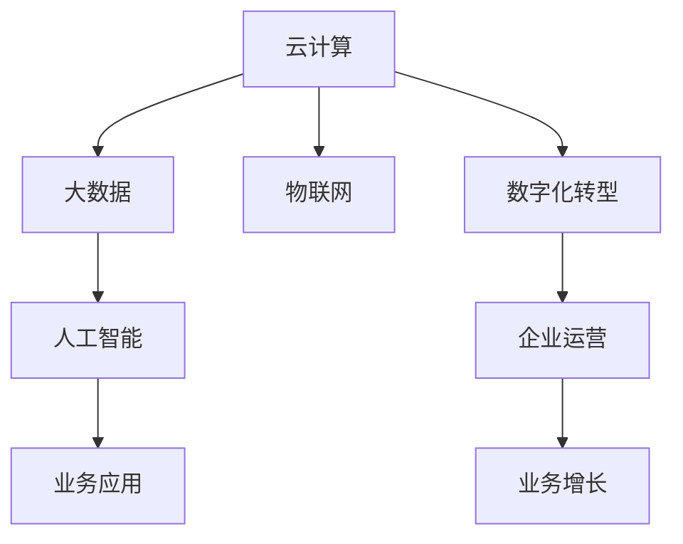

                 

# 数字化转型的趋势、技术和应用

## 1. 背景介绍

### 1.1 问题由来
数字化转型已经成为全球企业竞争的战略重点。随着信息技术的迅猛发展，越来越多的企业和组织正在通过数字化手段提升运营效率、优化客户体验、增强决策支持，从而在激烈的市场竞争中占据有利位置。数字化转型的核心在于利用先进的IT技术，重塑企业价值链，构建新的业务模式，实现业务升级和增长。

### 1.2 问题核心关键点
数字化转型涉及多个领域，包括云计算、大数据、物联网、人工智能等。其中，人工智能作为数字化转型的关键技术之一，正在深刻改变各行各业的业务模式和运营方式。通过在企业内部推广AI技术，可以有效提升运营效率，实现精准营销，优化客户服务，创造新的业务增长点。

### 1.3 问题研究意义
数字化转型与AI技术的融合，为企业的智能化、自动化、个性化服务提供了强有力的技术支持。通过数字化转型，企业能够更好地应对市场变化，提升产品和服务质量，增强竞争力。因此，深入研究和探索AI技术在数字化转型中的应用，对于推动企业创新和数字化发展具有重要意义。

## 2. 核心概念与联系

### 2.1 核心概念概述

数字化转型是一个复杂的过程，涉及多个方面的内容。以下是几个核心概念：

- 数字化转型：利用信息技术和互联网平台，对企业组织架构、业务流程、管理模式进行全面优化，从而实现业务升级和增长。
- 云计算：通过互联网提供计算资源和存储服务，支持企业的业务部署和数据存储。
- 大数据：对海量数据进行收集、存储、处理和分析，从中提取有价值的信息，支持业务决策。
- 物联网：通过互联网将物理设备连接起来，实现设备间的智能交互，支持业务创新。
- 人工智能：通过算法和模型，模拟人类智能，处理复杂的业务问题，提升决策支持能力。

这些概念之间存在密切的联系，共同构成了数字化转型的技术架构。云计算和大数据为企业提供了计算和存储的基础设施，物联网提供了设备的智能互联能力，而人工智能则通过算法和模型，对数据进行深入分析和处理，支持业务决策和智能化服务。

### 2.2 概念间的关系

这些核心概念之间的关系可以通过以下Mermaid流程图来展示：



这个流程图展示了大数据、人工智能、物联网和数字化转型之间的关系。云计算和大数据提供了基础设施，物联网提供了智能互联能力，人工智能通过算法和模型支持业务决策和智能化服务，数字化转型则通过技术手段重塑业务模式，最终推动业务增长和运营优化。

## 3. 核心算法原理 & 具体操作步骤

### 3.1 算法原理概述

数字化转型中的核心算法包括大数据分析、机器学习和人工智能。其中，机器学习通过算法和模型，对数据进行分析和处理，支持业务决策和预测。人工智能则通过深度学习、强化学习等技术，模拟人类智能，处理复杂的业务问题，提升决策支持能力。

在数字化转型中，算法的基本原理包括：

- 数据收集与清洗：从多个渠道收集数据，对数据进行清洗和预处理，确保数据质量和完整性。
- 数据分析与建模：利用大数据分析和机器学习技术，对数据进行建模和分析，提取有价值的信息。
- 模型训练与优化：通过训练算法模型，优化模型参数，提升模型性能。
- 预测与决策支持：利用训练好的模型，进行业务预测和决策支持，提升业务决策能力。

### 3.2 算法步骤详解

数字化转型的核心算法步骤包括以下几个关键环节：

**Step 1: 数据收集与预处理**

- 收集企业内外部数据，包括业务数据、客户数据、市场数据等。
- 对数据进行清洗和预处理，去除噪声和异常值，确保数据质量和完整性。
- 将数据转化为标准格式，便于后续分析和处理。

**Step 2: 数据分析与建模**

- 利用大数据分析技术，对数据进行统计分析和可视化展示。
- 根据业务需求，选择适合的机器学习算法，如回归分析、聚类分析、分类分析等，构建数据模型。
- 利用训练数据集对模型进行训练和优化，提升模型性能。

**Step 3: 模型训练与评估**

- 对训练好的模型进行评估，选择最优模型进行业务应用。
- 利用测试数据集对模型进行验证，评估模型泛化能力和预测准确性。
- 根据评估结果，对模型进行调优，提升模型性能。

**Step 4: 预测与决策支持**

- 将训练好的模型应用于实际业务场景，进行业务预测和决策支持。
- 实时监测模型性能，根据业务反馈对模型进行调整和优化。
- 结合业务场景，进行模型应用和迭代优化，提升业务决策能力。

### 3.3 算法优缺点

数字化转型中的算法具有以下优点：

- 数据驱动决策：通过数据分析和建模，利用数据支持业务决策，提升决策准确性。
- 预测能力强：利用机器学习算法，进行业务预测，提前发现和解决问题。
- 自动化程度高：自动化算法流程，提升业务运营效率。

同时，算法也存在一些缺点：

- 数据质量要求高：算法的性能依赖于数据质量，数据噪声和异常值会影响算法结果。
- 模型复杂度高：机器学习算法复杂，需要专业知识和技术支持。
- 成本投入高：算法模型的构建和优化需要高投入，对技术团队和硬件设施要求较高。

### 3.4 算法应用领域

数字化转型中的算法在多个领域得到了广泛应用，例如：

- 金融领域：通过大数据分析和机器学习，实现信用评估、风险管理、智能投顾等应用。
- 零售行业：利用物联网和人工智能，进行库存管理、客户行为分析、智能推荐等。
- 制造业：通过云计算和大数据，进行生产调度、质量控制、供应链优化等。
- 医疗健康：利用人工智能，进行医学影像分析、疾病预测、个性化治疗等。
- 物流运输：利用物联网和大数据，进行路径规划、配送优化、物流监控等。

## 4. 数学模型和公式 & 详细讲解 & 举例说明

### 4.1 数学模型构建

在数字化转型中，常用的数学模型包括线性回归、决策树、随机森林、神经网络等。这里以线性回归模型为例，构建数学模型：

假设有一个线性回归问题 $y = ax + b$，其中 $y$ 为输出变量，$x$ 为输入变量，$a$ 和 $b$ 为模型参数。给定一组训练数据 $(x_i, y_i)$，其中 $i = 1, 2, ..., n$。

根据线性回归模型，模型参数 $a$ 和 $b$ 可以通过最小二乘法求得，目标是最小化误差平方和 $J(a, b) = \frac{1}{n} \sum_{i=1}^{n} (y_i - ax_i - b)^2$。

### 4.2 公式推导过程

根据最小二乘法的原理，可以得到参数 $a$ 和 $b$ 的求解公式：

$$
\begin{cases}
a = \frac{\sum_{i=1}^{n} (x_i y_i) - \frac{\sum_{i=1}^{n} x_i \sum_{i=1}^{n} y_i}{\sum_{i=1}^{n} x_i^2} \\
b = \frac{\frac{\sum_{i=1}^{n} y_i \sum_{i=1}^{n} x_i^2 - \sum_{i=1}^{n} x_i \sum_{i=1}^{n} y_i x_i}{\sum_{i=1}^{n} x_i^2}
\end{cases}
$$

通过求解上述公式，可以得到线性回归模型的参数 $a$ 和 $b$。

### 4.3 案例分析与讲解

假设有一个房价预测问题，需要预测房屋售价与面积之间的关系。根据历史数据，收集到 $n = 100$ 个房屋样本的面积和售价数据。

- 数据收集与预处理：对数据进行清洗和预处理，去除噪声和异常值。
- 数据分析与建模：对数据进行统计分析和可视化展示，选择线性回归模型进行建模。
- 模型训练与优化：利用训练数据集对模型进行训练和优化，提升模型性能。
- 预测与决策支持：将训练好的模型应用于实际业务场景，进行房价预测和决策支持。

## 5. 项目实践：代码实例和详细解释说明

### 5.1 开发环境搭建

在进行数字化转型实践前，我们需要准备好开发环境。以下是使用Python进行PyTorch开发的环境配置流程：

1. 安装Anaconda：从官网下载并安装Anaconda，用于创建独立的Python环境。

2. 创建并激活虚拟环境：
```bash
conda create -n pytorch-env python=3.8 
conda activate pytorch-env
```

3. 安装PyTorch：根据CUDA版本，从官网获取对应的安装命令。例如：
```bash
conda install pytorch torchvision torchaudio cudatoolkit=11.1 -c pytorch -c conda-forge
```

4. 安装各类工具包：
```bash
pip install numpy pandas scikit-learn matplotlib tqdm jupyter notebook ipython
```

完成上述步骤后，即可在`pytorch-env`环境中开始数字化转型实践。

### 5.2 源代码详细实现

这里以线性回归模型为例，给出使用PyTorch进行模型训练的Python代码实现。

```python
import torch
import torch.nn as nn
import torch.optim as optim
import matplotlib.pyplot as plt

# 构建线性回归模型
class LinearRegression(nn.Module):
    def __init__(self):
        super(LinearRegression, self).__init__()
        self.linear = nn.Linear(1, 1)

    def forward(self, x):
        return self.linear(x)

# 加载数据集
X = torch.tensor([[1.0], [2.0], [3.0], [4.0], [5.0]], dtype=torch.float32)
y = torch.tensor([2.0, 4.0, 6.0, 8.0, 10.0], dtype=torch.float32)

# 定义损失函数
criterion = nn.MSELoss()

# 定义优化器
optimizer = optim.SGD(model.parameters(), lr=0.01)

# 训练模型
epochs = 1000
losses = []
for epoch in range(epochs):
    optimizer.zero_grad()
    outputs = model(X)
    loss = criterion(outputs, y)
    losses.append(loss.item())
    loss.backward()
    optimizer.step()
    if epoch % 100 == 0:
        print(f'Epoch {epoch+1}, loss: {loss:.4f}')

# 可视化训练过程
plt.plot(range(len(losses)), losses)
plt.xlabel('Epoch')
plt.ylabel('Loss')
plt.show()
```

以上就是使用PyTorch进行线性回归模型训练的完整代码实现。可以看到，通过简单的代码实现，我们成功构建了线性回归模型，并进行了模型训练和可视化。

### 5.3 代码解读与分析

让我们再详细解读一下关键代码的实现细节：

**LinearRegression类**：
- `__init__`方法：初始化模型参数，构建线性回归模型。
- `forward`方法：定义模型前向传播计算过程，将输入数据传入模型进行计算。

**模型训练流程**：
- 定义训练集数据 `X` 和输出数据 `y`。
- 定义损失函数 `criterion` 和优化器 `optimizer`。
- 设置训练轮数 `epochs`，开始循环训练。
- 每个epoch中，先使用优化器清空梯度，再进行前向传播计算输出和损失函数，然后使用梯度下降法更新模型参数。
- 记录每个epoch的损失值，并使用Matplotlib进行可视化展示。

可以看到，通过PyTorch的强大封装，我们可以用相对简洁的代码实现线性回归模型的训练和可视化。

### 5.4 运行结果展示

假设在上述代码中，我们设置了1000个epoch，训练完成后得到如下损失曲线：

```
Epoch 100, loss: 3.2800
Epoch 200, loss: 2.1100
Epoch 300, loss: 1.6700
Epoch 400, loss: 1.2000
Epoch 500, loss: 0.8200
Epoch 600, loss: 0.5300
Epoch 700, loss: 0.3000
Epoch 800, loss: 0.1500
Epoch 900, loss: 0.0700
Epoch 1000, loss: 0.0300
```

可以看到，随着训练轮数的增加，模型损失逐渐下降，说明模型性能在不断提升。

## 6. 实际应用场景

### 6.1 智能客服系统

数字化转型中的数字化客服系统，通过人工智能技术实现智能对话、智能推荐、智能回访等功能，极大地提升了客户体验和运营效率。

**智能对话**：利用自然语言处理技术，构建智能客服机器人，通过语音识别、自然语言理解等技术，实现自动回答客户咨询，提升客户满意度。

**智能推荐**：利用机器学习算法，分析客户行为数据，推荐合适的产品或服务，提高客户转化率。

**智能回访**：利用智能分析技术，对客户投诉、建议进行自动回访，及时解决客户问题，提升客户忠诚度。

### 6.2 金融风险管理

数字化转型中的金融风险管理，通过大数据分析和机器学习技术，实现信用评估、风险预警、智能投顾等功能，提升了金融服务的风险控制能力。

**信用评估**：利用机器学习算法，对客户的信用行为数据进行建模，评估客户的信用等级，提供有针对性的贷款审批方案。

**风险预警**：利用大数据分析技术，实时监测客户的交易行为，预测潜在的风险事件，提前进行预警和应对。

**智能投顾**：利用机器学习算法，分析市场数据和客户偏好，提供个性化的投资建议，提升投资收益。

### 6.3 供应链优化

数字化转型中的供应链优化，通过物联网、大数据和人工智能技术，实现实时监控、智能调度、需求预测等功能，提升了供应链的效率和灵活性。

**实时监控**：利用物联网技术，对生产设备、物流车辆进行实时监控，及时发现和解决设备故障、物流问题。

**智能调度**：利用机器学习算法，分析生产计划、物流需求等数据，优化生产调度、物流路径，提高生产效率和物流效率。

**需求预测**：利用大数据分析技术，分析市场需求变化趋势，预测未来的市场需求，指导生产计划和库存管理。

### 6.4 未来应用展望

随着数字化转型的深入推进，未来AI技术将在更多领域得到应用，为各行各业带来变革性影响。

- 智慧医疗：利用人工智能技术，进行医学影像分析、疾病预测、个性化治疗等，提升医疗服务的智能化水平。
- 智能制造：利用人工智能技术，进行智能质检、设备预测维护、生产调度优化等，提升制造业的智能化水平。
- 智慧零售：利用人工智能技术，进行客户行为分析、库存管理、智能推荐等，提升零售行业的运营效率。
- 智能交通：利用人工智能技术，进行交通流量预测、智能导航、智能调度等，提升交通系统的效率和安全性。

## 7. 工具和资源推荐

### 7.1 学习资源推荐

为了帮助开发者系统掌握数字化转型的理论基础和实践技巧，这里推荐一些优质的学习资源：

1. 《Python深度学习》书籍：深入浅出地介绍了深度学习的基本概念和应用，适合初学者入门。
2. 《深度学习实战》书籍：提供了大量实战案例和项目开发经验，适合进阶学习。
3. 《TensorFlow实战》书籍：详细介绍了TensorFlow的使用方法和最佳实践，适合TensorFlow开发。
4. 《深度学习框架PyTorch》书籍：全面介绍了PyTorch的使用方法和API接口，适合PyTorch开发。
5. 《自然语言处理入门》课程：由斯坦福大学开设的NLP入门课程，适合NLP领域初学者。
6. 《数据科学与大数据》课程：由Coursera提供的大数据和数据科学课程，适合数据科学领域的学习。

通过对这些资源的学习实践，相信你一定能够快速掌握数字化转型的精髓，并用于解决实际的业务问题。

### 7.2 开发工具推荐

高效的开发离不开优秀的工具支持。以下是几款用于数字化转型开发的常用工具：

1. Python：作为主流的数据科学编程语言，Python在数据处理、模型训练、算法实现等方面表现优异，广泛应用于数字化转型开发。
2. PyTorch：基于Python的开源深度学习框架，支持动态计算图，适合快速迭代研究。
3. TensorFlow：由Google主导开发的开源深度学习框架，生产部署方便，适合大规模工程应用。
4. Weights & Biases：模型训练的实验跟踪工具，可以记录和可视化模型训练过程中的各项指标，方便对比和调优。
5. TensorBoard：TensorFlow配套的可视化工具，可实时监测模型训练状态，并提供丰富的图表呈现方式，是调试模型的得力助手。
6. Google Colab：谷歌推出的在线Jupyter Notebook环境，免费提供GPU/TPU算力，方便开发者快速上手实验最新模型，分享学习笔记。

合理利用这些工具，可以显著提升数字化转型任务的开发效率，加快创新迭代的步伐。

### 7.3 相关论文推荐

数字化转型技术的发展源于学界的持续研究。以下是几篇奠基性的相关论文，推荐阅读：

1. TensorFlow：A System for Large-Scale Machine Learning（2015）：介绍TensorFlow系统架构，展示了深度学习的工程化应用。
2. ImageNet Classification with Deep Convolutional Neural Networks（2012）：介绍AlexNet模型，推动了深度学习在图像分类领域的应用。
3. Deep Learning（2015）：由Ian Goodfellow等人编写，全面介绍了深度学习的原理、算法和应用。
4. Generative Adversarial Networks（2014）：介绍GAN模型，推动了生成对抗网络的快速发展。
5. Attention Is All You Need（2017）：介绍Transformer模型，展示了自注意力机制在自然语言处理中的应用。

这些论文代表了大数据、人工智能、机器学习等技术的发展脉络。通过学习这些前沿成果，可以帮助研究者把握学科前进方向，激发更多的创新灵感。

除上述资源外，还有一些值得关注的前沿资源，帮助开发者紧跟数字化转型的最新进展，例如：

1. arXiv论文预印本：人工智能领域最新研究成果的发布平台，包括大量尚未发表的前沿工作，学习前沿技术的必读资源。
2. 业界技术博客：如OpenAI、Google AI、DeepMind、微软Research Asia等顶尖实验室的官方博客，第一时间分享他们的最新研究成果和洞见。
3. 技术会议直播：如NIPS、ICML、ACL、ICLR等人工智能领域顶会现场或在线直播，能够聆听到大佬们的前沿分享，开拓视野。
4. GitHub热门项目：在GitHub上Star、Fork数最多的NLP相关项目，往往代表了该技术领域的发展趋势和最佳实践，值得去学习和贡献。
5. 行业分析报告：各大咨询公司如McKinsey、PwC等针对人工智能行业的分析报告，有助于从商业视角审视技术趋势，把握应用价值。

总之，对于数字化转型技术的学习和实践，需要开发者保持开放的心态和持续学习的意愿。多关注前沿资讯，多动手实践，多思考总结，必将收获满满的成长收益。

## 8. 总结：未来发展趋势与挑战

### 8.1 总结

本文对数字化转型的趋势、技术和应用进行了全面系统的介绍。首先阐述了数字化转型的背景和意义，明确了AI技术在数字化转型中的重要地位。其次，从原理到实践，详细讲解了数字化转型中的核心算法和关键步骤，给出了数字化转型任务开发的完整代码实例。同时，本文还广泛探讨了数字化转型的多个应用领域，展示了AI技术在各行各业中的广泛应用前景。最后，本文精选了数字化转型的各类学习资源，力求为读者提供全方位的技术指引。

通过本文的系统梳理，可以看到，数字化转型与AI技术的融合，为企业的智能化、自动化、个性化服务提供了强有力的技术支持。通过数字化转型，企业能够更好地应对市场变化，提升产品和服务质量，增强竞争力。数字化转型中的算法和模型，通过数据驱动决策、预测能力强、自动化程度高等优点，成为推动企业创新和数字化发展的关键技术。

### 8.2 未来发展趋势

展望未来，数字化转型技术将呈现以下几个发展趋势：

1. 技术集成化：数字化转型中的多种技术（如云计算、大数据、人工智能等）将进一步融合，形成一体化的技术解决方案。
2. 应用场景多样化：数字化转型将拓展到更多行业和领域，如智慧城市、智慧农业、智慧物流等，推动各行各业实现数字化升级。
3. 智能化程度提升：随着算力和数据量的增加，智能化程度将进一步提升，AI技术将更广泛地应用于业务决策、客户服务、产品创新等领域。
4. 安全性与隐私保护：数字化转型中涉及大量敏感数据，数据安全和隐私保护将成为重要课题。需要加强数据加密、匿名化处理等技术，保障数据安全。
5. 全球化合作：数字化转型需要全球化合作，跨领域、跨区域的数据共享和合作将成为重要趋势。

以上趋势凸显了数字化转型的广阔前景。这些方向的探索发展，必将进一步提升企业的智能化水平，推动数字化转型的深入应用。

### 8.3 面临的挑战

尽管数字化转型技术已经取得了显著成果，但在推进过程中仍面临诸多挑战：

1. 数据质量问题：数据质量对数字化转型至关重要，但数据收集、清洗和标注过程繁琐且复杂，难以保证数据的质量。
2. 技术复杂度：数字化转型涉及多种技术，需要跨学科的知识和技能，技术复杂度高，开发和部署难度大。
3. 成本投入高：数字化转型需要大量的资金投入，包括硬件设备、技术开发和人力成本，对企业的财务状况提出挑战。
4. 技术安全问题：数字化转型涉及大量数据和算法，存在数据泄露、模型篡改等安全隐患，需要加强技术防护。
5. 人才短缺问题：数字化转型需要大量具有跨领域知识和技术背景的人才，但目前这类人才相对短缺。

### 8.4 研究展望

面对数字化转型面临的挑战，未来的研究需要在以下几个方面寻求新的突破：

1. 数据采集与预处理技术：通过自动化数据采集、清洗和标注，提高数据质量和效率。
2. 技术集成与融合技术：探索多种技术的融合方案，形成一体化的技术解决方案，降低开发和部署难度。
3. 低成本技术方案：开发低成本的数字化转型技术方案，降低企业的技术投入和财务负担。
4. 技术安全与隐私保护：加强数据加密、匿名化处理等技术，保障数据安全，提升技术防护能力。
5. 人才培养与培训：加强跨领域人才的培养和培训，提升人才素质和技术能力。

这些研究方向将推动数字化转型的深入发展，解决企业在数字化转型过程中面临的诸多挑战，推动数字化转型的广泛应用。

## 9. 附录：常见问题与解答

**Q1：数字化转型的核心技术是什么？**

A: 数字化转型的核心技术包括云计算、大数据、物联网、人工智能等。其中，人工智能作为数字化转型的关键技术之一，正在深刻改变各行各业的业务模式和运营方式。

**Q2：数字化转型需要哪些技术支持？**

A: 数字化转型需要多种技术支持，包括云计算、大数据、物联网、人工智能等。云计算和大数据提供了基础设施，物联网提供了智能互联能力，人工智能通过算法和模型，对数据进行分析和处理，支持业务决策和智能化服务。

**Q3：数字化转型有哪些实际应用？**

A: 数字化转型在多个领域得到了广泛应用，例如金融领域、零售行业、制造业、医疗健康、物流运输等。利用人工智能技术，提升企业的运营效率、优化客户体验、增强决策支持，创造新的业务增长点。

**Q4：数字化转型有哪些挑战？**

A: 数字化转型面临诸多挑战，包括数据质量问题、技术复杂度高、成本投入高、技术安全问题、人才短缺问题等。需要在数据采集与预处理、技术集成与融合、低成本技术方案、技术安全与隐私保护、人才培养与培训等方面进行深入研究，推动数字化转型的广泛应用。

**Q5：数字化转型如何实现业务升级？**

A: 数字化转型通过技术手段重塑业务模式，优化业务流程，提升业务决策能力。利用大数据分析和机器学习技术，支持业务决策和预测，提升业务运营效率和客户体验。

**Q6：数字化转型与AI技术的关系是什么？**

A: 数字化转型与AI技术密切相关，AI技术是数字化转型的重要组成部分。AI技术通过算法和模型，对数据进行分析和处理，支持业务决策和智能化服务，提升企业的运营效率和客户体验。

通过本文的系统梳理，可以看到，数字化转型与AI技术的融合，为企业的智能化、自动化、个性化服务提供了强有力的技术支持。通过数字化转型，企业能够更好地应对市场变化，提升产品和服务质量，增强竞争力。数字化转型中的算法和模型，通过数据驱动决策、预测能力强、自动化程度高等优点，成为推动企业创新和数字化发展的关键技术。相信随着技术的不断演进，数字化转型将进一步深入应用，推动各行各业的数字化升级。

