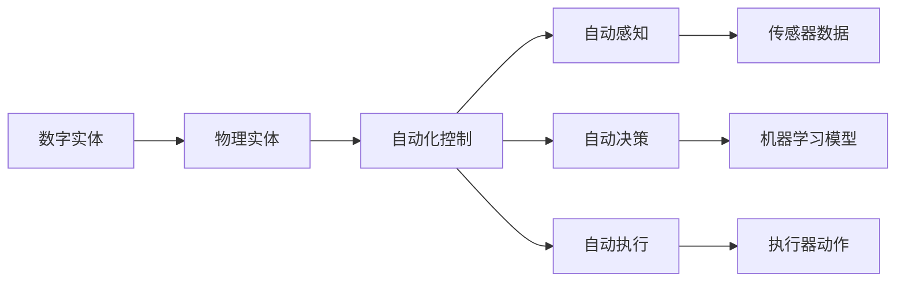

                 

# 数字实体与物理实体的自动化前景

> 关键词：数字实体, 物理实体, 自动化, 技术前沿, 工业应用

## 1. 背景介绍

### 1.1 问题由来

近年来，随着信息技术与物理世界的深度融合，数字实体与物理实体的互联互通、协同操作日益频繁。从工业自动化到智慧城市，从医疗诊断到智能交通，数字化、网络化、智能化的浪潮正在席卷各行各业。然而，将抽象的数字实体映射到具体的物理实体，进行高效的自动化控制与优化，依然是摆在行业面前的一大难题。

### 1.2 问题核心关键点

为了更精准地映射数字实体到物理实体，并实现高效的自动化控制，亟需一个能够充分理解物理世界规律，且能灵活适应各种复杂场景的自动化技术框架。该框架应具备以下关键特性：

1. **精度高**：能够精确感知物理世界的细微变化，具备高精度的测量与控制能力。
2. **实时性强**：能够实时响应物理世界的动态变化，具备快速决策与执行的能力。
3. **自适应性强**：能够自动适应不同物理环境与任务的特殊要求，具备高度灵活性与适应性。
4. **安全性高**：能够在极端条件下保证系统稳定运行，具备高可靠性与安全性。
5. **可扩展性好**：能够无缝扩展到各种复杂系统和场景，具备良好的可扩展性与可维护性。

### 1.3 问题研究意义

研究数字实体与物理实体的自动化技术，对于推动各行各业向智能化、高效化转型具有重大意义：

1. **降低运营成本**：通过自动化技术，可以实现对物理实体的精准控制与优化，减少人力成本与运营损耗。
2. **提升生产效率**：自动化技术能够快速响应物理实体的变化，实现高效的生产流程与自动化控制。
3. **保障安全与健康**：自动化技术可以有效减少人工操作带来的安全风险，尤其在危险作业环境中具有重要应用价值。
4. **促进技术进步**：自动化技术的深入研究与应用，能够推动新技术、新产品的研发与迭代，加速技术进步。
5. **构建智慧生态**：自动化技术的广泛应用，将加速智慧城市、智能交通、智能制造等领域的建设，推动构建更智能、更高效、更安全的智慧生态。

## 2. 核心概念与联系

### 2.1 核心概念概述

为了更深入理解数字实体与物理实体的自动化技术，我们先介绍几个核心概念：

- **数字实体**：指在计算机上以数据形式存在的事物，如工业传感器数据、气象监测数据、机器状态数据等。
- **物理实体**：指实际存在于物理世界中的事物，如机器人、机械臂、汽车等。
- **自动化控制**：指通过计算机技术，对物理实体进行智能感知、决策与执行的过程，实现自动化的操作与管理。

### 2.2 概念间的关系

这些核心概念之间的逻辑关系可以通过以下Mermaid流程图来展示：



这个流程图展示了数字实体与物理实体之间的自动化控制过程：

1. **数字实体**：以数据形式存在的各种物理世界的信号与状态。
2. **物理实体**：需要被控制与优化的具体对象，如机器人、机械臂、汽车等。
3. **自动化控制**：通过计算机技术，实现对物理实体的智能感知、决策与执行。
4. **自动感知**：通过传感器等技术，获取物理实体的实时数据。
5. **自动决策**：通过机器学习等算法，对感知到的数据进行分析与决策。
6. **自动执行**：通过执行器等硬件设备，执行决策后的动作与控制指令。

### 2.3 核心概念的整体架构

最终，我们将这些核心概念的整体架构展示如下：


## 3. 核心算法原理 & 具体操作步骤

### 3.1 算法原理概述

数字实体与物理实体的自动化控制过程，本质上是一个基于机器学习与控制理论的协同决策与执行过程。其核心算法原理包括以下几个方面：

1. **感知模块**：通过各种传感器，实时获取物理实体的状态数据。
2. **决策模块**：基于感知到的数据，通过机器学习算法，对物理实体的状态进行预测与决策。
3. **执行模块**：将决策结果转化为具体的控制指令，通过执行器对物理实体进行控制与操作。

### 3.2 算法步骤详解

1. **数据采集与预处理**：通过传感器等设备，实时采集物理实体的状态数据。预处理数据，去除噪声与异常值，确保数据质量。

2. **特征提取与建模**：从原始数据中提取特征，选择适当的特征集合，使用机器学习模型（如深度神经网络、支持向量机、随机森林等）建立预测模型。

3. **模型训练与优化**：在标注好的数据集上，使用训练算法（如梯度下降、遗传算法等）训练模型，优化模型参数，提高预测精度。

4. **模型评估与验证**：在验证集上评估模型性能，确保模型泛化能力。通过交叉验证等方法，避免模型过拟合。

5. **模型部署与应用**：将训练好的模型部署到目标物理实体上，实时感知与决策，执行控制指令。

### 3.3 算法优缺点

数字实体与物理实体的自动化控制算法具有以下优点：

1. **灵活性强**：能够根据不同的物理场景与任务，灵活设计模型与决策策略。
2. **精度高**：使用先进传感器与机器学习技术，可以实现高精度的数据感知与决策。
3. **可扩展性好**：模型与算法可以无缝扩展到各种复杂系统与场景。
4. **鲁棒性好**：能够适应各种异常与复杂情况，具备较高的鲁棒性与稳定性。

同时，该算法也存在一些局限性：

1. **数据依赖性高**：模型性能高度依赖于高质量的数据集，获取与标注数据成本较高。
2. **模型复杂度高**：复杂物理场景下的模型训练与优化难度较大，需要较强的计算资源与算法能力。
3. **解释性不足**：黑盒模型难以解释决策过程，缺乏可解释性与透明性。
4. **安全性问题**：模型可能引入潜在的偏见与错误，存在一定的安全隐患。

### 3.4 算法应用领域

数字实体与物理实体的自动化控制算法，已经在工业自动化、智能交通、智慧城市、医疗健康等多个领域得到了广泛应用，具体如下：

1. **工业自动化**：用于机械臂、机器人等自动化设备的智能控制，实现自动装配、搬运、检测等任务。
2. **智能交通**：用于自动驾驶车辆、交通信号灯的智能化管理，实现交通流量优化、事故预防等功能。
3. **智慧城市**：用于城市公共设施管理、环境监测、灾害预警等，提升城市管理效率与安全性。
4. **医疗健康**：用于医学影像分析、疾病预测、个性化治疗等，提高医疗服务质量与效率。

## 4. 数学模型和公式 & 详细讲解 & 举例说明

### 4.1 数学模型构建

我们以工业自动化中的机械臂控制为例，构建一个简单的自动化控制模型：

- **输入数据**：机械臂的当前位置、速度、角度等传感器数据。
- **输出指令**：机械臂的移动方向、速度、加速度等控制指令。
- **模型目标**：最小化机械臂的移动误差，实现高效精准的控制。

### 4.2 公式推导过程

假设输入数据为 $x_t = [x_1, x_2, ..., x_n]$，输出指令为 $u_t = [u_1, u_2, ..., u_n]$。则一个简单的控制模型可以表示为：

$$
u_t = f(x_t; \theta)
$$

其中 $f$ 为控制模型的映射函数，$\theta$ 为模型参数。常用的控制模型包括线性系统、神经网络等。

### 4.3 案例分析与讲解

以一个简单的线性系统控制为例，推导模型的参数更新公式：

假设系统的状态方程为：

$$
x_{t+1} = A x_t + B u_t + w_t
$$

其中 $A$ 为状态转移矩阵，$B$ 为控制增益矩阵，$w_t$ 为系统噪声。系统的输出方程为：

$$
y_t = C x_t + v_t
$$

其中 $C$ 为输出矩阵，$v_t$ 为观测噪声。

系统的最小化误差目标为：

$$
\min_{u_t} \| y_t - \hat{y}_t \|
$$

其中 $\hat{y}_t$ 为系统预测输出。

根据最小二乘法，控制指令 $u_t$ 可以表示为：

$$
u_t = K (y_t - \hat{y}_t)
$$

其中 $K$ 为反馈增益矩阵。

通过不断迭代更新参数 $\theta$，最小化误差目标，即可实现对机械臂的高效控制。

## 5. 项目实践：代码实例和详细解释说明

### 5.1 开发环境搭建

要进行数字实体与物理实体的自动化控制，首先需要搭建一个开发环境。以下是一些常用的开发工具：

- **Python**：常用的编程语言，支持科学计算、数据分析、机器学习等。
- **MATLAB/Simulink**：强大的仿真与建模工具，支持各种控制系统与信号处理。
- **SimPy**：开源的基于Python的离散事件仿真平台，适合建模与仿真物理系统。
- **ROS (Robot Operating System)**：开源的机器人操作系统，支持机器人、自动化设备等的开发与调试。

### 5.2 源代码详细实现

以下是使用Python和ROS对机械臂进行自动化控制的代码实现。

```python
# 导入相关库
import rospy
import tf
from sensor_msgs.msg import JointState
from std_msgs.msg import Float32

# 初始化ROS节点
rospy.init_node('arm_controller', anonymous=True)

# 定义关节状态发布者
joint_publisher = rospy.Publisher('/joint_states', JointState, queue_size=10)

# 定义关节状态
joint_state = JointState()

# 定义控制命令发布者
control_publisher = rospy.Publisher('/control_command', Float32, queue_size=10)

# 定义控制命令
control_command = Float32()

# 定义反馈函数
def feedback(joint_state):
    # 获取当前关节位置
    position = joint_state.position
    
    # 计算目标位置
    target_position = position + 0.1
    
    # 计算控制指令
    control_command.data = target_position
    
    # 发布控制指令
    control_publisher.publish(control_command)

# 主循环
while not rospy.is_shutdown():
    # 从传感器获取关节状态
    joint_state = rospy.wait_for_message('/joint_states', JointState)
    
    # 调用反馈函数
    feedback(joint_state)
    
    # 处理其他事件
    rospy.sleep(0.1)
```

### 5.3 代码解读与分析

上述代码实现了对机械臂的实时控制。通过ROS平台，代码可以与传感器、控制器等设备无缝连接，实现实时数据采集与决策。

1. **关节状态发布者**：通过ROS节点，定义了关节状态的发布者，用于发布机械臂的当前关节位置数据。
2. **控制命令发布者**：定义了控制命令的发布者，用于发布对机械臂的控制指令。
3. **反馈函数**：根据传感器获取的关节位置数据，计算目标位置，生成控制指令，并发布到控制命令发布者。
4. **主循环**：通过ROS的回调机制，实时获取传感器数据，调用反馈函数进行决策，发布控制命令。

通过不断迭代更新控制参数，可以实现对机械臂的精准控制与优化。

### 5.4 运行结果展示

运行上述代码，可以看到机械臂的关节位置随着控制指令的变化而动态调整。例如，在主循环中添加以下代码：

```python
# 定义目标位置
target_position = 0.5

# 设置控制指令
control_command.data = target_position
```

则机械臂的关节位置将向目标位置移动。

## 6. 实际应用场景

### 6.1 智能制造

在智能制造领域，数字实体与物理实体的自动化控制技术，可以广泛应用于自动化生产线、智能仓储系统、物流配送等场景，实现高效的生产、仓储与配送管理。

### 6.2 智能交通

在智能交通领域，数字实体与物理实体的自动化控制技术，可以应用于自动驾驶车辆、智能交通信号灯、车路协同系统等，实现交通流量的优化、事故预防等功能。

### 6.3 智慧城市

在智慧城市领域，数字实体与物理实体的自动化控制技术，可以用于城市公共设施管理、环境监测、灾害预警等，提升城市管理效率与安全性。

### 6.4 未来应用展望

随着技术的不断进步，数字实体与物理实体的自动化控制技术将进一步拓展应用场景，展现更加广阔的前景。

1. **工业4.0**：在工业4.0背景下，自动化技术将进一步与人工智能、物联网、大数据等技术融合，推动智能制造、智能供应链等领域的快速发展。
2. **智慧城市2.0**：智慧城市将通过数字实体与物理实体的自动化控制，实现更高效的资源管理与城市治理，提升市民生活质量。
3. **智能交通2.0**：智能交通将通过数字实体与物理实体的自动化控制，实现更安全、更高效的交通体系，提升城市交通效率与安全性。
4. **医疗健康2.0**：医疗健康将通过数字实体与物理实体的自动化控制，实现更精准、更个性化的诊疗服务，提升医疗服务质量与效率。

## 7. 工具和资源推荐

### 7.1 学习资源推荐

为了帮助开发者系统掌握数字实体与物理实体的自动化控制技术，以下是一些优质的学习资源：

1. **《机器人学导论》**：Sebastian Thrun等著，详细介绍了机器人学的基础理论、建模与控制方法。
2. **《控制理论》**：Paul M. Morse等著，系统介绍了线性系统理论、控制理论、优化方法等内容。
3. **《Python机器学习》**：Sebastian Raschka著，介绍了机器学习与深度学习的基本原理与实现方法。
4. **《ROS用户手册》**：ROS官方文档，详细介绍了ROS平台的搭建、使用与开发方法。
5. **《MATLAB Simulink用户手册》**：MATLAB官方文档，详细介绍了Simulink平台的建模、仿真与优化方法。

### 7.2 开发工具推荐

高效的开发离不开优秀的工具支持。以下是几款用于数字实体与物理实体自动化控制开发的常用工具：

1. **ROS (Robot Operating System)**：开源的机器人操作系统，支持机器人、自动化设备等的开发与调试。
2. **MATLAB/Simulink**：强大的仿真与建模工具，支持各种控制系统与信号处理。
3. **SimPy**：开源的基于Python的离散事件仿真平台，适合建模与仿真物理系统。
4. **OpenAI Gym**：开源的模拟与强化学习平台，支持各种环境与任务。
5. **TensorFlow**：开源的机器学习与深度学习框架，支持分布式计算与高精度计算。

### 7.3 相关论文推荐

数字实体与物理实体的自动化控制技术的发展，源于学界的持续研究。以下是几篇奠基性的相关论文，推荐阅读：

1. **《机器人学导论》**：Sebastian Thrun等著，详细介绍了机器人学的基础理论、建模与控制方法。
2. **《控制理论》**：Paul M. Morse等著，系统介绍了线性系统理论、控制理论、优化方法等内容。
3. **《Python机器学习》**：Sebastian Raschka著，介绍了机器学习与深度学习的基本原理与实现方法。
4. **《ROS用户手册》**：ROS官方文档，详细介绍了ROS平台的搭建、使用与开发方法。
5. **《MATLAB Simulink用户手册》**：MATLAB官方文档，详细介绍了Simulink平台的建模、仿真与优化方法。

## 8. 总结：未来发展趋势与挑战

### 8.1 研究成果总结

数字实体与物理实体的自动化控制技术，已经在多个领域取得了重要进展：

1. **机器人控制**：通过深度学习与优化算法，实现了高精度、高鲁棒性的机器人控制。
2. **智能交通**：通过自动驾驶与车路协同，提升了交通系统的效率与安全性。
3. **智能制造**：通过自动化生产线与智能仓储，提高了制造业的生产效率与质量。
4. **智慧城市**：通过智能监控与公共设施管理，提升了城市管理水平与居民生活质量。

### 8.2 未来发展趋势

展望未来，数字实体与物理实体的自动化控制技术将呈现以下几个发展趋势：

1. **智能化与自适应化**：未来的自动化控制系统将具备更强的智能化与自适应能力，能够自动感知环境变化，优化决策与控制。
2. **多模态融合**：未来的自动化控制系统将更多地融合视觉、听觉、触觉等多模态信息，提升感知与决策的准确性。
3. **云端协同**：未来的自动化控制系统将更多地与云端平台进行协同，实现实时数据处理与优化。
4. **分布式控制**：未来的自动化控制系统将更多地采用分布式控制架构，提升系统的可靠性与稳定性。
5. **人机协同**：未来的自动化控制系统将更多地采用人机协同设计，提升系统的透明性与可解释性。

### 8.3 面临的挑战

尽管数字实体与物理实体的自动化控制技术已经取得了重要进展，但仍面临诸多挑战：

1. **数据获取与标注**：高质量数据的获取与标注成本较高，成为制约技术发展的瓶颈。
2. **模型复杂度**：复杂系统的建模与控制难度较大，需要较高的计算资源与算法能力。
3. **鲁棒性与可靠性**：系统需要在各种异常情况下保持稳定，确保鲁棒性与可靠性。
4. **安全性问题**：系统可能存在安全隐患，需要加强安全防护与风险管理。
5. **可解释性不足**：黑盒模型难以解释决策过程，缺乏透明性与可解释性。

### 8.4 研究展望

为了应对未来挑战，需要从以下几个方面进行深入研究：

1. **高效数据获取与标注技术**：研究如何高效获取与标注数据，降低数据依赖性。
2. **分布式协同控制**：研究分布式控制架构，提升系统的可靠性与可扩展性。
3. **模型压缩与优化**：研究模型压缩与优化技术，提升系统的计算效率与运行速度。
4. **智能与自适应控制**：研究智能与自适应控制方法，提升系统的智能化与自适应能力。
5. **人机协同与透明性**：研究人机协同与透明性方法，提升系统的透明性与可解释性。

## 9. 附录：常见问题与解答

**Q1：数字实体与物理实体的自动化控制与传统自动化控制有何不同？**

A: 数字实体与物理实体的自动化控制技术，相较于传统自动化控制技术，具备以下优势：

1. **精度高**：通过数字实体与物理实体的实时映射与协同，能够实现高精度的控制与优化。
2. **灵活性强**：能够根据不同的物理场景与任务，灵活设计模型与决策策略。
3. **可扩展性好**：模型与算法可以无缝扩展到各种复杂系统与场景。

**Q2：数字实体与物理实体的自动化控制需要哪些核心技术？**

A: 数字实体与物理实体的自动化控制需要以下核心技术：

1. **传感器技术**：用于实时采集物理实体的状态数据。
2. **机器学习算法**：用于对感知到的数据进行分析与决策。
3. **控制算法**：用于将决策结果转化为具体的控制指令，实现对物理实体的控制与操作。
4. **人机交互界面**：用于用户与自动化系统的交互与控制。

**Q3：数字实体与物理实体的自动化控制技术的应用前景如何？**

A: 数字实体与物理实体的自动化控制技术在各个领域都有广阔的应用前景，具体如下：

1. **工业自动化**：用于自动化生产线、智能仓储系统、物流配送等，实现高效的生产、仓储与配送管理。
2. **智能交通**：用于自动驾驶车辆、智能交通信号灯、车路协同系统等，实现交通流量的优化、事故预防等功能。
3. **智慧城市**：用于城市公共设施管理、环境监测、灾害预警等，提升城市管理效率与安全性。
4. **医疗健康**：用于医学影像分析、疾病预测、个性化治疗等，提高医疗服务质量与效率。

**Q4：数字实体与物理实体的自动化控制技术面临哪些挑战？**

A: 数字实体与物理实体的自动化控制技术面临以下挑战：

1. **数据获取与标注**：高质量数据的获取与标注成本较高，成为制约技术发展的瓶颈。
2. **模型复杂度**：复杂系统的建模与控制难度较大，需要较高的计算资源与算法能力。
3. **鲁棒性与可靠性**：系统需要在各种异常情况下保持稳定，确保鲁棒性与可靠性。
4. **安全性问题**：系统可能存在安全隐患，需要加强安全防护与风险管理。
5. **可解释性不足**：黑盒模型难以解释决策过程，缺乏透明性与可解释性。

通过解决这些挑战，可以进一步推动数字实体与物理实体的自动化控制技术的发展与应用。

**Q5：数字实体与物理实体的自动化控制技术如何与物联网(IoT)技术结合？**

A: 数字实体与物理实体的自动化控制技术可以通过以下方式与物联网(IoT)技术结合：

1. **设备互联**：通过物联网技术，将各种物理实体与数字实体连接起来，实现信息的实时传递与共享。
2. **数据融合**：通过物联网技术，将不同来源的数据进行融合与处理，实现更全面、更准确的信息感知与决策。
3. **云边协同**：通过物联网技术，将物联网设备和云端平台进行协同，实现高效的云计算与数据存储。
4. **安全防护**：通过物联网技术，加强对物联网设备和数据的安全防护，确保系统的安全性与可靠性。

通过与物联网技术的结合，可以实现更智能、更高效、更安全的数字化与自动化控制体系。

---

作者：禅与计算机程序设计艺术 / Zen and the Art of Computer Programming

