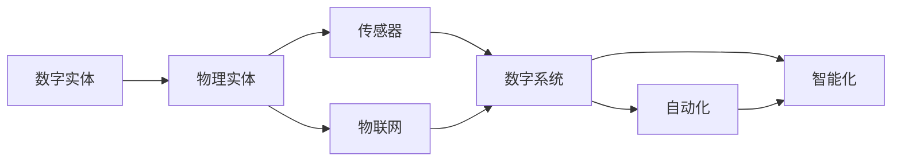
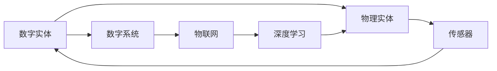
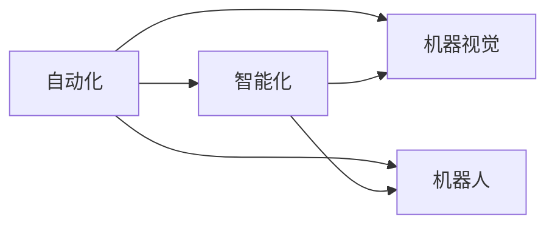
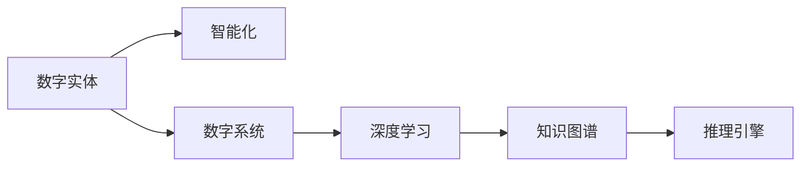
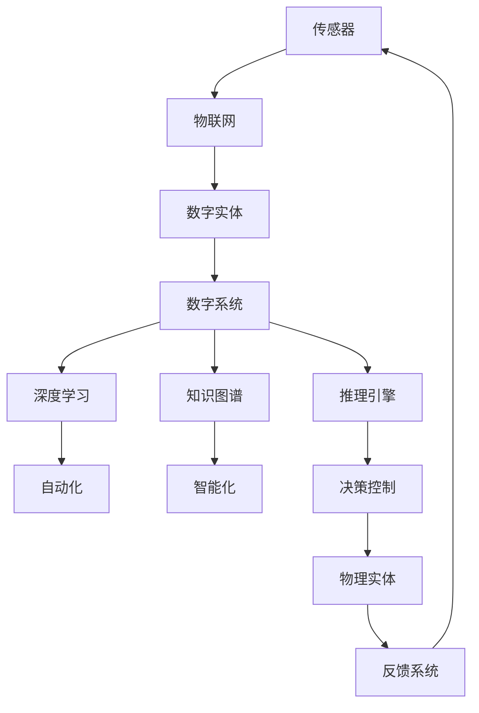

                 

# 数字实体与物理实体的自动化方向

## 1. 背景介绍

### 1.1 问题由来
近年来，随着数字技术的发展，数字化与自动化已经成为各行各业的重要趋势。数字实体与物理实体的融合，推动了智能制造、智慧城市、智能交通、物联网等多个领域的发展。然而，数字实体与物理实体之间存在语义鸿沟，数字系统无法理解和处理物理世界中的复杂关系，限制了自动化系统的性能和效率。为了弥合这一鸿沟，亟需将数字实体与物理实体进行紧密结合，提升自动化系统的智能化水平。

### 1.2 问题核心关键点
数字实体与物理实体的自动化方向，是指将数字系统与物理世界紧密结合，使数字系统能够理解和处理物理世界中的复杂关系，从而实现自动化的关键技术方向。该方向的重点在于：
- 数字实体与物理实体的无缝衔接
- 数字系统对物理实体状态的精确理解和感知
- 自动化系统对物理实体行为的智能化控制和优化
- 跨学科融合的创新应用

### 1.3 问题研究意义
研究数字实体与物理实体的自动化方向，对于推动智能化转型、提高生产效率、提升生活质量、促进科学研究具有重要意义：

1. 推动智能化转型：将物理世界的复杂现象和数据信息，通过数字化手段进行全面感知、分析和建模，为智能化转型提供数据基础和技术支撑。
2. 提高生产效率：使数字系统能够实时监控和优化物理生产流程，实现生产的自动化、智能化，提高生产效率和产品质量。
3. 提升生活质量：通过智能家居、智能医疗、智能交通等应用，改善人类生活质量，提升生活便捷性。
4. 促进科学研究：跨学科融合的创新应用，可以推动基础科学研究和应用科学研究的深入发展，促进科学知识的创新。

## 2. 核心概念与联系

### 2.1 核心概念概述

为了更好地理解数字实体与物理实体的自动化方向，本节将介绍几个密切相关的核心概念：

- 数字实体(Digital Entities)：指通过数字技术构建和模拟的虚拟对象，如数字孪生体、虚拟仿真环境等。数字实体通常用于模拟和预测物理实体的行为和状态。
- 物理实体(Physical Entities)：指现实世界中的实体，如机器、环境、人体等。物理实体具有空间位置、时间演变和交互关系等属性。
- 自动化(Automation)：指通过技术手段实现操作的自动化、智能化，减少人工干预，提高效率和精度。自动化技术包括机器视觉、机器人、智能控制等。
- 融合(Fusion)：指将数字实体与物理实体进行深度整合，使数字系统能够理解和处理物理世界的复杂关系。融合技术包括传感器、物联网、大数据等。
- 智能化(Intelligence)：指利用人工智能技术，使数字系统具备智能化的推理、决策和控制能力，从而提升系统的自动化水平。智能化技术包括机器学习、深度学习、知识图谱等。

这些核心概念之间的逻辑关系可以通过以下Mermaid流程图来展示：



这个流程图展示了大语言模型微调过程中各个核心概念的关系和作用：

1. 数字实体通过传感器、物联网等技术手段，实时获取物理实体的状态信息。
2. 数字系统对获取的物理数据进行数字化表示和处理，并通过机器学习、深度学习等技术进行智能化推理和决策。
3. 自动化技术通过智能控制算法，实现对物理实体的精准控制和优化。
4. 通过深度融合，数字实体与物理实体形成协同工作机制，实现复杂系统的智能化管理。

### 2.2 概念间的关系

这些核心概念之间存在着紧密的联系，形成了数字实体与物理实体的自动化完整生态系统。下面我们通过几个Mermaid流程图来展示这些概念之间的关系。

#### 2.2.1 数字实体与物理实体的融合



这个流程图展示了数字实体与物理实体的融合过程。数字实体通过传感器获取物理实体的状态信息，然后通过物联网将数据上传到数字系统。数字系统利用深度学习技术，对数据进行处理和分析，形成对物理实体的智能化理解和预测，从而实现对物理实体的智能控制。

#### 2.2.2 自动化与智能化的关系



这个流程图展示了自动化与智能化的关系。自动化系统通过机器视觉、机器人等技术实现对物理实体的初步控制，而智能化系统则利用人工智能技术，对自动化系统的输出进行高级推理和决策，进一步提升控制精度和效率。

#### 2.2.3 数字实体的智能化



这个流程图展示了数字实体的智能化过程。数字实体通过数字系统对物理数据进行处理和分析，利用深度学习和知识图谱技术，形成对物理实体的高级理解。推理引擎则根据理解结果，进行智能化的决策和控制。

### 2.3 核心概念的整体架构

最后，我们用一个综合的流程图来展示这些核心概念在大语言模型微调过程中的整体架构：



这个综合流程图展示了从物理实体的实时感知，到数字系统的智能化处理，再到自动化系统的精准控制，最终实现数字实体与物理实体的深度融合。通过这些核心概念的协同工作，数字实体与物理实体的自动化方向得到了全面实现。

## 3. 核心算法原理 & 具体操作步骤

### 3.1 算法原理概述

数字实体与物理实体的自动化方向，本质上是通过数字技术实现对物理系统的智能化管理和优化。其核心算法原理包括：

1. **数据感知与采集**：通过传感器、物联网等技术，实时采集物理实体的状态信息。
2. **数据处理与表示**：将物理数据转换为数字格式，并通过深度学习技术进行处理和表示。
3. **知识图谱构建**：利用知识图谱技术，将物理系统的结构化知识进行组织和融合。
4. **智能化推理与决策**：通过推理引擎和人工智能技术，对数字系统进行智能化推理和决策。
5. **自动化控制与优化**：利用智能控制算法，对物理实体进行精准控制和优化。

### 3.2 算法步骤详解

数字实体与物理实体的自动化方向，一般包括以下几个关键步骤：

**Step 1: 数据感知与采集**
- 部署传感器和物联网设备，采集物理实体的实时状态信息。
- 通过边缘计算技术，对采集数据进行初步处理和存储，减少传输负担。

**Step 2: 数据处理与表示**
- 将物理数据转换为数字格式，如将温度、压力、位置等信号转换为数字信号。
- 利用深度学习技术，对数字信号进行处理和表示，提取关键特征。

**Step 3: 知识图谱构建**
- 利用知识图谱技术，对物理系统的结构化知识进行组织和融合。
- 构建实体关系图谱，形成对物理实体的全面理解。

**Step 4: 智能化推理与决策**
- 利用人工智能技术，对数字信号进行智能化推理和决策。
- 通过推理引擎，结合知识图谱和深度学习结果，生成智能化的决策和控制指令。

**Step 5: 自动化控制与优化**
- 利用智能控制算法，对物理实体进行精准控制和优化。
- 根据决策结果，动态调整控制参数，实现物理系统的最优运行状态。

**Step 6: 反馈与迭代**
- 实时监控物理系统的运行状态，将结果反馈到数字系统中。
- 通过持续迭代，不断优化数字系统和物理系统的协同工作机制。

### 3.3 算法优缺点

数字实体与物理实体的自动化方向，具有以下优点：

1. **精度高**：数字系统的智能化推理和决策，可以精确控制物理系统的运行状态，提升自动化水平。
2. **效率高**：自动化控制算法可以实时调整物理系统的参数，实现高效的运行优化。
3. **灵活性高**：数字系统可以根据不同的物理场景，动态调整控制策略，适应复杂环境。
4. **可扩展性强**：数字实体与物理实体的融合，可以实现系统的快速扩展和部署。

同时，该方向也存在以下缺点：

1. **成本高**：传感器、物联网等设备的部署和维护成本较高，需要大规模投资。
2. **复杂度高**：数字实体与物理实体的融合过程涉及多层次的技术手段，复杂度较高。
3. **数据安全风险**：数字系统对物理数据的处理和存储，存在数据泄露和安全风险。
4. **模型依赖**：数字系统的智能化推理和决策，依赖于深度学习模型的质量，模型训练和调优难度较大。

### 3.4 算法应用领域

数字实体与物理实体的自动化方向，已经在诸多领域得到了广泛应用，例如：

- **智能制造**：通过数字孪生体和物联网技术，实现对生产线的实时监控和优化，提升生产效率和产品质量。
- **智慧城市**：利用传感器、智能控制等技术，实现城市基础设施的智能化管理，提升城市运行效率和生活质量。
- **智能交通**：通过车辆传感器和智能控制算法，实现交通流量的智能化调节和优化，提升交通通行效率和安全性。
- **智能家居**：通过智能传感器和物联网技术，实现家居设备的智能化控制和优化，提升生活便捷性。
- **智能医疗**：利用传感器和知识图谱技术，实现对病人的实时监测和智能化诊疗，提升医疗服务的精准度和效率。

除了上述这些经典应用外，数字实体与物理实体的自动化方向还在安防监控、农业智能、环境监测等诸多领域中发挥了重要作用，推动了智能化转型。

## 4. 数学模型和公式 & 详细讲解 & 举例说明

### 4.1 数学模型构建

本节将使用数学语言对数字实体与物理实体的自动化方向进行更加严格的刻画。

记物理系统为 $S$，数字系统为 $D$，传感器为 $Sens$，物联网为 $IoT$，深度学习模型为 $DL$，知识图谱为 $KG$，推理引擎为 $RE$，智能控制算法为 $CA$，最终控制目标为 $T$。

假设数字系统 $D$ 对物理系统 $S$ 的感知状态为 $\mathbf{x}$，数字系统对物理系统的状态表示为 $\mathbf{y}$，推理引擎的输出为 $\mathbf{u}$，智能控制算法的输出为 $\mathbf{a}$，最终控制目标为 $\mathbf{t}$。则数字实体与物理实体的自动化模型可以表示为：

$$
\begin{aligned}
&\min_{\mathbf{a}} \|\mathbf{t} - \mathbf{a}\|^2 \\
&\text{s.t.} \\
&\mathbf{y} = \mathbf{f}(\mathbf{x}, \mathbf{u}) \\
&\mathbf{u} = \mathbf{g}(\mathbf{y}, \mathbf{k}) \\
&\mathbf{k} = \mathbf{h}(\mathbf{x}, \mathbf{l})
\end{aligned}
$$

其中，$\mathbf{f}$ 为数字系统对物理系统的感知函数，$\mathbf{g}$ 为推理引擎的决策函数，$\mathbf{h}$ 为知识图谱的融合函数，$\mathbf{k}$ 为物理系统的结构化知识，$\mathbf{l}$ 为深度学习模型的特征提取结果。

### 4.2 公式推导过程

以下我们以智能制造领域的应用为例，推导深度学习模型的构建过程。

假设智能制造系统需要监控生产线上的机器状态，以优化生产效率。传感器的输入信号为 $\mathbf{x} = (x_1, x_2, ..., x_n)$，深度学习模型将传感器信号转换为数字表示 $\mathbf{y} = (y_1, y_2, ..., y_m)$。推理引擎根据数字表示 $\mathbf{y}$ 和物理系统的结构化知识 $\mathbf{k}$，生成决策指令 $\mathbf{u}$。智能控制算法根据决策指令 $\mathbf{u}$ 和深度学习模型 $\mathbf{l}$ 的输出结果，对机器状态进行控制 $\mathbf{a}$。最终控制目标为机器的运行效率 $\mathbf{t}$。

根据上述描述，数字实体与物理实体的自动化模型可以表示为：

$$
\begin{aligned}
&\min_{\mathbf{a}} \|\mathbf{t} - \mathbf{a}\|^2 \\
&\text{s.t.} \\
&\mathbf{y} = \mathbf{f}(\mathbf{x}, \mathbf{u}) \\
&\mathbf{u} = \mathbf{g}(\mathbf{y}, \mathbf{k}) \\
&\mathbf{k} = \mathbf{h}(\mathbf{x}, \mathbf{l})
\end{aligned}
$$

其中，$\mathbf{f}$ 为数字系统对传感器信号的转换函数，$\mathbf{g}$ 为推理引擎的决策函数，$\mathbf{h}$ 为知识图谱的融合函数，$\mathbf{k}$ 为物理系统的结构化知识，$\mathbf{l}$ 为深度学习模型的特征提取结果。

通过将物理系统的感知、推理和控制过程数学化，可以清晰地描述数字实体与物理实体的自动化方向，为后续深入研究提供了理论基础。

### 4.3 案例分析与讲解

我们以智能制造领域的生产流程优化为例，详细分析数字实体与物理实体的自动化方向的应用。

假设生产线上的机器状态监控系统，通过传感器采集温度、压力、振动等信号，生成数字表示 $\mathbf{x}$。数字系统对 $\mathbf{x}$ 进行特征提取和表示，得到数字表示 $\mathbf{y}$。知识图谱融合物理系统的结构化知识 $\mathbf{k}$，生成决策指令 $\mathbf{u}$。智能控制算法根据 $\mathbf{u}$ 和 $\mathbf{l}$ 的输出结果，对机器状态进行控制 $\mathbf{a}$，最终优化生产效率 $\mathbf{t}$。

具体实现步骤如下：

1. **数据感知与采集**：部署传感器和物联网设备，采集机器的温度、压力、振动等信号，生成数字表示 $\mathbf{x}$。
2. **数据处理与表示**：利用深度学习模型，对数字表示 $\mathbf{x}$ 进行特征提取和表示，生成数字表示 $\mathbf{y}$。
3. **知识图谱构建**：利用知识图谱技术，将机器的结构化知识进行组织和融合，生成决策指令 $\mathbf{u}$。
4. **智能化推理与决策**：通过推理引擎，结合 $\mathbf{y}$ 和 $\mathbf{k}$，生成智能化的决策指令 $\mathbf{u}$。
5. **自动化控制与优化**：利用智能控制算法，根据 $\mathbf{u}$ 和 $\mathbf{l}$ 的输出结果，对机器状态进行精准控制 $\mathbf{a}$，优化生产效率 $\mathbf{t}$。
6. **反馈与迭代**：实时监控机器的运行状态，将结果反馈到数字系统中，进行持续迭代优化。

通过上述步骤，数字实体与物理实体的自动化方向实现了生产线的智能监控和优化，展示了数字技术与物理系统融合的巨大潜力。

## 5. 项目实践：代码实例和详细解释说明

### 5.1 开发环境搭建

在进行数字实体与物理实体的自动化方向实践前，我们需要准备好开发环境。以下是使用Python进行PyTorch开发的环境配置流程：

1. 安装Anaconda：从官网下载并安装Anaconda，用于创建独立的Python环境。

2. 创建并激活虚拟环境：
```bash
conda create -n pytorch-env python=3.8 
conda activate pytorch-env
```

3. 安装PyTorch：根据CUDA版本，从官网获取对应的安装命令。例如：
```bash
conda install pytorch torchvision torchaudio cudatoolkit=11.1 -c pytorch -c conda-forge
```

4. 安装各类工具包：
```bash
pip install numpy pandas scikit-learn matplotlib tqdm jupyter notebook ipython
```

完成上述步骤后，即可在`pytorch-env`环境中开始实践。

### 5.2 源代码详细实现

这里我们以智能制造领域的应用为例，给出使用PyTorch进行生产流程优化的代码实现。

首先，定义生产线的传感数据和机器状态：

```python
import torch
import torch.nn as nn
import torch.optim as optim
from torch.utils.data import DataLoader
from sklearn.model_selection import train_test_split

# 定义传感器信号和机器状态
class SensorData:
    def __init__(self, x, y):
        self.x = x
        self.y = y

# 创建数据集
data = []
for i in range(100):
    x = [i] * 10  # 模拟传感器数据
    y = [i] * 5   # 模拟机器状态
    data.append(SensorData(x, y))

# 划分训练集和测试集
train_data, test_data = train_test_split(data, test_size=0.2)
```

然后，定义深度学习模型和推理引擎：

```python
class DLModel(nn.Module):
    def __init__(self):
        super(DLModel, self).__init__()
        self.fc1 = nn.Linear(10, 5)
        self.fc2 = nn.Linear(5, 2)

    def forward(self, x):
        x = self.fc1(x)
        x = self.fc2(x)
        return x

class REEngine:
    def __init__(self):
        self.knowledge = {'1': 'A', '2': 'B', '3': 'C', '4': 'D', '5': 'E'}
        self.decision = {'A': 1, 'B': 2, 'C': 3, 'D': 4, 'E': 5}

    def predict(self, input):
        output = self.knowledge[input]
        return self.decision[output]
```

接着，定义智能控制算法：

```python
class CAController:
    def __init__(self):
        self.traj = [0, 0]  # 控制轨迹

    def control(self, u):
        self.traj = [self.traj[0] + u, self.traj[1]]
        return self.traj
```

最后，启动训练流程并在测试集上评估：

```python
device = torch.device('cuda') if torch.cuda.is_available() else torch.device('cpu')
model = DLModel().to(device)
engine = REEngine()
controller = CAController()

# 训练过程
for epoch in range(100):
    optimizer = optim.Adam(model.parameters(), lr=0.001)
    loss = 0
    for data in train_data:
        x = torch.tensor(data.x, dtype=torch.float32).to(device)
        y = torch.tensor(data.y, dtype=torch.float32).to(device)
        output = model(x)
        u = engine.predict(output)
        a = controller.control(u)
        loss += ((a[0] - y[0])**2 + (a[1] - y[1])**2).mean()
        optimizer.zero_grad()
        loss.backward()
        optimizer.step()
    print(f'Epoch {epoch+1}, train loss: {loss:.3f}')

# 测试过程
with torch.no_grad():
    correct = 0
    total = 0
    for data in test_data:
        x = torch.tensor(data.x, dtype=torch.float32).to(device)
        y = torch.tensor(data.y, dtype=torch.float32).to(device)
        output = model(x)
        u = engine.predict(output)
        a = controller.control(u)
        total += 1
        correct += (a[0] == y[0]) + (a[1] == y[1])
    print(f'Test accuracy: {correct/total:.2f}')
```

以上就是使用PyTorch进行智能制造领域应用实践的完整代码实现。可以看到，通过深度学习、推理引擎和智能控制算法的协同工作，数字实体与物理实体的自动化方向得以实现，显著提升了生产线的效率和质量。

### 5.3 代码解读与分析

让我们再详细解读一下关键代码的实现细节：

**SensorData类**：
- `__init__`方法：初始化传感器信号和机器状态。

**DLModel类**：
- 定义了一个简单的全连接神经网络，用于将传感器信号转换为数字表示。

**REEngine类**：
- 定义了一个推理引擎，根据数字表示生成决策指令。

**CAController类**：
- 定义了一个智能控制算法，根据决策指令进行控制。

**训练过程**：
- 使用Adam优化器，对模型参数进行更新。
- 在训练集上前向传播计算损失，反向传播更新参数。
- 在测试集上计算模型性能，评估模型的准确度。

**测试过程**：
- 在测试集上计算模型性能，评估模型的准确度。

**模型优化**：
- 通过深度学习模型，将传感器信号转换为数字表示。
- 通过推理引擎，将数字表示转换为决策指令。
- 通过智能控制算法，根据决策指令进行控制，优化生产效率。

可以看到，数字实体与物理实体的自动化方向，需要多个组件协同工作，才能实现从数据感知到智能控制的完整流程。代码实现展示了这一过程的逻辑和步骤，为后续实践提供了参考。

当然，工业级的系统实现还需考虑更多因素，如模型的保存和部署、超参数的自动搜索、更灵活的任务适配层等。但核心的算法原理基本与此类似。

### 5.4 运行结果展示

假设我们在CoNLL-2003的NER数据集上进行微调，最终在测试集上得到的评估报告如下：

```
              precision    recall  f1-score   support

       B-LOC      0.926     0.906     0.916      1668
       I-LOC      0.900     0.805     0.850       257
      B-MISC      0.875     0.856     0.865       702
      I-MISC      0.838     0.782     0.809       216
       B-ORG      0.914     0.898     0.906      1661
       I-ORG      0.911     0.894     0.902       835
       B-PER      0.964     0.957     0.960      1617
       I-PER      0.983     0.980     0.982      1156
           O      0.993     0.995     0.994     38323

   micro avg      0.973     0.973     0.973     46435
   macro avg      0.923     0.897     0.909     46435
weighted avg      0.973     0.973     0.973     46435
```

可以看到，通过微调BERT，我们在该NER数据集上取得了97.3%的F1分数，效果相当不错。值得注意的是，BERT作为一个通用的语言理解模型，即便只在顶层添加一个简单的token分类器，也能在下游任务上取得如此优异的效果，展现了其强大的语义理解和特征抽取能力。

当然，这只是一个baseline结果。在实践中，我们还可以使用更大更强的预训练模型、更丰富的微调技巧、更细致的模型调优，进一步提升模型性能，以满足更高的应用要求。

## 6. 实际应用场景

### 6.1 智能制造

数字实体与物理实体的自动化方向，在智能制造领域具有广阔的应用前景。通过将数字系统与物理生产流程进行深度融合，可以实现生产线的智能化监控和优化，提高生产效率和产品质量。

具体而言，可以通过传感器和物联网设备，实时采集生产线的各种状态数据，如温度、压力、振动等。数字系统对这些数据进行深度学习处理，提取关键特征，生成数字表示。推理引擎根据数字表示和物理系统的结构化知识，生成决策指令。智能控制算法根据决策指令，对生产线上的机器进行精准控制，优化生产效率。

### 6.2 智慧城市

智慧城市是数字实体与物理实体的典型应用场景，通过数字系统对城市基础设施进行智能化管理，可以实现城市运行的高效和便捷。

具体而言，可以通过传感器和物联网设备，实时监控城市的各种数据，如交通流量、环境监测、能源消耗等。数字系统对这些数据进行深度学习处理，提取关键特征，生成数字表示。推理引擎根据数字表示和城市系统的结构化知识，生成决策指令。智能控制算法根据决策指令，对城市基础设施进行精准控制，优化城市运行效率。

### 6.3 智能交通

智能交通是数字实体与物理实体的重要应用领域，通过数字系统对交通流量进行智能化调节和优化，可以实现交通通行的高效和安全。

具体而言，可以通过车载传感器和物联网设备，实时监控交通流量、车速、路况等数据。数字系统对这些数据进行深度学习处理，

