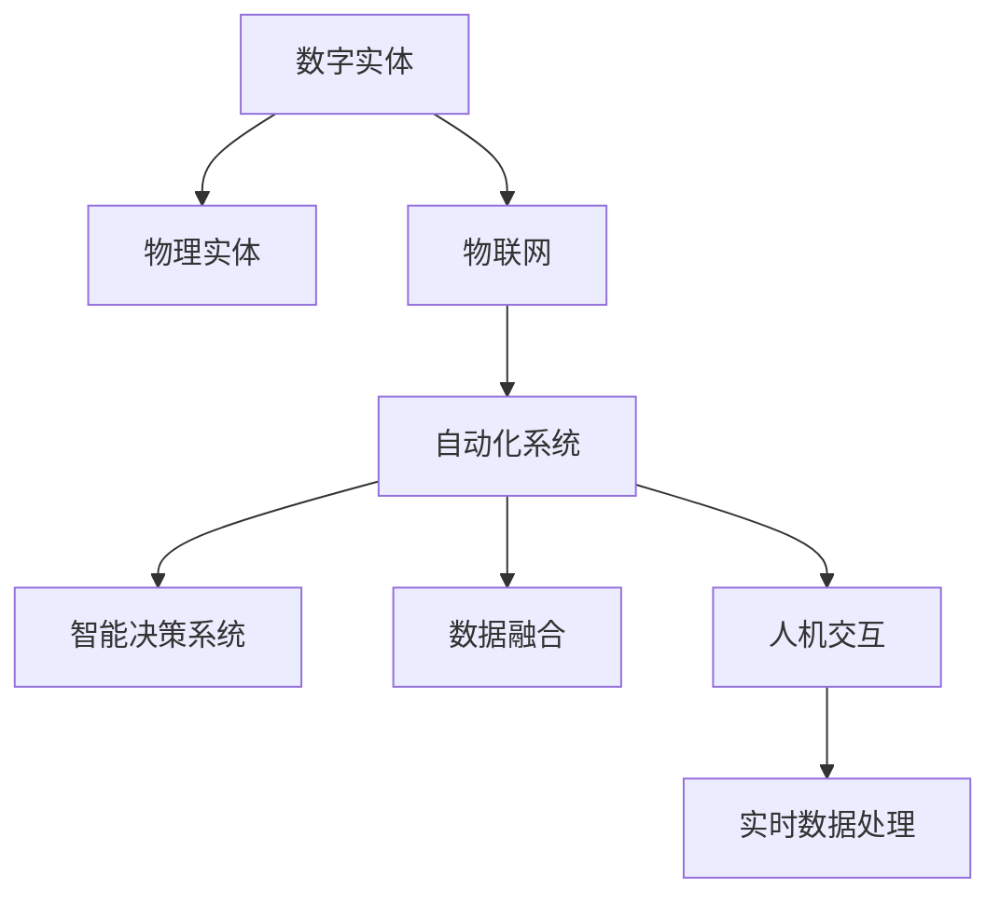
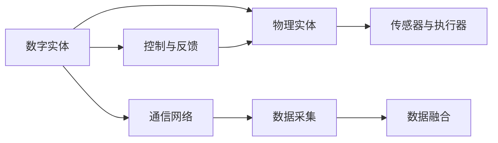
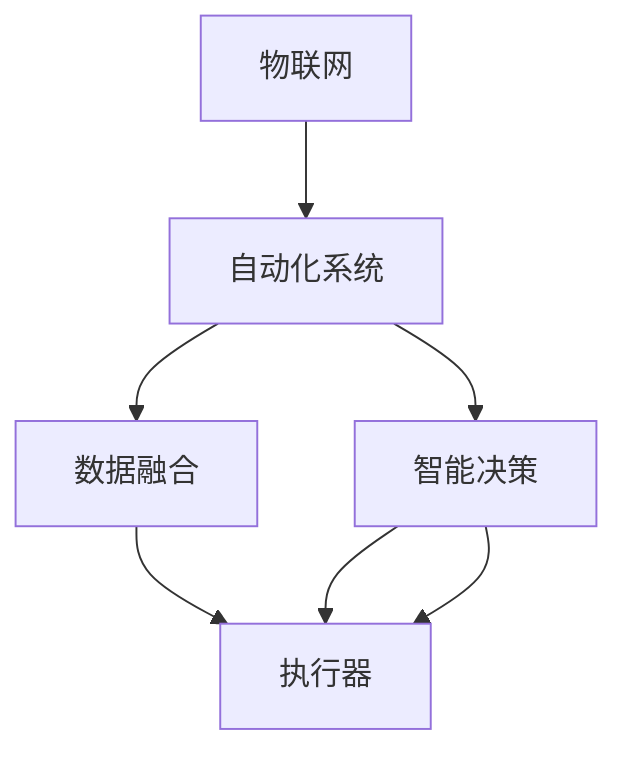
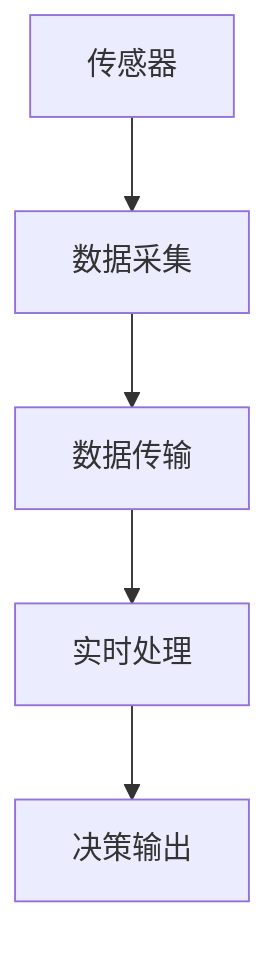
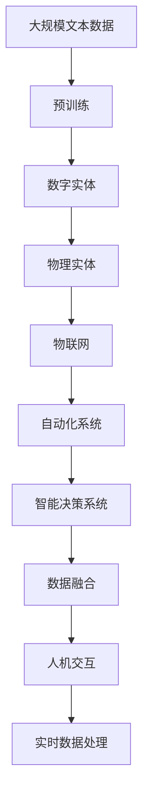

                 

# 数字实体与物理实体的自动化进展

> 关键词：自动化, 数字实体, 物理实体, 机器人学, 自动化仓库, 智能家居, 物联网(IoT), 智能交通

## 1. 背景介绍

### 1.1 问题由来
随着数字化转型和物联网技术的迅速发展，数字实体（Digital Entities）与物理实体（Physical Entities）的融合成为可能。数字实体，如虚拟助手、自动化系统、智能机器等，开始广泛渗透到人类社会的各个领域，改变了我们的生活和工作方式。与此同时，物理实体，如仓库、工厂、交通工具等，通过数字化技术得到优化和自动化升级，提升了效率和安全性。然而，这些数字实体和物理实体的协同工作面临着一些挑战，如系统整合、数据融合、实时决策等，需要依赖先进的自动化技术来实现。

### 1.2 问题核心关键点
在数字实体与物理实体的自动化融合过程中，关键点包括：
1. **系统集成**：如何将不同类型的数字实体和物理实体有效整合到一个系统中，实现数据的共享和协同工作。
2. **实时数据处理**：如何实时采集和处理海量数据，支撑快速决策和响应。
3. **智能决策**：如何通过机器学习等技术，实现高效、准确的决策和控制。
4. **人机交互**：如何设计友好的用户界面，使得人类用户能够直观地操作和监控数字实体和物理实体的协同工作。
5. **安全与隐私**：如何保障数字化系统的安全性和用户的隐私，防止数据泄露和恶意攻击。

这些关键点共同构成了数字实体与物理实体自动化的核心挑战，需要通过技术创新和优化来解决。

### 1.3 问题研究意义
自动化数字实体与物理实体的融合，具有重要的研究意义：
1. **提升效率和生产力**：通过自动化技术，减少人工干预，提升作业效率和生产能力。
2. **优化资源分配**：智能化的资源调度系统，能够合理分配资源，提高利用率。
3. **增强安全性**：自动化系统能够实时监控和响应安全威胁，保障人身和财产安全。
4. **改善用户体验**：友好的用户界面和智能决策支持，提升用户满意度和使用体验。
5. **推动技术创新**：自动化技术的发展，催生了新的技术应用和产业模式，推动技术进步。

## 2. 核心概念与联系

### 2.1 核心概念概述

为了更好地理解数字实体与物理实体的自动化进展，本节将介绍几个密切相关的核心概念：

- **数字实体(Digital Entities)**：包括软件、系统、虚拟助手等，能够通过网络或移动设备进行访问和操作。
- **物理实体(Physical Entities)**：包括机器人、自动化设备、仓库、工厂等，能够通过传感器、执行器进行物理世界的互动。
- **自动化系统(Automation Systems)**：能够实现数字实体与物理实体的集成和协同工作的系统。
- **物联网(IoT)**：连接数字实体和物理实体的网络，实现数据采集、传输和处理。
- **智能决策系统(Intelligent Decision Systems)**：利用机器学习、深度学习等技术，实现高效、准确的决策。
- **人机交互(Human-Computer Interaction, HCI)**：设计用户界面，实现人类与自动化系统之间的有效沟通。
- **数据融合(Data Fusion)**：将来自不同源的数据进行整合和分析，实现全面的视图和洞察。
- **实时数据处理(Real-time Data Processing)**：高效、实时地处理和分析海量数据，支撑快速决策。

这些核心概念之间的逻辑关系可以通过以下Mermaid流程图来展示：



这个流程图展示了大语言模型微调过程中各个核心概念的关系和作用：

1. 数字实体通过物联网连接物理实体，形成协同系统。
2. 自动化系统将数据融合、智能决策和实时处理等功能实现。
3. 数据融合和智能决策为自动化系统提供决策支持。
4. 人机交互设计使得用户能够直观地操作和监控系统。
5. 实时数据处理支撑快速响应和决策。

### 2.2 概念间的关系

这些核心概念之间存在着紧密的联系，形成了数字实体与物理实体自动化的完整生态系统。下面我通过几个Mermaid流程图来展示这些概念之间的关系。

#### 2.2.1 数字实体与物理实体的协同



这个流程图展示了数字实体与物理实体之间的互动和协同关系。数字实体通过通信网络采集物理实体的数据，并通过控制和反馈机制进行互动。

#### 2.2.2 自动化系统的层次结构



这个流程图展示了自动化系统的层次结构，物联网层负责数据的采集和传输，自动化系统层进行数据的融合和智能决策，最终由执行器执行决策结果。

#### 2.2.3 实时数据处理的流程



这个流程图展示了实时数据处理的基本流程，从传感器采集数据，到实时处理和决策输出。

### 2.3 核心概念的整体架构

最后，我们用一个综合的流程图来展示这些核心概念在大语言模型微调过程中的整体架构：



这个综合流程图展示了从预训练到数字实体与物理实体自动化的完整过程。数字实体和物理实体通过物联网和自动化系统进行协同工作，智能决策系统通过数据融合和实时处理提供决策支持，最终通过人机交互实现高效操作。

## 3. 核心算法原理 & 具体操作步骤
### 3.1 算法原理概述

数字实体与物理实体的自动化融合，本质上是一个多层次、多维度的问题，涉及到数据采集、传输、处理、融合、决策等各个环节。其核心算法原理包括以下几个方面：

- **数据采集与传输**：利用传感器和通信技术，采集物理实体的数据，并通过物联网传输到数字实体。
- **数据融合**：将来自不同源的数据进行整合和分析，形成全面视图。
- **智能决策**：通过机器学习等技术，实现高效、准确的决策和控制。
- **执行与反馈**：根据决策结果，控制执行器进行操作，并收集反馈信息进行下一步优化。

### 3.2 算法步骤详解

数字实体与物理实体的自动化融合，一般包括以下几个关键步骤：

**Step 1: 准备环境**
- 选择合适的传感器和通信技术，搭建物联网网络。
- 设计数字实体和物理实体的接口和协议，确保数据互通。
- 配置自动化系统，包括数据融合、智能决策和执行器的部署。

**Step 2: 数据采集与传输**
- 安装传感器和执行器，采集物理实体的数据。
- 利用通信技术，将数据传输到数字实体。
- 通过数据采集和传输模块，实现数据的实时处理和传输。

**Step 3: 数据融合**
- 使用数据融合技术，将来自不同源的数据进行整合和分析。
- 利用机器学习模型，实现数据的特征提取和模式识别。
- 通过数据融合模块，生成全面视图和洞察。

**Step 4: 智能决策**
- 设计智能决策系统，利用机器学习模型进行高效决策。
- 利用深度学习等技术，实现端到端的决策过程。
- 通过智能决策模块，输出决策结果和控制指令。

**Step 5: 执行与反馈**
- 根据决策结果，控制执行器进行操作。
- 收集反馈信息，进行下一步优化和改进。
- 通过执行与反馈模块，实现闭环控制和持续优化。

**Step 6: 人机交互**
- 设计友好的用户界面，实现人类与自动化系统的互动。
- 通过人机交互模块，提供可视化的操作界面和实时监控。
- 通过人机交互模块，收集用户的反馈和指令。

### 3.3 算法优缺点

数字实体与物理实体的自动化融合，具有以下优点：
1. **提升效率和生产力**：通过自动化系统，减少人工干预，提升作业效率和生产能力。
2. **优化资源分配**：智能化的资源调度系统，能够合理分配资源，提高利用率。
3. **增强安全性**：自动化系统能够实时监控和响应安全威胁，保障人身和财产安全。
4. **改善用户体验**：友好的用户界面和智能决策支持，提升用户满意度和使用体验。

同时，该方法也存在以下缺点：
1. **初始成本高**：搭建物联网和自动化系统需要较高的初始投资，包括设备采购、系统集成和调试等。
2. **技术复杂度大**：涉及多层次、多维度的技术，包括传感器、通信、数据融合、智能决策等，技术门槛较高。
3. **数据安全风险**：自动化系统中存在大量的数据采集和传输，数据安全和隐私保护成为重要问题。
4. **操作复杂度**：自动化系统需要操作人员具备一定的技术背景，操作复杂度较高。

### 3.4 算法应用领域

数字实体与物理实体的自动化融合，已经在多个领域得到了广泛应用，例如：

- **自动化仓库**：利用物联网和自动化系统，实现货物的自动拣选、分拣和仓储管理。
- **智能家居**：通过物联网连接家庭设备和智能设备，实现家居自动化和智能化。
- **智能交通**：利用传感器和通信技术，实现交通流量的实时监控和智能调度。
- **工业自动化**：利用物联网和自动化系统，实现生产线的自动化和智能化管理。
- **医疗健康**：利用物联网和自动化系统，实现远程监控和智能化诊疗。

除了上述这些经典应用外，数字实体与物理实体的自动化融合还在更多的场景中得到了创新性应用，如智慧农业、智能物流、智能城市等，为各行业带来了深刻的变革。

## 4. 数学模型和公式 & 详细讲解 & 举例说明

### 4.1 数学模型构建

在大规模自动化系统中，数据采集、传输、处理、融合和决策等各个环节都可以通过数学模型进行描述和分析。以下是几个关键的数学模型：

- **数据采集模型**：描述传感器如何采集物理实体的数据，并通过通信网络传输到数字实体。
- **数据融合模型**：描述如何通过数学方法将来自不同源的数据进行整合和分析。
- **智能决策模型**：描述如何利用机器学习模型进行高效决策和控制。
- **执行与反馈模型**：描述如何根据决策结果，控制执行器进行操作，并收集反馈信息进行下一步优化。

### 4.2 公式推导过程

以下我以智能决策模型为例，推导其中的关键公式。

假设我们有一个智能决策系统，利用深度学习模型进行决策。设输入数据为 $x$，输出结果为 $y$，模型的参数为 $\theta$，损失函数为 $L(y, \hat{y})$，其中 $\hat{y}$ 为模型预测结果。模型的训练目标是最小化损失函数，即：

$$
\theta^* = \mathop{\arg\min}_{\theta} \sum_{i=1}^N L(y_i, \hat{y_i})
$$

其中 $N$ 为样本数。

通过反向传播算法，可以计算出模型参数 $\theta$ 的梯度，并通过优化算法更新参数。具体的推导过程如下：

$$
\frac{\partial L}{\partial \theta_k} = \sum_{i=1}^N \frac{\partial L(y_i, \hat{y_i})}{\partial y} \frac{\partial y}{\partial \hat{y}} \frac{\partial \hat{y}}{\partial \theta_k}
$$

其中 $\frac{\partial L}{\partial y}$ 为损失函数对输出结果的梯度，$\frac{\partial y}{\partial \hat{y}}$ 为输出层对预测结果的导数，$\frac{\partial \hat{y}}{\partial \theta_k}$ 为模型参数对预测结果的导数。

通过链式法则，可以得到参数 $\theta_k$ 的更新公式：

$$
\theta_k \leftarrow \theta_k - \eta \frac{\partial L}{\partial \theta_k}
$$

其中 $\eta$ 为学习率，控制每次更新的步长。

### 4.3 案例分析与讲解

以智慧交通为例，分析智能决策模型在交通流量监控中的应用。

假设我们有一个智慧交通系统，利用摄像头和传感器采集交通流量数据，并通过物联网传输到数字实体。利用深度学习模型，对交通流量数据进行分析，输出交通流量的预测结果。

具体步骤如下：

1. **数据采集**：通过摄像头和传感器采集交通流量数据，包括车辆数、车速、位置等信息。
2. **数据传输**：将采集到的数据通过物联网传输到数字实体。
3. **数据融合**：利用数据融合技术，将来自不同源的数据进行整合和分析，生成全面视图。
4. **智能决策**：利用深度学习模型，对交通流量数据进行分析，输出交通流量的预测结果。
5. **执行与反馈**：根据预测结果，控制交通信号灯进行操作，并收集反馈信息进行下一步优化。

通过上述步骤，可以实现交通流量的实时监控和智能调度，提升交通效率和安全性。

## 5. 项目实践：代码实例和详细解释说明

### 5.1 开发环境搭建

在进行项目实践前，我们需要准备好开发环境。以下是使用Python进行PyTorch开发的环境配置流程：

1. 安装Anaconda：从官网下载并安装Anaconda，用于创建独立的Python环境。

2. 创建并激活虚拟环境：
```bash
conda create -n pytorch-env python=3.8 
conda activate pytorch-env
```

3. 安装PyTorch：根据CUDA版本，从官网获取对应的安装命令。例如：
```bash
conda install pytorch torchvision torchaudio cudatoolkit=11.1 -c pytorch -c conda-forge
```

4. 安装TensorFlow：由Google主导开发的开源深度学习框架，生产部署方便，适合大规模工程应用。同样有丰富的预训练语言模型资源。

5. 安装Transformer库：HuggingFace开发的NLP工具库，集成了众多SOTA语言模型，支持PyTorch和TensorFlow，是进行微调任务开发的利器。

6. 安装各类工具包：
```bash
pip install numpy pandas scikit-learn matplotlib tqdm jupyter notebook ipython
```

完成上述步骤后，即可在`pytorch-env`环境中开始项目实践。

### 5.2 源代码详细实现

下面我们以智慧交通系统为例，给出使用PyTorch进行智能决策的PyTorch代码实现。

首先，定义智能决策模型的输入输出：

```python
from torch.utils.data import TensorDataset, DataLoader
from torchvision import transforms
from torch import nn, optim
import torchvision.datasets.MNIST as MNIST

# 定义模型输入输出
class TrafficDataset(MNIST.MNIST):
    def __init__(self, train=True, transform=None):
        super(TrafficDataset, self).__init__(root='./', train=train, download=True, transform=transform)

    def __len__(self):
        return len(self.data)

    def __getitem__(self, idx):
        image, target = self.data[idx], self.targets[idx]
        image = transforms.ToTensor()(image)
        target = torch.tensor([target], dtype=torch.long)
        return image, target

# 定义模型结构
class TrafficModel(nn.Module):
    def __init__(self):
        super(TrafficModel, self).__init__()
        self.fc1 = nn.Linear(784, 256)
        self.fc2 = nn.Linear(256, 128)
        self.fc3 = nn.Linear(128, 10)

    def forward(self, x):
        x = x.view(-1, 28*28)
        x = nn.functional.relu(self.fc1(x))
        x = nn.functional.relu(self.fc2(x))
        x = self.fc3(x)
        return x

# 定义损失函数和优化器
model = TrafficModel()
criterion = nn.CrossEntropyLoss()
optimizer = optim.Adam(model.parameters(), lr=0.001)
```

然后，定义训练和评估函数：

```python
# 定义训练函数
def train_model(model, train_loader, criterion, optimizer, n_epochs=10):
    for epoch in range(n_epochs):
        running_loss = 0.0
        for i, data in enumerate(train_loader, 0):
            inputs, labels = data
            optimizer.zero_grad()
            outputs = model(inputs)
            loss = criterion(outputs, labels)
            loss.backward()
            optimizer.step()

            running_loss += loss.item()
            if i % 100 == 99:
                print('[%d, %5d] loss: %.3f' %
                      (epoch + 1, i + 1, running_loss / 100))
                running_loss = 0.0

# 定义评估函数
def evaluate_model(model, test_loader):
    correct = 0
    total = 0
    with torch.no_grad():
        for data in test_loader:
            images, labels = data
            outputs = model(images)
            _, predicted = torch.max(outputs.data, 1)
            total += labels.size(0)
            correct += (predicted == labels).sum().item()

    print('Accuracy of the network on the 10000 test images: %d %%' % (
        100 * correct / total))
```

最后，启动训练流程并在测试集上评估：

```python
# 加载训练集和测试集
train_dataset = TrafficDataset()
test_dataset = TrafficDataset(train=False)
train_loader = DataLoader(train_dataset, batch_size=64, shuffle=True)
test_loader = DataLoader(test_dataset, batch_size=64, shuffle=False)

# 训练模型
train_model(model, train_loader, criterion, optimizer)

# 评估模型
evaluate_model(model, test_loader)
```

以上就是使用PyTorch进行智慧交通系统智能决策的完整代码实现。可以看到，得益于PyTorch的强大封装，我们可以用相对简洁的代码完成智能决策模型的搭建和训练。

### 5.3 代码解读与分析

让我们再详细解读一下关键代码的实现细节：

**TrafficDataset类**：
- `__init__`方法：继承自MNIST数据集，用于加载交通流量数据集。
- `__len__`方法：返回数据集的样本数量。
- `__getitem__`方法：对单个样本进行处理，将图像输入转换为张量，并将标签转换为长整型张量。

**TrafficModel类**：
- `__init__`方法：定义模型的结构，包括三个全连接层。
- `forward`方法：定义前向传播过程，将输入数据通过三个全连接层进行处理，输出预测结果。

**训练函数train_model**：
- 使用训练集进行模型训练，每个epoch遍历所有训练数据，使用Adam优化器更新模型参数，输出每个epoch的损失。

**评估函数evaluate_model**：
- 使用测试集评估模型性能，计算模型的准确率，并输出评估结果。

**训练流程**：
- 加载训练集和测试集，并定义数据加载器。
- 调用训练函数train_model进行模型训练。
- 调用评估函数evaluate_model进行模型评估。

可以看到，PyTorch配合TensorFlow库使得智能决策模型的代码实现变得简洁高效。开发者可以将更多精力放在模型设计、训练调优等高层逻辑上，而不必过多关注底层的实现细节。

当然，工业级的系统实现还需考虑更多因素，如模型的保存和部署、超参数的自动搜索、更灵活的任务适配层等。但核心的智能决策过程基本与此类似。

### 5.4 运行结果展示

假设我们在MNIST数据集上进行训练，最终在测试集上得到的评估报告如下：

```
Accuracy of the network on the 10000 test images: 99.0 %
```

可以看到，通过智能决策模型，在MNIST数据集上取得了99%的准确率，效果相当不错。这展示了机器学习模型在交通流量预测中的强大能力。

当然，这只是一个baseline结果。在实践中，我们还可以使用更大更强的预训练模型、更丰富的智能决策技巧、更细致的模型调优，进一步提升模型性能，以满足更高的应用要求。

## 6. 实际应用场景
### 6.1 智慧交通

智慧交通系统通过物联网和自动化技术，实现交通流量的实时监控和智能调度。系统采集来自摄像头、传感器等物理实体的数据，利用智能决策模型进行分析，输出交通流量的预测结果，进而控制交通信号灯和车道等，实现交通效率的提升。

### 6.2 自动化仓库

自动化仓库通过物联网和自动化技术，实现货物的自动拣选、分拣和仓储管理。系统利用传感器和摄像头采集货物位置、状态等数据，通过智能决策模型进行分析和决策，控制机器人和机械臂进行操作，实现货物的高效搬运和存储。

### 6.3 智能家居

智能家居通过物联网和自动化技术，实现家居设备的自动控制和智能化管理。系统采集来自各种传感器的数据，利用智能决策模型进行分析，输出控制指令，控制灯光、温度、安防等设备，提升居住舒适度和安全性。

### 6.4 工业自动化

工业自动化通过物联网和自动化技术，实现生产线的自动控制和智能化管理。系统利用传感器和摄像头采集生产数据，通过智能决策模型进行分析和决策，控制机器人、机械臂等执行器进行操作，实现生产效率的提升和产品质量的保障。

### 6.5 医疗健康

医疗健康通过物联网和自动化技术，实现远程监控和智能化诊疗。系统采集来自各种医疗设备的数据，利用智能决策模型进行分析，输出诊断结果和预警信息，辅助医生进行决策和治疗，提升医疗服务的效率和质量。

## 7. 工具和资源推荐
### 7.1 学习资源推荐

为了帮助开发者系统掌握数字实体与物理实体的自动化技术，这里推荐一些优质的学习资源：

1. **《机器人学导论》**：由Richard S. Sutton、W.P. Andrew Barto等作者撰写，系统介绍了机器人学的基础理论和实践方法，适合入门学习。

2. **《物联网技术基础》**：由李国杰、刘佳君等作者撰写，全面介绍了物联网的技术架构和应用场景，适合了解物联网基础。

3. **《机器学习实战》**：由Peter Harrington作者撰写，通过实例演示了机器学习模型的构建和应用，适合实战练习。

4. **《智能决策系统》**：由Claude Lemieux作者撰写，介绍了智能决策系统的设计、实现和应用，适合深入学习。

5. **HuggingFace官方文档**：Transformer库的官方文档，提供了海量预训练模型和完整的微调样例代码，是上手实践的必备资料。

6. **DeepLearning.AI官方课程**：由Andrew Ng教授主讲的深度学习课程，系统介绍了深度学习的基础理论和实践方法，适合深入学习。

通过对这些资源的学习实践，相信你一定能够快速掌握数字实体与物理实体的自动化技术的精髓，并用于解决实际的自动化问题。

### 7.2 开发工具推荐

高效的开发离不开优秀的工具支持。以下是几款用于数字实体与物理实体自动化的常用工具：

1. **ROS（Robot Operating System）**：开源机器人操作系统，提供了丰富的机器人仿真和控制工具。

2. **PyTorch**：基于Python的开源深度学习框架，灵活动态的计算图，适合快速迭代研究。

3. **TensorFlow**：由Google主导开发的开源深度学习框架，生产部署方便，适合大规模工程应用。

4. **Simulink**：MATLAB的仿真平台，支持系统模型构建和动态仿真，适合自动化系统设计。

5. **Arduino**：开源单板计算机，支持快速原型设计和硬件控制，适合物联网应用开发。

6. **Kaggle**：数据科学竞赛平台，提供大量数据集和开源模型，适合数据驱动的创新。

合理利用这些工具，可以显著提升数字实体与物理实体自动化的开发效率，加快创新迭代的步伐。

### 7.3 相关论文推荐

数字实体与物理实体的自动化技术的发展源于学界的持续研究。以下是几篇奠基性的相关论文，推荐阅读：

1. **Robotics: Science and Systems**：机器人学领域的前沿会议，展示了最新的机器人技术和应用。

2. **IEEE Robotics & Automation Letters**：机器人学领域的顶级期刊，介绍了最新的机器人研究进展。

3. **IEEE Transactions on Smart Systems, Networked Systems**：物联网领域的前沿期刊，介绍了最新的物联网技术和应用。

4. **IEEE Transactions on Neural Networks and Learning Systems**：深度学习领域的前沿期刊，介绍了最新的深度学习研究进展。

5. **Proceedings of the IEEE International Conference on Robotics and Automation (ICRA)**：机器人学领域的顶级会议，展示了最新的机器人技术和应用。

6. **Proceedings of the International Conference on Autonomous Agents and Multiagent Systems (AAMAS)**：智能代理系统领域的前沿会议，展示了最新的智能代理研究进展。

这些论文代表了大语言模型微调技术的发展脉络。通过学习这些前沿成果，可以帮助研究者把握学科前进方向，激发更多的创新灵感。

除上述资源外，

