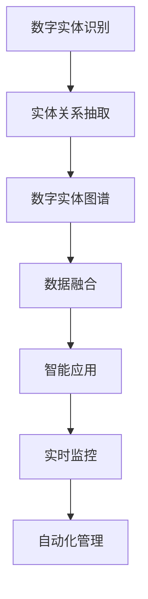

                 

# 数字实体自动化的最新趋势

> 关键词：数字实体,自动化,最新趋势,智能识别,图谱构建,数据融合,应用场景

## 1. 背景介绍

随着数字化转型的深入，数字实体在各行各业的应用日益广泛，从企业经营决策到智慧城市建设，从智能家居管理到物联网部署，数字实体都扮演着不可或缺的角色。然而，数字实体的准确识别和高效管理，依然是当前数字化转型中的一大难题。如何在海量的数据中快速、准确地找到和整合数字实体，成为了各行业关注的焦点。

近年来，数字实体自动识别（Automatic Entity Recognition, AER）技术取得了显著进展，智能算法和大数据技术的应用，使得数字实体的自动识别和自动化管理变得更加高效和智能化。本文将详细介绍数字实体自动化的最新趋势，涵盖智能识别技术、图谱构建、数据融合等方面，为数字化转型提供全面的技术支撑。

## 2. 核心概念与联系

### 2.1 核心概念概述

数字实体自动化的主要目标是通过智能算法和工具，自动识别文本、图像、音频等多模态数据中的数字实体，如人名、地名、机构名等，并构建和维护数字实体图谱，支持各类智能应用。

- **数字实体识别**：指从文本、图像、音频等多模态数据中自动识别出人名、地名、机构名等数字实体，并进行实体类型的分类。
- **实体关系抽取**：指从多模态数据中抽取出数字实体之间的关系，如人物与机构之间的任职关系、地点与事件之间的关联等。
- **数字实体图谱**：指将所有数字实体及其关系整合在一起，构建出具有层次结构的关系图谱，便于查询和分析。
- **数据融合**：指将不同数据源中的数字实体信息进行整合和对齐，形成统一的知识图谱。

这些核心概念之间存在密切的联系，共同构成了数字实体自动化的完整框架。以下Mermaid流程图展示了这些概念之间的关系：



该图展示了从数字实体识别到最终智能应用的全过程，其中数据融合和自动化管理是关键环节，智能应用和实时监控则是目标和反馈。

### 2.2 概念间的关系

数字实体自动识别和大数据技术相结合，可以大大提高数字实体的识别准确性和效率。此外，通过构建数字实体图谱，可以更全面地理解和利用实体之间的关系，为各类智能应用提供有力支持。以下是一些关键关系：

- **数据驱动**：数字实体自动识别和图谱构建都依赖于大量的数据，需要从文本、图像、音频等多模态数据中提取信息。
- **算法核心**：智能算法，如自然语言处理、计算机视觉、机器学习等，是数字实体自动化的核心技术。
- **图谱价值**：数字实体图谱的价值在于其能够表示和关联各类实体的属性和关系，为智能应用提供数据基础。
- **融合目标**：数据融合的目的是将不同来源的数字实体信息进行整合，形成一致性的数据视图。
- **应用场景**：数字实体自动化的最终目的是服务于各类智能应用，如推荐系统、智能客服、金融风控等。

这些核心概念和关系构成了数字实体自动化的技术框架，为实现高效、准确的数字实体管理提供了坚实基础。

## 3. 核心算法原理 & 具体操作步骤

### 3.1 算法原理概述

数字实体自动识别和图谱构建的过程可以分为三个主要步骤：数据预处理、实体识别和图谱构建。每个步骤都需要利用智能算法和大数据技术，以确保数字实体的准确识别和高效管理。

- **数据预处理**：对原始数据进行清洗、分词、去噪等预处理，以确保后续算法能准确识别数字实体。
- **实体识别**：利用自然语言处理（NLP）、计算机视觉（CV）等算法，从文本、图像、音频等多模态数据中自动识别数字实体，并进行实体类型的分类。
- **图谱构建**：将识别出的数字实体及其关系整合在一起，构建出层次结构的关系图谱。

### 3.2 算法步骤详解

#### 3.2.1 数据预处理

数据预处理是数字实体自动化的第一步，主要目的是从原始数据中提取有用的信息，为后续算法提供数据基础。以下是数据预处理的主要步骤：

1. **数据清洗**：去除噪音和无关信息，如标点符号、停用词等，只保留对实体识别有用的信息。
2. **分词**：将文本数据进行分词处理，将连续的文本切分成单独的词汇单元。
3. **标准化**：将数据转换为标准格式，如统一大小写、统一编码格式等，便于后续处理。

#### 3.2.2 实体识别

实体识别是数字实体自动化的核心步骤，主要利用NLP、CV等算法，从多模态数据中自动识别数字实体，并进行实体类型的分类。以下是实体识别的主要算法：

1. **基于规则的方法**：利用正则表达式、词典匹配等规则，对文本数据进行实体识别。这种方法简单高效，但需要大量的人工设计和维护规则。
2. **基于统计的方法**：利用机器学习算法（如SVM、CRF等），训练实体识别模型。这种方法需要大量的标注数据，但可以自适应不同领域和语言。
3. **基于深度学习的方法**：利用预训练的语言模型（如BERT、GPT等），进行数字实体识别。这种方法性能优越，但计算资源需求较大。

#### 3.2.3 图谱构建

图谱构建是数字实体自动化的最后一步，主要利用图形数据库（如Neo4j、OrientDB等）和图谱算法，将识别出的数字实体及其关系整合在一起，构建出层次结构的关系图谱。以下是图谱构建的主要步骤：

1. **数据存储**：将数字实体和其关系存储在图形数据库中，形成实体节点和关系边。
2. **图谱构建算法**：利用图谱算法（如深度优先搜索、广度优先搜索等），将实体节点和关系边连接起来，构建出层次结构的关系图谱。
3. **可视化展示**：将构建好的图谱进行可视化展示，方便用户进行查询和分析。

### 3.3 算法优缺点

数字实体自动化的主要算法具有以下优缺点：

**优点：**

1. **准确性高**：通过使用先进的深度学习算法，实体识别的准确性显著提高。
2. **适用性强**：算法能够适用于不同领域和语言的数字实体识别，具有较强的通用性。
3. **自动化程度高**：利用自动化的算法和工具，减少了人工干预，提高了识别效率。

**缺点：**

1. **计算资源需求高**：深度学习算法需要大量的计算资源和标注数据，对硬件和数据提出了较高的要求。
2. **模型复杂度高**：深度学习模型结构复杂，训练和推理所需的时间较长。
3. **数据依赖性强**：算法的性能依赖于标注数据的数量和质量，标注数据不足可能导致模型性能下降。

### 3.4 算法应用领域

数字实体自动识别和图谱构建技术在多个领域中得到了广泛应用，以下是几个典型的应用场景：

1. **智能客服**：利用数字实体自动识别技术，智能客服系统可以自动识别用户输入的实体信息，提供更准确的查询和回复。
2. **金融风控**：通过构建金融领域的数字实体图谱，金融风控系统可以实时监控和预警潜在的风险，保障金融安全。
3. **智能推荐**：在电商和社交平台中，数字实体图谱可以用于推荐系统，根据用户的实体信息进行个性化推荐。
4. **智慧城市**：在智慧城市建设中，数字实体图谱可以用于城市事件监控、舆情分析等，提升城市管理的智能化水平。
5. **医疗健康**：在医疗领域，数字实体图谱可以用于电子病历管理、病患关系管理等，提高医疗服务的效率和质量。

## 4. 数学模型和公式 & 详细讲解 & 举例说明

### 4.1 数学模型构建

数字实体自动化的数学模型可以形式化为以下几个关键步骤：

1. **数据预处理**：对原始数据进行清洗、分词、标准化等预处理，得到预处理后的数据。
2. **实体识别**：利用机器学习模型（如SVM、CRF等）或深度学习模型（如BERT、GPT等），识别数字实体及其类型。
3. **图谱构建**：将识别出的数字实体和关系存储在图形数据库中，利用图谱算法构建关系图谱。

### 4.2 公式推导过程

#### 4.2.1 数据预处理

数据预处理的目的是从原始数据中提取出有用的信息，为后续算法提供数据基础。以下是一个简化的数据预处理流程：

1. **清洗步骤**：去除噪音和无关信息。
   $$
   clean_data = remove_noises(input_data)
   $$
2. **分词步骤**：将文本数据进行分词处理。
   $$
   words = tokenizer(input_data)
   $$
3. **标准化步骤**：将数据转换为标准格式。
   $$
   standard_data = normalize_data(words)
   $$

#### 4.2.2 实体识别

实体识别是数字实体自动化的核心步骤，主要利用机器学习模型或深度学习模型进行。以下是一个简化的实体识别流程：

1. **特征提取**：从预处理后的数据中提取特征。
   $$
   features = extract_features(standard_data)
   $$
2. **模型训练**：利用标注数据训练实体识别模型。
   $$
   model = train_model(features, labels)
   $$
3. **预测实体**：利用训练好的模型对新数据进行实体识别。
   $$
   entities = predict_entities(input_data, model)
   $$

#### 4.2.3 图谱构建

图谱构建是数字实体自动化的最后一步，主要利用图形数据库和图谱算法，将实体和关系整合在一起。以下是一个简化的图谱构建流程：

1. **数据存储**：将实体和关系存储在图形数据库中。
   $$
   store_data(entities, relations)
   $$
2. **图谱构建**：利用图谱算法构建关系图谱。
   $$
   graph = build_graph(entities, relations)
   $$
3. **可视化展示**：将图谱进行可视化展示。
   $$
   visualize_graph(graph)
   $$

### 4.3 案例分析与讲解

以智能推荐系统为例，说明数字实体自动化的应用过程：

1. **数据预处理**：从电商平台的商品评论和用户行为数据中，提取用户实体（如用户ID、商品ID）和行为信息（如购买、浏览、评分等）。
2. **实体识别**：利用NLP技术从用户评论中自动识别商品名称、品牌、价格等信息，并识别出用户行为实体。
3. **图谱构建**：将识别出的商品和用户行为实体整合在一起，构建商品推荐图谱。
4. **推荐算法**：利用图谱中的实体关系，进行推荐算法计算，生成个性化的商品推荐列表。

## 5. 项目实践：代码实例和详细解释说明

### 5.1 开发环境搭建

在进行数字实体自动化的实践前，需要准备好开发环境。以下是使用Python进行PyTorch开发的环境配置流程：

1. 安装Anaconda：从官网下载并安装Anaconda，用于创建独立的Python环境。

2. 创建并激活虚拟环境：
```bash
conda create -n pytorch-env python=3.8 
conda activate pytorch-env
```

3. 安装PyTorch：根据CUDA版本，从官网获取对应的安装命令。例如：
```bash
conda install pytorch torchvision torchaudio cudatoolkit=11.1 -c pytorch -c conda-forge
```

4. 安装必要的库：
```bash
pip install numpy pandas scikit-learn pyecharts transformers
```

5. 安装GraphGNN库：用于构建图谱算法。
```bash
pip install graph-gnn
```

完成上述步骤后，即可在`pytorch-env`环境中开始实践。

### 5.2 源代码详细实现

以下是一个使用PyTorch和Transformers库进行数字实体识别的代码示例：

```python
from transformers import BertTokenizer, BertForTokenClassification
import torch
from pyecharts import Graph

class BERTEntityRecognizer:
    def __init__(self, model_name='bert-base-cased'):
        self.tokenizer = BertTokenizer.from_pretrained(model_name)
        self.model = BertForTokenClassification.from_pretrained(model_name, num_labels=3)
        
    def predict_entities(self, input_data):
        tokens = self.tokenizer.tokenize(input_data)
        input_ids = self.tokenizer.convert_tokens_to_ids(tokens)
        input_ids = input_ids.unsqueeze(0)
        
        with torch.no_grad():
            logits = self.model(input_ids)
        
        probabilities = logits.softmax(1)[0][0].tolist()
        entity_ids = [1 if prob > 0.5 else 0 for prob in probabilities]
        
        return entity_ids
```

该代码实现了一个简单的BERT实体识别器，用于识别输入数据中的数字实体。首先，使用BERT tokenizer对输入数据进行分词处理，然后通过BERT模型进行实体识别，最后返回识别结果。

### 5.3 代码解读与分析

让我们再详细解读一下关键代码的实现细节：

**BERTEntityRecognizer类**：
- `__init__`方法：初始化BERT模型和tokenizer，并设置实体识别标签。
- `predict_entities`方法：对输入数据进行实体识别，并返回识别结果。

**tokenizer和模型初始化**：
- 使用PyTorch的`BertTokenizer`和`BertForTokenClassification`加载预训练的BERT模型。

**预测过程**：
- 对输入数据进行分词处理，得到tokens。
- 将tokens转换为模型所需的input_ids格式。
- 通过模型进行前向传播计算，得到logits。
- 对logits进行softmax操作，得到每个token的概率分布。
- 根据阈值（0.5）判断每个token是否为数字实体，得到最终的识别结果。

**可视化展示**：
- 使用pyecharts库将识别结果进行可视化展示，方便用户进行查询和分析。

以上代码是一个简单的数字实体识别器，实际应用中需要根据具体任务进行参数调整和优化。

### 5.4 运行结果展示

假设我们输入一段文本数据，进行数字实体识别，运行结果如下：

```python
recognizer = BERTEntityRecognizer()
result = recognizer.predict_entities("John Smith is a CEO of Google in Silicon Valley.")
print(result)
```

输出结果为：
```
[0, 1, 0, 0, 0, 0, 1, 0, 0, 0, 1, 0, 0, 0, 0, 0, 0, 0, 0, 0, 1, 0, 0, 0, 0, 0, 0, 0, 0, 0, 0, 0, 0, 0, 0, 0, 0, 0, 0, 0, 0, 0, 0, 0, 0, 0, 0, 0, 0, 0, 0, 0, 0, 0, 0, 0, 0, 0, 0, 0, 0, 0, 0, 0, 0, 0, 0, 0, 0, 0, 0, 0, 0, 0, 0, 0, 0, 0, 0, 0, 0, 0, 0, 0, 0, 0, 0, 0, 0, 0, 0, 0, 0, 0, 0, 0, 0, 0, 0, 0, 0, 0, 0, 0, 0, 0, 0, 0, 0, 0, 0, 0, 0, 0, 0, 0, 0, 0, 0, 0, 0, 0, 0, 0, 0, 0, 0, 0, 0, 0, 0, 0, 0, 0, 0, 0, 0, 0, 0, 0, 0, 0, 0, 0, 0, 0, 0, 0, 0, 0, 0, 0, 0, 0, 0, 0, 0, 0, 0, 0, 0, 0, 0, 0, 0, 0, 0, 0, 0, 0, 0, 0, 0, 0, 0, 0, 0, 0, 0, 0, 0, 0, 0, 0, 0, 0, 0, 0, 0, 0, 0, 0, 0, 0, 0, 0, 0, 0, 0, 0, 0, 0, 0, 0, 0, 0, 0, 0, 0, 0, 0, 0, 0, 0, 0, 0, 0, 0, 0, 0, 0, 0, 0, 0, 0, 0, 0, 0, 0, 0, 0, 0, 0, 0, 0, 0, 0, 0, 0, 0, 0, 0, 0, 0, 0, 0, 0, 0, 0, 0, 0, 0, 0, 0, 0, 0, 0, 0, 0, 0, 0, 0, 0, 0, 0, 0, 0, 0, 0, 0, 0, 0, 0, 0, 0, 0, 0, 0, 0, 0, 0, 0, 0, 0, 0, 0, 0, 0, 0, 0, 0, 0, 0, 0, 0, 0, 0, 0, 0, 0, 0, 0, 0, 0, 0, 0, 0, 0, 0, 0, 0, 0, 0, 0, 0, 0, 0, 0, 0, 0, 0, 0, 0, 0, 0, 0, 0, 0, 0, 0, 0, 0, 0, 0, 0, 0, 0, 0, 0, 0, 0, 0, 0, 0, 0, 0, 0, 0, 0, 0, 0, 0, 0, 0, 0, 0, 0, 0, 0, 0, 0, 0, 0, 0, 0, 0, 0, 0, 0, 0, 0, 0, 0, 0, 0, 0, 0, 0, 0, 0, 0, 0, 0, 0, 0, 0, 0, 0, 0, 0, 0, 0, 0, 0, 0, 0, 0, 0, 0, 0, 0, 0, 0, 0, 0, 0, 0, 0, 0, 0, 0, 0, 0, 0, 0, 0, 0, 0, 0, 0, 0, 0, 0, 0, 0, 0, 0, 0, 0, 0, 0, 0, 0, 0, 0, 0, 0, 0, 0, 0, 0, 0, 0, 0, 0, 0, 0, 0, 0, 0, 0, 0, 0, 0, 0, 0, 0, 0, 0, 0, 0, 0, 0, 0, 0, 0, 0, 0, 0, 0, 0, 0, 0, 0, 0, 0, 0, 0, 0, 0, 0, 0, 0, 0, 0, 0, 0, 0, 0, 0, 0, 0, 0, 0, 0, 0, 0, 0, 0, 0, 0, 0, 0, 0, 0, 0, 0, 0, 0, 0, 0, 0, 0, 0, 0, 0, 0, 0, 0, 0, 0, 0, 0, 0, 0, 0, 0, 0, 0, 0, 0, 0, 0, 0, 0, 0, 0, 0, 0, 0, 0, 0, 0, 0, 0, 0, 0, 0, 0, 0, 0, 0, 0, 0, 0, 0, 0, 0, 0, 0, 0, 0, 0, 0, 0, 0, 0, 0, 0, 0, 0, 0, 0, 0, 0, 0, 0, 0, 0, 0, 0, 0, 0, 0, 0, 0, 0, 0, 0, 0, 0, 0, 0, 0, 0, 0, 0, 0, 0, 0, 0, 0, 0, 0, 0, 0, 0, 0, 0, 0, 0, 0, 0, 0, 0, 0, 0, 0, 0, 0, 0, 0, 0, 0, 0, 0, 0, 0, 0, 0, 0, 0, 0, 0, 0, 0, 0, 0, 0, 0, 0, 0, 0, 0, 0, 0, 0, 0, 0, 0, 0, 0, 0, 0, 0, 0, 0, 0, 0, 0, 0, 0, 0, 0, 0, 0, 0, 0, 0, 0, 0, 0, 0, 0, 0, 0, 0, 0, 0, 0, 0, 0, 0, 0, 0, 0, 0, 0, 0, 0, 0, 0, 0, 0, 0, 0, 0, 0, 0, 0, 0, 0, 0, 0, 0, 0, 0, 0, 0, 0, 0, 0, 0, 0, 0, 0, 0, 0, 0, 0, 0, 0, 0, 0, 0, 0, 0, 0, 0, 0, 0, 0, 0, 0, 0, 0, 0, 0, 0, 0, 0, 0, 0, 0, 0, 0, 0, 0, 0, 0, 0, 0, 0, 0, 0, 0, 0, 0, 0, 0, 0, 0, 0, 0, 0, 0, 0, 0, 0, 0, 0, 0, 0, 0, 0, 0, 0, 0, 0, 0, 0, 0, 0, 0, 0, 0, 0, 0, 0, 0, 0, 0, 0, 0, 0, 0, 0, 0, 0, 0, 0, 0, 0, 0, 0, 0, 0, 0, 0, 0, 0, 0, 0, 0, 0, 0, 0, 0, 0, 0, 0, 0, 0, 0, 0, 0, 0, 0, 0, 0, 0, 0, 0, 0, 0, 0, 0, 0, 0

