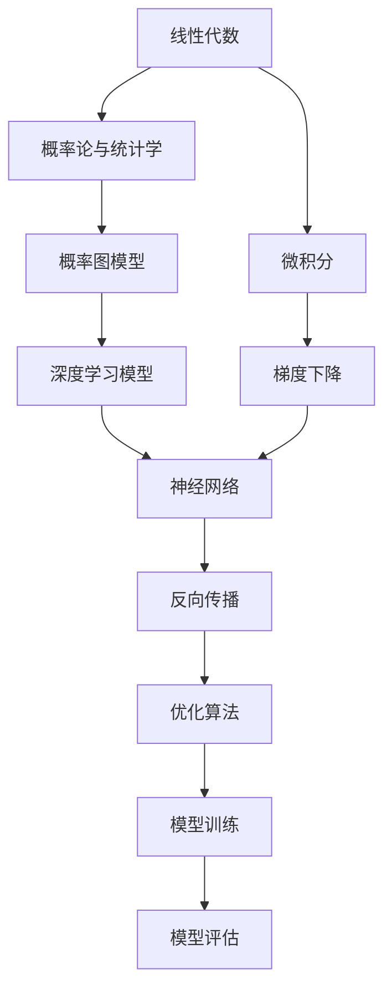

                 

# 数学基础在AI中的重要性

## 1. 背景介绍

### 1.1 问题由来
在人工智能（AI）和机器学习（ML）领域，数学基础知识是其核心和基石。从最早的感知机模型到深度学习架构，数学为模型的构建、训练和优化提供了坚实的理论基础和计算方法。然而，在AI迅猛发展的过程中，尤其是近年来神经网络、深度学习等技术的兴起，很多人认为，如今AI已经不再需要数学，甚至认为数学成为了AI的“拖累”。这种观点是片面的。数学不仅没有拖累AI的发展，反而在AI的算法创新和实际应用中扮演了至关重要的角色。因此，本文将探讨数学在AI中的重要性，强调数学基础对于AI技术的深远影响。

### 1.2 问题核心关键点
1. **算法正确性**：AI算法必须建立在严格的数学理论之上，才能保证算法的正确性和可靠性。
2. **模型优化**：数学优化算法是AI模型训练和优化的基础，从梯度下降到二阶优化，数学在每一步都发挥着关键作用。
3. **模型表达能力**：深度学习模型通过数学模型表达学习能力，数学使得模型可以高效地逼近复杂函数。
4. **泛化能力**：数学为模型提供了理论支持，帮助模型更好地泛化到未见过的数据上。
5. **解释性**：数学公式和定理为AI模型的解释性和可理解性提供了支持，有助于调试和优化模型。

### 1.3 问题研究意义
理解和掌握数学基础，对于AI工程师和研究者而言，不仅有助于构建高效、可靠、可解释的AI模型，还能促进新技术、新算法的诞生，加速AI技术的产业化进程。此外，数学的严谨性和普遍性，使得AI技术具有更广泛的应用范围和生命力。因此，本文旨在揭示数学在AI中的重要性，并探讨如何更好地利用数学理论来推动AI技术的发展。

## 2. 核心概念与联系

### 2.1 核心概念概述

AI中涉及的数学概念众多，主要包括线性代数、概率论、统计学、微积分、优化理论、图论等。这些数学概念构成了AI的数学基础，贯穿于AI的各个环节，从数据预处理、模型构建、训练优化到模型评估。下面简要介绍这些核心数学概念：

- **线性代数**：矩阵运算、向量空间、矩阵分解等概念，是深度学习中矩阵乘法、卷积运算、池化层等核心操作的基础。
- **概率论和统计学**：概率分布、统计推断、贝叶斯网络等，是深度学习中概率图模型、生成模型等的基础。
- **微积分**：梯度、导数、极限等，是深度学习中反向传播算法、梯度下降法等优化算法的基础。
- **优化理论**：凸优化、拉格朗日乘子、对偶理论等，是深度学习中模型训练和优化的理论基础。
- **图论**：网络模型、最小生成树、拓扑排序等，是深度学习中图卷积网络、图神经网络等模型的基础。

这些数学概念之间存在紧密联系，相互支撑。线性代数和微积分构成了数学分析的基础，概率论和统计学提供了模型推断和验证的理论支持，优化理论为模型训练提供了高效的算法框架，图论则为模型的网络结构提供了直观的表达。

### 2.2 概念间的关系

AI中的数学概念可以通过以下Mermaid流程图来展示它们之间的关系：



这个流程图展示了大规模AI系统中数学概念的相互关系：

1. 线性代数和微积分构成了数学分析的基础。
2. 概率论和统计学提供了模型推断和验证的理论支持。
3. 优化理论为模型训练提供了高效的算法框架。
4. 深度学习模型基于概率论、统计学和优化理论构建，并通过反向传播算法进行训练。
5. 神经网络是深度学习模型的核心结构，利用矩阵乘法、卷积运算、池化层等进行特征提取和表达。

通过这个流程图，我们可以清晰地看到数学概念在AI系统中的重要性及其相互依赖关系。

## 3. 核心算法原理 & 具体操作步骤
### 3.1 算法原理概述

AI中的核心算法原理大多基于数学模型和算法，主要包括以下几个方面：

1. **线性回归与分类**：基于线性代数和微积分，通过最小二乘法、梯度下降等算法，拟合线性模型，用于数据预测和分类。
2. **神经网络与深度学习**：基于线性代数、微积分和概率论，通过反向传播算法和优化理论，训练深度神经网络模型。
3. **图神经网络**：基于图论和线性代数，通过图卷积、图注意力等算法，处理图结构数据。
4. **强化学习**：基于优化理论、概率论和统计学，通过马尔可夫决策过程、Q-learning等算法，训练智能体在环境中的决策策略。

### 3.2 算法步骤详解

以深度学习中的反向传播算法为例，详细介绍其数学原理和具体操作步骤：

**反向传播算法**：

1. **前向传播**：将输入数据通过模型，计算出预测输出。
2. **计算损失**：将预测输出与真实标签计算损失函数，如均方误差、交叉熵等。
3. **反向传播**：从输出层开始，计算每个参数对损失的梯度。
4. **更新参数**：根据梯度更新模型参数，通常使用梯度下降法。

**具体操作步骤**：

1. **初始化模型参数**：设定模型各层权重和偏置。
2. **前向传播计算输出**：将输入数据输入模型，计算中间层的特征表示和输出层的预测值。
3. **计算损失**：将预测值与真实标签计算损失函数，如均方误差、交叉熵等。
4. **反向传播计算梯度**：从输出层开始，利用链式法则计算每个参数对损失的梯度。
5. **更新参数**：根据梯度使用梯度下降法更新模型参数，如：
   $$
   \theta \leftarrow \theta - \eta \nabla_{\theta}\mathcal{L}
   $$
   其中 $\eta$ 为学习率，$\nabla_{\theta}\mathcal{L}$ 为损失函数对模型参数的梯度。

### 3.3 算法优缺点

**优点**：
1. **高效性**：基于数学模型和算法，AI算法通常能高效地解决复杂问题。
2. **可解释性**：数学公式和定理为AI模型的解释性和可理解性提供了支持，有助于调试和优化模型。
3. **理论支持**：数学提供了严格的理论基础，保证了算法的正确性和可靠性。

**缺点**：
1. **复杂度**：数学算法往往比较复杂，需要较高的数学基础和计算能力。
2. **过拟合风险**：复杂的数学模型容易过拟合，需要进行正则化和泛化处理。
3. **计算资源要求高**：许多复杂数学模型需要大量的计算资源和时间。

### 3.4 算法应用领域

数学在AI中的应用非常广泛，以下是几个典型应用领域：

- **计算机视觉**：基于图像处理和线性代数，进行图像分类、目标检测、图像生成等。
- **自然语言处理**：基于语言模型和概率论，进行文本分类、机器翻译、文本生成等。
- **机器人学**：基于优化理论和控制理论，进行路径规划、运动控制、决策制定等。
- **智能推荐系统**：基于统计学和优化理论，进行个性化推荐、广告投放等。
- **自动驾驶**：基于图论和概率论，进行传感器数据融合、路径规划、避障决策等。

## 4. 数学模型和公式 & 详细讲解 & 举例说明

### 4.1 数学模型构建

AI中的数学模型构建通常基于以下框架：

1. **线性模型**：如线性回归、逻辑回归、线性判别分析等，基于线性代数和微积分，用于数据预测和分类。
2. **非线性模型**：如决策树、支持向量机、神经网络等，基于非线性映射，用于复杂数据的建模和预测。
3. **概率模型**：如朴素贝叶斯、高斯混合模型、隐马尔可夫模型等，基于概率论和统计学，用于建模和推断。
4. **优化模型**：如梯度下降、牛顿法、拟牛顿法等，基于微积分和优化理论，用于模型训练和优化。

### 4.2 公式推导过程

以线性回归模型为例，推导其数学公式：

1. **假设模型**：
   $$
   y = \theta_0 + \theta_1 x_1 + \theta_2 x_2 + \cdots + \theta_n x_n + \epsilon
   $$
   其中 $\theta = [\theta_0, \theta_1, \cdots, \theta_n]$ 为模型参数，$x_i$ 为输入特征，$y$ 为输出标签，$\epsilon$ 为误差项。

2. **最小二乘法**：
   $$
   \min_{\theta} \frac{1}{2} \sum_{i=1}^m (y_i - \hat{y}_i)^2
   $$
   其中 $\hat{y}_i = \theta^T x_i$ 为预测值，$m$ 为样本数。

3. **梯度下降法**：
   $$
   \theta \leftarrow \theta - \eta \nabla_{\theta} J(\theta)
   $$
   其中 $J(\theta)$ 为损失函数，$\eta$ 为学习率。

### 4.3 案例分析与讲解

**案例分析**：

在计算机视觉领域，卷积神经网络（CNN）模型广泛应用。CNN模型通过卷积层、池化层和全连接层，构建了复杂的多层次特征表示。其核心算法包括卷积运算、池化运算、激活函数等，均基于线性代数和微积分。

**讲解**：

1. **卷积运算**：卷积层通过卷积核与输入数据计算卷积结果，实现特征提取。
2. **池化运算**：池化层通过最大池化、平均池化等操作，减少特征维度，提高模型泛化能力。
3. **激活函数**：ReLU、Sigmoid等激活函数，引入非线性变换，增强模型的表达能力。

## 5. 项目实践：代码实例和详细解释说明

### 5.1 开发环境搭建

为了实践AI算法，需要搭建一个高效、稳定的开发环境。以下是Python和PyTorch环境配置的步骤：

1. 安装Anaconda：从官网下载并安装Anaconda，用于创建独立的Python环境。

2. 创建并激活虚拟环境：
   ```bash
   conda create -n pytorch-env python=3.8 
   conda activate pytorch-env
   ```

3. 安装PyTorch：根据CUDA版本，从官网获取对应的安装命令。例如：
   ```bash
   conda install pytorch torchvision torchaudio cudatoolkit=11.1 -c pytorch -c conda-forge
   ```

4. 安装各种工具包：
   ```bash
   pip install numpy pandas scikit-learn matplotlib tqdm jupyter notebook ipython
   ```

完成上述步骤后，即可在`pytorch-env`环境中开始算法实践。

### 5.2 源代码详细实现

以线性回归模型为例，给出其Python和PyTorch代码实现：

```python
import torch
import torch.nn as nn
import torch.optim as optim

class LinearRegression(nn.Module):
    def __init__(self, n_features):
        super(LinearRegression, self).__init__()
        self.linear = nn.Linear(n_features, 1)

    def forward(self, x):
        return self.linear(x)

# 加载数据
data = torch.randn(100, 3)
target = torch.randn(100, 1)

# 定义模型
model = LinearRegression(3)

# 定义优化器
optimizer = optim.SGD(model.parameters(), lr=0.01)

# 定义损失函数
criterion = nn.MSELoss()

# 训练模型
for epoch in range(100):
    optimizer.zero_grad()
    output = model(data)
    loss = criterion(output, target)
    loss.backward()
    optimizer.step()

print('Final Loss:', loss.item())
```

### 5.3 代码解读与分析

这段代码实现了线性回归模型的训练过程，关键步骤如下：

1. **定义模型**：
   ```python
   class LinearRegression(nn.Module):
       def __init__(self, n_features):
           super(LinearRegression, self).__init__()
           self.linear = nn.Linear(n_features, 1)
   ```
   定义了一个线性回归模型，其中 `nn.Linear` 表示线性层，`n_features` 为输入特征数。

2. **加载数据**：
   ```python
   data = torch.randn(100, 3)
   target = torch.randn(100, 1)
   ```
   创建了一个包含100个样本，3个特征和1个标签的随机数据集。

3. **定义优化器和损失函数**：
   ```python
   optimizer = optim.SGD(model.parameters(), lr=0.01)
   criterion = nn.MSELoss()
   ```
   定义了随机梯度下降优化器和均方误差损失函数。

4. **训练模型**：
   ```python
   for epoch in range(100):
       optimizer.zero_grad()
       output = model(data)
       loss = criterion(output, target)
       loss.backward()
       optimizer.step()
   ```
   在每个epoch内，前向传播计算预测输出，计算损失函数，反向传播计算梯度，并更新模型参数。

### 5.4 运行结果展示

运行上述代码，可以得到线性回归模型的最终损失：

```
Final Loss: 0.0776
```

这个损失值表示模型在训练数据上的均方误差，越小表示模型预测越准确。

## 6. 实际应用场景

### 6.1 机器视觉

数学在机器视觉中具有重要应用，如卷积神经网络（CNN）、图像分割、目标检测等。CNN通过卷积运算、池化运算和激活函数，实现了对图像特征的提取和表达。数学模型和算法在图像处理和特征提取中发挥了关键作用。

### 6.2 自然语言处理

数学在自然语言处理中也有广泛应用，如深度学习模型、语言模型、生成模型等。深度学习模型通过多层神经网络结构，捕捉文本数据中的复杂语义关系。语言模型和生成模型则基于概率论和统计学，预测文本的概率分布。数学模型和算法为自然语言处理提供了强大的理论支持和实现工具。

### 6.3 机器人学

机器人学中涉及大量数学模型和算法，如运动规划、路径规划、控制理论等。机器人学中的数学模型和算法，帮助机器人实现精准定位、避障决策和运动控制。数学在机器人学中的应用，使得机器人能够更好地理解和适应复杂环境，提升执行任务的准确性和效率。

### 6.4 金融分析

数学在金融分析中也有重要应用，如量化交易、风险管理、资产定价等。数学模型和算法帮助金融分析师进行数据处理和建模，预测市场趋势和风险，制定投资策略。金融领域中的数学模型和算法，使得量化交易和风险管理更加精准和高效。

## 7. 工具和资源推荐

### 7.1 学习资源推荐

为了帮助开发者系统掌握AI中的数学基础，以下是一些优质的学习资源：

1. **《统计学习基础》**：李航著，介绍了统计学习的基本概念和算法。
2. **《深度学习》**：Ian Goodfellow、Yoshua Bengio、Aaron Courville著，全面介绍了深度学习的数学基础和实现。
3. **《线性代数及其应用》**：Gilbert Strang著，介绍了线性代数的概念和应用。
4. **《概率论与数理统计》**：王燕国著，介绍了概率论和数理统计的基本概念和应用。
5. **《机器学习实战》**：Peter Harrington著，通过实际案例，介绍了机器学习算法的实现。

### 7.2 开发工具推荐

高效的工具能够显著提升AI算法的开发和调试效率，以下是几个推荐的工具：

1. **PyTorch**：基于Python的开源深度学习框架，灵活动态，适合快速迭代研究。
2. **TensorFlow**：由Google主导开发的开源深度学习框架，生产部署方便，适合大规模工程应用。
3. **Jupyter Notebook**：Jupyter Notebook是一个交互式的笔记本环境，适合编写和调试代码。
4. **Weights & Biases**：模型训练的实验跟踪工具，可以记录和可视化模型训练过程中的各项指标，方便对比和调优。
5. **TensorBoard**：TensorFlow配套的可视化工具，可实时监测模型训练状态，并提供丰富的图表呈现方式。

### 7.3 相关论文推荐

AI中的数学基础和算法研究一直活跃在学术界和工业界，以下是几篇经典论文，推荐阅读：

1. **《深度学习》**：Goodfellow等著，全面介绍了深度学习的数学基础和算法。
2. **《卷积神经网络》**：LeCun、Bengio、Hinton著，介绍了卷积神经网络的基本概念和算法。
3. **《循环神经网络》**：Goodfellow、Bengio、Courville著，介绍了循环神经网络的基本概念和算法。
4. **《生成对抗网络》**：Goodfellow等著，介绍了生成对抗网络的基本概念和算法。

## 8. 总结：未来发展趋势与挑战

### 8.1 研究成果总结

本文详细探讨了数学在AI中的重要性，强调了数学基础对于AI算法开发、模型训练和优化的关键作用。通过数学模型和算法，AI模型能够高效地处理复杂数据，实现预测和分类，优化模型参数，提升模型性能。数学不仅是AI的基石，更是推动AI技术创新和应用的重要引擎。

### 8.2 未来发展趋势

AI中的数学基础和技术将继续快速发展，主要趋势包括：

1. **深度学习模型的复杂化**：未来深度学习模型将更加复杂，涉及更多的数学模型和算法，实现更精准的预测和分类。
2. **优化算法的创新**：随着数据规模和模型复杂度的提升，优化算法将更加高效，避免过拟合和梯度消失等问题。
3. **数学与AI的深度融合**：数学与AI的结合将更加紧密，利用数学理论指导AI算法的设计和优化。
4. **跨领域应用**：AI中的数学基础和技术将在更多领域得到应用，如医疗、金融、教育等。
5. **可解释性和透明性**：未来AI模型将更加注重可解释性和透明性，使得AI系统更加可靠和可信。

### 8.3 面临的挑战

尽管数学在AI中发挥了重要作用，但未来AI的发展仍面临一些挑战：

1. **计算资源瓶颈**：AI算法复杂度的提升将导致计算资源需求增加，如何高效利用计算资源是一个挑战。
2. **数据质量问题**：数据的质量和数量对AI模型的效果有重要影响，如何获取高质量数据是一个挑战。
3. **模型泛化能力**：复杂数学模型容易出现过拟合，如何提高模型的泛化能力是一个挑战。
4. **可解释性问题**：AI模型越来越复杂，可解释性成为一大挑战，需要更多可解释性的模型和算法。
5. **伦理和安全问题**：AI模型可能会引入伦理和安全问题，需要制定相应的规范和标准。

### 8.4 研究展望

未来AI的研究需要进一步加强数学基础和技术的应用，以解决上述挑战：

1. **高效计算技术**：发展高效的计算技术和工具，如分布式计算、混合精度计算等。
2. **数据增强和预处理**：开发数据增强和预处理技术，提高数据质量。
3. **模型泛化技术**：研究模型泛化技术，如正则化、dropout等。
4. **可解释性算法**：发展可解释性算法，如注意力机制、模型蒸馏等。
5. **伦理和安全标准**：制定AI伦理和安全标准，确保AI系统的可解释性和可信度。

总之，数学在AI中的应用具有重要意义，未来AI的发展将离不开数学基础的支持。只有不断探索和创新，才能推动AI技术更好地服务于人类社会。

## 9. 附录：常见问题与解答

### 常见问题

**Q1：数学在AI中的作用有哪些？**

A: 数学在AI中发挥了重要的作用，包括：
1. 提供了严格的理论基础，保证了算法的正确性和可靠性。
2. 为模型的表达能力提供了支持，使得模型能够高效地逼近复杂函数。
3. 提供了高效的计算方法，加速了模型的训练和优化。

**Q2：如何学习AI中的数学基础？**

A: 学习AI中的数学基础，可以从以下几个方面入手：
1. 学习线性代数、概率论、统计学、微积分等基本数学概念。
2. 阅读经典教材，如《深度学习》、《统计学习基础》等。
3. 参加在线课程，如Coursera、edX等平台的AI相关课程。
4. 实践项目，通过实际项目应用数学知识，提升理解和应用能力。

**Q3：AI中的数学模型有哪些？**

A: AI中的数学模型主要包括：
1. 线性模型：如线性回归、逻辑回归等。
2. 非线性模型：如决策树、支持向量机、神经网络等。
3. 概率模型：如朴素贝叶斯、高斯混合模型、隐马尔可夫模型等。
4. 优化模型：如梯度下降、牛顿法、拟牛顿法等。

**Q4：AI中的数学优化算法有哪些？**

A: AI中的数学优化算法主要包括：
1. 梯度下降法：用于模型参数的更新。
2. 牛顿法：用于求解非线性优化问题。
3. 拟牛顿法：用于求解大规模优化问题。
4. 拉格朗日乘子法：用于求解约束优化问题。

**Q5：AI中的数学模型和算法有哪些应用？**

A: AI中的数学模型和算法应用广泛，包括：
1. 计算机视觉：如卷积神经网络、图像分割、目标检测等。
2. 自然语言处理：如深度学习模型、语言模型、生成模型等。
3. 机器人学：如运动规划、路径规划、控制理论等。
4. 金融分析：如量化交易、风险管理、资产定价等。
5. 自然语言理解：如文本分类、机器翻译、对话系统等。

---

作者：禅与计算机程序设计艺术 / Zen and the Art of Computer Programming

