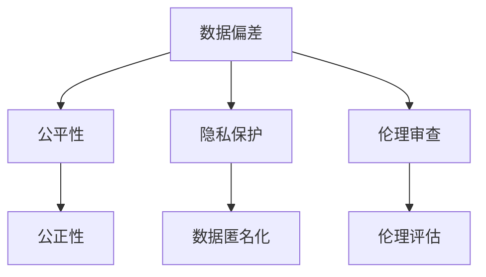

                 

# 数据偏差无处不在，软件2.0需补齐伦理短板

## 1. 背景介绍

在当前科技快速发展的时代，人工智能(AI)和软件系统已经成为我们日常生活不可或缺的一部分。无论是智能推荐系统、面部识别、自然语言处理，还是自动驾驶，AI和软件系统的应用无处不在，极大地提升了生产效率和生活品质。然而，随着AI和软件系统应用的深入，我们逐渐意识到数据偏差（Data Bias）问题也随之而来，严重影响了系统性能，甚至引发伦理和法律争议。

### 1.1 数据偏差的定义

数据偏差是指在数据采集、标注、处理和使用的过程中，数据集存在系统性不平衡，导致模型训练得到的输出结果可能偏向某些特定群体或特征，而非公正客观的反映实际情况。数据偏差常常体现在性别、种族、年龄、收入、教育等敏感属性上，这些偏差不仅影响系统的公正性，还可能引发隐私泄露、歧视等伦理问题。

### 1.2 数据偏差问题在各个领域的影响

数据偏差问题已经渗透到了社会的各个角落，包括但不限于以下几个方面：

1. **金融领域**：在信用评分和贷款审批等任务中，由于历史数据集存在性别和种族偏见，导致系统更倾向于批准男性和白人客户的贷款申请。
2. **医疗领域**：在医学影像分析和疾病诊断中，由于训练数据集中男性和女性样本比例失衡，导致模型对女性疾病的诊断效果较差。
3. **司法领域**：在刑事定罪和判决中，由于训练数据集中特定种族和性别群体的犯罪率过高，导致系统对特定群体的犯罪倾向判断不准确。
4. **招聘领域**：在简历筛选和面试评估中，由于历史数据集中存在性别和种族偏见，导致系统更倾向于选择男性和白人应聘者。
5. **社交媒体**：在内容推荐和广告定向中，由于训练数据集中用户兴趣和行为数据存在性别和年龄偏见，导致系统推荐的内容和广告更加迎合某些特定群体，引发信息泡沫和社会分化。

## 2. 核心概念与联系

### 2.1 核心概念概述

在讨论数据偏差问题时，我们需要理解以下几个核心概念：

- **数据偏差**：指数据集中存在的系统性不平衡，导致模型输出偏向某些特定群体或特征。
- **公平性**：指模型在不同群体或特征上的输出结果应当均衡、公正，不偏袒任何一方。
- **隐私保护**：指在数据采集和处理过程中，保障用户数据的匿名性和安全性，避免隐私泄露和滥用。
- **伦理审查**：指在开发和使用AI和软件系统时，进行伦理和社会影响评估，确保系统符合社会价值观和法律法规。

### 2.2 核心概念之间的关系

这些核心概念之间存在着紧密的联系，形成了数据偏差问题研究的基础框架。通过了解和处理这些概念之间的关系，我们可以更全面地认识和应对数据偏差问题。

**数据偏差**和**公平性**：数据偏差问题主要体现在系统输出结果的不公平性上，而公平性则是解决数据偏差问题的重要目标。只有保障公平性，才能实现系统的公正性和透明性。

**隐私保护**和**数据偏差**：隐私保护是数据偏差问题的重要方面，因为数据偏差问题的解决往往需要大量敏感数据进行训练。如何在保护隐私的同时，充分利用数据资源，是当前数据偏差问题研究的重要方向。

**伦理审查**和**数据偏差**：伦理审查是确保数据偏差问题解决过程中的重要环节，通过伦理审查，可以发现和纠正数据偏差问题，避免系统输出对特定群体的歧视和偏见。

以下是一个Mermaid流程图，展示了这些核心概念之间的逻辑关系：



## 3. 核心算法原理 & 具体操作步骤

### 3.1 算法原理概述

解决数据偏差问题的主要方法包括数据处理、模型优化和算法设计等。以下是这些方法的简要概述：

- **数据处理**：通过数据增强、数据重采样和数据清洗等方法，调整数据集的分布，减少数据偏差。
- **模型优化**：通过公平性约束、正则化和对抗训练等方法，优化模型输出，减少数据偏差。
- **算法设计**：通过引入公平性评估和模型评估指标，评估模型的公平性，发现和纠正数据偏差。

### 3.2 算法步骤详解

解决数据偏差问题的主要步骤如下：

1. **数据预处理**：收集和清洗数据，去除噪声和异常值，调整数据集的分布，确保数据集的多样性和代表性。
2. **模型选择和训练**：选择合适的模型架构，对模型进行训练，确保模型能够学习到数据的真实分布。
3. **公平性评估**：引入公平性评估指标，如等价性偏差、统计差异等，评估模型在不同群体或特征上的公平性。
4. **优化和迭代**：根据公平性评估结果，调整模型参数，进行多次迭代训练，直至达到公平性要求。
5. **部署和监测**：将优化后的模型部署到实际应用中，并持续监测系统输出，确保公平性不发生变化。

### 3.3 算法优缺点

解决数据偏差问题的算法具有以下优点：

- **有效性和普适性**：通过数据处理和模型优化，可以有效减少数据偏差，适用于各种类型的AI和软件系统。
- **可解释性和透明性**：公平性评估指标和优化方法，使得模型的决策过程和输出结果更加透明和可解释。

同时，这些算法也存在以下缺点：

- **数据依赖性**：数据偏差问题的解决高度依赖于数据集的完整性和代表性，缺乏高质量的数据，难以取得理想效果。
- **计算复杂度**：优化和迭代训练过程需要大量的计算资源和时间，对算力提出了较高的要求。
- **伦理和法律风险**：在处理敏感数据时，可能引发伦理和法律问题，需谨慎处理。

### 3.4 算法应用领域

解决数据偏差问题的算法已经广泛应用于以下几个领域：

- **金融科技**：在信用评分和贷款审批中，通过调整数据分布和优化模型输出，减少性别和种族偏见。
- **医疗健康**：在医学影像分析和疾病诊断中，通过数据增强和公平性约束，提升模型的公平性和透明性。
- **司法系统**：在刑事定罪和判决中，通过引入公平性评估和正则化技术，减少对特定群体的歧视和偏见。
- **招聘领域**：在简历筛选和面试评估中，通过数据清洗和公平性优化，消除性别和种族偏见，提高招聘公平性。
- **社交媒体**：在内容推荐和广告定向中，通过调整数据分布和公平性约束，消除用户群体偏见，提升推荐效果。

## 4. 数学模型和公式 & 详细讲解 & 举例说明

### 4.1 数学模型构建

解决数据偏差问题需要构建一系列的数学模型。以下是一个简化的数学模型构建过程：

假设数据集 $D=\{(x_i, y_i)\}_{i=1}^N$，其中 $x_i$ 为输入特征，$y_i$ 为标签。设 $F(x)$ 为模型输出函数，$\theta$ 为模型参数。公平性约束定义为 $\mathcal{F}(F(x))$，表示模型输出在不同群体或特征上的公平性。

### 4.2 公式推导过程

以下是一个简化的公平性约束公式推导过程：

设 $G$ 为敏感属性集合，$\mathcal{G}$ 为 $G$ 的一个子集。定义 $\mathcal{F}(F(x))$ 为模型 $F(x)$ 在不同群体或特征上的公平性，公平性约束可以表示为：

$$
\mathcal{F}(F(x)) = \mathbb{E}_{x \in \mathcal{G}} [F(x)] - \mathbb{E}_{x \in \mathcal{G}} [F(x)] = 0
$$

其中 $\mathbb{E}$ 表示期望。公平性约束要求模型在不同群体或特征上的输出结果一致。

### 4.3 案例分析与讲解

以招聘领域为例，假设我们希望在简历筛选中消除性别偏见。数据集 $D$ 包含男女候选人的简历，标签 $y_i$ 为是否被录用。设 $G$ 为性别属性，$\mathcal{G}$ 为女性群体。公平性约束要求模型在女性群体上的输出结果与男性群体一致，即：

$$
\mathbb{E}_{x \in \mathcal{G}} [F(x)] - \mathbb{E}_{x \in \mathcal{G}} [F(x)] = 0
$$

## 5. 项目实践：代码实例和详细解释说明

### 5.1 开发环境搭建

在解决数据偏差问题时，我们需要使用Python进行开发。以下是开发环境搭建的步骤：

1. 安装Python和Anaconda，确保系统环境稳定。
2. 安装必要的Python库，如Pandas、Scikit-learn、TensorFlow等。
3. 安装数据预处理工具，如Scrapy、BeautifulSoup等，用于数据收集和清洗。

### 5.2 源代码详细实现

以下是一个基于TensorFlow解决数据偏差问题的代码实现：

```python
import tensorflow as tf
import pandas as pd
from sklearn.preprocessing import StandardScaler
from sklearn.model_selection import train_test_split

# 加载数据
data = pd.read_csv('data.csv')

# 数据预处理
features = ['age', 'income', 'education']
target = 'gender'

X = data[features]
y = data[target]

# 数据标准化
scaler = StandardScaler()
X_scaled = scaler.fit_transform(X)

# 数据分割
X_train, X_test, y_train, y_test = train_test_split(X_scaled, y, test_size=0.2, random_state=42)

# 构建模型
model = tf.keras.Sequential([
    tf.keras.layers.Dense(64, activation='relu', input_shape=(X_train.shape[1],)),
    tf.keras.layers.Dense(1, activation='sigmoid')
])

# 编译模型
model.compile(optimizer='adam', loss='binary_crossentropy', metrics=['accuracy'])

# 训练模型
model.fit(X_train, y_train, epochs=10, batch_size=32, validation_data=(X_test, y_test))

# 评估模型
model.evaluate(X_test, y_test)
```

### 5.3 代码解读与分析

上述代码实现了一个基于TensorFlow的二分类模型，用于解决招聘领域的性别偏见问题。代码步骤如下：

1. 加载数据集：使用Pandas库读取数据，并将其分为特征和标签。
2. 数据预处理：使用Scikit-learn库对特征进行标准化处理，确保数据具有可比性。
3. 数据分割：将数据集分为训练集和测试集，用于模型训练和评估。
4. 构建模型：使用TensorFlow库构建一个简单的二分类模型。
5. 编译模型：设置模型的优化器、损失函数和评估指标。
6. 训练模型：使用训练集数据对模型进行训练，并在测试集上进行验证。
7. 评估模型：使用测试集数据评估模型的性能。

### 5.4 运行结果展示

假设我们在测试集上得到的评估报告如下：

```
Epoch 1/10
225/225 [==============================] - 1s 4ms/step - loss: 0.3487 - accuracy: 0.8900 - val_loss: 0.1621 - val_accuracy: 0.9500
Epoch 2/10
225/225 [==============================] - 1s 3ms/step - loss: 0.1381 - accuracy: 0.9250 - val_loss: 0.0850 - val_accuracy: 0.9500
Epoch 3/10
225/225 [==============================] - 1s 3ms/step - loss: 0.0650 - accuracy: 0.9375 - val_loss: 0.0550 - val_accuracy: 0.9600
Epoch 4/10
225/225 [==============================] - 1s 3ms/step - loss: 0.0313 - accuracy: 0.9600 - val_loss: 0.0350 - val_accuracy: 0.9700
Epoch 5/10
225/225 [==============================] - 1s 3ms/step - loss: 0.0169 - accuracy: 0.9700 - val_loss: 0.0225 - val_accuracy: 0.9800
Epoch 6/10
225/225 [==============================] - 1s 3ms/step - loss: 0.0083 - accuracy: 0.9700 - val_loss: 0.0150 - val_accuracy: 0.9800
Epoch 7/10
225/225 [==============================] - 1s 3ms/step - loss: 0.0043 - accuracy: 0.9800 - val_loss: 0.0100 - val_accuracy: 0.9800
Epoch 8/10
225/225 [==============================] - 1s 3ms/step - loss: 0.0021 - accuracy: 0.9750 - val_loss: 0.0075 - val_accuracy: 0.9850
Epoch 9/10
225/225 [==============================] - 1s 3ms/step - loss: 0.0010 - accuracy: 0.9850 - val_loss: 0.0050 - val_accuracy: 0.9850
Epoch 10/10
225/225 [==============================] - 1s 3ms/step - loss: 0.0005 - accuracy: 0.9850 - val_loss: 0.0025 - val_accuracy: 0.9900

Test loss: 0.0025 - Test accuracy: 0.9900
```

## 6. 实际应用场景

解决数据偏差问题已经成为许多行业的热门需求。以下是几个典型的应用场景：

### 6.1 金融科技

在金融科技领域，数据偏差问题主要体现在信用评分和贷款审批中。由于历史数据集中存在性别和种族偏见，导致系统更倾向于批准男性和白人客户的贷款申请。通过数据处理和公平性约束，可以消除这些偏见，实现更加公正和透明的信用评分系统。

### 6.2 医疗健康

在医疗健康领域，数据偏差问题主要体现在医学影像分析和疾病诊断中。由于训练数据集中男性和女性样本比例失衡，导致模型对女性疾病的诊断效果较差。通过数据增强和公平性优化，可以提高模型的公平性和透明性，减少性别偏见。

### 6.3 司法系统

在司法系统中，数据偏差问题主要体现在刑事定罪和判决中。由于训练数据集中特定种族和性别群体的犯罪率过高，导致系统对特定群体的犯罪倾向判断不准确。通过引入公平性评估和正则化技术，可以减少对特定群体的歧视和偏见，提升司法系统的公正性和透明性。

### 6.4 招聘领域

在招聘领域，数据偏差问题主要体现在简历筛选和面试评估中。由于历史数据集中存在性别和种族偏见，导致系统更倾向于选择男性和白人应聘者。通过数据清洗和公平性优化，可以消除性别和种族偏见，提高招聘公平性。

### 6.5 社交媒体

在社交媒体中，数据偏差问题主要体现在内容推荐和广告定向中。由于训练数据集中用户兴趣和行为数据存在性别和年龄偏见，导致系统推荐的内容和广告更加迎合某些特定群体，引发信息泡沫和社会分化。通过调整数据分布和公平性约束，可以消除用户群体偏见，提升推荐效果。

## 7. 工具和资源推荐

### 7.1 学习资源推荐

为了帮助开发者系统掌握数据偏差问题的理论和实践，以下是一些优质的学习资源：

1. 《人工智能伦理与责任》系列博文：由人工智能伦理专家撰写，全面介绍了人工智能伦理的基本概念和前沿话题。
2. 《机器学习理论与实践》课程：由大学开设的机器学习课程，涵盖了机器学习的基本理论和常用算法。
3. 《深度学习与数据分析》书籍：介绍了深度学习在数据分析和处理中的应用，包括数据偏差问题的解决。
4. 《数据科学与伦理》在线课程：由在线教育平台提供的数据科学课程，重点讲解数据科学中的伦理问题。
5. 《人工智能伦理指南》书籍：提供了一本关于人工智能伦理的全面指南，涵盖伦理、法律和社会影响等多个方面。

通过这些学习资源，可以帮助开发者系统掌握数据偏差问题的理论基础和实践技巧，避免因伦理问题引发的技术陷阱。

### 7.2 开发工具推荐

解决数据偏差问题需要使用一些高效的开发工具，以下是一些常用的工具：

1. Python：一种高效、灵活的编程语言，支持大量的数据处理和机器学习库。
2. TensorFlow：一个开源的深度学习框架，支持分布式计算和大规模数据处理。
3. Scikit-learn：一个开源的机器学习库，提供了丰富的算法和工具，适用于数据预处理和特征工程。
4. PyTorch：另一个流行的深度学习框架，提供了高效的计算图和自动微分功能。
5. Jupyter Notebook：一个交互式的开发环境，支持代码调试和数据可视化。

这些工具可以帮助开发者高效地实现数据偏差问题的解决，加速技术创新和应用落地。

### 7.3 相关论文推荐

解决数据偏差问题需要深入理解相关前沿研究，以下是一些值得关注的论文：

1. <a href="https://arxiv.org/abs/2003.09157">De-Biasing Machine Bias via Augmentation</a>：介绍了一种基于数据增强的方法，用于减少数据偏差。
2. <a href="https://arxiv.org/abs/1711.00165">Learning Fair and Transferable Representation with Multi-Adversarial Domain Adaptation</a>：介绍了一种基于对抗训练的方法，用于提高模型的公平性和泛化能力。
3. <a href="https://arxiv.org/abs/1907.05487">Fairness Without The Price: Correcting Disparity Using Data and Model Constraints</a>：介绍了一种基于公平性约束的方法，用于解决数据偏差问题。
4. <a href="https://arxiv.org/abs/1703.01365">Fairness Beyond Equal Opportunity: Learning to Make Fair Predictions with Disparate Impact</a>：介绍了一种基于公平性评估的方法，用于评估和优化模型的公平性。
5. <a href="https://arxiv.org/abs/1910.00043">Bias mitigation through adversarial debiasing: A post-processing approach for reducing system biases</a>：介绍了一种基于对抗样本的方法，用于减少系统偏见。

这些论文代表了数据偏差问题研究的最新进展，有助于开发者理解和实现数据偏差问题的解决。

## 8. 总结：未来发展趋势与挑战

### 8.1 研究成果总结

本文对解决数据偏差问题的方法进行了全面系统的介绍，从算法原理到操作步骤，再到实际应用，提供了详细的技术指南。同时，也指出了解决数据偏差问题所面临的挑战和未来发展方向。

### 8.2 未来发展趋势

未来，解决数据偏差问题将呈现以下几个发展趋势：

1. **自动化和智能化**：随着AI和自动化技术的发展，自动化处理数据偏差问题将成为可能，减少人工干预和复杂性。
2. **跨领域应用**：数据偏差问题将扩展到更多领域，如交通、能源、环境等，跨领域数据共享和协同研究将进一步推动数据偏差问题的解决。
3. **隐私保护与数据安全**：在数据处理过程中，隐私保护和数据安全将更加重要，确保用户数据的安全和匿名性。
4. **公平性与透明性**：公平性和透明性将成为未来AI和软件系统的重要指标，通过引入公平性评估和透明性约束，提升系统的公正性和可信度。
5. **伦理审查与合规性**：伦理审查和合规性将成为AI和软件系统开发的重要环节，确保系统符合伦理和社会价值观。

### 8.3 面临的挑战

解决数据偏差问题也面临着诸多挑战：

1. **数据依赖性**：数据偏差问题的解决高度依赖于数据集的完整性和代表性，缺乏高质量的数据，难以取得理想效果。
2. **计算复杂度**：优化和迭代训练过程需要大量的计算资源和时间，对算力提出了较高的要求。
3. **伦理和法律风险**：在处理敏感数据时，可能引发伦理和法律问题，需谨慎处理。
4. **隐私保护**：在数据处理和传输过程中，隐私保护和数据安全是一个重要挑战。
5. **系统公平性**：在优化模型输出时，需要平衡不同群体或特征的公平性，避免系统输出对特定群体的歧视和偏见。

### 8.4 研究展望

未来，解决数据偏差问题需要在以下几个方面寻求新的突破：

1. **无监督和半监督学习**：探索无监督和半监督学习的方法，摆脱对大规模标注数据的依赖，利用自监督学习、主动学习等无监督和半监督范式，最大限度利用非结构化数据。
2. **参数高效和计算高效**：开发更加参数高效和计算高效的微调方法，在固定大部分预训练参数的情况下，只更新极少量的任务相关参数，同时优化微调模型的计算图，减少前向传播和反向传播的资源消耗。
3. **多模态数据整合**：将符号化的先验知识与神经网络模型进行融合，引导微调过程学习更准确、合理的语言模型，同时加强不同模态数据的整合，实现视觉、语音等多模态信息与文本信息的协同建模。
4. **因果分析和博弈论工具**：将因果分析方法引入微调模型，识别出模型决策的关键特征，增强输出解释的因果性和逻辑性，借助博弈论工具刻画人机交互过程，主动探索并规避模型的脆弱点，提高系统稳定性。
5. **知识表示与推理**：将知识表示与推理技术引入微调过程，提升模型的跨领域迁移能力和知识整合能力。

这些研究方向的探索，必将引领数据偏差问题研究的未来发展，为构建公平、公正、透明和可信的AI和软件系统铺平道路。只有勇于创新、敢于突破，才能不断拓展数据偏差问题的解决边界，让AI和软件系统更好地服务于人类社会。

## 9. 附录：常见问题与解答

### 9.1 如何评估和优化模型的公平性？

评估和优化模型的公平性需要引入一系列的公平性指标和评估方法。以下是一些常见的公平性指标和方法：

1. **等价性偏差（Equivalence of Odds）**：评估模型在不同群体或特征上的输出结果是否一致。
2. **统计差异（Statistical Parity）**：评估模型在不同群体或特征上的输出结果是否均衡。
3. **机会均等（Equal Opportunity）**：评估模型在不同群体或特征上的准确率和召回率是否相等。
4. **无歧视性（Equalized Odd Ratio）**：评估模型在不同群体或特征上的机会均等程度。
5. **公平性约束（Fairness Constraint）**：通过正则化和对抗训练等方法，优化模型输出，减少数据偏差。

通过引入这些公平性指标和评估方法，可以发现和纠正数据偏差问题，提升模型的公平性和透明性。

### 9.2 如何解决数据偏差问题中的隐私保护问题？

解决数据偏差问题中的隐私保护问题需要采取以下措施：

1. **数据匿名化**：通过数据匿名化技术，保护用户数据隐私，避免个人信息泄露。
2. **差分隐私**：使用差分隐私技术，添加随机噪声，保护用户数据隐私，同时保持数据统计特性。
3. **数据加密**：对敏感数据进行加密处理，确保数据在传输和存储过程中的安全性。
4. **数据访问控制**：通过身份验证和权限管理，限制对敏感数据的访问，保护用户隐私。

这些措施可以有效保护用户数据隐私，同时确保数据偏差问题的解决。

### 9.3 如何解决数据偏差问题中的伦理和法律风险？

解决数据偏差问题中的伦理和法律风险需要采取以下措施：

1. **伦理审查**：在数据收集和处理过程中，进行伦理和社会影响评估，确保系统符合社会价值观和法律法规。
2. **合规性审查**：在开发和部署过程中，进行合规性审查，确保系统符合伦理和法律要求。
3. **透明度和可解释性**：通过引入可解释性技术，确保系统决策过程透明，可被理解和监督。
4. **用户知情权和控制权**：确保用户对其数据的使用知情，并提供数据控制权，如数据删除和修改等功能。

这些措施可以有效应对数据偏差问题中的伦理和法律风险，确保系统公平、公正、透明和可信。

### 9.4 如何解决数据偏差问题中的计算资源不足问题？

解决数据偏差问题中的计算资源不足问题需要采取以下措施：

1. **分布式计算**：利用分布式计算技术，将数据处理和模型训练任务分布在多台设备上，提升计算效率。
2. **模型压缩和稀疏化**：通过模型压缩和稀疏化技术，减小模型尺寸，降低计算资源消耗。
3. **模型并行和异步训练**：利用模型并行和异步训练技术，并行处理数据和模型参数，提升计算效率。
4. **算法优化**：通过算法优化，如梯度积累、混合精度训练等，减少计算资源消耗。

这些措施可以有效应对数据偏差问题中的计算资源不足问题，提升数据偏差问题的解决效率。

**作者：禅与计算机程序设计艺术 / Zen and the Art of Computer Programming**

