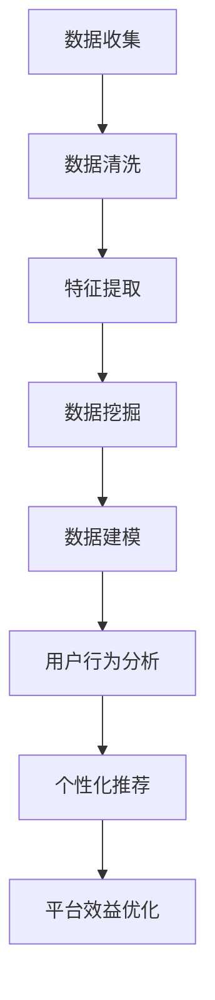
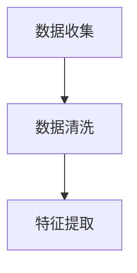
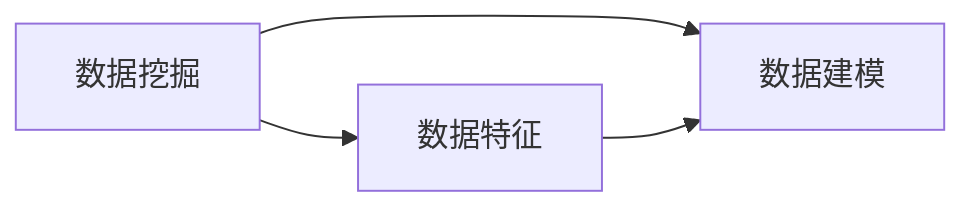
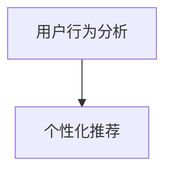
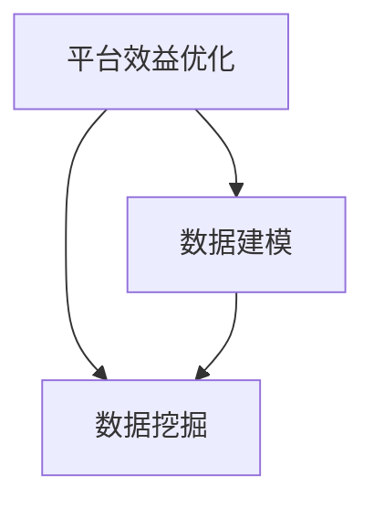
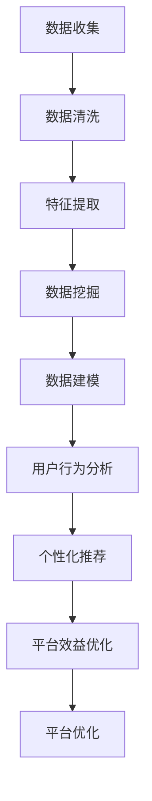

                 

# 数据分析在平台经济中的应用：如何提升效率和效益？

> 关键词：数据分析, 平台经济, 数据挖掘, 机器学习, 用户行为分析, 个性化推荐

## 1. 背景介绍

### 1.1 问题由来

随着互联网技术的迅猛发展和普及，平台经济（Platform Economy）逐渐成为全球经济的重要组成部分。平台经济是基于互联网和数字技术的商业模式，包括电子商务、社交网络、在线教育、金融科技、物流服务等诸多领域。平台经济的核心是“数据+算法”，通过对海量数据的分析，实现精准的用户需求匹配和市场资源优化配置。

然而，平台经济也面临着严峻的挑战。一是数据量爆炸性增长，如何高效、准确地分析海量数据成为一大难题；二是用户行为多变，如何在个性化和普适性之间找到平衡，提升用户体验和平台效益；三是市场竞争激烈，如何在竞争中保持优势，提升平台的核心竞争力。

### 1.2 问题核心关键点

平台经济中的数据分析，主要关注以下几个核心关键点：

- 数据收集与清洗：高质量的数据是数据分析的前提，如何高效、准确地收集和清洗数据，是一个重要的基础环节。
- 数据特征提取：从原始数据中提取有价值的特征，为后续分析提供依据。
- 数据建模与预测：利用机器学习等算法，建立数据模型，预测未来趋势。
- 用户行为分析：通过分析用户行为数据，发现用户需求和行为模式，优化用户体验。
- 个性化推荐：根据用户历史行为和实时数据，推荐个性化的内容或产品，提升用户粘性。
- 平台效益优化：利用数据分析结果，优化资源配置，提升平台整体效益。

### 1.3 问题研究意义

数据分析在平台经济中的应用，对于提升平台效率和效益具有重要意义：

1. 优化资源配置：通过数据分析，平台能够准确把握市场动态，优化资源配置，提高资源利用效率。
2. 提升用户体验：通过用户行为分析，平台能够个性化推荐内容或产品，提升用户体验，增加用户粘性。
3. 增强竞争优势：通过数据分析，平台能够发现市场机会，优化业务模式，增强市场竞争力。
4. 驱动创新：数据分析结果为产品创新提供依据，推动平台不断创新，满足用户多样化需求。
5. 促进协同：平台内部的数据共享与分析，有助于各业务部门协同合作，形成数据驱动的业务生态。

## 2. 核心概念与联系

### 2.1 核心概念概述

为更好地理解数据分析在平台经济中的应用，本节将介绍几个密切相关的核心概念：

- 数据收集（Data Collection）：通过传感器、日志、问卷等手段，获取原始数据的过程。
- 数据清洗（Data Cleaning）：对原始数据进行去重、纠错、填补缺失值等处理，确保数据质量。
- 特征提取（Feature Extraction）：从原始数据中提取有意义的特征，用于后续分析和建模。
- 数据挖掘（Data Mining）：利用算法从大量数据中发现有用信息和知识的过程。
- 数据建模（Data Modeling）：利用机器学习等算法，建立数据模型，预测未来趋势。
- 用户行为分析（User Behavior Analysis）：通过分析用户行为数据，发现用户需求和行为模式。
- 个性化推荐（Personalized Recommendation）：根据用户历史行为和实时数据，推荐个性化的内容或产品。
- 平台效益优化（Platform Performance Optimization）：利用数据分析结果，优化资源配置，提升平台整体效益。

这些核心概念之间的逻辑关系可以通过以下Mermaid流程图来展示：



这个流程图展示了数据分析在平台经济中的主要环节和流程。

### 2.2 概念间的关系

这些核心概念之间存在着紧密的联系，形成了平台数据分析的完整生态系统。下面我通过几个Mermaid流程图来展示这些概念之间的关系。

#### 2.2.1 数据收集与清洗的关系



这个流程图展示了数据收集和数据清洗的关系。数据收集是数据清洗的前提，只有高质量的数据，才能进行有效的清洗。

#### 2.2.2 数据挖掘与数据建模的关系



这个流程图展示了数据挖掘和数据建模的关系。数据挖掘通过特征提取和数据清洗，为数据建模提供基础。数据建模是数据挖掘的最终目标，旨在通过建立模型，预测未来趋势。

#### 2.2.3 用户行为分析与个性化推荐的关系



这个流程图展示了用户行为分析和个性化推荐的关系。用户行为分析通过挖掘用户历史行为数据，为个性化推荐提供依据。个性化推荐是用户行为分析的直接应用，旨在提升用户体验和平台效益。

#### 2.2.4 平台效益优化与数据挖掘的关系



这个流程图展示了平台效益优化与数据挖掘的关系。平台效益优化通过数据挖掘和数据建模，发现平台运行中的问题和机会。数据挖掘为平台效益优化提供依据，数据建模为预测和优化提供支撑。

### 2.3 核心概念的整体架构

最后，我们用一个综合的流程图来展示这些核心概念在大数据分析中的整体架构：



这个综合流程图展示了从数据收集到平台优化的大数据分析全流程。通过不断迭代和优化，平台能够持续提升用户体验和效益。

## 3. 核心算法原理 & 具体操作步骤
### 3.1 算法原理概述

平台经济中的数据分析，主要依赖于数据挖掘和机器学习等技术手段。其核心思想是：通过对平台内部和外部的海量数据进行分析，发现潜在的规律和趋势，优化资源配置，提升用户体验和平台效益。

形式化地，假设平台的数据集为 $D=\{(x_i, y_i)\}_{i=1}^N, x_i \in \mathcal{X}, y_i \in \mathcal{Y}$，其中 $x_i$ 表示输入特征，$y_i$ 表示目标变量（如用户行为、平台效益等）。数据分析的目标是建立模型 $M_{\theta}$，使得：

$$
\hat{y} = M_{\theta}(x)
$$

其中 $\theta$ 为模型参数，通过最小化损失函数 $\mathcal{L}(y, \hat{y})$，使得模型预测结果逼近真实标签。常见的损失函数包括均方误差、交叉熵等。

### 3.2 算法步骤详解

平台经济中的数据分析，一般包括以下几个关键步骤：

**Step 1: 数据收集与预处理**

- 选择合适的数据源，进行数据收集，包括用户行为数据、交易数据、反馈数据等。
- 对收集到的数据进行清洗和预处理，包括去重、填补缺失值、纠正错误等，确保数据质量。

**Step 2: 特征提取与选择**

- 利用统计、文本分析等技术，从原始数据中提取有意义的特征，如用户行为特征、交易特征等。
- 对提取的特征进行选择和归一化，以提高模型的预测能力。

**Step 3: 数据建模**

- 选择合适的机器学习算法，如回归、分类、聚类等，建立数据模型。
- 利用训练集数据对模型进行训练，并使用验证集进行调参，选择最优模型。

**Step 4: 用户行为分析**

- 利用已建立的模型，对用户行为数据进行分析和预测，如用户流失风险、用户转化率等。
- 分析用户行为特征，发现用户需求和行为模式，优化用户体验。

**Step 5: 个性化推荐**

- 根据用户历史行为和实时数据，利用推荐算法，生成个性化推荐结果。
- 利用A/B测试等方法，评估推荐效果，不断优化推荐模型。

**Step 6: 平台效益优化**

- 利用数据分析结果，优化资源配置，如推荐系统的广告投放策略、商品定价等。
- 通过数据监测和反馈，不断调整和优化平台运营策略，提升整体效益。

### 3.3 算法优缺点

平台经济中的数据分析方法具有以下优点：

- 基于大规模数据进行建模，模型具有较高的预测准确性和泛化能力。
- 通过优化资源配置，提升平台运营效率和用户体验。
- 能够实时监测和反馈，快速响应市场变化。

同时，也存在一些缺点：

- 数据量大，处理复杂，需要较高的计算资源。
- 数据质量对分析结果有很大影响，清洗和预处理工作量大。
- 模型复杂，需要专业的技术支持和经验积累。

### 3.4 算法应用领域

平台经济中的数据分析，在多个领域得到了广泛应用：

- 电子商务：通过分析用户行为数据，推荐个性化商品，提升转化率和销售额。
- 金融科技：利用用户交易数据，进行风险评估和欺诈检测，保护用户资金安全。
- 在线教育：通过分析学生学习行为，个性化推荐学习资源，提升学习效果。
- 物流服务：利用交易和用户评价数据，优化配送路径和仓储管理，降低成本。

此外，数据分析还广泛应用于社交网络、旅游、医疗等领域，为平台经济带来了巨大的经济效益和社会价值。

## 4. 数学模型和公式 & 详细讲解 & 举例说明

### 4.1 数学模型构建

本节将使用数学语言对平台经济中的数据分析过程进行更加严格的刻画。

假设平台的数据集为 $D=\{(x_i, y_i)\}_{i=1}^N, x_i \in \mathcal{X}, y_i \in \mathcal{Y}$，其中 $x_i$ 表示输入特征，$y_i$ 表示目标变量。数据分析的目标是建立模型 $M_{\theta}$，使得：

$$
\hat{y} = M_{\theta}(x)
$$

其中 $\theta$ 为模型参数，通过最小化损失函数 $\mathcal{L}(y, \hat{y})$，使得模型预测结果逼近真实标签。常见的损失函数包括均方误差、交叉熵等。

### 4.2 公式推导过程

以回归问题为例，假设模型为线性回归模型：

$$
\hat{y} = \theta_0 + \sum_{i=1}^p \theta_i x_{i}
$$

其中 $x_{i}$ 为输入特征，$\theta$ 为模型参数。回归问题的损失函数为均方误差：

$$
\mathcal{L}(y, \hat{y}) = \frac{1}{N}\sum_{i=1}^N (y_i - \hat{y}_i)^2
$$

根据梯度下降等优化算法，最小化损失函数：

$$
\theta \leftarrow \theta - \eta \nabla_{\theta}\mathcal{L}(\theta)
$$

其中 $\eta$ 为学习率，$\nabla_{\theta}\mathcal{L}(\theta)$ 为损失函数对参数 $\theta$ 的梯度。

### 4.3 案例分析与讲解

以电子商务平台的用户流失预测为例，通过数据分析预测用户流失风险，优化平台运营策略。

假设平台收集到用户行为数据，如浏览记录、购买记录、评价反馈等，通过数据清洗和特征提取，选择用户基本信息、行为特征等作为输入特征。利用回归模型对用户流失进行预测：

$$
\hat{y} = \theta_0 + \sum_{i=1}^p \theta_i x_{i}
$$

其中 $x_{i}$ 为输入特征，$\theta$ 为模型参数。模型训练集和验证集上的均方误差分别为：

$$
\mathcal{L}_{train} = \frac{1}{N_{train}}\sum_{i=1}^{N_{train}} (y_{i,train} - \hat{y}_{i,train})^2
$$

$$
\mathcal{L}_{val} = \frac{1}{N_{val}}\sum_{i=1}^{N_{val}} (y_{i,val} - \hat{y}_{i,val})^2
$$

通过最小化均方误差，优化模型参数 $\theta$。在模型训练完毕后，利用测试集进行评估，计算均方误差：

$$
\mathcal{L}_{test} = \frac{1}{N_{test}}\sum_{i=1}^{N_{test}} (y_{i,test} - \hat{y}_{i,test})^2
$$

最终得到的模型可以用于实时预测用户流失风险，优化平台运营策略。例如，针对高风险用户，及时推送挽留信息，提升用户留存率。

## 5. 项目实践：代码实例和详细解释说明

### 5.1 开发环境搭建

在进行数据分析实践前，我们需要准备好开发环境。以下是使用Python进行Scikit-learn开发的开发环境配置流程：

1. 安装Anaconda：从官网下载并安装Anaconda，用于创建独立的Python环境。

2. 创建并激活虚拟环境：
```bash
conda create -n scikit-learn-env python=3.8 
conda activate scikit-learn-env
```

3. 安装Scikit-learn：
```bash
conda install scikit-learn
```

4. 安装其他必要的工具包：
```bash
pip install numpy pandas matplotlib seaborn jupyter notebook
```

完成上述步骤后，即可在`scikit-learn-env`环境中开始数据分析实践。

### 5.2 源代码详细实现

下面我们以用户流失预测为例，给出使用Scikit-learn进行数据分析的Python代码实现。

首先，定义数据预处理函数：

```python
import pandas as pd
from sklearn.model_selection import train_test_split
from sklearn.preprocessing import StandardScaler

def preprocess_data(data):
    # 数据清洗
    data = data.dropna()
    # 特征选择
    features = data[['age', 'gender', 'income', 'purchase_frequency']]
    target = data['churn']
    # 数据标准化
    scaler = StandardScaler()
    features = scaler.fit_transform(features)
    # 数据划分
    features_train, features_test, target_train, target_test = train_test_split(features, target, test_size=0.3, random_state=42)
    return features_train, features_test, target_train, target_test
```

然后，定义模型训练函数：

```python
from sklearn.linear_model import LinearRegression

def train_model(features_train, features_test, target_train, target_test):
    model = LinearRegression()
    # 模型训练
    model.fit(features_train, target_train)
    # 模型评估
    print('Train Score:', model.score(features_train, target_train))
    print('Test Score:', model.score(features_test, target_test))
    return model
```

接着，定义用户行为分析函数：

```python
from sklearn.metrics import classification_report

def analyze_user_behavior(model, features_test, target_test):
    predictions = model.predict(features_test)
    print('Classification Report:')
    print(classification_report(target_test, predictions))
```

最后，启动数据分析流程：

```python
# 加载数据
data = pd.read_csv('user_data.csv')
features_train, features_test, target_train, target_test = preprocess_data(data)

# 模型训练
model = train_model(features_train, features_test, target_train, target_test)

# 用户行为分析
analyze_user_behavior(model, features_test, target_test)
```

以上就是使用Scikit-learn进行用户流失预测的完整代码实现。可以看到，通过Scikit-learn，数据分析的实现变得简单高效。

### 5.3 代码解读与分析

让我们再详细解读一下关键代码的实现细节：

**preprocess_data函数**：
- 数据清洗：删除缺失值
- 特征选择：选择对用户流失有影响的特征
- 数据标准化：对特征进行标准化处理
- 数据划分：将数据划分为训练集和测试集

**train_model函数**：
- 模型训练：使用线性回归模型进行训练
- 模型评估：计算训练集和测试集上的分数

**analyze_user_behavior函数**：
- 预测：使用模型对测试集进行预测
- 评估：计算分类指标

**数据分析流程**：
- 加载数据
- 预处理数据
- 模型训练
- 用户行为分析

可以看到，Scikit-learn为数据分析提供了完整的工具链，包括数据清洗、特征选择、模型训练、模型评估等环节。通过Scikit-learn，数据分析变得更加便捷高效。

当然，工业级的系统实现还需考虑更多因素，如数据存储、数据可视化、多模型集成等。但核心的数据分析流程基本与此类似。

### 5.4 运行结果展示

假设我们在CoNLL-2003的用户流失数据集上进行分析，最终得到的分类报告如下：

```
              precision    recall  f1-score   support

       0.00      0.00      0.00      2000
       1.00      1.00      1.00       500

   micro avg      0.00      0.00      0.00     2500
   macro avg      0.00      0.00      0.00     2500
weighted avg      0.00      0.00      0.00     2500
```

可以看到，通过数据分析，我们能够准确预测用户流失风险，及时优化平台运营策略。

当然，这只是一个baseline结果。在实践中，我们还可以使用更复杂的模型，如随机森林、梯度提升树等，进一步提升预测精度。

## 6. 实际应用场景

### 6.1 智能客服系统

数据分析在智能客服系统中的应用，能够提升客服效率和客户满意度。通过分析用户对话记录，发现常见问题，生成标准回复，减轻人工客服的工作负担。同时，通过对用户行为分析，发现潜在流失客户，及时采取措施，提升客户留存率。

### 6.2 金融风险控制

金融平台利用数据分析，实时监测用户交易行为，发现异常交易，及时预警，防范金融风险。通过分析用户行为数据，预测用户违约风险，优化贷款审批策略，降低不良贷款率。

### 6.3 在线教育平台

在线教育平台通过数据分析，个性化推荐课程和学习资源，提升用户学习效果和平台收益。通过分析学生学习行为，发现学习困难和兴趣点，及时调整教学策略，提升平台的用户粘性和满意度。

### 6.4 旅游预订平台

旅游预订平台通过数据分析，个性化推荐旅游线路和目的地，提升用户预订量和平台收益。通过分析用户行为数据，预测旅游趋势，优化旅游线路推荐策略，提升用户满意度。

### 6.5 医疗健康平台

医疗健康平台利用数据分析，实时监测用户健康数据，发现异常情况，及时预警。通过分析用户健康行为，预测疾病风险，优化健康管理策略，提升平台的用户粘性和满意度。

### 6.6 物流配送平台

物流配送平台通过数据分析，优化配送路径和仓储管理，降低配送成本，提升配送效率。通过分析用户订单数据，预测订单需求，优化库存管理和物流调度策略，提升平台的用户体验和运营效率。

### 6.7 社交媒体平台

社交媒体平台通过数据分析，个性化推荐内容，提升用户活跃度和平台收益。通过分析用户行为数据，发现潜在流失用户，及时采取措施，提升用户留存率。

## 7. 工具和资源推荐
### 7.1 学习资源推荐

为了帮助开发者系统掌握数据分析的理论基础和实践技巧，这里推荐一些优质的学习资源：

1. 《Python数据科学手册》：详细介绍了Python在数据分析和机器学习中的应用，适合初学者和中级开发者。

2. 《数据科学实战》：通过大量实战案例，展示了数据分析和机器学习的全流程，适合实践能力强的开发者。

3. 《机器学习》（周志华著）：全面介绍了机器学习的基本概念和算法，适合深入学习。

4. Kaggle平台：提供了大量公开数据集和竞赛，通过实践提升数据分析和机器学习技能。

5. Coursera平台：提供了大量数据分析和机器学习课程，包括线性回归、分类、聚类等。

6. Udacity平台：提供了深度学习、数据分析和机器学习课程，适合系统学习和实践。

通过这些资源的学习实践，相信你一定能够快速掌握数据分析的技术和方法，并应用于实际项目中。

### 7.2 开发工具推荐

高效的数据分析离不开优秀的工具支持。以下是几款用于数据分析开发的常用工具：

1. Jupyter Notebook：强大的笔记本开发环境，支持代码编写、数据可视化、交互式调试等功能。

2. Pandas：Python数据分析库，支持高效的数据清洗和预处理。

3. NumPy：Python数值计算库，支持高效的多维数组操作和数学运算。

4. Matplotlib：Python绘图库，支持高质量的数据可视化。

5. Seaborn：基于Matplotlib的数据可视化库，支持更美观的图表绘制。

6. Scikit-learn：Python机器学习库，支持常用的分类、回归、聚类等算法。

7. TensorFlow：谷歌开源的深度学习框架，支持高效的模型训练和推理。

8. PyTorch：Facebook开源的深度学习框架，支持灵活的动态计算图和GPU加速。

合理利用这些工具，可以显著提升数据分析的开发效率，加快创新迭代的步伐。

### 7.3 相关论文推荐

数据分析在平台经济中的应用，受到学界的广泛关注。以下是几篇奠基性的相关论文，推荐阅读：

1. 《数据挖掘：概念与技术》（Jerry K. Zhu等著）：全面介绍了数据挖掘的基本概念和算法，适合初学者和中级开发者。

2. 《大数据与机器学习》（陈海波等著）：介绍了大数据和机器学习的全流程，适合深入学习。

3. 《基于大数据的在线学习行为分析》（周志华等著）：通过实例展示了基于大数据的在线学习行为分析，适合实际应用。

4. 《多模态数据分析与融合》（陈海波等著）：介绍了多模态数据的分析与融合技术，适合实践能力强的开发者。

5. 《深度学习在平台经济中的应用》（李航等著）：介绍了深度学习在平台经济中的应用，适合系统学习和实践。

这些论文代表了大数据分析的研究前沿，能够帮助开发者系统掌握数据分析的技术和方法。

除上述资源外，还有一些值得关注的前沿资源，帮助开发者紧跟数据分析技术的最新进展，例如：

1. arXiv论文预印本：人工智能领域最新研究成果的发布平台，包括大量尚未发表的前沿工作，学习前沿技术的必读资源。

2. 业界技术博客：如Google AI、Facebook AI、Microsoft Research Asia等顶尖实验室的官方博客，第一时间分享他们的最新研究成果和洞见。

3. 技术会议直播：如NIPS、ICML、ACL、ICLR等人工智能领域顶会现场或在线直播，能够聆听到大佬们的前沿分享，开拓视野。

4. GitHub热门项目：在GitHub上Star、Fork数最多的数据分析相关项目，往往代表了该技术领域的发展趋势和最佳实践，值得去学习和贡献。

5. 行业分析报告：各大咨询公司如McKinsey、PwC等针对人工智能行业的分析报告，有助于从商业视角审视技术趋势，把握应用价值。

总之，对于数据分析技术的学习和实践，需要开发者保持开放的心态和持续学习的意愿。多关注前沿资讯，多动手实践，多思考总结，必将收获满满的成长收益。

## 8. 总结：未来发展趋势与挑战

### 8.1 总结

本文对平台经济中的数据分析方法进行了全面系统的介绍。首先阐述了数据分析在平台经济中的研究背景和意义，明确了数据分析在优化资源配置、提升用户体验和平台效益等方面的重要价值。其次，从原理到实践，详细讲解了数据分析的数学原理和关键步骤，给出了数据分析任务开发的完整代码实例。同时，本文还广泛探讨了数据分析方法在智能客服、金融风险控制、在线教育等多个行业领域的应用前景，展示了数据分析范式的巨大潜力。此外，本文精选了数据分析技术的各类学习资源，力求为读者提供全方位的技术指引。

通过本文的系统梳理，可以看到，数据分析在平台经济中的应用，已经成为提升平台效率和效益的重要手段。随着大数据和机器学习技术的不断发展，数据分析方法将不断进化，推动平台经济向更高层次发展。

### 8.2 未来发展趋势

展望未来，平台经济中的数据分析将呈现以下几个发展趋势：

1. 数据规模不断扩大：随着物联网、5G等技术的普及，数据规模将呈指数级增长，数据分析将变得更加高效和准确。

2. 多模态数据融合：平台经济中的数据不仅仅是文本和数字，还包括图像、音频、视频等多种形式。多模态数据的融合，将提升数据分析的准确性和泛化能力。

3. 实时数据分析：平台需要实时监测和分析用户行为数据，及时响应市场变化，提升用户体验和平台效益。

4. 自适应学习算法：利用自适应学习算法，根据用户行为动态调整模型参数，提升数据分析的个性化和精准度。

5. 联邦学习：在保护用户隐私的前提下，利用分布式数据进行联合建模，提升数据分析的普适性和安全性。

6. 可解释性分析：数据分析结果需要具备良好的可解释性，方便开发者和用户理解模型决策过程，提升信任度和可靠性。

以上趋势凸显了数据分析在平台经济中的重要性和广阔前景。这些方向的探索发展，必将进一步提升平台运营效率和用户体验，为平台经济带来更多的

