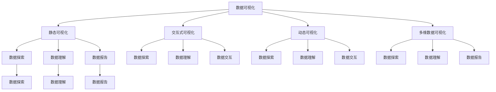
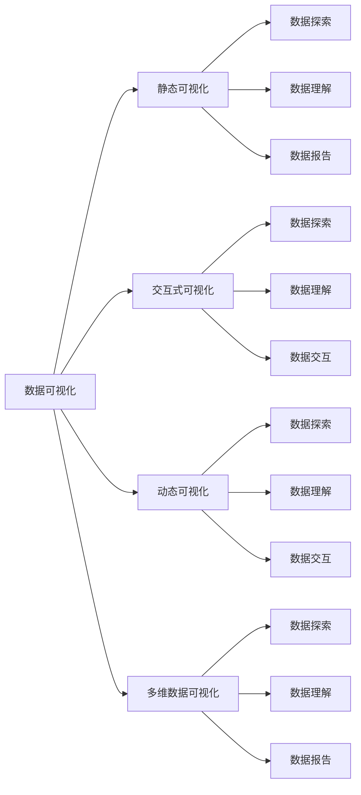
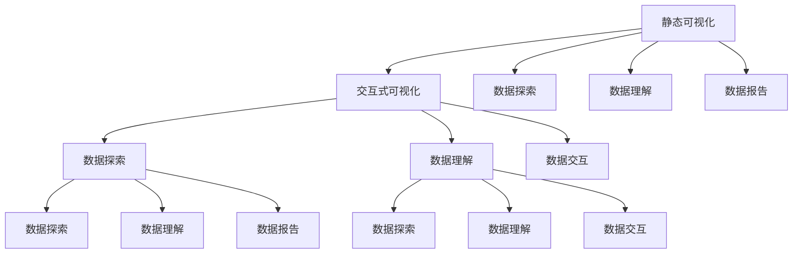
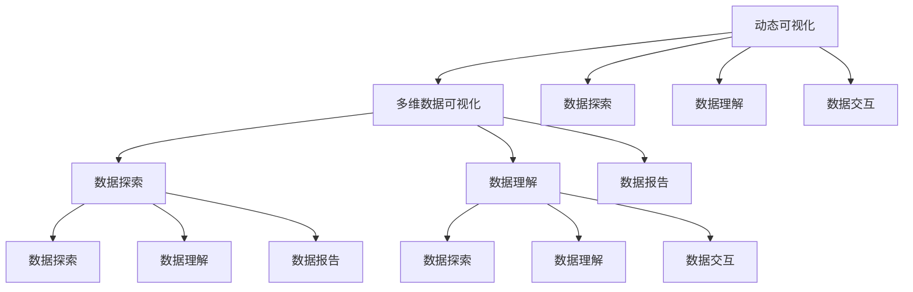
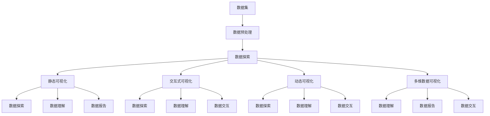

                 

# 数据可视化 原理与代码实例讲解

> 关键词：数据可视化, 数据探索, 交互式可视化, 动态可视化, 数据可视化库

## 1. 背景介绍

### 1.1 问题由来
数据可视化是现代数据分析的重要组成部分，它通过图形、图表、颜色等形式，将复杂的数据集转化为人眼易于理解的形式，使数据分析者可以更快地发现数据中的规律和趋势。数据可视化的应用领域非常广泛，涵盖了科学计算、商业智能、社会科学研究等多个领域。

近年来，随着数据量的不断增长和分析需求的不断增加，数据可视化技术也得到了飞速的发展。从静态图表到动态图表，从单一维度可视化到多维数据可视化，数据可视化技术正变得越来越强大和灵活。在数据探索、数据报表生成、商业决策支持等方面，数据可视化发挥着越来越重要的作用。

### 1.2 问题核心关键点
数据可视化主要分为静态可视化和交互式可视化。静态可视化指的是在单一时点上展示数据，适合于静态数据的展示；交互式可视化则是指通过用户的交互操作，动态展示数据的变化，适合于动态数据的展示。

数据可视化的核心目标是：

1. **数据探索**：通过数据可视化，揭示数据中的规律和趋势，辅助数据分析和决策。
2. **数据理解**：通过图形、颜色等形式，使复杂数据变得易于理解和记忆。
3. **数据报告**：将可视化结果转化为图表、报告，方便展示和传播。
4. **数据交互**：通过用户交互操作，动态展示数据的变化，增强用户体验。

### 1.3 问题研究意义
数据可视化技术在数据探索和分析中具有重要意义，其研究与应用可以带来以下几方面的优势：

1. **提升数据处理效率**：通过可视化手段，可以更快地识别和理解数据中的关键信息，减少数据处理的时间和成本。
2. **增强数据分析深度**：可视化可以揭示数据中的复杂结构和关系，帮助分析者深入理解数据的内涵。
3. **改善数据呈现方式**：通过图形、颜色等形式的可视化展示，可以使数据更加直观和易于理解，提高数据报告的质量和效果。
4. **促进用户参与**：交互式可视化可以增强用户对数据的理解和参与感，提升用户体验和满意度。

## 2. 核心概念与联系

### 2.1 核心概念概述

为更好地理解数据可视化的原理和实现方法，本节将介绍几个密切相关的核心概念：

- **数据可视化**：通过图形、颜色等形式，将数据转化为可视的形式，辅助数据分析和决策。
- **静态可视化**：在单一时点上展示数据，适合于静态数据的展示。
- **交互式可视化**：通过用户的交互操作，动态展示数据的变化，适合于动态数据的展示。
- **动态可视化**：展示数据随时间变化的趋势和规律，增强可视化效果。
- **多维数据可视化**：展示多维数据的关系和结构，揭示数据的内在联系。
- **数据探索**：通过可视化手段，揭示数据中的规律和趋势，辅助数据分析和决策。
- **数据理解**：通过图形、颜色等形式，使复杂数据变得易于理解和记忆。
- **数据报告**：将可视化结果转化为图表、报告，方便展示和传播。
- **数据交互**：通过用户交互操作，动态展示数据的变化，增强用户体验。

这些核心概念之间的逻辑关系可以通过以下Mermaid流程图来展示：



这个流程图展示了大数据可视化的核心概念及其之间的关系：

1. 数据可视化主要通过静态、交互式和动态可视化三种方式进行展示。
2. 静态可视化适合于展示静态数据，主要用于数据探索和数据理解。
3. 交互式可视化适合于展示动态数据，主要用于数据探索和数据交互。
4. 动态可视化展示数据随时间变化的趋势和规律，主要用于数据探索和数据交互。
5. 多维数据可视化展示多维数据的关系和结构，主要用于数据探索和数据报告。

这些核心概念共同构成了数据可视化的基础，使得数据可视化可以应用于各种场景，满足不同用户的需求。

### 2.2 概念间的关系

这些核心概念之间存在着紧密的联系，形成了数据可视化的完整生态系统。下面我通过几个Mermaid流程图来展示这些概念之间的关系。

#### 2.2.1 数据可视化的学习范式



这个流程图展示了大数据可视化的学习范式：

1. 数据可视化主要通过静态、交互式和动态可视化三种方式进行展示。
2. 静态可视化适合于展示静态数据，主要用于数据探索和数据理解。
3. 交互式可视化适合于展示动态数据，主要用于数据探索和数据交互。
4. 动态可视化展示数据随时间变化的趋势和规律，主要用于数据探索和数据交互。
5. 多维数据可视化展示多维数据的关系和结构，主要用于数据探索和数据报告。

#### 2.2.2 静态与交互式可视化的关系



这个流程图展示了静态可视化与交互式可视化之间的关系：

1. 静态可视化主要用于展示静态数据，通过数据探索和数据理解，帮助分析者识别数据中的规律和趋势。
2. 交互式可视化主要用于展示动态数据，通过数据探索和数据交互，增强用户体验和数据理解。

#### 2.2.3 动态与多维数据可视化的关系



这个流程图展示了动态可视化与多维数据可视化之间的关系：

1. 动态可视化主要用于展示数据随时间变化的趋势和规律，通过数据探索和数据交互，揭示数据的内在联系。
2. 多维数据可视化主要用于展示多维数据的关系和结构，通过数据探索和数据报告，帮助分析者理解复杂数据。

### 2.3 核心概念的整体架构

最后，我们用一个综合的流程图来展示这些核心概念在大数据可视化中的整体架构：



这个综合流程图展示了从数据集到数据可视化的完整过程：

1. 首先对数据集进行预处理，生成适合于可视化分析的数据。
2. 然后对数据进行探索，了解数据的基本情况和特征。
3. 接下来分别生成静态可视化、交互式可视化、动态可视化和多维数据可视化，通过数据探索、数据理解和数据交互，揭示数据的规律和趋势。
4. 最后对可视化结果进行报告，帮助分析者理解数据和做出决策。

通过这些流程图，我们可以更清晰地理解数据可视化的核心概念及其关系，为后续深入讨论具体的可视化方法和技术奠定基础。

## 3. 核心算法原理 & 具体操作步骤

### 3.1 算法原理概述

数据可视化主要通过将数据映射到图形、颜色等形式，将数据转化为可视的形式，辅助数据分析和决策。其核心原理包括以下几个方面：

1. **数据映射**：将数据映射到图形、颜色等形式，生成可视化图表。
2. **数据聚合**：将数据进行聚合，减少可视化复杂度。
3. **数据排序**：对数据进行排序，使可视化结果更易于理解。
4. **数据变换**：对数据进行变换，如缩放、旋转、平移等，增强可视化效果。
5. **数据展示**：通过图形、颜色等形式，将数据展示出来，帮助分析者理解数据。

数据可视化的主要流程如下：

1. **数据预处理**：对数据进行清洗、转换和归一化，生成适合于可视化分析的数据。
2. **数据探索**：通过可视化手段，了解数据的基本情况和特征。
3. **数据生成**：根据数据类型和需求，生成静态、交互式、动态和多维数据可视化图表。
4. **数据理解**：通过数据探索和数据交互，揭示数据的内在联系和规律。
5. **数据报告**：将可视化结果转化为图表、报告，帮助分析者理解数据和做出决策。

### 3.2 算法步骤详解

数据可视化的具体步骤包括：

1. **数据收集**：收集需要可视化的数据，通常为电子表格、数据库、API等形式。
2. **数据清洗**：对数据进行清洗、去重、处理缺失值等操作，生成干净的数据集。
3. **数据转换**：将数据进行转换，如将日期数据转换为日期格式，生成适合于可视化分析的数据。
4. **数据聚合**：对数据进行聚合，减少可视化复杂度。
5. **数据排序**：对数据进行排序，使可视化结果更易于理解。
6. **数据变换**：对数据进行变换，如缩放、旋转、平移等，增强可视化效果。
7. **数据展示**：通过图形、颜色等形式，将数据展示出来，帮助分析者理解数据。
8. **数据交互**：通过用户交互操作，动态展示数据的变化，增强用户体验。

以下是一个具体的实现流程：

1. **数据收集**：假设需要展示某公司近一年的销售额数据。

2. **数据清洗**：对销售额数据进行清洗，去除缺失值和异常值，生成干净的数据集。

3. **数据转换**：将日期数据转换为日期格式，生成适合于可视化分析的数据。

4. **数据聚合**：对销售额数据进行聚合，生成月度总销售额数据。

5. **数据排序**：对月度总销售额数据进行排序，生成按时间顺序排列的数据。

6. **数据变换**：对数据进行变换，如将销售额数据进行缩放，增强可视化效果。

7. **数据展示**：通过折线图的形式，将月度总销售额数据展示出来，帮助分析者理解数据。

8. **数据交互**：通过用户交互操作，动态展示销售额随时间变化的趋势和规律，增强用户体验。

### 3.3 算法优缺点

数据可视化具有以下优点：

1. **直观易懂**：通过图形、颜色等形式，使复杂数据变得易于理解和记忆。
2. **辅助分析**：通过可视化手段，揭示数据中的规律和趋势，辅助数据分析和决策。
3. **便于展示**：将可视化结果转化为图表、报告，方便展示和传播。
4. **增强用户参与**：通过用户交互操作，动态展示数据的变化，增强用户体验。

但数据可视化也存在一些缺点：

1. **过度简化**：数据可视化可能会过度简化数据，忽略数据中的细节和复杂性。
2. **误导性**：可视化结果可能被误导，使分析者做出错误的决策。
3. **技术要求高**：数据可视化需要具备一定的技术水平和经验，才能生成高质量的可视化图表。

### 3.4 算法应用领域

数据可视化广泛应用于多个领域，包括但不限于：

1. **商业智能**：通过可视化展示销售数据、财务报表等，辅助企业决策。
2. **科学计算**：通过可视化展示实验数据、模拟结果等，帮助科学家分析数据。
3. **社会科学研究**：通过可视化展示社会调查数据、人口统计数据等，揭示社会现象和趋势。
4. **医学研究**：通过可视化展示患者数据、疾病数据等，辅助医生诊断和治疗。
5. **城市规划**：通过可视化展示城市数据、交通数据等，帮助城市规划者制定合理的规划方案。

## 4. 数学模型和公式 & 详细讲解 & 举例说明

### 4.1 数学模型构建

数据可视化的数学模型主要涉及以下几个方面：

1. **二维坐标系**：将数据映射到二维坐标系上，生成可视化图表。
2. **坐标轴变换**：对坐标轴进行变换，增强可视化效果。
3. **颜色映射**：将数据映射到颜色上，增强可视化效果。
4. **数据聚类**：对数据进行聚类，生成可视化结果。
5. **数据分布**：对数据进行分布展示，帮助分析者理解数据。

以下是一个具体的数学模型：

假设有一组数据集 $D=\{(x_i, y_i)\}_{i=1}^N$，其中 $x_i$ 为自变量，$y_i$ 为因变量。其数学模型如下：

1. **二维坐标系**：将数据集映射到二维坐标系上，生成可视化图表。
   - 横轴为 $x$ 轴，纵轴为 $y$ 轴。
   - 将 $x_i$ 映射到 $x$ 轴上，将 $y_i$ 映射到 $y$ 轴上。
   - 生成可视化图表，如折线图、散点图等。

2. **坐标轴变换**：对坐标轴进行变换，增强可视化效果。
   - 对 $x$ 轴进行缩放变换，增强可视化效果。
   - 对 $y$ 轴进行旋转变换，增强可视化效果。

3. **颜色映射**：将数据映射到颜色上，增强可视化效果。
   - 将 $y_i$ 映射到颜色上，生成彩色条形图等。
   - 将数据聚类，生成不同颜色代表的聚类中心。

4. **数据聚类**：对数据进行聚类，生成可视化结果。
   - 使用 K-means 等聚类算法对数据进行聚类，生成可视化结果。
   - 将聚类结果映射到颜色上，生成可视化图表。

5. **数据分布**：对数据进行分布展示，帮助分析者理解数据。
   - 使用直方图、密度图等方法展示数据分布。
   - 使用箱线图、热力图等方法展示数据分布。

### 4.2 公式推导过程

以下是一个具体的公式推导过程：

假设有一组数据集 $D=\{(x_i, y_i)\}_{i=1}^N$，其中 $x_i$ 为自变量，$y_i$ 为因变量。其数学模型如下：

1. **二维坐标系**：将数据集映射到二维坐标系上，生成可视化图表。
   - 横轴为 $x$ 轴，纵轴为 $y$ 轴。
   - 将 $x_i$ 映射到 $x$ 轴上，将 $y_i$ 映射到 $y$ 轴上。
   - 生成可视化图表，如折线图、散点图等。
   - 公式推导：
     - 生成折线图：
       $$
       y_i = f(x_i) = a_i x_i + b_i
       $$
       其中 $a_i$ 和 $b_i$ 为系数。
     - 生成散点图：
       $$
       (x_i, y_i)
       $$
       其中 $x_i$ 和 $y_i$ 为数据点坐标。

2. **坐标轴变换**：对坐标轴进行变换，增强可视化效果。
   - 对 $x$ 轴进行缩放变换，增强可视化效果。
     - 生成缩放后的 $x$ 轴：
       $$
       x'_i = k x_i
       $$
       其中 $k$ 为缩放因子。
     - 生成缩放后的 $y$ 轴：
       $$
       y'_i = k y_i
       $$
       其中 $k$ 为缩放因子。

3. **颜色映射**：将数据映射到颜色上，增强可视化效果。
   - 将 $y_i$ 映射到颜色上，生成彩色条形图等。
     - 生成彩色条形图：
       $$
       color_i = map(y_i)
       $$
       其中 $map$ 为颜色映射函数。
   - 将数据聚类，生成不同颜色代表的聚类中心。
     - 生成聚类中心图：
       $$
       center_i = kmeans(y_i)
       $$
       其中 $kmeans$ 为聚类算法，$center_i$ 为聚类中心。

4. **数据聚类**：对数据进行聚类，生成可视化结果。
   - 使用 K-means 等聚类算法对数据进行聚类，生成可视化结果。
     - 生成聚类图：
       $$
       (x_i, y_i) \in cluster_j
       $$
       其中 $j$ 为聚类类别。
   - 将聚类结果映射到颜色上，生成可视化图表。
     - 生成聚类颜色图：
       $$
       color_i = cluster_i
       $$
       其中 $cluster_i$ 为聚类结果。

5. **数据分布**：对数据进行分布展示，帮助分析者理解数据。
   - 使用直方图、密度图等方法展示数据分布。
     - 生成直方图：
       $$
       H(x_i)
       $$
       其中 $H$ 为直方图函数。
   - 使用箱线图、热力图等方法展示数据分布。
     - 生成箱线图：
       $$
       boxplot(y_i)
       $$
       其中 $boxplot$ 为箱线图函数。

### 4.3 案例分析与讲解

以一个具体的案例来讲解数据可视化的应用：

假设某公司需要分析近一年的销售额数据，生成一个可视化图表，帮助决策者理解销售额的变化趋势和规律。

1. **数据收集**：收集公司近一年的销售额数据。

2. **数据清洗**：对销售额数据进行清洗，去除缺失值和异常值，生成干净的数据集。

3. **数据转换**：将日期数据转换为日期格式，生成适合于可视化分析的数据。

4. **数据聚合**：对销售额数据进行聚合，生成月度总销售额数据。

5. **数据排序**：对月度总销售额数据进行排序，生成按时间顺序排列的数据。

6. **数据变换**：对数据进行变换，如将销售额数据进行缩放，增强可视化效果。

7. **数据展示**：通过折线图的形式，将月度总销售额数据展示出来，帮助分析者理解数据。

8. **数据交互**：通过用户交互操作，动态展示销售额随时间变化的趋势和规律，增强用户体验。

具体实现步骤如下：

1. **数据收集**：假设销售额数据存储在 Excel 表格中。

2. **数据清洗**：使用 Python 的 Pandas 库对数据进行清洗，去除缺失值和异常值。

3. **数据转换**：使用 Pandas 库将日期数据转换为日期格式。

4. **数据聚合**：使用 Pandas 库对销售额数据进行聚合，生成月度总销售额数据。

5. **数据排序**：使用 Pandas 库对月度总销售额数据进行排序，生成按时间顺序排列的数据。

6. **数据变换**：使用 Pandas 库对数据进行缩放，增强可视化效果。

7. **数据展示**：使用 Matplotlib 库生成折线图，将月度总销售额数据展示出来。

8. **数据交互**：使用 Plotly 库生成交互式折线图，动态展示销售额随时间变化的趋势和规律。

## 5. 项目实践：代码实例和详细解释说明

### 5.1 开发环境搭建

在进行数据可视化实践前，我们需要准备好开发环境。以下是使用Python进行Matplotlib开发的环境配置流程：

1. 安装Anaconda：从官网下载并安装Anaconda，用于创建独立的Python环境。

2. 创建并激活虚拟环境：
```bash
conda create -n pyenv python=3.8 
conda activate pyenv
```

3. 安装Matplotlib：
```bash
pip install matplotlib
```

4. 安装Pandas：
```bash
pip install pandas
```

5. 安装Pandas：
```bash
pip install pandas
```

完成上述步骤后，即可在`pyenv`环境中开始数据可视化实践。

### 5.2 源代码详细实现

这里我们以生成一个销售额可视化图表为例，给出使用Matplotlib进行数据可视化的Python代码实现。

首先，定义数据集：

```python
import pandas as pd

# 读取数据集
df = pd.read_csv('sales_data.csv')

# 清洗数据
df = df.dropna()

# 转换日期格式
df['date'] = pd.to_datetime(df['date'])

# 聚合数据
df = df.groupby('date').agg(sum)

# 排序数据
df = df.sort_index()

# 缩放数据
df['sales'] = df['sales'].div(df['sales'].sum())

# 保存数据
df.to_csv('sales_data_processed.csv')
```

然后，定义可视化函数：

```python
import matplotlib.pyplot as plt

def plot_sales():
    # 读取数据
    df = pd.read_csv('sales_data_processed.csv')

    # 设置图表标题和坐标轴标签
    plt.title('Monthly Sales')
    plt.xlabel('Date')
    plt.ylabel('Sales')

    # 绘制折线图
    plt.plot(df.index, df['sales'], color='red')

    # 添加网格
    plt.grid(True)

    # 显示图表
    plt.show()

# 调用函数
plot_sales()
```

最后，运行代码，生成可视化图表：

```python
# 调用函数生成图表
plot_sales()
```

以上就是使用Matplotlib进行数据可视化的完整代码实现。可以看到，利用Matplotlib库，我们可以很方便地生成各种可视化图表，对数据进行分析。

### 5.3 代码解读与分析

让我们再详细解读一下关键代码的实现细节：

**数据集定义**：
- `import pandas as pd`：导入Pandas库，用于数据处理和分析。
- `df = pd.read_csv('sales_data.csv')`：读取数据集，并将其存储为DataFrame对象。
- `df = df.dropna()`：清洗数据，去除缺失值。
- `df['date'] = pd.to_datetime(df['date'])`：将日期数据转换为日期格式。
- `df = df.groupby('date').agg(sum)`：对数据进行聚合，生成月度总销售额数据。
- `df = df.sort_index()`：对数据进行排序，生成按时间顺序排列的数据。
- `df['sales'] = df['sales'].div(df['sales'].sum())`：对数据进行缩放，增强可视化效果。
- `df.to_csv('sales_data_processed.csv')`：将处理后的数据保存为CSV文件。

**可视化函数定义**：
- `import matplotlib.pyplot as plt`：导入Matplotlib库，用于生成可视化图表。
- `plt.title('Monthly Sales')`：设置图表标题。
- `plt.xlabel('Date')`：设置横轴标签。
- `plt.ylabel('Sales')`：设置纵轴标签。
- `plt.plot(df.index, df['sales'], color='red')`：绘制折线图，展示销售额随时间变化的趋势和规律。
- `plt.grid(True)`：添加网格。
- `plt.show()`：显示图表。

**运行代码**：
- `plot_sales()`：调用函数生成可视化图表。

可以看到，利用Matplotlib库，我们可以很方便地生成各种可视化图表，对数据进行分析。

当然，工业级的系统实现还需考虑更多因素，如图表的自定义、数据的动态更新等。但核心的数据可视化过程基本与此类似。

## 6. 实际应用场景

### 6.1 智能客服系统

智能客服系统可以实时监控客户反馈，生成可视化报告，帮助客服人员及时了解客户需求和问题，提升客户满意度。

在技术实现上，可以收集客户

