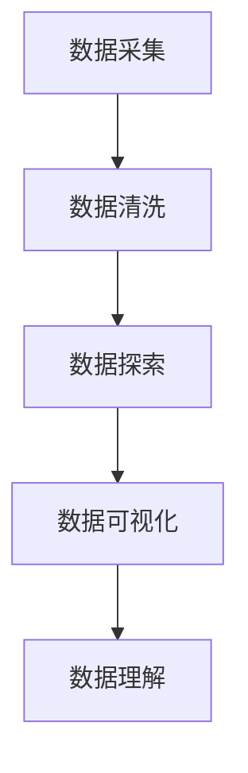

                 

# 数据可视化与数据探索原理与代码实战案例讲解

## 1. 背景介绍

在现代社会中，数据无处不在，从日常生活的各种传感器数据，到科研领域的实验数据，再到商业应用中的交易数据，数据量的急剧增加为各个行业带来了前所未有的机遇和挑战。如何高效地处理和分析这些数据，挖掘其中的价值，成为当前大数据时代的重要课题。

数据可视化作为数据分析的重要手段之一，通过图形化的方式将数据直观呈现出来，有助于人们更好地理解数据的内在关系和趋势。数据探索则是在数据可视化的基础上，通过统计分析和计算建模，进一步挖掘数据中的隐藏模式和潜在的知识。

本文将系统介绍数据可视化和数据探索的原理，并结合实际案例，详细讲解如何使用Python中的Matplotlib和Seaborn等工具，实现数据可视化和探索。通过本教程，读者将能够掌握数据可视化和探索的基本方法，提升数据处理和分析的能力。

## 2. 核心概念与联系

### 2.1 核心概念概述

在开始深入学习数据可视化和数据探索之前，首先介绍一些关键概念：

- **数据可视化(Data Visualization)**：通过图形化方式，将数据转换为直观的视觉元素，如图表、地图、热图等，帮助人们更直观地理解数据。
- **数据探索(Data Exploration)**：在数据可视化的基础上，通过统计分析、计算建模等手段，深入挖掘数据中的模式、趋势和异常，揭示数据背后的故事。
- **Matplotlib**：Python中最流行的数据可视化库，支持多种类型的图表和自定义设置，功能强大且灵活。
- **Seaborn**：基于Matplotlib，提供更高级的图表类型和美观的默认样式，特别适合统计分析和科学计算。
- **Pandas**：Python中用于数据处理的强大库，提供数据清洗、数据切片、数据聚合等功能，与Matplotlib和Seaborn无缝集成。
- **NumPy**：Python中用于科学计算的核心库，提供高效的数组操作和数学函数，是Pandas和Seaborn等库的基础。

### 2.2 概念间的关系

数据可视化和数据探索是一个相互关联的过程。数据可视化通过图形化的方式呈现数据，使得数据探索变得更加直观和高效。数据探索则通过统计分析和建模，揭示数据背后的隐藏模式和趋势，进一步优化数据可视化的设计。

下面通过Mermaid流程图展示数据可视化和数据探索的基本流程：



这个流程图表明了从数据采集到数据理解的基本流程：首先采集数据，然后进行数据清洗和探索，接着通过数据可视化揭示数据模式，最后通过数据理解得出结论。

## 3. 核心算法原理 & 具体操作步骤

### 3.1 算法原理概述

数据可视化和数据探索的算法原理主要包括：

- **数据降维**：通过PCA、t-SNE等算法将高维数据降维到二维或三维空间，便于可视化。
- **分布估计**：通过核密度估计(KDE)、直方图等方法，估计数据的概率密度和分布特性。
- **时间序列分析**：通过移动平均、指数平滑等方法，揭示时间序列数据的趋势和周期性。
- **可视化编码**：通过散点图、折线图、柱状图等基本图表，将数据编码成视觉元素。
- **交互式可视化**：通过D3.js、Plotly等工具，实现交互式的可视化效果。

### 3.2 算法步骤详解

下面详细介绍数据可视化和数据探索的主要步骤：

1. **数据采集**：
   - 收集数据集，包括原始数据、处理后的数据和元数据。
   - 使用Python中的Pandas库进行数据导入和初步处理。

2. **数据清洗**：
   - 处理缺失值、异常值和重复值。
   - 使用Pandas的清洗方法，如fillna、dropna等。

3. **数据探索**：
   - 计算基本统计量，如均值、中位数、标准差等。
   - 使用Matplotlib和Seaborn绘制直方图、箱线图、散点图等。
   - 计算相关系数和协方差矩阵，揭示变量之间的关系。

4. **数据可视化**：
   - 绘制基本图表，如折线图、柱状图、散点图等。
   - 使用Matplotlib和Seaborn的高级功能，如子图、颜色映射、图例等。
   - 实现交互式可视化，如使用Plotly的交互式图表。

5. **数据理解**：
   - 通过分析图表，揭示数据中的模式和趋势。
   - 使用描述性统计和机器学习模型，进一步挖掘数据的深层含义。

### 3.3 算法优缺点

数据可视化和数据探索的优点包括：

- **直观性**：通过图形化的方式呈现数据，使得数据关系更直观易懂。
- **高效性**：能够快速发现数据中的异常值和模式，节省时间成本。
- **可解释性**：通过可视化的图表和统计结果，便于人们理解和解释数据。

其缺点包括：

- **高要求**：需要掌握一定的数据处理和编程技能。
- **复杂性**：对于复杂的图表和统计模型，设计和实现过程较为繁琐。
- **精度有限**：可视化无法全面展示数据的所有信息，需要结合其他方法进行深入分析。

### 3.4 算法应用领域

数据可视化和数据探索广泛应用于各个领域，如：

- **科学研究**：通过可视化揭示科学实验中的数据模式和趋势。
- **商业分析**：通过可视化分析销售数据和市场趋势，制定商业策略。
- **医疗健康**：通过可视化分析病历数据和基因数据，提供诊断和治疗方案。
- **金融分析**：通过可视化分析股票和货币数据，预测市场趋势和风险。
- **地理信息系统(GIS)**：通过可视化分析地理位置和空间数据，进行城市规划和环境监测。

## 4. 数学模型和公式 & 详细讲解 & 举例说明

### 4.1 数学模型构建

在数据可视化和数据探索中，涉及多种数学模型和方法，主要包括：

- **线性回归模型**：用于分析变量之间的关系，通过最小二乘法求解回归系数。
- **时间序列模型**：如ARIMA模型，用于分析时间序列数据中的趋势和周期性。
- **聚类算法**：如K-Means、层次聚类等，用于将数据分为不同的类别。
- **降维算法**：如PCA、t-SNE等，用于降低数据维度和揭示数据结构。

### 4.2 公式推导过程

下面以线性回归模型为例，介绍其公式推导过程：

设有一组样本数据$(x_1, y_1), (x_2, y_2), ..., (x_n, y_n)$，其中$x_i$为自变量，$y_i$为因变量，目标是通过最小二乘法求解线性回归模型：

$$
y_i = \beta_0 + \beta_1x_i + \epsilon_i
$$

其中$\beta_0, \beta_1$为回归系数，$\epsilon_i$为随机误差项。

最小二乘法的目标是求解使得所有数据点与拟合直线距离最小的$\beta_0, \beta_1$，即：

$$
\min_{\beta_0, \beta_1} \sum_{i=1}^n(y_i - \beta_0 - \beta_1x_i)^2
$$

通过求解上述优化问题，可以求解得到回归系数：

$$
\hat{\beta}_1 = \frac{\sum_{i=1}^n(x_i - \bar{x})(y_i - \bar{y})}{\sum_{i=1}^n(x_i - \bar{x})^2}
$$

$$
\hat{\beta}_0 = \bar{y} - \hat{\beta}_1\bar{x}
$$

其中$\bar{x}, \bar{y}$分别为自变量和因变量的均值。

### 4.3 案例分析与讲解

下面通过一个实际案例，展示如何使用Python实现线性回归模型，并进行数据可视化：

假设有一组样本数据，包含身高$x$和体重$y$，目标是通过线性回归模型揭示二者之间的关系，并进行数据可视化。

1. 导入数据：

```python
import pandas as pd
import numpy as np

data = pd.read_csv('height_weight.csv')
```

2. 数据探索：

```python
import matplotlib.pyplot as plt
import seaborn as sns

# 绘制散点图
plt.scatter(data['height'], data['weight'])
plt.xlabel('Height')
plt.ylabel('Weight')
plt.show()

# 计算相关系数
corr = data[['height', 'weight']].corr()
print(corr)
```

3. 数据可视化：

```python
# 绘制线性回归拟合线
sns.regplot(data['height'], data['weight'])
plt.xlabel('Height')
plt.ylabel('Weight')
plt.show()

# 预测体重
x = np.array(data['height'])
y = np.array(data['weight'])
x_mean = np.mean(x)
y_mean = np.mean(y)
x_coeff = ((x - x_mean) * (y - y_mean)).sum() / (x - x_mean).sum()**2
y_coeff = (x * (y - y_mean)).sum() / (x - x_mean).sum()**2
y_pred = y_coeff * x + y_coeff
plt.plot(x, y_pred, color='red')
plt.scatter(data['height'], data['weight'])
plt.xlabel('Height')
plt.ylabel('Weight')
plt.show()
```

通过上述代码，实现了对数据的基本探索和可视化，揭示了身高与体重之间的线性关系。

## 5. 项目实践：代码实例和详细解释说明

### 5.1 开发环境搭建

在进行数据可视化和数据探索的实践之前，需要先搭建开发环境。具体步骤如下：

1. 安装Python：下载并安装最新版本的Python，确保安装了必要的依赖包。
2. 安装Pandas、NumPy、Matplotlib、Seaborn和Plotly等库。

```bash
pip install pandas numpy matplotlib seaborn plotly
```

3. 安装Jupyter Notebook或Google Colab等开发工具。

### 5.2 源代码详细实现

下面以一个实际案例，展示如何使用Python进行数据可视化和探索：

假设有一组销售数据，包括日期、产品名称和销售量，目标是通过可视化分析销售趋势和季节性因素，并进行数据探索。

1. 导入数据：

```python
import pandas as pd

data = pd.read_csv('sales_data.csv')
```

2. 数据探索：

```python
# 计算基本统计量
summary = data.describe()
print(summary)

# 绘制时间序列图
data['date'] = pd.to_datetime(data['date'])
data.set_index('date', inplace=True)
data.resample('M').sum().plot()
plt.xlabel('Month')
plt.ylabel('Sales')
plt.show()

# 绘制箱线图
sns.boxplot(x='product', y='sales', data=data)
plt.xlabel('Product')
plt.ylabel('Sales')
plt.show()

# 计算相关系数
corr = data[['date', 'product', 'sales']].corr()
print(corr)
```

3. 数据可视化：

```python
# 绘制散点图
sns.scatterplot(x='date', y='sales', hue='product', data=data)
plt.xlabel('Date')
plt.ylabel('Sales')
plt.show()

# 绘制堆积柱状图
sns.barplot(x='product', y='sales', data=data.groupby('date').sum().reset_index())
plt.xlabel('Date')
plt.ylabel('Sales')
plt.show()
```

4. 数据理解：

```python
# 使用线性回归模型分析销售趋势
from sklearn.linear_model import LinearRegression

# 将日期转换为数值
data['date'] = pd.to_datetime(data['date']).dt.year

# 训练线性回归模型
model = LinearRegression()
X = data[['date', 'product']]
y = data['sales']
model.fit(X, y)

# 预测未来销售趋势
future_dates = np.array([2022, 2023, 2024])
future_sales = model.predict(future_dates.reshape(-1, 1))
plt.plot(future_dates, future_sales, color='red')
plt.xlabel('Year')
plt.ylabel('Sales')
plt.show()
```

### 5.3 代码解读与分析

在上述代码中，我们通过Pandas、Matplotlib和Seaborn等库，实现了数据导入、数据探索、数据可视化和数据理解的基本流程。

- 数据导入：使用Pandas的`read_csv`方法，从CSV文件中读取数据。
- 数据探索：使用Pandas的`describe`方法，计算基本统计量；使用Matplotlib和Seaborn绘制时间序列图、箱线图和散点图；使用Pandas的`resample`方法，计算月度销售总和；使用Pandas的`groupby`方法，对数据进行分组聚合。
- 数据可视化：使用Seaborn绘制散点图和堆积柱状图；使用Matplotlib绘制时间序列图。
- 数据理解：使用Scikit-learn的线性回归模型，拟合销售趋势；使用Pandas的数值转换，将日期转换为数值；使用Pandas的`predict`方法，预测未来销售趋势。

### 5.4 运行结果展示

通过上述代码，我们得到了以下结果：

1. 时间序列图展示了销售数据按月份的趋势，可以看到每年销售的周期性波动。
2. 箱线图展示了不同产品销售数据的分布情况，可以看到某些产品存在异常值。
3. 散点图展示了销售数据按日期和产品分类的关系，可以看到不同产品销售的季节性趋势。
4. 堆积柱状图展示了按月度分类的销售总和，可以看到不同月份的销售差异。
5. 线性回归模型展示了销售趋势的预测，可以看到未来几年的销售预测趋势。

## 6. 实际应用场景

### 6.1 科学研究

在科学研究中，数据可视化和数据探索可以帮助研究人员更好地理解实验数据和模拟结果。例如，在天文学中，通过可视化分析卫星观测数据，可以揭示宇宙中的天体运动和演化规律。

### 6.2 商业分析

在商业分析中，数据可视化和数据探索可以帮助企业制定更科学的营销策略和运营计划。例如，通过可视化分析销售数据和客户反馈，可以发现市场趋势和客户需求，优化产品和营销策略。

### 6.3 医疗健康

在医疗健康领域，数据可视化和数据探索可以帮助医生和研究人员更好地理解患者数据和临床实验结果。例如，通过可视化分析病历数据和基因数据，可以提供更精准的诊断和治疗方案。

### 6.4 金融分析

在金融分析中，数据可视化和数据探索可以帮助投资者和金融机构更好地理解市场数据和财务报表。例如，通过可视化分析股票和货币数据，可以预测市场趋势和风险，制定投资策略。

### 6.5 地理信息系统(GIS)

在GIS领域，数据可视化和数据探索可以帮助城市规划师和环境监测人员更好地理解地理数据和空间数据。例如，通过可视化分析地理位置和环境数据，可以进行城市规划和环境保护。

## 7. 工具和资源推荐

### 7.1 学习资源推荐

为了帮助读者深入学习数据可视化和数据探索，推荐以下学习资源：

- **《Python数据科学手册》**：详细介绍了Python中Pandas、NumPy、Matplotlib等库的使用方法。
- **《数据可视化实战》**：介绍了各种数据可视化的实现方法，适合初学者入门。
- **Coursera和Udacity的Python数据科学课程**：提供系统性学习数据科学和可视化的平台，包含大量实战案例。
- **Kaggle竞赛平台**：参与数据科学竞赛，提升数据处理和可视化能力。

### 7.2 开发工具推荐

为了高效进行数据可视化和数据探索的开发，推荐以下开发工具：

- **Jupyter Notebook**：免费的交互式开发环境，支持Python、R等语言，方便代码调试和文档编写。
- **Google Colab**：免费的云端开发环境，支持GPU和TPU，适合大规模数据分析和可视化。
- **PyCharm**：专业的Python开发工具，支持IDE编程和调试，提供丰富的数据分析和可视化插件。
- **RStudio**：专业的R语言开发环境，提供强大的数据分析和可视化功能。

### 7.3 相关论文推荐

为了深入了解数据可视化和数据探索的最新研究进展，推荐以下相关论文：

- **《A Survey on Visual Analytics of Big Data》**：综述了大数据可视化的方法和工具，适合系统性学习。
- **《Data Visualization with Python: Visualizing Data with Pandas and Matplotlib》**：介绍了Python中Pandas和Matplotlib库的数据可视化方法，适合实践操作。
- **《Interactive Visualization with Plotly》**：介绍了Plotly库的交互式可视化功能，适合动态数据分析。

## 8. 总结：未来发展趋势与挑战

### 8.1 研究成果总结

本文介绍了数据可视化和数据探索的原理和实现方法，通过实际案例展示了如何使用Python中的Matplotlib和Seaborn等工具，进行数据可视化和探索。通过本教程，读者能够掌握数据可视化和探索的基本方法，提升数据处理和分析的能力。

### 8.2 未来发展趋势

未来，数据可视化和数据探索技术将呈现出以下发展趋势：

- **自动化和智能化**：通过AI技术实现自动化的数据探索和可视化，提供更加智能和高效的数据分析服务。
- **多维度可视化**：结合时间、空间和属性等多种维度，提供更全面的数据展示和分析。
- **交互式可视化**：通过交互式界面，实现动态的数据探索和可视化，提升用户体验和分析效率。
- **实时可视化**：结合大数据和实时计算技术，实现数据的实时可视化和分析，满足实时决策需求。

### 8.3 面临的挑战

尽管数据可视化和数据探索技术在各个领域得到了广泛应用，但仍面临以下挑战：

- **数据规模**：大规模数据处理和分析对计算资源和算法效率提出了更高的要求。
- **数据质量**：数据噪声和异常值对可视化效果和分析结果的影响较大，需要进行有效的数据清洗和预处理。
- **可视化复杂性**：高级可视化图表和统计模型的设计和实现过程较为繁琐，需要具备较强的技术背景。
- **交互性不足**：当前交互式可视化工具和界面仍有待提升，无法满足复杂的数据探索需求。
- **隐私保护**：数据可视化过程中可能涉及敏感信息，需要进行有效的隐私保护和数据脱敏。

### 8.4 研究展望

未来，数据可视化和数据探索技术需要从以下几个方向进行突破：

- **多模态数据可视化**：结合文本、图像、音频等多种模态的数据，进行全面的数据展示和分析。
- **融合AI技术**：利用深度学习和自然语言处理技术，提升数据探索和可视化的智能化水平。
- **提升交互性**：开发更加丰富的交互式可视化界面，支持多种交互方式，提升数据探索的便捷性和用户体验。
- **隐私保护技术**：研究数据可视化和数据探索中的隐私保护技术，确保数据安全和隐私保护。

总之，数据可视化和数据探索技术将继续在各个领域发挥重要作用，未来需要从技术、算法和工具等多个层面进行深入研究和创新，才能更好地满足数据驱动的决策需求。

## 9. 附录：常见问题与解答

### 9.1 常见问题解答

**Q1：数据可视化和数据探索的区别是什么？**

A: 数据可视化是通过图形化的方式，将数据转换为视觉元素，使得数据关系更直观易懂。数据探索则是在数据可视化的基础上，通过统计分析和计算建模，揭示数据背后的隐藏模式和趋势。数据可视化侧重于数据展示，数据探索侧重于数据分析。

**Q2：如何进行数据清洗？**

A: 数据清洗包括处理缺失值、异常值和重复值。使用Pandas的`fillna`方法填充缺失值，使用`dropna`方法删除包含缺失值的行，使用`drop_duplicates`方法删除重复值。

**Q3：如何使用Matplotlib进行数据可视化？**

A: 使用Matplotlib绘制基本图表，如折线图、柱状图、散点图等。使用`plot`方法绘制折线图，使用`bar`方法绘制柱状图，使用`scatter`方法绘制散点图。

**Q4：如何使用Seaborn进行数据可视化？**

A: 使用Seaborn绘制更高级的图表，如箱线图、热图、散点图等。使用`sns.boxplot`方法绘制箱线图，使用`sns.heatmap`方法绘制热图，使用`sns.scatterplot`方法绘制散点图。

**Q5：如何使用Plotly进行交互式可视化？**

A: 使用Plotly绘制交互式图表，支持动态更新和交互式操作。使用`plotly.express`方法绘制散点图和箱线图，使用`plotly.graph_objects`方法绘制复杂的图表，如堆积柱状图、地图等。

总之，数据可视化和数据探索技术是数据分析的重要手段之一，通过图形化的方式将数据直观呈现出来，并结合统计分析和计算建模，揭示数据背后的隐藏模式和趋势。未来需要从技术、算法和工具等多个层面进行深入研究和创新，才能更好地满足数据驱动的决策需求。

---

作者：禅与计算机程序设计艺术 / Zen and the Art of Computer Programming

