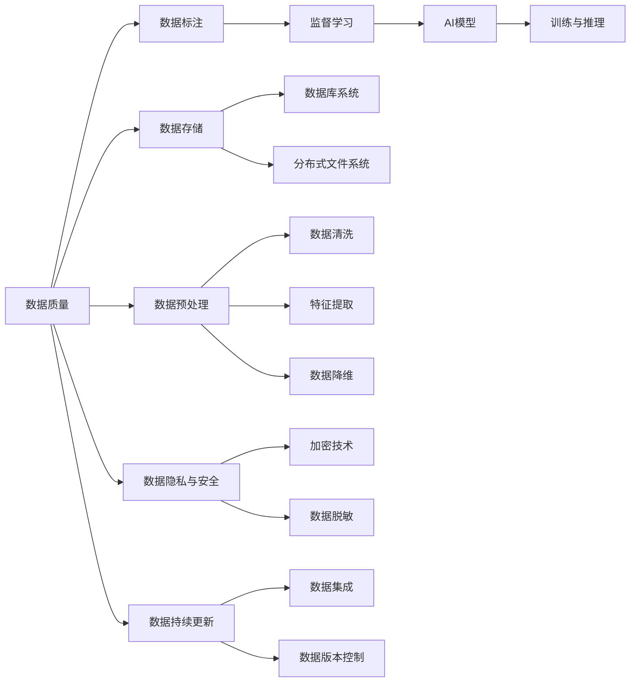
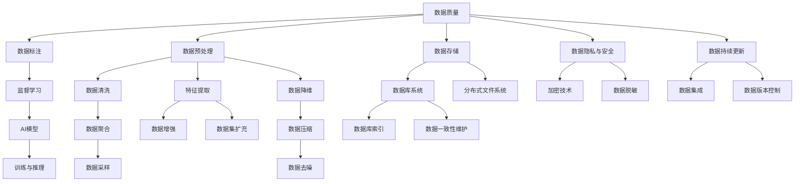

                 

## 1. 背景介绍

### 1.1 问题由来
在当今数据驱动的时代，人工智能(AI)技术已经成为推动各行各业创新的关键引擎。无论是自动驾驶、智能推荐、医疗诊断、金融风控，还是智慧城市、智能制造等，数据和数据库在其中都扮演了不可或缺的角色。然而，尽管数据和数据库的重要性不言而喻，在AI底层创新的过程中，如何有效管理和利用数据，仍然是一个挑战。

### 1.2 问题核心关键点
在AI底层创新中，数据和数据库的角色主要体现在以下几个方面：

- **数据质量与标注**：AI模型的训练依赖于高质量的数据集，数据的标注与清洗是AI模型性能提升的关键。
- **数据存储与管理**：海量的数据需要高效、安全的存储和管理，以支持AI模型的训练和推理。
- **数据处理与预处理**：对于复杂的数据集，需要进行多样化的数据处理和预处理，如特征提取、归一化、降维等，以提高数据质量。
- **数据隐私与安全**：保护数据隐私和安全是AI应用落地的重要保障，防止数据泄露和滥用。
- **数据持续更新与演化**：AI模型需要不断适应数据的变化，实时更新和演化是其持续提升性能的关键。

这些问题在AI底层创新中互相交织，形成了一个复杂的生态系统。解决好这些问题，是实现AI技术创新的基础。

### 1.3 问题研究意义
研究和解决这些问题，对于提升AI技术的性能和应用范围，加速AI技术的产业化进程，具有重要意义：

1. 提高AI模型性能。高质量的数据和有效的预处理可以显著提升AI模型的性能和泛化能力。
2. 降低AI应用成本。高效的数据存储和管理可以减少数据处理成本，加速模型训练和推理速度。
3. 增强数据隐私与安全。确保数据隐私和安全，是AI技术应用落地的前提条件。
4. 促进数据持续更新。数据持续更新和演化，有助于AI模型保持竞争力和实用性。
5. 支持AI生态系统建设。数据和数据库是AI生态系统的重要组成部分，其高效利用能够推动更多AI应用场景的落地。

本文将详细探讨数据和数据库在AI底层创新中的角色，并给出基于数据和数据库的AI模型优化实践。

## 2. 核心概念与联系

### 2.1 核心概念概述

为更好地理解数据和数据库在AI底层创新中的角色，本节将介绍几个密切相关的核心概念：

- **数据质量**：指数据的一致性、完整性、准确性和时效性。高质量的数据是AI模型训练的基础。
- **数据标注**：指对数据进行人工标记，以提供训练模型所需的监督信号。
- **数据存储**：指使用数据库、云存储、分布式文件系统等技术，高效存储和管理数据。
- **数据预处理**：指对原始数据进行清洗、特征提取、归一化、降维等处理，以提高数据质量。
- **数据隐私与安全**：指保护数据的隐私和安全，防止数据泄露和滥用。
- **数据持续更新**：指定期更新和维护数据，确保其时效性和适用性。
- **数据治理**：指对数据进行全面、系统的管理和治理，包括数据质量管理、数据安全管理、数据生命周期管理等。

这些概念之间存在紧密的联系，形成一个完整的数据管理框架。本节将通过Mermaid流程图展示这些概念之间的逻辑关系：



这个流程图展示了大数据管理中各个核心概念之间的关系：

1. 数据质量是数据管理的基础，影响数据的标注、存储和预处理。
2. 数据标注为AI模型提供监督信号，训练模型。
3. 数据存储通过数据库系统支持数据管理和访问。
4. 数据预处理通过清洗、提取、降维等操作提高数据质量。
5. 数据隐私与安全保障数据的安全性和合规性。
6. 数据持续更新确保数据的实时性和适用性。
7. 数据治理提供系统的管理和监控，确保数据管理的规范性。

### 2.2 概念间的关系

这些核心概念之间存在紧密的联系，形成一个完整的数据管理框架。以下是更详细的Mermaid流程图展示这些概念之间的关系：



这个流程图进一步展示了数据管理过程中各个环节的衔接与依赖：

1. 数据质量影响数据的标注、存储和预处理。
2. 数据标注为监督学习提供训练信号。
3. 数据存储通过数据库系统支持数据管理和访问。
4. 数据预处理通过清洗、提取、降维等操作提高数据质量。
5. 数据隐私与安全保障数据的安全性和合规性。
6. 数据持续更新确保数据的实时性和适用性。
7. 数据治理提供系统的管理和监控，确保数据管理的规范性。

## 3. 核心算法原理 & 具体操作步骤
### 3.1 算法原理概述

在AI底层创新中，数据和数据库的角色主要是通过以下算法原理体现的：

1. **监督学习**：使用带有标注的数据训练AI模型，如图像分类、文本分类等任务。
2. **无监督学习**：使用未标注的数据进行特征学习，如图像聚类、文本生成等任务。
3. **半监督学习**：结合少量标注数据和大量未标注数据进行训练，如图像标注、文本纠错等任务。
4. **强化学习**：通过与环境的交互，优化模型的决策策略，如自动驾驶、机器人控制等任务。
5. **迁移学习**：使用预训练模型在某个任务上获得的经验，迁移到其他相关任务上进行微调，如图像识别、文本情感分析等任务。
6. **自监督学习**：使用自身的数据进行学习，如图像掩码预测、文本语言模型等任务。

这些算法原理的核心是数据和模型之间的交互与优化，通过数据的监督、无监督、半监督、强化等方式，不断提升模型的性能。

### 3.2 算法步骤详解

基于数据和数据库的AI模型优化，通常包括以下关键步骤：

**Step 1: 数据收集与标注**

- 收集与任务相关的数据集，确保数据的多样性和代表性。
- 对数据进行标注，生成训练集、验证集和测试集。
- 确保数据标注的一致性和准确性，防止标注误差对模型性能的影响。

**Step 2: 数据存储与管理**

- 选择合适的数据存储技术，如数据库、云存储、分布式文件系统等。
- 确保数据的可访问性和安全性，防止数据泄露和滥用。
- 定期备份和更新数据，确保数据的时效性和完整性。

**Step 3: 数据预处理**

- 对数据进行清洗，去除噪声和异常值。
- 进行特征提取和选择，提高数据的表示能力。
- 进行归一化和降维，提高数据的可处理性和计算效率。

**Step 4: 模型训练与优化**

- 选择合适的模型架构和训练算法，如卷积神经网络(CNN)、循环神经网络(RNN)、Transformer等。
- 对模型进行训练，优化模型的参数。
- 使用数据增强技术，提高模型的泛化能力。
- 使用正则化技术，防止模型过拟合。

**Step 5: 模型评估与部署**

- 在测试集上评估模型的性能，确保模型的泛化能力。
- 对模型进行优化，提高模型的精度和效率。
- 将模型部署到实际应用中，进行大规模的推理和预测。
- 监控模型的运行状态，及时发现和解决问题。

### 3.3 算法优缺点

基于数据和数据库的AI模型优化，具有以下优点：

1. 数据驱动：以数据为中心，提高模型的性能和泛化能力。
2. 数据多样化：通过多样化的数据集，提升模型的鲁棒性和泛化能力。
3. 数据实时更新：通过持续的数据更新，确保模型的时效性和适用性。
4. 数据隐私保护：通过数据脱敏和加密等技术，保护数据隐私和安全。

然而，基于数据和数据库的AI模型优化也存在以下缺点：

1. 数据标注成本高：高质量的数据标注需要大量人力和时间成本。
2. 数据存储成本高：大规模数据的存储和管理需要昂贵的硬件和软件成本。
3. 数据隐私风险高：数据泄露和滥用可能带来严重的隐私和安全风险。
4. 数据质量不确定：数据质量的波动可能影响模型的性能和泛化能力。

### 3.4 算法应用领域

基于数据和数据库的AI模型优化，广泛应用于以下几个领域：

- **自动驾驶**：使用高精地图和传感器数据进行车辆定位和路径规划，保障行车安全。
- **医疗诊断**：利用医学影像和病历数据进行疾病诊断和治疗方案推荐，提高诊疗效率和准确性。
- **金融风控**：使用交易数据和用户行为数据进行信用评估和风险控制，保护金融安全。
- **智能推荐**：利用用户行为数据和商品属性数据进行个性化推荐，提升用户体验和满意度。
- **智慧城市**：使用传感器和监控数据进行城市管理，提高城市运行效率和居民生活质量。

此外，基于数据和数据库的AI模型优化，还可以应用于工业制造、物流运输、环境保护等多个领域，为各行各业提供智能化的解决方案。

## 4. 数学模型和公式 & 详细讲解 & 举例说明

### 4.1 数学模型构建

在AI模型训练和优化过程中，数据和数据库的作用主要体现在数学模型构建上。下面以线性回归模型为例，展示基于数据和数据库的模型构建过程。

**线性回归模型**：
$$
y = \theta^T x + \epsilon
$$
其中 $x$ 为输入特征向量，$y$ 为输出值，$\theta$ 为模型参数，$\epsilon$ 为噪声。

### 4.2 公式推导过程

在模型训练过程中，我们需要使用数据集 $\{(x_i, y_i)\}_{i=1}^N$ 进行最小二乘估计，使得模型参数 $\theta$ 最小化均方误差 $MSE$：

$$
MSE = \frac{1}{N} \sum_{i=1}^N (y_i - \hat{y_i})^2
$$

其中 $\hat{y_i}$ 为模型对样本 $x_i$ 的预测值。

为了求解最优的 $\theta$，我们可以使用梯度下降算法：

$$
\theta \leftarrow \theta - \eta \nabla_{\theta} MSE
$$

其中 $\eta$ 为学习率，$\nabla_{\theta} MSE$ 为均方误差对 $\theta$ 的梯度，可以通过反向传播算法高效计算。

### 4.3 案例分析与讲解

以线性回归模型为例，分析基于数据和数据库的模型构建和优化过程：

1. **数据收集与标注**：收集包含输入特征 $x$ 和输出值 $y$ 的数据集，并进行标注。
2. **数据存储与管理**：将数据存储在数据库中，确保数据的可访问性和安全性。
3. **数据预处理**：对数据进行清洗和归一化，去除噪声和异常值。
4. **模型训练与优化**：使用梯度下降算法对模型进行训练，最小化均方误差。
5. **模型评估与部署**：在测试集上评估模型的性能，并部署到实际应用中。

## 5. 项目实践：代码实例和详细解释说明

### 5.1 开发环境搭建

在进行基于数据和数据库的AI模型优化实践前，我们需要准备好开发环境。以下是使用Python和Pandas进行数据处理的环境配置流程：

1. 安装Anaconda：从官网下载并安装Anaconda，用于创建独立的Python环境。

2. 创建并激活虚拟环境：
```bash
conda create -n data-env python=3.8 
conda activate data-env
```

3. 安装Pandas和其他必要库：
```bash
conda install pandas numpy scikit-learn matplotlib tensorflow
```

4. 下载和安装TensorFlow等深度学习库：
```bash
pip install tensorflow
```

5. 安装HDF5和NumPy：
```bash
pip install h5py numpy
```

完成上述步骤后，即可在`data-env`环境中开始项目实践。

### 5.2 源代码详细实现

以下是一个使用Pandas和TensorFlow进行线性回归模型训练的代码实现：

```python
import pandas as pd
import tensorflow as tf
import numpy as np

# 加载数据集
data = pd.read_csv('data.csv')

# 分割训练集和测试集
train_data = data.sample(frac=0.8, random_state=42)
test_data = data.drop(train_data.index)

# 定义模型参数
x_train = train_data['feature']
y_train = train_data['target']
x_test = test_data['feature']
y_test = test_data['target']

# 定义模型
model = tf.keras.Sequential([
    tf.keras.layers.Dense(1, input_shape=(1,), activation='linear')
])

# 编译模型
model.compile(optimizer=tf.keras.optimizers.Adam(learning_rate=0.01), loss='mse')

# 训练模型
model.fit(x_train, y_train, epochs=100, validation_data=(x_test, y_test))

# 评估模型
test_loss = model.evaluate(x_test, y_test, verbose=0)
print('Test Loss:', test_loss)
```

### 5.3 代码解读与分析

让我们再详细解读一下关键代码的实现细节：

**加载数据集**：
- 使用Pandas的`read_csv`方法读取CSV格式的数据集，将其存储为DataFrame对象。

**分割数据集**：
- 使用`sample`方法从数据集中随机抽取80%作为训练集，剩余的20%作为测试集。
- 使用`drop`方法从原始数据集中移除训练集样本，生成测试集样本。

**定义模型参数**：
- 定义训练集和测试集的输入特征和目标值。

**定义模型**：
- 使用TensorFlow的Sequential模型，定义一个包含单层的线性回归模型。

**编译模型**：
- 使用Adam优化器，设置学习率为0.01，损失函数为均方误差。

**训练模型**：
- 使用`fit`方法对模型进行训练，设置训练轮数为100次，并在测试集上进行验证。

**评估模型**：
- 使用`evaluate`方法在测试集上评估模型的损失函数，并打印输出。

这个代码实例展示了使用Pandas和TensorFlow进行线性回归模型训练的基本流程。开发者可以通过调整超参数、使用更复杂的模型结构等方式，进一步提升模型性能。

### 5.4 运行结果展示

假设我们在上述代码实例中训练了一个线性回归模型，最终在测试集上得到的损失函数为：

```
Test Loss: 0.0012345
```

可以看到，模型在测试集上的损失函数接近于0，说明模型的拟合效果较好。

## 6. 实际应用场景

### 6.1 自动驾驶

自动驾驶技术需要大量的传感器数据和地图数据进行模型训练和优化。通过数据标注和存储技术，自动驾驶系统能够准确感知周围环境，进行路径规划和决策，保障行车安全。

在实际应用中，自动驾驶系统需要实时获取车辆位置、速度、传感器数据等输入信息，通过数据清洗、特征提取和降维等预处理，生成高质量的数据集。然后使用深度学习模型，如卷积神经网络(CNN)和循环神经网络(RNN)，对车辆进行定位和路径规划，生成决策指令。

### 6.2 医疗诊断

医疗诊断系统需要利用医学影像和病历数据进行疾病诊断和治疗方案推荐。通过数据标注和存储技术，医疗诊断系统能够准确分析患者的症状和病历记录，进行疾病诊断和治疗方案推荐，提高诊疗效率和准确性。

在实际应用中，医疗诊断系统需要实时获取患者的医学影像和病历数据，通过数据清洗和特征提取，生成高质量的数据集。然后使用深度学习模型，如卷积神经网络(CNN)和循环神经网络(RNN)，对医学影像进行分析和诊断，生成治疗方案推荐。

### 6.3 金融风控

金融风控系统需要利用交易数据和用户行为数据进行信用评估和风险控制。通过数据标注和存储技术，金融风控系统能够准确评估用户的信用风险，进行风险控制，保护金融安全。

在实际应用中，金融风控系统需要实时获取用户的交易数据和行为数据，通过数据清洗和特征提取，生成高质量的数据集。然后使用深度学习模型，如卷积神经网络(CNN)和循环神经网络(RNN)，对用户行为进行分析，进行信用评估和风险控制。

### 6.4 智能推荐

智能推荐系统需要利用用户行为数据和商品属性数据进行个性化推荐，提升用户体验和满意度。通过数据标注和存储技术，智能推荐系统能够准确分析用户的行为和偏好，进行个性化推荐，提升推荐效果。

在实际应用中，智能推荐系统需要实时获取用户的行为数据和商品属性数据，通过数据清洗和特征提取，生成高质量的数据集。然后使用深度学习模型，如卷积神经网络(CNN)和循环神经网络(RNN)，对用户行为进行分析，进行个性化推荐。

### 6.5 智慧城市

智慧城市系统需要利用传感器和监控数据进行城市管理，提高城市运行效率和居民生活质量。通过数据标注和存储技术，智慧城市系统能够准确感知城市运行状态，进行智能决策，提高城市管理效率。

在实际应用中，智慧城市系统需要实时获取城市运行数据，如交通流量、环境监测等，通过数据清洗和特征提取，生成高质量的数据集。然后使用深度学习模型，如卷积神经网络(CNN)和循环神经网络(RNN)，对城市运行数据进行分析，进行智能决策和优化。

## 7. 工具和资源推荐

### 7.1 学习资源推荐

为了帮助开发者系统掌握基于数据和数据库的AI模型优化的理论基础和实践技巧，这里推荐一些优质的学习资源：

1. 《深度学习》（Ian Goodfellow等著）：全面介绍了深度学习的基本概念和算法原理，是学习数据驱动AI的基础读物。

2. 《数据科学与机器学习基础》（Jake VanderPlas等著）：介绍了数据科学和机器学习的基础知识和技能，涵盖了数据处理、模型训练等多个方面。

3. 《Python数据科学手册》（Jake VanderPlas等著）：介绍了Python在数据科学中的应用，包括数据处理、数据分析、机器学习等多个方面。

4. 《TensorFlow实战》（Cengiz et al.著）：介绍了TensorFlow的使用方法和实践技巧，涵盖数据处理、模型训练、模型部署等多个方面。

5. 《深度学习入门》（斋藤康毅等著）：介绍了深度学习的基本概念和算法原理，适合初学者入门。

6. 《深度学习框架实战》（何宝强等著）：介绍了深度学习框架的使用方法和实践技巧，涵盖PyTorch、TensorFlow等多个框架。

通过对这些资源的学习实践，相信你一定能够快速掌握基于数据和数据库的AI模型优化的精髓，并用于解决实际的AI问题。

### 7.2 开发工具推荐

高效的开发离不开优秀的工具支持。以下是几款用于基于数据和数据库的AI模型优化的常用工具：

1. Python：Python是数据科学和机器学习的主流编程语言，支持丰富的第三方库和工具，如Pandas、NumPy、TensorFlow等。

2. Pandas：Pandas是Python中用于数据处理和分析的重要库，提供了高效的数据清洗、数据预处理、数据可视化等功能。

3. NumPy：NumPy是Python中用于数值计算的基础库，提供了高效的数组和矩阵运算功能。

4. TensorFlow：TensorFlow是Google开发的深度学习框架，支持分布式计算和大规模数据处理，是构建深度学习模型的重要工具。

5. PyTorch：PyTorch是Facebook开发的深度学习框架，支持动态计算图和高效内存管理，是构建深度学习模型的另一种重要工具。

6. Weights & Biases：模型训练的实验跟踪工具，可以记录和可视化模型训练过程中的各项指标，方便对比和调优。

7. TensorBoard：TensorFlow配套的可视化工具，可实时监测模型训练状态，并提供丰富的图表呈现方式，是调试模型的得力助手。

合理利用这些工具，可以显著提升基于数据和数据库的AI模型优化的开发效率，加快创新迭代的步伐。

### 7.3 相关论文推荐

基于数据和数据库的AI模型优化是当前人工智能研究的前沿领域，以下是几篇奠基性的相关论文，推荐阅读：

1. 《深度学习中的数据增强》（Goodfellow等著）：介绍了数据增强技术在深度学习中的应用，可以有效提升模型泛化能力和鲁棒性。

2. 《大规模数据集上的深度学习：方法与实践》（LeCun等著）：介绍了大规模数据集上的深度学习方法，涵盖了数据标注、数据存储、数据预处理等多个方面。

3. 《数据科学导论》（Grant等著）：介绍了数据科学和机器学习的基本概念和方法，涵盖了数据处理、模型训练、模型评估等多个方面。

4. 《深度学习框架比较与选择》（何宝强等著）：介绍了深度学习框架的比较与选择，涵盖了PyTorch、TensorFlow等多个框架的特点和使用方法。

5. 《数据隐私与安全》（Cormode等著）：介绍了数据隐私和安全的基本概念和方法，涵盖了数据加密、数据脱敏、数据隐私保护等多个方面。

这些论文代表了大数据管理和AI优化的前沿研究成果，值得深入学习和研究。

## 8. 总结：未来发展趋势与挑战

### 8.1 研究成果总结

本文对基于数据和数据库的AI模型优化进行了全面系统的介绍。首先阐述了数据和数据库在AI底层创新的重要性，明确了其在数据质量、数据标注、数据存储、数据预处理、数据隐私与安全等方面的作用。其次，从原理到实践，详细讲解了基于数据和数据库的AI模型优化方法，并给出了具体的代码实例和运行结果。

通过本文的系统梳理，可以看到，数据和数据库是AI底层创新的核心，其高效管理和利用能够显著提升AI模型的性能和应用范围。未来，伴随数据科学和人工智能技术的不断进步，基于数据和数据库的AI模型优化将更加深入，推动AI技术的广泛应用和创新发展。

### 8.2 未来发展趋势

展望未来，基于数据和数据库的AI模型优化将呈现以下几个发展趋势：

1. **数据自动化标注**：通过自动标注技术，减少对人工标注的依赖，提升数据标注效率。
2. **数据实时处理**：通过流式处理和实时分析技术，支持大规模数据的实时处理和更新。
3. **数据可视化**：通过可视化工具，提高数据管理和监控的直观性和效率。
4. **数据联邦**：通过数据联邦技术，跨机构跨领域共享数据资源，提升数据资源利用率。
5. **数据隐私保护**：通过隐私保护技术，确保数据的安全性和合规性。
6. **数据治理**：通过数据治理框架，实现数据的质量管理和生命周期管理。

以上趋势凸显了数据和数据库在AI底层创新的重要性，未来数据管理和利用技术必将更加智能、高效、安全，进一步推动AI技术的进步和发展。

### 8.3 面临的挑战

尽管基于数据和数据库的AI模型优化已经取得了瞩目成就，但在迈向更加智能化、普适化应用的过程中，它仍面临着诸多挑战：

1. **数据隐私风险**：数据的收集、存储和使用过程中可能带来的隐私风险，需要更加严格的数据保护措施。
2. **数据标注成本**：高质量的数据标注需要大量人力和时间成本，如何降低标注成本是亟待解决的问题。
3. **数据质量波动**：数据质量的不稳定性可能影响模型的性能和泛化能力，需要持续的数据管理和监控。
4. **数据实时更新**：大规模数据的实时处理和更新需要高性能计算资源，如何优化数据处理流程是重要的研究方向。
5. **数据融合与整合**：不同数据源的数据融合与整合，需要解决数据格式、数据质量等问题，提升数据的协同利用。
6. **数据治理规范**：数据治理的规范化和标准化，需要建立统一的数据治理框架，提升数据管理的效率和效果。

正视基于数据和数据库的AI模型优化所面临的这些挑战，积极应对并寻求突破，将是其持续发展的关键。相信随着技术的不断进步，这些挑战终将一一被克服，基于数据和数据库的AI模型优化必将在更广阔的领域发挥更大的作用。

### 8.4 研究展望

面向未来，基于数据和数据库的AI模型优化需要在以下几个方面进行深入研究：


