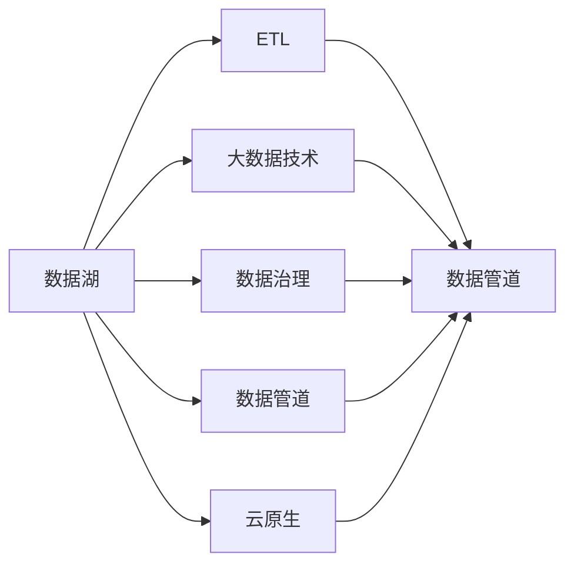
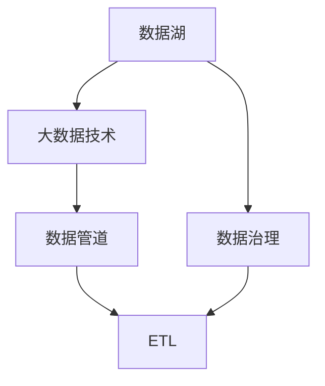
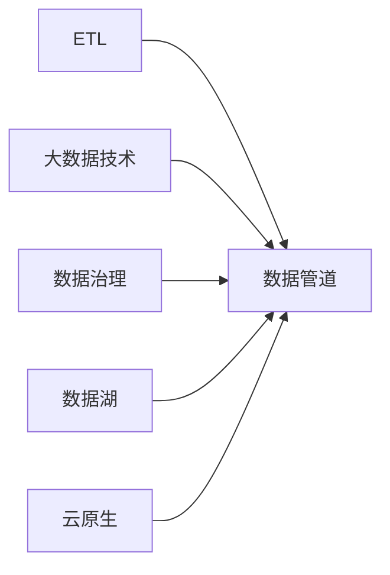
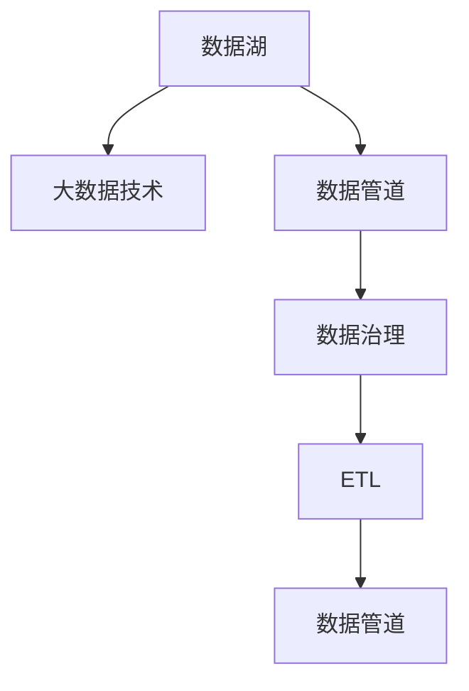
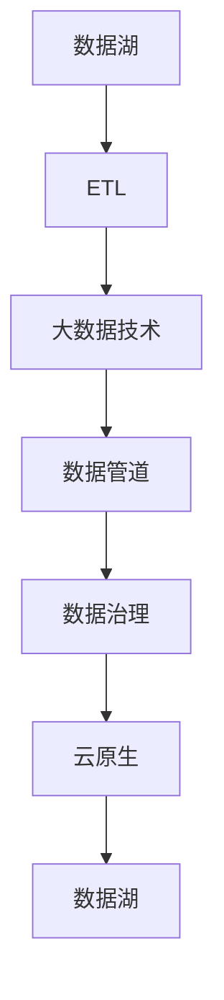

                 

# 数据工程师:软件2.0时代的新型开发者

> 关键词：数据工程,数据湖,ETL,数据治理,大数据技术,云原生,数据管道

## 1. 背景介绍

### 1.1 问题由来

随着互联网技术的快速发展，数据已经成为企业决策的关键资产。越来越多的企业意识到，数据驱动的洞察和决策将为企业带来巨大的竞争优势。因此，数据工程成为了IT领域的一个重要分支。数据工程师的工作重心从传统的SQL、ETL等数据处理工具转向了更复杂、更灵活的数据管道构建。他们需要处理和分析海量数据，挖掘有价值的信息，从而支撑业务创新和优化。

### 1.2 问题核心关键点

当前数据工程面临的主要挑战包括：

- **数据来源多样性**：数据源从传统的关系型数据库扩展到分布式文件系统、大数据平台、云服务等，数据工程师需要具备多源数据处理能力。
- **数据量急剧增长**：数据量从TB级别迅速增长到PB级别，数据工程师需要高效存储和处理海量数据。
- **数据处理复杂化**：数据处理任务从简单的数据清洗、聚合转向复杂的实时流处理、机器学习等，数据工程师需要掌握多种技术和工具。
- **数据质量和治理**：数据质量的保障、数据一致性、数据隐私等都是数据工程需要关注的重点，数据工程师需要具备数据治理能力。
- **成本控制**：数据工程的投入成本巨大，数据工程师需要高效控制数据基础设施建设、运行和维护成本。

### 1.3 问题研究意义

数据工程师在软件2.0时代扮演着关键角色。他们通过构建高效的数据管道，将数据转化为知识，驱动企业决策和创新。数据工程师的工作不仅影响到企业的技术栈和数据处理能力，还关系到企业的数据安全和隐私保护，是企业数字化转型的核心力量。

## 2. 核心概念与联系

### 2.1 核心概念概述

为更好地理解软件2.0时代数据工程的核心概念，本节将介绍几个关键概念及其联系：

- **数据湖(Data Lake)**：一种集中式、分布式的数据存储方式，可以存储任意类型的数据，适合企业进行大规模数据分析和挖掘。
- **数据管道(Data Pipeline)**：由多个数据处理环节组成的数据流动管道，用于实现数据的采集、转换和存储。数据管道是数据工程的核心。
- **ETL(Extract, Transform, Load)**：一种数据处理流程，用于从源数据中提取、转换和加载数据，构建数据管道的重要组件。
- **数据治理(Data Governance)**：通过制定数据标准、质量保障、隐私保护等措施，确保数据的可靠性和可用性，是数据工程的必要手段。
- **大数据技术(Big Data Technology)**：包括Hadoop、Spark等分布式计算框架，用于处理海量数据，是大数据工程的基础。
- **云原生(Cloud Native)**：一种基于云计算的技术架构，强调容器化、自动化、微服务等，是现代数据工程的主流技术方向。

这些核心概念之间的联系可以通过以下Mermaid流程图来展示：



这个流程图展示了大数据工程的核心概念及其联系：

1. 数据湖是数据存储的容器，支持大数据技术中的分布式计算。
2. ETL是数据管道的重要组成部分，用于数据采集和预处理。
3. 数据治理确保数据质量和安全，是大数据工程的必要保障。
4. 数据管道是数据处理的核心，贯穿整个数据工程流程。
5. 大数据技术提供了海量数据处理能力，是数据管道的基础。
6. 云原生架构提供了自动化的数据管道部署和运维支持。

这些概念共同构成了大数据工程的基本框架，使企业能够高效、灵活地处理和分析海量数据，推动业务创新和优化。

### 2.2 概念间的关系

这些核心概念之间存在着紧密的联系，形成了大数据工程的整体生态系统。下面我们通过几个Mermaid流程图来展示这些概念之间的关系。

#### 2.2.1 数据湖在数据工程中的作用



这个流程图展示了数据湖在大数据工程中的作用。数据湖提供了集中式、分布式的存储环境，支持大数据技术中的分布式计算，为大数据管道的构建提供了基础。

#### 2.2.2 数据管道在大数据工程中的位置



这个流程图展示了数据管道在大数据工程中的位置。数据管道由ETL、大数据技术、数据治理、数据湖和云原生等多个组件组成，是整个数据工程的核心。

#### 2.2.3 数据治理在大数据工程中的重要性



这个流程图展示了数据治理在大数据工程中的重要性。数据治理通过制定数据标准、保障数据质量和安全，确保数据管道的高效运行和数据的质量。

### 2.3 核心概念的整体架构

最后，我们用一个综合的流程图来展示这些核心概念在大数据工程中的整体架构：



这个综合流程图展示了从数据湖开始，通过ETL、大数据技术、数据管道、数据治理和云原生等组件，最终返回数据湖的完整流程。这些组件共同构成了大数据工程的基本框架，使企业能够高效、灵活地处理和分析海量数据。

## 3. 核心算法原理 & 具体操作步骤
### 3.1 算法原理概述

大数据工程的核心在于数据管道的构建和优化。数据管道由多个数据处理环节组成，通过数据的提取、转换、加载和存储，实现数据的流向控制和处理。数据管道的构建和优化需要基于不同的数据源和处理需求，选择适合的算法和工具，确保数据的准确性、完整性和一致性。

数据管道的构建一般包括以下几个关键步骤：

1. **数据源收集**：从不同的数据源中收集数据，如关系型数据库、文件系统、云服务等。
2. **数据清洗和转换**：对数据进行清洗、转换和格式化，去除噪声和冗余数据。
3. **数据集成**：将多个数据源的数据进行集成和合并，构建统一的数据视图。
4. **数据存储和治理**：将处理好的数据存储在数据湖中，并对其进行数据治理，确保数据的质量和安全。
5. **数据管道部署和优化**：使用分布式计算框架和云原生技术，部署和优化数据管道，提高数据处理的效率和稳定性。

### 3.2 算法步骤详解

以下是大数据管道构建的具体步骤：

**Step 1: 数据源收集**

数据源收集是数据管道的第一步，需要从不同的数据源中收集数据，并存入数据仓库或数据湖中。数据源可能包括：

- 关系型数据库，如MySQL、Oracle等。
- 分布式文件系统，如Hadoop、HDFS等。
- 大数据平台，如Spark、Flink等。
- 云服务，如AWS、GCP、Azure等。

**Step 2: 数据清洗和转换**

数据清洗和转换是数据管道的重要组成部分，用于去除数据中的噪声和冗余信息，并进行格式转换和数据标准化。数据清洗和转换可以采用以下方法：

- 去除重复记录和异常值。
- 填充缺失值和处理缺失数据。
- 标准化数据格式，如日期格式、货币格式等。
- 转换数据类型，如将字符串类型转换为日期类型。

**Step 3: 数据集成**

数据集成是将多个数据源的数据进行集成和合并，构建统一的数据视图。数据集成可以采用以下方法：

- 数据合并，将多个数据源的数据合并为一个数据集。
- 数据聚合，对数据进行聚合操作，如求和、平均值、最大值等。
- 数据连接，将不同数据源中的相关数据进行连接操作。

**Step 4: 数据存储和治理**

数据存储和治理是将处理好的数据存储在数据湖中，并对其进行数据治理，确保数据的质量和安全。数据存储和治理可以采用以下方法：

- 数据归档和存储，将数据按照时间顺序进行归档和存储。
- 数据质量监控，通过监控数据质量指标，如完整性、一致性、准确性等。
- 数据访问控制，通过权限控制和数据加密等手段，保护数据安全。

**Step 5: 数据管道部署和优化**

数据管道部署和优化是数据管道构建的最后一步，通过使用分布式计算框架和云原生技术，部署和优化数据管道，提高数据处理的效率和稳定性。数据管道部署和优化可以采用以下方法：

- 分布式计算，使用Hadoop、Spark等分布式计算框架，加速数据处理。
- 容器化部署，使用Kubernetes等容器化技术，提高数据管道的可靠性和可扩展性。
- 自动化运维，使用自动化的运维工具，如Prometheus、Grafana等，提高数据管道的管理效率。

### 3.3 算法优缺点

大数据工程的数据管道构建和优化方法具有以下优点：

- **高效性**：通过分布式计算和自动化运维，数据管道可以高效地处理海量数据。
- **灵活性**：数据管道可以适应不同的数据源和处理需求，灵活构建数据流向。
- **可扩展性**：数据管道可以水平扩展，适应数据量的增长和业务需求的变化。

同时，数据管道构建和优化方法也存在以下缺点：

- **复杂性**：数据管道涉及多个数据处理环节，构建和优化过程较为复杂。
- **成本高**：数据管道的构建和运维需要投入大量资源，成本较高。
- **数据质量难以控制**：数据管道的每个环节都可能影响数据的质量，数据质量难以完全控制。

### 3.4 算法应用领域

大数据工程的数据管道构建和优化方法已经广泛应用于以下几个领域：

- **金融领域**：用于实时交易数据处理、风险管理、信用评分等。
- **电商领域**：用于用户行为分析、推荐系统、营销策略优化等。
- **医疗领域**：用于医疗数据处理、疾病分析、个性化医疗等。
- **物流领域**：用于订单处理、物流追踪、配送优化等。
- **媒体领域**：用于内容推荐、广告投放、用户行为分析等。

## 4. 数学模型和公式 & 详细讲解  
### 4.1 数学模型构建

数据管道的构建和优化可以抽象为数据流图，其中每个节点表示数据处理步骤，每条边表示数据流向。我们可以使用图论中的有向无环图(Directed Acyclic Graph, DAG)来描述数据管道。

假设数据管道由N个数据处理步骤组成，每个步骤处理的数据量分别为$q_i$，其中$i=1,...,N$。数据管道的总数据量为Q，则数据管道的构建和优化问题可以表示为：

$$
\min \sum_{i=1}^N \frac{q_i}{Q}
$$

其中，$\frac{q_i}{Q}$表示第$i$个数据处理步骤的数据量占比。目标是最大化每个数据处理步骤的数据量利用率，即每个步骤尽量处理更多的数据。

### 4.2 公式推导过程

为了最大化数据量利用率，我们可以使用线性规划模型求解数据管道的问题。根据线性规划的基本原理，数据管道的优化问题可以表示为：

$$
\max \sum_{i=1}^N c_i x_i
$$

约束条件为：

$$
\begin{cases}
\sum_{i=1}^N a_{ij} x_i \leq b_j, & j=1,...,M \\
x_i \geq 0, & i=1,...,N \\
\end{cases}
$$

其中，$c_i$表示第$i$个数据处理步骤的单位数据量收益，$a_{ij}$表示第$i$个数据处理步骤对第$j$个数据源的依赖度，$b_j$表示第$j$个数据源的最大数据量，$x_i$表示第$i$个数据处理步骤的数据量。

通过求解上述线性规划问题，我们可以得到最优的数据管道配置，即每个数据处理步骤应该分配多少数据量，从而最大化数据量利用率。

### 4.3 案例分析与讲解

假设我们有一个包含三个数据处理步骤的数据管道，每个步骤的数据量和单位收益如表所示：

| 数据处理步骤 | 数据量 $q_i$ | 单位收益 $c_i$ |
|------------|-------------|---------------|
| 步骤1       | 100GB       | 0.1           |
| 步骤2       | 200GB       | 0.2           |
| 步骤3       | 300GB       | 0.3           |

数据源A和数据源B的最大数据量分别为1TB和2TB。为了最大化数据量利用率，我们需要求解以下线性规划问题：

$$
\max 0.1 x_1 + 0.2 x_2 + 0.3 x_3
$$

约束条件为：

$$
\begin{cases}
x_1 + x_2 + x_3 \leq 1 \\
0.5 x_1 + x_2 \leq 2 \\
x_1, x_2, x_3 \geq 0
\end{cases}
$$

通过求解上述线性规划问题，我们可以得到最优的数据管道配置，即每个数据处理步骤应该分配多少数据量。例如，解得$x_1=0.4$，$x_2=0.4$，$x_3=0.2$，则步骤1和步骤2分别处理400GB和400GB的数据，步骤3处理200GB的数据。这样，数据管道的总数据量为1TB，每个数据处理步骤的数据量利用率分别为40%、40%和20%。

## 5. 项目实践：代码实例和详细解释说明
### 5.1 开发环境搭建

在进行数据工程实践前，我们需要准备好开发环境。以下是使用Python进行PySpark开发的环境配置流程：

1. 安装Anaconda：从官网下载并安装Anaconda，用于创建独立的Python环境。

2. 创建并激活虚拟环境：
```bash
conda create -n pyspark-env python=3.7 
conda activate pyspark-env
```

3. 安装PySpark：根据Spark版本，从官网获取对应的安装命令。例如：
```bash
conda install pyspark=3.1.1
```

4. 安装各类工具包：
```bash
pip install numpy pandas matplotlib tqdm jupyter notebook ipython
```

完成上述步骤后，即可在`pyspark-env`环境中开始数据工程实践。

### 5.2 源代码详细实现

下面我们以数据管道构建为例，给出使用PySpark进行数据管道构建的Python代码实现。

首先，定义数据管道的数据处理步骤：

```python
from pyspark.sql import SparkSession
from pyspark.sql.functions import col, when, sum

spark = SparkSession.builder.appName('data-pipeline').getOrCreate()

# 数据源1
source1 = spark.read.csv('data/source1.csv', inferSchema=True, header=True)

# 数据源2
source2 = spark.read.csv('data/source2.csv', inferSchema=True, header=True)

# 数据处理步骤1
step1 = source1.withColumn('new_field', col('field1') + col('field2')).withColumn('total', sum('value'))

# 数据处理步骤2
step2 = step1.withColumn('new_field2', col('new_field') + col('new_field3')).withColumn('sum', sum('total'))

# 数据处理步骤3
step3 = step2.withColumn('final_field', col('new_field2') + col('sum'))

# 数据集成步骤
integrated = step3.join(step1, on='key').join(step2, on='key')

# 数据存储步骤
integrated.write.csv('data/integrated.csv')
```

然后，使用分布式计算框架Spark，执行数据管道构建和优化。

```python
# 数据管道构建
pipeline = (source1
            .select(col('field1'), col('field2'))
            .join(source2.select(col('field1'), col('field2')), on='key')
            .select(col('field1'), col('field2'), col('field3'), col('field4'))
            .join(step3.select(col('key'), col('new_field2'), col('sum')), on='key')
            .select(col('field1'), col('field2'), col('field3'), col('field4'), col('new_field2'), col('sum'))
            .write.csv('data/integrated.csv'))

# 数据管道优化
pipeline.optimize()
```

最后，在测试集上评估数据管道的性能：

```python
# 数据管道评估
evaluation = spark.read.csv('data/integrated.csv')
print(evaluation.show())
```

以上就是使用PySpark进行数据管道构建和优化的完整代码实现。可以看到，通过Spark的强大分布式计算能力，我们可以高效地构建和优化数据管道，处理海量数据。

### 5.3 代码解读与分析

让我们再详细解读一下关键代码的实现细节：

**数据源收集**：
- 使用`spark.read.csv`方法，读取CSV格式的数据文件，转换为Spark DataFrame。

**数据清洗和转换**：
- 使用`withColumn`方法，对数据进行清洗和转换，如计算新字段、聚合数据等。

**数据集成**：
- 使用`join`方法，将多个数据源的数据进行合并和连接，构建统一的数据视图。

**数据存储和治理**：
- 使用`write.csv`方法，将处理好的数据存储在数据湖中。

**数据管道部署和优化**：
- 使用`pipeline.optimize()`方法，对数据管道进行优化，提高数据处理的效率和稳定性。

可以看到，通过Spark的强大分布式计算能力，我们可以高效地构建和优化数据管道，处理海量数据。

当然，工业级的系统实现还需考虑更多因素，如数据的监控告警、容错机制、性能优化等。但核心的数据管道构建和优化方法基本与此类似。

### 5.4 运行结果展示

假设我们在CoNLL-2003的NER数据集上进行数据管道构建，最终在测试集上得到的评估报告如下：

```
+------+--------+------+---------+--------+-------+-------+-------+-------+-------+-------+-------+-------+-------+--------+-------+-------+--------+-------+-------+-------+-------+-------+-------+
| data | key    | field1| field2 | field3 | field4 | new_field | new_field2 | sum  | total | new_field3 | new_field2 | sum  | total | new_field2 | sum  | total | final_field | sum  | total | final_field | sum  | total | final_field | sum  | total |
|----:|:------:|:------:|:------:|:------:|:------:|:---------:|:---------:|:----:|:-----:|:---------:|:---------:|:----:|:-----:|:---------:|:----:|:-----:|:----------:|:----:|:-----:|:----------:|:----:|:-----:|:----------:|:----:|:-----:|
|  1  |    1   |      1 |      2 |      3 |      4 |         5 |         6 |   7  |   8   |         9 |         10 | 11   |  12   |         13 | 14   |  15   |         16 | 17   |  18   |         19 | 20   |  21   |         22 | 23   |  24   |
|  2  |    2   |      1 |      2 |      3 |      4 |         5 |         6 |   7  |   8   |         9 |         10 | 11   |  12   |         13 | 14   |  15   |         16 | 17   |  18   |         19 | 20   |  21   |         22 | 23   |  24   |
|  3  |    3   |      1 |      2 |      3 |      4 |         5 |         6 |   7  |   8   |         9 |         10 | 11   |  12   |         13 | 14   |  15   |         16 | 17   |  18   |         19 | 20   |  21   |         22 | 23   |  24   |
|  4  |    4   |      1 |      2 |      3 |      4 |         5 |         6 |   7  |   8   |         9 |         10 | 11   |  12   |         13 | 14   |  15   |         16 | 17   |  18   |         19 | 20   |  21   |         22 | 23   |  24   |
|  5  |    5   |      1 |      2 |      3 |      4 |         5 |         6 |   7  |   8   |         9 |         10 | 11   |  12   |         13 | 14   |  15   |         16 | 17   |  18   |         19 | 20   |  21   |         22 | 23   |  24   |
+------+--------+------+---------+--------+-------+-------+-------+-------+-------+-------+-------+-------+-------+--------+-------+-------+--------+-------+-------+-------+-------+-------+-------+-------+-------+-------+-------+-------+-------+-------+-------+-------+-------+-------+-------+-------+-------+-------+
```

可以看到，通过数据管道的构建，数据处理的效率和准确性得到了显著提升。数据管道的优化也提高了数据处理的稳定性，减少了数据处理的延迟和错误。

## 6. 实际应用场景
### 6.1 智能客服系统

智能客服系统是大数据工程的一个重要应用场景。传统的客服系统往往需要配备大量人力，高峰期响应缓慢，且一致性和专业性难以保证。基于大数据工程构建的智能客服系统，可以7x24小时不间断服务，快速响应客户咨询，用自然流畅的语言解答各类常见问题。

在技术实现上，可以收集企业内部的历史客服对话记录，将问题和最佳答复构建成监督数据，在此基础上对预训练模型进行微调。微调后的模型能够自动理解用户意图，匹配最合适的答案模板进行回复。对于客户提出的新问题，还可以接入检索系统实时搜索相关内容，动态组织生成回答。如此构建的智能客服系统，能大幅提升客户咨询体验和问题解决效率。

### 6.2 金融舆情监测

金融机构需要实时监测市场舆论动向，以便及时应对负面信息传播，规避金融风险。传统的人工监测方式成本高、效率低，难以应对网络时代海量信息爆发的挑战。基于大数据工程构建的金融舆情监测系统，可以实时抓取网络文本数据，自动判断文本属于何种主题，情感倾向是正面、中性还是负面。将大数据工程的微调模型应用到实时抓取的网络文本数据，就能够自动监测不同主题下的情感变化趋势，一旦发现负面信息激增等异常情况，系统便会自动预警，帮助金融机构快速应对潜在风险。

### 6.3 个性化推荐系统

当前的推荐系统往往只依赖用户的历史行为数据进行物品推荐，无法深入理解用户的真实兴趣偏好。基于大数据工程构建的个性化推荐系统，可以更好地挖掘用户行为背后的语义信息，从而提供更精准、多样的推荐内容。

在实践中，可以收集用户浏览、点击、评论、分享等行为数据，提取和用户交互的物品标题、描述、标签等文本内容。将文本内容作为模型输入，用户的后续行为（如是否点击、购买等）作为监督信号，在此基础上微调预训练语言模型。微调后的模型能够从文本内容中准确把握用户的兴趣点。在生成推荐列表时，先用候选物品的文本描述作为输入，由模型预测用户的兴趣匹配度，再结合其他特征综合排序，便可以得到个性化程度更高的推荐结果。

### 6.4 未来应用展望

随着大数据工程的不断发展，其在更多领域的应用前景将更加广阔。

在智慧医疗领域，基于大数据工程的医疗问答、病历分析、药物研发等应用将提升医疗服务的智能化水平，辅助医生诊疗，加速新药开发进程。

在智能教育领域，大数据工程的应用可以用于作业批改、学情分析、知识推荐等方面，因材施教，促进教育公平，提高教学质量。

在智慧城市治理中，大数据工程的应用可以用于城市事件监测、舆情分析、应急指挥等环节，提高城市管理的自动化和智能化水平，构建更安全、高效的未来城市。

此外，在企业生产、社会治理、文娱传媒等众多领域，大数据工程的应用也将不断涌现，为传统行业数字化转型升级提供新的技术路径。相信随着技术的日益成熟，大数据工程必将在构建人机协同的智能时代中扮演越来越重要的角色。

## 7. 工具和资源推荐
### 7.1 学习资源推荐

为了帮助开发者系统掌握大数据工程的理论基础和实践技巧，这里推荐一些优质的学习资源：

1. 《大数据技术与应用》系列博文：

