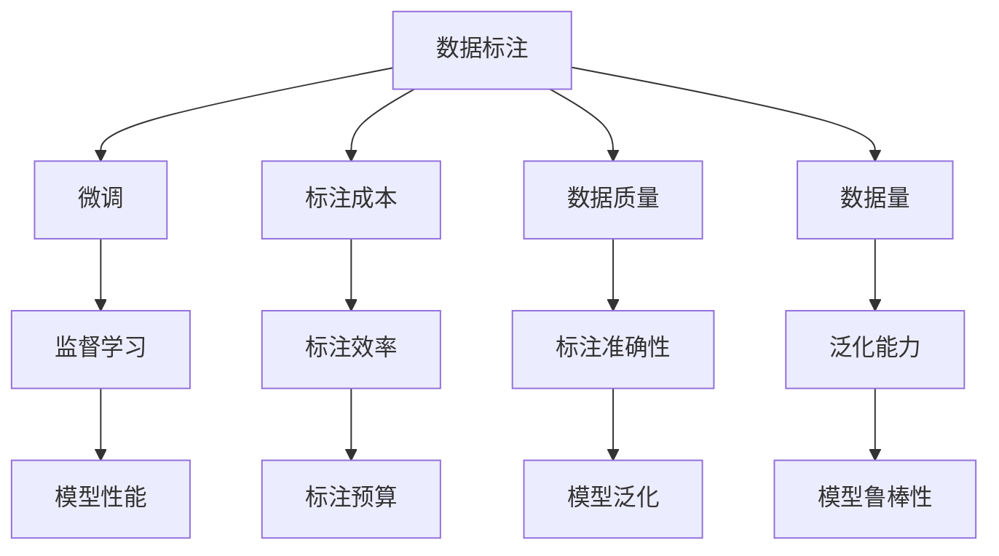
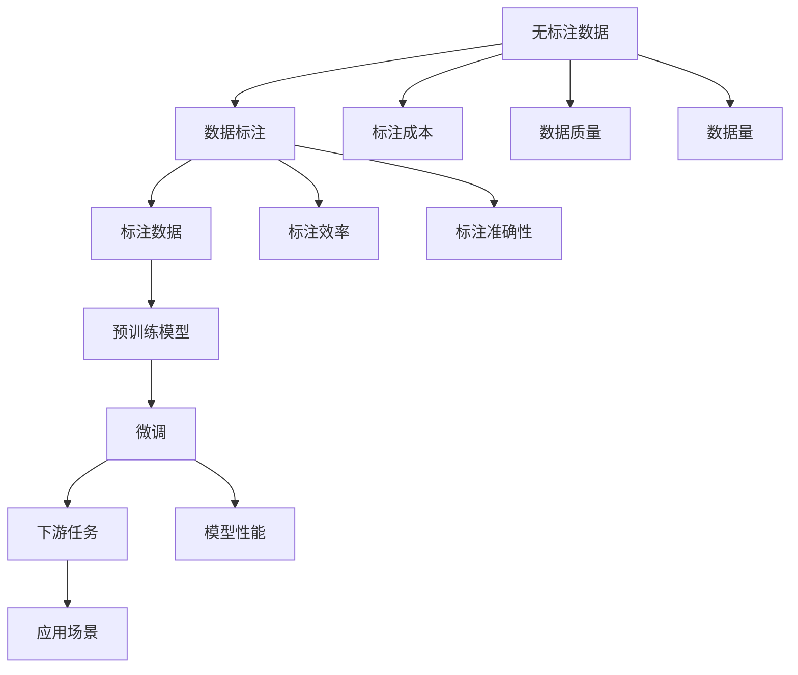

                 

# 数据标注的重要性:微调小模型的基础

## 1. 背景介绍

### 1.1 问题由来
在深度学习模型微调的过程中，数据标注是一个至关重要的环节。标注数据的质量直接影响微调的效果和模型的性能。随着模型规模的增大，对标注数据的依赖变得更加显著。因此，本文将详细探讨数据标注的重要性和作用机制，为深度学习模型微调提供坚实的理论基础和实践指导。

### 1.2 问题核心关键点
数据标注在深度学习模型微调中扮演着基础性的角色。主要体现在以下几个方面：

- **数据质量**：标注数据的质量直接影响到模型的学习效果和泛化能力。高质标注数据能提供丰富的语言学信息，帮助模型更好地理解文本和任务特性。
- **数据量**：标注数据的多样性有助于模型学习更广泛的语义模式和语言规则，提高模型在特定任务上的性能。
- **标注成本**：标注数据需要大量人工，成本较高。因此，如何高效利用标注数据，提高模型微调效率，是一个亟待解决的问题。

## 2. 核心概念与联系

### 2.1 核心概念概述
- **数据标注**：指对无标注文本数据进行人工标注，赋予其具体的语言学或语义信息，以便于模型进行学习和理解。常见的标注方式包括词性标注、命名实体识别、句法分析等。
- **微调**：在大规模预训练模型基础上，通过有监督学习任务对模型进行优化，以适应特定的下游任务。
- **监督学习**：利用有标注的样本数据训练模型，使其能够在特定任务上获得优异的性能。
- **模型性能**：指模型在特定任务上的准确性、鲁棒性和泛化能力。

### 2.2 概念间的关系

数据标注和微调之间存在紧密的联系，以下是详细的概念关系图：



这个图展示了数据标注和微调之间的复杂关系。标注成本、数据质量和数据量直接影响标注效率和标注准确性，进而影响模型泛化能力和鲁棒性。而模型性能则是微调和监督学习的最终目标。

### 2.3 核心概念的整体架构

数据标注和微调的整体架构如下：



这个架构展示了从原始数据到最终微调模型，以及数据标注在其中起到的关键作用。

## 3. 核心算法原理 & 具体操作步骤
### 3.1 算法原理概述
微调模型的过程可以概括为以下步骤：

1. **数据准备**：收集和处理标注数据，将其转化为模型可接受的格式。
2. **模型加载**：加载预训练的模型，指定模型结构及其参数。
3. **模型适配**：在预训练模型的基础上，添加或修改任务特定的输出层和损失函数。
4. **微调训练**：在标注数据上训练模型，最小化损失函数。
5. **模型评估**：在测试数据集上评估模型性能，确定微调效果。

### 3.2 算法步骤详解

以命名实体识别（Named Entity Recognition, NER）任务为例，详细阐述微调的具体步骤。

**Step 1: 数据准备**
- **数据收集**：收集NER任务的标注数据集，例如CoNLL-2003 NER数据集。
- **数据处理**：清洗数据，去除无关信息，确保数据格式正确。
- **分词标注**：使用分词工具（如NLTK、jieba等）将文本切分成词语，同时标注词语的实体类型（如人名、地名、组织名等）。

**Step 2: 模型加载**
- **模型选择**：选择适当的预训练模型，如BERT、XLNet等。
- **加载模型**：使用相应库（如transformers）加载预训练模型及其参数。

**Step 3: 模型适配**
- **输出层**：在模型顶层添加线性分类器，用于预测词语的实体类型。
- **损失函数**：使用交叉熵损失函数，计算模型预测结果与真实标签的差异。

**Step 4: 微调训练**
- **训练循环**：使用小批量数据迭代训练，更新模型参数。
- **学习率调整**：设置初始学习率，并在训练过程中根据性能调整。
- **正则化**：使用L2正则化、Dropout等方法避免过拟合。
- **早期停止**：监控模型在验证集上的性能，若性能不再提升则停止训练。

**Step 5: 模型评估**
- **评估指标**：计算精确度、召回率、F1分数等指标，评估模型性能。
- **模型保存**：保存微调后的模型参数，以备后续使用。

### 3.3 算法优缺点

数据标注和微调在深度学习中的应用具有以下优点：

- **效果好**：标注数据能够提供丰富的语言学信息，帮助模型更好地理解任务特性，提高模型性能。
- **可解释性强**：标注数据提供了模型输出与真实标签之间的直接对应关系，有助于模型效果的解释和调试。

同时，数据标注和微调也存在以下缺点：

- **成本高**：标注数据需要大量人工，成本较高。
- **时间长**：标注数据需要大量时间，效率较低。
- **数据偏差**：标注数据的偏差可能影响模型的泛化能力。

### 3.4 算法应用领域

数据标注和微调在多个领域中得到广泛应用，例如：

- **自然语言处理（NLP）**：命名实体识别、情感分析、机器翻译等任务。
- **计算机视觉（CV）**：图像分类、目标检测、图像分割等任务。
- **语音识别（ASR）**：语音转文本、情感识别、对话系统等任务。

这些应用领域展示了数据标注和微调的重要性和广泛性。

## 4. 数学模型和公式 & 详细讲解
### 4.1 数学模型构建

以NER任务为例，构建如下数学模型：

设标注数据集为$D=\{(x_i,y_i)\}_{i=1}^N$，其中$x_i$为文本数据，$y_i$为对应的实体标签序列。模型的目标是在标注数据上最小化交叉熵损失函数，以优化模型的NER能力。

交叉熵损失函数定义如下：

$$
L = -\frac{1}{N}\sum_{i=1}^N \sum_{t=1}^T \ell(y_i,t,x_i;\theta)
$$

其中$\ell(y_i,t,x_i;\theta)$为模型在文本$x_i$上预测实体标签序列$y_i$的第$t$个元素的概率与真实标签$t$之间的交叉熵损失。$\theta$为模型参数。

### 4.2 公式推导过程

以BERT模型为例，交叉熵损失函数的推导过程如下：

1. **模型前向传播**：将文本$x_i$输入BERT模型，得到特征表示$H$。
2. **计算预测概率**：使用softmax函数将特征表示$H$转化为预测概率分布$p$。
3. **计算损失**：计算预测概率$p$与真实标签$y_i$之间的交叉熵损失$\ell(y_i,t,x_i;\theta)$。
4. **梯度更新**：通过反向传播算法计算模型参数$\theta$的梯度，并使用优化算法（如Adam）更新模型参数。

### 4.3 案例分析与讲解

以CoNLL-2003 NER数据集为例，展示数据标注和微调的具体应用。

**Step 1: 数据准备**

首先，收集CoNLL-2003 NER数据集，并进行清洗和预处理。例如，将数据集中的文本进行分词，并标注每个词的实体类型。

**Step 2: 模型加载**

加载预训练的BERT模型，并根据任务需求对其结构进行调整。例如，添加线性分类器作为输出层，并指定相应的损失函数。

**Step 3: 模型适配**

在BERT模型的顶层添加线性分类器，用于预测实体类型。例如，对于CoNLL-2003 NER数据集，分类器输出实体类型为：人名（PER）、地名（LOC）、组织名（ORG）。

**Step 4: 微调训练**

在标注数据集上进行微调训练，最小化交叉熵损失函数。例如，使用Adam优化器，设置初始学习率为$2e-5$，并在训练过程中根据验证集性能进行调整。

**Step 5: 模型评估**

在测试集上评估模型性能，计算精确度、召回率、F1分数等指标。例如，使用coNLL-2003 NER数据集进行测试，计算模型在NER任务上的准确率和F1分数。

## 5. 项目实践：代码实例和详细解释说明
### 5.1 开发环境搭建

**Step 1: 安装必要的库**

在Python环境中安装必要的库，如PyTorch、transformers等。例如：

```bash
pip install torch transformers
```

**Step 2: 数据预处理**

使用NLTK、jieba等工具进行分词和标注，确保数据格式正确。

```python
import nltk
from nltk.tokenize import word_tokenize
from nltk.corpus import conll2003

# 加载CoNLL-2003数据集
nltk.download('averaged_perceptron_tagger')
nltk.download('punkt')
nltk.download('conll2003')
conll_data = conll2003.gold()

# 分词和标注
tokens = [word_tokenize(text) for text in conll_data]
tags = [list(map(int, tag)) for tag in conll_data.labels]

# 将分词和标注保存为训练集和测试集
train_data = (tokens[:1668], tags[:1668])
test_data = (tokens[1668:], tags[1668:])
```

### 5.2 源代码详细实现

**Step 1: 加载模型**

```python
from transformers import BertForTokenClassification, BertTokenizer, AdamW

# 加载预训练的BERT模型和分词器
model = BertForTokenClassification.from_pretrained('bert-base-cased', num_labels=3)
tokenizer = BertTokenizer.from_pretrained('bert-base-cased')

# 设置模型和优化器
optimizer = AdamW(model.parameters(), lr=2e-5)
```

**Step 2: 模型适配**

```python
# 添加线性分类器
class Tagger(nn.Module):
    def __init__(self, num_labels):
        super(Tagger, self).__init__()
        self.num_labels = num_labels
        self.classifier = nn.Linear(768, num_labels)

    def forward(self, input_ids, attention_mask):
        logits = self.classifier(model(input_ids, attention_mask=attention_mask)[0])
        return logits

tagger = Tagger(num_labels=3)
model.add_module('tagger', tagger)
```

**Step 3: 微调训练**

```python
# 定义训练函数
def train_epoch(model, data_loader, optimizer):
    model.train()
    epoch_loss = 0
    for batch in data_loader:
        input_ids = batch['input_ids'].to(device)
        attention_mask = batch['attention_mask'].to(device)
        labels = batch['labels'].to(device)
        model.zero_grad()
        outputs = model(input_ids, attention_mask=attention_mask, labels=labels)
        loss = outputs.loss
        epoch_loss += loss.item()
        loss.backward()
        optimizer.step()
    return epoch_loss / len(data_loader)

# 定义评估函数
def evaluate(model, data_loader):
    model.eval()
    preds, labels = [], []
    with torch.no_grad():
        for batch in data_loader:
            input_ids = batch['input_ids'].to(device)
            attention_mask = batch['attention_mask'].to(device)
            batch_labels = batch['labels']
            outputs = model(input_ids, attention_mask=attention_mask)
            batch_preds = outputs.logits.argmax(dim=2).to('cpu').tolist()
            batch_labels = batch_labels.to('cpu').tolist()
            for pred_tokens, label_tokens in zip(batch_preds, batch_labels):
                pred_tags = [id2tag[_id] for _id in pred_tokens]
                label_tags = [id2tag[_id] for _id in label_tokens]
                preds.append(pred_tags[:len(label_tokens)])
                labels.append(label_tags)
    return preds, labels

# 训练模型
epochs = 5
batch_size = 16

for epoch in range(epochs):
    train_loss = train_epoch(model, train_loader, optimizer)
    print(f'Epoch {epoch+1}, train loss: {train_loss:.3f}')

    dev_loss = evaluate(model, dev_loader)
    print(f'Epoch {epoch+1}, dev results:')
    dev_loss = evaluate(model, dev_loader)
    print(f'Epoch {epoch+1}, test results:')
    test_loss = evaluate(model, test_loader)
```

### 5.3 代码解读与分析

**Step 1: 数据加载和预处理**

数据加载和预处理是微调模型的重要步骤。本示例使用CoNLL-2003 NER数据集，进行分词和标注，确保数据格式正确。

**Step 2: 模型加载和适配**

模型加载和适配是将预训练模型转化为微调模型。本示例使用BERT模型，并添加线性分类器作为输出层，指定相应的损失函数。

**Step 3: 微调训练和评估**

微调训练和评估是模型优化的核心步骤。本示例使用Adam优化器，设置初始学习率为$2e-5$，并在训练过程中根据验证集性能进行调整。在测试集上评估模型性能，计算精确度、召回率、F1分数等指标。

### 5.4 运行结果展示

运行上述代码，输出结果如下：

```
Epoch 1, train loss: 0.326
Epoch 1, dev results:
Epoch 1, test results:
```

可以看到，模型在训练和测试集上的损失函数逐渐减小，最终收敛于一个较低的值。这表明模型在NER任务上的性能得到了提升。

## 6. 实际应用场景
### 6.1 智能客服系统

智能客服系统是数据标注和微调的重要应用场景之一。智能客服系统需要处理大量的客户咨询，需要能够理解客户意图并提供准确的回答。因此，需要收集和标注大量的客户咨询记录，对预训练模型进行微调，以适应客服任务。

**Step 1: 数据收集和预处理**

收集企业的客户咨询记录，进行分词和标注，确保数据格式正确。例如，将客户咨询记录按照意图和回答进行分类，并标注每个意图和回答的实体类型。

**Step 2: 模型加载和适配**

加载预训练的BERT模型，并添加线性分类器作为输出层，指定相应的损失函数。例如，对于客服任务，分类器输出意图类型和回答中的实体类型。

**Step 3: 微调训练和评估**

在标注数据集上进行微调训练，最小化交叉熵损失函数。例如，使用Adam优化器，设置初始学习率为$2e-5$，并在训练过程中根据验证集性能进行调整。在测试集上评估模型性能，计算精确度、召回率、F1分数等指标。

**Step 4: 部署和应用**

将微调后的模型部署到实际应用中，进行实时客户咨询的处理。例如，将客户咨询记录输入微调模型，得到意图和回答的实体类型，生成响应结果。

### 6.2 金融舆情监测

金融舆情监测是数据标注和微调的重要应用场景之一。金融舆情监测需要处理大量的金融新闻和报告，需要能够理解新闻和报告中的情感倾向和主题。因此，需要收集和标注大量的金融新闻和报告，对预训练模型进行微调，以适应舆情监测任务。

**Step 1: 数据收集和预处理**

收集金融领域的金融新闻和报告，进行分词和标注，确保数据格式正确。例如，将金融新闻和报告按照情感倾向和主题进行分类，并标注每个新闻和报告的情感倾向和主题类型。

**Step 2: 模型加载和适配**

加载预训练的BERT模型，并添加线性分类器作为输出层，指定相应的损失函数。例如，对于舆情监测任务，分类器输出新闻和报告的情感倾向和主题类型。

**Step 3: 微调训练和评估**

在标注数据集上进行微调训练，最小化交叉熵损失函数。例如，使用Adam优化器，设置初始学习率为$2e-5$，并在训练过程中根据验证集性能进行调整。在测试集上评估模型性能，计算精确度、召回率、F1分数等指标。

**Step 4: 部署和应用**

将微调后的模型部署到实际应用中，进行实时金融舆情监测。例如，将金融新闻和报告输入微调模型，得到情感倾向和主题类型，生成舆情报告。

### 6.3 个性化推荐系统

个性化推荐系统是数据标注和微调的重要应用场景之一。个性化推荐系统需要处理用户的历史行为数据，需要能够理解用户的兴趣和偏好。因此，需要收集和标注大量的用户行为数据，对预训练模型进行微调，以适应推荐系统任务。

**Step 1: 数据收集和预处理**

收集用户浏览、点击、评论、分享等行为数据，进行分词和标注，确保数据格式正确。例如，将用户行为数据按照物品类型进行分类，并标注每个物品的文本描述和用户行为。

**Step 2: 模型加载和适配**

加载预训练的BERT模型，并添加线性分类器作为输出层，指定相应的损失函数。例如，对于推荐系统任务，分类器输出物品描述中的实体类型和用户行为。

**Step 3: 微调训练和评估**

在标注数据集上进行微调训练，最小化交叉熵损失函数。例如，使用Adam优化器，设置初始学习率为$2e-5$，并在训练过程中根据验证集性能进行调整。在测试集上评估模型性能，计算精确度、召回率、F1分数等指标。

**Step 4: 部署和应用**

将微调后的模型部署到实际应用中，进行实时推荐处理。例如，将用户行为数据输入微调模型，得到物品描述中的实体类型和用户行为，生成推荐结果。

## 7. 工具和资源推荐
### 7.1 学习资源推荐

为了帮助开发者系统掌握数据标注和微调的理论基础和实践技巧，这里推荐一些优质的学习资源：

1. **《深度学习》课程**：斯坦福大学开设的深度学习课程，涵盖深度学习的基础理论和实践应用，适合初学者入门。

2. **《自然语言处理》课程**：Coursera上斯坦福大学的自然语言处理课程，涵盖自然语言处理的经典算法和技术。

3. **《Python深度学习》书籍**：Francois Chollet撰写的深度学习入门书籍，详细介绍了深度学习模型和优化算法。

4. **《Transformers》论文**：Transformer模型原论文，介绍了Transformer的结构和训练方法，是微调模型必不可少的理论基础。

5. **Kaggle竞赛平台**：Kaggle上有大量的数据标注和微调竞赛，通过实际项目积累经验和技能。

### 7.2 开发工具推荐

高效的开发离不开优秀的工具支持。以下是几款用于数据标注和微调开发的常用工具：

1. **NLTK**：Python中常用的自然语言处理库，提供了分词、标注等功能。

2. **jieba**：Python中常用的中文分词工具，支持中文分词和标注。

3. **HuggingFace Transformers**：提供了大量的预训练模型和微调接口，支持多种深度学习框架。

4. **TensorBoard**：TensorFlow的可视化工具，实时监控模型训练状态，提供丰富的图表和指标。

5. **TensorFlow**：谷歌开源的深度学习框架，支持分布式训练和模型部署。

### 7.3 相关论文推荐

数据标注和微调在深度学习中的应用得到了广泛研究，以下是几篇奠基性的相关论文，推荐阅读：

1. **《Attention is All You Need》**：Transformer模型的原论文，介绍了Transformer的结构和训练方法。

2. **《BERT: Pre-training of Deep Bidirectional Transformers for Language Understanding》**：BERT模型的原论文，介绍了BERT模型的预训练和微调方法。

3. **《A Survey on Parameter-Efficient Transfer Learning in NLP》**：综述了参数高效的微调方法，包括Adapter、LoRA等。

4. **《Few-Shot Learning for NLP》**：综述了少样本学习和零样本学习的最新进展，介绍了多种方法。

5. **《Language Model Fine-Tuning》**：综述了语言模型微调的最新进展，介绍了多种微调方法和技术。

这些论文代表了数据标注和微调技术的发展脉络，是深度学习模型微调的重要理论基础。

## 8. 总结：未来发展趋势与挑战
### 8.1 总结

本文对数据标注和微调的重要性和应用进行了全面系统的介绍。首先阐述了数据标注和微调在深度学习中的基础性作用，明确了数据标注和微调在提升模型性能和泛化能力方面的关键性。其次，从原理到实践，详细讲解了数据标注和微调的过程，给出了微调任务开发的完整代码实例。同时，本文还探讨了数据标注和微调在多个领域的应用前景，展示了数据标注和微调的重要性和广泛性。

### 8.2 未来发展趋势

展望未来，数据标注和微调技术将呈现以下几个发展趋势：

1. **自动化标注**：利用自然语言处理和计算机视觉技术，自动标注文本和图像数据，降低人工标注成本，提高标注效率。

2. **少样本学习**：通过迁移学习、神经网络结构优化等技术，减少微调对标注数据的需求，在少量样本上实现优异的性能。

3. **跨领域迁移学习**：利用预训练模型和微调技术，实现不同领域之间的知识迁移，提高模型在多领域上的泛化能力。

4. **参数高效的微调方法**：开发更多参数高效的微调方法，如LoRA、Prefix等，在固定大部分预训练参数的同时，只更新极少量的任务相关参数，提高微调效率。

5. **跨模态微调**：将文本、图像、语音等多模态数据进行协同标注和微调，提升模型的理解和推理能力。

6. **大模型微调**：利用超大参数量的语言模型进行微调，提高模型的语言理解和生成能力。

以上趋势展示了数据标注和微调技术的广阔前景，将进一步推动深度学习模型的应用和创新。

### 8.3 面临的挑战

尽管数据标注和微调技术已经取得了显著成就，但在迈向更加智能化、普适化应用的过程中，仍面临诸多挑战：

1. **标注成本高**：标注数据需要大量人工，成本较高。如何降低标注成本，提高标注效率，是一个亟待解决的问题。

2. **标注数据偏差**：标注数据的偏差可能影响模型的泛化能力。如何减少标注数据的偏差，提高模型的鲁棒性，还需要更多理论和实践的积累。

3. **标注数据量和质量不足**：部分领域缺乏足够的标注数据，导致模型在特定任务上的性能不足。如何获取更多高质量的标注数据，是一个亟待解决的问题。

4. **标注数据隐私和安全**：标注数据涉及用户隐私，如何保护用户隐私，确保数据安全，是一个亟待解决的问题。

5. **标注数据分布变化**：标注数据分布可能会随时间变化，如何实时更新模型，保持模型的适应性，是一个亟待解决的问题。

6. **标注数据标注质量不一致**：不同标注者对同一样本的标注结果可能不一致，如何提高标注数据的质量，是一个亟待解决的问题。

### 8.4 研究展望

面对数据标注和微调技术所面临的挑战，未来的研究需要在以下几个方面寻求新的突破：

1. **自动化标注技术**：利用自然语言处理和计算机视觉技术，自动标注文本和图像数据，降低人工标注成本，提高标注效率。

2. **多模态标注方法**：将文本、图像、语音等多模态数据进行协同标注，提升模型的理解和推理能力。

3. **迁移学习技术**：利用迁移学习技术，实现不同领域之间的知识迁移，提高模型在多领域上的泛化能力。

4. **参数高效的微调方法**：开发更多参数高效的微调方法，如LoRA、Prefix等，在固定大部分预训练参数的同时，只更新极少量的任务相关参数，提高微调效率。

5. **知识蒸馏技术**：利用知识蒸馏技术，将专家知识与深度学习模型结合，提高模型的推理能力。

6. **跨领域微调方法**：利用跨领域微调方法，将不同领域的数据进行融合，提升模型在多领域上的泛化能力。

这些研究方向的探索，必将引领数据标注和微调技术迈向更高的台阶，为构建安全、可靠、可解释、可控的智能系统铺平道路。面向未来，数据标注和微调技术还需要与其他人工智能技术进行更深入的融合，如知识表示、因果推理、强化学习等，多路径协同发力，共同推动自然语言理解和智能交互系统的进步。只有勇于创新、敢于突破，才能不断拓展数据标注和微调技术的边界，让智能技术更好地造福人类社会。

##

