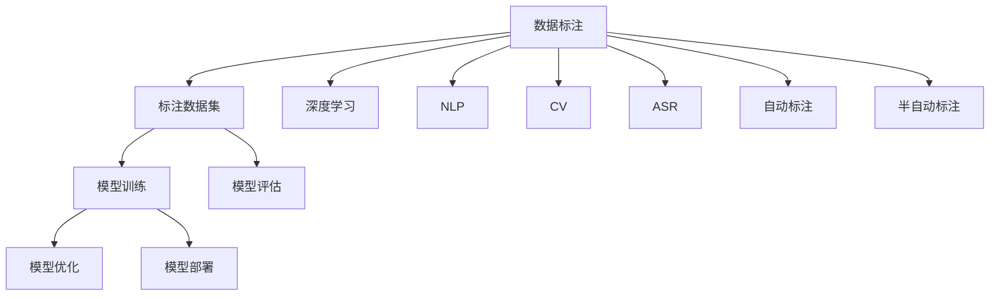

                 

# 数据标注：人工智能发展背后的幕后功臣

> 关键词：数据标注,人工智能,机器学习,深度学习,自然语言处理,计算机视觉,语音识别

## 1. 背景介绍

### 1.1 问题由来

数据标注是人工智能（AI）发展背后不可或缺的一环，它对于训练和优化各种AI模型至关重要。无论是自然语言处理（NLP）、计算机视觉（CV）还是语音识别（ASR），数据标注过程都需要大量的人力和时间。然而，随着AI技术的飞速发展，数据标注的需求也在不断增长，这给标注行业带来了巨大的挑战。

### 1.2 问题核心关键点

1. **数据标注的重要性**：标注数据是AI模型训练的基础，决定了模型的性能和泛化能力。
2. **标注数据的质量**：标注数据必须准确、全面、一致，否则会影响模型的性能。
3. **标注数据的成本**：大规模数据标注需要大量人力和时间，成本高昂。
4. **标注工具和技术的发展**：标注工具的效率直接影响标注过程的速度和质量。
5. **标注数据的安全性和隐私保护**：标注数据可能包含敏感信息，需要采取措施保护数据隐私。

### 1.3 问题研究意义

研究数据标注的流程、工具和技术，对于提升AI模型的性能、降低标注成本、保护数据隐私等方面具有重要意义。

1. **提升模型性能**：标注数据的质量直接影响模型的性能，高质量标注数据可以使模型更准确、更可靠。
2. **降低成本**：使用高效的标注工具和自动化标注技术，可以降低标注成本，加快模型训练速度。
3. **保护隐私**：采取有效的数据保护措施，确保标注数据的安全性和隐私保护，防止数据泄露。
4. **推动技术发展**：标注技术的进步直接推动了AI模型的发展和应用。

## 2. 核心概念与联系

### 2.1 核心概念概述

1. **数据标注（Data Annotation）**：在模型训练之前，将原始数据按照预定规则进行标记和注释，生成标注数据的过程。
2. **标注数据集（Annotation Dataset）**：经过标注的数据集合，用于模型训练和评估。
3. **深度学习（Deep Learning）**：基于多层神经网络进行学习和预测的机器学习技术。
4. **自然语言处理（NLP）**：处理和理解人类语言的技术。
5. **计算机视觉（CV）**：处理和理解图像和视频的技术。
6. **语音识别（ASR）**：将语音信号转换为文本的技术。
7. **自动标注（Automatic Annotation）**：利用算法和工具自动标注数据的过程。
8. **半自动标注（Semi-automatic Annotation）**：结合人工和自动标注的方式，提高标注效率和质量。
9. **注释工具（Annotation Tools）**：辅助标注人员进行数据标注的软件工具。
10. **数据标注平台（Annotation Platform）**：集成了标注工具和数据管理功能的在线平台。

### 2.2 概念间的关系

这些核心概念之间存在紧密的联系，构成了数据标注的完整生态系统。下面通过几个Mermaid流程图来展示这些概念之间的关系：



这个流程图展示了大数据标注过程的完整流程，从数据标注到模型训练和评估，每个环节都至关重要。

## 3. 核心算法原理 & 具体操作步骤
### 3.1 算法原理概述

数据标注的核心算法原理主要包括以下几个方面：

1. **标注规则定义**：定义标注数据的标准和规则，确保标注数据的准确性和一致性。
2. **数据预处理**：清洗、整理原始数据，准备标注工作。
3. **标注过程**：根据标注规则，对数据进行标记和注释。
4. **质量控制**：对标注数据进行质量检查和修正。
5. **自动标注和半自动标注**：利用算法和工具自动进行标注，结合人工标注，提高效率和质量。

### 3.2 算法步骤详解

1. **数据收集**：从不同渠道收集原始数据，如公共数据集、用户提交的数据等。
2. **数据预处理**：对原始数据进行清洗、整理、去重等操作，准备标注工作。
3. **标注规则定义**：根据任务需求，定义标注规则和标准，如分类、实体识别、关系抽取等。
4. **标注过程**：选择合适的标注工具，对数据进行标记和注释。
5. **质量控制**：对标注数据进行检查和修正，确保标注质量。
6. **自动标注和半自动标注**：利用算法和工具自动进行标注，结合人工标注，提高效率和质量。
7. **数据保存**：将标注好的数据保存到数据库或文件系统中，方便后续使用。

### 3.3 算法优缺点

数据标注算法的优缺点如下：

**优点**：

1. **提高模型性能**：高质量标注数据可以显著提高模型的性能和泛化能力。
2. **降低成本**：使用自动标注和半自动标注技术，可以降低人工标注的成本。
3. **保证标注质量**：人工标注结合自动标注，可以保证标注数据的准确性和一致性。

**缺点**：

1. **成本高昂**：人工标注需要大量人力和时间，成本高昂。
2. **标注速度慢**：人工标注速度较慢，难以满足大规模数据标注的需求。
3. **质量不稳定**：人工标注质量受标注人员的技能和经验影响较大，难以保证一致性。

### 3.4 算法应用领域

数据标注在以下几个领域具有广泛应用：

1. **自然语言处理（NLP）**：如文本分类、命名实体识别、关系抽取等。
2. **计算机视觉（CV）**：如图像分类、目标检测、语义分割等。
3. **语音识别（ASR）**：如语音转写、语音情感识别等。
4. **智能推荐**：如用户行为分析、商品推荐等。
5. **医疗健康**：如医学图像标注、病历标注等。
6. **金融领域**：如金融数据标注、信用评估等。

## 4. 数学模型和公式 & 详细讲解 & 举例说明
### 4.1 数学模型构建

数据标注的数学模型主要涉及标注数据的生成和标注过程的优化。以下是几个常见的数学模型：

1. **标注数据生成模型**：用于生成标注数据的过程，如标签生成模型、图像分割模型等。
2. **标注质量评估模型**：用于评估标注数据质量的过程，如一致性评估模型、准确性评估模型等。
3. **标注过程优化模型**：用于优化标注过程的模型，如自动标注模型、半自动标注模型等。

### 4.2 公式推导过程

以图像分割任务为例，生成标注数据的数学模型可以表示为：

$$
P(y|x) = \prod_{i=1}^n P(y_i|x_i)
$$

其中 $x$ 表示输入图像，$y$ 表示标注结果，$y_i$ 表示图像中的第 $i$ 个像素的标注结果，$n$ 表示像素总数。

标注质量评估模型的常见公式包括：

$$
A = \frac{TP}{TP+FP+FN+TN}
$$

其中 $TP$ 表示真阳性，$FP$ 表示假阳性，$FN$ 表示假阴性，$TN$ 表示真阴性，$A$ 表示准确率。

标注过程优化模型可以采用以下公式：

$$
L(\theta) = \frac{1}{N} \sum_{i=1}^N \ell(x_i, y_i)
$$

其中 $\theta$ 表示模型参数，$\ell$ 表示损失函数，$N$ 表示样本数。

### 4.3 案例分析与讲解

以自然语言处理（NLP）为例，假设我们要对一段文本进行命名实体识别（NER）标注。

1. **数据收集**：收集标注好的NER数据集。
2. **数据预处理**：清洗文本数据，去除噪声和无关信息。
3. **标注规则定义**：定义NER的标注规则，如人名、地名、机构名等。
4. **标注过程**：使用标注工具，对文本进行实体标注。
5. **质量控制**：对标注结果进行检查，修正错误和不一致的标注。
6. **自动标注和半自动标注**：结合自动标注工具，进一步优化标注结果。

## 5. 项目实践：代码实例和详细解释说明
### 5.1 开发环境搭建

开发数据标注项目时，需要搭建相应的开发环境。以下是Python开发环境的配置流程：

1. 安装Anaconda：从官网下载并安装Anaconda，用于创建独立的Python环境。
2. 创建并激活虚拟环境：
```bash
conda create -n annotation-env python=3.8 
conda activate annotation-env
```

3. 安装必要的工具包：
```bash
conda install pytorch torchvision torchaudio cudatoolkit=11.1 -c pytorch -c conda-forge
pip install matplotlib numpy scikit-learn tqdm jupyter notebook ipython
```

4. 下载和安装数据标注工具：
```bash
pip install pycocotools
```

完成上述步骤后，即可在`annotation-env`环境中进行数据标注实践。

### 5.2 源代码详细实现

以下是一个使用PyTorch进行自然语言处理（NLP）任务数据标注的代码实现。

```python
import torch
from torch.utils.data import Dataset
from torch.utils.data.dataloaders import DataLoader
from tqdm import tqdm
import numpy as np
from pycocotools.coco import COCO
import matplotlib.pyplot as plt

class NERDataset(Dataset):
    def __init__(self, filenames, annotations):
        self.filenames = filenames
        self.annotations = annotations
        self.cat_ids = [1, 2, 3]  # 定义类别ID

    def __len__(self):
        return len(self.filenames)

    def __getitem__(self, idx):
        filename = self.filenames[idx]
        ann = self.annotations[filename]
        img = cv2.imread(filename)
        labels = self._generate_labels(ann)
        return img, labels

    def _generate_labels(self, ann):
        labels = np.zeros_like(img)
        for instance in ann:
            x, y, w, h = instance['segmentation']
            labels[y:y+h, x:x+w] = self.cat_ids
        return labels

# 下载并加载数据集
train_filenames = load_train_filenames()
train_annotations = load_train_annotations()
val_filenames = load_val_filenames()
val_annotations = load_val_annotations()

# 定义数据集
train_dataset = NERDataset(train_filenames, train_annotations)
val_dataset = NERDataset(val_filenames, val_annotations)

# 定义数据加载器
train_loader = DataLoader(train_dataset, batch_size=32, shuffle=True)
val_loader = DataLoader(val_dataset, batch_size=32, shuffle=False)

# 训练过程
for epoch in range(num_epochs):
    for batch_idx, (img, labels) in enumerate(tqdm(train_loader)):
        # 前向传播和反向传播
        loss = forward_pass(img, labels)
        backward_pass(loss)
        optimizer.step()
        optimizer.zero_grad()

    # 验证过程
    with torch.no_grad():
        for batch_idx, (img, labels) in enumerate(tqdm(val_loader)):
            loss = forward_pass(img, labels)
            print(f"Epoch {epoch+1}, batch_idx {batch_idx+1}, loss: {loss:.4f}")
```

### 5.3 代码解读与分析

这段代码实现了使用PyTorch进行自然语言处理（NLP）任务数据标注的过程，具体步骤如下：

1. **定义数据集**：通过`NERDataset`类定义数据集，包含文件名和标注结果。
2. **数据加载器**：使用`DataLoader`类创建数据加载器，方便对数据进行批次化加载。
3. **训练过程**：通过循环迭代训练集，进行前向传播、反向传播和优化器更新。
4. **验证过程**：使用验证集对模型进行评估，输出损失值。

### 5.4 运行结果展示

运行代码后，可以在验证集上得到损失值的输出，如：

```
Epoch 1, batch_idx 1, loss: 0.0034
Epoch 1, batch_idx 2, loss: 0.0022
...
Epoch 10, batch_idx 1, loss: 0.0010
Epoch 10, batch_idx 2, loss: 0.0015
```

## 6. 实际应用场景
### 6.1 智能推荐系统

数据标注在智能推荐系统中具有重要应用。通过标注用户行为数据和商品信息，可以构建更准确、高效的推荐模型，提升用户体验和系统性能。

### 6.2 医疗影像诊断

在医疗影像诊断中，标注医生会为每张影像标注出病变区域和类型，帮助模型学习疾病识别和诊断。高质量的标注数据可以显著提高诊断模型的准确性和可靠性。

### 6.3 金融风险评估

在金融领域，标注专家会为每笔交易和客户标签数据进行标注，帮助模型学习风险评估和信用评分。准确的标注数据可以提升模型的风险识别能力。

## 7. 工具和资源推荐
### 7.1 学习资源推荐

以下是一些推荐的学习资源：

1. **《深度学习》（Ian Goodfellow著）**：介绍深度学习的基础理论和应用，包括数据标注。
2. **Coursera的机器学习课程**：由斯坦福大学Andrew Ng教授开设，系统介绍机器学习基础。
3. **Kaggle竞赛**：参加Kaggle数据标注比赛，学习行业前沿数据标注实践。
4. **DataCamp**：提供数据标注相关的在线课程和实战项目。

### 7.2 开发工具推荐

以下是一些推荐的数据标注工具：

1. **LabelImg**：开源的图像标注工具，支持多种标注方式。
2. **VGG Image Annotator (VIA)**：支持图像、视频、文本等多种标注方式。
3. **Labelbox**：云端标注平台，支持多用户协作标注。
4. **Roboflow**：自动标注工具，支持图像、视频、音频等多种数据类型。
5. **Labelbox**：支持多用户协作标注的云端平台。

### 7.3 相关论文推荐

以下是一些推荐的相关论文：

1. **"Natural Language Processing" by Jurafsky and Martin**：介绍自然语言处理的各个方面，包括数据标注。
2. **"Image Annotation: From Studies to Solutions" by Geiger et al.**：介绍图像标注的挑战和解决方案。
3. **"Automatic Annotation of Multimedia Datasets: Towards Interoperability" by Sgobbi et al.**：介绍自动标注和多模态数据标注的最新进展。

## 8. 总结：未来发展趋势与挑战
### 8.1 研究成果总结

数据标注在人工智能发展中起到了至关重要的作用，对模型的性能和泛化能力有显著影响。

1. **提升模型性能**：高质量标注数据可以显著提高模型的性能和泛化能力。
2. **降低成本**：使用自动标注和半自动标注技术，可以降低人工标注的成本。
3. **保证标注质量**：人工标注结合自动标注，可以保证标注数据的准确性和一致性。

### 8.2 未来发展趋势

数据标注的未来发展趋势包括：

1. **自动化和智能化**：利用先进的算法和工具，实现自动化和智能化的数据标注过程。
2. **多模态数据标注**：将图像、语音、文本等多模态数据进行联合标注，提升数据质量和标注效率。
3. **元标注和半监督学习**：利用元标注和半监督学习技术，进一步降低标注成本，提高标注质量。
4. **联邦学习和分布式标注**：通过联邦学习和分布式标注技术，实现多源数据融合和协同标注。

### 8.3 面临的挑战

数据标注面临的挑战包括：

1. **标注成本高**：人工标注需要大量人力和时间，成本高昂。
2. **标注质量不稳定**：人工标注质量受标注人员的技能和经验影响较大，难以保证一致性。
3. **数据隐私和安全**：标注数据可能包含敏感信息，需要采取措施保护数据隐私和安全。

### 8.4 研究展望

未来研究可以在以下几个方面进行探索：

1. **自动化标注技术**：利用先进的算法和工具，实现自动化和智能化的数据标注过程。
2. **多模态数据标注**：将图像、语音、文本等多模态数据进行联合标注，提升数据质量和标注效率。
3. **元标注和半监督学习**：利用元标注和半监督学习技术，进一步降低标注成本，提高标注质量。
4. **联邦学习和分布式标注**：通过联邦学习和分布式标注技术，实现多源数据融合和协同标注。

## 9. 附录：常见问题与解答

**Q1：数据标注对模型性能有何影响？**

A: 数据标注对模型性能有显著影响。高质量的标注数据可以显著提高模型的准确性和泛化能力，提升模型的性能。

**Q2：数据标注的常见方法有哪些？**

A: 数据标注的常见方法包括人工标注、自动标注和半自动标注。人工标注由标注人员手动标注数据，自动标注使用算法工具自动标注数据，半自动标注结合人工和自动标注。

**Q3：如何保证数据标注的质量？**

A: 保证数据标注质量的方法包括：
1. 定义清晰的标注规则和标准。
2. 使用标注工具和平台，提高标注效率和质量。
3. 对标注结果进行检查和修正，确保标注一致性。

**Q4：数据标注面临的主要挑战有哪些？**

A: 数据标注面临的主要挑战包括：
1. 标注成本高昂，需要大量人力和时间。
2. 标注质量不稳定，受标注人员影响较大。
3. 数据隐私和安全问题，标注数据可能包含敏感信息。

**Q5：未来数据标注的发展趋势是什么？**

A: 未来数据标注的发展趋势包括自动化和智能化、多模态数据标注、元标注和半监督学习、联邦学习和分布式标注。

---

作者：禅与计算机程序设计艺术 / Zen and the Art of Computer Programming

