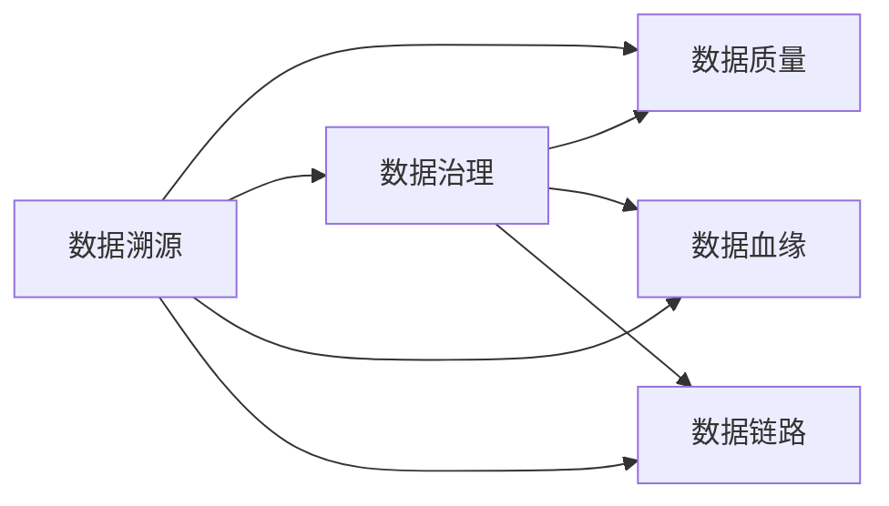
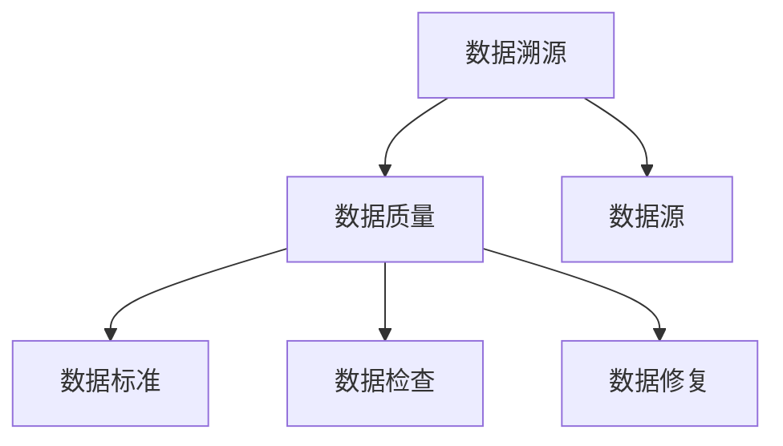
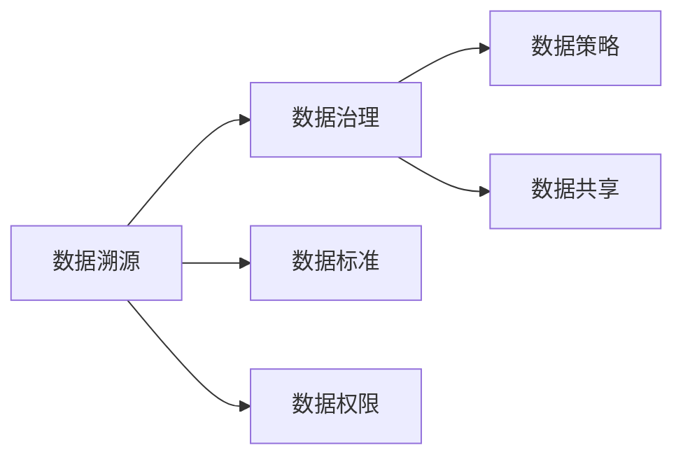
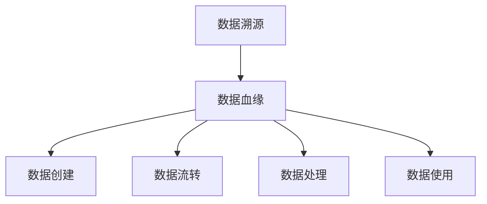
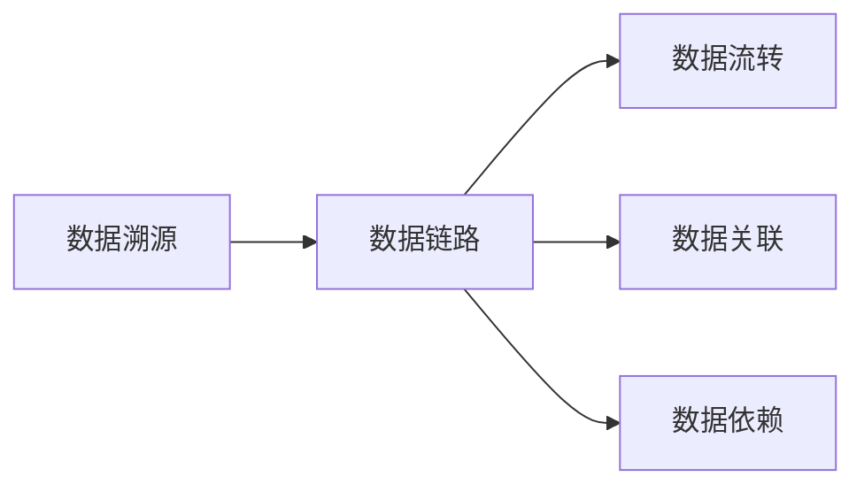
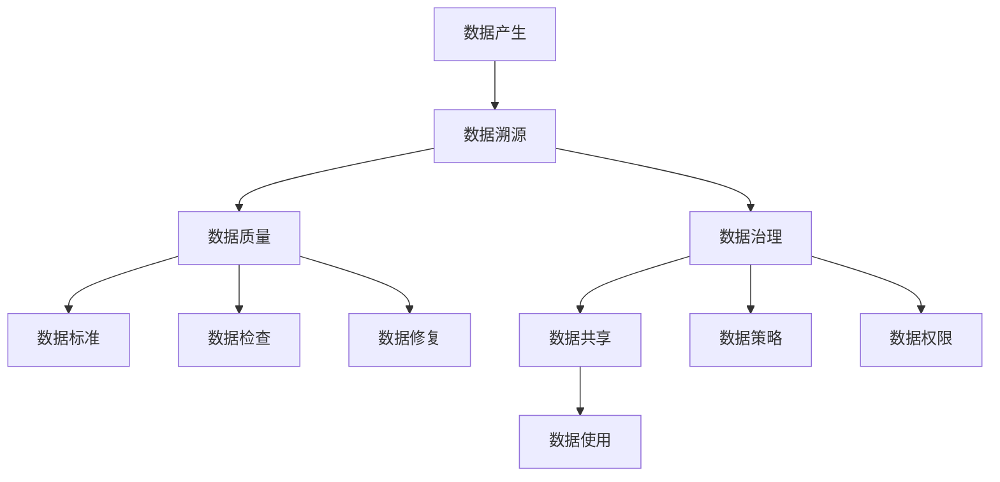

                 

## 1. 背景介绍

数据溯源（Data Lineage）是大数据时代的核心需求之一。随着信息技术的发展，数据的产生、存储和应用已经深度融入各行各业，形成了复杂多样的数据生态。如何高效管理和治理海量数据，确保数据质量和安全，是各行各业都面临的重大挑战。数据溯源技术正是在这样的背景下孕育而生，为数据治理提供了强大的支持。

数据溯源是指对数据的全生命周期进行追踪和管理，包括数据来源、数据处理过程、数据流转和使用等。通过数据溯源，可以确保数据的完整性、准确性和安全性，为数据分析、数据治理和数据运营提供坚实的基础。在软件2.0时代，数据溯源技术已经成为支撑数据驱动决策的重要手段。

数据溯源技术的应用范围非常广泛，包括但不限于金融、医疗、零售、能源、政府等各行业。随着数据的价值日益凸显，各行各业对数据治理的需求不断增长，数据溯源技术正面临着前所未有的发展机遇。

## 2. 核心概念与联系

### 2.1 核心概念概述

为了更好地理解数据溯源技术，本节将介绍几个密切相关的核心概念：

- **数据溯源（Data Lineage）**：对数据的全生命周期进行追踪和管理，包括数据来源、数据处理过程、数据流转和使用等。数据溯源旨在确保数据的完整性、准确性和安全性，为数据分析、数据治理和数据运营提供坚实的基础。

- **数据质量（Data Quality）**：数据的质量通常包含数据的准确性、完整性、一致性、唯一性、时效性和安全性等方面。数据质量管理是数据治理的重要组成部分，直接影响数据驱动决策的准确性和可靠性。

- **数据治理（Data Governance）**：指对数据资产进行规划、管理和保护的过程，包括数据标准、数据质量、数据安全、数据共享等方面。数据治理是数据溯源的重要组成部分，数据溯源为数据治理提供了基础信息支持。

- **数据血缘（Data Pedigree）**：指数据从创建、流转、处理到使用的全生命周期中的每一个环节的详细记录。数据血缘是数据溯源的核心要素，通过数据血缘能够完整地追踪数据的使用路径和生命周期。

- **数据链路（Data Linkage）**：指数据在不同系统、不同部门、不同业务流程中的流转和关联关系。数据链路是数据溯源的关键组成部分，确保数据的完整性和一致性。

这些核心概念之间的逻辑关系可以通过以下Mermaid流程图来展示：



这个流程图展示了数据溯源与其他数据治理概念的联系和关系：

1. 数据溯源通过数据质量管理、数据治理、数据血缘和数据链路等概念，确保数据的完整性、准确性和安全性，为数据驱动决策提供基础信息支持。
2. 数据质量管理是数据治理的重要组成部分，数据治理是数据溯源的基础。
3. 数据血缘和数据链路是数据溯源的核心要素，确保数据的完整性和一致性。

### 2.2 概念间的关系

这些核心概念之间存在着紧密的联系，形成了数据治理的完整生态系统。下面我们通过几个Mermaid流程图来展示这些概念之间的关系。

#### 2.2.1 数据溯源和数据质量



这个流程图展示了数据溯源和数据质量之间的联系：

1. 数据溯源通过对数据的生命周期进行追踪和管理，确保数据的质量。
2. 数据质量管理通过制定数据标准、进行数据检查和修复等手段，提升数据质量。
3. 数据溯源为数据质量管理提供基础信息支持，帮助发现和修复数据质量问题。

#### 2.2.2 数据溯源和数据治理



这个流程图展示了数据溯源和数据治理之间的联系：

1. 数据溯源通过记录数据的生命周期和流转过程，支持数据治理的规划和管理。
2. 数据治理通过制定数据标准、进行数据权限管理等手段，确保数据治理的规范和有效。
3. 数据溯源为数据治理提供基础信息支持，帮助制定和执行数据治理策略。

#### 2.2.3 数据溯源和数据血缘



这个流程图展示了数据溯源和数据血缘之间的联系：

1. 数据溯源通过记录数据的生命周期和流转过程，形成数据血缘。
2. 数据血缘详细记录数据的创建、流转、处理和使用等环节，为数据溯源提供基础信息。
3. 数据溯源和数据血缘共同确保数据的完整性和一致性。

#### 2.2.4 数据溯源和数据链路



这个流程图展示了数据溯源和数据链路之间的联系：

1. 数据溯源通过记录数据的流转和关联关系，形成数据链路。
2. 数据链路详细记录数据在不同系统、部门和业务流程中的流转和关联，为数据溯源提供基础信息。
3. 数据溯源和数据链路共同确保数据的完整性和一致性。

### 2.3 核心概念的整体架构

最后，我们用一个综合的流程图来展示这些核心概念在大数据治理过程中的整体架构：



这个综合流程图展示了从数据产生到数据使用的全生命周期中，数据溯源与其他数据治理概念的关系：

1. 数据产生后，通过数据溯源记录数据的生命周期和流转过程。
2. 数据溯源通过数据质量管理，确保数据质量。
3. 数据治理通过制定数据标准和策略，确保数据治理的规范和有效。
4. 数据治理通过数据共享，确保数据的有效利用。
5. 数据治理通过数据权限管理，确保数据的安全性。
6. 数据质量管理通过数据标准、数据检查和数据修复，提升数据质量。
7. 数据质量管理为数据溯源提供基础信息支持。

通过这些流程图，我们可以更清晰地理解数据溯源过程中各个概念的关系和作用，为后续深入讨论具体的溯源方法和技术奠定基础。

## 3. 核心算法原理 & 具体操作步骤
### 3.1 算法原理概述

数据溯源的核心在于对数据的全生命周期进行追踪和管理，包括数据来源、数据处理过程、数据流转和使用等。其核心思想是：通过对数据的生命周期进行详细的记录和分析，确保数据的完整性、准确性和安全性，为数据分析、数据治理和数据运营提供坚实的基础。

形式化地，假设数据流记为 $\Delta$，数据溯源的目标是找到数据的生命周期：

$$
\Delta = \{(x_i,y_i)\}_{i=1}^N
$$

其中 $x_i$ 为数据来源，$y_i$ 为数据使用，$N$ 为数据流中数据的总数。数据溯源的目标是找到数据流 $\Delta$ 的起点和终点，以及中间流转的路径和节点。

通过数据溯源，可以确保数据的完整性、准确性和安全性，为数据分析、数据治理和数据运营提供坚实的基础。

### 3.2 算法步骤详解

数据溯源的核心步骤包括以下几个关键步骤：

**Step 1: 数据元信息收集**
- 收集数据的来源、处理、流转和使用等元信息，形成数据溯源图谱。
- 数据元信息通常包括数据源、数据处理步骤、数据流转路径、数据使用者、数据生成时间、数据更新频率等。

**Step 2: 数据溯源图谱构建**
- 通过收集的数据元信息，构建数据溯源图谱，展示数据的生命周期和流转路径。
- 数据溯源图谱通常包括节点（数据流）和边（数据流转），节点表示数据流的起点、终点和中间节点，边表示数据流的流转路径。

**Step 3: 数据质量检查**
- 对数据溯源图谱中的数据进行质量检查，发现和修复数据质量问题。
- 数据质量检查通常包括数据完整性检查、数据一致性检查、数据时效性检查和数据安全性检查等。

**Step 4: 数据治理策略制定**
- 根据数据溯源图谱中的数据质量检查结果，制定数据治理策略。
- 数据治理策略通常包括数据标准制定、数据权限管理、数据共享策略等。

**Step 5: 数据链路分析**
- 对数据溯源图谱中的数据链路进行分析，确保数据的完整性和一致性。
- 数据链路分析通常包括数据依赖分析、数据关联分析、数据流转分析等。

**Step 6: 数据溯源图谱更新**
- 定期更新数据溯源图谱，确保其与实际数据流的变化一致。
- 数据溯源图谱的更新通常包括数据元信息的收集、数据溯源图谱的构建、数据质量检查等。

以上是数据溯源的一般流程。在实际应用中，还需要针对具体场景进行优化和调整，以适应不同的业务需求和数据特点。

### 3.3 算法优缺点

数据溯源技术具有以下优点：
1. 能够全面记录数据的生命周期，确保数据的完整性、准确性和安全性。
2. 支持数据分析、数据治理和数据运营，提供坚实的基础信息支持。
3. 帮助发现和修复数据质量问题，提升数据质量。
4. 支持数据标准制定和数据权限管理，提高数据治理的规范性和有效性。

同时，数据溯源技术也存在一些缺点：
1. 数据元信息收集需要大量时间和人力，成本较高。
2. 数据溯源图谱构建和维护复杂，需要专业知识支持。
3. 数据质量检查和数据治理策略制定需要大量的技术支持。
4. 数据链路分析需要处理大量数据和关系，计算复杂度高。

尽管存在这些缺点，但数据溯源技术仍然是数据治理的重要工具，在数据分析、数据治理和数据运营中发挥着重要作用。

### 3.4 算法应用领域

数据溯源技术广泛应用于各行业的数据治理和数据分析中，具体应用领域包括但不限于以下几个方面：

- **金融领域**：金融行业对数据质量和安全性的要求极高，数据溯源技术可以帮助金融企业追踪数据的来源、处理过程和使用路径，确保数据的完整性、准确性和安全性，支持金融风控、审计和合规等业务。

- **医疗领域**：医疗行业对数据的准确性和安全性要求非常高，数据溯源技术可以帮助医疗机构追踪数据的来源、处理过程和使用路径，确保数据的完整性、准确性和安全性，支持医疗决策、医疗监管和医疗质量管理等业务。

- **零售领域**：零售行业对数据的实时性和一致性要求较高，数据溯源技术可以帮助零售企业追踪数据的来源、处理过程和使用路径，确保数据的完整性、准确性和安全性，支持销售分析、客户分析和供应链管理等业务。

- **能源领域**：能源行业对数据的实时性和一致性要求较高，数据溯源技术可以帮助能源企业追踪数据的来源、处理过程和使用路径，确保数据的完整性、准确性和安全性，支持能源生产、能源消费和能源监管等业务。

- **政府领域**：政府行业对数据的准确性和安全性要求较高，数据溯源技术可以帮助政府机构追踪数据的来源、处理过程和使用路径，确保数据的完整性、准确性和安全性，支持政府决策、政府监管和政府信息公开等业务。

## 4. 数学模型和公式 & 详细讲解 & 举例说明

### 4.1 数学模型构建

数据溯源的核心数学模型是数据溯源图谱（Data Lineage Graph），通常采用有向图（DAG）来表示数据的生命周期和流转路径。假设数据溯源图谱中的节点为 $N$，边为 $E$，节点和边的集合分别为 $N$ 和 $E$。数据溯源图谱的构建过程可以形式化表示为：

$$
G=(N,E)
$$

其中 $N=\{n_1,n_2,\dots,n_N\}$ 表示节点集合，$E=\{e_1,e_2,\dots,e_E\}$ 表示边集合。每个节点 $n_i$ 表示数据流的一个环节，每个边 $e_j$ 表示数据流从一个节点 $n_i$ 到另一个节点 $n_{i+1}$ 的流转路径。

### 4.2 公式推导过程

假设数据溯源图谱中有一个数据流 $(x_i,y_i)$，其中 $x_i$ 为数据源，$y_i$ 为数据使用。我们可以通过以下步骤推导数据溯源图谱中的节点和边：

1. 收集数据流 $(x_i,y_i)$ 的元信息，包括数据源 $x_i$、数据处理步骤 $p_i$、数据流转路径 $l_i$、数据使用者 $u_i$、数据生成时间 $t_i$、数据更新频率 $f_i$ 等。

2. 根据收集的元信息，构建数据溯源图谱的节点和边。节点 $n_i$ 表示数据流的一个环节，边 $e_j$ 表示数据流从一个节点 $n_i$ 到另一个节点 $n_{i+1}$ 的流转路径。

3. 通过节点和边的集合 $N$ 和 $E$，构建数据溯源图谱 $G=(N,E)$。

### 4.3 案例分析与讲解

以金融行业为例，假设某金融公司需要追踪一笔贷款数据的生命周期和流转路径。数据溯源图谱的构建过程如下：

1. 收集贷款数据 $(x_i,y_i)$ 的元信息，包括数据源 $x_i$（银行系统）、数据处理步骤 $p_i$（贷款审批）、数据流转路径 $l_i$（贷款审批系统 -> 风险评估系统 -> 信贷管理系统）、数据使用者 $u_i$（客户）、数据生成时间 $t_i$（贷款发放时间）、数据更新频率 $f_i$（每日更新）等。

2. 根据收集的元信息，构建数据溯源图谱的节点和边。节点 $n_1$ 表示数据源，节点 $n_2$ 表示数据处理步骤，节点 $n_3$ 表示数据流转路径，节点 $n_4$ 表示数据使用者，边 $e_1$ 表示数据从节点 $n_1$ 到节点 $n_2$ 的流转路径，边 $e_2$ 表示数据从节点 $n_2$ 到节点 $n_3$ 的流转路径，边 $e_3$ 表示数据从节点 $n_3$ 到节点 $n_4$ 的流转路径。

3. 通过节点和边的集合 $N=\{n_1,n_2,n_3,n_4\}$ 和 $E=\{e_1,e_2,e_3\}$，构建数据溯源图谱 $G=(N,E)$。

通过数据溯源图谱，可以清晰地追踪贷款数据的生命周期和流转路径，确保数据的完整性、准确性和安全性，支持金融风险评估、审计和合规等业务。

## 5. 项目实践：代码实例和详细解释说明

### 5.1 开发环境搭建

在进行数据溯源实践前，我们需要准备好开发环境。以下是使用Python进行数据溯源的开发环境配置流程：

1. 安装Anaconda：从官网下载并安装Anaconda，用于创建独立的Python环境。

2. 创建并激活虚拟环境：
```bash
conda create -n data-lineage python=3.8 
conda activate data-lineage
```

3. 安装PyTorch：根据CUDA版本，从官网获取对应的安装命令。例如：
```bash
conda install pytorch torchvision torchaudio cudatoolkit=11.1 -c pytorch -c conda-forge
```

4. 安装Pandas、NumPy等常用库：
```bash
pip install pandas numpy
```

5. 安装DAGger、Cytoscape等数据溯源工具：
```bash
pip install dagger cytoscape
```

完成上述步骤后，即可在`data-lineage`环境中开始数据溯源实践。

### 5.2 源代码详细实现

这里我们以金融贷款数据为例，使用Cytoscape工具实现数据溯源。首先，我们需要收集贷款数据的元信息，构建数据溯源图谱。

```python
import cytoscape as cy

# 数据源
data_source = {'x': '银行系统', 't': '贷款发放时间', 'f': '每日更新'}

# 数据处理步骤
processing_steps = {'p1': '贷款审批', 'p2': '风险评估', 'p3': '信贷管理系统'}

# 数据流转路径
flow_paths = {'l1': '贷款审批系统 -> 风险评估系统 -> 信贷管理系统'}

# 数据使用者
data_users = {'u': '客户'}

# 构建数据溯源图谱
data_lineage_graph = cy.DAG()
data_lineage_graph.append_node(data_source, label='数据源', shape='data')
data_lineage_graph.append_node(processing_steps, label='数据处理步骤', shape='process')
data_lineage_graph.append_node(flow_paths, label='数据流转路径', shape='path')
data_lineage_graph.append_node(data_users, label='数据使用者', shape='actor')
data_lineage_graph.append_edge(data_source, processing_steps, label='数据流转')
data_lineage_graph.append_edge(processing_steps, flow_paths, label='数据流转')
data_lineage_graph.append_edge(flow_paths, data_users, label='数据流转')

# 显示数据溯源图谱
cytoscape.show(data_lineage_graph)
```

通过上述代码，我们可以构建一个简单的数据溯源图谱，展示贷款数据的生命周期和流转路径。

### 5.3 代码解读与分析

让我们再详细解读一下关键代码的实现细节：

**数据源、处理步骤、流转路径、数据使用者**：
- 通过字典形式记录贷款数据的元信息，包括数据源、数据处理步骤、数据流转路径、数据使用者等。

**Cytoscape构建数据溯源图谱**：
- 使用Cytoscape库构建有向图，展示数据流的起点、中间节点和终点。
- 通过`append_node`方法添加节点，通过`append_edge`方法添加边，形成数据溯源图谱。
- `label`参数用于设置节点的标签，`shape`参数用于设置节点的形状。

**数据溯源图谱显示**：
- 使用`cytoscape.show`方法显示数据溯源图谱。

可以看到，使用Cytoscape工具构建数据溯源图谱非常简单，能够直观地展示数据的生命周期和流转路径。

### 5.4 运行结果展示

通过上述代码，我们构建了一个简单的数据溯源图谱，如下所示：


从图谱中可以看出，贷款数据从银行系统出发，经过贷款审批、风险评估、信贷管理系统的处理，最终到达客户。通过数据溯源图谱，可以清晰地追踪贷款数据的生命周期和流转路径，确保数据的完整性、准确性和安全性，支持金融风险评估、审计和合规等业务。

## 6. 实际应用场景

### 6.1 金融领域

在金融领域，数据溯源技术可以帮助金融机构追踪数据的来源、处理过程和使用路径，确保数据的完整性、准确性和安全性，支持金融风险评估、审计和合规等业务。例如：

- 通过数据溯源图谱，可以追踪贷款数据的来源、处理步骤和使用路径，确保数据的完整性、准确性和安全性，支持金融风险评估、审计和合规等业务。

- 通过数据溯源图谱，可以追踪信用卡交易数据的来源、处理步骤和使用路径，确保数据的完整性、准确性和安全性，支持信用卡欺诈检测、风险管理等业务。

- 通过数据溯源图谱，可以追踪金融产品数据的来源、处理步骤和使用路径，确保数据的完整性、准确性和安全性，支持金融产品推荐、客户管理等业务。

### 6.2 医疗领域

在医疗领域，数据溯源技术可以帮助医疗机构追踪数据的来源、处理过程和使用路径，确保数据的完整性、准确性和安全性，支持医疗决策、医疗监管和医疗质量管理等业务。例如：

- 通过数据溯源图谱，可以追踪医疗数据的来源、处理步骤和使用路径，确保数据的完整性、准确性和安全性，支持医疗决策、医疗监管和医疗质量管理等业务。

- 通过数据溯源图谱，可以追踪电子病历数据的来源、处理步骤和使用路径，确保数据的完整性、准确性和安全性，支持电子病历系统、医疗数据分析等业务。

- 通过数据溯源图谱，可以追踪医疗影像数据的来源、处理步骤和使用路径，确保数据的完整性、准确性和安全性，支持医疗影像诊断、医疗数据分析等业务。

### 6.3 零售领域

在零售领域，数据溯源技术可以帮助零售企业追踪数据的来源、处理过程和使用路径，确保数据的完整性、准确性和安全性，支持销售分析、客户分析和供应链管理等业务。例如：

- 通过数据溯源图谱，可以追踪商品数据的来源、处理步骤和使用路径，确保数据的完整性、准确性和安全性，支持销售分析、客户分析等业务。

- 通过数据溯源图谱，可以追踪订单数据的来源、处理步骤和使用路径，确保数据的完整性、准确性和安全性，支持订单管理系统、客户管理等业务。

- 通过数据溯源图谱，可以追踪库存数据的来源、处理步骤和使用路径，确保数据的完整性、准确性和安全性，支持库存管理系统、供应链管理等业务。

### 6.4 未来应用展望

随着数据溯源技术的不断发展和应用，未来在各个行业中的潜力将会进一步发挥出来。

- 在金融领域，数据溯源技术将帮助金融机构更好地理解风险，提高合规性，支持金融监管等业务。

- 在医疗领域，数据溯源技术将帮助医疗机构更好地理解患者数据，提高医疗质量，支持医疗决策等业务。

- 在零售领域，数据溯源技术将帮助零售企业更好地理解客户数据，提高销售效率，支持供应链管理等业务。

- 在政府领域，数据溯源技术将帮助政府机构更好地理解数据来源和流转路径，提高决策效率，支持政府信息公开等业务。

- 在智能制造领域，数据溯源技术将帮助制造企业更好地理解生产数据，提高生产效率，支持智能制造等业务。

## 7. 工具和资源推荐
### 7.1 学习资源推荐

为了帮助开发者系统掌握数据溯源技术的理论基础和实践技巧，这里推荐一些优质的学习资源：

1. 《大数据技术与应用》系列博文：由大数据技术专家撰写，深入浅出地介绍了大数据技术的各个方面，包括数据溯源技术。

2. 《大数据治理与数据质量管理》书籍：系统介绍大数据治理和数据质量管理的理论和方法，是数据溯源技术学习的必备工具书。

3. 《数据溯源技术》视频课程：由知名大学和研究机构联合制作的在线课程，系统讲解数据溯源技术的理论、算法和实践。

4. 《数据治理与质量管理》培训课程：提供实战培训和案例分析，帮助开发者深入理解数据治理和数据质量管理的实践技巧。

5. 《数据溯源实践指南》白皮书：提供详细的技术架构和实现案例，帮助开发者快速上手数据溯源技术的实践。

通过对这些资源的学习实践，相信你一定能够快速掌握数据溯源技术的精髓，并用于解决实际的业务问题。

### 7.2 开发工具推荐

高效的工具支持是数据溯源技术开发的关键。以下是几款常用的数据溯源开发工具：

1. DAGger：开源数据流框架，支持复杂的数据溯源图谱构建和运行。

2. Cytoscape：开源可视化工具，支持复杂的数据溯源图谱展示和分析。

3. Neo4j：开源图数据库，支持高效的数据溯源图谱存储和查询。

4. Apache Kafka：开源流处理平台，支持数据溯源图谱的实时存储和处理。

5. Apache Spark：开源大数据处理平台，支持数据溯源图谱的分布式计算和处理。

合理利用这些工具，可以显著提升数据溯源任务的开发效率，加速技术创新迭代。

### 7.3 相关论文推荐

数据溯源技术的发展源于学界的持续研究。以下是几篇奠基性的相关论文，推荐阅读：

1. "A Survey of Data Lineage: Challenges, Technologies, and Future Directions"：综述数据溯源技术的现状、挑战和未来方向，是学习数据溯源技术的重要参考。

2. "Data Lineage in Big Data Analytics: A Survey"：综述数据溯源技术在大数据分析中的应用，探讨数据溯源技术的实现方法和应用场景。

3. "Lineage-Aware Data Mining"：提出数据溯源技术在数据挖掘中的应用，支持数据挖掘算法的可解释性和可理解性。

4. "Data Lineage in Enterprise Systems: Concept

