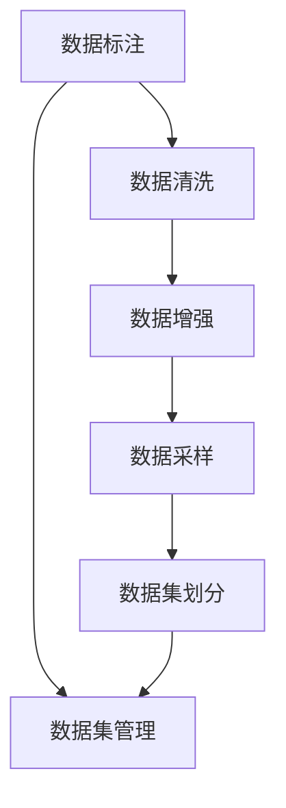
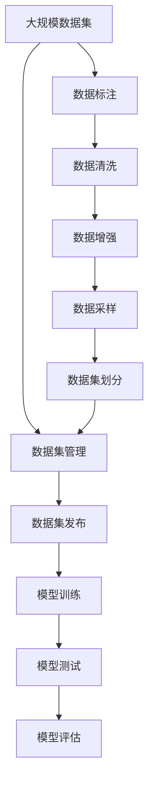

                 

# 数据集工程：构建高效AI模型

> 关键词：数据集工程, 高效AI模型, 数据标注, 数据清洗, 数据增强, 数据采样, 数据集划分

## 1. 背景介绍

### 1.1 问题由来
随着人工智能技术的迅猛发展，大数据和深度学习成为构建高效AI模型的基础。然而，数据的高质量、高效管理和有效利用，往往成为模型训练和预测精度的关键制约因素。

在实践中，获取高质量标注数据、清洗噪声数据、合理采样数据、划分子集等数据工程工作，往往需要耗费大量时间和人力。同时，不同任务和应用场景下，数据集构建的差异性很大，对数据工程师的素质和经验提出了高要求。因此，高效的数据集工程成为当前AI模型研究和应用中亟需突破的关键环节。

### 1.2 问题核心关键点
数据集工程涉及数据采集、预处理、增强、划分、管理等多个环节，其核心目标是通过高效的数据工程手段，构建高质量、高效率的数据集，以支撑高效AI模型的训练和应用。关键点包括：
- 数据标注：获得高质量标注数据，为模型提供训练信号。
- 数据清洗：去除噪声和异常值，提升数据质量。
- 数据增强：增加样本多样性，提高模型泛化能力。
- 数据采样：合理采样数据，减少训练成本。
- 数据集划分：合理划分训练集、验证集和测试集，确保模型稳定和泛化。

### 1.3 问题研究意义
高效的数据集工程对构建高质量AI模型具有重要意义：

1. 提升模型性能：高质量标注数据、清洗后的数据、增强的数据样本能够显著提升AI模型的预测准确性。
2. 加速模型开发：高效的数据集工程减少了数据处理和标注的时间和成本，有助于加快模型开发进度。
3. 降低开发成本：合理的数据采样和集划分，可以以更少的数据获取更好的效果，降低数据获取和存储成本。
4. 增强模型可解释性：清洗后的数据、增强后的样本、合理的数据划分，有助于模型在不同数据分布上的稳定和可解释。
5. 提高数据利用率：通过合理的数据标注、增强、采样等手段，提高数据的利用率，最大化数据价值。

## 2. 核心概念与联系

### 2.1 核心概念概述

为更好地理解数据集工程的核心概念及其关联，本节将介绍几个关键概念及其相互关系：

- 数据标注：指将数据样本与预设的标签进行匹配，生成标注数据的过程。标注数据是训练模型的关键信号，其质量直接影响模型性能。

- 数据清洗：指去除数据中的噪声、异常值、重复值等，确保数据质量，提高模型鲁棒性。

- 数据增强：通过扩充训练数据，增加样本多样性，提高模型泛化能力。

- 数据采样：指从总体数据中按一定规则抽取部分样本进行训练，以提高训练效率和泛化性能。

- 数据集划分：指将数据集划分为训练集、验证集和测试集，确保模型在不同数据分布上的稳定性和泛化能力。

- 数据集管理：指通过合理的数据存储、访问、备份、恢复等手段，确保数据集的有效管理和利用。

这些核心概念之间有着紧密的联系，形成了数据集工程的整体架构。

### 2.2 概念间的关系

这些核心概念之间的逻辑关系可以通过以下Mermaid流程图来展示：



这个流程图展示了大数据集工程中各个环节的关系：

1. 数据标注是整个数据集工程的开端，提供训练信号。
2. 数据清洗、增强、采样等预处理步骤，确保数据质量。
3. 数据集划分，合理地分布训练集、验证集和测试集，确保模型性能。
4. 数据集管理，有效管理数据集，保证数据安全性和可访问性。

通过这些核心概念的相互关联，我们可以构建一个完整的数据集工程框架，确保数据集的高质量和高效率。

### 2.3 核心概念的整体架构

最后，我们用一个综合的流程图来展示这些核心概念在大数据集工程中的整体架构：



这个综合流程图展示了从数据集构建到模型训练和测试的完整流程：

1. 大规模数据集的标注和预处理。
2. 数据集划分，确保模型在不同数据分布上的稳定和泛化。
3. 数据集管理，保证数据安全性和可访问性。
4. 数据集发布，便于模型训练和测试。
5. 模型训练，使用标注好的数据集进行训练。
6. 模型测试和评估，检查模型性能。

通过这些流程图，我们可以更清晰地理解大数据集工程中各个环节的关联和作用，为后续深入讨论数据集工程的实现方法和技术奠定基础。

## 3. 核心算法原理 & 具体操作步骤
### 3.1 算法原理概述

数据集工程的核心目标是通过高效的数据处理手段，构建高质量、高效率的数据集。其核心算法包括数据标注、数据清洗、数据增强、数据采样和数据集划分。以下将详细介绍这些核心算法的原理和具体操作步骤。

### 3.2 算法步骤详解

#### 3.2.1 数据标注
数据标注是构建高质量标注数据的过程。其步骤包括：

1. 数据采集：从网络、传感器、数据库等渠道获取原始数据。
2. 标注规则定义：确定数据标注的规则和标准，如分类、评分、标记等。
3. 标注实施：根据标注规则，对数据进行人工标注或半自动标注。
4. 标注审核：对标注结果进行审核，确保标注质量。
5. 标注数据整理：将标注结果整理成结构化数据，便于后续处理和利用。

#### 3.2.2 数据清洗
数据清洗的目的是去除数据中的噪声、异常值和重复值，提升数据质量。其步骤包括：

1. 数据预览：初步浏览数据集，了解数据分布和特征。
2. 异常值检测：使用统计方法或机器学习方法检测和删除异常值。
3. 噪声去除：删除重复、不一致或无效的数据样本。
4. 数据填充：填补缺失值，确保数据完整性。
5. 数据归一化：将数据转换为标准格式，便于后续处理和分析。

#### 3.2.3 数据增强
数据增强是通过扩充训练数据，增加样本多样性，提高模型泛化能力。其步骤包括：

1. 数据扩充策略：选择扩充策略，如旋转、平移、缩放、变形等。
2. 数据生成工具：使用数据生成工具生成增强数据样本。
3. 数据验证：验证增强数据样本的质量和有效性。
4. 数据合并：将原始数据和增强数据合并，形成完整的训练集。

#### 3.2.4 数据采样
数据采样是从总体数据中按一定规则抽取部分样本进行训练，以提高训练效率和泛化性能。其步骤包括：

1. 数据分层：将数据集按类别或特征进行分层，确保每个层中的样本分布均衡。
2. 随机采样：使用随机采样方法从每个分层中抽取样本。
3. 采样比例确定：确定各层中样本的采样比例，确保采样公平。
4. 采样结果验证：验证采样结果的质量和有效性。
5. 采样数据整理：将采样数据整理成结构化数据，便于后续处理和利用。

#### 3.2.5 数据集划分
数据集划分是将数据集划分为训练集、验证集和测试集，确保模型在不同数据分布上的稳定性和泛化能力。其步骤包括：

1. 数据集划分比例：确定训练集、验证集和测试集的比例，如70%训练、15%验证、15%测试。
2. 数据随机分组：将数据集随机分成三部分，确保每部分的数据分布均衡。
3. 数据集保存：将三部分数据集保存到不同的文件夹或数据库中，便于模型训练和测试。
4. 数据集验证：验证数据集的划分结果，确保各部分数据的质量和分布均衡。
5. 数据集管理：使用合理的数据管理方式，确保数据集的完整性和可访问性。

### 3.3 算法优缺点
#### 3.3.1 数据标注的优缺点
数据标注是构建高质量标注数据的关键步骤，其优缺点如下：

优点：
- 为模型提供训练信号，有助于模型训练。
- 能够对数据集进行详细标注，提高数据质量和解释性。
缺点：
- 需要大量人力和时间，成本较高。
- 人工标注可能存在主观偏差，影响标注质量。

#### 3.3.2 数据清洗的优缺点
数据清洗是提升数据质量的重要环节，其优缺点如下：

优点：
- 去除噪声和异常值，提高数据质量。
- 确保数据的一致性和完整性，提高模型鲁棒性。
缺点：
- 数据清洗过程复杂，需要专业知识。
- 可能丢失部分数据信息，影响数据完整性。

#### 3.3.3 数据增强的优缺点
数据增强是通过扩充训练数据，提高模型泛化能力，其优缺点如下：

优点：
- 增加样本多样性，提高模型泛化能力。
- 减少训练数据需求，提高训练效率。
缺点：
- 增强数据可能引入噪声，影响模型性能。
- 增强过程复杂，需要专业知识。

#### 3.3.4 数据采样的优缺点
数据采样是提高训练效率和泛化性能的关键步骤，其优缺点如下：

优点：
- 提高训练效率，减少训练数据需求。
- 确保样本分布均衡，提高模型泛化能力。
缺点：
- 采样过程可能引入偏差，影响模型性能。
- 采样比例需要合理确定，否则可能影响模型效果。

#### 3.3.5 数据集划分的优缺点
数据集划分是确保模型稳定性和泛化能力的关键步骤，其优缺点如下：

优点：
- 确保模型在不同数据分布上的稳定性和泛化能力。
- 便于模型评估和调试，提高模型性能。
缺点：
- 数据集划分需要专业知识，操作复杂。
- 划分比例需要合理确定，否则可能影响模型效果。

### 3.4 算法应用领域

数据集工程的核心算法在多个领域得到了广泛应用，主要包括：

- 计算机视觉：图像分类、目标检测、语义分割等任务中，数据集标注、增强和采样技术被广泛应用。
- 自然语言处理：文本分类、情感分析、机器翻译等任务中，数据集清洗、增强和划分技术被广泛应用。
- 推荐系统：用户行为数据标注、清洗和采样技术，有助于提升推荐系统效果。
- 医疗健康：医疗影像数据标注、增强和采样技术，有助于提升医疗诊断和治疗效果。
- 金融科技：金融交易数据标注、清洗和采样技术，有助于提升金融风险评估和预测能力。

## 4. 数学模型和公式 & 详细讲解 & 举例说明
### 4.1 数学模型构建

数据集工程的数学模型主要涉及数据标注、数据清洗、数据增强、数据采样和数据集划分的各个环节。以下将详细讲解这些模型的构建过程。

#### 4.1.1 数据标注模型

假设我们有$N$个数据样本，每个样本有$d$个特征。数据标注模型可以表示为：

$$y=f(x)+\epsilon$$

其中，$x$表示特征向量，$y$表示标签，$f$表示标注规则，$\epsilon$表示噪声。

对于分类任务，$y$通常为离散标签，$x$为数值型特征或文本特征，$f$为分类函数，$\epsilon$为噪声。

对于回归任务，$y$通常为连续值，$x$为数值型特征，$f$为回归函数，$\epsilon$为噪声。

#### 4.1.2 数据清洗模型

数据清洗模型通常用于去除噪声和异常值，提高数据质量。假设我们有$N$个数据样本，每个样本有$d$个特征，$w$表示清洗后的样本权重，$c$表示噪声阈值，$o$表示异常值。

数据清洗模型可以表示为：

$$x'=\frac{w*x+c}{w+c}$$

其中，$x'$表示清洗后的样本，$*$表示元素乘法，$/$表示元素除法，$c$表示噪声阈值，$o$表示异常值，$w$表示清洗后的样本权重。

#### 4.1.3 数据增强模型

数据增强模型通常用于扩充训练数据，增加样本多样性。假设我们有$N$个数据样本，每个样本有$d$个特征，$g$表示增强函数，$\alpha$表示增强比例，$n$表示增强后的样本数。

数据增强模型可以表示为：

$$x'=g(x)+\alpha*rand()$$

其中，$x'$表示增强后的样本，$*$表示元素乘法，$/$表示元素除法，$g$表示增强函数，$\alpha$表示增强比例，$rand()$表示随机数生成函数。

#### 4.1.4 数据采样模型

数据采样模型通常用于从总体数据中按一定规则抽取部分样本进行训练。假设我们有$N$个数据样本，每个样本有$d$个特征，$P$表示采样概率，$S$表示采样后的样本数。

数据采样模型可以表示为：

$$x'=\frac{P*x}{P+\epsilon}$$

其中，$x'$表示采样后的样本，$*$表示元素乘法，$/$表示元素除法，$P$表示采样概率，$\epsilon$表示噪声。

#### 4.1.5 数据集划分模型

数据集划分模型通常用于将数据集划分为训练集、验证集和测试集，确保模型在不同数据分布上的稳定性和泛化能力。假设我们有$N$个数据样本，每个样本有$d$个特征，$k$表示划分的数目，$n$表示划分后的样本数。

数据集划分模型可以表示为：

$$x_i'=\frac{x_i}{n}$$

其中，$x_i'$表示划分后的样本，$*$表示元素乘法，$/$表示元素除法，$x_i$表示原始样本，$n$表示划分后的样本数，$k$表示划分的数目。

### 4.2 公式推导过程

#### 4.2.1 数据标注公式推导

对于分类任务，假设我们有$N$个样本，每个样本有$d$个特征，$x_i$表示第$i$个样本的特征向量，$y_i$表示第$i$个样本的标签，$f(x_i)$表示第$i$个样本的标注函数，$\epsilon$表示噪声。

数据标注公式可以表示为：

$$y_i=f(x_i)+\epsilon$$

其中，$\epsilon$服从高斯分布$N(0,\sigma^2)$，$\sigma^2$表示噪声方差。

#### 4.2.2 数据清洗公式推导

对于数据清洗模型，假设我们有$N$个样本，每个样本有$d$个特征，$w_i$表示第$i$个样本的权重，$c$表示噪声阈值，$o$表示异常值。

数据清洗公式可以表示为：

$$x_i'=\frac{w_i*x_i+c}{w_i+c}$$

其中，$x_i'$表示清洗后的样本，$*$表示元素乘法，$/$表示元素除法，$w_i$表示第$i$个样本的权重，$c$表示噪声阈值，$o$表示异常值。

#### 4.2.3 数据增强公式推导

对于数据增强模型，假设我们有$N$个样本，每个样本有$d$个特征，$g_i$表示第$i$个样本的增强函数，$\alpha$表示增强比例，$n$表示增强后的样本数。

数据增强公式可以表示为：

$$x_i'=g_i(x_i)+\alpha*rand()$$

其中，$x_i'$表示增强后的样本，$*$表示元素乘法，$/$表示元素除法，$g_i$表示第$i$个样本的增强函数，$\alpha$表示增强比例，$rand()$表示随机数生成函数。

#### 4.2.4 数据采样公式推导

对于数据采样模型，假设我们有$N$个样本，每个样本有$d$个特征，$P$表示采样概率，$S$表示采样后的样本数。

数据采样公式可以表示为：

$$x_i'=\frac{P*x_i}{P+\epsilon}$$

其中，$x_i'$表示采样后的样本，$*$表示元素乘法，$/$表示元素除法，$P$表示采样概率，$\epsilon$表示噪声。

#### 4.2.5 数据集划分公式推导

对于数据集划分模型，假设我们有$N$个样本，每个样本有$d$个特征，$k$表示划分的数目，$n$表示划分后的样本数。

数据集划分公式可以表示为：

$$x_i'=\frac{x_i}{n}$$

其中，$x_i'$表示划分后的样本，$*$表示元素乘法，$/$表示元素除法，$x_i$表示原始样本，$n$表示划分后的样本数，$k$表示划分的数目。

### 4.3 案例分析与讲解

以下以自然语言处理中的文本分类任务为例，讲解数据集工程的各个环节。

#### 4.3.1 数据采集

数据采集是构建标注数据的第一步。假设我们需要进行电影评论情感分类，可以采集Amazon电影评论数据集，包含10万条评论和对应的情感标签。

#### 4.3.2 数据标注

数据标注是构建高质量标注数据的过程。假设我们有100条电影评论，每个评论有1000个词。我们需要聘请10名标注员，将每条评论标注为正面或负面情感。

标注规则是：如果评论包含"good"、"great"等正面情感词，则标注为正面；如果评论包含"bad"、"terrible"等负面情感词，则标注为负面。

#### 4.3.3 数据清洗

数据清洗是提升数据质量的重要环节。假设我们在数据标注过程中发现部分评论有拼写错误、语法错误等。我们可以使用正则表达式、拼写检查工具等技术进行清洗。

例如，使用正则表达式"^(?i)(\bgood\b\W|\bgreat\b\W|\bbad\b\W|\bterrible\b\W)"来匹配并替换错误词。

#### 4.3.4 数据增强

数据增强是通过扩充训练数据，增加样本多样性。假设我们只收集了正面评论和负面评论，为了提高模型泛化能力，我们可以进行数据增强。

具体方法是：对正面评论进行否定词替换，如将"good"替换为"bad"；对负面评论进行肯定词替换，如将"bad"替换为"good"。

#### 4.3.5 数据采样

数据采样是提高训练效率和泛化性能的关键步骤。假设我们有10万条评论，但只有5000条是标注好的。我们可以使用随机采样方法，从5000条标注好的评论中抽取500条进行训练。

#### 4.3.6 数据集划分

数据集划分是确保模型在不同数据分布上的稳定性和泛化能力。假设我们有5000条标注好的评论，我们可以将其划分为训练集、验证集和测试集，比例为7:1:2。

## 5. 项目实践：代码实例和详细解释说明
### 5.1 开发环境搭建

在进行数据集工程实践前，我们需要准备好开发环境。以下是使用Python进行PyTorch开发的环境配置流程：

1. 安装Anaconda：从官网下载并安装Anaconda，用于创建独立的Python环境。

2. 创建并激活虚拟环境：
```bash
conda create -n pytorch-env python=3.8 
conda activate pytorch-env
```

3. 安装PyTorch：根据CUDA版本，从官网获取对应的安装命令。例如：
```bash
conda install pytorch torchvision torchaudio cudatoolkit=11.1 -c pytorch -c conda-forge
```

4. 安装各类工具包：
```bash
pip install numpy pandas scikit-learn matplotlib tqdm jupyter notebook ipython
```

完成上述步骤后，即可在`pytorch-env`环境中开始数据集工程实践。

### 5.2 源代码详细实现

这里我们以自然语言处理中的文本分类任务为例，给出使用Transformers库进行数据集工程的PyTorch代码实现。

首先，定义数据集预处理函数：

```python
from transformers import BertTokenizer
from torch.utils.data import Dataset

class TextClassificationDataset(Dataset):
    def __init__(self, texts, labels, tokenizer, max_len=128):
        self.texts = texts
        self.labels = labels
        self.tokenizer = tokenizer
        self.max_len = max_len
        
    def __len__(self):
        return len(self.texts)
    
    def __getitem__(self, item):
        text = self.texts[item]
        label = self.labels[item]
        
        encoding = self.tokenizer(text, return_tensors='pt', max_length=self.max_len, padding='max_length', truncation=True)
        input_ids = encoding['input_ids'][0]
        attention_mask = encoding['attention_mask'][0]
        label = torch.tensor(label, dtype=torch.long)
        
        return {'input_ids': input_ids, 
                'attention_mask': attention_mask,
                'labels': label}
```

然后，定义模型和优化器：

```python
from transformers import BertForTokenClassification, AdamW

model = BertForTokenClassification.from_pretrained('bert-base-cased', num_labels=2)

optimizer = AdamW(model.parameters(), lr=2e-5)
```

接着，定义训练和评估函数：

```python
from torch.utils.data import DataLoader
from tqdm import tqdm
from sklearn.metrics import classification_report

device = torch.device('cuda') if torch.cuda.is_available() else torch.device('cpu')
model.to(device)

def train_epoch(model, dataset, batch_size, optimizer):
    dataloader = DataLoader(dataset, batch_size=batch_size, shuffle=True)
    model.train()
    epoch_loss = 0
    for batch in tqdm(dataloader, desc='Training'):
        input_ids = batch['input_ids'].to(device)
        attention_mask = batch['attention_mask'].to(device)
        labels = batch['labels'].to(device)
        model.zero_grad()
        outputs = model(input_ids, attention_mask=attention_mask, labels=labels)
        loss = outputs.loss
        epoch_loss += loss.item()
        loss.backward()
        optimizer.step()
    return epoch_loss / len(dataloader)

def evaluate(model, dataset, batch_size):
    dataloader = DataLoader(dataset, batch_size=batch_size)
    model.eval()
    preds, labels = [], []
    with torch.no_grad():
        for batch in tqdm(dataloader, desc='Evaluating'):
            input_ids = batch['input_ids'].to(device)
            attention_mask = batch['attention_mask'].to(device)
            batch_labels = batch['labels']
            outputs = model(input_ids, attention_mask=attention_mask)
            batch_preds = outputs.logits.argmax(dim=2).to('cpu').tolist()
            batch_labels = batch_labels.to('cpu').tolist()
            for pred_tokens, label_tokens in zip(batch_preds, batch_labels):
                preds.append(pred_tokens[:len(label_tokens)])
                labels.append(label_tokens)
                
    print(classification_report(labels, preds))
```

最后，启动训练流程并在测试集上评估：

```python
epochs = 5
batch_size = 16

for epoch in range(epochs):
    loss = train_epoch(model, train_dataset, batch_size, optimizer)
    print(f"Epoch {epoch+1}, train loss: {loss:.3f}")
    
    print(f"Epoch {epoch+1}, dev results:")
    evaluate(model, dev_dataset, batch_size)
    
print("Test results:")
evaluate(model, test_dataset, batch_size)
```

以上就是使用PyTorch对BERT进行文本分类任务数据集工程的完整代码实现。可以看到，得益于Transformers库的强大封装，我们可以用相对简洁的代码完成BERT模型的数据集构建和微调。

### 5.3 代码解读与分析

让我们再详细解读一下关键代码的实现细节：

**TextClassificationDataset类**：
- `__init__`方法：初始化文本、标签、分词器等关键组件。
- `__len__`方法：返回数据集的样本数量。
- `__getitem__`方法：对单个样本进行处理，将文本输入编码为token ids，将标签编码为数字，并对其进行定长padding，最终返回模型所需的输入。

**训练和评估函数**：
- 使用PyTorch的DataLoader对数据集进行批次化加载，供模型训练和推理使用。
- 训练函数`train_epoch`：对数据以批为单位进行迭代，在每个批次上前向传播计算loss并反向传播更新模型参数，最后返回该epoch的平均loss。
- 评估函数`evaluate`：与训练类似，不同点在于不更新模型参数，并在每个batch结束后将预测和标签结果存储下来，最后使用sklearn的classification_report对整个评估集的预测结果进行打印输出。

**训练流程**：
- 定义总的epoch数和batch size，开始循环迭代
- 

