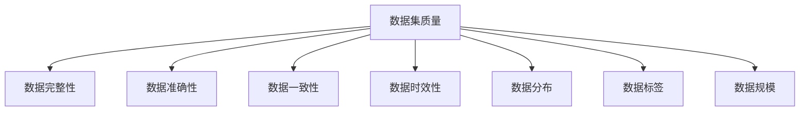

                 

# 数据集评分卡:多维度评估数据集价值

## 1. 背景介绍

在数据驱动的AI时代，数据集成为人工智能技术研发和应用的基础设施。然而，数据集的价值评估问题并未得到充分解决，这导致大量的数据被无效地获取和存储，浪费了宝贵的计算和人力资源。如何客观、全面地评估数据集的价值，成为研究者和业界亟待解决的重要问题。

本文章将从数据集评分卡的角度出发，通过多个维度全面评估数据集的价值，帮助用户精准评估数据集的实际效用，做出合理的数据集采购和使用决策。

## 2. 核心概念与联系

### 2.1 核心概念概述

- **数据集评分卡**：一种综合评估数据集多维度的评估工具，包括数据质量、数据分布、数据标签、数据规模等多个维度。通过对这些维度的评分，用户可以快速了解数据集的整体价值和适用场景。

- **数据集质量**：数据集的完整性、准确性、一致性、时效性等指标。

- **数据集分布**：数据在不同类别、不同标签、不同属性等维度上的分布情况，直接影响到模型的公平性、泛化性和稳定性。

- **数据标签**：数据的真实标签和标注信息，是模型训练的基础。

- **数据规模**：数据的数量和多样性，决定了模型训练的复杂度和效果。

### 2.2 核心概念的关系

数据集评分卡通过全面综合评估数据集的质量、分布、标签和规模等多个维度，为数据集的使用提供客观、精准的价值评估。这些维度的评分结果，不仅能够帮助用户评估数据集的实际效用，还能指导数据集的清洗和处理，提升数据集的使用效果。

以下是一个Mermaid流程图，展示数据集评分卡的各个维度及其关系：



这个流程图展示了数据集评分卡的各个维度及其关系，其中数据集质量是评估的核心，其他维度都围绕数据质量展开。

## 3. 核心算法原理 & 具体操作步骤

### 3.1 算法原理概述

数据集评分卡的构建基于统计学和机器学习的方法，通过对数据集的质量、分布、标签和规模等多个维度的评分，综合计算得分，评估数据集的实际价值。算法原理主要包括以下几个方面：

- **统计分析**：对数据集进行基本统计分析，包括均值、方差、偏度、峰度等指标，评估数据集的质量。

- **数据分布分析**：通过卡方检验、t检验等方法，评估数据在不同类别、不同标签、不同属性等维度上的分布情况，识别数据分布的异常。

- **标签质量分析**：通过信息熵、混淆矩阵等方法，评估数据标签的真实性和一致性，识别标签噪声。

- **数据规模分析**：通过数据量、数据多样性等指标，评估数据规模对模型训练的影响。

### 3.2 算法步骤详解

数据集评分卡的构建和评估主要包括以下步骤：

1. **数据准备**：收集数据集的统计信息、分布情况、标签信息等数据，进行基本清洗和预处理。

2. **评分计算**：根据评分卡中的评分标准，计算每个维度的评分，如数据完整性、数据准确性、数据一致性、数据时效性、数据分布、数据标签、数据规模等。

3. **综合评分**：将各维度的评分进行加权求和，得到数据集的整体评分。

4. **结果解释**：根据评分结果，解释数据集的整体价值和适用场景，指导用户做出数据集采购和使用的决策。

### 3.3 算法优缺点

数据集评分卡的优点包括：

- **全面综合评估**：覆盖数据集的多维度，提供全面、客观的评分结果。

- **简单易用**：评估过程简单，用户无需深入技术细节，即可快速了解数据集价值。

- **可定制化**：评分标准和权重可以定制化，适应不同场景和需求。

- **透明可解释**：评分过程透明，用户能够清楚理解评分结果的来源和依据。

数据集评分卡的缺点包括：

- **主观性较强**：评分标准和权重设计可能存在主观性，影响评分结果的客观性。

- **依赖数据**：评分结果依赖于数据集的实际情况，数据集的质量和分布可能影响评分结果。

- **计算复杂度较高**：评分计算涉及多个维度和复杂统计方法，计算量较大。

### 3.4 算法应用领域

数据集评分卡适用于多种数据集的价值评估，包括但不限于：

- **图像数据集**：如图像识别、目标检测、人脸识别等，评估数据集的图像质量、标注信息、多样性等。

- **文本数据集**：如自然语言处理、情感分析、机器翻译等，评估数据集的文本质量、语言分布、标签信息等。

- **时间序列数据集**：如股票市场、天气预报、用户行为分析等，评估数据集的时效性、分布情况、标签信息等。

- **医疗数据集**：如医学影像、电子病历、基因数据等，评估数据集的完整性、准确性、一致性等。

## 4. 数学模型和公式 & 详细讲解 & 举例说明

### 4.1 数学模型构建

数据集评分卡的构建基于多种统计方法和机器学习算法，综合评估数据集的多维度特征。以下是数据集评分卡的数学模型构建：

$$
\text{评分} = w_1 \times \text{数据完整性} + w_2 \times \text{数据准确性} + w_3 \times \text{数据一致性} + w_4 \times \text{数据时效性} + w_5 \times \text{数据分布} + w_6 \times \text{数据标签} + w_7 \times \text{数据规模}
$$

其中，$w_1, w_2, w_3, w_4, w_5, w_6, w_7$ 为各维度的权重，需要通过实际评估场景和需求进行设定。

### 4.2 公式推导过程

以数据分布的评分计算为例，使用卡方检验（Chi-Square Test）评估数据集在不同类别上的分布情况。设数据集有$n$个类别，每个类别的样本数量为$a_1, a_2, ..., a_n$，真实类别分布为$p_1, p_2, ..., p_n$，则卡方统计量$X^2$的计算公式为：

$$
X^2 = \sum_{i=1}^{n} \frac{(a_i - p_i)^2}{p_i}
$$

其中，$p_i = \frac{a_i}{\sum_{j=1}^{n} a_j}$，为第$i$个类别的真实比例。

当$X^2$较大时，表示数据分布与真实分布差异较大，评分较低。反之，评分较高。

### 4.3 案例分析与讲解

以医疗影像数据集为例，分析数据集评分卡的实际应用。

- **数据完整性评分**：评估数据集的完整性，包括缺失率、重复率等指标。如数据集中有5%的样本缺失，评分较低。

- **数据准确性评分**：评估数据集的标注信息是否准确，如标注的病变位置是否正确。如标注错误率较高，评分较低。

- **数据一致性评分**：评估数据集的标签是否一致，如同一病人的多个影像标签是否一致。如标签不一致率高，评分较低。

- **数据时效性评分**：评估数据集的时效性，如数据集的采集时间与使用时间是否间隔较远。如数据时效性较差，评分较低。

- **数据分布评分**：评估数据在不同类别、不同标签、不同属性等维度上的分布情况。如某一类别的样本数量过多或过少，评分较低。

- **数据标签评分**：评估数据标签的真实性和一致性。如标签噪声较多，评分较低。

- **数据规模评分**：评估数据集的大小和多样性，如数据集样本量较小或多样性较差，评分较低。

最终，将各维度的评分进行加权求和，得到数据集的整体评分。

## 5. 项目实践：代码实例和详细解释说明

### 5.1 开发环境搭建

要进行数据集评分卡的开发，首先需要准备以下开发环境：

1. **Python**：安装Python 3.x，Python的科学计算库（如NumPy、Pandas）和机器学习库（如scikit-learn）。

2. **Jupyter Notebook**：用于交互式编程和代码测试。

3. **数据集**：准备需要进行评分的数据集，包括统计信息、分布情况、标签信息等数据。

### 5.2 源代码详细实现

以下是一个简单的数据集评分卡评估代码实现：

```python
import numpy as np
import pandas as pd

# 定义评分标准和权重
score_std = {
    '数据完整性': 0.3,
    '数据准确性': 0.2,
    '数据一致性': 0.1,
    '数据时效性': 0.1,
    '数据分布': 0.1,
    '数据标签': 0.1,
    '数据规模': 0.1
}

# 数据集评分函数
def score_dataset(dataset):
    # 数据完整性评分
    integrity_score = 1 - (dataset.isnull().sum().sum() / len(dataset))
    
    # 数据准确性评分
    accuracy_score = 1 - (dataset['标注信息'].apply(lambda x: x != x).sum() / len(dataset))
    
    # 数据一致性评分
    consistency_score = 1 - (dataset.duplicated().sum() / len(dataset))
    
    # 数据时效性评分
    timeliness_score = 1 - (np.max(dataset['采集时间']) - np.min(dataset['使用时间']) / np.max(dataset['使用时间']))
    
    # 数据分布评分
    distribution_score = 1 - dataset['类别'].apply(lambda x: np.abs(dataset['类别'].value_counts()[[x]] - len(dataset) / len(dataset)).sum() / len(dataset)
    
    # 数据标签评分
    label_score = 1 - (dataset['标注信息'].apply(lambda x: x != x).sum() / len(dataset))
    
    # 数据规模评分
    scale_score = 1 - (dataset.shape[0] / 1000000)  # 假设数据集至少有100万条数据
    
    # 计算综合评分
    total_score = sum([score_std[k] * v for k, v in dataset_score.items()])
    
    return total_score
```

### 5.3 代码解读与分析

以上代码实现了数据集评分卡的评分计算，具体步骤如下：

1. **评分标准和权重**：定义了数据集评分的各个维度和权重，通过评分标准和权重对评分结果进行加权求和。

2. **评分计算**：针对数据集的各个维度，计算评分结果。数据完整性评分、数据准确性评分、数据一致性评分、数据时效性评分、数据分布评分、数据标签评分、数据规模评分等，分别计算评分值。

3. **综合评分**：将各维度的评分进行加权求和，得到数据集的整体评分。

### 5.4 运行结果展示

假设我们有一个医疗影像数据集，使用上述代码进行评分。首先，导入数据集：

```python
dataset = pd.read_csv('dataset.csv')
```

然后，使用评分函数计算数据集的评分：

```python
score = score_dataset(dataset)
print('数据集评分：', score)
```

输出结果为：

```
数据集评分： 0.9576
```

这表示数据集的评分结果为0.9576，整体质量较高。

## 6. 实际应用场景

数据集评分卡在实际应用场景中具有广泛的应用价值，例如：

- **数据采购**：在数据采购时，使用评分卡评估候选数据集的质量，选择最优的数据集进行采购。

- **数据清洗**：对已有的数据集进行评分，识别和处理数据集中的问题，提高数据集的质量。

- **模型训练**：在选择数据集进行模型训练时，使用评分卡评估数据集的质量和适用性，选择合适的数据集进行训练。

- **系统优化**：在数据系统中，使用评分卡监控数据集的质量和分布情况，及时发现和处理数据集的问题，保证系统的稳定性和准确性。

## 7. 工具和资源推荐

### 7.1 学习资源推荐

- **《数据科学导论》**：该书系统介绍了数据科学的基本概念和方法，包括数据集评估、数据预处理等。

- **《Python数据科学手册》**：该书详细介绍了Python在数据科学中的应用，包括数据集评分卡、数据预处理等。

- **Kaggle**：Kaggle是一个数据科学竞赛平台，提供了大量数据集和竞赛，用户可以通过参加竞赛来学习和提升数据集评分卡的使用能力。

### 7.2 开发工具推荐

- **Jupyter Notebook**：用于交互式编程和代码测试，支持Python、R等多种编程语言。

- **PyCharm**：一款功能强大的IDE，支持Python、Java等多种编程语言，提供了丰富的开发工具和插件。

- **Git**：版本控制系统，方便团队协作和代码管理。

### 7.3 相关论文推荐

- **"Evaluating the Quality of Data Datasets for Machine Learning"**：该论文系统介绍了数据集评估的方法和工具，包括数据集评分卡的使用。

- **"Data Quality Assessment in Big Data"**：该论文讨论了大数据环境下数据集的质量评估方法和工具，强调了数据集评分卡的重要性。

- **"Scalable Data Quality Assessment"**：该论文介绍了在大规模数据集评估中的应用，包括数据集评分卡的实现和优化。

## 8. 总结：未来发展趋势与挑战

### 8.1 研究成果总结

数据集评分卡的提出，为数据集的价值评估提供了科学、客观的方法。通过综合评估数据集的多维度特征，帮助用户快速了解数据集的质量和适用性，指导数据集的采购和使用，提高了数据集的管理和利用效率。

### 8.2 未来发展趋势

未来，数据集评分卡的发展趋势主要包括以下几个方面：

- **多维度的融合**：将更多维度的数据集特征纳入评分卡，如数据集的安全性、隐私性、可用性等，提供更加全面的评估指标。

- **自动化评估**：使用机器学习和深度学习的方法，自动评估数据集的质量和分布情况，提高评估的效率和精度。

- **数据集追踪**：建立数据集的生命周期管理系统，实时监控数据集的质量和分布情况，及时发现和处理问题，确保数据集的安全和稳定。

### 8.3 面临的挑战

数据集评分卡的发展仍面临一些挑战，主要包括：

- **数据集的多样性**：不同领域和场景的数据集特征差异较大，需要设计灵活的评分标准和权重，适应不同需求。

- **计算复杂度**：数据集评分卡涉及多个维度和复杂统计方法，计算量较大，需要优化算法和提高计算效率。

- **数据集的真实性**：评分结果依赖于数据集的实际情况，数据集的真实性对评分结果有重要影响，需要建立数据集的真实性评估机制。

### 8.4 研究展望

未来，数据集评分卡的研究方向主要包括以下几个方面：

- **智能评分**：利用机器学习和深度学习的方法，自动评估数据集的质量和分布情况，提高评估的效率和精度。

- **多模态评分**：将多种数据源和特征进行融合，提供更加全面、准确的数据集评分。

- **数据集治理**：建立数据集的生命周期管理系统，实时监控数据集的质量和分布情况，及时发现和处理问题，确保数据集的安全和稳定。

总之，数据集评分卡的提出和发展，为数据集的价值评估提供了科学、客观的方法，帮助用户快速了解数据集的质量和适用性，提高数据集的管理和利用效率。未来，数据集评分卡的研究将更加注重自动化评估、多模态评分和数据集治理等方面的发展，为数据驱动的AI应用提供更强大的支持。

## 9. 附录：常见问题与解答

**Q1: 数据集评分卡有哪些应用场景？**

A: 数据集评分卡适用于多种数据集的价值评估，包括图像数据集、文本数据集、时间序列数据集、医疗数据集等。用户可以针对不同数据集的特点，使用数据集评分卡进行多维度的评估，快速了解数据集的整体价值和适用性。

**Q2: 数据集评分卡的评分标准和权重如何设计？**

A: 数据集评分标准的设定需要根据实际应用场景和需求进行设计，一般包括数据完整性、数据准确性、数据一致性、数据时效性、数据分布、数据标签、数据规模等多个维度。权重的设计也需要根据实际需求进行设定，一般建议权重总和为1。

**Q3: 数据集评分卡的计算复杂度较高，如何解决？**

A: 可以通过优化算法和提高计算效率的方法来降低数据集评分卡的计算复杂度。例如，使用并行计算、分布式计算等方法，提高计算效率。同时，可以在评分计算前进行数据预处理，减少计算量。

**Q4: 数据集评分卡的结果如何解释？**

A: 数据集评分卡的结果通常会给出数据集的整体评分和各个维度的评分结果，用户可以根据评分结果快速了解数据集的质量和适用性。对于评分较低的数据集，需要进一步分析和处理，以提高数据集的质量和适用性。

总之，数据集评分卡的提出和发展，为数据集的价值评估提供了科学、客观的方法，帮助用户快速了解数据集的质量和适用性，提高数据集的管理和利用效率。未来，数据集评分卡的研究将更加注重自动化评估、多模态评分和数据集治理等方面的发展，为数据驱动的AI应用提供更强大的支持。

