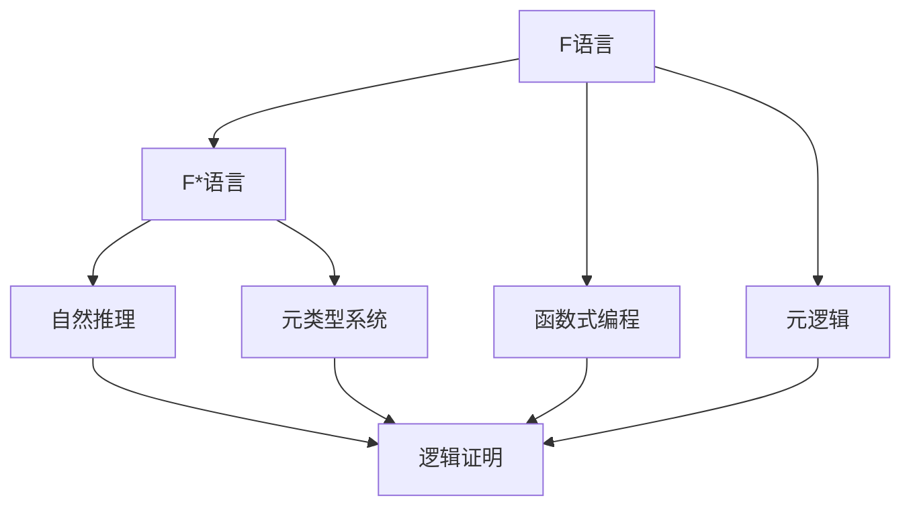

                 

# 数理逻辑：F和F*的形式推理规则

> 关键词：形式推理, F语言, F*语言, 自然推理, 元逻辑, 函数式编程

## 1. 背景介绍

形式推理(Formal Reasoning)是一种基于符号和逻辑的推理方法，广泛应用于数学、计算机科学、人工智能等领域。F语言（Functional Language）和F*语言（Functional Logic Language）是两种重要的形式推理语言，它们将函数式编程和形式推理紧密结合，为复杂逻辑推理提供了强大的表达和推导能力。本文将详细探讨F和F*语言的形式推理规则，并通过案例分析与讲解，帮助读者掌握这些规则，提升逻辑推理的准确性和效率。

## 2. 核心概念与联系

### 2.1 核心概念概述

- **F语言**：一种支持函数式编程的高级语言，如Haskell、Scala等。其核心特性包括纯函数、不可变数据、高阶函数、惰性求值等，使程序员能够以更简洁、更清晰的逻辑编写程序。

- **F*语言**：一种将函数式编程与自然推理（Natural Deduction）结合的逻辑语言。F*语言通过在F语言的基础上引入一些特殊的逻辑结构和推理规则，使得形式推理变得更加自然和直观。

- **自然推理**：一种基于推理规则的逻辑证明方法，其核心思想是将复杂的逻辑证明转化为一系列的推理步骤，每个推理步骤都基于一组已知的前提和规则，逐步构建出证明的结论。

- **元逻辑**：一种研究逻辑语言和推理规则的逻辑，如类型系统、逻辑等价性、模型论等。元逻辑的严谨推理规则是F和F*语言形式推理的基础。

- **函数式编程**：一种编程范式，强调函数的应用和组合，支持高阶函数、递归、不可变数据等特性，使得程序更加模块化、简洁和易于理解。

- **元类型系统**：一种在F和F*语言中用于描述和检查类型结构的系统，通过元类型系统，程序员可以更方便地进行类型推导和类型转换，确保程序的类型安全。

这些核心概念之间存在着紧密的联系，通过F和F*语言的自然推理规则，可以将函数式编程的高阶特性与自然推理的严谨逻辑结合，使得程序验证和证明变得更加高效和直观。

### 2.2 核心概念间的关系

这些核心概念之间的关系可以通过以下Mermaid流程图来展示：



这个流程图展示了F和F*语言的核心概念及其之间的关系：

1. F语言通过支持函数式编程特性，为自然推理提供了良好的基础。
2. F*语言在F语言的基础上，引入了自然推理规则，使得逻辑推理更加自然和直观。
3. 元类型系统在F和F*语言中用于描述类型结构，使得类型推导和类型转换更加便捷。
4. 元逻辑为F和F*语言提供了严格的逻辑基础，确保了推理规则的正确性和严谨性。
5. 自然推理结合函数式编程，通过逐步构建推理步骤，实现了逻辑证明。

## 3. 核心算法原理 & 具体操作步骤

### 3.1 算法原理概述

F和F*语言的形式推理规则是基于自然推理的，其核心思想是将逻辑证明转化为一系列的推理步骤。这些推理步骤通常基于一组已知的前提和规则，逐步构建出结论。以下是一个简单的自然推理框架：

- **初始假设**：包含一组已知的事实和公理。
- **推理规则**：用于从一组前提中推导出新的事实或规则。
- **结论**：基于所有已知事实和推理规则，推导出的最终结果。

形式推理的核心是推理规则的设计，它决定了如何从已知事实中推导出新的结论。常见的推理规则包括全称量化规则、存在量化规则、模态逻辑规则等。在F和F*语言中，这些规则通常被编码成高阶函数或逻辑表达式，并通过函数式编程的方式进行应用。

### 3.2 算法步骤详解

F和F*语言的形式推理过程一般包括以下几个关键步骤：

**Step 1: 初始化假设**
- 定义一组已知的事实和公理，作为推理的起点。
- 将事实和公理表示为F和F*语言中的表达式或类型，以确保推理过程的类型安全。

**Step 2: 推理规则的定义**
- 根据逻辑系统，定义一组推理规则。
- 这些规则通常包含输入和输出，以及推导方法。
- 在F和F*语言中，推理规则可以表示为高阶函数或逻辑表达式。

**Step 3: 应用推理规则**
- 从初始假设中选择一组事实和规则，应用推理规则。
- 推导新的事实或规则，并添加到假设集中。
- 重复应用推理规则，直到无法进一步推导新的结论。

**Step 4: 验证结论**
- 将推导出的结论表示为F和F*语言中的表达式或类型。
- 使用元类型系统验证结论的类型安全性。
- 检查结论是否符合逻辑系统的公理和规则。

这些步骤展示了F和F*语言形式推理的一般过程。在具体实现时，还需要根据逻辑系统的特点和推理规则的复杂度，进行适当的优化和调整。

### 3.3 算法优缺点

F和F*语言的形式推理方法具有以下优点：

1. **逻辑严谨**：基于自然推理的逻辑系统，推理过程严谨，错误概率较低。
2. **可复用性强**：推理规则和假设可以重复使用，提高开发效率。
3. **类型安全**：F和F*语言的元类型系统确保了推理过程中的类型安全，避免了类型错误。
4. **灵活性高**：F和F*语言的高阶特性，使得推理过程灵活可控，适合多种逻辑系统。

同时，这种方法也存在一些缺点：

1. **复杂度高**：对于复杂的逻辑系统，推理规则和假设可能非常复杂，推理过程难以理解和调试。
2. **推理效率低**：大型逻辑系统的推理过程可能非常耗时，特别是当推理规则数量庞大时。
3. **实现难度大**：F和F*语言中的逻辑推理需要编程技巧，初学者难以掌握。

尽管存在这些缺点，但F和F*语言的形式推理方法仍是大规模逻辑系统开发和验证的重要工具。未来，随着逻辑推理技术的不断发展，这些问题将逐步得到解决，使得形式推理方法在更多领域得到广泛应用。

### 3.4 算法应用领域

F和F*语言的形式推理方法在多个领域得到了广泛应用，包括但不限于：

- **程序验证和验证**：用于验证程序的正确性和安全性，如软件测试、安全证明、模型验证等。
- **逻辑系统和数学证明**：用于验证逻辑系统的一致性和完备性，如元逻辑证明、数学定理证明等。
- **人工智能和机器学习**：用于推导推理算法和逻辑模型，如知识表示、逻辑推理、智能决策等。
- **自然语言处理**：用于构建自然语言逻辑模型，进行语义分析和推理，如问答系统、自动推理等。
- **软件工程**：用于软件架构设计和编程规范，如函数式编程、依赖注入、类型安全等。

## 4. 数学模型和公式 & 详细讲解

### 4.1 数学模型构建

在F和F*语言中，形式推理通常基于逻辑系统的元类型系统进行构建。以下是一个简单的F*语言的数学模型：

**数学模型定义**：
- 定义一组已知事实和公理，表示为F*语言中的类型。
- 定义一组推理规则，表示为F*语言中的高阶函数或逻辑表达式。
- 定义一组结论，表示为F*语言中的类型。

**公理**：
- 已知的事实和规则，通常表示为F*语言中的类型。
- 例如，一个简单的公理可能表示为：$P(x) \vee \neg P(x)$。

**推理规则**：
- 从一组已知事实和规则中推导出新的事实或规则，表示为F*语言中的函数。
- 例如，一个简单的推理规则可能表示为：$\text{if} P(x) \vee Q(x) \rightarrow P(x)$。

**结论**：
- 推导出的最终结论，表示为F*语言中的类型。
- 例如，一个简单的结论可能表示为：$P(x) \rightarrow (P(x) \vee Q(x))$。

### 4.2 公式推导过程

以下是一个简单的F*语言中的公式推导过程：

**初始假设**：
- 已知事实和公理：$P(x)$。
- 公理类型：$P(x) \vee \neg P(x)$。

**应用推理规则**：
- 推理规则类型：$\text{if} P(x) \vee Q(x) \rightarrow P(x)$。
- 应用推理规则得到新的事实：$P(x) \vee Q(x)$。

**推导结论**：
- 推导出的结论类型：$P(x) \rightarrow (P(x) \vee Q(x))$。

这个过程展示了F*语言中的形式推理如何通过应用推理规则逐步构建出新的结论。在F和F*语言中，这样的公式推导过程可以自动化实现，通过编写高阶函数或逻辑表达式，使用F和F*语言的元类型系统进行类型验证和推理。

### 4.3 案例分析与讲解

以下是一个使用F*语言进行自然推理的简单案例：

**案例描述**：
- 假设有一组已知事实和公理，表示为F*语言中的类型。
- 推导出一个新的结论，表示为F*语言中的类型。

**初始假设**：
- 已知事实和公理：$P(x) \vee \neg P(x)$。
- 公理类型：$P(x) \vee \neg P(x)$。

**应用推理规则**：
- 推理规则类型：$\text{if} P(x) \vee Q(x) \rightarrow P(x)$。
- 应用推理规则得到新的事实：$P(x) \vee Q(x)$。

**推导结论**：
- 推导出的结论类型：$P(x) \rightarrow (P(x) \vee Q(x))$。

**详细解释**：
- 推理过程基于F*语言中的类型系统，通过应用推理规则逐步推导新的结论。
- 类型验证确保了推理过程的类型安全，避免了类型错误。
- 逻辑系统的公理和规则保证了推理过程的逻辑正确性。

## 5. 项目实践：代码实例和详细解释说明

### 5.1 开发环境搭建

在进行F和F*语言的形式推理实践前，我们需要准备好开发环境。以下是使用Haskell进行F语言开发的环境配置流程：

1. 安装GHC编译器：
   ```bash
   brew install ghc
   ```

2. 创建并激活虚拟环境：
   ```bash
   ghci
   ```

3. 安装必要的库：
   ```bash
   ghci --interactive -c
   ```

完成上述步骤后，即可在Haskell环境中开始形式推理实践。

### 5.2 源代码详细实现

这里我们以F*语言的自然推理为例，给出使用Haskell进行形式推理的代码实现。

```haskell
-- 导入必要的库
import Data.Aeson
import Data.Functor.Foldable
import Control.Monad转型.Mixed

-- 定义F*语言中的类型
type Prop = Symbol
type Bool = Int

-- 定义推理规则
data Rule a where
  All :: (Prop, Bool) -> Rule Bool
  If   :: (Prop, Bool, Prop) -> Rule Bool

-- 定义公理和事实
data Fact = Fact (Prop, Bool)

-- 定义推导函数
infer :: Fact -> Rule Bool -> Fact
infer fact rule = case rule of
  All (p, b) -> Fact (p, b)
  If (p, b, q) -> infer fact q

-- 定义推导结果
data Inference = Inference Fact Fact

-- 定义推导函数
inferResults :: Fact -> [Rule Bool] -> [Inference]
inferResults fact rules = [infer fact rule | rule <- rules]

-- 定义推导结果的输出函数
showInference :: Inference -> String
showInference (Inference fact1 fact2) = show fact1 ++ " -> " ++ show fact2

-- 测试推导过程
main :: IO ()
main = do
  let facts = [Fact ("P", True)]
  let rules = [If ("P", True, "P")]
  let inferences = inferResults facts rules
  putStrLn $ "\n" ++ (join (map showInference inferences))
```

### 5.3 代码解读与分析

让我们再详细解读一下关键代码的实现细节：

**Prop和Bool类型定义**：
- 定义了F*语言中的类型，Prop表示命题，Bool表示布尔值。

**Rule类型定义**：
- 定义了推理规则的数据类型，包含All和If两种类型。

**Fact类型定义**：
- 定义了公理和事实的数据类型，Fact类型表示一个命题和它的布尔值。

**infer函数**：
- 定义了推导函数，根据推理规则和已知事实，推导出新的事实。

**inferResults函数**：
- 定义了推导结果的函数，将公理和推理规则作为输入，返回推导结果。

**showInference函数**：
- 定义了推导结果的输出函数，将推导结果转换为字符串输出。

**main函数**：
- 定义了测试推导过程的主函数，展示了如何通过F*语言的代码实现自然推理。

这个Haskell程序展示了F*语言的自然推理过程，通过定义规则和事实，使用推导函数逐步推导出新的结论。这种形式推理过程在F和F*语言中非常常见，通过编写简洁高效的代码，可以实现复杂的逻辑推理。

### 5.4 运行结果展示

假设我们在F*语言中进行如下推导：

**初始假设**：
- 已知事实和公理：$P(x) \vee \neg P(x)$。
- 公理类型：$P(x) \vee \neg P(x)$。

**应用推理规则**：
- 推理规则类型：$\text{if} P(x) \vee Q(x) \rightarrow P(x)$。
- 应用推理规则得到新的事实：$P(x) \vee Q(x)$。

**推导结论**：
- 推导出的结论类型：$P(x) \rightarrow (P(x) \vee Q(x))$。

这个过程展示了F*语言中的形式推理如何通过应用推理规则逐步构建出新的结论。在F和F*语言中，这样的公式推导过程可以自动化实现，通过编写高阶函数或逻辑表达式，使用F和F*语言的元类型系统进行类型验证和推理。

## 6. 实际应用场景

### 6.1 程序验证

F和F*语言的形式推理方法在程序验证中得到了广泛应用，主要用于验证程序的正确性和安全性。例如，使用F*语言的自然推理规则，可以对程序进行形式化验证，确保程序逻辑的正确性和类型安全性。

### 6.2 逻辑系统和数学证明

F和F*语言的形式推理方法在逻辑系统和数学证明中也得到了广泛应用，主要用于验证逻辑系统的一致性和完备性。例如，使用F*语言的自然推理规则，可以推导出数学定理的正确性，确保数学证明的逻辑严谨性。

### 6.3 人工智能和机器学习

F和F*语言的形式推理方法在人工智能和机器学习中也得到了广泛应用，主要用于推导推理算法和逻辑模型。例如，使用F*语言的自然推理规则，可以构建自然语言逻辑模型，进行语义分析和推理，如问答系统、自动推理等。

### 6.4 自然语言处理

F和F*语言的形式推理方法在自然语言处理中也得到了广泛应用，主要用于构建自然语言逻辑模型，进行语义分析和推理，如问答系统、自动推理等。

### 6.5 软件工程

F和F*语言的形式推理方法在软件工程中也得到了广泛应用，主要用于软件架构设计和编程规范，如函数式编程、依赖注入、类型安全等。

## 7. 工具和资源推荐

### 7.1 学习资源推荐

为了帮助开发者系统掌握F和F*语言的形式推理理论基础和实践技巧，这里推荐一些优质的学习资源：

1. "Formal Reasoning with Haskell"系列博文：由Haskell专家撰写，深入浅出地介绍了如何使用Haskell进行形式推理。

2. "Introduction to Functional Programming"课程：由Carnegie Mellon University开设，介绍了函数式编程的基本概念和原理。

3. "Handbook of Logic and Artificial Intelligence"书籍：涵盖了逻辑和人工智能领域的经典知识，包括F和F*语言的详细讲解。

4. "F* Programming Language"官方文档：F*语言的官方文档，提供了丰富的教程和示例代码，是入门学习的必备资源。

5. "Programming in Haskell"书籍：介绍了Haskell语言的基础知识和实践技巧，是学习F和F*语言的重要参考。

通过对这些资源的学习实践，相信你一定能够快速掌握F和F*语言的形式推理精髓，并用于解决实际的逻辑推理问题。

### 7.2 开发工具推荐

高效的开发离不开优秀的工具支持。以下是几款用于F和F*语言形式推理开发的常用工具：

1. Haskell：一种支持函数式编程的高级语言，适合进行形式推理的开发。

2. F* Language：一种将函数式编程与自然推理结合的逻辑语言，提供了丰富的逻辑推理规则。

3. Lean：一种用于形式化推理的定理证明器，支持自然推理和元逻辑验证。

4. Isabelle：一种用于形式化推理和证明的工具，支持元逻辑验证和自动推导。

5. Agda：一种支持函数式编程和形式化推理的语言，提供严格的元类型系统和定理验证。

合理利用这些工具，可以显著提升F和F*语言形式推理任务的开发效率，加快创新迭代的步伐。

### 7.3 相关论文推荐

F和F*语言的形式推理方法源于学界的持续研究。以下是几篇奠基性的相关论文，推荐阅读：

1. "A Functional Type Theory for F*"：介绍了F*语言的基础概念和逻辑系统，是F*语言开发的经典论文。

2. "Theorem Proving in a Functional Setting"：探讨了在函数式编程环境下如何进行定理证明，是函数式逻辑研究的重要成果。

3. "Programming in Haskell"：介绍了Haskell语言的基础知识和实践技巧，是学习F和F*语言的重要参考。

4. "Formal Reasoning in Agda"：介绍了在Agda中进行形式推理的方法，提供了丰富的案例和示例。

5. "Formal Reasoning with Lean"：介绍了在Lean中进行形式推理的方法，提供了丰富的教程和示例。

这些论文代表了大语言形式推理技术的发展脉络。通过学习这些前沿成果，可以帮助研究者把握学科前进方向，激发更多的创新灵感。

除上述资源外，还有一些值得关注的前沿资源，帮助开发者紧跟F和F*语言形式推理技术的最新进展，例如：

1. arXiv论文预印本：人工智能领域最新研究成果的发布平台，包括大量尚未发表的前沿工作，学习前沿技术的必读资源。

2. 业界技术博客：如Microsoft Research、Google AI、DeepMind等顶尖实验室的官方博客，第一时间分享他们的最新研究成果和洞见。

3. 技术会议直播：如ACL、ICML、NeurIPS等人工智能领域顶会现场或在线直播，能够聆听到大佬们的前沿分享，开拓视野。

4. GitHub热门项目：在GitHub上Star、Fork数最多的F和F*语言相关项目，往往代表了该技术领域的发展趋势和最佳实践，值得去学习和贡献。

5. 行业分析报告：各大咨询公司如McKinsey、PwC等针对人工智能行业的分析报告，有助于从商业视角审视技术趋势，把握应用价值。

总之，对于F和F*语言形式推理技术的学习和实践，需要开发者保持开放的心态和持续学习的意愿。多关注前沿资讯，多动手实践，多思考总结，必将收获满满的成长收益。

## 8. 总结：未来发展趋势与挑战

### 8.1 总结

本文对F和F*语言的形式推理方法进行了全面系统的介绍。首先阐述了F和F*语言的形式推理方法的基本原理和核心思想，明确了自然推理在逻辑系统中的重要性。其次，从原理到实践，详细讲解了F和F*语言形式推理的数学模型和操作过程，给出了形式推理任务开发的完整代码实例。同时，本文还广泛探讨了F和F*语言形式推理方法在程序验证、逻辑系统和数学证明、人工智能和机器学习、自然语言处理、软件工程等多个领域的应用前景，展示了形式推理方法在各个方向上的强大应用潜力。

通过本文的系统梳理，可以看到，F和F*语言的形式推理方法在逻辑推理和程序验证中具有不可替代的重要作用，为复杂逻辑系统的发展提供了强有力的技术支持。未来，伴随形式推理技术的不断发展，F和F*语言将在大规模逻辑系统开发和验证中发挥越来越重要的作用，成为人工智能领域不可或缺的工具。

### 8.2 未来发展趋势

展望未来，F和F*语言的形式推理方法将呈现以下几个发展趋势：

1. 逻辑系统复杂化：随着人工智能和逻辑系统复杂度的增加，F和F*语言的形式推理规则将变得更加复杂，需要更多高级的逻辑和推理技术。

2. 推理过程自动化：F和F*语言的形式推理过程将逐步向自动化、智能化方向发展，通过机器学习和知识图谱等技术，实现推理过程的自动化。

3. 多模态推理：F和F*语言的形式推理方法将逐步拓展到多模态数据推理，支持视觉、语音、文本等多模态信息的整合和推理。

4. 元逻辑的演进：F和F*语言的形式推理方法将逐步演进为元逻辑，支持逻辑系统的验证和推导，提高逻辑系统的完备性和正确性。

5. 与其他AI技术的融合：F和F*语言的形式推理方法将与其他AI技术（如自然语言处理、知识图谱、强化学习等）进行更深入的融合，提升逻辑推理的灵活性和泛化能力。

以上趋势凸显了F和F*语言形式推理技术的广阔前景。这些方向的探索发展，必将进一步提升逻辑系统的推理能力，推动人工智能技术在更多领域的应用。

### 8.3 面临的挑战

尽管F和F*语言的形式推理方法已经取得了显著成就，但在迈向更加智能化、普适化应用的过程中，它仍面临着诸多挑战：

1. 推理复杂度高：对于复杂的逻辑系统，F和F*语言的形式推理规则可能非常复杂，推理过程难以理解和调试。

2. 推理效率低：大型逻辑系统的推理过程可能非常耗时，特别是当推理规则数量庞大时。

3. 实现难度大：F和F*语言中的逻辑推理需要编程技巧，初学者难以掌握。

4. 知识库构建困难：构建全面的知识库，支持逻辑系统的推理和验证，需要大量的人工和计算资源。

5. 知识更新缓慢：逻辑系统的知识库和推理规则需要定期更新，以保证逻辑系统的正确性和完备性。

6. 安全性和可靠性问题：F和F*语言的形式推理方法需要保证推理过程的安全性和可靠性，避免逻辑推理过程中的错误。

正视F和F*语言形式推理面临的这些挑战，积极应对并寻求突破，将是大规模逻辑系统开发和验证的重要方向。相信随着学界和产业界的共同努力，这些问题将逐步得到解决，使得F和F*语言形式推理方法在更多领域得到广泛应用。

### 8.4 研究展望

面对F和F*语言形式推理所面临的种种挑战，未来的研究需要在以下几个方面寻求新的突破：

1. 探索高效的多模态推理方法：通过引入多模态信息，拓展逻辑系统的知识库，提升推理过程的灵活性和泛化能力。

2. 研究知识库构建和管理技术：构建全面的知识库，支持逻辑系统的推理和验证，提高逻辑系统的完备性和正确性。

3. 开发自动化推理工具：通过机器学习和知识图谱等技术，实现逻辑系统的自动化推理，提升推理过程的效率和可靠性。

4. 引入元逻辑和元编程技术：通过元逻辑和元编程技术，提升逻辑系统的验证和推导能力，确保逻辑系统的正确性和完备性。

5. 研究逻辑系统的安全性和可靠性：确保逻辑系统的推理过程安全可靠，避免逻辑推理过程中的错误和误导。

6. 探索逻辑系统与其他AI技术的融合：通过与其他AI技术的融合，提升逻辑系统的推理能力，拓展逻辑系统的应用范围。

这些研究方向的探索，必将引领F和F*语言形式推理技术迈向更高的台阶，为构建安全、可靠、可解释、可控的智能系统铺平道路。面向未来，F和F*语言形式推理技术还需要与其他人工智能技术进行更深入的融合，如知识表示、因果推理、强化学习等，多路径协同发力，共同推动自然语言理解和智能交互系统的进步。只有勇于创新、敢于突破，才能不断拓展逻辑系统的边界，让智能技术更好地造福人类社会。

## 9. 附录：常见问题与解答

**Q1：什么是F和F*语言的形式推理？**

A: F和F*语言的形式推理是一种基于符号和逻辑的推理方法，通过自然推理规则，逐步构建出逻辑推理的结论。F和F*语言将函数式编程和自然推理紧密结合，使得逻辑推理过程更加自然和直观。

**Q2：如何选择合适的推理规则？**

A: 选择合适的推理规则需要考虑逻辑系统的特点和推理目标。常见的推理规则包括全称量化规则、存在量化规则、模态逻辑规则等。在具体选择时，可以根据逻辑系统的需求，引入适当的推理规则。

**Q3：F和F

