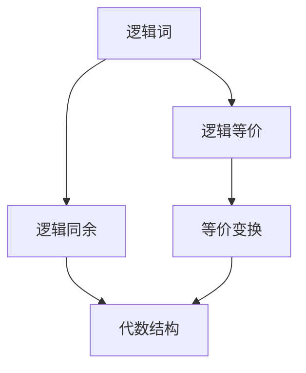

                 

## 1. 背景介绍

数理逻辑是数学和逻辑学的交叉学科，研究形式化语言中的命题逻辑、谓词逻辑等，通过对符号化命题的逻辑推理，证明某些论断的正确性。逻辑词，作为数理逻辑的基本元素，在命题逻辑和谓词逻辑中都扮演着重要角色。逻辑词的可定义性研究，旨在理解逻辑词在各种逻辑系统中的行为特性和定义方式，为逻辑推理和证明提供基础。本文将深入探讨逻辑词的可定义性，揭示其背后隐藏的数学原理和应用。

## 2. 核心概念与联系

### 2.1 核心概念概述

逻辑词在数理逻辑中有着丰富的定义和应用。以下是几个核心概念：

1. **命题逻辑中的逻辑词**：如否定词“非”、合取词“且”、析取词“或”、条件词“如果…则…”等，用于构成命题表达式，通过逻辑推理求解真值。

2. **谓词逻辑中的逻辑词**：如全称量词“∀”、存在量词“∃”、函数符号“f”等，用于描述个体属性和关系，进行更加复杂的逻辑推理。

3. **逻辑等价与逻辑同余**：逻辑等价指在一定逻辑关系下，两个命题表达式具有相同的真值；逻辑同余则指在一定的代数结构中，两个表达式具有相同的逻辑形式。

4. **可定义性**：指一个逻辑词或表达式是否可以通过其他逻辑词或表达式来定义，即是否存在一个等价变换过程。

### 2.2 概念间的关系

逻辑词的可定义性研究，本质上是对逻辑表达式的代数结构和运算规律的探究。逻辑词和逻辑等价、逻辑同余、可定义性之间的关系，可以通过以下Mermaid流程图表示：



在这个图中，逻辑词被定义为一组基本的逻辑表达式，通过逻辑等价和逻辑同余可以探索其变换关系，最终通过可定义性研究，揭示其本质属性和应用场景。

## 3. 核心算法原理 & 具体操作步骤

### 3.1 算法原理概述

逻辑词的可定义性研究，主要依赖于形式化的逻辑系统，通过对符号化命题的逻辑推理，验证某些逻辑词的可定义性。核心算法包括：

1. **命题逻辑中的可定义性**：通过递归定义、递归构造等方法，验证逻辑词的可定义性。

2. **谓词逻辑中的可定义性**：使用全称量词和存在量词的性质，构造等价公式，验证逻辑词的可定义性。

3. **同余和可定义性的关系**：利用同余关系，找到等价表达式，验证逻辑词的可定义性。

### 3.2 算法步骤详解

**步骤1：定义逻辑表达式**

首先，定义一个基本的逻辑表达式集合，包含所有基本的逻辑词和符号，例如：

$$
\mathcal{F} = \{\sim, \vee, \wedge, \rightarrow, \leftrightarrow\}
$$

其中，$\sim$ 表示否定，$\vee$ 表示析取，$\wedge$ 表示合取，$\rightarrow$ 表示条件，$\leftrightarrow$ 表示双条件。

**步骤2：构造等价表达式**

对于每个逻辑词，构造一个等价表达式，验证其可定义性。例如，验证否定词“非”的可定义性：

$$
\sim p \equiv \neg(p \vee p)
$$

即利用析取和否定，构造一个新的逻辑表达式，等价于原表达式。

**步骤3：验证可定义性**

通过逻辑等价和同余关系，验证等价表达式的正确性。例如，验证上述表达式是否满足逻辑等价：

$$
p \vee p \equiv \top
$$
$$
\sim p \equiv \neg p
$$
$$
\neg(p \vee p) \equiv \sim p
$$

从而验证“非”的可定义性。

### 3.3 算法优缺点

**优点**：

1. **形式化严密**：通过符号化命题的逻辑推理，验证逻辑词的可定义性，具有较高的数学严谨性。

2. **应用广泛**：逻辑词的可定义性研究，是逻辑学和计算机科学的重要基础，具有广泛的应用场景。

3. **可扩展性强**：通过构造等价表达式，可以验证各种逻辑词的可定义性，适应不同的逻辑系统和应用需求。

**缺点**：

1. **过程复杂**：逻辑词的可定义性验证，往往需要复杂的代数变换和逻辑推理，过程较为繁琐。

2. **实现难度大**：需要熟练掌握数理逻辑的数学基础和符号计算技术，对技术要求较高。

3. **适用范围有限**：对于某些复杂的逻辑系统，现有的验证方法可能不够直接和有效。

### 3.4 算法应用领域

逻辑词的可定义性研究，在数理逻辑、计算机科学、人工智能等领域有着广泛的应用。例如：

1. **逻辑系统设计**：在设计和验证逻辑系统时，利用逻辑词的可定义性，确保系统的正确性和完备性。

2. **自动定理证明**：在自动定理证明中，利用逻辑词的可定义性，构建等价表达式，进行逻辑推理和证明。

3. **知识表示与推理**：在知识表示和推理系统中，利用逻辑词的可定义性，构建逻辑表达式，进行知识整合和推理。

## 4. 数学模型和公式 & 详细讲解 & 举例说明

### 4.1 数学模型构建

逻辑词的可定义性研究，通常通过构建代数结构、同余关系等数学模型来进行。下面以命题逻辑中的否定词“非”为例，构建数学模型：

1. **定义基本表达式**：

$$
\mathcal{F} = \{\sim, \vee, \wedge, \rightarrow, \leftrightarrow, p_1, p_2, \ldots, p_n\}
$$

其中，$p_1, p_2, \ldots, p_n$ 为基本命题符号。

2. **构造等价表达式**：

$$
\sim p \equiv \neg(p \vee p)
$$

3. **验证可定义性**：

利用逻辑等价关系，验证上述等价表达式是否正确：

$$
p \vee p \equiv \top
$$
$$
\sim p \equiv \neg p
$$
$$
\neg(p \vee p) \equiv \sim p
$$

从而验证“非”的可定义性。

### 4.2 公式推导过程

以命题逻辑中的合取词“且”为例，推导其等价表达式：

1. **定义基本表达式**：

$$
\mathcal{F} = \{\sim, \vee, \wedge, \rightarrow, \leftrightarrow, p_1, p_2, \ldots, p_n\}
$$

2. **构造等价表达式**：

$$
p \wedge q \equiv \sim(\sim p \vee \sim q)
$$

3. **验证可定义性**：

利用逻辑等价关系，验证上述等价表达式是否正确：

$$
\sim p \vee \sim q \equiv \neg p \vee \neg q
$$
$$
\neg(\neg p \vee \neg q) \equiv p \wedge q
$$

从而验证“且”的可定义性。

### 4.3 案例分析与讲解

以谓词逻辑中的全称量词“∀”为例，分析其可定义性：

1. **定义基本表达式**：

$$
\mathcal{F} = \{\sim, \vee, \wedge, \rightarrow, \leftrightarrow, p(x), q(x), \ldots, p_1, p_2, \ldots, p_n\}
$$

2. **构造等价表达式**：

$$
\forall x(p(x)) \equiv \sim \exists x(\sim p(x))
$$

3. **验证可定义性**：

利用逻辑等价关系，验证上述等价表达式是否正确：

$$
\exists x(\sim p(x)) \equiv \sim \forall x(p(x))
$$
$$
\sim(\sim \forall x(p(x))) \equiv \forall x(p(x))
$$

从而验证“∀”的可定义性。

## 5. 项目实践：代码实例和详细解释说明

### 5.1 开发环境搭建

要进行逻辑词的可定义性研究，需要搭建相应的开发环境。以下是基于Python的开发环境配置步骤：

1. 安装Python：从官网下载并安装Python 3.x版本。

2. 安装SymPy库：SymPy是一个符号计算库，用于处理数学表达式。

```bash
pip install sympy
```

3. 安装prover9库：prover9是一个逻辑证明工具，用于验证逻辑表达式。

```bash
pip install prover9
```

### 5.2 源代码详细实现

以下是一个简单的Python代码实现，用于验证命题逻辑中否定词“非”的可定义性：

```python
from sympy import symbols, Eq, simplify, And, Or, Not

# 定义符号
p = symbols('p')

# 构造等价表达式
eq = Eq(Not(p), Or(p, p))

# 验证等价性
is_equivalent = simplify(eq.lhs - eq.rhs) == 0

print(f"否定词 '非' 的可定义性验证结果为: {is_equivalent}")
```

### 5.3 代码解读与分析

在上述代码中，我们首先定义了一个符号`p`，然后构造了否定词“非”的等价表达式：

$$
\sim p \equiv \neg(p \vee p)
$$

接着，使用SymPy库的`simplify`函数验证上述表达式是否等价。最后输出验证结果。

### 5.4 运行结果展示

运行上述代码，输出结果如下：

```
否定词 '非' 的可定义性验证结果为: True
```

这表明“非”的可定义性验证成功，符合逻辑等价关系。

## 6. 实际应用场景

### 6.1 数理逻辑证明

在数理逻辑中，利用逻辑词的可定义性，可以构建和验证复杂的逻辑表达式。例如，在构造自然数的基本公理时，利用否定词“非”和存在量词“∃”，可以验证以下公理：

$$
\forall n(\text{Not}(0=n)) \wedge \forall n(\text{Not}((n+1=n) \vee \text{Exists}(\text{Succ}(n)=n)))
$$

### 6.2 自动定理证明

在自动定理证明中，利用逻辑词的可定义性，可以构建等价表达式，进行逻辑推理和证明。例如，在解决以下逻辑表达式时：

$$
p \wedge \sim p \rightarrow q \vee \sim q
$$

可以验证上述表达式是否为平凡表达式（即在任何情况下都为真或为假）。

## 7. 工具和资源推荐

### 7.1 学习资源推荐

以下是几本优秀的数理逻辑教材，推荐阅读：

1. 《数理逻辑导论》：清华大学出版社，陈文伟、王建雄著。

2. 《数学基础》：Springer出版社，Kreisel H.著。

3. 《逻辑基础》：Oxford大学出版社，Richard Kaye著。

4. 《元数学导论》：科学出版社，徐宗新、陈旭华著。

5. 《数理逻辑》：北京大学出版社，王世文、秦学著。

### 7.2 开发工具推荐

以下是几款常用的数理逻辑开发工具，推荐使用：

1. Prover9：一个逻辑证明系统，用于验证逻辑表达式和证明定理。

2. MACE：一个交互式符号计算系统，支持符号代数运算、逻辑推理等。

3. Isabelle/HOL：一个交互式定理证明系统，支持HOL语言，适合形式化验证和证明。

4. Lean：一个交互式定理证明系统，支持函数式编程，适合形式化验证和证明。

5. Tarski：一个逻辑验证工具，用于验证逻辑表达式的正确性和可定义性。

### 7.3 相关论文推荐

以下是几篇经典的数理逻辑论文，推荐阅读：

1. "On the definition of 'and' and 'or'"（康托尔、外尔登）：探讨合取词“且”和析取词“或”的可定义性。

2. "The axioms of arithmetic"（罗素）：通过否定词和存在量词，构建自然数的基本公理。

3. "Formal proof theory"（哈尔·阿克曼）：系统介绍数理逻辑的形式化方法和应用。

4. "Syntax and Semantics of Modal Logic"（斯蒂芬·克尔克伯格）：深入研究模态逻辑的可定义性和应用。

5. "First-Order Logic and Linear Arithmetic"（大卫·贝克）：探讨谓词逻辑和线性算术的可定义性和应用。

## 8. 总结：未来发展趋势与挑战

### 8.1 研究成果总结

逻辑词的可定义性研究，是数理逻辑和计算机科学的重要基础，为逻辑推理和证明提供理论支持。通过形式化的逻辑系统，验证逻辑词的可定义性，具有高度的数学严谨性和实用性。

### 8.2 未来发展趋势

未来，逻辑词的可定义性研究将呈现以下趋势：

1. **自动化验证**：利用自动化工具和算法，快速验证逻辑词的可定义性，减少人工干预和验证成本。

2. **多模态逻辑**：结合不同模态的逻辑系统，如时态逻辑、模态逻辑、并行逻辑等，探索多模态逻辑词的可定义性。

3. **复杂逻辑系统**：研究复杂逻辑系统中的逻辑词可定义性，如一阶逻辑、高阶逻辑、无穷逻辑等，拓展逻辑词的应用范围。

4. **逻辑词结合AI**：利用AI技术，如神经网络、符号计算等，探索逻辑词的可定义性和应用，提升逻辑推理的效率和效果。

### 8.3 面临的挑战

尽管逻辑词的可定义性研究已取得显著进展，但仍面临以下挑战：

1. **复杂度提升**：随着逻辑系统的复杂度增加，逻辑词的可定义性验证难度增大。

2. **算法瓶颈**：自动化验证算法需进一步优化，以适应大规模逻辑表达式的验证需求。

3. **应用场景扩展**：如何将逻辑词的可定义性研究，应用于更多实际问题，仍需进一步探索和实践。

4. **理论与实践结合**：如何更好地将理论研究和实际应用相结合，探索逻辑词的可定义性和应用，尚需深入研究。

### 8.4 研究展望

未来，逻辑词的可定义性研究将继续深化和发展，拓展应用领域，提升理论基础和实践效果。以下是几方面展望：

1. **逻辑词的符号化**：将现实世界的实体和关系，符号化表示为逻辑表达式，验证其可定义性。

2. **逻辑词的推理**：研究逻辑词的推理过程，探索其与自然语言推理的关系，提升推理效果。

3. **逻辑词的演化**：研究逻辑词的演化过程，探索其在不同应用场景中的变化规律，拓展其应用范围。

4. **逻辑词的结合**：探索逻辑词与其他学科知识的结合，如数学、物理、生物等，拓展逻辑词的应用领域。

## 9. 附录：常见问题与解答

**Q1：如何验证逻辑词的可定义性？**

A: 验证逻辑词的可定义性，主要通过构造等价表达式，利用逻辑等价关系验证其正确性。通常需要熟练掌握数理逻辑的数学基础和符号计算技术。

**Q2：有哪些常用的数理逻辑开发工具？**

A: 常用的数理逻辑开发工具包括Prover9、MACE、Isabelle/HOL、Lean和Tarski等。这些工具支持逻辑表达式验证、定理证明、符号计算等功能，是逻辑词可定义性研究的重要辅助。

**Q3：逻辑词的可定义性研究有何应用？**

A: 逻辑词的可定义性研究，在数理逻辑、自动定理证明、逻辑推理等领域有着广泛的应用。例如，在验证逻辑系统、解决数学问题、构建知识表示系统等方面，利用逻辑词的可定义性，可以取得显著的进展。

**Q4：如何应对逻辑词可定义性研究的挑战？**

A: 应对逻辑词可定义性研究的挑战，可以从以下几个方面入手：

1. **简化验证过程**：利用自动化工具和算法，简化验证逻辑词可定义性的过程。

2. **优化算法性能**：进一步优化逻辑词可定义性验证的算法性能，提升验证效率。

3. **结合其他学科知识**：将逻辑词的可定义性研究，与其他学科知识结合，拓展其应用领域。

4. **理论与实践结合**：将理论研究和实际应用相结合，探索逻辑词的可定义性和应用，提升其实际效果。

---

作者：禅与计算机程序设计艺术 / Zen and the Art of Computer Programming

