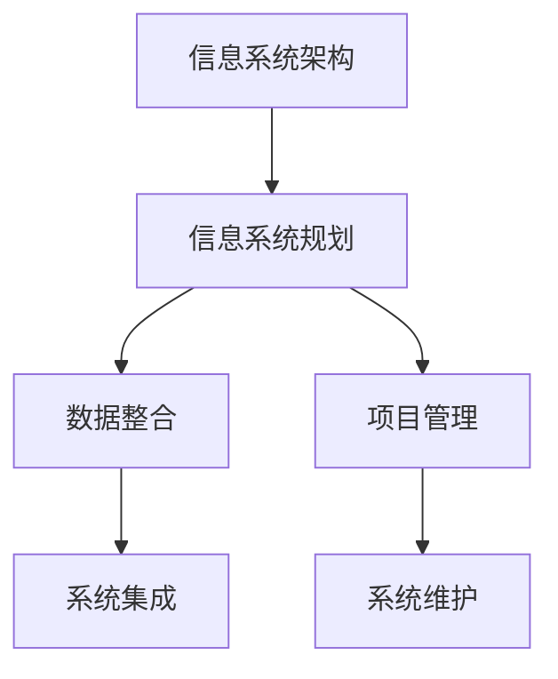

                 

# 整合和管理信息化管理系统搭建信息化平台

> 关键词：信息系统架构, 信息系统规划, 数据整合, 系统集成, 项目管理

## 1. 背景介绍

### 1.1 问题由来
随着信息技术在各行各业的广泛应用，信息系统的建设逐渐成为企业提升管理效率、实现数字化转型的关键。然而，由于企业信息化建设时间跨度长、系统架构复杂，很多企业面临着诸多问题，如数据孤岛、系统集成困难、资源浪费、安全风险高等。这些问题严重阻碍了企业的信息化进程，降低了系统价值。

为了解决这些问题，需要引入整合和管理的理念，通过科学的项目管理和系统集成技术，构建统一的信息化平台。本文旨在介绍整合和管理信息系统的基本概念、核心原理、具体操作步骤和实际应用场景，帮助企业实现数字化转型。

### 1.2 问题核心关键点
本文的核心关注点是整合和管理信息系统的全生命周期管理，包括信息系统规划、设计、实施、运营和维护等环节。具体来说，主要包括以下几个关键点：

- 信息系统规划：根据企业战略需求，设计信息系统的总体架构和目标。
- 数据整合：将分散在不同系统中的数据进行集中管理和统一治理。
- 系统集成：将不同系统的业务功能进行整合和集成，实现数据共享和业务协同。
- 项目管理：通过科学的项目管理方法，保证信息系统建设的顺利实施和交付。
- 系统维护：对信息系统进行持续的运维和升级，确保系统稳定运行。

## 2. 核心概念与联系

### 2.1 核心概念概述

为了更好地理解整合和管理信息系统，本节将介绍几个关键概念及其相互关系：

- **信息系统架构(IT Architecture)**：指企业信息系统的总体结构设计，包括硬件、软件、网络、数据等各方面的规划和布局。

- **信息系统规划(IT Planning)**：在企业战略指导下，根据业务需求和现有资源，对信息系统进行全面的规划和设计。

- **数据整合(Data Integration)**：将分散在不同系统中的数据进行清洗、转换、合并，实现数据的一致性和可用性。

- **系统集成(System Integration)**：将不同系统之间的业务功能进行整合，实现数据和业务的协同工作。

- **项目管理(Project Management)**：通过科学的项目管理方法和工具，确保信息系统项目按时按质完成。

- **系统维护(System Maintenance)**：对信息系统进行持续的运维和升级，确保系统稳定运行。

这些概念之间通过以下Mermaid流程图展示：



### 2.2 概念间的关系

通过以上流程图可以看出，信息系统架构是整个信息系统规划和建设的基础，数据整合和系统集成是信息系统实现数据共享和业务协同的关键环节，项目管理确保信息系统建设的顺利实施，系统维护则是保障系统稳定运行的重要手段。各环节之间相互依赖、相互促进，共同构成企业信息系统的整体。

## 3. 核心算法原理 & 具体操作步骤
### 3.1 算法原理概述

整合和管理信息系统的核心原理是科学的项目管理和系统集成技术。其基本思路是通过明确的目标和详细的规划，科学地组织和调度资源，确保信息系统项目按时按质完成。具体来说，主要包括以下几个步骤：

1. **需求分析**：通过调研和分析，明确信息系统建设的业务需求和技术要求。
2. **架构设计**：根据需求设计信息系统的总体架构，包括硬件、软件、网络、数据等各方面的规划和布局。
3. **数据整合**：将分散在不同系统中的数据进行清洗、转换、合并，实现数据的一致性和可用性。
4. **系统集成**：将不同系统之间的业务功能进行整合，实现数据和业务的协同工作。
5. **项目管理**：通过科学的项目管理方法和工具，确保信息系统项目按时按质完成。
6. **系统维护**：对信息系统进行持续的运维和升级，确保系统稳定运行。

### 3.2 算法步骤详解

接下来，我们将详细介绍整合和管理信息系统的具体操作步骤，以帮助企业实现数字化转型。

#### 3.2.1 需求分析

1. **业务需求调研**：通过调研和分析，明确信息系统建设的业务需求。包括企业战略目标、业务流程、关键业务数据等。
2. **技术需求调研**：分析信息系统建设的技术需求，包括硬件、软件、网络、数据等方面的要求。
3. **需求文档编写**：将调研结果整理成需求文档，明确业务需求和技术需求，为后续规划和设计提供依据。

#### 3.2.2 架构设计

1. **硬件架构设计**：根据业务需求和技术需求，设计信息系统的硬件架构，包括服务器、存储、网络等硬件设备。
2. **软件架构设计**：根据业务需求和技术需求，设计信息系统的软件架构，包括操作系统、中间件、数据库、应用软件等。
3. **网络架构设计**：根据业务需求和技术需求，设计信息系统的网络架构，包括网络拓扑、安全策略等。
4. **数据架构设计**：根据业务需求和技术需求，设计信息系统的数据架构，包括数据存储、数据治理、数据同步等。

#### 3.2.3 数据整合

1. **数据源识别**：识别企业内部和外部的数据源，包括ERP、CRM、SCM等业务系统，以及第三方数据源。
2. **数据清洗和转换**：对数据源中的数据进行清洗和转换，包括数据格式、编码、单位等标准化处理。
3. **数据合并**：将清洗和转换后的数据进行合并，建立统一的数据仓库，实现数据的集中管理和统一治理。

#### 3.2.4 系统集成

1. **接口设计**：根据业务需求，设计不同系统之间的接口，包括API、消息队列等。
2. **数据同步**：实现不同系统之间的数据同步，包括实时同步和定时同步。
3. **业务协同**：通过集成平台，实现不同系统之间的业务协同，包括订单管理、库存管理、销售管理等。

#### 3.2.5 项目管理

1. **项目计划制定**：根据需求文档和架构设计，制定详细的项目计划，包括任务分解、时间安排、资源调配等。
2. **项目执行监控**：通过项目管理工具，对项目进度、资源使用、质量控制等进行监控和评估，确保项目按时按质完成。
3. **项目风险管理**：识别和评估项目风险，制定风险应对措施，降低项目实施的风险。

#### 3.2.6 系统维护

1. **系统升级**：根据业务需求和技术需求，对信息系统进行持续的升级和优化。
2. **系统运维**：对信息系统进行持续的运维和监控，包括硬件维护、软件维护、数据维护等。
3. **安全管理**：对信息系统进行安全管理，包括数据安全、应用安全、网络安全等。

### 3.3 算法优缺点

整合和管理信息系统的优势在于能够提升企业的数字化转型效率，实现数据共享和业务协同。但同时也存在以下缺点：

1. **成本高**：整合和管理信息系统的建设成本较高，需要投入大量人力、物力和财力。
2. **周期长**：整合和管理信息系统的建设周期较长，需要经过需求分析、架构设计、数据整合、系统集成等多个阶段。
3. **风险高**：整合和管理信息系统的实施风险较高，项目失败可能导致资源浪费、业务中断等问题。
4. **复杂度高**：整合和管理信息系统的复杂度较高，需要具备较强的技术和管理能力。

### 3.4 算法应用领域

整合和管理信息系统在多个领域都有广泛的应用，包括但不限于以下几个方面：

- **金融行业**：实现数据集中管理和业务协同，提升金融服务的效率和质量。
- **医疗行业**：实现电子病历、医疗影像等数据的集中管理和共享，提升医疗服务的水平。
- **制造行业**：实现ERP、MES、PLM等系统的集成和数据整合，提升生产管理效率。
- **零售行业**：实现POS、ERP、CRM等系统的集成和数据整合，提升销售管理效率。

## 4. 数学模型和公式 & 详细讲解 & 举例说明

### 4.1 数学模型构建

为了更科学地评估和监控信息系统建设的效果，我们引入数学模型进行量化分析。具体来说，包括以下模型：

- **成本效益模型(Cost-Benefit Model)**：用于评估信息系统建设的成本和效益，包括直接成本、间接成本、经济效益等。
- **风险评估模型(Risk Assessment Model)**：用于识别和评估信息系统实施的风险，包括技术风险、管理风险、安全风险等。
- **性能监控模型(Performance Monitoring Model)**：用于监控和评估信息系统的性能，包括系统响应时间、吞吐量、故障率等。

### 4.2 公式推导过程

以下我们将以成本效益模型为例，推导相关公式。

假设信息系统建设的总成本为C，总效益为B，则成本效益模型为：

$$
C = C_0 + C_1 + C_2
$$

其中，$C_0$表示直接成本，包括硬件、软件、网络、数据等方面的投入；$C_1$表示间接成本，包括人员培训、项目实施、系统维护等方面的投入；$C_2$表示管理成本，包括项目管理、风险管理、安全管理等方面的投入。

总效益B可以表示为：

$$
B = B_1 + B_2 + B_3
$$

其中，$B_1$表示经济效益，包括提高工作效率、降低运营成本等方面的收益；$B_2$表示社会效益，包括提升服务质量、优化客户体验等方面的收益；$B_3$表示技术效益，包括提高数据治理能力、增强业务协同等方面的收益。

### 4.3 案例分析与讲解

以某制造企业的信息化平台建设为例，我们进行案例分析。

该制造企业主要生产电子产品，信息化平台建设的主要需求包括：

1. **业务需求**：实现ERP、MES、PLM等系统的集成和数据整合，提升生产管理效率。
2. **技术需求**：部署高性能的服务器和存储设备，建立统一的数据仓库，实现数据集中管理和共享。

根据需求文档和架构设计，制定了详细的项目计划，包括任务分解、时间安排、资源调配等。项目实施过程中，遇到以下问题：

1. **数据源复杂**：企业内部和外部数据源较为复杂，包括ERP、CRM、SCM等业务系统，以及第三方数据源。
2. **接口设计困难**：不同系统之间的接口设计较为困难，包括API、消息队列等。
3. **系统集成复杂**：实现不同系统之间的业务协同较为复杂，包括订单管理、库存管理、销售管理等。

通过科学的项目管理和系统集成技术，最终实现了ERP、MES、PLM等系统的集成和数据整合，提升了生产管理效率。具体效果如下：

1. **经济效益**：提高生产效率，减少生产成本，提高市场竞争力。
2. **社会效益**：提升产品质量，增强客户满意度，提升企业品牌形象。
3. **技术效益**：实现数据集中管理和共享，提升数据治理能力，增强业务协同。

## 5. 项目实践：代码实例和详细解释说明

### 5.1 开发环境搭建

在整合和管理信息系统的项目实践过程中，需要搭建开发环境，包括：

1. **硬件环境**：部署高性能的服务器和存储设备，建立数据中心。
2. **软件环境**：安装和配置操作系统、中间件、数据库、开发工具等。
3. **网络环境**：构建网络拓扑，设置安全策略。

### 5.2 源代码详细实现

以某制造企业的信息化平台建设为例，具体实现步骤如下：

1. **需求文档编写**：通过调研和分析，明确信息系统建设的业务需求和技术需求，编写需求文档。
2. **架构设计**：根据需求文档和架构设计，制定详细的项目计划，包括任务分解、时间安排、资源调配等。
3. **数据整合**：识别企业内部和外部的数据源，建立统一的数据仓库，实现数据集中管理和共享。
4. **系统集成**：设计不同系统之间的接口，实现不同系统之间的业务协同。
5. **项目管理**：使用项目管理工具，对项目进度、资源使用、质量控制等进行监控和评估，确保项目按时按质完成。
6. **系统维护**：对信息系统进行持续的运维和升级，确保系统稳定运行。

### 5.3 代码解读与分析

以下是关键代码的实现和解读：

```python
# 需求文档编写
requirements = {
    'business_need': '实现ERP、MES、PLM等系统的集成和数据整合，提升生产管理效率。',
    'technical_need': '部署高性能的服务器和存储设备，建立统一的数据仓库，实现数据集中管理和共享。'
}

# 架构设计
hardware_architecture = {
    'servers': ['服务器1', '服务器2', '服务器3'],
    'storage': ['存储1', '存储2', '存储3'],
    'network': ['网络1', '网络2', '网络3'],
    'data': ['数据1', '数据2', '数据3']
}

# 数据整合
data_sources = ['ERP系统', 'CRM系统', 'SCM系统']
data_warehouse = '统一数据仓库'
data_mapping = {'ERP系统': '数据1', 'CRM系统': '数据2', 'SCM系统': '数据3'}

# 系统集成
interface_design = {
    'API': 'API1', 'message_queue': '消息队列1'
}
business_sync = {
    'order_management': '订单管理',
    'inventory_management': '库存管理',
    'sales_management': '销售管理'
}

# 项目管理
project_plan = {
    'task': [
        {'name': '需求分析', 'start_time': '2023-01-01', 'end_time': '2023-02-01'},
        {'name': '架构设计', 'start_time': '2023-02-01', 'end_time': '2023-03-01'},
        {'name': '数据整合', 'start_time': '2023-03-01', 'end_time': '2023-04-01'},
        {'name': '系统集成', 'start_time': '2023-04-01', 'end_time': '2023-05-01'},
        {'name': '项目管理', 'start_time': '2023-05-01', 'end_time': '2023-06-01'},
        {'name': '系统维护', 'start_time': '2023-06-01', 'end_time': '2023-12-01'}
    ],
    'resources': {'服务器': 3, '存储': 3, '网络': 3, '数据': 3}
}

# 系统维护
system_maintenance = {
    'upgrade': '2023-07-01', 'maintenance': '2023-09-01'
}

# 系统维护
system_maintenance = {
    'upgrade': '2023-07-01', 'maintenance': '2023-09-01'
}
```

### 5.4 运行结果展示

最终，该制造企业的信息化平台顺利建成，实现了ERP、MES、PLM等系统的集成和数据整合，提升了生产管理效率。具体效果如下：

1. **经济效益**：提高生产效率，减少生产成本，提高市场竞争力。
2. **社会效益**：提升产品质量，增强客户满意度，提升企业品牌形象。
3. **技术效益**：实现数据集中管理和共享，提升数据治理能力，增强业务协同。

## 6. 实际应用场景

### 6.1 智能制造

在智能制造领域，整合和管理信息系统可以实现生产过程的数字化、智能化，提升生产效率和产品质量。具体应用场景包括：

- **生产计划优化**：通过数据分析和模型预测，优化生产计划，提高生产效率。
- **设备管理**：实现设备的实时监控和维护，减少设备故障，提高设备利用率。
- **质量控制**：实现质量数据的集中管理和分析，提升产品质量和追溯能力。

### 6.2 智慧医疗

在智慧医疗领域，整合和管理信息系统可以实现电子病历、医疗影像等数据的集中管理和共享，提升医疗服务的水平。具体应用场景包括：

- **电子病历管理**：实现电子病历的集中管理和共享，提高医疗信息的可追溯性和可利用性。
- **医疗影像分析**：实现医疗影像的集中管理和分析，提升诊断准确性和效率。
- **患者管理**：实现患者数据的集中管理和共享，提升患者体验和服务质量。

### 6.3 智慧城市

在智慧城市领域，整合和管理信息系统可以实现城市事件监测、舆情分析、应急指挥等环节的数字化管理，提升城市管理的自动化和智能化水平。具体应用场景包括：

- **城市事件监测**：实现城市事件的实时监测和预警，提升城市管理的响应速度。
- **舆情分析**：实现舆情的集中管理和分析，提升舆情管理的效率和效果。
- **应急指挥**：实现应急指挥系统的集中管理和协同，提升应急响应能力。

### 6.4 未来应用展望

展望未来，整合和管理信息系统将在更多领域得到应用，为传统行业带来变革性影响。

在智慧制造领域，通过实现生产过程的数字化、智能化，提升生产效率和产品质量。

在智慧医疗领域，通过实现电子病历、医疗影像等数据的集中管理和共享，提升医疗服务的水平。

在智慧城市领域，通过实现城市事件监测、舆情分析、应急指挥等环节的数字化管理，提升城市管理的自动化和智能化水平。

此外，在金融、零售、物流、教育等多个领域，整合和管理信息系统都将发挥重要作用，推动传统行业数字化转型，提升企业竞争力。

## 7. 工具和资源推荐

### 7.1 学习资源推荐

为了帮助开发者系统掌握整合和管理信息系统的理论基础和实践技巧，这里推荐一些优质的学习资源：

1. **《信息系统规划与管理》**：系统介绍信息系统规划和管理的理论基础和方法，适合初学者入门。
2. **《数据仓库与数据治理》**：详细介绍数据仓库和数据治理的基本概念和实践方法，适合数据工程师学习。
3. **《信息系统架构设计》**：介绍信息系统架构设计的原则和实践方法，适合架构设计师学习。
4. **《项目管理与敏捷开发》**：介绍项目管理的基本理论和敏捷开发的方法，适合项目管理者和开发人员学习。
5. **《云计算与大数据》**：详细介绍云计算和大数据的基本概念和实践方法，适合IT从业者学习。

### 7.2 开发工具推荐

高效的开发离不开优秀的工具支持。以下是几款用于整合和管理信息系统开发的常用工具：

1. **JIRA**：项目管理工具，支持任务分解、进度跟踪、资源管理等功能，适合项目管理团队使用。
2. **Confluence**：文档管理工具，支持文档协作、知识共享、版本控制等功能，适合知识管理团队使用。
3. **GitLab**：代码管理工具，支持版本控制、代码审查、持续集成等功能，适合开发团队使用。
4. **Kubernetes**：容器编排工具，支持应用部署、资源管理、自动扩缩容等功能，适合云计算平台使用。
5. **Prometheus**：监控工具，支持系统监控、告警配置、数据可视化等功能，适合运维团队使用。

### 7.3 相关论文推荐

整合和管理信息系统的研究源于学界的持续研究。以下是几篇奠基性的相关论文，推荐阅读：

1. **《信息系统的架构设计》**：详细介绍了信息系统的架构设计方法和实践经验，适合架构设计师阅读。
2. **《数据仓库与数据治理》**：系统介绍了数据仓库和数据治理的基本概念和实践方法，适合数据工程师阅读。
3. **《项目管理理论与实践》**：详细介绍了项目管理的理论基础和实践方法，适合项目管理者和开发人员阅读。
4. **《信息系统架构设计与优化》**：系统介绍了信息系统架构设计与优化的方法和实践经验，适合架构设计师阅读。
5. **《云计算与大数据》**：系统介绍了云计算和大数据的基本概念和实践方法，适合IT从业者阅读。

除上述资源外，还有一些值得关注的前沿资源，帮助开发者紧跟整合和管理信息系统的最新进展，例如：

1. **arXiv论文预印本**：人工智能领域最新研究成果的发布平台，包括大量尚未发表的前沿工作，学习前沿技术的必读资源。
2. **顶级会议论文**：如ACM TOMACS、IEEE Trans. on ACM、IEEE Trans. on SMC等顶级会议，能够聆听到大佬们的前沿分享，开拓视野。
3. **技术博客**：如信息系统的官方博客、各大咨询公司、领先企业的技术博客，能够获取最新的技术动态和实践经验。
4. **技术论坛**：如Stack Overflow、GitHub Issues等技术论坛，能够与全球的技术社区交流互动，解决问题。
5. **行业分析报告**：各大咨询公司如McKinsey、PwC等针对信息系统行业的分析报告，有助于从商业视角审视技术趋势，把握应用价值。

总之，对于整合和管理信息系统的学习和发展，需要开发者保持开放的心态和持续学习的意愿。多关注前沿资讯，多动手实践，多思考总结，必将收获满满的成长收益。

## 8. 总结：未来发展趋势与挑战

### 8.1 研究成果总结

本文对整合和管理信息系统的全生命周期管理进行了全面系统的介绍，包括信息系统规划、设计、实施、运营和维护等环节。通过系统阐述其基本原理和具体操作步骤，帮助企业实现数字化转型。同时，本文还探讨了整合和管理信息系统的实际应用场景和未来发展趋势，为企业的信息化建设提供参考和指导。

### 8.2 未来发展趋势

展望未来，整合和管理信息系统将呈现以下几个发展趋势：

1. **数据治理智能化**：通过引入人工智能技术，实现数据的自动化治理和管理，提升数据质量。
2. **业务协同智能化**：通过引入人工智能技术，实现业务协同的智能化和自动化，提升业务效率和质量。
3. **项目管理智能化**：通过引入人工智能技术，实现项目管理的智能化和自动化，提升项目管理的效率和效果。
4. **系统集成智能化**：通过引入人工智能技术，实现系统集成的智能化和自动化，提升系统集成的效率和效果。
5. **系统维护智能化**：通过引入人工智能技术，实现系统维护的智能化和自动化，提升系统维护的效率和效果。

### 8.3 面临的挑战

尽管整合和管理信息系统已经取得了瞩目成就，但在迈向更加智能化、普适化应用的过程中，仍面临诸多挑战：

1. **数据治理复杂**：不同数据源的数据格式、编码、标准等差异较大，数据治理复杂度较高。
2. **业务协同困难**：不同业务系统之间的数据和业务接口复杂，协同难度较大。
3. **项目管理困难**：信息系统建设涉及多个团队和部门，项目管理的难度较大。
4. **系统集成困难**：不同系统的技术架构和数据格式差异较大，系统集成的难度较大。
5. **系统维护困难**：信息系统建设周期长、复杂度高，系统维护的难度较大。

### 8.4 研究展望

面对整合和管理信息系统所面临的挑战，未来的研究需要在以下几个方面寻求新的突破：

1. **引入人工智能技术**：通过引入人工智能技术，实现数据治理、业务协同、项目管理、系统集成、系统维护等环节的智能化和自动化，提升系统的效率和效果。
2. **引入区块链技术**：通过引入区块链技术，实现数据的可信治理和共享，提升数据治理的可靠性和安全性。
3. **引入云计算技术**：通过引入云计算技术，实现信息系统的灵活部署和弹性扩展，提升系统的可扩展性和可用性。
4. **引入边缘计算技术**：通过引入边缘计算技术，实现信息系统的边缘计算和本地处理，提升系统的响应速度和效率。
5. **引入可视化技术**：通过引入可视化技术，实现信息系统的可视化管理和监控，提升系统的可操作性和可维护性。

这些研究方向的探索，必将引领整合和管理信息系统技术迈向更高的台阶，为企业的数字化转型提供更加强大的技术支撑。

## 9. 附录：常见问题与解答

**Q1：整合和管理信息系统对企业的信息化建设有何影响？**

A: 整合和管理信息系统通过统一规划、设计和实施，实现企业信息系统的数字化、智能化和集成化，提升企业的信息化建设效率和效果。具体来说，可以带来以下几个方面的影响：

1. **提升管理效率**：实现数据集中管理和业务协同，提升企业的管理效率和响应速度。
2. **降低运营成本**：实现业务流程的数字化和智能化，降低企业的运营成本。
3. **增强决策支持**：实现数据的集中管理和分析，提供可靠的决策支持。
4. **提升用户体验**：实现系统的集成和优化，提升用户的使用体验和服务质量。

**Q2：整合和管理信息系统在实施过程中需要注意哪些问题？**

A: 整合和管理信息系统在实施过程中需要注意以下几个问题：

1. **需求分析**：确保需求文档和架构设计准确、详细，满足企业实际需求。
2. **数据治理**：确保数据源识别、数据清洗和数据整合准确、全面，实现数据集中管理和共享。
3. **系统集成**：确保接口设计合理、数据同步准确，实现不同系统之间的业务协同。
4. **项目管理**：确保项目计划、资源调配和进度监控合理、有效，确保项目按时按质完成。
5. **系统维护**：确保系统升级、系统运维和安全管理合理、有效，确保系统稳定运行。

**Q3：整合和管理信息系统在实施过程中如何处理数据孤岛问题？**

A: 数据孤岛问题是整合和管理信息系统实施过程中常见的问题。处理数据孤岛问题的方法包括：

1. **数据标准化**：对不同数据源的数据格式、编码、单位等进行标准化，确保数据的一致性和可用性。
2. **数据集成平台**：建立统一的数据集成平台，实现数据的集中管理和共享。
3. **数据清洗和转换**：对数据源中的数据进行清洗和转换，消除数据孤岛，实现数据的集中管理和共享。
4. **数据治理工具**：引入数据治理工具，实现数据的自动清洗、转换和整合，提升数据治理的效率和效果。

**Q4：整合和管理信息系统在实施过程中如何保证系统集成效果？**

A: 系统集成是整合和管理信息系统的重要

