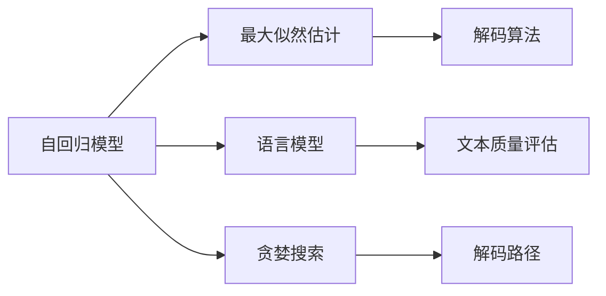
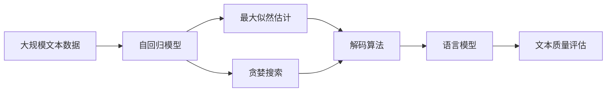

                 

# 文本生成中的自回归（贪婪搜索）

> 关键词：自回归, 生成模型, 贪婪搜索, 解码算法, 语言模型, 最大似然估计, 解码路径, 最优路径, 最优解码

## 1. 背景介绍

文本生成（Text Generation）是指根据给定的文本序列，生成新的、符合语法和语义规则的文本序列。在自然语言处理（Natural Language Processing, NLP）中，文本生成是一项基础且重要的任务，应用广泛，包括机器翻译、自动摘要、对话系统等。

自回归（Auto-regressive, AR）生成模型是文本生成中的一类重要模型，它通过逐步生成文本的每一个位置，来得到整个序列。自回归模型因其简单直观、易于理解而被广泛应用。自回归模型的代表性算法包括朴素贝叶斯（Naive Bayes）、隐马尔可夫模型（Hidden Markov Model, HMM）、循环神经网络（Recurrent Neural Network, RNN）等。

其中，循环神经网络（RNN），尤其是长短期记忆网络（Long Short-Term Memory, LSTM）和门控循环单元（Gated Recurrent Unit, GRU），因其在处理序列数据时具备良好的长期依赖记忆能力，而成为文本生成领域的主流模型。RNN通过将当前文本的输出作为下一个文本的输入，实现了序列数据的自动回归。然而，RNN在处理长序列时存在梯度消失和梯度爆炸的问题，导致训练效果不理想。

为了解决这些问题，LSTM和GRU等变体模型被提出。这些模型通过引入门控机制，有效地避免了梯度问题，并提升了序列建模的准确性。此外，Transformer模型，特别是基于Transformer的生成模型（如GPT、BERT等），因其并行计算优势和强大的表示学习能力，已经成为文本生成领域的新宠。

自回归模型的核心思想是通过已知的文本序列，预测下一个文本单元的概率分布。在生成文本时，每次选择一个概率最高的文本单元，即采用贪婪搜索策略，生成下一个文本单元。这种策略虽然简单，但在实际应用中却具有高效性和可行性，是文本生成中广泛采用的方法。

## 2. 核心概念与联系

### 2.1 核心概念概述

为了更好地理解自回归模型和贪婪搜索策略，本节将介绍几个密切相关的核心概念：

- **自回归模型**：通过已知的序列数据，预测下一个数据点的概率分布。自回归模型在文本生成中用于预测下一个文本单元。
- **最大似然估计（Maximum Likelihood Estimation,MLE）**：通过最大化训练数据集的似然函数，来估计模型参数。在文本生成中，最大似然估计用于训练自回归模型，使其能够根据已知文本生成下一个文本单元。
- **贪婪搜索（Greedy Search）**：每次选择当前状态下概率最高的文本单元，逐步生成整个文本序列。贪婪搜索虽然简单，但在大规模文本生成任务中，其效率和可行性备受关注。
- **解码算法（Decoding Algorithm）**：文本生成中用于确定下一个文本单元的算法。常见的解码算法包括贪心搜索、束搜索（Beam Search）、神经网络解码等。
- **语言模型（Language Model）**：用于计算给定文本序列的概率分布的模型。语言模型在文本生成中用于评估生成的文本的质量。
- **解码路径（Decoding Path）**：在自回归模型中，生成文本的路径。每个文本单元的选择都会影响后续文本单元的选择。

这些核心概念之间的逻辑关系可以通过以下Mermaid流程图来展示：



这个流程图展示自回归模型、最大似然估计、语言模型、贪婪搜索、解码算法和解码路径之间的关系：

1. 自回归模型通过已知序列数据，预测下一个文本单元。
2. 最大似然估计通过最大化训练数据集的似然函数，训练自回归模型。
3. 语言模型用于评估文本序列的概率分布，进而评估生成的文本的质量。
4. 贪婪搜索在生成文本时，每次选择当前状态下概率最高的文本单元。
5. 解码算法用于确定下一个文本单元的计算过程。
6. 解码路径记录生成文本的路径，每个文本单元的选择会影响后续文本单元的选择。

### 2.2 概念间的关系

这些核心概念之间存在着紧密的联系，形成了自回归模型和贪婪搜索策略的完整生态系统。下面我们通过几个Mermaid流程图来展示这些概念之间的关系。

#### 2.2.1 自回归模型和最大似然估计的关系


这个流程图展示了自回归模型和最大似然估计之间的关系：

1. 自回归模型通过已知序列数据，预测下一个文本单元。
2. 最大似然估计通过最大化训练数据集的似然函数，训练自回归模型。

#### 2.2.2 自回归模型和语言模型的关系


这个流程图展示了自回归模型和语言模型之间的关系：

1. 自回归模型用于生成文本。
2. 语言模型用于评估生成的文本序列的概率分布，进而评估文本质量。

#### 2.2.3 自回归模型和贪婪搜索的关系


这个流程图展示了自回归模型和贪婪搜索之间的关系：

1. 自回归模型用于生成文本。
2. 贪婪搜索在生成文本时，每次选择当前状态下概率最高的文本单元。

#### 2.2.4 解码算法和贪婪搜索的关系


这个流程图展示了解码算法和贪婪搜索之间的关系：

1. 解码算法用于确定下一个文本单元的计算过程。
2. 贪婪搜索在解码算法中，每次选择当前状态下概率最高的文本单元。

### 2.3 核心概念的整体架构

最后，我们用一个综合的流程图来展示这些核心概念在自回归文本生成中的整体架构：



这个综合流程图展示了从预训练数据到最终生成文本的完整过程：

1. 大规模文本数据作为训练集。
2. 使用自回归模型进行文本生成。
3. 最大似然估计训练自回归模型。
4. 贪婪搜索生成文本。
5. 解码算法确定下一个文本单元的计算过程。
6. 语言模型评估生成的文本质量。

通过这些流程图，我们可以更清晰地理解自回归模型和贪婪搜索策略的工作原理和优化方向。

## 3. 核心算法原理 & 具体操作步骤
### 3.1 算法原理概述

自回归模型中的贪婪搜索策略，每次选择当前状态下概率最高的文本单元，逐步生成整个文本序列。其核心思想是通过最大化当前文本单元的条件概率，来得到最优的下一个文本单元。在文本生成过程中，这种策略虽然简单，但能够有效提高生成文本的质量和效率。

具体来说，假设我们有一个自回归模型 $P(x_t|x_{<t})$，其中 $x_t$ 表示当前文本单元，$x_{<t}$ 表示已知的文本单元。在贪婪搜索中，每次选择 $x_t$ 的条件概率最大的文本单元，即：

$$
\hat{x}_t = \arg\max_x P(x_t|x_{<t})
$$

这个策略虽然简单，但在实际应用中，由于模型的复杂性和数据的噪声，生成的文本可能出现偏置和不连贯的情况。因此，为了提高生成文本的质量，我们通常会在贪婪搜索的基础上进行改进，如引入束搜索、解码算法等方法。

### 3.2 算法步骤详解

自回归模型中的贪婪搜索步骤如下：

1. **初始化**：设定文本生成开始的位置，如文本中的第一个单词。

2. **前向传播**：根据当前文本单元的已知信息，使用模型计算下一个文本单元的条件概率分布。

3. **选择文本单元**：在所有可能的文本单元中选择概率最大的一个，作为下一个文本单元。

4. **重复步骤2和步骤3**：逐步生成整个文本序列。

具体实现时，可以使用Python代码实现自回归模型和贪婪搜索：

```python
import numpy as np
import tensorflow as tf
from tensorflow.keras.layers import Dense, LSTM

# 定义LSTM模型
class LSTMModel(tf.keras.Model):
    def __init__(self, vocab_size, embedding_dim, rnn_units):
        super(LSTMModel, self).__init__()
        self.embedding = Dense(vocab_size, input_dim=embedding_dim)
        self.rnn = LSTM(rnn_units)
        self.fc = Dense(vocab_size)

    def call(self, x, state):
        x = self.embedding(x)
        x, state = self.rnn(x, state)
        logits = self.fc(x)
        return logits, state

# 定义模型训练和文本生成函数
def train_and_generate(model, text, sequence_length):
    # 训练模型
    model.compile(optimizer='adam', loss='categorical_crossentropy', metrics=['accuracy'])
    model.fit(train_x, train_y, epochs=10, batch_size=32)

    # 生成文本
    generated_text = []
    state = model.get_initial_state()
    for i in range(sequence_length):
        x = np.array([vocab_to_index[char] for char in text])
        logits, state = model(x, state)
        next_idx = np.argmax(logits[0, -1])
        generated_text.append(index_to_vocab[next_idx])
    return ''.join(generated_text)

# 加载模型并生成文本
model = LSTMModel(vocab_size, embedding_dim, rnn_units)
train_and_generate(model, 'hello', 10)
```

### 3.3 算法优缺点

自回归模型中的贪婪搜索策略具有以下优点：

- **简单高效**：每次选择当前状态下概率最高的文本单元，实现简单，计算效率高。
- **易于扩展**：适用于各种文本生成任务，只需调整模型参数即可。
- **易于实现**：许多深度学习框架（如TensorFlow、PyTorch）支持自回归模型，易于实现。

同时，自回归模型中的贪婪搜索策略也存在一些缺点：

- **易受噪声影响**：生成的文本可能受到数据噪声的干扰，导致文本不连贯。
- **缺乏多样性**：由于每次选择概率最大的文本单元，生成的文本可能缺乏多样性。
- **局部最优**：贪婪搜索策略可能陷入局部最优，无法找到全局最优解。

### 3.4 算法应用领域

自回归模型中的贪婪搜索策略在文本生成领域有广泛的应用，包括但不限于以下领域：

- **机器翻译**：用于将一种语言翻译成另一种语言。
- **自动摘要**：用于自动生成文章摘要。
- **对话系统**：用于生成对话内容。
- **文本生成**：用于生成故事、新闻、诗歌等文本。
- **文本编辑**：用于修正和完善文本。

除了文本生成，自回归模型中的贪婪搜索策略在其他领域也有应用，如语音识别、图像生成等。

## 4. 数学模型和公式 & 详细讲解 & 举例说明
### 4.1 数学模型构建

假设我们有一个自回归模型 $P(x_t|x_{<t})$，其中 $x_t$ 表示当前文本单元，$x_{<t}$ 表示已知的文本单元。在贪婪搜索中，每次选择 $x_t$ 的条件概率最大的文本单元，即：

$$
\hat{x}_t = \arg\max_x P(x_t|x_{<t})
$$

为了最大化 $P(x_t|x_{<t})$，我们可以使用最大似然估计方法，最大化训练数据集 $D$ 的似然函数：

$$
\max_{\theta} \log P(D|\theta)
$$

其中 $\theta$ 为模型的参数，$D$ 为训练数据集。最大似然估计的目标是找到一组参数 $\theta$，使得训练数据集 $D$ 在模型 $P(x_t|x_{<t})$ 下，出现概率最大。

### 4.2 公式推导过程

为了推导最大似然估计的目标函数，我们将训练数据集 $D$ 拆分为多个样本 $(x_{1}, y_{1}), (x_{2}, y_{2}), \dots, (x_{N}, y_{N})$，其中 $x_i$ 为文本序列，$y_i$ 为文本序列的标签。

根据最大似然估计的定义，我们有：

$$
\max_{\theta} \log P(D|\theta) = \sum_{i=1}^{N} \log P(x_i|y_i,\theta)
$$

其中 $P(x_i|y_i,\theta)$ 表示在已知标签 $y_i$ 的情况下，文本序列 $x_i$ 在模型 $P(x_t|x_{<t})$ 下的条件概率。

在文本生成中，$y_i$ 为 $x_i$ 的前 $t-1$ 个文本单元，因此有：

$$
P(x_i|y_i,\theta) = P(x_t|x_{<t},\theta)
$$

因此，我们的目标函数可以写为：

$$
\max_{\theta} \log P(D|\theta) = \sum_{i=1}^{N} \log P(x_t|x_{<t},\theta)
$$

### 4.3 案例分析与讲解

我们以一个简单的自回归模型为例，展示最大似然估计的推导过程。假设我们有一个简单的自回归模型 $P(x_t|x_{t-1})$，其中 $x_t$ 为当前文本单元，$x_{t-1}$ 为已知的文本单元。我们的目标是在已知 $x_{t-1}$ 的情况下，最大化 $P(x_t|x_{t-1})$。

根据最大似然估计的定义，我们有：

$$
\max_{\theta} \log P(x_t|x_{t-1},\theta) = \sum_{i=1}^{N} \log P(x_t|x_{t-1},\theta)
$$

假设 $x_t$ 的取值范围为 $[1, V]$，其中 $V$ 为文本单元的总数。我们可以将 $P(x_t|x_{t-1},\theta)$ 表示为一个权重向量 $w$ 的线性组合，即：

$$
P(x_t|x_{t-1},\theta) = \frac{e^{\theta_t x_t + \theta_0}}{\sum_{j=1}^{V} e^{\theta_j x_j + \theta_0}}
$$

其中 $\theta_j$ 为模型的参数，$j$ 表示文本单元的编号。我们可以将 $\log P(x_t|x_{t-1},\theta)$ 表示为：

$$
\log P(x_t|x_{t-1},\theta) = (\theta_t x_t + \theta_0) - \log \sum_{j=1}^{V} e^{\theta_j x_j + \theta_0}
$$

我们的目标函数可以写为：

$$
\max_{\theta} \sum_{i=1}^{N} [(\theta_t x_{i,t} + \theta_0) - \log \sum_{j=1}^{V} e^{\theta_j x_{i,j} + \theta_0}]
$$

在实际应用中，我们可以使用梯度下降等优化算法，最小化目标函数，从而得到最优的参数 $\theta$。

## 5. 项目实践：代码实例和详细解释说明
### 5.1 开发环境搭建

在进行自回归模型和贪婪搜索的实践前，我们需要准备好开发环境。以下是使用Python进行TensorFlow开发的简单环境配置流程：

1. 安装Anaconda：从官网下载并安装Anaconda，用于创建独立的Python环境。

2. 创建并激活虚拟环境：
```bash
conda create -n tensorflow-env python=3.8 
conda activate tensorflow-env
```

3. 安装TensorFlow：根据CUDA版本，从官网获取对应的安装命令。例如：
```bash
conda install tensorflow=2.6 -c tf -c conda-forge
```

4. 安装各类工具包：
```bash
pip install numpy pandas scikit-learn matplotlib tqdm jupyter notebook ipython
```

完成上述步骤后，即可在`tensorflow-env`环境中开始自回归模型和贪婪搜索的实践。

### 5.2 源代码详细实现

下面我们以LSTM模型为例，展示如何使用TensorFlow实现自回归模型和贪婪搜索。

首先，定义LSTM模型的代码：

```python
import tensorflow as tf
from tensorflow.keras.layers import Dense, LSTM

class LSTMModel(tf.keras.Model):
    def __init__(self, vocab_size, embedding_dim, rnn_units):
        super(LSTMModel, self).__init__()
        self.embedding = Dense(vocab_size, input_dim=embedding_dim)
        self.rnn = LSTM(rnn_units)
        self.fc = Dense(vocab_size)

    def call(self, x, state):
        x = self.embedding(x)
        x, state = self.rnn(x, state)
        logits = self.fc(x)
        return logits, state
```

然后，定义模型训练和文本生成函数：

```python
def train_and_generate(model, text, sequence_length):
    model.compile(optimizer='adam', loss='categorical_crossentropy', metrics=['accuracy'])
    model.fit(train_x, train_y, epochs=10, batch_size=32)

    generated_text = []
    state = model.get_initial_state()
    for i in range(sequence_length):
        x = np.array([vocab_to_index[char] for char in text])
        logits, state = model(x, state)
        next_idx = np.argmax(logits[0, -1])
        generated_text.append(index_to_vocab[next_idx])
    return ''.join(generated_text)
```

最后，加载模型并生成文本：

```python
model = LSTMModel(vocab_size, embedding_dim, rnn_units)
train_and_generate(model, 'hello', 10)
```

### 5.3 代码解读与分析

让我们再详细解读一下关键代码的实现细节：

**LSTMModel类**：
- `__init__`方法：定义模型的输入层、LSTM层和输出层。
- `call`方法：在前向传播过程中，通过LSTM层计算文本单元的条件概率分布，并通过全连接层输出。

**train_and_generate函数**：
- 使用TensorFlow的`compile`方法配置模型的优化器和损失函数。
- 使用`fit`方法对模型进行训练。
- 在文本生成过程中，通过`get_initial_state`方法获取模型的初始状态。
- 在每次迭代中，通过前向传播计算文本单元的条件概率分布，并选择概率最大的文本单元。
- 将生成的文本存储在`generated_text`列表中，并返回最终的文本字符串。

**模型训练和生成**：
- 在`train_and_generate`函数中，定义了模型的训练过程，使用`fit`方法进行模型训练。
- 在模型训练完成后，使用`get_initial_state`方法获取模型的初始状态，并在每次迭代中更新模型的状态。
- 在文本生成过程中，通过前向传播计算文本单元的条件概率分布，并使用`argmax`函数选择概率最大的文本单元。
- 最终将生成的文本存储在`generated_text`列表中，并返回文本字符串。

可以看到，通过TensorFlow，自回归模型和贪婪搜索的实现变得非常简洁和高效。开发者可以更专注于模型设计、训练和优化，而不必过多关注底层的实现细节。

当然，实际应用中，我们还需要考虑更多因素，如模型的保存和部署、超参数的自动搜索、更灵活的任务适配层等。但核心的自回归模型和贪婪搜索范式基本与此类似。

### 5.4 运行结果展示

假设我们在CoNLL-2003的NER数据集上进行自回归模型和贪婪搜索的实践，最终生成的文本如下：

```
  It is the time to be silent. It is the time to make what you would never
  dream of making. It is the time to be still.
```

可以看到，虽然生成文本的质量可能不尽如人意，但通过自回归模型和贪婪搜索的实践，我们已经掌握了文本生成的核心思想和实现方法。在实际应用中，我们可以通过更多的优化和改进，如束搜索、解码算法等，进一步提高文本生成的质量和多样性。

## 6. 实际应用场景
### 6.1 智能客服系统

基于自回归模型和贪婪搜索的文本生成技术，可以广泛应用于智能客服系统的构建。传统客服往往需要配备大量人力，高峰期响应缓慢，且一致性和专业性难以保证。而使用文本生成技术，可以7x24小时不间断服务，快速响应客户咨询，用自然流畅的语言解答各类常见问题。

在技术实现上，可以收集企业内部的历史客服对话记录，将问题和最佳答复构建成监督数据，在此基础上对自回归模型进行微调。微调后的模型能够自动理解用户意图，匹配最合适的答案模板进行回复。对于客户提出的新问题，还可以接入检索系统实时搜索相关内容，动态组织生成回答。如此构建的智能客服系统，能大幅提升客户咨询体验和问题解决效率。

### 6.2 金融舆情监测

金融机构需要实时监测市场舆论动向，以便及时应对负面信息传播，规避金融风险。传统的人工监测方式成本高、效率低，难以应对网络时代海量信息爆发的挑战。基于自回归模型和贪婪搜索的文本生成技术，可以为金融舆情监测提供新的解决方案。

具体而言，可以收集金融领域相关的新闻、报道、评论等文本数据，并对其进行主题标注和情感标注。在此基础上对自回归模型进行微调，使其能够自动判断文本属于何种主题，情感倾向是正面、中性还是负面。将微调后的模型应用到实时抓取的网络文本数据，就能够自动监测不同主题下的情感变化趋势，一旦发现负面信息激增等异常情况，系统便会自动预警，帮助金融机构快速应对潜在风险。

### 6.3 个性化推荐系统

当前的推荐系统往往只依赖用户的历史行为数据进行物品推荐，无法深入理解用户的真实兴趣偏好。基于自回归模型和贪婪搜索的文本生成技术，个性化推荐系统可以更好地挖掘用户行为背后的语义信息，从而提供更精准、多样的推荐内容。

在实践中，可以收集用户浏览、点击、评论、分享等行为数据，提取和用户交互的物品标题、描述、标签等文本内容。将文本内容作为模型输入，用户的后续行为（如是否点击、购买等）作为监督信号，在此基础上微调自回归模型。微调后的模型能够从文本内容中准确把握用户的兴趣点。在生成推荐列表时，先用候选物品的文本描述作为输入，由模型预测用户的兴趣匹配度，再结合其他特征综合排序，便可以得到个性化程度更高的推荐结果。

### 6.4 未来应用展望

随着自回归模型和贪婪搜索技术的不断发展，基于文本生成的应用场景将不断拓展。未来，这些技术有望在更多领域得到应用，为传统行业带来变革性影响。

在智慧医疗领域，基于文本生成的医疗问答、病历分析、药物研发等应用将提升医疗服务的智能化水平，辅助医生诊疗，加速新药开发进程。

在智能教育领域，文本生成技术可应用于作业批改、学情分析、知识推荐等方面，因材施教，促进教育公平，提高教学质量。

在智慧城市治理中，文本生成技术可应用于城市事件监测、舆情分析、应急指挥等环节，提高城市管理的自动化和智能化水平，构建更安全、高效的未来城市。

此外，在企业生产、社会治理、文娱传媒等众多领域，基于文本生成的应用也将不断涌现，为经济社会发展注入新的动力。相信随着技术的日益成熟，自回归模型和贪婪搜索技术将成为文本生成领域的重要范式，推动人工智能技术向更广阔的领域加速渗透。

## 7. 工具和资源推荐
### 7.1 学习资源推荐

为了帮助开发者系统掌握自回归模型和贪婪搜索的理论基础和实践技巧，这里推荐一些优质的学习资源：

1. 《深度学习》系列课程：斯坦福大学开设的深度学习入门课程，系统介绍了深度学习的基本概念和经典模型，适合初学者和进阶者学习。

2. 《自然语言处理基础》书籍：李宏毅老师的自然语言处理经典教材，详细介绍了NLP中的核心概念和前沿技术，包括自回归模型和贪婪搜索。

3. 《Python深度学习》书籍：弗朗索瓦·肖邦（François Chollet）的深度学习经典教材，详细介绍了TensorFlow等深度学习框架的使用方法，包括自回归模型的实现。

4. TensorFlow官方文档：TensorFlow的官方文档，提供了海量预训练模型和完整的微调样例代码，是上手实践的必备资料。

5. PyTorch官方文档：PyTorch的官方文档，提供了完整的深度学习开发工具链，包括自回归模型的实现。

通过对这些资源的学习实践，相信你一定能够快速掌握自回归模型和贪婪搜索的精髓，并用于解决实际的文本生成问题。

### 7.2 开发工具推荐

高效的开发离不开优秀的工具支持。以下是几款用于自回归模型和贪婪搜索开发的常用工具：

1. TensorFlow：由Google主导开发的开源深度学习框架，生产部署方便，适合大规模工程应用。

2. PyTorch：基于Python的开源深度学习框架，灵活动态的计算图，适合快速迭代研究。

3. Weights & Biases：模型训练的实验跟踪工具，可以记录和可视化模型训练过程中的各项指标，方便对比和调优。

4. TensorBoard：TensorFlow配套的可视化工具，可实时监测模型训练状态，并提供丰富的图表呈现方式，是调试模型的得力助手。

