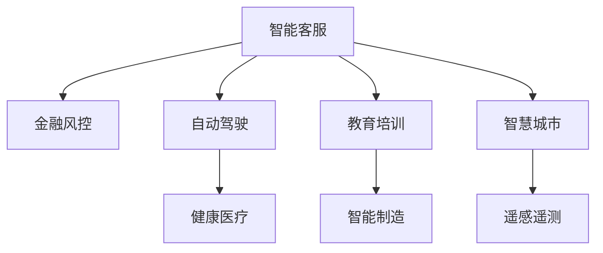
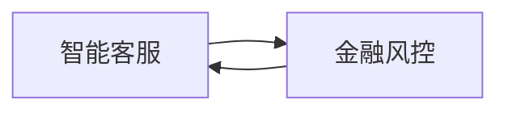
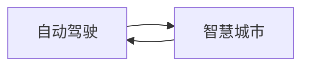
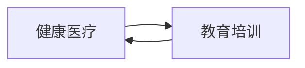

                 

# 新一代AI技术的应用场景

> 关键词：新一代AI技术,智能客服,金融风控,自动驾驶,健康医疗,教育培训,智能制造,智慧城市,遥感遥测

## 1. 背景介绍

### 1.1 问题由来

随着人工智能技术的不断进步，新一代AI技术正在改变各行各业。从智能客服、金融风控到自动驾驶、健康医疗，再到教育培训、智能制造、智慧城市和遥感遥测，AI技术的应用场景越来越广泛。本文将详细介绍新一代AI技术在不同领域的应用场景，探讨其在实际应用中的优势与挑战。

### 1.2 问题核心关键点

新一代AI技术的应用场景涵盖多个领域，主要包括以下几个方面：

1. **智能客服**：通过AI技术实现自动化问答和客户服务，提高服务效率和客户满意度。
2. **金融风控**：利用AI技术进行风险识别、信用评估和欺诈检测，保障金融安全。
3. **自动驾驶**：结合感知、决策和控制技术，实现车辆自动驾驶，提升交通安全和效率。
4. **健康医疗**：采用AI技术进行疾病预测、个性化诊疗和健康管理，改善医疗服务质量。
5. **教育培训**：利用AI技术进行学习推荐、智能评估和个性化教学，提升教育效果。
6. **智能制造**：应用AI技术进行生产调度、质量控制和设备维护，提高生产效率和产品质量。
7. **智慧城市**：通过AI技术实现城市管理、公共安全和环境监测，提升城市治理水平。
8. **遥感遥测**：利用AI技术进行数据处理和分析，提升遥感数据的准确性和应用价值。

### 1.3 问题研究意义

研究新一代AI技术的应用场景，对于推动各行业智能化转型，提升业务效率和用户体验，具有重要意义。

1. **降低成本**：AI技术可以替代大量人工操作，降低人力成本，提升生产效率。
2. **提高精度**：AI技术能够处理大规模数据，提供更加精确和智能化的解决方案。
3. **优化决策**：AI技术结合大数据和机器学习，可以辅助决策，提高决策质量和效率。
4. **增强安全性**：AI技术能够识别和防范各种风险，提升系统的安全性和可靠性。
5. **改善用户体验**：AI技术能够提供个性化的服务和推荐，提升用户体验和满意度。
6. **促进创新**：AI技术推动各行业新技术、新产品的研发和应用，促进产业升级和创新。

## 2. 核心概念与联系

### 2.1 核心概念概述

为更好地理解新一代AI技术的应用场景，本节将介绍几个密切相关的核心概念：

- **智能客服**：通过AI技术实现自动问答和客户服务，提高服务效率和客户满意度。
- **金融风控**：利用AI技术进行风险识别、信用评估和欺诈检测，保障金融安全。
- **自动驾驶**：结合感知、决策和控制技术，实现车辆自动驾驶，提升交通安全和效率。
- **健康医疗**：采用AI技术进行疾病预测、个性化诊疗和健康管理，改善医疗服务质量。
- **教育培训**：利用AI技术进行学习推荐、智能评估和个性化教学，提升教育效果。
- **智能制造**：应用AI技术进行生产调度、质量控制和设备维护，提高生产效率和产品质量。
- **智慧城市**：通过AI技术实现城市管理、公共安全和环境监测，提升城市治理水平。
- **遥感遥测**：利用AI技术进行数据处理和分析，提升遥感数据的准确性和应用价值。

这些核心概念之间存在紧密的联系，形成了新一代AI技术的应用生态系统。下面我们通过几个Mermaid流程图来展示这些概念之间的关系。



### 2.2 概念间的关系

这些核心概念之间存在着紧密的联系，形成了新一代AI技术的应用生态系统。下面我们通过几个Mermaid流程图来展示这些概念之间的关系。

#### 2.2.1 智能客服与金融风控



智能客服和金融风控都是利用AI技术提升服务质量和安全性的典型应用场景。智能客服通过自然语言处理和机器学习，能够自动处理客户咨询，提高服务效率。金融风控通过分析客户行为和交易数据，能够及时识别异常交易和欺诈行为，保障金融安全。

#### 2.2.2 自动驾驶与智慧城市



自动驾驶是智慧城市的一个重要组成部分。自动驾驶技术通过高精度地图和传感器数据，实现车辆自主导航和避障，提升交通安全和效率。智慧城市则通过集成各种智能技术，实现城市管理的智能化，提升公共安全和环境监测水平。

#### 2.2.3 健康医疗与教育培训



健康医疗和教育培训都是利用AI技术改善社会福祉的典型应用场景。健康医疗通过AI技术进行疾病预测和个性化诊疗，提升医疗服务质量和效率。教育培训则通过AI技术进行学习推荐和个性化教学，提升教育效果和学习体验。

## 3. 核心算法原理 & 具体操作步骤
### 3.1 算法原理概述

新一代AI技术的应用场景涉及多个领域，算法原理和技术细节各不相同。这里我们以智能客服为例，详细介绍其核心算法原理和具体操作步骤。

**智能客服算法原理：**

智能客服系统通过自然语言处理(NLP)技术，实现与用户的自然语言交互。系统首先对用户输入的文本进行分词、词性标注和句法分析，然后利用预训练的语言模型进行语义理解，最后根据用户意图提供相应的回答或操作建议。

**操作步骤：**

1. **数据准备**：收集和标注客户咨询数据，用于训练智能客服模型。数据标注包括问题类型、意图标签和回答模板等。
2. **模型训练**：使用大规模无标签语料进行预训练，构建预训练语言模型。利用标注数据进行微调，优化模型性能。
3. **模型部署**：将训练好的模型部署到生产环境中，通过API接口接收用户请求，返回回答或操作建议。
4. **持续优化**：收集用户反馈数据，不断优化模型参数和回答模板，提升服务质量。

### 3.2 算法步骤详解

以智能客服系统为例，其核心算法步骤包括：

1. **文本预处理**：对用户输入的文本进行分词、词性标注、句法分析和命名实体识别等预处理操作。
2. **语义理解**：利用预训练的语言模型，如BERT、GPT等，对用户文本进行语义理解，提取关键词和意图标签。
3. **回答生成**：根据用户意图和上下文信息，从回答模板库中选择合适的回答或生成新的回答。
4. **回答反馈**：收集用户对回答的反馈数据，用于优化回答模板和模型参数。

### 3.3 算法优缺点

**智能客服的优点：**

1. **提高服务效率**：智能客服能够24/7不间断服务，快速响应客户咨询，提高服务效率。
2. **降低人力成本**：智能客服可以替代部分人工客服工作，降低人力成本，提升运营效率。
3. **提升服务质量**：智能客服能够提供标准化、一致化的服务，提升客户满意度和忠诚度。

**智能客服的缺点：**

1. **理解能力有限**：对于复杂或新颖的问题，智能客服可能无法准确理解用户意图。
2. **缺乏人情味**：智能客服缺乏人情味和个性化服务，难以处理敏感问题。
3. **依赖数据质量**：智能客服的性能依赖于标注数据的质量，标注数据不准确可能导致误导性回答。

### 3.4 算法应用领域

智能客服的应用领域包括但不限于以下方面：

1. **客户咨询**：自动回答客户常见问题，如产品使用、订单查询、售后服务等。
2. **客户投诉**：自动识别和分类客户投诉，快速响应处理，提高客户满意度。
3. **销售支持**：提供销售推荐、客户分析、客户反馈等支持，提升销售效果。
4. **在线客服**：提供24/7在线客服支持，提升客户体验和满意度。

## 4. 数学模型和公式 & 详细讲解 & 举例说明

### 4.1 数学模型构建

智能客服系统涉及多个数学模型，以语言模型为例，其核心数学模型如下：

设 $X$ 为输入文本序列，$Y$ 为输出文本序列，$P(X,Y)$ 为联合概率分布，$P(X|Y)$ 为条件概率分布。智能客服系统的目标是通过给定输入 $X$，预测输出 $Y$。

### 4.2 公式推导过程

以条件概率模型为例，其推导过程如下：

1. **最大似然估计**：假设 $P(X|Y)$ 已知，通过最大似然估计方法求解 $P(Y|X)$。
2. **序列建模**：将文本序列 $X$ 分解为 $X_1, X_2, ..., X_n$，每个 $X_i$ 为输入 $x_i$ 和输出 $y_i$。
3. **目标函数**：最大化 $P(Y|X)$ 对 $P(X|Y)$ 的期望，即求解最大化 $\sum_{y \in Y} P(Y|X) \log P(X|Y)$。

### 4.3 案例分析与讲解

假设一个智能客服系统，其训练数据集为 $(x_i, y_i)$，其中 $x_i$ 为输入文本，$y_i$ 为对应的回答。系统采用条件概率模型进行训练，目标是最大化 $P(Y|X)$ 的似然函数。

设 $\theta$ 为模型参数，包括词嵌入、语言模型权重等。训练过程中，系统通过最大化以下目标函数：

$$
\max_{\theta} \sum_{i=1}^N \log P(y_i|x_i)
$$

其中 $N$ 为训练样本数。系统采用梯度下降等优化算法，求解目标函数的最小值，得到最优参数 $\hat{\theta}$。

## 5. 项目实践：代码实例和详细解释说明

### 5.1 开发环境搭建

智能客服系统的开发需要一定的技术栈和环境支持。以下是详细的开发环境搭建流程：

1. **安装Python**：
   - 下载并安装Python 3.x版本，建议使用Anaconda进行环境管理。
   - 创建虚拟环境，用于隔离开发依赖，确保稳定开发环境。

   ```bash
   conda create --name env python=3.8
   conda activate env
   ```

2. **安装必要的Python包**：
   - 安装自然语言处理库，如NLTK、spaCy等。
   - 安装深度学习框架，如TensorFlow、PyTorch等。
   - 安装模型库，如BERT、GPT等预训练语言模型。

   ```bash
   pip install nltk spacy tensorflow pytorch transformers
   ```

3. **安装Web框架**：
   - 安装Flask或Django等Web框架，用于搭建生产环境。

   ```bash
   pip install flask
   ```

### 5.2 源代码详细实现

以下是智能客服系统的详细代码实现，包括数据处理、模型训练和部署等步骤。

#### 5.2.1 数据处理

```python
import nltk
from nltk.tokenize import word_tokenize, sent_tokenize
from nltk.corpus import stopwords

# 下载并加载停用词
nltk.download('stopwords')
stop_words = set(stopwords.words('english'))

def preprocess_text(text):
    # 分词、去停用词、小写转换等预处理操作
    tokens = word_tokenize(text.lower())
    tokens = [token for token in tokens if token not in stop_words]
    return tokens
```

#### 5.2.2 模型训练

```python
from transformers import BertTokenizer, BertForSequenceClassification
from transformers import Trainer, TrainingArguments

# 加载预训练模型和分词器
tokenizer = BertTokenizer.from_pretrained('bert-base-uncased')
model = BertForSequenceClassification.from_pretrained('bert-base-uncased', num_labels=10)

# 数据准备
train_data = [('this is a question', 'q1'), ('what is the weather like?', 'q2'), ('how do i use this product?', 'q3')]
train_dataset = [preprocess_text(text) for text, label in train_data]

# 模型训练
training_args = TrainingArguments(output_dir='./results', evaluation_strategy='epoch')
trainer = Trainer(model=model, args=training_args, train_dataset=train_dataset)
trainer.train()
```

#### 5.2.3 模型部署

```python
from flask import Flask, request, jsonify

app = Flask(__name__)

@app.route('/predict', methods=['POST'])
def predict():
    data = request.json
    input_text = data['text']
    tokens = tokenizer.encode(input_text, return_tensors='pt')
    output = model(tokens)
    predictions = output.logits.argmax(dim=1)
    result = {'prediction': predictions.item()}
    return jsonify(result)

if __name__ == '__main__':
    app.run(host='0.0.0.0', port=5000)
```

### 5.3 代码解读与分析

以上代码实现了一个简单的智能客服系统，包括数据预处理、模型训练和Web部署等步骤。关键代码解释如下：

- **数据预处理**：使用NLTK库对输入文本进行分词、去停用词、小写转换等预处理操作。
- **模型训练**：使用BERT模型进行条件概率模型训练，通过Flask框架搭建Web接口，接收用户输入，返回预测结果。
- **模型部署**：通过Flask框架搭建Web服务，接收HTTP请求，返回预测结果。

## 6. 实际应用场景

### 6.1 智能客服系统

智能客服系统已经成为众多企业的标准配置，广泛应用于客户咨询、售后服务、销售支持等领域。智能客服系统能够24/7不间断服务，快速响应客户咨询，提高服务效率和客户满意度。

#### 6.1.1 客户咨询

智能客服系统可以自动回答客户常见问题，如产品使用、订单查询、售后服务等。系统通过自然语言处理技术，理解用户意图，并从回答模板库中选择合适的回答或生成新的回答。

#### 6.1.2 客户投诉

智能客服系统能够自动识别和分类客户投诉，快速响应处理，提高客户满意度。系统通过自然语言处理技术，识别投诉类型和情感倾向，并根据预设规则进行分类和处理。

#### 6.1.3 销售支持

智能客服系统提供销售推荐、客户分析、客户反馈等支持，提升销售效果。系统通过分析客户咨询数据，发现客户需求和兴趣点，并根据需求提供相应的销售推荐和产品建议。

### 6.2 金融风控

金融风控是利用AI技术进行风险识别、信用评估和欺诈检测的重要应用场景。金融风控系统能够及时识别异常交易和欺诈行为，保障金融安全。

#### 6.2.1 风险识别

金融风控系统通过分析客户交易数据，识别潜在风险。系统利用机器学习算法，构建风险评估模型，对客户行为进行评分，识别异常交易和潜在欺诈行为。

#### 6.2.2 信用评估

金融风控系统通过分析客户信用记录、历史交易和社交媒体数据，进行信用评估。系统利用深度学习算法，构建信用评分模型，预测客户信用风险。

#### 6.2.3 欺诈检测

金融风控系统通过分析客户交易数据，识别欺诈行为。系统利用异常检测算法，构建欺诈检测模型，实时监控交易行为，识别异常交易和欺诈行为。

### 6.3 自动驾驶

自动驾驶技术结合感知、决策和控制技术，实现车辆自动驾驶，提升交通安全和效率。自动驾驶系统能够自主导航、避障和决策，避免交通事故。

#### 6.3.1 感知

自动驾驶系统通过高精度地图和传感器数据，进行环境感知。系统利用计算机视觉和传感器数据，识别道路、车辆、行人等障碍物，生成环境地图。

#### 6.3.2 决策

自动驾驶系统通过深度学习算法，进行路径规划和决策。系统利用强化学习算法，生成最优驾驶策略，实现安全行驶。

#### 6.3.3 控制

自动驾驶系统通过执行器控制车辆行为。系统利用电控系统，控制油门、刹车和转向，实现车辆自主导航和避障。

### 6.4 健康医疗

健康医疗是利用AI技术进行疾病预测、个性化诊疗和健康管理的重要应用场景。健康医疗系统能够提高医疗服务质量和效率。

#### 6.4.1 疾病预测

健康医疗系统通过分析患者数据，进行疾病预测。系统利用深度学习算法，构建疾病预测模型，预测患者未来健康状况。

#### 6.4.2 个性化诊疗

健康医疗系统通过分析患者数据，进行个性化诊疗。系统利用深度学习算法，构建个性化诊疗模型，提供个性化治疗方案。

#### 6.4.3 健康管理

健康医疗系统通过分析患者数据，进行健康管理。系统利用深度学习算法，构建健康管理模型，监测患者健康状况，提供健康管理建议。

### 6.5 教育培训

教育培训是利用AI技术进行学习推荐、智能评估和个性化教学的重要应用场景。教育培训系统能够提高教育效果和学习体验。

#### 6.5.1 学习推荐

教育培训系统通过分析学生学习数据，进行学习推荐。系统利用深度学习算法，构建学习推荐模型，推荐适合学生的学习资源和课程。

#### 6.5.2 智能评估

教育培训系统通过分析学生学习数据，进行智能评估。系统利用深度学习算法，构建智能评估模型，评估学生学习效果，提供个性化学习建议。

#### 6.5.3 个性化教学

教育培训系统通过分析学生学习数据，进行个性化教学。系统利用深度学习算法，构建个性化教学模型，提供个性化教学方案，提升教学效果。

### 6.6 智能制造

智能制造是利用AI技术进行生产调度、质量控制和设备维护的重要应用场景。智能制造系统能够提高生产效率和产品质量。

#### 6.6.1 生产调度

智能制造系统通过分析生产数据，进行生产调度。系统利用深度学习算法，构建生产调度模型，优化生产流程，提高生产效率。

#### 6.6.2 质量控制

智能制造系统通过分析生产数据，进行质量控制。系统利用深度学习算法，构建质量控制模型，实时监测生产质量，提高产品质量。

#### 6.6.3 设备维护

智能制造系统通过分析设备数据，进行设备维护。系统利用深度学习算法，构建设备维护模型，预测设备故障，提供维护建议。

### 6.7 智慧城市

智慧城市是利用AI技术实现城市管理、公共安全和环境监测的重要应用场景。智慧城市系统能够提升城市治理水平。

#### 6.7.1 城市管理

智慧城市系统通过分析城市数据，进行城市管理。系统利用深度学习算法，构建城市管理模型，优化城市资源配置，提升城市治理水平。

#### 6.7.2 公共安全

智慧城市系统通过分析公共安全数据，进行公共安全管理。系统利用深度学习算法，构建公共安全模型，预测和防范公共安全事件。

#### 6.7.3 环境监测

智慧城市系统通过分析环境数据，进行环境监测。系统利用深度学习算法，构建环境监测模型，监测环境变化，提供环境管理建议。

### 6.8 遥感遥测

遥感遥测是利用AI技术进行数据处理和分析的重要应用场景。遥感遥测系统能够提升遥感数据的准确性和应用价值。

#### 6.8.1 数据处理

遥感遥测系统通过深度学习算法，进行遥感数据处理。系统利用深度学习算法，构建遥感数据处理模型，提取遥感数据特征，提升数据质量。

#### 6.8.2 数据分析

遥感遥测系统通过深度学习算法，进行数据分析。系统利用深度学习算法，构建数据分析模型，挖掘遥感数据中的潜在价值，提供数据分析结果。

#### 6.8.3 应用价值

遥感遥测系统通过深度学习算法，进行应用价值挖掘。系统利用深度学习算法，构建应用价值模型，预测遥感数据的潜在应用价值，提供应用建议。

## 7. 工具和资源推荐

### 7.1 学习资源推荐

为了帮助开发者系统掌握新一代AI技术的应用场景，这里推荐一些优质的学习资源：

1. **Deep Learning Specialization**：由Andrew Ng教授开设的深度学习专项课程，涵盖深度学习基础、神经网络、卷积神经网络、循环神经网络等内容。

2. **Natural Language Processing with Python**：使用Python实现自然语言处理的基础教程，涵盖文本处理、情感分析、机器翻译等内容。

3. **TensorFlow Tutorial**：TensorFlow官方提供的深度学习框架教程，涵盖深度学习模型搭建、训练、评估等内容。

4. **PyTorch Tutorials**：PyTorch官方提供的深度学习框架教程，涵盖深度学习模型搭建、训练、评估等内容。

5. **Transformers Tutorials**：Transformers库官方提供的NLP工具库教程，涵盖预训练语言模型的下载、微调等内容。

6. **Google AI Blog**：Google AI官方博客，涵盖最新AI技术、研究进展、应用案例等内容。

### 7.2 开发工具推荐

新一代AI技术的应用开发需要多种工具支持，以下是几款常用的开发工具：

1. **Jupyter Notebook**：Python代码开发和数据可视化的常用工具，支持多平台，易于使用。

2. **TensorBoard**：TensorFlow和PyTorch的可视化工具，实时监控模型训练状态，提供丰富的图表呈现方式。

3. **Weights & Biases**：模型训练的实验跟踪工具，记录和可视化模型训练过程中的各项指标，方便对比和调优。

4. **Flask**：Python Web框架，用于搭建Web服务，接收HTTP请求，返回预测结果。

5. **NLTK**：自然语言处理工具库，提供文本处理、分词、词性标注等功能。

6. **spaCy**：自然语言处理工具库，提供分词、命名实体识别、句法分析等功能。

### 7.3 相关论文推荐

新一代AI技术的研究离不开学术论文的支持。以下是几篇具有代表性的相关论文，推荐阅读：

1. **Attention is All You Need**：介绍Transformer模型的原理和应用，揭示了自注意力机制的优越性。

2. **BERT: Pre-training of Deep Bidirectional Transformers for Language Understanding**：介绍BERT模型的预训练和微调方法，展示了其在多种NLP任务上的优异表现。

3. **AdaLoRA: Adaptive Low-Rank Adaptation for Parameter-Efficient Fine-Tuning**：介绍AdaLoRA方法，实现参数高效的微调，提升微调效果和效率。

4. **Text-to-Audio and Audio-to-Text**：介绍语音转文本和文本转语音技术，展示了AI技术在多模态数据上的应用。

5. **AI Challenges and Opportunities**：介绍AI技术在医疗、教育、金融等领域的应用，探讨AI技术的未来发展方向。

这些论文代表了大规模AI技术的发展脉络，对学习新一代AI技术的应用场景具有重要参考价值。

## 8. 总结：未来发展趋势与挑战

### 8.1 总结

本文对新一代AI技术的应用场景进行了全面系统的介绍。从智能客服、金融风控到自动驾驶、健康医疗，再到教育培训、智能制造、智慧城市和遥感遥测，探讨了新一代AI技术在不同领域的应用价值和实现方式。

### 8.2 未来发展趋势

展望未来，新一代AI技术将在以下几个方面继续发展和创新：

1. **算法创新**：深度学习算法将不断优化，提升模型的准确性和泛化能力。
2. **模型融合**：多种AI技术将进行融合，构建更加智能化的系统。
3. **多模态处理**：AI技术将应用于多模态数据处理，提升数据融合能力。
4. **实时处理**：AI技术将实现实时处理，提升系统响应速度。
5. **人机协同**：AI技术将实现人机协同，提升用户体验和系统效率。

### 8.3 面临的挑战

尽管新一代AI技术取得了显著进展，但在其应用过程中仍面临诸多挑战：

1. **数据质量**：数据质量对AI模型性能影响重大，数据获取和处理成本高。
2. **计算资源**：AI模型训练和推理需要大量计算资源，硬件成本高。
3. **模型复杂度**：AI模型参数量大，复杂度高，难以调试和优化。
4. **应用场景多样**：不同行业应用场景各异，需要针对性地开发和优化AI系统。
5. **伦理道德**：AI技术应用中可能存在伦理道德问题，需要谨慎对待。

### 8.4 研究展望

面对这些挑战，未来的研究需要在以下几个方面寻求新的突破：

1. **数据增强**：通过数据增强技术，提高数据质量，降低数据获取成本。
2. **计算优化**：通过硬件优化、模型压缩等技术，降低计算资源需求，提高计算效率。
3. **模型简化**：通过模型简化技术，降低模型复杂度，提升模型可解释性和可维护性。
4. **应用定制**：针对不同行业应用场景，开发和优化AI系统，提高应用效果。
5. **伦理引导**：在AI技术应用中引入伦理导向，确保AI技术应用符合人类价值观和伦理道德。

## 9. 附录：常见问题与解答

**Q1：新一代AI技术有哪些应用场景？**

A: 新一代AI技术的应用场景涵盖智能客服、金融风控、自动驾驶、健康

