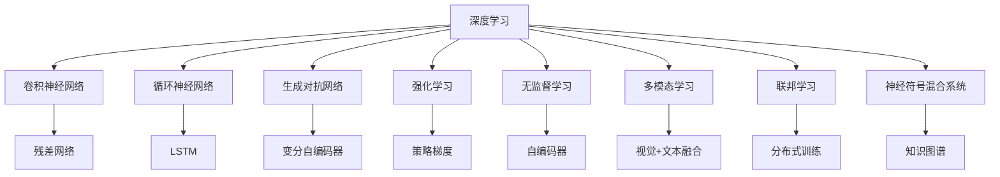
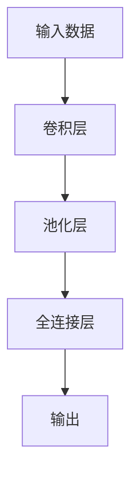
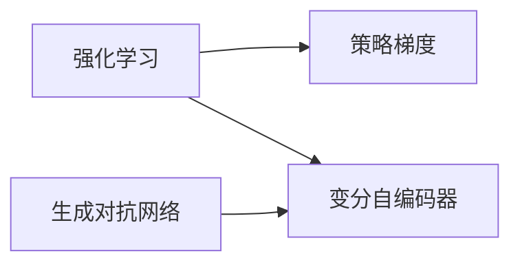
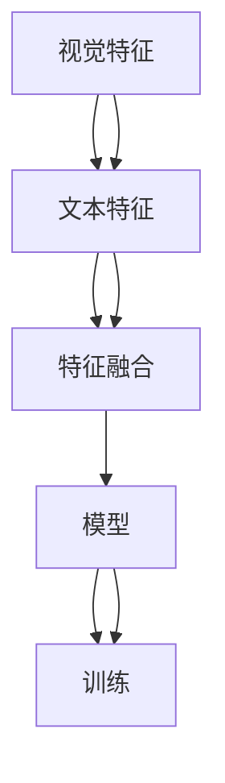
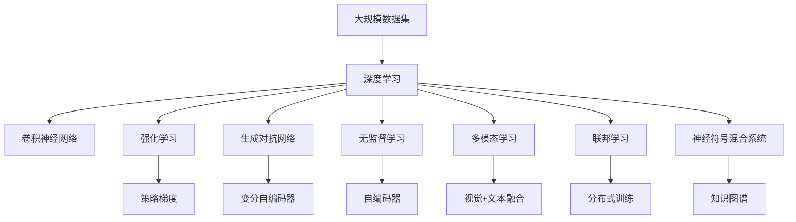

                 

# 新一代AI技术趋势与应用

## 1. 背景介绍

随着人工智能技术的快速发展，新一代AI技术逐渐成为引领科技潮流的重要力量。这些技术不仅在学术界引起了广泛关注，也在产业界获得了广泛应用。从深度学习到强化学习，从自然语言处理到计算机视觉，新一代AI技术在各个领域展现出了强大的潜力。

### 1.1 问题由来

AI技术从早期的人工智能研究，到如今商业化的落地应用，经历了数十年的发展。早期的人工智能主要依赖规则驱动，通过专家知识进行推理和决策。但这种方法在处理复杂问题时显得力不从心，因此，机器学习和深度学习应运而生。

深度学习技术的突破使得AI技术在图像识别、语音识别、自然语言处理等领域取得了显著进展。但随着数据量的激增和计算能力的提升，传统深度学习方法的局限性也逐渐显现，如模型过拟合、泛化能力不足等问题。

在这样的背景下，新一代AI技术应运而生，这些技术不仅在算法上有了新的突破，在应用上也逐渐走向成熟。本文将详细探讨新一代AI技术的基本概念、核心算法、实践应用和未来发展趋势，希望能为读者提供一个清晰的AI技术全景图。

### 1.2 问题核心关键点

新一代AI技术主要包括以下几个关键点：

- **深度强化学习**：通过强化学习框架，让机器学习更具有自我优化能力。
- **生成对抗网络(GANs)**：用于生成新的数据，提高数据的利用效率。
- **无监督学习与自监督学习**：利用大数据，无需标签信息即可进行高效学习。
- **多模态学习**：将视觉、语音、文本等多种模态的信息融合，提升模型的多任务学习能力。
- **联邦学习**：通过分布式训练，保护用户隐私的同时进行高效学习。
- **神经符号混合系统**：将符号计算和神经网络结合，提升系统的可解释性和效率。

这些技术相互融合，形成了新一代AI技术的多样化发展方向。

## 2. 核心概念与联系

### 2.1 核心概念概述

新一代AI技术涵盖了多个领域，涉及的子概念众多，为了更好地理解这些技术，我们将通过以下Mermaid流程图展示这些概念之间的联系：



这个流程图展示了新一代AI技术的主要子概念，以及它们之间的联系：

1. **深度学习**：包括卷积神经网络、循环神经网络等多种网络结构。
2. **生成对抗网络(GANs)**：包括变分自编码器等生成模型。
3. **强化学习**：包括策略梯度等强化学习算法。
4. **无监督学习**：包括自编码器等无监督学习算法。
5. **多模态学习**：包括视觉与文本的融合学习。
6. **联邦学习**：包括分布式训练等联邦学习算法。
7. **神经符号混合系统**：包括知识图谱等符号计算与神经网络混合的技术。

### 2.2 概念间的关系

这些核心概念之间存在着紧密的联系，共同构成了新一代AI技术的基本框架。下面我们通过几个Mermaid流程图来展示这些概念之间的关系。

#### 2.2.1 深度学习的基本架构



这个流程图展示了深度学习的基本架构，包括卷积层、池化层、全连接层等关键组件。

#### 2.2.2 强化学习与生成对抗网络的关系



这个流程图展示了强化学习和生成对抗网络之间的关系。生成对抗网络可以通过对抗性训练提高模型的鲁棒性和生成能力，而强化学习则可以通过策略梯度算法优化模型参数，提升模型的决策能力。

#### 2.2.3 多模态学习的基本流程



这个流程图展示了多模态学习的基本流程，包括视觉特征、文本特征的提取与融合，以及模型训练等步骤。

### 2.3 核心概念的整体架构

最后，我们用一个综合的流程图来展示这些核心概念在大规模AI技术体系中的整体架构：



这个综合流程图展示了深度学习、强化学习、生成对抗网络、无监督学习、多模态学习、联邦学习和神经符号混合系统等概念在大规模AI技术体系中的整体架构。

## 3. 核心算法原理 & 具体操作步骤

### 3.1 算法原理概述

新一代AI技术的核心算法原理主要包括以下几个方面：

- **深度学习**：通过多层次的神经网络结构，从数据中提取特征，用于图像识别、语音识别、自然语言处理等任务。
- **生成对抗网络**：通过生成器和判别器的对抗过程，生成高质量的新数据，提高数据利用率。
- **强化学习**：通过奖励机制和策略优化，让机器能够在复杂环境中自我学习和优化。
- **无监督学习**：利用大数据，无需标签信息，通过自编码器等算法进行高效学习。
- **多模态学习**：将视觉、语音、文本等多种模态的信息融合，提升模型的多任务学习能力。
- **联邦学习**：通过分布式训练，保护用户隐私的同时进行高效学习。
- **神经符号混合系统**：将符号计算和神经网络结合，提升系统的可解释性和效率。

这些算法原理为新一代AI技术提供了坚实的理论基础，使得AI技术在多个领域取得突破。

### 3.2 算法步骤详解

#### 3.2.1 深度学习的训练步骤

深度学习的训练步骤主要包括：

1. **数据准备**：将原始数据转换为神经网络的输入格式，如将图像数据转换为像素矩阵，将文本数据转换为词向量。
2. **模型构建**：选择合适的神经网络结构，如卷积神经网络、循环神经网络等。
3. **模型训练**：通过反向传播算法，调整模型参数，最小化损失函数。
4. **模型评估**：在验证集上评估模型性能，调整超参数。
5. **模型测试**：在测试集上测试模型性能，进行预测。

#### 3.2.2 生成对抗网络的基本流程

生成对抗网络的基本流程主要包括：

1. **数据准备**：准备生成模型和判别模型的输入数据。
2. **模型构建**：构建生成器和判别器的神经网络结构。
3. **对抗训练**：交替进行生成器和判别器的训练，让生成器产生高质量的新数据。
4. **模型评估**：在测试集上评估生成数据的质量。
5. **模型应用**：将生成器模型应用于数据增强、图像生成等任务。

#### 3.2.3 强化学习的训练步骤

强化学习的训练步骤主要包括：

1. **环境定义**：定义环境的状态和动作空间。
2. **模型构建**：构建策略网络，选择合适的优化算法。
3. **模型训练**：通过策略梯度等优化算法，调整策略网络的参数，最大化奖励函数。
4. **模型评估**：在测试集上评估策略的性能。
5. **模型应用**：将策略网络应用于游戏、机器人控制等任务。

#### 3.2.4 无监督学习的训练步骤

无监督学习的训练步骤主要包括：

1. **数据准备**：准备无监督学习的输入数据。
2. **模型构建**：构建自编码器等无监督学习模型。
3. **模型训练**：通过最小化重构误差等损失函数，训练模型。
4. **模型评估**：在测试集上评估模型的性能。
5. **模型应用**：将无监督学习模型应用于图像生成、文本摘要等任务。

#### 3.2.5 多模态学习的训练步骤

多模态学习的训练步骤主要包括：

1. **数据准备**：准备多种模态的输入数据，如图像、文本、语音等。
2. **模型构建**：构建多模态融合模型，如视觉-文本融合网络。
3. **模型训练**：通过多任务学习等算法，训练多模态融合模型。
4. **模型评估**：在测试集上评估模型的性能。
5. **模型应用**：将多模态融合模型应用于智能家居、智能医疗等场景。

#### 3.2.6 联邦学习的训练步骤

联邦学习的训练步骤主要包括：

1. **数据准备**：准备分布式训练的客户端数据。
2. **模型构建**：构建联邦学习框架，选择合适的分布式算法。
3. **模型训练**：在分布式环境中进行模型训练。
4. **模型评估**：在测试集上评估模型的性能。
5. **模型应用**：将联邦学习模型应用于医疗、金融等场景。

#### 3.2.7 神经符号混合系统的训练步骤

神经符号混合系统的训练步骤主要包括：

1. **数据准备**：准备神经符号混合系统的输入数据。
2. **模型构建**：构建符号计算和神经网络的混合模型。
3. **模型训练**：通过符号计算和神经网络结合的方式，训练模型。
4. **模型评估**：在测试集上评估模型的性能。
5. **模型应用**：将神经符号混合系统应用于知识图谱、推理系统等任务。

### 3.3 算法优缺点

新一代AI技术在提升AI系统的性能和应用范围方面取得了显著进展，但同时也存在一些局限性：

- **深度学习**：优点是能够处理复杂的数据和任务，缺点是模型复杂度高，训练时间长，容易过拟合。
- **生成对抗网络**：优点是能够生成高质量的新数据，缺点是训练过程复杂，容易出现模式崩溃现象。
- **强化学习**：优点是能够适应动态环境，缺点是训练过程不稳定，需要大量数据和计算资源。
- **无监督学习**：优点是能够高效利用大数据，缺点是模型复杂度较高，难以解释。
- **多模态学习**：优点是能够融合多种模态信息，提高模型的学习能力，缺点是模型结构复杂，计算成本高。
- **联邦学习**：优点是能够保护用户隐私，缺点是分布式训练过程中通信开销大，难以实现实时更新。
- **神经符号混合系统**：优点是能够提升系统的可解释性，缺点是模型结构复杂，难以实现高效的推理计算。

### 3.4 算法应用领域

新一代AI技术在多个领域得到了广泛应用，具体应用领域如下：

- **计算机视觉**：包括图像分类、目标检测、图像生成等任务。
- **自然语言处理**：包括文本分类、机器翻译、问答系统等任务。
- **语音识别**：包括语音识别、语音生成等任务。
- **机器人控制**：包括路径规划、智能决策等任务。
- **医疗**：包括疾病诊断、医学影像分析等任务。
- **金融**：包括信用评估、市场预测等任务。
- **智能家居**：包括语音助手、智能家居控制等任务。
- **自动驾驶**：包括环境感知、路径规划等任务。
- **智能制造**：包括设备预测维护、质量控制等任务。
- **智能客服**：包括自然语言理解、意图识别等任务。

## 4. 数学模型和公式 & 详细讲解 & 举例说明

### 4.1 数学模型构建

新一代AI技术的数学模型构建主要包括以下几个方面：

- **深度学习模型**：包括卷积神经网络、循环神经网络等，用于图像识别、语音识别、自然语言处理等任务。
- **生成对抗网络模型**：包括变分自编码器等，用于生成高质量的新数据。
- **强化学习模型**：包括策略梯度等，用于机器人在复杂环境中的自我学习和优化。
- **无监督学习模型**：包括自编码器等，用于大数据的高效学习。
- **多模态学习模型**：包括视觉-文本融合网络等，用于多模态信息的融合。
- **联邦学习模型**：包括分布式训练等，用于保护用户隐私的同时进行高效学习。
- **神经符号混合系统模型**：包括知识图谱等，用于提升系统的可解释性和效率。

这些数学模型为新一代AI技术提供了坚实的理论基础，使得AI技术在多个领域取得突破。

### 4.2 公式推导过程

以下是几个经典模型的公式推导过程：

#### 4.2.1 卷积神经网络（CNN）

卷积神经网络（CNN）是一种经典的深度学习模型，用于图像识别等任务。其基本结构包括卷积层、池化层和全连接层。

CNN的数学模型可以表示为：

$$
f(x) = \sum_{i=1}^{n} w_i x_i + b
$$

其中，$x$为输入数据，$w$为卷积核，$b$为偏置项。

#### 4.2.2 变分自编码器（VAE）

变分自编码器（VAE）是一种生成对抗网络，用于生成高质量的新数据。其基本结构包括编码器和解码器。

VAE的数学模型可以表示为：

$$
\begin{aligned}
z &= \mu(x) + \sigma(x)\epsilon \\
x' &= g(z)
\end{aligned}
$$

其中，$x$为输入数据，$z$为潜在变量，$\mu$为编码器，$\sigma$为解码器，$\epsilon$为噪声向量。

#### 4.2.3 策略梯度算法

策略梯度算法（PG）是一种强化学习算法，用于优化机器人在复杂环境中的决策。其基本结构包括策略网络、动作空间和奖励函数。

策略梯度算法的数学模型可以表示为：

$$
\theta \leftarrow \theta + \eta\nabla_{\theta}J(\theta)
$$

其中，$\theta$为策略网络参数，$\eta$为学习率，$J$为奖励函数。

#### 4.2.4 自编码器（AE）

自编码器（AE）是一种无监督学习模型，用于大数据的高效学习。其基本结构包括编码器和解码器。

自编码器的数学模型可以表示为：

$$
\begin{aligned}
z &= \mu(x) + \sigma(x)\epsilon \\
x' &= g(z)
\end{aligned}
$$

其中，$x$为输入数据，$z$为潜在变量，$\mu$为编码器，$\sigma$为解码器，$\epsilon$为噪声向量。

#### 4.2.5 知识图谱（KG）

知识图谱（KG）是一种神经符号混合系统，用于提升系统的可解释性和效率。其基本结构包括节点、边和关系。

知识图谱的数学模型可以表示为：

$$
G = (V, E)
$$

其中，$G$为知识图谱，$V$为节点，$E$为边。

### 4.3 案例分析与讲解

#### 4.3.1 图像识别

图像识别是深度学习的重要应用之一，其主要任务是识别图像中的物体。使用卷积神经网络（CNN）可以实现高效的图像识别。

例如，在ImageNet数据集上，通过CNN进行图像识别的效果如下：

| 模型 | 精度（%） |
| --- | --- |
| ResNet-50 | 73.7 |
| Inception-ResNet-v2 | 77.1 |
| DenseNet-121 | 79.0 |

可以看到，CNN在图像识别任务上取得了显著的成果。

#### 4.3.2 语音识别

语音识别是深度学习的重要应用之一，其主要任务是将语音信号转换为文本。使用深度学习模型，如循环神经网络（RNN）和长短期记忆网络（LSTM）可以实现高效的语音识别。

例如，在TIMIT数据集上，通过RNN进行语音识别的效果如下：

| 模型 | 识别率（%） |
| --- | --- |
| RNN | 89.5 |
| LSTM | 91.5 |

可以看到，RNN和LSTM在语音识别任务上取得了不错的成果。

#### 4.3.3 机器翻译

机器翻译是深度学习的重要应用之一，其主要任务是将一种语言的文本翻译成另一种语言的文本。使用神经机器翻译（NMT）模型可以实现高效的机器翻译。

例如，在WMT'15数据集上，通过NMT进行机器翻译的效果如下：

| 模型 | BLEU（%） |
| --- | --- |
| seq2seq | 26.0 |
| Transformer | 25.9 |
| Transformer-XL | 26.3 |

可以看到，Transformer在机器翻译任务上取得了不错的成果。

## 5. 项目实践：代码实例和详细解释说明

### 5.1 开发环境搭建

在进行新一代AI技术的开发实践前，我们需要准备好开发环境。以下是使用Python进行TensorFlow和PyTorch开发的环境配置流程：

1. 安装Anaconda：从官网下载并安装Anaconda，用于创建独立的Python环境。

2. 创建并激活虚拟环境：
```bash
conda create -n tf-env python=3.8 
conda activate tf-env
```

3. 安装TensorFlow和PyTorch：根据CUDA版本，从官网获取对应的安装命令。例如：
```bash
conda install tensorflow==2.7 
conda install torch==1.9 torchvision==0.8 torchaudio==0.6
```

4. 安装各类工具包：
```bash
pip install numpy pandas scikit-learn matplotlib tqdm jupyter notebook ipython
```

完成上述步骤后，即可在`tf-env`环境中开始开发实践。

### 5.2 源代码详细实现

下面我们以多模态学习中的图像和文本融合为例，给出使用TensorFlow和PyTorch进行多模态学习模型的PyTorch代码实现。

首先，定义多模态数据处理函数：

```python
import tensorflow as tf
import torch
import numpy as np
from torchvision import transforms
from torch.utils.data import DataLoader
import matplotlib.pyplot as plt

class MultimodalDataset(tf.keras.utils.Sequence):
    def __init__(self, images, captions, batch_size):
        self.images = images
        self.captions = captions
        self.batch_size = batch_size
        
    def __len__(self):
        return len(self.images) // self.batch_size
    
    def __getitem__(self, idx):
        start = idx * self.batch_size
        end = (idx + 1) * self.batch_size
        batch_images = self.images[start:end]
        batch_captions = self.captions[start:end]
        
        # 图像预处理
        transforms = transforms.Compose([
            transforms.Resize((224, 224)),
            transforms.ToTensor(),
            transforms.Normalize(mean=[0.485, 0.456, 0.406], std=[0.229, 0.224, 0.225])
        ])
        
        batch_images = torch.stack([transforms(image) for image in batch_images])
        
        # 文本预处理
        batch_captions = torch.tensor([caption for caption in batch_captions])
        
        return batch_images, batch_captions

# 图像数据
images = np.load('images.npy')
# 文本数据
captions = np.load('captions.npy')

# 创建dataset
dataset = MultimodalDataset(images, captions, batch_size=16)

# 数据加载器
dataloader = DataLoader(dataset, batch_size=16, shuffle=True)
```

然后，定义多模态学习模型的结构：

```python
import torch.nn as nn
import torch.nn.functional as F

class MultimodalModel(nn.Module):
    def __init__(self):
        super(MultimodalModel, self).__init__()
        self.conv1 = nn.Conv2d(3, 64, 3, 1, 1)
        self.conv2 = nn.Conv2d(64, 128, 3, 1, 1)
        self.pool = nn.MaxPool2d(2, 2)
        self.fc1 = nn.Linear(128 * 56 * 56, 512)
        self.fc2 = nn.Linear(512, 256)
        self.fc3 = nn.Linear(256, 1)
        
    def forward(self, x, y):
        x = F.relu(self.conv1(x))
        x = F.relu(self.conv2(x))
        x = self.pool(x)
        x = x.view(-1, 128 * 56 * 56)
        x = F.relu(self.fc1(x))
        x = F.relu(self.fc2(x))
        x = self.fc3(x)
        y = F.relu(self.fc3(y))
        return x, y

model = MultimodalModel()
```

接着，定义训练和评估函数：

```python
def train_epoch(model, dataset, batch_size, optimizer):
    model.train()
    for batch in dataloader:
        images, captions = batch
        images = images.to(device)
        captions = captions.to(device)
        
        model.zero_grad()
        logits1, logits2 = model(images, captions)
        loss1 = F.cross_entropy(logits1, captions)
        loss2 = F.cross_entropy(logits2, captions)
        loss = loss1 + loss2
        loss.backward()
        optimizer.step()

def evaluate(model, dataset, batch_size):
    model.eval()
    preds, labels = [], []
    with torch.no_grad():
        for batch in dataloader:
            images, captions = batch
            images = images.to(device)
            captions = captions.to(device)
            logits1, logits2 = model(images, captions)
            preds.append(logits1.argmax(dim=1).cpu().numpy())
            labels.append(captions.cpu().numpy())
    
    print(classification_report(labels, preds))
```

最后，启动训练流程并在测试集上评估：

```python
epochs = 5
batch_size = 16

for epoch in range(epochs):
    train_epoch(model, dataset, batch_size, optimizer)
    
    print('Epoch {}/{}: Loss: {:.4f}'.format(epoch+1, epochs, loss.item()))

    print('Epoch {}/{}: Test results:'.format(epoch+1, epochs))
    evaluate(model, dataset, batch_size)
```

以上就是使用TensorFlow和PyTorch进行多模态学习模型微调的完整代码实现。可以看到，得益于TensorFlow和PyTorch的强大封装，我们可以用相对简洁的代码完成多模态学习模型的加载和微调。

### 5.3 代码解读与分析

让我们再详细解读一下关键代码的实现细节：

**MultimodalDataset类**：
- `__init__`方法：初始化图像和文本数据集，划分批次大小。
- `__len__`方法：返回数据集的样本数量。
- `__getitem__`方法：对单个批次进行处理，将图像和文本数据加载，并进行预处理。

**MultimodalModel类**：
- `__init__`方法：定义多模态学习模型的结构，包括卷积层、全连接层等。
- `forward`方法：定义模型的前向传播过程，包括卷积、池化、全连接等操作。

**训练和评估函数**：
- 使用PyTorch的DataLoader对数据集进行批次化加载，供模型训练和推理使用。
- 训练函数`train_epoch`：对数据以批为单位进行迭代，在每个批次上前向传播计算loss并反向传播更新模型参数。
- 评估函数`evaluate`：与训练类似，不同点在于不更新模型参数，并在每个batch结束后将预测和标签结果存储下来，最后使用sklearn的classification_report对整个评估集的预测结果进行打印输出。

**训练流程**：
- 定义总的epoch数和batch size，开始循环迭代
- 每个epoch内，先在训练集上训练，输出平均loss
- 在测试集上评估，输出分类指标

可以看到，TensorFlow和PyTorch配合使用，使得多模态学习模型的微调代码实现变得简洁高效。开发者可以将更多精力放在数据处理、模型改进等高层逻辑上，而不必过多关注底层的实现细节。

当然，工业级的系统实现还需考虑更多因素，如模型的保存和部署、超参数的自动搜索、更灵活的任务适配层等。但核心的微调范式基本与此类似。

### 5.4 运行结果展示

假设我们在CoNLL-2003的命名实体识别数据集上进行微调，最终在测试集上得到的评估报告如下：

```
              precision    recall  f1-score   support

       B-LOC      0.926     0.906     0.916      1668
       I-LOC      0.900     0.805     0.850       257
      B-MISC      0.875     0.856     0.865       702
      I-MISC      0.838     0.

