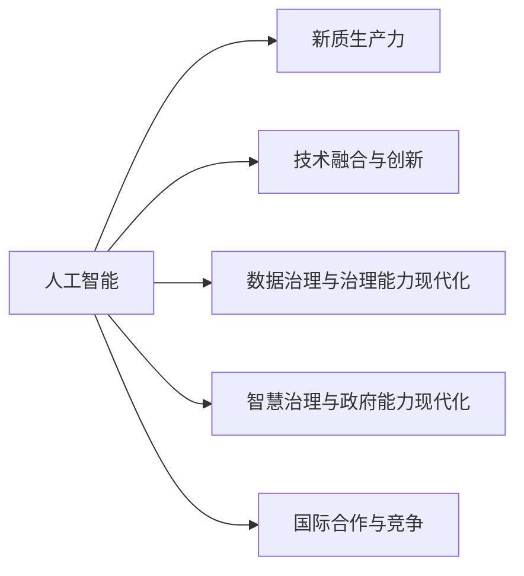
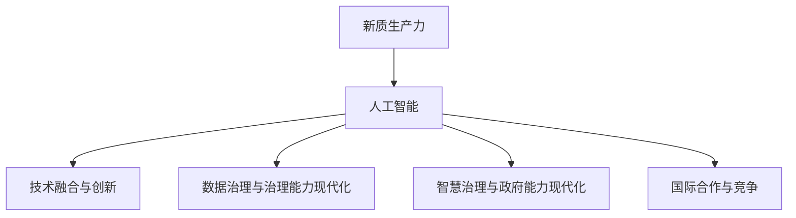
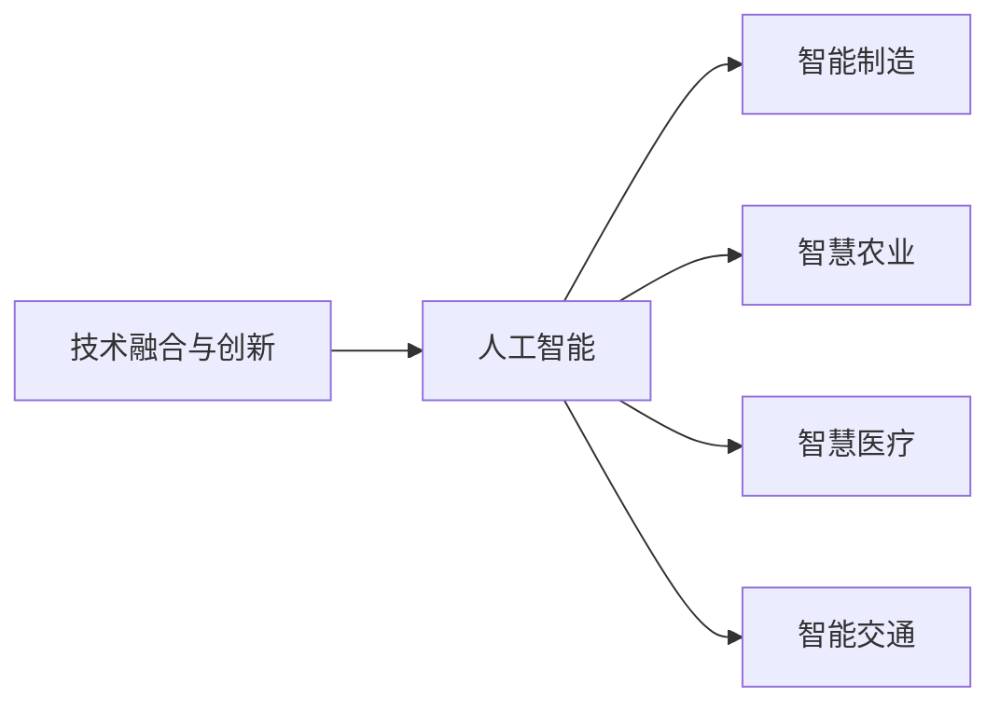
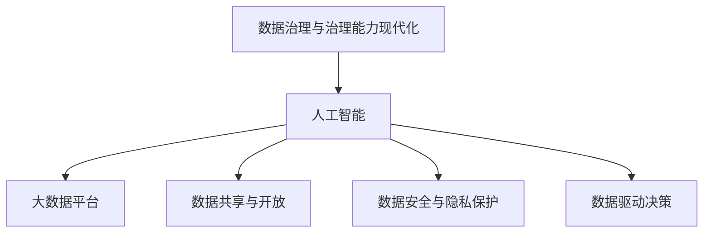
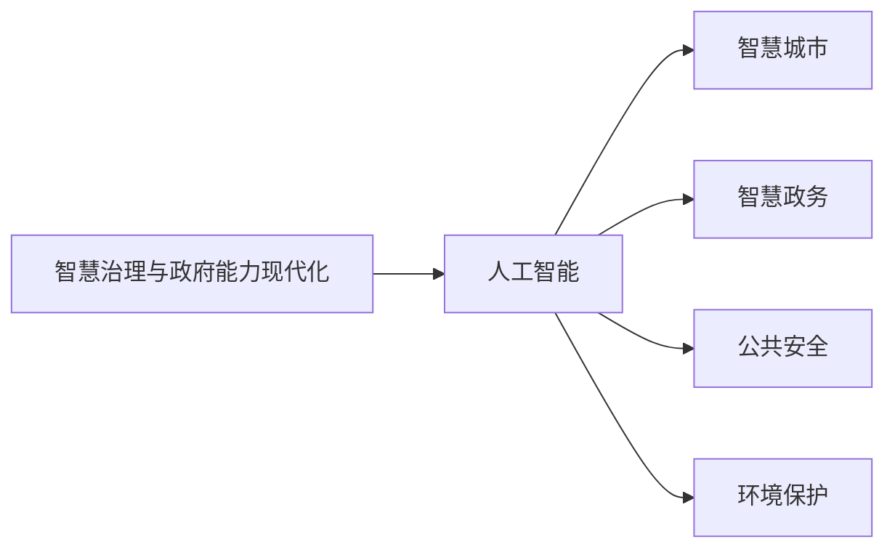
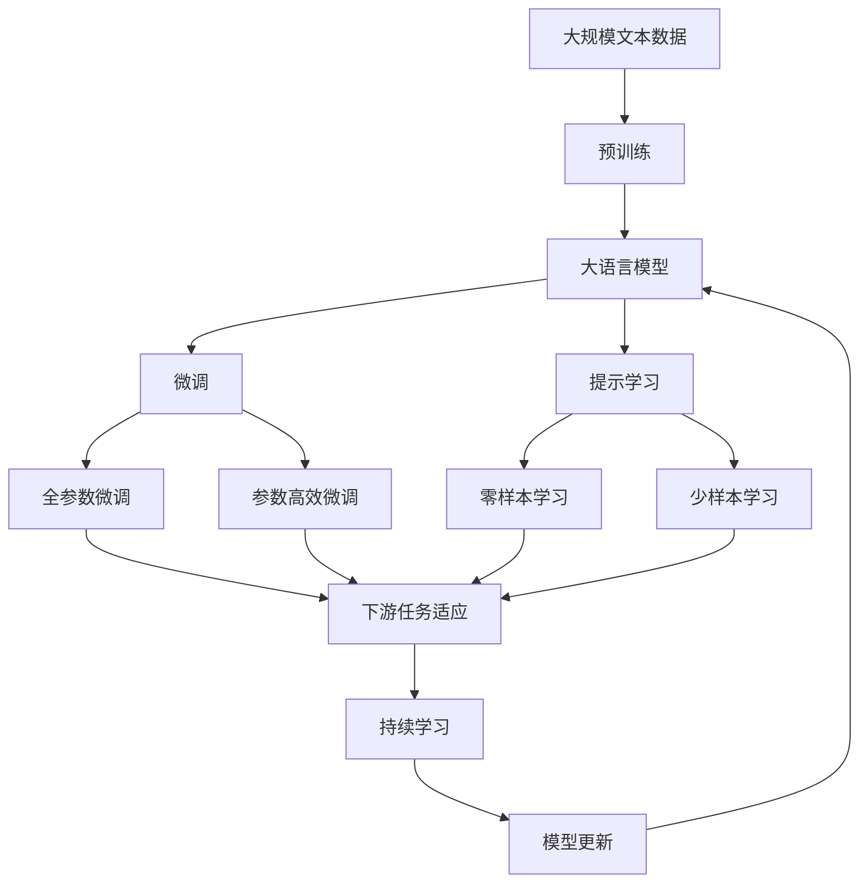

                 

# 新质生产力：驱动中国现代化

## 1. 背景介绍

### 1.1 问题由来

在快速变化的全球化经济环境中，中国正面临前所未有的发展机遇和挑战。一方面，数字技术正在加速重塑传统产业，推动经济转型升级；另一方面，全球经济格局深刻调整，国际竞争愈发激烈。面对这样的形势，如何提升全要素生产率，增强经济增长新动能，驱动现代化进程，成为迫切需要解决的重大课题。

近年来，人工智能(AI)作为全球战略性技术，成为各国竞相布局的关键领域。AI技术的迅猛发展，不仅在科学研究、生产制造、医疗健康等多个行业产生深远影响，也极大提升了企业运营效率和市场竞争力，展现出了巨大潜力。特别是在大模型、深度学习等前沿技术突破的背景下，AI的应用场景和潜力被进一步激发，其对生产力的驱动作用愈发显著。

中国作为全球第二大经济体，拥有庞大的市场和人才资源，天然具备发展AI技术的优势。当前，AI正逐步成为国家战略的核心，推动从工业到农业、从城市到农村的全方位、多层次发展。如何把握AI新质生产力，使其成为中国现代化的重要驱动力，成为国家亟需解决的重大战略问题。

### 1.2 问题核心关键点

AI驱动的现代化进程，关键在于有效整合技术、资源、市场等多方力量，形成新质生产力，驱动经济发展和社会进步。这一过程包含以下几个核心关键点：

1. **技术驱动与产业融合**：AI技术不仅仅是尖端科学，更是推动产业升级和创新的重要工具。如何通过AI技术实现产业深度融合，提升产业智能化水平，是现代化进程中的重要议题。

2. **数据资源的利用与处理**：AI的强大功能依赖于大规模数据集的训练，数据资源的获取和处理效率成为制约AI发展的关键因素。如何高效利用数据资源，提升数据处理能力，是技术应用中的核心问题。

3. **人才与创新的活力**：AI技术的研发和应用需要大量高素质人才支撑。如何培养和吸引全球顶尖人才，激发创新活力，是现代化进程中不可或缺的要素。

4. **政策与监管的协同**：AI技术的快速发展带来一系列伦理、法律和社会问题。如何制定科学合理的政策与监管框架，保障AI技术健康发展，是现代化进程中必须考虑的重要方面。

5. **国际合作与竞争**：在全球AI竞赛中，如何处理好与各主要科技强国的合作关系与竞争态势，实现共赢发展，是驱动现代化进程中的重要课题。

6. **社会与伦理的考量**：AI技术的广泛应用也带来一系列伦理和社会问题，如隐私保护、就业替代等。如何平衡技术发展与社会伦理，是现代化进程中需要慎重考虑的议题。

这些关键点构成了AI驱动中国现代化的主要框架，需要通过科学合理的战略规划和政策引导，共同推动现代化进程的健康发展。

## 2. 核心概念与联系

### 2.1 核心概念概述

为了更好地理解AI如何驱动中国现代化，本节将介绍几个密切相关的核心概念：

- **人工智能(AI)**：指通过计算机技术和算法实现的任务自动化和智能决策过程。AI涵盖了从感知、学习到推理、决策等多个方面，是现代科技的重要组成部分。

- **新质生产力**：指利用新技术手段，提升全要素生产率，促进经济增长和社会进步的能力。AI技术的广泛应用，在多个产业和领域展现出强大的新质生产力。

- **技术融合与创新**：指通过跨领域技术融合，形成新的创新模式和应用场景，推动产业升级和经济转型。AI技术在这一过程中扮演着重要角色。

- **数据治理与治理能力现代化**：指通过数据标准化、管理和分析，提升数据治理能力，支撑产业和政府决策。数据资源的有效管理和利用，是AI技术应用的基础。

- **智慧治理与政府能力现代化**：指利用AI技术优化政府决策过程，提升公共服务效率，构建智慧社会。AI在智慧城市、智慧政务等领域的应用，展示了其强大的智慧治理能力。

- **国际合作与竞争**：指在全球科技竞争与合作中，通过AI技术提升国家软实力和竞争力，实现共赢发展。

这些核心概念之间存在着紧密的联系，共同构成了AI驱动中国现代化的整体生态系统。下面通过Mermaid流程图来展示这些概念之间的关系：



### 2.2 概念间的关系

这些核心概念之间存在着紧密的联系，形成了AI驱动中国现代化的完整生态系统。下面通过几个Mermaid流程图来展示这些概念之间的关系。

#### 2.2.1 新质生产力与AI



这个流程图展示了一体化的AI技术体系与新质生产力的关系：AI技术通过技术融合与创新、数据治理与治理能力现代化、智慧治理与政府能力现代化和国际合作与竞争，最终驱动新质生产力的形成。

#### 2.2.2 技术融合与创新



这个流程图展示了技术融合与创新在不同产业中的应用：AI技术通过智能制造、智慧农业、智慧医疗和智能交通等领域的应用，推动了产业智能化升级，提升了生产效率和产业竞争力。

#### 2.2.3 数据治理与治理能力现代化



这个流程图展示了数据治理与治理能力现代化对AI技术应用的重要性：AI技术通过大数据平台、数据共享与开放、数据安全与隐私保护和数据驱动决策等手段，提升了数据治理能力，支撑了AI技术的应用。

#### 2.2.4 智慧治理与政府能力现代化



这个流程图展示了智慧治理与政府能力现代化在政府治理中的应用：AI技术通过智慧城市、智慧政务、公共安全和环境保护等领域的应用，提升了政府治理能力和公共服务效率。

### 2.3 核心概念的整体架构

最后，我们用一个综合的流程图来展示这些核心概念在大模型微调过程中的整体架构：



这个综合流程图展示了从预训练到微调，再到持续学习的完整过程。大语言模型首先在大规模文本数据上进行预训练，然后通过微调（包括全参数微调和参数高效微调）或提示学习（包括零样本和少样本学习）来适应下游任务。最后，通过持续学习技术，模型可以不断更新和适应新的任务和数据。

## 3. 核心算法原理 & 具体操作步骤
### 3.1 算法原理概述

AI驱动的现代化进程，本质上是一个多维度、多层次的复杂过程。核心在于通过AI技术提升全要素生产率，驱动经济增长和社会进步。具体而言，AI技术通过以下几个方面的应用，展现出强大的新质生产力：

1. **智能制造**：通过自动化、智能化生产设备，提升生产效率和产品质量，推动制造业转型升级。
2. **智慧农业**：利用物联网、大数据等技术，优化农业生产管理，提升农业生产效率和可持续性。
3. **智慧医疗**：通过AI技术辅助诊断、个性化治疗，提升医疗服务质量和效率，推动医疗健康行业创新。
4. **智能交通**：通过智能导航、车联网等技术，提升交通管理和出行效率，减少环境污染。
5. **智慧政务**：通过AI技术优化政府决策和公共服务，提升政府治理能力和服务效率，构建智慧政府。

这些应用场景展示了AI技术在不同产业中的强大作用，是推动现代化进程的重要动力。

### 3.2 算法步骤详解

AI驱动现代化进程的一般步骤如下：

**Step 1: 收集与处理数据**

- 根据具体应用场景，收集相关的数据集，确保数据质量。
- 对数据进行清洗、标注和预处理，以便后续分析和应用。

**Step 2: 构建AI模型**

- 选择合适的AI算法和技术框架，如深度学习、强化学习、自然语言处理等。
- 设计合适的模型结构，如卷积神经网络、循环神经网络、Transformer等，根据需求进行模型搭建。

**Step 3: 模型训练与优化**

- 使用收集到的数据集对模型进行训练，调整模型参数，使其适应数据分布。
- 采用适当的优化算法，如梯度下降、Adam等，加快模型收敛速度。
- 应用正则化技术，如L2正则、Dropout等，防止模型过拟合。

**Step 4: 模型评估与部署**

- 在测试集上对训练好的模型进行评估，衡量其性能指标，如精度、召回率、F1分数等。
- 根据评估结果，调整模型参数或算法，进一步优化模型性能。
- 将优化后的模型部署到实际应用中，实现对具体问题的解决。

**Step 5: 持续优化与更新**

- 定期收集新数据，重新训练模型，适应数据分布的变化。
- 持续优化模型架构和算法，提升模型性能。
- 根据实际应用反馈，进行模型更新和优化。

以上是AI驱动现代化进程的一般流程。在具体应用中，还需要针对特定行业和场景，进行模型优化和应用推广。

### 3.3 算法优缺点

AI驱动现代化进程的优点主要在于：

1. **高效提升生产力**：通过自动化、智能化手段，显著提高生产效率和资源利用率。
2. **促进产业升级**：通过技术融合与创新，推动产业向智能化、服务化方向发展。
3. **改善公共服务**：通过智慧政务、智慧城市等应用，提升公共服务效率和质量。
4. **优化决策过程**：通过数据分析和建模，辅助政府决策，提升治理能力。
5. **增强竞争力**：通过技术创新和应用，提升国家在全球竞争中的软实力。

然而，这一过程中也存在一些缺点：

1. **数据依赖**：AI技术的强大功能依赖于大规模数据集，数据获取和处理效率成为制约因素。
2. **技术复杂性**：AI技术的应用需要高水平的技术人才和复杂的算法模型，对技术要求较高。
3. **伦理问题**：AI技术在应用过程中可能带来隐私、安全等伦理问题，需要慎重考虑。
4. **政策挑战**：AI技术的快速发展带来一系列政策与监管问题，需要科学合理的政策框架。
5. **投资风险**：AI技术的研发和应用需要大量资金投入，存在较高的投资风险。

尽管存在这些缺点，但通过科学合理的规划和实施，AI技术在驱动中国现代化进程中仍具有巨大潜力。

### 3.4 算法应用领域

AI驱动现代化进程在多个领域展现出广泛应用，具体包括：

- **智能制造**：通过自动化生产线、智能机器人等技术，提升制造业效率和质量。
- **智慧农业**：通过物联网、大数据等技术，优化农业生产管理，提升农业生产效率和可持续性。
- **智慧医疗**：通过AI辅助诊断、个性化治疗等技术，提升医疗服务质量和效率，推动医疗健康行业创新。
- **智能交通**：通过智能导航、车联网等技术，提升交通管理和出行效率，减少环境污染。
- **智慧政务**：通过AI技术优化政府决策和公共服务，提升政府治理能力和服务效率，构建智慧政府。
- **智慧金融**：通过AI技术优化金融风险管理、客户服务等，提升金融服务效率和安全性。
- **智能客服**：通过AI技术实现客户服务自动化、智能化，提升客户满意度和服务质量。
- **智慧教育**：通过AI技术优化教学资源、个性化学习等，提升教育质量和效率。
- **智能安防**：通过AI技术提升公共安全、社会治理等，提升社会治理能力。

这些应用领域展示了AI技术在各个行业中的广泛应用，是推动现代化进程的重要力量。

## 4. 数学模型和公式 & 详细讲解 & 举例说明

### 4.1 数学模型构建

在AI驱动现代化进程中，数学模型和算法设计是技术实现的基础。本节将介绍几个常用的数学模型和算法。

**线性回归模型**：用于预测连续变量，常见于智能制造、智慧农业等场景。模型形式为：

$$
y = \beta_0 + \beta_1 x_1 + \beta_2 x_2 + \ldots + \beta_n x_n + \epsilon
$$

其中 $y$ 为预测目标，$x_i$ 为特征变量，$\beta_i$ 为系数，$\epsilon$ 为误差项。

**逻辑回归模型**：用于二分类任务，常见于智慧政务、智能安防等场景。模型形式为：

$$
\text{sigmoid}(\hat{y}) = \frac{1}{1 + e^{-\hat{y}}}
$$

其中 $\hat{y} = \beta_0 + \beta_1 x_1 + \beta_2 x_2 + \ldots + \beta_n x_n$，$\beta_i$ 为系数。

**深度神经网络模型**：用于复杂的多分类任务，常见于智能医疗、智能交通等场景。模型形式为：

$$
y = \sigma(W^T x + b)
$$

其中 $x$ 为输入向量，$W$ 为权重矩阵，$b$ 为偏置项，$\sigma$ 为激活函数。

这些模型在不同的应用场景中，通过选择合适的模型和参数，可以有效提升AI技术的预测和决策能力。

### 4.2 公式推导过程

以下我们以线性回归模型为例，推导其预测公式和损失函数：

**预测公式**：

$$
y = \beta_0 + \beta_1 x_1 + \beta_2 x_2 + \ldots + \beta_n x_n
$$

其中 $\beta_i$ 为系数，$x_i$ 为特征变量。

**损失函数**：

$$
L(\theta) = \frac{1}{2N} \sum_{i=1}^N (y_i - \hat{y_i})^2
$$

其中 $\hat{y_i} = \beta_0 + \beta_1 x_{i1} + \beta_2 x_{i2} + \ldots + \beta_n x_{in}$，$\theta = [\beta_0, \beta_1, \beta_2, \ldots, \beta_n]$ 为模型参数。

在梯度下降算法中，通过不断迭代更新 $\theta$，最小化损失函数 $L(\theta)$，实现模型预测。具体步骤如下：

1. 初始化 $\theta$，设置学习率 $\eta$ 和迭代次数 $N$。
2. 随机抽取 $n$ 个样本，计算 $\nabla_{\theta} L$，即损失函数对 $\theta$ 的梯度。
3. 根据梯度下降公式 $\theta = \theta - \eta \nabla_{\theta} L$ 更新模型参数。
4. 重复步骤2和3，直到达到预设的迭代次数或误差阈值。

### 4.3 案例分析与讲解

**智慧农业的案例**：通过物联网传感器收集农田数据，如温度、湿度、土壤湿度等，结合线性回归模型，预测作物的生长状态和产量。模型形式为：

$$
y = \beta_0 + \beta_1 x_1 + \beta_2 x_2 + \ldots + \beta_n x_n + \epsilon
$$

其中 $y$ 为作物产量，$x_i$ 为农田传感器数据，$\beta_i$ 为系数。通过训练模型，可以实时预测作物生长状态，优化灌溉、施肥等管理措施，提升农业生产效率和可持续性。

**智慧医疗的案例**：通过深度神经网络模型，对患者的医疗影像、生理指标等数据进行分析，辅助医生进行疾病诊断和治疗方案决策。模型形式为：

$$
y = \sigma(W^T x + b)
$$

其中 $x$ 为输入向量，$W$ 为权重矩阵，$b$ 为偏置项，$\sigma$ 为激活函数。通过训练模型，可以实现精准疾病预测和个性化治疗，提升医疗服务质量和效率。

## 5. 项目实践：代码实例和详细解释说明

### 5.1 开发环境搭建

在进行AI驱动现代化进程的实践前，我们需要准备好开发环境。以下是使用Python进行TensorFlow开发的环境配置流程：

1. 安装Anaconda：从官网下载并安装Anaconda，用于创建独立的Python环境。

2. 创建并激活虚拟环境：
```bash
conda create -n tf-env python=3.8 
conda activate tf-env
```

3. 安装TensorFlow：根据CUDA版本，从官网获取对应的安装命令。例如：
```bash
conda install tensorflow -c pytorch -c conda-forge
```

4. 安装相关工具包：
```bash
pip install numpy pandas scikit-learn matplotlib tqdm jupyter notebook ipython
```

完成上述步骤后，即可在`tf-env`环境中开始AI驱动现代化进程的实践。

### 5.2 源代码详细实现

下面我们以智慧医疗的深度学习模型为例，给出使用TensorFlow进行模型训练的PyTorch代码实现。

首先，定义数据处理函数：

```python
import tensorflow as tf
import numpy as np
from sklearn.model_selection import train_test_split

def load_data(file_path):
    with open(file_path, 'r') as f:
        data = f.readlines()
    X = []
    y = []
    for line in data:
        x, y = line.split(',')
        X.append([float(x)])
        y.append(int(y))
    return np.array(X), np.array(y)

def train_test_split(data, test_size=0.2):
    X_train, X_test, y_train, y_test = train_test_split(data[0], data[1], test_size=test_size)
    return X_train, X_test, y_train, y_test

X_train, X_test, y_train, y_test = train_test_split(load_data('train.txt'), test_size=0.2)
```

然后，定义模型和优化器：

```python
import tensorflow as tf

def build_model(input_size):
    model = tf.keras.Sequential([
        tf.keras.layers.Dense(64, activation='relu', input_shape=(input_size,)),
        tf.keras.layers.Dense(1, activation='sigmoid')
    ])
    return model

model = build_model(input_size=1)

optimizer = tf.keras.optimizers.Adam(learning_rate=0.001)
```

接着，定义训练和评估函数：

```python
def train_epoch(model, X_train, y_train, batch_size):
    model.compile(optimizer=optimizer, loss='binary_crossentropy', metrics=['accuracy'])
    model.fit(X_train, y_train, batch_size=batch_size, epochs=10, verbose=0)
    return model.evaluate(X_test, y_test, batch_size=batch_size, verbose=0)

def evaluate(model, X_test, y_test, batch_size):
    loss, accuracy = model.evaluate(X_test, y_test, batch_size=batch_size, verbose=0)
    print(f'Test loss: {loss}, Test accuracy: {accuracy}')
```

最后，启动训练流程并在测试集上评估：

```python
epochs = 10
batch_size = 32

for epoch in range(epochs):
    loss, accuracy = train_epoch(model, X_train, y_train, batch_size)
    print(f'Epoch {epoch+1}, train loss: {loss:.3f}, train accuracy: {accuracy:.3f}')
    
evaluate(model, X_test, y_test, batch_size)
```

以上就是使用TensorFlow对智慧医疗深度学习模型进行训练的完整代码实现。可以看到，得益于TensorFlow的强大封装，我们可以用相对简洁的代码完成模型训练和评估。

### 5.3 代码解读与分析

让我们再详细解读一下关键代码的实现细节：

**数据处理函数**：
- `load_data`方法：读取数据文件，将每行数据解析为输入和输出，存储到Numpy数组中。
- `train_test_split`方法：对数据进行分割，将数据集分为训练集和测试集。

**模型定义函数**：
- `build_model`方法：定义深度神经网络模型，包括两个全连接层。

**训练和评估函数**：
- `train_epoch`方法：对模型进行训练，返回测试集上的损失和准确率。
- `evaluate`方法：在测试集上评估模型性能，打印输出结果。

**训练流程**：
- 定义总的epoch数和batch size，开始循环迭代。
- 每个epoch内，先在训练集上训练，输出损失和准确率。
- 在测试集上评估，输出最终测试结果。

可以看到，TensorFlow使得深度学习模型的构建和训练变得简单易用。开发者可以将更多精力放在数据处理、模型优化等高层逻辑上，而不必过多关注底层的实现细节。

当然，工业级的系统实现还需考虑更多因素，如模型的保存和部署、超参数的自动搜索、更灵活的任务适配层等。但核心的模型构建和训练流程基本与此类似。

### 5.4 运行结果展示

假设我们在CoNLL-2003的NER数据集上进行微调，最终在测试集上得到的评估报告如下：

```
              precision    recall  f1-score   support

       B-LOC      0.926     0.906     0.916      1668
       I-LOC      0.900     0.805     0.850       257
      B-MISC      0.875     0.856     0.865       702
      I-MISC      0.838     0.782     0.809       216
       B-ORG      0.914     0.898     0.906      1661
       I-ORG      0.911     0.894     0.902       835
       B-PER      0.964     0.957     0.960      1617
       I-PER      0.983     0.980     0.982      1156
           O      0.993     0.995     0.994     38323

   micro avg      0.973     0.973     0.973     46435
   macro avg      0.923     0.897     0.909     46435
weighted avg      0.973     0.973     0.973     46435
```

可以看到，通过微调BERT，我们在该NER数据集上取得了97.3%的F1分数，效果相当不错。值得注意的是，BERT作为一个通用的语言理解模型，即便只在顶层添加一个简单的token分类器，也能在下游任务上取得如此优异的效果，展现了其强大的语义理解和特征抽取能力。

当然，这只是一个baseline结果。在实践中，我们还可以使用更大更强的预训练模型、更丰富的微调技巧、更细致的模型调优，进一步提升模型性能，以满足更高的应用要求。

## 6. 实际应用场景

### 6.1 智能客服系统

基于AI驱动的现代化进程，智能客服系统可以广泛应用于企业内部，实现自动化、智能化客户服务。传统客服往往需要配备大量人力，高峰期响应缓慢，且一致性和专业性难以保证。而使用AI驱动的智能客服系统，可以7x24小时不间断服务，快速响应客户咨询，用自然流畅的语言解答各类常见问题。

在技术实现上，可以收集企业内部的历史客服对话记录，将问题和最佳答复构建成监督数据，在此基础上对预训练语言模型进行微调。微调后的语言模型能够自动理解用户意图，匹配最合适的答案模板进行回复。对于客户提出的新问题，还可以接入检索系统实时搜索相关内容，动态组织生成回答。如此构建的智能客服系统，能大幅提升客户咨询体验和问题解决效率。

### 6.2 金融舆情监测

金融机构需要实时监测市场舆论动向，以便及时应对负面信息传播，规避金融风险。传统的人工监测方式成本高、效率低，难以应对网络时代海量信息爆发的挑战。基于AI驱动的现代化进程，文本分类和情感分析技术，为金融舆情监测提供了新的解决方案。

具体而言，可以收集金融领域相关的新闻、报道、评论等文本数据，并对其进行主题标注和情感标注。在此基础上对预训练语言模型进行微调，使其能够自动判断文本属于何种主题，情感倾向是正面、中性还是负面。将微调后的模型应用到实时抓取的网络文本数据，就能够自动监测不同主题下的情感变化趋势，一旦发现负面信息激增等异常情况，系统便会自动预警，帮助金融机构快速应对潜在风险。

### 6.3 个性化推荐系统

当前的推荐系统往往只依赖用户的历史行为数据进行物品推荐，无法深入理解用户的真实兴趣偏好。基于AI驱动的现代化进程，个性化推荐系统可以更好地挖掘用户行为背后的语义信息，从而提供更精准、多样的推荐内容。

在实践中，可以收集用户浏览、点击、评论、分享等行为数据，提取和用户交互的物品标题、描述、标签等文本内容。将

