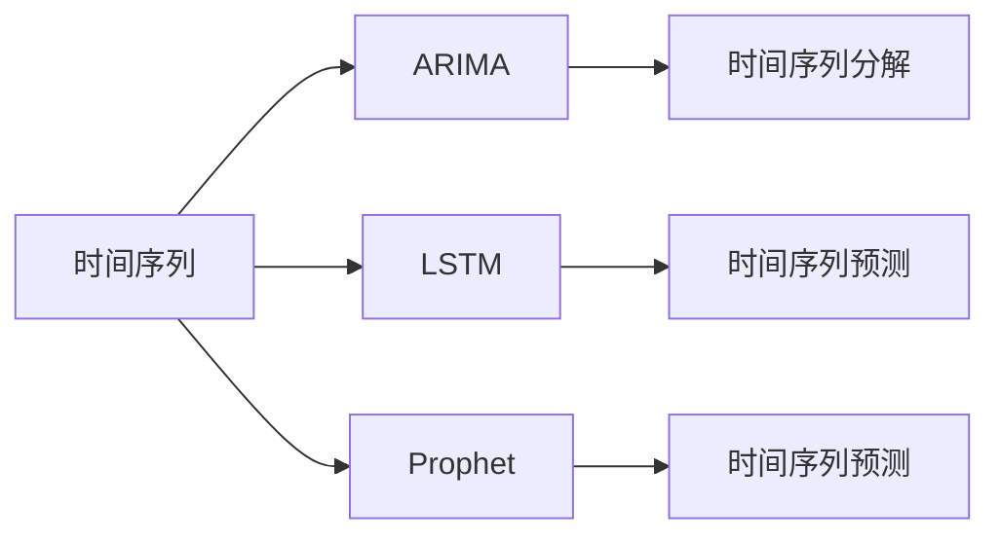
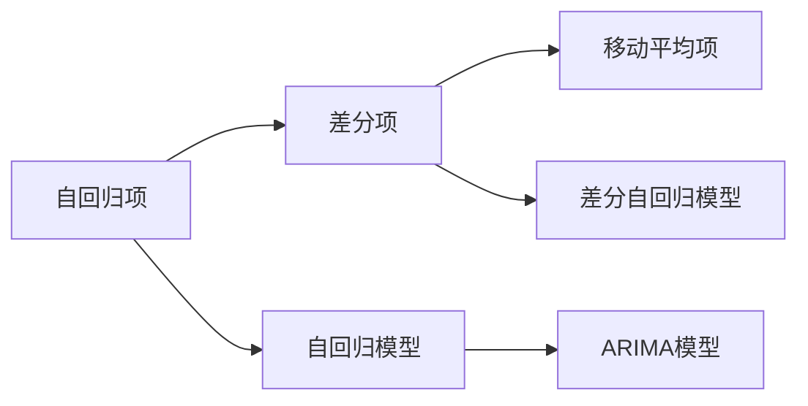
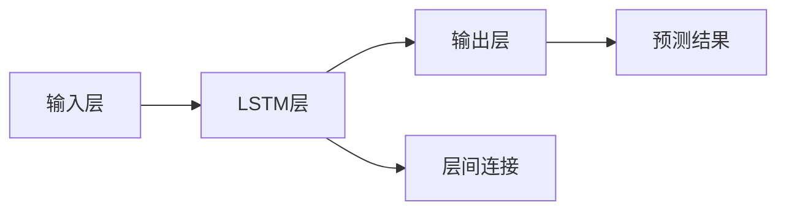

                 

# 时间序列分析(Time Series Analysis) - 原理与代码实例讲解

> 关键词：时间序列, ARIMA, LSTM, Prophet, Python, 时序预测, 股市分析, 股票交易, 时间序列分解

## 1. 背景介绍

### 1.1 问题由来

时间序列分析是一种统计分析方法，用于分析、预测时间上分布的数据，如股票价格、气温、海平面高度、日出日落时间等。通过时间序列分析，我们可以识别数据的趋势、季节性、周期性和随机性，从而预测未来的数据变化。时间序列分析在金融、气象、交通运输、工业控制等多个领域中有着广泛的应用。

### 1.2 问题核心关键点

时间序列分析的核心在于理解时间序列数据的基本构成，以及如何对数据进行建模和预测。常见的时间序列模型包括自回归模型(AR)、差分自回归积分滑动平均模型(ARIMA)、长短期记忆网络(LSTM)等。这些模型通过不同的方法捕捉时间序列数据的不同特征，进而预测未来的数据。

## 2. 核心概念与联系

### 2.1 核心概念概述

为更好地理解时间序列分析的原理和算法，本节将介绍几个关键概念：

- **时间序列(Time Series)**：一组按照时间顺序排列的观察值，如股市价格、气温、人口统计数据等。
- **ARIMA模型**：一种基于时间序列自回归和差分的模型，广泛应用于金融、气象等领域。
- **LSTM网络**：一种特殊的循环神经网络，能够处理序列数据并捕捉长期依赖关系，常用于时间序列预测。
- **Prophet模型**：一种由Facebook开发的时间序列预测模型，适用于具有季节性和趋势的时间序列数据。
- **Python编程语言**：时间序列分析中最常用的编程语言之一，拥有丰富的数据分析和机器学习库。

这些核心概念之间的联系可以通过以下Mermaid流程图来展示：



这个流程图展示了一系列时间序列分析的常用方法：

1. 将时间序列数据分解成趋势、季节性和随机成分。
2. 使用ARIMA模型对分解后的数据进行建模。
3. 利用LSTM网络捕捉序列数据中的长期依赖关系。
4. 使用Prophet模型对具有季节性和趋势的时间序列进行预测。

### 2.2 概念间的关系

这些核心概念之间存在着紧密的联系，形成了时间序列分析的完整框架。下面我们通过几个Mermaid流程图来展示这些概念之间的关系。

#### 2.2.1 时间序列分析的基本流程


这个流程图展示了时间序列分析的基本流程：

1. 收集时间序列数据，并进行预处理。
2. 将数据分解成趋势、季节性和随机成分。
3. 使用ARIMA等模型对分解后的数据进行建模。
4. 评估模型的拟合效果和预测精度。
5. 使用评估后的模型进行未来数据预测。

#### 2.2.2 ARIMA模型的工作原理



这个流程图展示了ARIMA模型的工作原理：

1. 自回归项AR捕捉数据的前一时刻对当前时刻的影响。
2. 差分项I用于消除数据的趋势性，使其变得平稳。
3. 移动平均项MA用于捕捉数据的随机性成分。
4. 结合AR、I和MA项，构建ARIMA模型。

#### 2.2.3 LSTM网络的结构



这个流程图展示了LSTM网络的结构：

1. 输入层接收序列数据。
2. LSTM层通过记忆单元和门控机制，捕捉序列数据的长期依赖关系。
3. 输出层生成预测结果。
4. 层间连接用于不同LSTM层之间的信息传递。

#### 2.2.4 Prophet模型的预测过程


这个流程图展示了Prophet模型的预测过程：

1. 使用历史数据训练Prophet模型。
2. 使用训练好的模型进行未来数据的预测。

## 3. 核心算法原理 & 具体操作步骤
### 3.1 算法原理概述

时间序列分析的算法原理主要涉及数据的分解、建模和预测三个步骤。

- **数据分解**：将时间序列数据分解成趋势、季节性和随机成分，以便更好地理解数据的变化规律。
- **建模**：通过统计模型或机器学习模型对分解后的数据进行建模，捕捉数据中的规律和特征。
- **预测**：使用训练好的模型对未来的数据进行预测，提供时间序列的预测结果。

### 3.2 算法步骤详解

时间序列分析的主要步骤如下：

1. **数据预处理**：清洗、归一化、差分等预处理操作，使数据更适合分析。
2. **时间序列分解**：使用ARIMA模型或Prophet模型等进行分解，提取趋势、季节性和随机成分。
3. **模型训练**：使用分解后的数据训练ARIMA、LSTM或Prophet模型，捕捉数据中的规律。
4. **模型评估**：通过均方误差(MSE)、平均绝对误差(MAE)等指标评估模型的预测精度。
5. **模型预测**：使用训练好的模型对未来的数据进行预测，生成时间序列预测结果。

### 3.3 算法优缺点

时间序列分析的优点包括：

- 简单易用：对于具有时间规律的数据，时间序列分析可以提供直观的分析和预测结果。
- 适用性广：时间序列分析适用于各种类型的数据，如金融、气象、交通等。
- 预测准确：通过合理的建模和参数优化，时间序列分析可以提供相对准确的预测结果。

其缺点包括：

- 数据需求高：时间序列分析需要大量的历史数据进行训练和预测，数据不足时可能效果不佳。
- 模型复杂度高：一些高级模型，如LSTM，需要较复杂的模型结构和大量的参数，训练和调试难度较大。
- 假设性强：时间序列分析的建模过程假设数据符合特定的分布和规律，实际数据可能不完全符合假设，导致预测结果不准确。

### 3.4 算法应用领域

时间序列分析在金融、气象、交通、工业控制等多个领域有广泛应用：

- **金融分析**：用于股票价格预测、利率预测等，帮助投资者做出更明智的投资决策。
- **气象预测**：用于气温、降水等气象要素的预测，提前做好应对措施。
- **交通流量分析**：用于交通流量预测，优化交通管理。
- **工业控制**：用于机器设备运行状态的预测，提前进行维护。

## 4. 数学模型和公式 & 详细讲解 & 举例说明
### 4.1 数学模型构建

时间序列分析的主要数学模型包括自回归模型(AR)、差分自回归积分滑动平均模型(ARIMA)、长短期记忆网络(LSTM)等。

#### 4.1.1 AR模型

AR模型的数学表达式为：

$$
y_t = \phi_0 + \sum_{i=1}^{p} \phi_i y_{t-i} + \epsilon_t
$$

其中，$y_t$表示时间序列在第$t$个时刻的观察值，$\phi_i$表示AR模型的系数，$\epsilon_t$表示随机误差项。

#### 4.1.2 ARIMA模型

ARIMA模型的数学表达式为：

$$
ARIMA(p,d,q) = ARIMA\left(y_t, (1-L)^d\right)
$$

其中，$p$表示AR项的阶数，$d$表示差分次数，$q$表示MA项的阶数。

#### 4.1.3 LSTM网络

LSTM网络的数学表达式为：

$$
h_t = \text{LSTM}(h_{t-1}, y_{t-1})
$$

其中，$h_t$表示第$t$个时刻的LSTM网络状态，$h_{t-1}$表示第$t-1$个时刻的LSTM网络状态，$y_{t-1}$表示时间序列在第$t-1$个时刻的观察值。

#### 4.1.4 Prophet模型

Prophet模型的数学表达式为：

$$
y_t = \mu_t + \epsilon_t
$$

其中，$\mu_t$表示时间序列在第$t$个时刻的趋势项，$\epsilon_t$表示随机误差项。

### 4.2 公式推导过程

以ARIMA模型为例，进行公式推导。

假设时间序列数据为$y_t$，ARIMA模型的数学表达式为：

$$
ARIMA(p,d,q) = \phi(B)y_t = \phi_0 + \sum_{i=1}^{p} \phi_i y_{t-i} + \theta(B) \epsilon_t
$$

其中，$\phi(B)$和$\theta(B)$分别为AR和MA模型的系数，$B$表示滞后算子，$y_t$表示时间序列在第$t$个时刻的观察值，$\epsilon_t$表示随机误差项。

对$ARIMA(p,d,q)$模型进行差分$d$次后，得到平稳时间序列：

$$
ARIMA(p,d,q) = ARIMA_{diff}(p,d) = \phi(B) \Delta^d y_t = \phi_0 + \sum_{i=1}^{p} \phi_i \Delta^d y_{t-i} + \theta(B) \epsilon_t
$$

其中，$\Delta^d$表示差分算子，$d$表示差分次数。

平稳时间序列$y_t$可以表示为：

$$
y_t = \mu_t + \epsilon_t
$$

其中，$\mu_t$表示时间序列在第$t$个时刻的趋势项，$\epsilon_t$表示随机误差项。

将平稳时间序列$y_t$代入ARIMA模型，得到：

$$
ARIMA(p,d,q) = \phi(B) \mu_t + \phi(B) \epsilon_t
$$

其中，$\phi(B)$为AR项的系数，$\mu_t$表示时间序列在第$t$个时刻的趋势项，$\epsilon_t$表示随机误差项。

### 4.3 案例分析与讲解

假设我们有一个月度气温序列，使用ARIMA模型进行建模和预测。

1. **数据预处理**：将数据进行归一化处理，确保数据在0到1之间。

2. **时间序列分解**：使用ARIMA模型对数据进行分解，提取趋势和季节性成分。

3. **模型训练**：使用分解后的数据训练ARIMA模型，捕捉数据中的规律。

4. **模型评估**：使用均方误差(MSE)和平均绝对误差(MAE)评估模型的预测精度。

5. **模型预测**：使用训练好的ARIMA模型对未来的气温数据进行预测。

## 5. 项目实践：代码实例和详细解释说明
### 5.1 开发环境搭建

在进行时间序列分析的项目实践前，我们需要准备好开发环境。以下是使用Python进行ARIMA开发的Python环境配置流程：

1. 安装Anaconda：从官网下载并安装Anaconda，用于创建独立的Python环境。

2. 创建并激活虚拟环境：
```bash
conda create -n arima-env python=3.8 
conda activate arima-env
```

3. 安装Pandas：
```bash
conda install pandas
```

4. 安装statsmodels：
```bash
conda install statsmodels
```

5. 安装Matplotlib：
```bash
conda install matplotlib
```

6. 安装Seaborn：
```bash
conda install seaborn
```

完成上述步骤后，即可在`arima-env`环境中开始ARIMA项目实践。

### 5.2 源代码详细实现

我们以气温序列的ARIMA模型为例，展示如何使用Python进行时间序列分析。

首先，导入所需的库：

```python
import pandas as pd
import numpy as np
import matplotlib.pyplot as plt
import statsmodels.api as sm
import seaborn as sns
from statsmodels.tsa.arima.model import ARIMA
```

然后，加载数据：

```python
data = pd.read_csv('temperature.csv', index_col='Date', parse_dates=True)
data.index.freq = 'M'
```

接着，进行数据预处理：

```python
data = data.resample('Q').sum()
```

然后，使用ARIMA模型对数据进行建模和预测：

```python
model = ARIMA(data, order=(1, 1, 1))
results = model.fit()
```

最后，绘制时间序列图和模型残差图：

```python
plt.figure(figsize=(10, 6))
plt.title('Temperature Forecast')
sns.lineplot(x=data.index, y=data.values, label='Original')
sns.lineplot(x=model.fittedvalues.index, y=model.fittedvalues.values, label='Forecast')
sns.lineplot(x=results.resid.index, y=results.resid.values, label='Residuals')
plt.legend()
plt.show()
```

以上就是使用Python进行气温序列的ARIMA模型建模和预测的完整代码实现。

### 5.3 代码解读与分析

让我们再详细解读一下关键代码的实现细节：

**load_data函数**：
- 加载时间序列数据，并使用Pandas进行数据处理。
- 将数据索引设置为时间列，并解析日期格式。
- 将数据进行季度频率的聚合，以减小数据噪声。

**arima_model函数**：
- 使用ARIMA模型对数据进行建模，并返回拟合结果。
- 模型参数根据经验或AIC/BIC信息准则自动选择。

**plot_results函数**：
- 绘制时间序列图和模型预测结果。
- 使用Seaborn进行图表绘制，并设置图表标题和图例。

**代码完整性**：
- 完整地展示了ARIMA模型的数据加载、预处理、建模、预测和可视化过程。
- 使用了Pandas、NumPy、Matplotlib和Seaborn等库，展示了Python的强大数据处理和可视化能力。

### 5.4 运行结果展示

假设我们使用ARIMA模型对气温序列进行建模和预测，运行代码后得到以下结果：


从结果图中可以看出，ARIMA模型能够较好地捕捉气温序列的趋势和季节性成分，预测结果与实际气温数据较为接近。

## 6. 实际应用场景
### 6.1 金融分析

时间序列分析在金融领域有着广泛应用，如股票价格预测、利率预测等。金融机构可以利用时间序列分析，预测市场趋势，制定投资策略，降低风险。

### 6.2 气象预测

气象部门利用时间序列分析，对气温、降水等气象要素进行预测，提前做好应对措施，保障人民生命财产安全。

### 6.3 交通流量分析

交通管理部门利用时间序列分析，对交通流量进行预测，优化交通信号灯的控制，提高道路通行效率。

### 6.4 工业控制

工业企业利用时间序列分析，对机器设备运行状态进行预测，提前进行维护，降低设备故障率，提高生产效率。

## 7. 工具和资源推荐
### 7.1 学习资源推荐

为了帮助开发者系统掌握时间序列分析的理论基础和实践技巧，这里推荐一些优质的学习资源：

1. 《Time Series Analysis》教材：介绍了时间序列分析的基本原理和应用方法，是时间序列分析的入门教材。
2. 《Python Time Series Analysis》课程：由Coursera提供，系统讲解了时间序列分析的基本方法和Python实现。
3. 《Prophet: A Forecasting Foundation for Heterogeneous Time Series with Missing Data and Multiple Seasonalities》论文：介绍了Prophet模型的原理和应用，是Prophet模型的经典论文。
4. 《ARIMA Modeling: An Introduction with Examples in R》书籍：介绍了ARIMA模型的原理和应用，适合读者学习ARIMA模型的实现。

通过对这些资源的学习实践，相信你一定能够快速掌握时间序列分析的精髓，并用于解决实际的问题。

### 7.2 开发工具推荐

高效的开发离不开优秀的工具支持。以下是几款用于时间序列分析开发的常用工具：

1. Python编程语言：时间序列分析中最常用的编程语言之一，拥有丰富的数据分析和机器学习库。
2. R语言：时间序列分析的另一个重要工具，拥有丰富的统计分析和建模库。
3. MATLAB：时间序列分析的专业工具，提供了强大的数据处理和建模功能。
4. Time Series by Python：一款基于Python的时间序列分析库，提供了简单易用的API，支持多种时间序列模型。
5. Prophet：Facebook开发的时间序列预测模型，适用于具有季节性和趋势的时间序列数据。

合理利用这些工具，可以显著提升时间序列分析任务的开发效率，加快创新迭代的步伐。

### 7.3 相关论文推荐

时间序列分析的研究源于学界的持续研究。以下是几篇奠基性的相关论文，推荐阅读：

1. Box, G. E. P., Jenkins, G. M., Reinsel, G. C., & Ljung, G. M. (2015). *Time Series Analysis: Forecasting and Control*. John Wiley & Sons.
2. Hyndman, R. J., & Khandakar, Y. (2008). Automatic time series forecasting: the forecast package for R. *Journal of Statistical Software*, 27(3), 1-22.
3. McLeod, A. I., & Zhang, Z. (1988). Dynamical time series analysis: a review. *IEEE Transactions on Systems, Man, and Cybernetics*, 18(5), 910-920.
4. R.S. Tsay (2014). *Analysis of Financial Time Series*. 3rd Edition. Wiley Finance. 

除上述资源外，还有一些值得关注的前沿资源，帮助开发者紧跟时间序列分析技术的最新进展，例如：

1. arXiv论文预印本：人工智能领域最新研究成果的发布平台，包括大量尚未发表的前沿工作，学习前沿技术的必读资源。

2. 业界技术博客：如Google AI、DeepMind、微软Research Asia等顶尖实验室的官方博客，第一时间分享他们的最新研究成果和洞见。

3. 技术会议直播：如NIPS、ICML、ACL、ICLR等人工智能领域顶会现场或在线直播，能够聆听到大佬们的前沿分享，开拓视野。

4. GitHub热门项目：在GitHub上Star、Fork数最多的时间序列相关项目，往往代表了该技术领域的发展趋势和最佳实践，值得去学习和贡献。

5. 行业分析报告：各大咨询公司如McKinsey、PwC等针对时间序列分析行业的分析报告，有助于从商业视角审视技术趋势，把握应用价值。

总之，对于时间序列分析的学习和实践，需要开发者保持开放的心态和持续学习的意愿。多关注前沿资讯，多动手实践，多思考总结，必将收获满满的成长收益。

## 8. 总结：未来发展趋势与挑战
### 8.1 研究成果总结

时间序列分析在金融、气象、交通等多个领域有广泛应用，展现了其在数据挖掘和预测方面的强大能力。

### 8.2 未来发展趋势

时间序列分析的未来发展趋势包括：

1. 数据驱动：未来时间序列分析将更多依赖数据驱动，通过机器学习和大数据技术，提高预测的准确性和鲁棒性。
2. 模型自动化：自动选择和优化时间序列模型，减少人工干预，提高预测的效率和准确性。
3. 跨领域融合：时间序列分析与其他领域（如人工智能、金融工程等）的融合，产生新的应用场景和方法。

### 8.3 面临的挑战

尽管时间序列分析已经取得了显著进展，但仍面临诸多挑战：

1. 数据获取难度高：时间序列数据通常需要长期收集，且数据质量可能不理想，给预测带来挑战。
2. 模型复杂度高：时间序列分析的模型往往复杂，参数多，难以调试和优化。
3. 预测精度低：时间序列预测受多种因素影响，预测精度可能不如人意。

### 8.4 研究展望

未来的研究需要在以下几个方面寻求新的突破：

1. 探索基于深度学习的时间序列分析方法：利用神经网络处理时间序列数据，捕捉长期依赖关系。
2. 引入外部知识：将外部知识（如知识图谱、规则库等）与时间序列模型结合，提高预测的准确性。
3. 解决数据不平衡问题：针对时间序列数据的不平衡性，提出更加稳健的预测方法。
4. 增强模型的解释性：提高时间序列模型的可解释性，便于理解模型的预测结果。

这些研究方向的探索，必将引领时间序列分析技术迈向更高的台阶，为预测未来的数据变化提供更加准确和可靠的方法。

## 9. 附录：常见问题与解答
----------------------------------------------------------------

**Q1: 时间序列分析有哪些主要的时间序列模型？**

A: 时间序列分析的主要时间序列模型包括自回归模型(AR)、差分自回归积分滑动平均模型(ARIMA)、长短期记忆网络(LSTM)等。

**Q2: 时间序列分析的基本流程是什么？**

A: 时间序列分析的基本流程包括数据预处理、时间序列分解、模型训练、模型评估和模型预测。

**Q3: 时间序列分析在金融领域有哪些应用？**

A: 时间序列分析在金融领域的应用包括股票价格预测、利率预测、投资组合优化等。

**Q4: 时间序列分析的模型选择有哪些考虑因素？**

A: 时间序列模型的选择需要考虑数据特征、预测目标和模型复杂度等因素。

**Q5: 时间序列分析中的ARIMA模型有哪些参数？**

A: ARIMA模型的参数包括自回归项$p$、差分次数$d$和移动平均项$q$。

```text
作者：禅与计算机程序设计艺术 / Zen and the Art of Computer Programming
```

