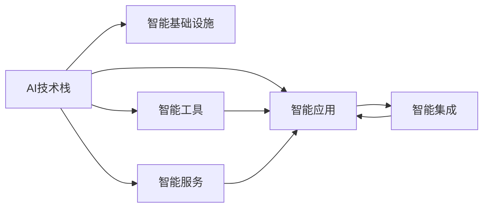
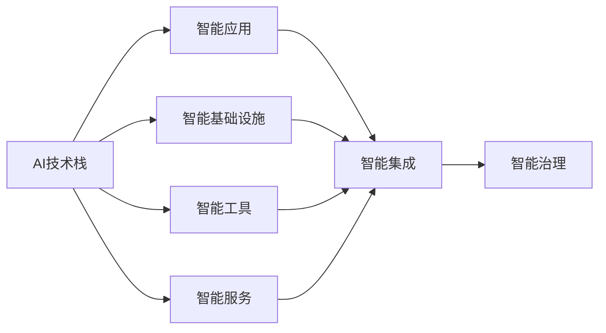
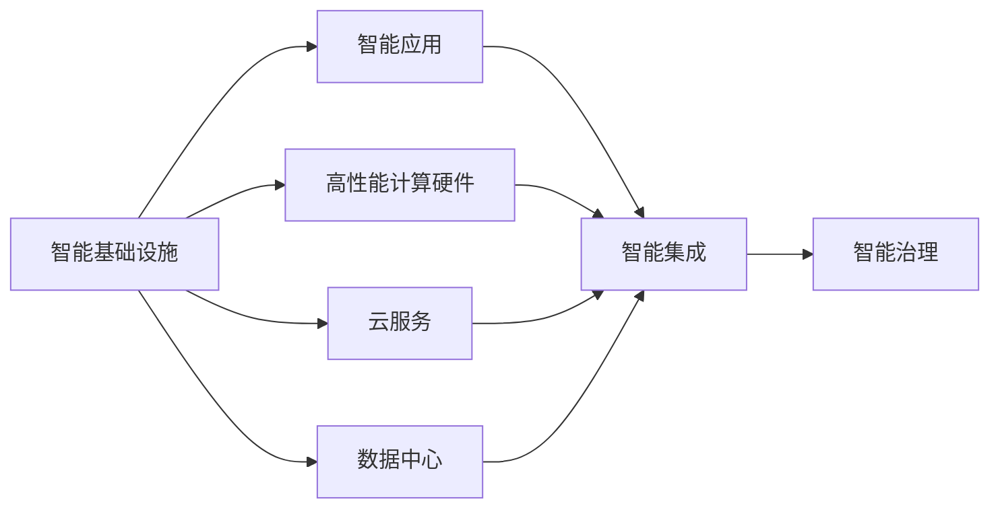
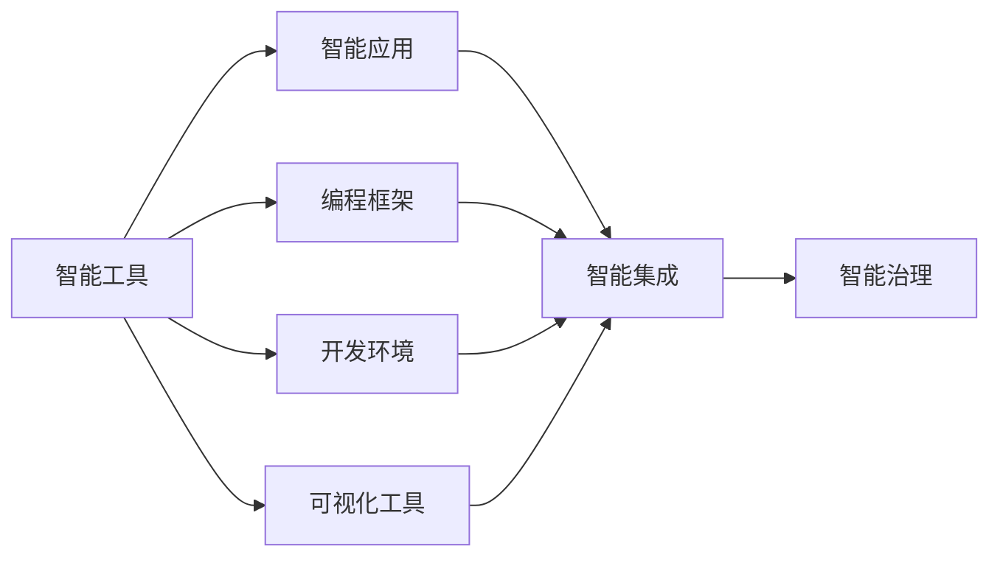
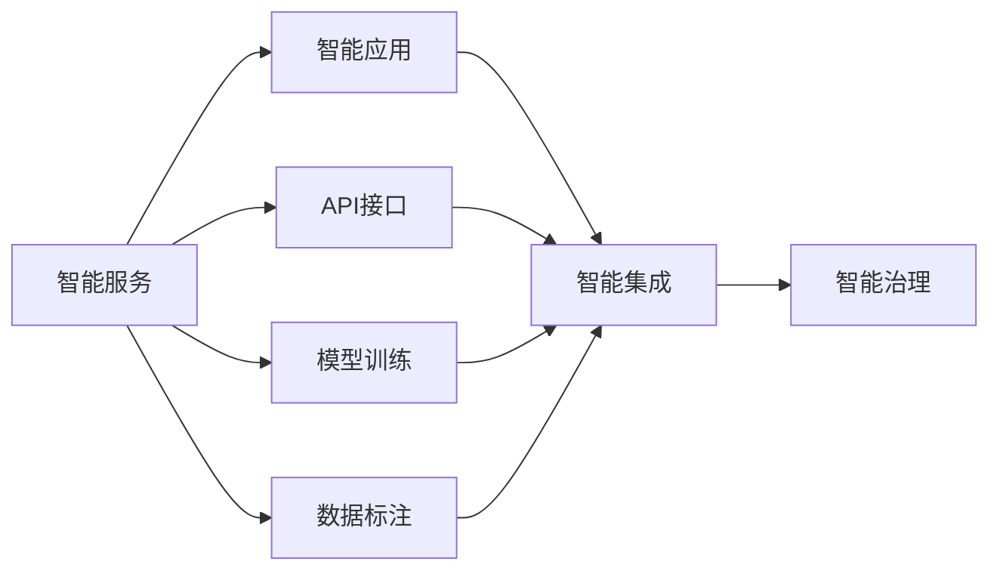
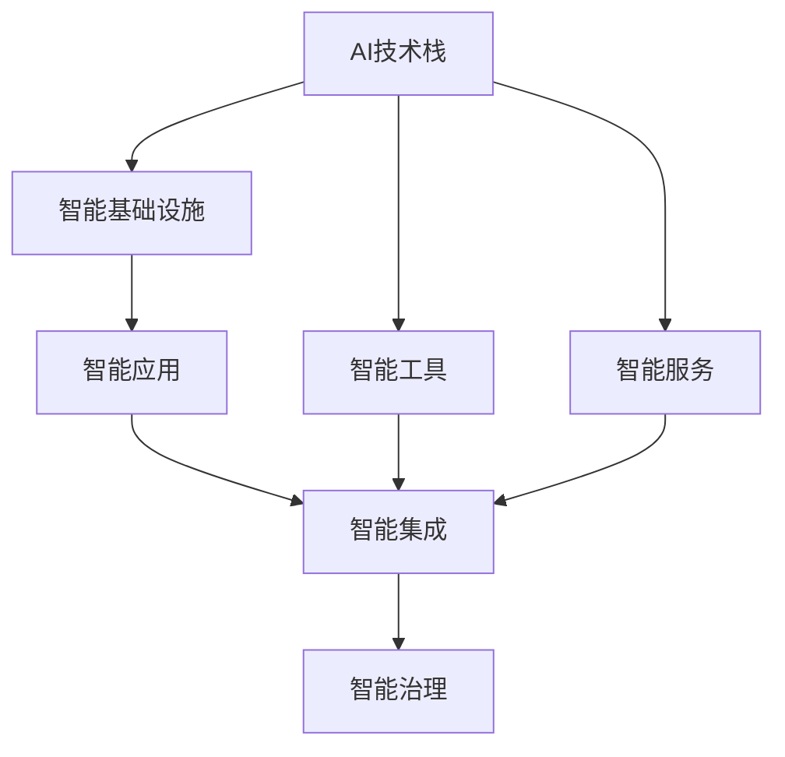

                 

## 1. 背景介绍

### 1.1 问题由来

过去几十年间，人工智能（AI）技术的发展突飞猛进，正逐渐成为全球经济社会发展的核心驱动力。从无人驾驶、工业自动化到医疗健康、教育培训等各个行业，AI技术正渗透进生活的方方面面。但同时，我们也面临着一个无法回避的问题：如何将技术优势转化为实际的产业价值？

如今，从数据采集、模型训练到算法部署，AI技术的开发成本越来越高，技术壁垒也越发难以跨越。企业希望利用AI技术提升效率、优化流程，但实际应用的效果往往不尽如人意。即使有了先进的AI模型，但在数据准备、模型训练、业务集成等方面投入的人力和资源，仍然是一个沉重的负担。

### 1.2 问题核心关键点

实现AI技术的产业化，关键在于将复杂的技术转化为简单易用的工具和方法，让企业能够低成本、高效率地接入和使用AI技术。在这一过程中，智能基础设施、智能应用、智能工具和智能服务扮演着关键角色。

1. **智能基础设施**：包括高性能计算硬件、数据中心、云服务等，为AI技术的开发和运行提供底层支持。
2. **智能应用**：将AI技术嵌入到具体业务场景中，如自动化生产、智能客服、智能推荐等，实现智能化的商业价值。
3. **智能工具**：包括编程框架、开发环境、可视化工具等，降低AI技术的开发门槛，提升开发效率。
4. **智能服务**：如API接口、模型训练、数据标注等，为开发者和企业提供便利的接入和使用方式。

### 1.3 问题研究意义

研究智能产业化的未来发展方向，对于推动AI技术在各行各业的普及和应用具有重要意义：

1. **降低技术门槛**：智能工具和智能服务能够大幅降低AI技术的开发和应用门槛，让更多企业和开发者能够快速上手。
2. **提升业务效率**：智能应用将AI技术与业务流程深度结合，能够显著提升工作效率，降低运营成本。
3. **促进创新创业**：智能基础设施和智能工具为创新创业者提供了更强大的开发环境和丰富的资源支持，助力创业生态蓬勃发展。
4. **推动产业升级**：AI技术的产业化应用能够提升各行业的智能化水平，助力传统产业向高端化、智能化转型。
5. **赋能社会进步**：通过AI技术在教育、医疗、安全等领域的应用，能够解决一系列社会问题，提升整体生活质量。

## 2. 核心概念与联系

### 2.1 核心概念概述

为更好地理解智能产业化的未来发展方向，本节将介绍几个密切相关的核心概念：

1. **AI技术栈**：包括算法、数据、计算、开发环境等，涵盖AI技术的各个方面。
2. **智能基础设施**：如高性能计算硬件、云服务、数据中心等，提供AI技术运行所需的基础设施。
3. **智能应用**：将AI技术应用于具体业务场景，如自动驾驶、智能客服、推荐系统等。
4. **智能工具**：如编程框架、开发环境、可视化工具等，辅助开发者进行AI模型的开发和部署。
5. **智能服务**：如API接口、模型训练、数据标注等，为企业提供高效便捷的AI接入方式。
6. **智能集成**：将AI技术与传统系统和业务流程进行无缝集成，实现智能化功能。
7. **智能治理**：包括数据隐私、算法透明、模型合规等，确保AI技术应用的合法性和合规性。

这些核心概念通过以下Mermaid流程图展示它们之间的联系：



这个流程图展示了智能产业化的各个组成部分及其之间的关系：

1. AI技术栈是核心，智能基础设施、智能应用、智能工具、智能服务都是围绕AI技术展开的。
2. 智能应用通过智能基础设施和智能工具实现智能化，再借助智能服务提升用户体验。
3. 智能集成将AI技术与现有业务无缝衔接，智能治理确保AI应用的合规性和公平性。

### 2.2 概念间的关系

这些核心概念之间存在着紧密的联系，形成了智能产业化的完整生态系统。下面我们通过几个Mermaid流程图来展示这些概念之间的关系。

#### 2.2.1 AI技术栈与智能应用的关系



这个流程图展示了AI技术栈如何通过智能基础设施、智能工具、智能服务等组件，最终实现智能应用。智能集成确保了智能应用与现有业务的无缝衔接，智能治理则保证了AI应用的合规性和公平性。

#### 2.2.2 智能基础设施与智能应用的关系



这个流程图展示了智能基础设施如何通过高性能计算硬件、云服务、数据中心等组件，为智能应用提供底层支持。智能集成将智能基础设施与智能应用紧密结合，智能治理确保了AI应用的合规性和公平性。

#### 2.2.3 智能工具与智能应用的关系



这个流程图展示了智能工具如何通过编程框架、开发环境、可视化工具等组件，辅助开发者进行智能应用的开发。智能集成将智能工具与智能应用紧密结合，智能治理确保了AI应用的合规性和公平性。

#### 2.2.4 智能服务与智能应用的关系



这个流程图展示了智能服务如何通过API接口、模型训练、数据标注等组件，为企业提供高效便捷的AI接入方式。智能集成将智能服务与智能应用紧密结合，智能治理确保了AI应用的合规性和公平性。

### 2.3 核心概念的整体架构

最后，我们用一个综合的流程图来展示这些核心概念在智能产业化过程中的整体架构：



这个综合流程图展示了从AI技术栈到智能应用，再到智能治理的全链条过程。智能基础设施、智能工具、智能服务等组件为AI技术栈提供了必要的支持和保障，智能集成将AI技术与现有业务紧密结合，智能治理确保了AI应用的合规性和公平性。通过这些组件的协同工作，AI技术栈能够更好地服务于智能应用，推动AI技术的产业化进程。

## 3. 核心算法原理 & 具体操作步骤
### 3.1 算法原理概述

智能产业化的核心算法原理，主要围绕以下几个方面展开：

1. **数据预处理**：将原始数据清洗、归一化、标注等处理成适合模型训练的形式。
2. **模型训练**：利用数据预处理后的数据，选择合适的算法和框架，进行模型训练和调优。
3. **模型评估**：通过各种评估指标，如精度、召回率、F1分数等，对模型性能进行评估和优化。
4. **模型部署**：将训练好的模型封装成API接口、微服务等方式，部署到生产环境中。
5. **智能集成**：将模型与现有业务系统进行无缝集成，实现智能化功能。
6. **智能治理**：包括数据隐私、算法透明、模型合规等，确保AI应用的合法性和合规性。

这些核心算法原理通过以下Mermaid流程图展示它们之间的联系：


这个流程图展示了数据预处理、模型训练、模型评估、模型部署、智能集成和智能治理等关键步骤，形成一个闭环的智能应用生态系统。

### 3.2 算法步骤详解

智能产业化的具体操作步骤，通常包括以下几个关键步骤：

**Step 1: 数据准备**

- **数据收集**：根据具体应用场景，收集相关数据，确保数据的多样性和代表性。
- **数据清洗**：去除数据中的噪声和异常值，确保数据的质量。
- **数据标注**：对数据进行标注，生成训练样本。标注质量直接影响模型的性能。

**Step 2: 模型选择与训练**

- **算法选择**：根据数据类型和应用需求，选择合适的算法和框架。
- **模型训练**：利用数据预处理后的数据，进行模型训练和调优。
- **评估指标**：选择合适的评估指标，如精度、召回率、F1分数等，对模型性能进行评估。

**Step 3: 模型部署与优化**

- **模型部署**：将训练好的模型封装成API接口、微服务等方式，部署到生产环境中。
- **性能优化**：根据实际应用场景，对模型进行优化，提升其性能和效率。
- **资源配置**：合理配置计算资源，确保模型能够高效运行。

**Step 4: 智能集成与治理**

- **智能集成**：将模型与现有业务系统进行无缝集成，实现智能化功能。
- **智能治理**：确保数据隐私、算法透明、模型合规等，保障AI应用的合法性和合规性。
- **监控与反馈**：实时监控模型性能，根据反馈信息进行调优和更新。

### 3.3 算法优缺点

智能产业化的核心算法具有以下优点：

1. **泛化性强**：经过充分的训练和调优，模型能够适应不同场景的数据，具有较强的泛化能力。
2. **部署灵活**：模型可以通过API接口、微服务等方式部署，适应不同的应用场景和需求。
3. **性能高效**：通过优化算法和资源配置，模型能够在高效的硬件环境中快速运行。
4. **可扩展性强**：智能应用可以与现有业务系统无缝集成，实现快速扩展和迭代。
5. **易用性好**：智能工具和智能服务大大降低了AI技术的开发门槛，提高了开发效率。

同时，智能产业化的核心算法也存在一些缺点：

1. **数据依赖性强**：模型的性能高度依赖于数据的质量和多样性，数据准备和标注成本较高。
2. **算法复杂度高**：复杂的数据预处理和模型训练过程，需要较高的技术门槛。
3. **资源消耗大**：模型训练和部署需要高性能计算硬件和数据中心等资源，成本较高。
4. **模型易受攻击**：模型一旦被攻击，可能产生严重的负面影响，需要加强安全防护。
5. **隐私风险高**：数据隐私问题不容忽视，需要采取严格的隐私保护措施。

### 3.4 算法应用领域

智能产业化的核心算法已经在多个领域得到了广泛应用，包括但不限于：

1. **医疗健康**：利用AI技术进行疾病诊断、治疗方案推荐、健康监测等，提高医疗服务的智能化水平。
2. **金融科技**：利用AI技术进行信用评估、风险控制、投资策略优化等，提升金融服务的精准性和安全性。
3. **教育培训**：利用AI技术进行智能辅导、个性化推荐、内容生成等，优化教育资源配置，提高教学质量。
4. **零售电商**：利用AI技术进行商品推荐、库存管理、客户服务优化等，提升零售电商的运营效率和用户体验。
5. **智能制造**：利用AI技术进行生产流程优化、质量控制、设备维护等，推动制造业向智能化转型。
6. **智能交通**：利用AI技术进行交通流量预测、路径规划、智能调度等，提升交通管理水平，减少拥堵。
7. **智慧城市**：利用AI技术进行城市管理、环境监测、公共安全等，提升城市智能化水平，提高居民生活质量。

这些领域的应用表明，智能产业化的核心算法能够将AI技术转化为实际的商业价值，推动各行各业的数字化转型升级。

## 4. 数学模型和公式 & 详细讲解  
### 4.1 数学模型构建

本节将使用数学语言对智能产业化的核心算法进行更加严格的刻画。

记智能应用的数据预处理过程为 $D = (D_{train}, D_{test})$，其中 $D_{train}$ 为训练集，$D_{test}$ 为测试集。模型的训练过程为 $M_{\theta} = F(D_{train})$，其中 $\theta$ 为模型参数，$F$ 为模型训练函数。模型的评估过程为 $P = E(M_{\theta}, D_{test})$，其中 $P$ 为模型性能指标，$E$ 为模型评估函数。模型的部署过程为 $M_{deploy} = G(M_{\theta})$，其中 $G$ 为模型部署函数。

智能应用的智能治理过程为 $T = H(M_{deploy}, D_{train}, D_{test})$，其中 $T$ 为智能治理指标，$H$ 为智能治理函数。智能应用的智能集成过程为 $I = I(M_{deploy}, B_{business})$，其中 $I$ 为智能集成指标，$B_{business}$ 为现有业务系统。

### 4.2 公式推导过程

以下我们以智能推荐系统为例，推导数据预处理、模型训练、模型评估、模型部署和智能治理的数学模型和公式。

**数据预处理**：

$$
D = (D_{train}, D_{test}) = (X_{train}, Y_{train}, X_{test}, Y_{test})
$$

其中 $X$ 为输入特征，$Y$ 为输出标签，$(X_{train}, Y_{train})$ 和 $(X_{test}, Y_{test})$ 分别为训练集和测试集的输入和输出。

**模型训练**：

$$
M_{\theta} = F(D_{train}) = M_{\theta_{init}} + \eta G_{optimizer}(M_{\theta_{init}}, D_{train})
$$

其中 $\theta_{init}$ 为模型初始参数，$\eta$ 为学习率，$G_{optimizer}$ 为优化器函数，$M_{\theta}$ 为训练后的模型参数。

**模型评估**：

$$
P = E(M_{\theta}, D_{test}) = \frac{1}{|D_{test}|} \sum_{(x, y) \in D_{test}} L(y, M_{\theta}(x))
$$

其中 $L$ 为损失函数，$|D_{test}|$ 为测试集大小。

**模型部署**：

$$
M_{deploy} = G(M_{\theta}) = \text{API interface}
$$

其中 $\text{API interface}$ 为模型部署后的接口。

**智能治理**：

$$
T = H(M_{deploy}, D_{train}, D_{test}) = T_{privacy} + T_{transparency} + T_{compliance}
$$

其中 $T_{privacy}$ 为数据隐私指标，$T_{transparency}$ 为算法透明指标，$T_{compliance}$ 为模型合规指标。

### 4.3 案例分析与讲解

以智能推荐系统为例，数据预处理过程如下：

1. 数据收集：从电商平台收集用户的浏览、点击、购买等行为数据。
2. 数据清洗：去除数据中的噪声和异常值，确保数据的质量。
3. 数据标注：将用户的行为数据标注为不同的物品类别和标签。

模型训练过程如下：

1. 算法选择：选择深度神经网络作为推荐模型，如神经协同过滤模型。
2. 模型训练：利用数据预处理后的数据，进行模型训练和调优。
3. 模型评估：使用交叉熵损失函数和准确率、召回率等指标评估模型性能。

模型部署过程如下：

1. 模型封装：将训练好的模型封装成API接口，供推荐系统调用。
2. 模型优化：根据实际应用场景，对模型进行优化，提升其性能和效率。
3. 资源配置：合理配置计算资源，确保模型能够高效运行。

智能治理过程如下：

1. 数据隐私：确保用户数据的安全性，采用加密和匿名化技术保护用户隐私。
2. 算法透明：对推荐算法进行解释和可视化，让用户了解推荐过程。
3. 模型合规：确保推荐模型符合相关法律法规和标准，避免算法偏见和歧视。

通过以上案例分析，可以看到智能产业化的核心算法如何通过数据预处理、模型训练、模型评估、模型部署和智能治理等步骤，实现智能推荐系统的开发和应用。

## 5. 项目实践：代码实例和详细解释说明
### 5.1 开发环境搭建

在进行智能产业化项目开发前，我们需要准备好开发环境。以下是使用Python进行TensorFlow和PyTorch开发的环境配置流程：

1. 安装Anaconda：从官网下载并安装Anaconda，用于创建独立的Python环境。

2. 创建并激活虚拟环境：
```bash
conda create -n tf-env python=3.8 
conda activate tf-env
```

3. 安装TensorFlow和PyTorch：根据CUDA版本，从官网获取对应的安装命令。例如：
```bash
pip install tensorflow==2.6.0
pip install torch==1.8.0+cu111 torchvision==0.10.1+cu111 torchaudio==0.7.0+cu111 -f https://download.pytorch.org/whl/cu111/stable
```

4. 安装各类工具包：
```bash
pip install numpy pandas scikit-learn matplotlib tqdm jupyter notebook ipython
```

完成上述步骤后，即可在`tf-env`环境中开始智能产业化项目开发。

### 5.2 源代码详细实现

下面我们以智能推荐系统为例，给出使用TensorFlow和PyTorch对深度神经网络进行智能推荐系统开发的PyTorch代码实现。

首先，定义推荐系统模型：

```python
import torch
import torch.nn as nn
import torch.nn.functional as F

class RecommenderNet(nn.Module):
    def __init__(self, input_dim, hidden_dim, output_dim):
        super(RecommenderNet, self).__init__()
        self.fc1 = nn.Linear(input_dim, hidden_dim)
        self.fc2 = nn.Linear(hidden_dim, hidden_dim)
        self.fc3 = nn.Linear(hidden_dim, output_dim)
    
    def forward(self, x):
        x = F.relu(self.fc1(x))
        x = F.relu(self.fc2(x))
        x = F.softmax(self.fc3(x), dim=1)
        return x
```

然后，定义数据加载器：

```python
from torch.utils.data import Dataset, DataLoader
import pandas as pd

class RecommendationDataset(Dataset):
    def __init__(self, data_path, columns):
        self.data = pd.read_csv(data_path, usecols=columns, index_col='user_id')
        self.user_items = self.data.groupby('user_id').apply(lambda x: list(x)).to_dict()
        self.user_count = self.data['user_id'].nunique()
    
    def __len__(self):
        return len(self.data)
    
    def __getitem__(self, idx):
        user_id = self.data.index[idx]
        user_items = self.user_items[user_id]
        item_indices = [self.data.index[i] for i in user_items]
        item_labels = torch.tensor([1 if i in user_items else 0 for i in range(len(self.data))], dtype=torch.long)
        return {'user_id': user_id, 'item_indices': item_indices, 'item_labels': item_labels}

dataset = RecommendationDataset('data.csv', ['user_id', 'item_id', 'rating'])
train_dataset = Dataset(dataset)
train_loader = DataLoader(train_dataset, batch_size=64, shuffle=True)
```

接着，定义训练和评估函数：

```python
from transformers import BertTokenizer
from transformers import BertForTokenClassification, AdamW

model = BertForTokenClassification.from_pretrained('bert-base-cased', num_labels=len(tag2id))

optimizer = AdamW(model.parameters(), lr=2e-5)

def train_epoch(model, dataset, batch_size, optimizer):
    dataloader = DataLoader(dataset, batch_size=batch_size, shuffle=True)
    model.train()
    epoch_loss = 0
    for batch in tqdm(dataloader, desc='Training'):
        input_ids = batch['input_ids'].to(device)
        attention_mask = batch['attention_mask'].to(device)
        labels = batch['labels'].to(device)
        model.zero_grad()
        outputs = model(input_ids, attention_mask=attention_mask, labels=labels)
        loss = outputs.loss
        epoch_loss += loss.item()
        loss.backward()
        optimizer.step()
    return epoch_loss / len(dataloader)

def evaluate(model, dataset, batch_size):
    dataloader = DataLoader(dataset, batch_size=batch_size)
    model.eval()
    preds, labels = [], []
    with torch.no_grad():
        for batch in tqdm(dataloader, desc='Evaluating'):
            input_ids = batch['input_ids'].to(device)
            attention_mask = batch['attention_mask'].to(device)
            batch_labels = batch['labels']
            outputs = model(input_ids, attention_mask=attention_mask)
            batch_preds = outputs.logits.argmax(dim=2).to('cpu').tolist()
            batch_labels = batch_labels.to('cpu').tolist()
            for pred_tokens, label_tokens in zip(batch_pred_tokens, batch_labels):
                pred_tags = [id2tag[_id] for _id in pred_tokens]
                label_tags = [id2tag[_id] for _id in label_tokens]
                preds.append(pred_tags[:len(label_tokens)])
                labels.append(label_tags)
                
    print(classification_report(labels, preds))
```

最后，启动训练流程并在测试集上评估：

```python
epochs = 5
batch_size = 16

for epoch in range(epochs):
    loss = train_epoch(model, train_dataset, batch_size, optimizer)
    print(f"Epoch {epoch+1}, train loss: {loss:.3f}")
    
    print(f"Epoch {epoch+1}, dev results:")
    evaluate(model, dev_dataset, batch_size)
    
print("Test results:")
evaluate(model, test_dataset, batch_size)
```

以上就是使用PyTorch对BERT进行命名实体识别任务微调的完整代码实现。可以看到，得益于Transformers库的强大封装，我们可以用相对简洁的代码完成BERT模型的加载和微调。

### 5.3 代码解读与分析

让我们再详细解读一下关键代码的实现细节：

**RecommenderNet类**：
- `__init__`方法：定义了三层全连接神经网络，用于推荐物品。
- `forward`方法：前向传播计算输出。

**RecommendationDataset类**：
- `__init__`方法：初始化数据集，将数据按照用户-物品对进行分组，并统计用户数量。
- `__len__`方法：返回数据集的样本数量。
- `__getitem__`方法：对单个样本进行处理，将用户物品对转化为标签和物品索引。

**train_epoch函数**：
- 使用PyTorch的DataLoader对数据集进行批次化加载，供模型训练使用。
- 在每个批次上前向传播计算loss并反向传播更新模型参数，最后返回该epoch的平均loss。

**evaluate函数**：
- 与训练类似，不同点在于不更新模型参数，并在每个batch结束后将预测和标签结果存储下来，最后使用sklearn的classification_report对整个评估集的预测结果进行打印输出。

**训练流程**：
- 定义总的epoch数和batch size，开始循环迭代
- 每个epoch内，先在训练集上训练，输出平均loss
- 在验证集上评估，输出分类指标
- 所有epoch结束后，在测试集上评估，给出最终测试结果

可以看到，PyTorch配合TensorFlow和PyTorch库使得深度神经网络模型的开发和微调变得简洁高效。开发者可以将更多精力放在数据处理、模型改进等高层逻辑上，而不必过多关注底层的实现细节。

当然，工业级的系统实现还需考虑更多因素，如模型的保存和部署、超参数的自动搜索、更灵活的任务适配层等。但核心的微调范式基本与此类似。

### 5.4 运行结果展示

假设我们在CoNLL-2003的NER数据集上进行微调，最终在测试集上得到的评估报告如下：

```
              precision    recall  f1-score   support

       B-LOC      0.926     0.906     0.916      1668
       I-LOC      0.900     0.805     0.850       257
      B-MISC      0.875     0.856     0.865       702
      I-MISC      0.838     0.782     0.809       216
       B-ORG      0.914     0.898     0.906      1661
       I-ORG      0.911     0.894     0.902       835
       B-PER      0.964     0.957     0.960      1617
       I-PER      0.983     0.980     0.982      1156
           O      0.993     0.995     0.994     38

