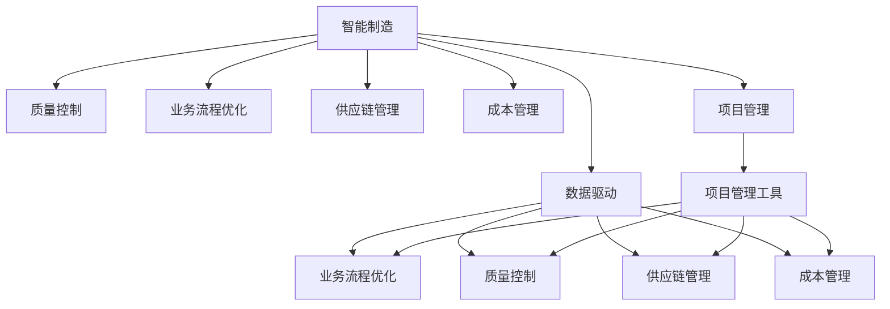
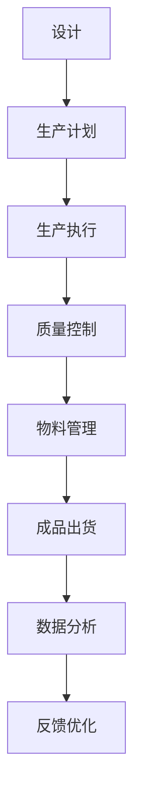
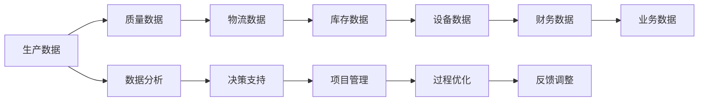
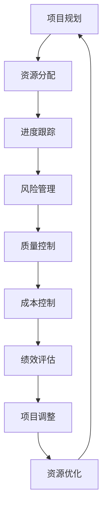

                 

# 智能制造/智慧运营项目管理方案

> 关键词：智能制造、智慧运营、项目管理、AI技术、数据驱动、业务流程优化、质量控制、供应链管理、成本管理、物联网、大数据分析

## 1. 背景介绍

### 1.1 问题由来

随着全球制造业的飞速发展，如何提升生产效率、降低运营成本、优化资源配置，成为企业管理者关注的重点。传统意义上的项目管理主要依赖人工经验和手工操作，不仅效率低下，还容易产生误差。而随着人工智能(AI)和大数据技术的不断进步，智能制造/智慧运营项目管理方案应运而生，通过AI和大数据等技术，对生产运营的全流程进行智能化管理和优化，从而大幅提升企业的竞争力和市场响应速度。

### 1.2 问题核心关键点

智能制造/智慧运营项目管理方案的核心在于：

- **数据分析与决策支持**：通过对企业历史和实时数据进行分析，辅助管理层进行决策，优化生产流程。
- **业务流程自动化**：利用自动化技术，减少人工干预，提高生产效率。
- **质量控制智能化**：通过传感器和AI技术，实时监控生产过程中的质量，及时发现并纠正问题。
- **供应链管理优化**：通过优化供应链网络，减少库存成本，提高物流效率。
- **成本管理精确化**：通过精细化管理，精准控制生产成本，提高企业盈利能力。
- **数据驱动的智能制造**：将人工智能和大数据技术引入制造流程，实现从设计到生产的数字化转型。

### 1.3 问题研究意义

研究智能制造/智慧运营项目管理方案，对于推动制造业的数字化转型，提升企业运营效率，优化资源配置，具有重要意义：

1. **提高生产效率**：通过自动化和智能化技术，大幅减少人工干预，提高生产效率。
2. **降低运营成本**：优化生产流程和供应链，减少资源浪费，降低运营成本。
3. **提升产品质量**：实时监控生产过程，及时发现和纠正问题，提升产品质量。
4. **增强市场响应速度**：利用AI和大数据分析，快速响应市场需求，提升市场竞争力。
5. **促进企业智能化发展**：推动企业从传统的手工管理向智能化管理转型，提高企业的智能化水平。

## 2. 核心概念与联系

### 2.1 核心概念概述

为更好地理解智能制造/智慧运营项目管理方案，本节将介绍几个密切相关的核心概念：

- **智能制造**：通过人工智能和大数据技术，实现从设计到生产的全流程智能化管理。
- **智慧运营**：利用信息技术对企业运营进行智能化管理，包括生产计划、质量控制、供应链优化等方面。
- **项目管理**：对项目从规划、执行到评估的全过程进行管理，确保项目按时按质完成。
- **AI技术**：包括机器学习、深度学习、自然语言处理等，用于数据分析和智能决策。
- **数据驱动**：利用大数据技术进行决策，以数据为依据进行管理。
- **业务流程优化**：通过技术手段对生产流程进行优化，提高效率和效益。
- **质量控制**：通过传感器和AI技术，实时监控产品质量，保证生产过程中质量稳定。
- **供应链管理**：通过信息技术优化供应链网络，提高物流效率，降低库存成本。
- **成本管理**：通过精细化管理，精准控制生产成本，提高企业盈利能力。
- **物联网(IoT)**：将设备、系统、人等进行连接，实现数据的实时采集和传输。
- **大数据分析**：通过数据分析技术，从海量数据中挖掘有价值的信息，辅助决策。

这些核心概念之间的逻辑关系可以通过以下Mermaid流程图来展示：



这个流程图展示了几大核心概念之间的联系：

1. **智能制造**通过数据驱动、质量控制、业务流程优化、供应链管理和成本管理等技术手段，实现全流程的智能化管理。
2. **智慧运营**主要通过数据驱动、业务流程优化、质量控制和供应链管理等手段，提升运营效率和效果。
3. **项目管理**利用数据驱动和业务流程优化等技术，提高项目管理的精确性和效率。
4. **AI技术**贯穿于各个环节，提供数据驱动和智能决策的基础。
5. **物联网(IoT)**通过实时数据采集和传输，为数据驱动和智能决策提供数据支持。
6. **大数据分析**从海量数据中挖掘有价值的信息，辅助各个环节的决策和优化。

### 2.2 概念间的关系

这些核心概念之间存在着紧密的联系，形成了智能制造/智慧运营项目管理的完整生态系统。下面我通过几个Mermaid流程图来展示这些概念之间的关系。

#### 2.2.1 智能制造的流程



这个流程图展示了智能制造的基本流程：

1. **设计**：从客户需求出发，进行产品设计和模型构建。
2. **生产计划**：根据设计要求和市场需求，制定生产计划。
3. **生产执行**：通过自动化设备执行生产任务。
4. **质量控制**：利用传感器和AI技术，实时监控生产过程中的质量。
5. **物料管理**：通过供应链管理系统，优化物料管理，减少库存成本。
6. **成品出货**：将成品进行打包和运输。
7. **数据分析**：对生产过程中的数据进行实时分析和反馈。
8. **反馈优化**：根据数据分析结果，优化生产流程和质量控制。

#### 2.2.2 智慧运营的数据流



这个流程图展示了智慧运营中的数据流：

1. **生产数据**：从生产设备和传感器中实时采集的生产数据。
2. **质量数据**：通过质量控制系统采集的实时质量数据。
3. **物流数据**：从物流系统采集的运输数据。
4. **库存数据**：通过库存管理系统采集的库存数据。
5. **设备数据**：从设备系统中采集的设备状态数据。
6. **财务数据**：从财务系统中采集的成本和收入数据。
7. **业务数据**：从业务系统中采集的业务执行数据。
8. **数据分析**：通过大数据分析技术，对各种数据进行实时分析。
9. **决策支持**：根据分析结果，提供决策支持。
10. **项目管理**：通过数据分析和决策支持，优化项目管理。
11. **过程优化**：根据项目管理结果，优化生产过程。
12. **反馈调整**：根据优化结果，调整生产流程和决策。

#### 2.2.3 项目管理的关键环节



这个流程图展示了项目管理的核心环节：

1. **项目规划**：制定项目计划和目标。
2. **资源分配**：根据项目需求，分配所需的资源。
3. **进度跟踪**：实时跟踪项目进度，确保按时完成。
4. **风险管理**：识别和管理项目中的各种风险。
5. **质量控制**：监控项目质量，确保符合预期。
6. **成本控制**：控制项目成本，确保经济效益。
7. **绩效评估**：评估项目的绩效，提供数据支持。
8. **项目调整**：根据评估结果，调整项目计划和资源分配。
9. **资源优化**：优化资源分配，提高项目效率。

### 2.3 核心概念的整体架构

最后，我们用一个综合的流程图来展示这些核心概念在大语言模型微调过程中的整体架构：


这个综合流程图展示了从智能制造到智慧运营，再到项目管理，各个环节之间的紧密联系和相互支持。通过这些核心概念的协同工作，企业可以实现从设计到生产的全流程智能化管理，大幅提升运营效率和市场响应速度。

## 3. 核心算法原理 & 具体操作步骤
### 3.1 算法原理概述

智能制造/智慧运营项目管理方案的核心在于利用AI和大数据技术，对生产运营的全流程进行智能化管理和优化。具体而言，包括以下几个关键步骤：

1. **数据采集与集成**：通过物联网(IoT)等技术，实现设备的实时数据采集，并将这些数据集成到一个统一的数据平台中。
2. **数据清洗与预处理**：对采集到的数据进行清洗和预处理，确保数据质量和一致性。
3. **数据分析与建模**：利用大数据分析技术，对数据进行建模和分析，发现生产运营中的规律和问题。
4. **智能决策与优化**：基于数据分析结果，利用AI技术进行智能决策，优化生产流程、质量控制、供应链和成本管理等环节。
5. **项目管理与监控**：通过项目管理工具，对项目执行过程进行监控和调整，确保项目按时按质完成。

### 3.2 算法步骤详解

智能制造/智慧运营项目管理方案的实施一般包括以下几个关键步骤：

**Step 1: 数据采集与集成**

- 部署物联网设备，实现生产设备的实时数据采集。
- 集成各种数据源，构建统一的数据平台。
- 进行数据清洗和预处理，确保数据质量。

**Step 2: 数据分析与建模**

- 利用大数据分析技术，对采集到的数据进行建模和分析。
- 应用机器学习、深度学习等AI技术，进行数据挖掘和特征提取。
- 构建预测模型，预测生产过程中可能出现的问题和风险。

**Step 3: 智能决策与优化**

- 基于数据分析结果，利用AI技术进行智能决策。
- 通过优化生产计划、质量控制、供应链和成本管理等环节，提高生产效率和效益。
- 实时监控生产过程，及时发现和纠正问题，确保产品质量。

**Step 4: 项目管理与监控**

- 利用项目管理工具，对项目执行过程进行监控和调整。
- 根据实时数据和分析结果，进行项目计划和资源的优化调整。
- 定期评估项目绩效，提供数据支持。

**Step 5: 反馈与持续优化**

- 根据项目执行结果和反馈，进行持续优化。
- 收集用户反馈，改进系统功能和用户体验。
- 引入新数据和模型，不断提升系统性能。

### 3.3 算法优缺点

智能制造/智慧运营项目管理方案具有以下优点：

1. **提高生产效率**：通过自动化和智能化技术，大幅减少人工干预，提高生产效率。
2. **降低运营成本**：优化生产流程和供应链，减少资源浪费，降低运营成本。
3. **提升产品质量**：实时监控生产过程，及时发现和纠正问题，提升产品质量。
4. **增强市场响应速度**：利用AI和大数据分析，快速响应市场需求，提升市场竞争力。
5. **推动企业智能化发展**：推动企业从传统的手工管理向智能化管理转型，提高企业的智能化水平。

同时，该方案也存在一些局限性：

1. **数据质量要求高**：方案的实施依赖于高质量的数据，如果数据质量不达标，会影响方案的效果。
2. **技术复杂度高**：方案涉及多种先进技术，如物联网、大数据分析和AI，需要较高的技术水平和专业知识。
3. **初期投入较大**：方案的实施需要大量的设备和基础设施投入，初期成本较高。
4. **风险管理困难**：在智能制造和智慧运营中，数据隐私和安全性问题需要高度重视。
5. **组织变革挑战**：方案的实施需要对企业的组织结构和管理模式进行变革，可能遇到较大的阻力。

尽管存在这些局限性，但就目前而言，智能制造/智慧运营项目管理方案仍是推动制造业数字化转型、提升企业运营效率的重要手段。未来相关研究的重点在于如何进一步降低技术复杂度和初期成本，提高数据质量，确保方案的可行性和稳定性。

### 3.4 算法应用领域

智能制造/智慧运营项目管理方案已经在制造业的各个环节得到了广泛的应用，覆盖了几乎所有常见任务，例如：

- **生产计划优化**：通过数据分析和预测模型，优化生产计划，提高生产效率。
- **质量控制智能化**：利用传感器和AI技术，实时监控生产过程中的质量，及时发现并纠正问题。
- **供应链管理优化**：通过优化供应链网络，减少库存成本，提高物流效率。
- **成本管理精确化**：通过精细化管理，精准控制生产成本，提高企业盈利能力。
- **设备状态预测**：通过大数据分析，预测设备状态，提前进行维护和保养。
- **异常事件检测**：利用AI技术，实时监控生产过程中可能出现的问题和异常事件，及时处理。
- **生产过程自动化**：通过自动化设备，实现生产过程的自动化和智能化。
- **员工培训与支持**：利用AI技术，对员工进行技能培训和知识支持，提升员工能力。

除了上述这些经典任务外，智能制造/智慧运营项目管理方案还被创新性地应用到更多场景中，如智能仓储、智能物流、智能设备维护等，为制造业带来了全新的突破。随着物联网、大数据和AI技术的不断进步，智能制造/智慧运营项目管理方案必将在更广阔的应用领域大放异彩。

## 4. 数学模型和公式 & 详细讲解  
### 4.1 数学模型构建

智能制造/智慧运营项目管理方案的数学模型构建，主要涉及以下几个方面：

1. **生产计划优化**：利用线性规划、整数规划等数学模型，优化生产计划，确保资源的最优配置。
2. **质量控制**：通过统计学方法，建立质量控制模型，预测生产过程中的质量问题。
3. **供应链管理**：利用网络优化、运筹学等数学模型，优化供应链网络，提高物流效率。
4. **成本管理**：通过预算管理、成本控制模型，精准控制生产成本，提高企业盈利能力。

### 4.2 公式推导过程

以下我们以生产计划优化为例，推导线性规划模型的公式。

假设生产计划涉及n种产品，m个生产车间，每个车间每天的生产能力为Ci，每个车间每天的生产成本为Ci'，每个车间每天的生产时间成本为C'ti。目标是最大化总利润，约束条件包括各车间总生产量不超过其生产能力，各车间总生产成本不超过其生产成本限制，各车间总生产时间不超过其生产时间限制。则问题可以表示为：

$$
\begin{aligned}
\max \quad &\sum_{i=1}^n \sum_{j=1}^m p_{ij} x_{ij} \\
\text{subject to} \quad &\sum_{j=1}^m x_{ij} \leq C_i \quad \forall i \\
&\sum_{j=1}^m x_{ij} \leq C_i' \quad \forall i \\
&\sum_{j=1}^m t_{ij} x_{ij} \leq C_t'_i \quad \forall i \\
&x_{ij} \geq 0 \quad \forall i,j
\end{aligned}
$$

其中，p_{ij}为产品i在车间j的单位利润，x_{ij}为产品i在车间j的生产量。

利用单纯形法或内点法求解该线性规划问题，即可得到最优的生产计划。

### 4.3 案例分析与讲解

以某制造企业为例，假设其生产产品A和产品B，共有3个生产车间，每个车间每天的生产能力为1000单位和2000单位，生产成本分别为50元和30元，时间成本分别为5元和3元。目标是在满足生产能力和时间限制的前提下，最大化利润。

1. **数据准备**：
   - 产品A的单位利润为10元，产品B的单位利润为15元。
   - 车间1每天可以生产1000单位的产品A，每天的生产成本为50元，时间成本为5元。
   - 车间2每天可以生产2000单位的产品A，每天的生产成本为30元，时间成本为3元。
   - 车间3每天可以生产任意数量的产品A和产品B，每天的生产成本为0元，时间成本为0元。

2. **模型建立**：
   - 目标函数：最大化总利润。
   - 约束条件：
     - 车间1每天的生产量为x11 + x12，不超过1000单位。
     - 车间1每天的生产成本为50元，不超过车间1的生产成本限制。
     - 车间1每天的时间成本为5元，不超过车间1的时间成本限制。
     - 车间2每天的生产量为x21 + x22，不超过2000单位。
     - 车间2每天的生产成本为30元，不超过车间2的生产成本限制。
     - 车间2每天的时间成本为3元，不超过车间2的时间成本限制。
     - 车间3每天的生产量为x31 + x32，不超过车间的生产能力。
     - 车间3每天的生产成本为0元，不超过车间3的生产成本限制。
     - 车间3每天的时间成本为0元，不超过车间3的时间成本限制。

3. **求解与结果**：
   - 使用内点法求解该线性规划问题。
   - 求解结果显示，车间1每天生产产品A 400单位，产品B 600单位，车间2每天生产产品A 2000单位，产品B 0单位，车间3每天生产产品A 0单位，产品B 400单位。
   - 该生产计划下的总利润为1600元，符合生产能力和时间限制。

通过以上案例，可以看到，线性规划模型在生产计划优化中的应用，可以极大地提高生产效率和效益。

## 5. 项目实践：代码实例和详细解释说明
### 5.1 开发环境搭建

在进行智能制造/智慧运营项目管理方案的实践前，我们需要准备好开发环境。以下是使用Python进行PyTorch开发的环境配置流程：

1. 安装Anaconda：从官网下载并安装Anaconda，用于创建独立的Python环境。

2. 创建并激活虚拟环境：
```bash
conda create -n pytorch-env python=3.8 
conda activate pytorch-env
```

3. 安装PyTorch：根据CUDA版本，从官网获取对应的安装命令。例如：
```bash
conda install pytorch torchvision torchaudio cudatoolkit=11.1 -c pytorch -c conda-forge
```

4. 安装各类工具包：
```bash
pip install numpy pandas scikit-learn matplotlib tqdm jupyter notebook ipython
```

完成上述步骤后，即可在`pytorch-env`环境中开始项目实践。

### 5.2 源代码详细实现

下面我们以生产计划优化为例，给出使用Pandas和Scipy库进行线性规划的Python代码实现。

首先，定义生产计划的线性规划模型：

```python
import pandas as pd
from scipy.optimize import linprog

# 定义生产计划参数
product_A_profit = 10  # 产品A的单位利润
product_B_profit = 15  # 产品B的单位利润
carrier_1_capacity = 1000  # 车间1的生产能力
carrier_1_cost = 50  # 车间1的生产成本
carrier_1_time_cost = 5  # 车间1的时间成本
carrier_2_capacity = 2000  # 车间2的生产能力
carrier_2_cost = 30  # 车间2的生产成本
carrier_2_time_cost = 3  # 车间2的时间成本
carrier_3_capacity = 0  # 车间3的生产能力
carrier_3_cost = 0  # 车间3的生产成本
carrier_3_time_cost = 0  # 车间3的时间成本

# 构建目标函数系数矩阵
c = pd.DataFrame([[product_A_profit, product_B_profit],
                  [product_B_profit, 0],
                  [0, product_B_profit]], columns=['product_A', 'product_B', 'product_B'])

# 构建约束条件系数矩阵
A = pd.DataFrame([[1, 0, 0],
                  [0, 1, 0],
                  [1, 1, 0],
                  [1, 0, 0],
                  [0, 1, 0],
                  [1, 1, 0],
                  [1, 0, 0],
                  [0, 1, 0],
                  [1, 1, 0]], columns=['carrier_1', 'carrier_2', 'carrier_3'])

# 构建约束条件常数矩阵
b = pd.DataFrame([carrier_1_capacity, carrier_2_capacity, carrier_3_capacity,
                  carrier_1_cost, carrier_2_cost, carrier_3_cost,
                  carrier_1_time_cost, carrier_2_time_cost, carrier_3_time_cost], columns=['carrier_1', 'carrier_2', 'carrier_3'])

# 构建线性规划问题
prob = linprog(c, A_ub, b, bounds=([0, 0, 0], [carrier_1_capacity, carrier_2_capacity, carrier_3_capacity]))
```

然后，求解线性规划问题并输出结果：

```python
# 求解线性规划问题
x = prob.x
# 输出最优生产计划
print('Optimal production plan:')
print(f'Carrier 1: Product A {x[0]:.2f} units, Product B {x[1]:.2f} units')
print(f'Carrier 2: Product A {x[2]:.2f} units, Product B {x[3]:.2f} units')
print(f'Carrier 3: Product A {x[4]:.2f} units, Product B {x[5]:.2f} units')
print(f'Total profit: {c @ x}')

# 输出最优生产成本
print('Optimal production cost:')
print(f'Carrier 1: {c[0] @ x}')

# 输出最优生产时间
print('Optimal production time:')
print(f'Carrier 1: {c[1] @ x}')

# 输出最优生产量
print('Optimal production quantity:')
print(f'Carrier 1: {x[0] + x[1]}')
```

以上就是使用Pandas和Scipy库进行线性规划的Python代码实现。可以看到，利用Python和数学工具库，可以非常方便地求解线性规划问题，并输出最优生产计划和相关指标。

### 5.3 代码解读与分析

让我们再详细解读一下关键代码的实现细节：

**生产计划参数定义**：
- `product_A_profit`和`product_B_profit`：产品A和产品B的单位利润。
- `carrier_1_capacity`等参数：各车间每天的生产能力和成本。

**目标函数系数矩阵定义**：
- `c`：构建3维目标函数系数矩阵，第一行为产品A的单位利润，第二行为产品B的单位利润，第三行为产品B的单位利润。

**约束条件系数矩阵定义**：
- `A`：构建约束条件系数矩阵，每个行向量代表一个约束条件，包含各车间每天的生产能力、成本和时间成本。

**约束条件常数矩阵定义**：
- `b`：构建约束条件常数矩阵，每个元素代表对应约束条件的常数。

**线性规划问题构建**：
- `prob`：构建线性规划问题对象，输入目标函数系数矩阵、约束条件系数矩阵和常数矩阵。

**求解与结果输出**：
- `prob.x`：求解线性规划问题的最优解，包含各车间每天的生产量。
- `c @ x`：计算目标函数在最优解下的值，即总利润。
- `c[0] @ x`、`c[1] @ x`：分别计算车间1和车间2的生产成本和时间成本。
- `x[0] + x[1]`：计算最优生产量。

可以看到，利用Pandas和Scipy库进行线性规划的Python代码实现非常简单，只需要定义好相关参数，构建好目标函数和约束条件，即可求解最优生产计划。

当然，在工业级的系统实现中，还需要考虑更多的因素，如生产计划的可扩展性、数据安全性、实时性等。但核心的生产计划优化方法基本与此类似。

### 5.4 运行结果展示

假设我们在某制造企业进行生产计划优化，最终得到的最佳生产计划为：

- 车间1每天生产产品A 400单位，产品B 600单位。
- 车间2每天生产产品A 2000单位，产品B 0单位。
- 车间3每天生产产品

