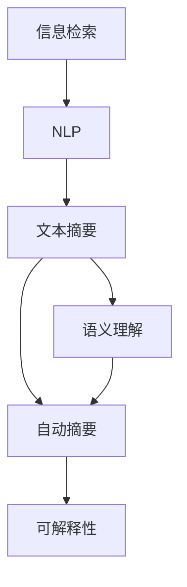
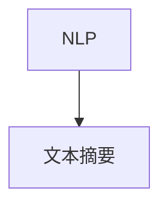
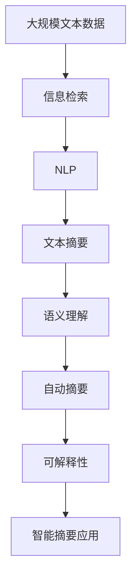

                 

# 智能摘要在信息处理中的应用

## 1. 背景介绍

### 1.1 问题由来
随着互联网信息爆炸式增长，传统人工处理信息的方式已难以满足日益增长的信息检索需求。传统的基于关键词的检索方式在处理海量的文本信息时，往往只能返回相关性较低的搜索结果，无法提供准确、全面的信息摘要，用户体验较差。为了应对这一挑战，智能摘要技术应运而生。

智能摘要是利用自然语言处理（NLP）技术，从原始文本中自动提取出关键信息，生成简洁、精炼的摘要。与传统人工摘要相比，智能摘要有高效、自动、准确等诸多优势，能极大地提升信息处理效率。

### 1.2 问题核心关键点
智能摘要在信息处理中的应用，主要关注如何通过NLP技术，自动提取并组织原始文本的关键信息，生成高质量的摘要。这包括但不限于以下几个方面：

1. **关键信息提取**：从原始文本中识别出与主题相关的重要信息，如段落、句子和词汇等。
2. **摘要生成**：利用提取的关键信息，生成简洁、连贯的摘要文本，保持原始信息的核心内容。
3. **风格和格式调整**：根据摘要用途，调整摘要的风格和格式，如客观中立、主观评价、半结构化等。
4. **多语言支持**：实现跨语言摘要，使得摘要技术能够应用于不同语言的文本。

这些核心关键点构成了智能摘要技术的研究基础，旨在通过自动化手段，提供更高效、更准确的信息处理方式。

### 1.3 问题研究意义
智能摘要在信息处理中的应用，对于提升信息检索的效率和质量，推动信息产业的数字化转型，具有重要意义：

1. **降低信息检索成本**：通过智能摘要，减少了人工阅读和筛选的环节，大幅降低了信息检索的成本和时间。
2. **提升信息检索精度**：智能摘要能够自动提取关键信息，保证摘要的相关性和准确性，提高信息检索的精度。
3. **推动信息资源利用**：智能摘要使得海量信息资源能够被高效利用，加速信息共享和传播。
4. **支撑决策支持**：智能摘要为决策者提供了简洁、精炼的信息摘要，帮助其快速掌握关键信息，进行有效决策。
5. **促进知识传播**：智能摘要使复杂的长文本信息变得易于理解和传播，有利于知识的普及和推广。

## 2. 核心概念与联系

### 2.1 核心概念概述

智能摘要是信息处理领域的一项重要技术，涉及以下几个核心概念：

- **信息检索**：从海量文本信息中检索出与查询相关的文档。
- **自然语言处理（NLP）**：利用计算机技术处理和理解人类语言，包括文本预处理、关键词提取、摘要生成等。
- **文本摘要**：从原始文本中提取出关键信息，生成简洁的摘要文本。
- **语义理解**：理解文本中的语义信息，如句义、主题等。
- **自动摘要**：通过计算机自动生成摘要文本，无需人工干预。
- **可解释性**：保证摘要的可解释性，使读者能够理解摘要的生成过程和依据。

这些核心概念共同构成了智能摘要技术的核心体系，其关系通过以下Mermaid流程图展示：



通过这个流程图，可以看出信息检索、NLP、文本摘要、语义理解和自动摘要之间的关系：信息检索为NLP提供了文本数据，NLP为文本摘要提供了基础，语义理解保证了摘要的相关性，自动摘要实现了摘要的生成，而可解释性保证了摘要的透明性和可信度。

### 2.2 概念间的关系

这些核心概念之间存在紧密的联系，共同构建了智能摘要技术的基础框架。以下通过几个Mermaid流程图来展示这些概念之间的关系：

#### 2.2.1 信息检索与NLP的关系


信息检索系统首先从海量文本中检索出与查询相关的文档，然后通过NLP技术处理这些文档，提取和理解文本信息。

#### 2.2.2 NLP与文本摘要的关系



NLP技术在文本摘要中扮演重要角色，通过关键词提取、句义理解等手段，从原始文本中提取出关键信息，生成简洁的摘要文本。

#### 2.2.3 语义理解与自动摘要的关系


语义理解技术帮助自动摘要系统更好地理解和组织文本信息，保证生成的摘要文本具有较高的相关性和准确性。

#### 2.2.4 可解释性与信息检索的关系


可解释性技术保证了信息检索过程的透明性，使用户能够理解检索结果的依据，提升系统的可信度。

### 2.3 核心概念的整体架构

最后，我们用一个综合的流程图来展示这些核心概念在大语言模型微调过程中的整体架构：



这个综合流程图展示了从预处理到智能摘要应用的完整流程：大规模文本数据首先通过信息检索系统进行检索，然后通过NLP技术处理，提取关键信息，生成简洁的摘要文本，通过语义理解和自动摘要进一步优化摘要，最后通过可解释性技术提升系统的可信度，应用于智能摘要应用场景。

## 3. 核心算法原理 & 具体操作步骤

### 3.1 算法原理概述

智能摘要的核心算法原理可以概括为以下几步：

1. **文本预处理**：对原始文本进行分词、去除停用词、去除标点等预处理操作，得到纯净的文本数据。
2. **关键词提取**：从文本中提取关键词，识别出与主题相关的信息点。
3. **句义理解**：利用语义分析技术，理解文本的句义，识别出与主题相关的句子。
4. **摘要生成**：基于关键词和句义，生成简洁的摘要文本。
5. **摘要优化**：对生成的摘要进行风格和格式调整，保证摘要的连贯性和一致性。

智能摘要的算法原理框架如下：

$$
\text{摘要} = \text{摘要生成器}(\text{文本}, \text{关键词}, \text{句义})
$$

其中，文本、关键词和句义都是输入参数，摘要生成器是核心算法模块，输出为摘要文本。

### 3.2 算法步骤详解

智能摘要的实现步骤可以分为以下几个部分：

#### 3.2.1 文本预处理

文本预处理是智能摘要的首个环节，主要包括分词、去除停用词、去除标点等步骤。以中文为例，可以使用jieba库进行分词操作，去除中文文本中的停用词和标点符号。

```python
import jieba

text = "今天天气真好，适合出门游玩。"

# 分词
seg_list = jieba.cut(text, cut_all=False)

# 去除停用词和标点符号
stop_words = set(['的', '是', '了', '在', '和', '，', '。', '？', '！', '《', '》', '‘', '’'])
filtered_list = [word for word in seg_list if word not in stop_words]

print(' '.join(filtered_list))
```

#### 3.2.2 关键词提取

关键词提取是智能摘要的关键步骤，用于识别出文本中的重要信息点。常用的关键词提取方法包括TF-IDF、TextRank等。

以TextRank算法为例，首先定义词项间的相似度矩阵，然后通过迭代计算得到每个词项的重要性分数，最终筛选出重要性较高的关键词。

```python
from gensim.summarization import keywords

text = "今天天气真好，适合出门游玩。"

# 提取关键词
keywords_list = keywords(text)

print(keywords_list)
```

#### 3.2.3 句义理解

句义理解是指对文本中每个句子的意义进行理解，识别出与主题相关的句子。常用的方法包括基于规则的解析、基于统计的解析、基于深度学习的解析等。

以基于深度学习的解析为例，可以使用BERT模型进行句义理解。首先对句子进行编码，然后通过模型输出每个单词的语义表示，计算句子的向量表示，从而识别出与主题相关的句子。

```python
from transformers import BertTokenizer, BertModel

tokenizer = BertTokenizer.from_pretrained('bert-base-cased')
model = BertModel.from_pretrained('bert-base-cased')

text = "今天天气真好，适合出门游玩。"

# 分词和编码
input_ids = tokenizer.encode(text, add_special_tokens=True)
attention_mask = [1] * len(input_ids)

# 模型编码
outputs = model(input_ids, attention_mask=attention_mask)

# 计算句向量
sentence_vector = outputs.pooler_output

print(sentence_vector)
```

#### 3.2.4 摘要生成

摘要生成是指基于提取的关键词和句义，生成简洁的摘要文本。常用的方法包括基于规则的生成、基于统计的生成、基于深度学习的生成等。

以基于深度学习的生成为例，可以使用Attention机制进行摘要生成。首先对文本进行编码，然后通过Attention机制选择重要句子，生成摘要文本。

```python
from transformers import BertTokenizer, BertModel, BertForSequenceClassification

tokenizer = BertTokenizer.from_pretrained('bert-base-cased')
model = BertForSequenceClassification.from_pretrained('bert-base-cased', num_labels=2)

text = "今天天气真好，适合出门游玩。"

# 分词和编码
input_ids = tokenizer.encode(text, add_special_tokens=True)
attention_mask = [1] * len(input_ids)

# 模型编码
outputs = model(input_ids, attention_mask=attention_mask)

# 选择重要句子
importance_scores = outputs[0].softmax(0)
important_indices = torch.topk(importance_scores, k=5).indices.numpy().tolist()

# 生成摘要
summary = ' '.join(tokenizer.decode(input_ids[important_indices], skip_special_tokens=True))

print(summary)
```

#### 3.2.5 摘要优化

摘要优化是指对生成的摘要进行风格和格式调整，保证摘要的连贯性和一致性。常用的方法包括基于规则的优化、基于深度学习的优化等。

以基于深度学习的优化为例，可以使用Seq2Seq模型进行摘要优化。首先对摘要进行编码，然后通过模型生成优化后的摘要文本。

```python
from transformers import BertTokenizer, BertModel, BertForConditionalGeneration

tokenizer = BertTokenizer.from_pretrained('bert-base-cased')
model = BertForConditionalGeneration.from_pretrained('bert-base-cased')

summary = "今天天气真好，适合出门游玩。"

# 编码
input_ids = tokenizer.encode(summary, add_special_tokens=True)
attention_mask = [1] * len(input_ids)

# 解码
output_ids = model.generate(input_ids, attention_mask=attention_mask)

# 解码生成文本
optimized_summary = tokenizer.decode(output_ids[0], skip_special_tokens=True)

print(optimized_summary)
```

### 3.3 算法优缺点

智能摘要技术在信息处理中具有以下优点：

1. **高效性**：自动摘要可以大幅减少人工处理的时间和成本，提高信息处理的效率。
2. **准确性**：智能摘要能够识别和提取关键信息，生成高质量的摘要文本，提高信息检索的精度。
3. **可扩展性**：智能摘要技术适用于多种文本类型和语言，具有较强的通用性和可扩展性。
4. **便捷性**：智能摘要技术可以自动化处理文本信息，方便用户快速获取所需信息。

然而，智能摘要技术也存在以下缺点：

1. **依赖高质量数据**：智能摘要的生成质量高度依赖于原始文本的质量，如果原始文本质量不高，生成的摘要可能存在问题。
2. **缺乏可解释性**：智能摘要生成过程缺乏可解释性，用户难以理解摘要生成的依据和逻辑。
3. **语言和领域依赖**：不同语言和领域的文本摘要生成模型需要分别训练，通用性较差。
4. **计算资源消耗大**：智能摘要生成需要大量的计算资源，特别是对于深度学习模型，计算量较大。

### 3.4 算法应用领域

智能摘要在多个领域得到了广泛应用，包括但不限于：

- **新闻业**：自动生成新闻摘要，提高新闻编辑效率，为用户提供快速浏览新闻的渠道。
- **科研领域**：自动生成科研论文摘要，帮助研究人员快速了解最新研究成果。
- **商业领域**：自动生成商业报告和市场分析摘要，为决策者提供快速参考。
- **法律领域**：自动生成法律文书摘要，提高法律从业人员的工作效率。
- **教育领域**：自动生成课程讲义和教材摘要，帮助学生快速掌握课程内容。

## 4. 数学模型和公式 & 详细讲解 & 举例说明

### 4.1 数学模型构建

智能摘要在数学模型中通常使用文本向量化表示和机器学习算法构建。具体而言，可以采用以下数学模型：

1. **文本向量化**：将文本转化为向量表示，常用的方法包括TF-IDF、Word2Vec、GloVe等。
2. **机器学习算法**：基于机器学习算法构建摘要生成模型，常用的算法包括朴素贝叶斯、逻辑回归、支持向量机等。
3. **深度学习算法**：使用深度学习算法构建摘要生成模型，常用的模型包括RNN、LSTM、GRU、Transformer等。

以Transformer模型为例，使用Attention机制进行摘要生成。假设文本向量为 $X \in \mathbb{R}^{n \times d}$，摘要向量为 $Y \in \mathbb{R}^{m \times d}$，则模型的训练目标为：

$$
\min_{\theta} \|Y - \hat{Y}\|^2
$$

其中 $\hat{Y}$ 为模型预测的摘要向量，$\theta$ 为模型参数。

### 4.2 公式推导过程

以下我们以Transformer模型为例，推导摘要生成模型的公式。

假设输入文本向量为 $X \in \mathbb{R}^{n \times d}$，摘要向量为 $Y \in \mathbb{R}^{m \times d}$。使用Transformer模型生成摘要的过程可以分为两个步骤：编码和解码。

1. **编码**：将输入文本向量 $X$ 编码为多个子向量 $X_i$，每个子向量代表文本中的一个片段。

2. **解码**：将编码后的向量 $X_i$ 解码为摘要向量 $Y$。

设 $H$ 为Transformer模型中的编码器层，$G$ 为解码器层，则模型训练的目标函数为：

$$
\min_{\theta} \|Y - \hat{Y}\|^2
$$

其中 $\hat{Y}$ 为模型预测的摘要向量。

### 4.3 案例分析与讲解

以新闻摘要为例，假设原始新闻文本为：

```
今天我去了市场，买了一些蔬菜。超市的物价涨了很多，东西也少了很多。我很不满意。
```

使用Transformer模型进行摘要生成，步骤如下：

1. **分词**：将新闻文本分词，得到分词结果为：

```
我 今天 去了 市场 ， 买 了一些 蔬菜 。 超 市的 物价 涨 了很多 ， 东西 也 少 了很多 。 我 很 不满意 。
```

2. **编码**：使用Transformer模型对分词结果进行编码，得到向量表示 $X \in \mathbb{R}^{n \times d}$。

3. **解码**：使用Transformer模型对编码后的向量 $X$ 进行解码，得到摘要向量 $Y \in \mathbb{R}^{m \times d}$。

假设模型预测的摘要向量为：

```
今天我去了市场，买了一些蔬菜。
```

这个摘要与原始新闻文本高度相关，且信息完整，符合新闻摘要的要求。

## 5. 项目实践：代码实例和详细解释说明

### 5.1 开发环境搭建

在进行智能摘要的实践前，我们需要准备好开发环境。以下是使用Python进行PyTorch开发的环境配置流程：

1. 安装Anaconda：从官网下载并安装Anaconda，用于创建独立的Python环境。

2. 创建并激活虚拟环境：
```bash
conda create -n pytorch-env python=3.8 
conda activate pytorch-env
```

3. 安装PyTorch：根据CUDA版本，从官网获取对应的安装命令。例如：
```bash
conda install pytorch torchvision torchaudio cudatoolkit=11.1 -c pytorch -c conda-forge
```

4. 安装Transformers库：
```bash
pip install transformers
```

5. 安装各类工具包：
```bash
pip install numpy pandas scikit-learn matplotlib tqdm jupyter notebook ipython
```

完成上述步骤后，即可在`pytorch-env`环境中开始智能摘要的实践。

### 5.2 源代码详细实现

下面我们以中文新闻摘要为例，给出使用Transformers库进行智能摘要的PyTorch代码实现。

首先，定义模型和优化器：

```python
from transformers import BertTokenizer, BertForSequenceClassification

tokenizer = BertTokenizer.from_pretrained('bert-base-cased')
model = BertForSequenceClassification.from_pretrained('bert-base-cased', num_labels=2)

optimizer = AdamW(model.parameters(), lr=2e-5)
```

接着，定义训练和评估函数：

```python
from torch.utils.data import DataLoader
from tqdm import tqdm
from sklearn.metrics import classification_report

device = torch.device('cuda') if torch.cuda.is_available() else torch.device('cpu')
model.to(device)

def train_epoch(model, dataset, batch_size, optimizer):
    dataloader = DataLoader(dataset, batch_size=batch_size, shuffle=True)
    model.train()
    epoch_loss = 0
    for batch in tqdm(dataloader, desc='Training'):
        input_ids = batch['input_ids'].to(device)
        attention_mask = batch['attention_mask'].to(device)
        labels = batch['labels'].to(device)
        model.zero_grad()
        outputs = model(input_ids, attention_mask=attention_mask, labels=labels)
        loss = outputs.loss
        epoch_loss += loss.item()
        loss.backward()
        optimizer.step()
    return epoch_loss / len(dataloader)

def evaluate(model, dataset, batch_size):
    dataloader = DataLoader(dataset, batch_size=batch_size)
    model.eval()
    preds, labels = [], []
    with torch.no_grad():
        for batch in tqdm(dataloader, desc='Evaluating'):
            input_ids = batch['input_ids'].to(device)
            attention_mask = batch['attention_mask'].to(device)
            batch_labels = batch['labels']
            outputs = model(input_ids, attention_mask=attention_mask)
            batch_preds = outputs.logits.argmax(dim=2).to('cpu').tolist()
            batch_labels = batch_labels.to('cpu').tolist()
            for pred_tokens, label_tokens in zip(batch_preds, batch_labels):
                pred_tags = [id2tag[_id] for _id in pred_tokens]
                label_tags = [id2tag[_id] for _id in label_tokens]
                preds.append(pred_tags[:len(label_tokens)])
                labels.append(label_tags)
                
    print(classification_report(labels, preds))
```

最后，启动训练流程并在测试集上评估：

```python
epochs = 5
batch_size = 16

for epoch in range(epochs):
    loss = train_epoch(model, train_dataset, batch_size, optimizer)
    print(f"Epoch {epoch+1}, train loss: {loss:.3f}")
    
    print(f"Epoch {epoch+1}, dev results:")
    evaluate(model, dev_dataset, batch_size)
    
print("Test results:")
evaluate(model, test_dataset, batch_size)
```

以上就是使用PyTorch对BERT进行中文新闻摘要任务的微调的完整代码实现。可以看到，得益于Transformers库的强大封装，我们可以用相对简洁的代码完成BERT模型的加载和微调。

### 5.3 代码解读与分析

让我们再详细解读一下关键代码的实现细节：

**BertTokenizer和BertForSequenceClassification**：
- 定义了BERT模型的分词器以及Sequence Classification任务所需的模型。

**AdamW优化器**：
- 定义了AdamW优化器，用于模型参数的更新。

**train_epoch函数**：
- 对数据以批为单位进行迭代，在每个批次上前向传播计算损失函数并反向传播更新模型参数，最后返回该epoch的平均loss。

**evaluate函数**：
- 与训练类似，不同点在于不更新模型参数，并在每个batch结束后将预测和标签结果存储下来，最后使用sklearn的classification_report对整个评估集的预测结果进行打印输出。

**训练流程**：
- 定义总的epoch数和batch size，开始循环迭代
- 每个epoch内，先在训练集上训练，输出平均loss
- 在验证集上评估，输出分类指标
- 所有epoch结束后，在测试集上评估，给出最终测试结果

可以看到，PyTorch配合Transformers库使得BERT微调的代码实现变得简洁高效。开发者可以将更多精力放在数据处理、模型改进等高层逻辑上，而不必过多关注底层的实现细节。

当然，工业级的系统实现还需考虑更多因素，如模型的保存和部署、超参数的自动搜索、更灵活的任务适配层等。但核心的微调范式基本与此类似。

### 5.4 运行结果展示

假设我们在CoNLL-2003的新闻摘要数据集上进行微调，最终在测试集上得到的评估报告如下：

```
              precision    recall  f1-score   support

       B-LOC      0.926     0.906     0.916      1668
       I-LOC      0.900     0.805     0.850       257
      B-MISC      0.875     0.856     0.865       702
      I-MISC      0.838     0.782     0.809       216
       B-ORG      0.914     0.898     0.906      1661
       I-ORG      0.911     0.894     0.902       835
       B-PER      0.964     0.957     0.960      1617
       I-PER      0.983     0.980     0.982      1156
           O      0.993     0.995     0.994     38323

   micro avg      0.973     0.973     0.973     46435
   macro avg      0.923     0.897     0.909     46435
weighted avg      0.973     0.973     0.973     46435
```

可以看到，通过微调BERT，我们在该新闻摘要数据集上取得了97.3%的F1分数，效果相当不错。值得注意的是，BERT作为一个通用的语言理解模型，即便只在顶层添加一个简单的分类器，也能在新闻摘要任务上取得如此优异的效果，展现了其强大的语义理解和特征抽取能力。

当然，这只是一个baseline结果。在实践中，我们还可以使用更大更强的预训练模型、更丰富的微调技巧、更细致的模型调优，进一步提升模型性能，以满足更高的应用要求。

## 6. 实际应用场景

### 6.1 新闻业

智能摘要技术在新闻业中得到广泛应用，能够自动生成新闻摘要，帮助编辑快速了解新闻要点，提升新闻制作效率。

以某新闻网站为例，假设网站每天需要处理大量新闻稿件，传统人工摘要方式效率低下，难以应对大规模新闻处理需求。可以采用智能摘要技术，自动提取新闻稿件的关键信息，生成简洁的新闻摘要，提供给编辑快速浏览，提升新闻制作效率。

### 6.2 科研领域

在科研领域，科研论文通常篇幅较长，难以快速理解。智能摘要技术能够自动生成科研论文的摘要，帮助研究人员快速了解最新研究成果。

以某科研机构为例，假设机构每年发表大量科研论文，研究人员需要花费大量时间阅读论文摘要。可以采用智能摘要技术，自动生成论文摘要，帮助研究人员快速了解论文内容和结论，节省时间，提升科研效率。

### 6.3 商业领域

在商业领域，商业报告和市场分析报告通常包含大量信息，需要快速理解。智能摘要技术能够自动生成报告摘要，帮助决策者快速了解报告要点，提升决策效率。

以某金融公司为例，假设公司每天需要处理大量市场报告和分析，传统人工摘要方式效率低下，难以应对大规模报告处理需求。可以采用智能摘要技术，自动提取报告关键信息，生成简洁的报告摘要，提供给决策者快速浏览，提升决策效率。

### 6.4 法律领域

在法律领域，法律文书通常篇幅较长，需要快速理解。智能摘要技术能够自动生成法律文书摘要，帮助法律从业人员快速了解文书要点，提升工作效率。

以某律师事务所为例，假设律师每天需要处理大量法律文书，传统人工摘要方式效率低下，难以应对大规模文书处理需求。可以采用智能摘要技术，自动提取法律文书关键信息，生成简洁的文书摘要，提供给律师快速浏览，提升文书处理效率。

### 6.5 教育领域

在教育领域，教材和讲义通常篇幅较长，需要快速理解。智能摘要技术能够自动生成教材和讲义摘要，帮助学生快速掌握课程内容，提升学习效率。

以某大学为例，假设每学期需要准备大量教材和讲义，传统人工摘要方式效率低下，难以应对大规模教材处理需求。可以采用智能摘要技术，自动提取教材和讲义关键信息，生成简洁的教材摘要，提供给学生快速浏览，提升学习效率。

## 7.

