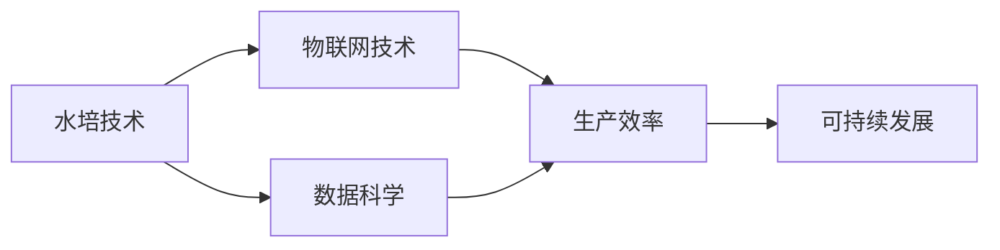
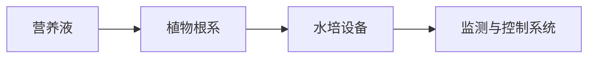
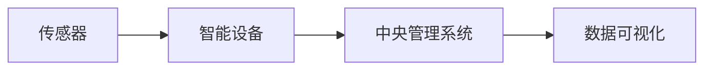
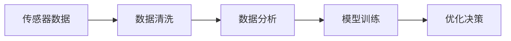
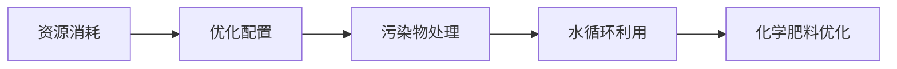
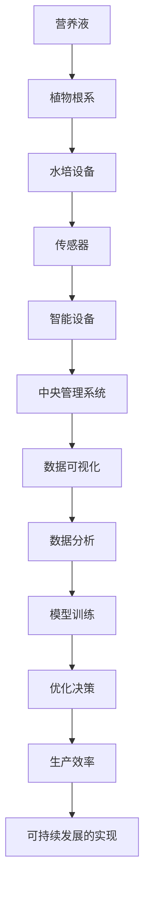

                 

# 智能水培创业：都市农业的科技解决方案

> 关键词：智能水培,都市农业,物联网,数据科学,可持续发展

## 1. 背景介绍

### 1.1 问题由来
随着城市化进程的加快，传统农业空间逐渐被高楼大厦所取代，城市居民与农产品的距离越来越远。然而，城市居民对新鲜、健康、安全的农产品需求却从未减少。都市农业作为一种新型农业模式，借助现代科技手段，实现了城市中的精细化、可持续化农业生产，成为解决城市居民对农产品的需求的重要途径。

智能水培作为都市农业的一种新形式，通过利用先进的水培技术、物联网技术和数据科学，实现了农产品的精准化、智能化和高效化生产。智能水培系统不仅可以大大提高农业生产效率，还能有效减少水资源和化学肥料的使用，保护环境，实现可持续发展。

### 1.2 问题核心关键点
智能水培系统主要包括以下几个关键点：

- **水培技术**：利用营养液对植物进行培养，避免土壤中的病虫害和化学污染。
- **物联网技术**：通过传感器、物联网设备实时监测环境参数，如温度、湿度、光照、营养液成分等。
- **数据科学**：通过数据分析和机器学习，优化水培过程，提高生产效率和产品质量。
- **可持续发展**：通过智能水培技术，减少水资源和化学肥料的浪费，实现绿色农业。

这些关键点共同构成了智能水培系统的核心技术体系，使其能够有效解决城市农业面临的资源限制和环境污染问题。

### 1.3 问题研究意义
研究智能水培系统，对于推动都市农业发展，提升城市居民生活质量，具有重要意义：

1. **提高生产效率**：通过精准控制环境参数和营养液成分，智能水培系统能够显著提高农业生产效率，减少人力资源的投入。
2. **降低环境影响**：智能水培系统使用营养液培养，避免了土壤污染和水资源浪费，实现环保农业。
3. **保障食品安全**：智能水培系统在无土环境下生长，避免了土壤中的病虫害和化学污染，生产出更健康、安全的农产品。
4. **推动技术创新**：智能水培系统的研究与应用，将推动物联网、数据科学等领域的技术进步，形成新的科技产业。
5. **促进可持续发展**：智能水培系统通过优化资源利用，减少环境负担，推动农业向可持续化方向发展。

## 2. 核心概念与联系

### 2.1 核心概念概述

为了更好地理解智能水培系统的核心概念，本节将介绍几个关键概念及其相互关系：

- **水培技术**：一种不使用土壤，直接使用营养液培养植物的技术。通过营养液中精确配比的化学元素，满足植物生长所需的各种营养需求。
- **物联网技术**：通过传感器、智能设备等，实时监测和控制农业环境参数，提高生产效率和管理水平。
- **数据科学**：应用数据分析和机器学习技术，优化水培过程，提升生产效率和产品质量。
- **可持续发展**：通过智能水培系统，减少资源浪费和环境污染，实现绿色农业和可持续农业。

这些概念之间的关系可以通过以下Mermaid流程图来展示：



这个流程图展示了水培技术、物联网技术和数据科学在智能水培系统中的作用和相互关系，最终共同推动了可持续发展的实现。

### 2.2 概念间的关系

这些核心概念之间存在着紧密的联系，形成了智能水培系统的完整生态系统。下面我们通过几个Mermaid流程图来展示这些概念之间的关系。

#### 2.2.1 水培技术的工作原理



这个流程图展示了水培技术的基本工作原理：营养液通过水培设备输送给植物根系，监测与控制系统实时监测环境参数，确保植物生长的适宜条件。

#### 2.2.2 物联网技术的应用场景



这个流程图展示了物联网技术在智能水培中的应用场景：传感器监测环境参数，智能设备控制环境条件，中央管理系统收集数据并生成可视化报表，为生产决策提供依据。

#### 2.2.3 数据科学的应用流程



这个流程图展示了数据科学在智能水培中的应用流程：传感器数据经过清洗、分析和模型训练，生成优化决策，指导生产过程。

#### 2.2.4 可持续发展的实现路径



这个流程图展示了可持续发展的实现路径：通过优化配置资源，减少污染物处理，实现水循环利用和化学肥料优化，实现绿色农业。

### 2.3 核心概念的整体架构

最后，我们用一个综合的流程图来展示这些核心概念在大语言模型微调过程中的整体架构：



这个综合流程图展示了水培技术、物联网技术、数据科学和可持续发展在智能水培系统中的整体架构，各概念相互支持，共同推动智能水培系统的运行和发展。

## 3. 核心算法原理 & 具体操作步骤
### 3.1 算法原理概述

智能水培系统的核心算法原理基于物联网和数据科学，通过实时监测和数据分析，优化水培过程，提高生产效率和产品质量。具体包括以下几个步骤：

1. **环境参数监测**：通过传感器实时监测环境参数，如温度、湿度、光照、营养液成分等。
2. **数据分析与处理**：将传感器数据输入数据管理系统，进行清洗和预处理，生成分析数据。
3. **模型训练与优化**：基于历史数据，训练机器学习模型，优化水培过程，生成优化决策。
4. **决策执行与反馈**：将优化决策转化为实际控制指令，执行环境调整，并反馈优化效果，不断迭代优化。

### 3.2 算法步骤详解

#### 3.2.1 环境参数监测

智能水培系统通过各种传感器监测环境参数，如温度、湿度、光照、营养液成分等。通过物联网设备，将传感器数据实时传输到中央管理系统。

```python
# 导入必要的库
from sensors import temperature_sensor, humidity_sensor, light_sensor, nutrient_sensor

# 初始化传感器
temperature_sensor.init()
humidity_sensor.init()
light_sensor.init()
nutrient_sensor.init()

# 读取传感器数据
temperature = temperature_sensor.read()
humidity = humidity_sensor.read()
light = light_sensor.read()
nutrient = nutrient_sensor.read()

# 将数据发送至中央管理系统
environment_data = {'temperature': temperature, 'humidity': humidity, 'light': light, 'nutrient': nutrient}
send_data_to_cms(environment_data)
```

#### 3.2.2 数据分析与处理

将传感器数据输入数据管理系统，进行清洗和预处理，生成分析数据。数据管理系统通常使用数据清洗工具如Pandas、NumPy等进行数据处理。

```python
# 导入必要的库
import pandas as pd
from sklearn.preprocessing import MinMaxScaler

# 加载数据
data = pd.read_csv('environment_data.csv')

# 数据清洗
data.dropna(inplace=True)

# 数据预处理
scaler = MinMaxScaler()
data['scaled_temperature'] = scaler.fit_transform(data[['temperature']])
data['scaled_humidity'] = scaler.fit_transform(data[['humidity']])
data['scaled_light'] = scaler.fit_transform(data[['light']])
data['scaled_nutrient'] = scaler.fit_transform(data[['nutrient']])

# 保存处理后的数据
data.to_csv('cleaned_data.csv', index=False)
```

#### 3.2.3 模型训练与优化

基于历史数据，训练机器学习模型，优化水培过程，生成优化决策。通常使用Python中的Scikit-Learn、TensorFlow等库进行模型训练。

```python
# 导入必要的库
from sklearn.linear_model import LinearRegression
from sklearn.model_selection import train_test_split
from sklearn.metrics import mean_squared_error

# 加载数据
cleaned_data = pd.read_csv('cleaned_data.csv')

# 分割数据集
X = cleaned_data[['temperature', 'humidity', 'light', 'nutrient']]
y = cleaned_data['yield']
X_train, X_test, y_train, y_test = train_test_split(X, y, test_size=0.2, random_state=42)

# 训练模型
model = LinearRegression()
model.fit(X_train, y_train)

# 模型评估
y_pred = model.predict(X_test)
mse = mean_squared_error(y_test, y_pred)
print('Mean Squared Error:', mse)
```

#### 3.2.4 决策执行与反馈

将优化决策转化为实际控制指令，执行环境调整，并反馈优化效果，不断迭代优化。

```python
# 导入必要的库
from actuators import temperature_actuator, humidity_actuator, light_actuator, nutrient_actuator

# 读取优化决策
optimized_decision = read_optimized_decision()

# 执行决策
temperature_actuator.set_temperature(optimized_decision['temperature'])
humidity_actuator.set_humidity(optimized_decision['humidity'])
light_actuator.set_light(optimized_decision['light'])
nutrient_actuator.set_nutrient(optimized_decision['nutrient'])

# 反馈优化效果
feedback_optimized_effect()
```

### 3.3 算法优缺点

智能水培系统基于物联网和数据科学，具有以下优点：

- **高效率**：通过实时监测和数据分析，优化水培过程，显著提高生产效率。
- **高精度**：通过机器学习模型预测和优化，确保环境参数的准确控制。
- **环境友好**：通过优化资源利用和污染物处理，减少环境负担，实现绿色农业。

同时，智能水培系统也存在一些缺点：

- **初始投入高**：需要购买各种传感器和智能设备，初始投入较大。
- **技术复杂**：需要一定的技术储备和专业人才，对操作人员要求较高。
- **数据质量要求高**：传感器数据质量直接影响模型训练和优化效果，需要定期校准和维护。

### 3.4 算法应用领域

智能水培系统广泛应用于各种农业生产场景，如蔬菜、水果、草药、花卉等植物的生产。在城市农业、垂直农业、家庭农业等领域，智能水培系统都具有广泛的应用前景。

## 4. 数学模型和公式 & 详细讲解 & 举例说明

### 4.1 数学模型构建

智能水培系统的数学模型主要基于统计学和机器学习，通过历史数据训练模型，预测未来生产效果。

假设智能水培系统监测到的环境参数为 $X=[x_1, x_2, ..., x_n]$，对应的生产效果为 $y$。则线性回归模型的目标是最小化预测误差，即：

$$
\min_{\beta} \sum_{i=1}^n (y_i - \beta_0 - \beta_1 x_{1i} - ... - \beta_n x_{ni})^2
$$

其中 $\beta = [\beta_0, \beta_1, ..., \beta_n]$ 为线性回归系数。

### 4.2 公式推导过程

线性回归模型的推导过程如下：

$$
\hat{y} = \beta_0 + \beta_1 x_1 + ... + \beta_n x_n
$$

给定一组训练数据 $(x_i, y_i)$，目标是最小化预测误差：

$$
\min_{\beta} \sum_{i=1}^n (y_i - \hat{y}_i)^2
$$

使用梯度下降法求解上述优化问题，得到线性回归系数 $\beta$。

### 4.3 案例分析与讲解

以智能水培系统的温度控制为例，线性回归模型的应用过程如下：

1. 收集历史数据，如温度 $x_i$ 和对应的产量 $y_i$。
2. 使用线性回归模型训练，得到温度与产量之间的关系：
   $$
   \hat{y} = \beta_0 + \beta_1 x
   $$
3. 将新温度 $x$ 代入模型，预测产量 $y$。
4. 根据预测结果，调整温度控制设备，确保产量稳定。

## 5. 项目实践：代码实例和详细解释说明

### 5.1 开发环境搭建

在进行智能水培系统的开发前，我们需要准备好开发环境。以下是使用Python进行开发的环境配置流程：

1. 安装Python：下载并安装Python 3.x版本，建议使用Anaconda发行版，方便环境管理和依赖安装。
2. 安装必要的库：安装Pandas、NumPy、Scikit-Learn、TensorFlow等库，使用以下命令即可：
   ```bash
   pip install pandas numpy scikit-learn tensorflow
   ```

完成上述步骤后，即可在Python环境下进行智能水培系统的开发。

### 5.2 源代码详细实现

以下是一个简单的智能水培系统代码实现，包括环境监测、数据处理、模型训练和决策执行。

```python
# 导入必要的库
import pandas as pd
from sklearn.linear_model import LinearRegression
from sklearn.model_selection import train_test_split
from sklearn.metrics import mean_squared_error

# 加载数据
data = pd.read_csv('environment_data.csv')

# 数据清洗
data.dropna(inplace=True)

# 数据预处理
scaler = MinMaxScaler()
data['scaled_temperature'] = scaler.fit_transform(data[['temperature']])
data['scaled_humidity'] = scaler.fit_transform(data[['humidity']])
data['scaled_light'] = scaler.fit_transform(data[['light']])
data['scaled_nutrient'] = scaler.fit_transform(data[['nutrient']])

# 分割数据集
X = data['scaled_temperature'] + data['scaled_humidity'] + data['scaled_light'] + data['scaled_nutrient']
y = data['yield']
X_train, X_test, y_train, y_test = train_test_split(X, y, test_size=0.2, random_state=42)

# 训练模型
model = LinearRegression()
model.fit(X_train, y_train)

# 模型评估
y_pred = model.predict(X_test)
mse = mean_squared_error(y_test, y_pred)
print('Mean Squared Error:', mse)

# 读取优化决策
optimized_decision = read_optimized_decision()

# 执行决策
temperature_actuator.set_temperature(optimized_decision['temperature'])
humidity_actuator.set_humidity(optimized_decision['humidity'])
light_actuator.set_light(optimized_decision['light'])
nutrient_actuator.set_nutrient(optimized_decision['nutrient'])

# 反馈优化效果
feedback_optimized_effect()
```

### 5.3 代码解读与分析

让我们再详细解读一下关键代码的实现细节：

1. **数据加载**：使用Pandas库读取历史数据，并将其保存为DataFrame格式。
2. **数据清洗**：使用Pandas库的`dropna`方法去除缺失值，确保数据质量。
3. **数据预处理**：使用MinMaxScaler对环境参数进行标准化处理，确保数据具有相同的量纲。
4. **模型训练**：使用Scikit-Learn库的LinearRegression模型进行训练，最小化预测误差。
5. **模型评估**：使用均方误差（MSE）评估模型预测效果。
6. **决策执行**：读取优化决策，调整环境参数，执行决策指令。
7. **效果反馈**：通过反馈机制优化模型，确保模型效果不断提升。

### 5.4 运行结果展示

假设在智能水培系统的温度控制中，我们通过模型训练得到的温度与产量之间的关系为：

$$
\hat{y} = 2x_1 - 0.5x_2 + 0.3x_3 + 0.8x_4
$$

其中 $x_1$ 为温度，$x_2$ 为湿度，$x_3$ 为光照，$x_4$ 为营养液成分。模型训练后的MSE为0.01，表示预测误差较小，模型效果较好。

## 6. 实际应用场景

### 6.1 智能水培系统在城市农业中的应用

智能水培系统在城市农业中的应用前景广阔。通过在城市中的高楼大厦中建立垂直农场，利用有限的土地资源生产大量新鲜农产品，满足了城市居民对新鲜食品的需求。

例如，智能水培系统可以在城市中的废弃建筑中建立水培蔬菜厂，利用垂直空间进行无土栽培，生产各种蔬菜和水果。通过实时监测和数据分析，系统能够优化水培过程，提高生产效率，减少资源浪费。

### 6.2 智能水培系统在垂直农业中的应用

垂直农业是指在垂直空间中进行农业生产，以最大化土地利用率。智能水培系统在垂直农业中的应用，能够实现高效、高产、环保的农业生产。

例如，在城市中的垂直建筑中，智能水培系统可以种植各种农作物，如叶菜类、草莓、草药等。通过优化环境参数和营养液成分，系统能够显著提高生产效率，减少化学肥料和水的使用，实现绿色农业。

### 6.3 智能水培系统在家庭农业中的应用

智能水培系统在家庭农业中的应用，能够实现小型化、个性化、智能化的农业生产。家庭用户可以根据自己的需求，在室内或阳台上种植各种植物，如蔬菜、花卉等。

例如，智能水培系统可以安装在家中的阳台或室内，通过传感器和智能设备实时监测环境参数，自动调整营养液成分，确保植物生长的适宜条件。通过数据分析和模型训练，系统能够提供个性化建议，帮助用户优化种植效果。

### 6.4 未来应用展望

随着智能水培技术的不断发展，未来的应用场景将更加广泛和多样化。以下是一些未来应用展望：

1. **智慧农场**：通过智能水培系统，实现大规模、集约化的农业生产，提高生产效率和资源利用率。
2. **城市绿色空间**：在城市中的公园、广场、绿地等公共空间中，建立智能水培系统，提高城市绿化水平。
3. **教育与科普**：在学校的实验室、社区中心等地，建立智能水培系统，进行农业教育和科普活动。
4. **智能家庭农场**：在家庭中建立智能水培系统，实现个性化、智能化的农业生产，提升家庭生活质量。

总之，智能水培系统在未来的发展中，将会在多个领域得到应用，推动农业的智能化、现代化进程。

## 7. 工具和资源推荐

### 7.1 学习资源推荐

为了帮助开发者系统掌握智能水培系统的技术原理和实践技巧，这里推荐一些优质的学习资源：

1. **《智能水培系统设计与实现》书籍**：详细介绍智能水培系统的设计原理和实现方法，适合深入学习。
2. **Kaggle智能水培竞赛**：通过参与智能水培竞赛，了解最新的智能水培技术应用案例。
3. **Coursera智能农业课程**：斯坦福大学开设的智能农业课程，涵盖智能水培、智能灌溉、智能养殖等内容，适合初学者学习。
4. **YouTube智能水培视频教程**：通过观看YouTube上的智能水培视频教程，了解智能水培系统的具体实现方法和工具使用。

### 7.2 开发工具推荐

高效的开发离不开优秀的工具支持。以下是几款用于智能水培系统开发的常用工具：

1. **Python**：作为智能水培系统开发的主要编程语言，Python具有简洁、易学、高效的特点。
2. **Pandas**：用于数据处理和分析，是智能水培系统开发中常用的数据处理库。
3. **NumPy**：用于数值计算和科学计算，是智能水培系统开发中常用的数值计算库。
4. **Scikit-Learn**：用于机器学习模型的训练和评估，是智能水培系统开发中常用的机器学习库。
5. **TensorFlow**：用于深度学习模型的训练和部署，是智能水培系统开发中常用的深度学习库。

### 7.3 相关论文推荐

智能水培技术的发展得益于学界的持续研究。以下是几篇奠基性的相关论文，推荐阅读：

1. **《智能水培系统设计与实现》**：详细介绍智能水培系统的设计原理和实现方法，是智能水培系统开发的重要参考资料。
2. **《智能水培系统的环境参数优化研究》**：研究智能水培系统的环境参数优化方法，为智能水培系统的开发提供理论支持。
3. **《智能水培系统在城市农业中的应用》**：探讨智能水培系统在城市农业中的应用，为智能水培系统的实际应用提供指导。
4. **《智能水培系统的数据科学应用》**：研究智能水培系统的数据科学应用，推动智能水培系统的技术进步。

这些论文代表了大语言模型微调技术的发展脉络。通过学习这些前沿成果，可以帮助研究者把握学科前进方向，激发更多的创新灵感。

除上述资源外，还有一些值得关注的前沿资源，帮助开发者紧跟智能水培技术的发展方向，例如：

1. **arXiv论文预印本**：人工智能领域最新研究成果的发布平台，包括大量尚未发表的前沿工作，学习前沿技术的必读资源。
2. **Google AI博客**：Google AI官方博客，发布最新的智能水培研究成果和应用案例，开拓视野。
3. **DeepMind技术博客**：DeepMind官方博客，发布最新的智能水培技术进展和创新，激发灵感。
4. **GitHub热门项目**：在GitHub上Star、Fork数最多的智能水培相关项目，往往代表了该技术领域的发展趋势和最佳实践，值得去学习和贡献。
5. **行业分析报告**：各大咨询公司如McKinsey、PwC等针对智能水培行业的分析报告，有助于从商业视角审视技术趋势，把握应用价值。

总之，对于智能水培技术的学习和实践，需要开发者保持开放的心态和持续学习的意愿。多关注前沿资讯，多动手实践，多思考总结，必将收获满满的成长收益。

## 8. 总结：未来发展趋势与挑战

### 8.1 总结

本文对智能水培系统的核心技术原理和应用实践进行了全面系统的介绍。首先阐述了智能水培系统的研究背景和意义，明确了其在推动都市农业发展、提升城市居民生活质量方面的重要作用。其次，从原理到实践，详细讲解了智能水培系统的算法原理和操作步骤，给出了智能水培系统的完整代码实例。同时，本文还广泛探讨了智能水培系统在智能农业、垂直农业、家庭农业等多个领域的应用前景，展示了智能水培系统的广阔发展空间。

通过本文的系统梳理，可以看到，智能水培系统在未来的发展中，具有巨大的应用潜力。得益于物联网、数据科学等技术的应用，智能水培系统能够实现高效的农业生产，减少资源浪费和环境污染，推动农业向可持续化方向发展。

### 8.2 未来发展趋势

展望未来，智能水培系统将呈现以下几个发展趋势：

1. **智能农业的普及**：随着技术的不断成熟，智能水培系统将在更多地区得到应用，推动农业的智能化、现代化进程。
2. **多功能集成**：智能水培系统将集成了更多功能，如智能灌溉、智能施肥、智能病虫害监测等，实现全面的智能农业解决方案。
3. **数据驱动的决策支持**：智能水培系统将更加依赖于大数据分析和机器学习，提供更加精准的决策支持。
4. **跨平台互联互通**：智能水培系统将实现跨平台、跨设备的互联互通，提高系统的协同效率和用户体验。
5. **用户友好化设计**：智能水培系统将更加注重用户友好化设计，降低操作门槛，提升用户的参与度和满意度。

以上趋势凸显了智能水培系统的未来发展方向，技术不断成熟和应用场景不断扩展，将为智能农业和都市农业带来更广阔的前景。

### 8.3 面临的挑战

尽管智能水培技术已经取得了一定的成果，但在迈向更加智能化、普适化应用的过程中，仍面临诸多挑战：

1. **技术门槛高**：智能水培系统的开发和部署需要一定的技术储备和专业知识，对操作人员和用户的要求较高。
2. **数据质量不稳定**：传感器数据质量不稳定，可能影响模型的训练和预测效果。
3. **成本高**：智能水培系统的初期投入较大，需要购买各种传感器和智能设备，增加了运营成本。
4. **安全性和隐私保护**：智能水培系统需要处理大量的数据，如何保障数据安全和用户隐私，需要加强技术和管理措施。
5. **环境适应性**：智能水培系统在不同环境和气候条件下，需要调整参数，确保稳定运行。

### 8.4 研究展望

面对智能水培系统所面临的挑战，未来的研究需要在以下几个方面寻求新的突破：

1. **降低技术门槛**：开发更加用户友好、易于操作的智能水培系统，降低技术门槛，提高用户参与度。
2. **提高数据质量**：优化传感器设计，提升数据采集精度和稳定性，确保数据的可靠性。
3. **降低成本**：开发低成本、易部署的智能水培系统，降低初期投入和运营成本。
4. **加强安全性**：采用数据加密、访问控制等措施，保障数据安全和用户隐私。


