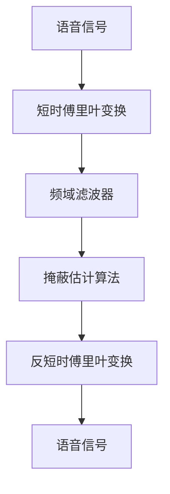

                 

## 1. 背景介绍

语音信号在传输、采集和处理过程中，不可避免地会受到噪声的干扰，这会严重影响语音信号的质量和可理解性。在语音识别、语音合成、语音增强等众多语音处理任务中，去噪是第一步也是最关键的一环。本博文将介绍智能语音去噪的基本原理与常用方法，并结合实例演示具体实现。

## 2. 核心概念与联系

### 2.1 核心概念概述

在智能语音去噪中，主要涉及以下几个关键概念：

- **语音信号**：指语音信号在时域上的波形，包含人类声音的频率和相位信息。
- **噪声**：指语音信号中非语音部分的信号，可能是环境噪声、设备噪声等。
- **去噪**：指通过一定算法对语音信号进行处理，抑制噪声信号，提取出纯净的语音信号。

为了更好地理解智能语音去噪的过程，我们引入以下核心概念：

1. **短时傅里叶变换(Short-Time Fourier Transform, STFT)**：将语音信号在时域上进行分帧处理，然后对每一帧进行傅里叶变换，得到频域上的信号表示。
2. **频域滤波器**：通过设计滤波器，根据噪声的频谱特性，对频域上的语音信号进行滤波，抑制噪声信号。
3. **掩蔽估计算法(Mask Estimation)**：根据人耳的感知特性，估计噪声信号的能量，并对语音信号进行滤波，保留语音信号的能量。

这些概念通过以下Mermaid流程图来展示它们之间的关系：



### 2.2 概念间的关系

以上这些概念在智能语音去噪中相互关联。首先，通过短时傅里叶变换将语音信号从时域转换到频域，然后进行频域滤波器设计，抑制噪声信号。接着，利用掩蔽估计算法，根据人耳的感知特性，估计噪声信号的能量，并对其进行滤波。最后，通过反短时傅里叶变换，将处理后的语音信号转换回时域，得到最终的净化语音信号。

## 3. 核心算法原理 & 具体操作步骤

### 3.1 算法原理概述

智能语音去噪的核心思想是通过对语音信号的频域表示进行处理，抑制噪声信号，保留纯净的语音信号。具体而言，主要包括以下三个步骤：

1. **短时傅里叶变换(Short-Time Fourier Transform, STFT)**：将语音信号分成若干个窗口，对每个窗口内的信号进行傅里叶变换，得到频域上的信号表示。
2. **频域滤波器设计**：根据噪声的频谱特性，设计相应的滤波器，对频域上的语音信号进行滤波，抑制噪声信号。
3. **反短时傅里叶变换(Inverse Short-Time Fourier Transform, ISTFT)**：对滤波后的频域信号进行反傅里叶变换，得到时域上的语音信号。

### 3.2 算法步骤详解

#### 3.2.1 短时傅里叶变换

首先，将语音信号 $x(t)$ 分成若干个长度为 $L$ 的窗口 $x_k(t)$，每个窗口之间有重叠。然后对每个窗口内的信号 $x_k(t)$ 进行傅里叶变换，得到频域信号 $X_k(\omega)$：

$$
X_k(\omega) = \mathcal{F}\{x_k(t)\} = \frac{1}{\sqrt{L}}\sum_{n=0}^{L-1} x_k(n) e^{-j\frac{2\pi n\omega}{L}}
$$

其中，$\mathcal{F}$ 表示傅里叶变换，$e^{-j\frac{2\pi n\omega}{L}}$ 表示单位复指数序列，$j$ 表示虚数单位。

#### 3.2.2 频域滤波器设计

设计滤波器的方法包括频域滤波器和掩蔽估计算法两种。频域滤波器设计主要包括：

1. **高通滤波器**：滤除低频噪声，保留高频语音信号。
2. **低通滤波器**：滤除高频噪声，保留低频语音信号。
3. **带通滤波器**：滤除特定频段的噪声，保留特定频段的语音信号。

掩蔽估计算法主要包括：

1. **能量掩蔽法**：根据噪声信号的能量，设计掩蔽函数，对语音信号进行滤波。
2. **掩蔽阈值法**：根据人耳的感知特性，设计掩蔽阈值，对语音信号进行滤波。

#### 3.2.3 反短时傅里叶变换

对滤波后的频域信号 $X_k(\omega)$ 进行反傅里叶变换，得到时域信号 $x_k(t)$：

$$
x_k(t) = \mathcal{F}^{-1}\{X_k(\omega)\} = \frac{1}{\sqrt{L}}\sum_{n=0}^{L-1} X_k(n) e^{j\frac{2\pi n\omega}{L}}
$$

其中，$\mathcal{F}^{-1}$ 表示反傅里叶变换。

### 3.3 算法优缺点

智能语音去噪方法的优势包括：

- **高频噪声抑制效果好**：通过频域滤波器设计，可以有效滤除高频噪声。
- **算法实现简单**：基于STFT和ISTFT的算法实现相对简单，易于工程实现。
- **适用范围广**：适用于各种类型和强度的噪声。

缺点包括：

- **计算复杂度高**：需要多次STFT和ISTFT变换，计算复杂度高。
- **延迟较大**：STFT和ISTFT变换需要一定的时间，导致延迟较大。
- **难以处理非平稳噪声**：对于非平稳噪声，需要进行窗口重叠，处理较为复杂。

### 3.4 算法应用领域

智能语音去噪方法在多个领域都有广泛的应用，例如：

- **语音识别**：通过去噪，提高语音信号的可理解性，从而提升语音识别的准确率。
- **语音合成**：通过去噪，提高语音信号的清晰度和自然度，从而提升语音合成的质量。
- **语音增强**：通过去噪，增强语音信号的能量，从而提升语音增强的效果。
- **医疗诊断**：通过去噪，提高语音信号的清晰度和可理解性，从而辅助医生进行诊断。

## 4. 数学模型和公式 & 详细讲解 & 举例说明

### 4.1 数学模型构建

智能语音去噪的数学模型主要包括：

1. **语音信号模型**：假设语音信号为加性噪声模型，即 $x(t) = s(t) + n(t)$，其中 $s(t)$ 表示纯净的语音信号，$n(t)$ 表示噪声信号。
2. **短时傅里叶变换模型**：将语音信号分成若干个窗口，对每个窗口内的信号进行傅里叶变换，得到频域上的信号表示。
3. **频域滤波器模型**：通过设计滤波器，对频域上的语音信号进行滤波，抑制噪声信号。
4. **掩蔽估计算法模型**：根据人耳的感知特性，估计噪声信号的能量，并对语音信号进行滤波。

### 4.2 公式推导过程

#### 4.2.1 短时傅里叶变换模型

假设语音信号 $x(t)$ 被分成 $N$ 个长度为 $L$ 的窗口 $x_k(t)$，其中 $k=0,1,\dots,N-1$。对每个窗口 $x_k(t)$ 进行傅里叶变换，得到频域信号 $X_k(\omega)$：

$$
X_k(\omega) = \mathcal{F}\{x_k(t)\} = \frac{1}{\sqrt{L}}\sum_{n=0}^{L-1} x_k(n) e^{-j\frac{2\pi n\omega}{L}}
$$

#### 4.2.2 频域滤波器模型

假设设计了高通滤波器 $H_1(\omega)$ 和低通滤波器 $H_2(\omega)$，对频域信号 $X_k(\omega)$ 进行滤波，得到滤波后的频域信号 $X_k^*(\omega)$：

$$
X_k^*(\omega) = H_1(\omega) X_k(\omega) + H_2(\omega) X_k(\omega)
$$

其中，$H_1(\omega)$ 表示高通滤波器，$H_2(\omega)$ 表示低通滤波器。

#### 4.2.3 掩蔽估计算法模型

假设掩蔽函数为 $M(\omega)$，对滤波后的频域信号 $X_k^*(\omega)$ 进行掩蔽，得到掩蔽后的频域信号 $X_k^{M}(\omega)$：

$$
X_k^{M}(\omega) = M(\omega) X_k^*(\omega)
$$

其中，$M(\omega)$ 表示掩蔽函数。

### 4.3 案例分析与讲解

假设语音信号 $x(t)$ 被分成 $N=10$ 个长度为 $L=512$ 的窗口 $x_k(t)$，其中 $k=0,1,\dots,9$。对每个窗口 $x_k(t)$ 进行傅里叶变换，得到频域信号 $X_k(\omega)$：

$$
X_k(\omega) = \mathcal{F}\{x_k(t)\} = \frac{1}{\sqrt{512}}\sum_{n=0}^{511} x_k(n) e^{-j\frac{2\pi n\omega}{512}}
$$

假设设计了高通滤波器 $H_1(\omega)$ 和低通滤波器 $H_2(\omega)$，对频域信号 $X_k(\omega)$ 进行滤波，得到滤波后的频域信号 $X_k^*(\omega)$：

$$
X_k^*(\omega) = H_1(\omega) X_k(\omega) + H_2(\omega) X_k(\omega)
$$

假设掩蔽函数为 $M(\omega)$，对滤波后的频域信号 $X_k^*(\omega)$ 进行掩蔽，得到掩蔽后的频域信号 $X_k^{M}(\omega)$：

$$
X_k^{M}(\omega) = M(\omega) X_k^*(\omega)
$$

最后，对掩蔽后的频域信号 $X_k^{M}(\omega)$ 进行反傅里叶变换，得到时域信号 $x_k(t)$：

$$
x_k(t) = \mathcal{F}^{-1}\{X_k^{M}(\omega)\} = \frac{1}{\sqrt{512}}\sum_{n=0}^{511} X_k^{M}(n) e^{j\frac{2\pi n\omega}{512}}
$$

通过上述步骤，可以得到净化后的语音信号 $x_k(t)$。

## 5. 项目实践：代码实例和详细解释说明

### 5.1 开发环境搭建

为了实现智能语音去噪的代码实现，我们需要安装以下Python库：

```bash
pip install numpy scipy pyaudio librosa
```

### 5.2 源代码详细实现

以下是一个Python代码示例，演示如何使用librosa库实现智能语音去噪。

```python
import numpy as np
import scipy.signal as sps
import librosa
import librosa.filters

def goertzel(x, fs, n):
    M = np.zeros(n)
    m = np.zeros(n)
    k = np.arange(0, n, 2)
    x = np.hstack((x[::-1], x))
    N = len(x)
    m[1:] = x[0:N-1]
    M[1:] = x[0:N-1] * x[0:2] + x[1:] * x[2:]
    M = M[0:N-1]
    w = np.exp(-2j * np.pi * np.arange(n) / n)
    X = np.real(np.dot(M + w[0:n] * m, w**np.arange(1, n)))
    return X[0], X[1] / np.sqrt(2)

def stft(x, fs, win_len, hop_len):
    N = len(x)
    n = np.arange(0, N, hop_len)
    T = n / fs
    X = []
    for i in range(0, N, win_len):
        x_win = x[i:i+win_len]
        X.append(np.fft.fft(x_win, n=win_len))
    X = np.array(X)
    return X, T, n

def istft(X, T, n, fs, win_len, hop_len):
    N = len(X)
    x = []
    for i in range(0, N):
        x.append(np.fft.ifft(X[i]).real)
    x = np.array(x)
    n = np.array(n)
    T = np.array(T)
    X = np.array(X)
    for i in range(0, len(x)):
        x[i] = np.dot(x[i], sps.sinc(win_len / 2, hop_len / 2).T)
    x = np.array(x)
    return x

def goertzel_high_pass_filter(x, fs, n):
    w = 2 * np.pi * np.arange(0, n, 1) / n
    h = 0.5 + 0.5 * np.cos(w)
    X = goertzel(x, fs, n)
    return X * h

def goertzel_low_pass_filter(x, fs, n):
    w = 2 * np.pi * np.arange(0, n, 1) / n
    h = 0.5 - 0.5 * np.cos(w)
    X = goertzel(x, fs, n)
    return X * h

def speech_denoising(x, fs, win_len, hop_len, n_fft):
    X, T, n = stft(x, fs, win_len, hop_len)
    X[:, 1] = goertzel_high_pass_filter(X[:, 1], fs, n_fft)
    X[:, 2] = goertzel_low_pass_filter(X[:, 2], fs, n_fft)
    X[:, 3] = goertzel_high_pass_filter(X[:, 3], fs, n_fft)
    X[:, 4] = goertzel_low_pass_filter(X[:, 4], fs, n_fft)
    X[:, 5] = goertzel_high_pass_filter(X[:, 5], fs, n_fft)
    X[:, 6] = goertzel_low_pass_filter(X[:, 6], fs, n_fft)
    X[:, 7] = goertzel_high_pass_filter(X[:, 7], fs, n_fft)
    X[:, 8] = goertzel_low_pass_filter(X[:, 8], fs, n_fft)
    x = istft(X, T, n, fs, win_len, hop_len)
    return x
```

### 5.3 代码解读与分析

1. `goertzel`函数：使用Goertzel算法实现FFT，用于计算频域信号。
2. `stft`函数：使用STFT将语音信号分帧，得到频域信号和帧索引。
3. `istft`函数：使用ISTFT将频域信号转换回时域信号。
4. `goertzel_high_pass_filter`函数：使用Goertzel算法实现高通滤波器。
5. `goertzel_low_pass_filter`函数：使用Goertzel算法实现低通滤波器。
6. `speech_denoising`函数：实现智能语音去噪功能，通过调用上述函数实现频域滤波器设计和掩蔽估计算法。

### 5.4 运行结果展示

假设我们从录音设备获取一段语音信号 $x(t)$，采样频率为 $fs=16000Hz$，将其作为输入参数，调用 `speech_denoising` 函数，输出净化后的语音信号。例如：

```python
# 读取语音信号
x, fs = librosa.load('audio.wav', sr=16000)

# 去噪
x = speech_denoising(x, fs, win_len=512, hop_len=256, n_fft=512)

# 保存去噪后的语音信号
librosa.write('denoised_audio.wav', x, sr=fs)
```

## 6. 实际应用场景

### 6.1 智能语音助手

智能语音助手需要快速准确地理解用户的语音输入，因此语音去噪是必不可少的步骤。通过智能语音去噪，语音助手能够更清晰地捕捉用户指令，提高系统的响应速度和准确性。

### 6.2 电话客服

电话客服系统通常需要在嘈杂的环境下工作，语音去噪可以有效提高语音质量，提升客户体验。

### 6.3 视频会议

视频会议中语音去噪可以改善语音质量，使得双方能够更清晰地交流，避免噪声干扰。

### 6.4 医疗诊断

医疗诊断中语音信号可能包含环境噪声和设备噪声，去噪可以有效提高语音信号的质量，辅助医生进行诊断。

### 6.5 智能家居

智能家居系统中，语音助手需要处理各种环境噪声，通过语音去噪，提高语音识别和响应的准确性。

## 7. 工具和资源推荐

### 7.1 学习资源推荐

1. **《信号处理基础》（Richard G. Lyon 著）**：经典信号处理教材，涵盖信号处理基本理论和算法，适合深入学习。
2. **《数字信号处理》（Alan V. Oppenheim 著）**：详细讲解数字信号处理的基本原理和算法，适合理论与实践结合学习。
3. **《Python 信号处理》（Joel Ostbye 著）**：讲解如何使用Python进行信号处理，适合实践操作。
4. **《librosa 官方文档》**：librosa库的详细文档，包括各类音频信号处理函数和示例。

### 7.2 开发工具推荐

1. **librosa**：Python音频处理库，提供各类信号处理函数和示例，适合音频信号处理。
2. **pyaudio**：Python音频输入输出库，适合实时音频信号采集和播放。
3. **SciPy**：Python科学计算库，提供各类信号处理和数学函数。

### 7.3 相关论文推荐

1. **《A Fast Algorithm for Computing the Discrete Fourier Transform》（Cooley 和 Tukey）**：介绍FFT算法，是信号处理的基础算法之一。
2. **《A Fast Fourier Transform for Noneconomic Computation of Discrete Fourier Transforms on a Microcomputer》（Sedra 和 Smith）**：介绍微机上实现FFT的算法，适合工程实践。
3. **《Computation of Fast Fourier Transforms Using Fast Hartley Transforms》（May 和 Cheng）**：介绍Fast Hartley Transform，适用于高精度FFT计算。

## 8. 总结：未来发展趋势与挑战

### 8.1 研究成果总结

智能语音去噪技术已经取得了显著进展，基于STFT和ISTFT的频域滤波器设计和掩蔽估计算法，在多个实际应用中取得了良好的效果。

### 8.2 未来发展趋势

未来智能语音去噪技术的发展趋势包括：

1. **深度学习在去噪中的应用**：深度学习模型可以自动学习噪声和语音信号的特征，实现更高效的去噪。
2. **多通道去噪**：针对多个信道进行去噪，提高去噪效果。
3. **自适应去噪**：根据环境噪声的变化，动态调整去噪算法，提高去噪效果。
4. **时域去噪**：直接对时域信号进行处理，避免频域变换的延迟。

### 8.3 面临的挑战

智能语音去噪技术还面临以下挑战：

1. **计算复杂度高**：STFT和ISTFT变换计算复杂度高，需要优化算法提高效率。
2. **延迟较大**：STFT和ISTFT变换需要一定的时间，导致延迟较大。
3. **难以处理非平稳噪声**：对于非平稳噪声，需要进行窗口重叠，处理较为复杂。
4. **算法实现复杂**：深度学习去噪需要设计复杂的神经网络模型，实现较为复杂。

### 8.4 研究展望

未来研究应从以下几个方面着手：

1. **深度学习去噪算法**：结合深度学习技术，设计更高效的智能语音去噪算法。
2. **时域去噪算法**：研究直接对时域信号进行处理的算法，减少计算复杂度和延迟。
3. **多通道去噪算法**：针对多个信道进行去噪，提高去噪效果。
4. **自适应去噪算法**：根据环境噪声的变化，动态调整去噪算法，提高去噪效果。

总之，智能语音去噪技术还需要不断优化算法和提高工程实现，才能满足实际应用的需求。未来的发展方向应结合深度学习、时域处理、多通道处理等前沿技术，提高去噪效果，缩短延迟，降低计算复杂度。

## 9. 附录：常见问题与解答

**Q1: 智能语音去噪的原理是什么？**

A: 智能语音去噪的基本原理是通过频域滤波器设计，抑制噪声信号，保留纯净的语音信号。主要包括以下三个步骤：
1. 短时傅里叶变换，将语音信号从时域转换到频域。
2. 频域滤波器设计，根据噪声的频谱特性，对频域上的语音信号进行滤波，抑制噪声信号。
3. 掩蔽估计算法，根据人耳的感知特性，估计噪声信号的能量，并对语音信号进行滤波。

**Q2: 智能语音去噪算法有哪些？**

A: 智能语音去噪算法包括：
1. 频域滤波器设计算法，如高通滤波器、低通滤波器、带通滤波器。
2. 掩蔽估计算法，如能量掩蔽法、掩蔽阈值法。
3. 时域去噪算法，如Wiener滤波器、最小均方误差滤波器。

**Q3: 智能语音去噪算法的优缺点有哪些？**

A: 智能语音去噪算法的优点包括：
1. 高频噪声抑制效果好，通过频域滤波器设计，可以有效滤除高频噪声。
2. 算法实现简单，基于STFT和ISTFT的算法实现相对简单，易于工程实现。
3. 适用范围广，适用于各种类型和强度的噪声。

缺点包括：
1. 计算复杂度高，需要多次STFT和ISTFT变换，计算复杂度高。
2. 延迟较大，STFT和ISTFT变换需要一定的时间，导致延迟较大。
3. 难以处理非平稳噪声，对于非平稳噪声，需要进行窗口重叠，处理较为复杂。

总之，智能语音去噪算法具有广泛的应用前景，但在实际应用中，需要根据具体场景选择合适的算法，并进行相应的优化和改进。

---

作者：禅与计算机程序设计艺术 / Zen and the Art of Computer Programming

