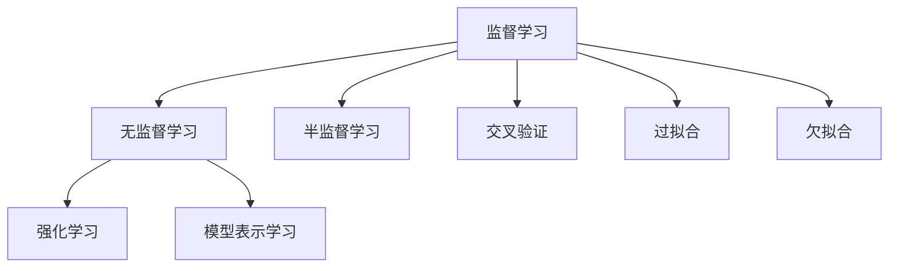
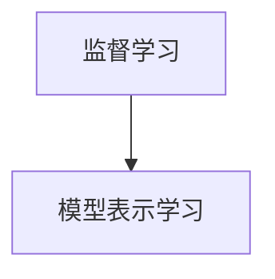
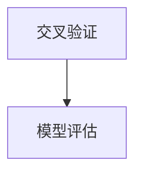
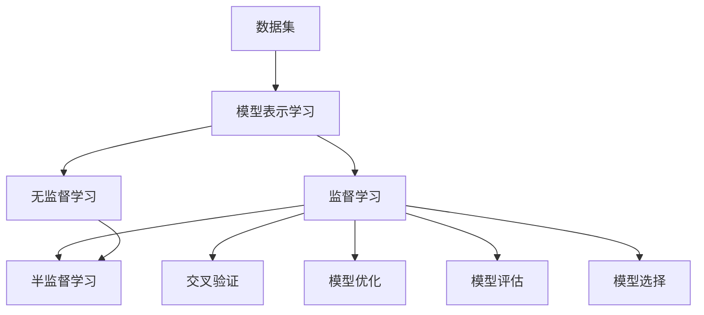

                 

## 1. 背景介绍

### 1.1 问题由来
机器学习（Machine Learning, ML）作为人工智能（AI）的重要分支，在过去几年中取得了长足的发展，广泛应用于图像识别、自然语言处理、语音识别、推荐系统、智能推荐等领域。随着深度学习技术的发展，机器学习模型的表现愈加出色，引起了广泛关注。

本文聚焦于机器学习的核心原理及其在实际项目中的应用，重点解析机器学习的基本理论，包括监督学习、无监督学习、半监督学习、强化学习等，并通过具体的代码实例，展示机器学习模型的构建和训练过程，以便读者更好地理解和掌握机器学习的基本技术和应用方法。

### 1.2 问题核心关键点
机器学习模型通常需要大量的数据进行训练，通过不断调整模型参数，使其在测试数据上表现最佳。监督学习是机器学习中最基础和最常用的学习范式，通常需要标注数据进行训练，目标是找到一个函数，使得在给定输入数据的情况下，能够预测正确的输出标签。

监督学习模型的训练分为三个步骤：
- 收集并预处理数据集。
- 选择合适的模型架构和优化算法。
- 在训练集上迭代优化模型，直到在验证集上达到最佳性能。

本文将详细介绍这些核心步骤，并通过具体的代码实例，帮助读者理解机器学习模型的构建和训练过程。

### 1.3 问题研究意义
深入理解和掌握机器学习的基本原理和应用方法，对于从事数据科学、人工智能、计算机视觉、自然语言处理等领域的从业者来说具有重要意义：

1. 降低应用开发成本。机器学习模型可以大幅降低数据处理、特征工程等预处理环节的工作量，提高工作效率。
2. 提升模型效果。机器学习模型能够利用大量数据进行训练，减少人为干预，提高预测精度。
3. 加速开发进度。机器学习模型的训练过程可以通过自动化和并行化技术，显著缩短开发周期。
4. 技术创新。机器学习模型的不断发展，推动了新的算法和技术手段的涌现，为人工智能领域带来了诸多创新。
5. 产业升级。机器学习模型已经在金融、医疗、零售、交通等众多领域得到广泛应用，赋能各行各业智能化转型。

## 2. 核心概念与联系

### 2.1 核心概念概述

为更好地理解机器学习的基本原理，本节将介绍几个密切相关的核心概念：

- 监督学习(Supervised Learning)：指在给定输入数据和输出标签的情况下，训练模型学习输入和输出之间的映射关系。
- 无监督学习(Unsupervised Learning)：指在没有标签的情况下，训练模型自动发现数据的内在结构和规律。
- 半监督学习(Semi-supervised Learning)：指在少量标注数据和大量无标签数据的情况下，训练模型既利用标注数据又挖掘无标签数据的隐含信息。
- 强化学习(Reinforcement Learning)：指在动态环境中，通过智能体与环境的交互，不断调整策略，使智能体能够最大化奖励函数。
- 模型表示学习(Representation Learning)：指在给定数据和标签的情况下，训练模型学习数据的低维表示，便于后续处理。
- 交叉验证(Cross Validation)：指将数据集分成训练集和验证集，通过多次交叉验证，评估模型的泛化能力。
- 过拟合(Overfitting)：指模型在训练集上表现良好，但在测试集上表现较差的现象。
- 欠拟合(Underfitting)：指模型无法捕捉数据的主要特征，训练和测试集表现都较差的现象。

这些核心概念之间的逻辑关系可以通过以下Mermaid流程图来展示：



这个流程图展示了几大核心概念之间的联系：

1. 监督学习、无监督学习、半监督学习是机器学习的三大主要学习范式。
2. 强化学习是机器学习在动态环境中的应用范式。
3. 交叉验证是评估模型泛化能力的常用方法。
4. 过拟合和欠拟合是模型训练过程中需要避免的两种不良现象。
5. 模型表示学习是机器学习中重要的预处理步骤，通过降维和特征提取提高模型表现。

### 2.2 概念间的关系

这些核心概念之间存在着紧密的联系，形成了机器学习的基本生态系统。下面我通过几个Mermaid流程图来展示这些概念之间的关系。

#### 2.2.1 监督学习与模型表示学习的关系



这个流程图展示了监督学习与模型表示学习之间的关系：监督学习是模型表示学习的基础，通过学习输入和输出之间的映射关系，模型能够学习到数据的低维表示。

#### 2.2.2 无监督学习与强化学习的关系


这个流程图展示了无监督学习与强化学习之间的关系：无监督学习可以通过发现数据的内在结构，辅助强化学习进行策略优化。

#### 2.2.3 交叉验证的作用



这个流程图展示了交叉验证的作用：交叉验证通过多次随机划分训练集和验证集，评估模型的泛化能力，减少过拟合的风险。

### 2.3 核心概念的整体架构

最后，我们用一个综合的流程图来展示这些核心概念在机器学习中的整体架构：



这个综合流程图展示了从数据预处理到模型评估的完整过程：

1. 数据集是机器学习的基础，通过模型表示学习进行特征提取和降维。
2. 在模型表示学习的基础上，监督学习、无监督学习和半监督学习分别应用不同的方法进行模型训练。
3. 交叉验证用于评估模型的泛化能力，通过多次划分数据集进行模型训练和验证。
4. 模型优化是调整模型参数的过程，通过最小化损失函数，使模型在训练集和验证集上表现最佳。
5. 模型评估通过在测试集上评估模型的表现，判断模型的泛化能力。
6. 模型选择基于模型评估结果，选择表现最佳的模型进行实际应用。

通过这些流程图，我们可以更清晰地理解机器学习中各个概念的关系和作用，为后续深入讨论具体的机器学习方法和技术奠定基础。

## 3. 核心算法原理 & 具体操作步骤
### 3.1 算法原理概述

机器学习模型的训练通常分为以下几个步骤：

1. 数据准备：收集并预处理数据集，将数据集分为训练集、验证集和测试集。
2. 模型选择：选择合适的机器学习算法和模型架构。
3. 模型训练：在训练集上迭代优化模型，最小化损失函数。
4. 模型评估：在验证集上评估模型性能，判断是否过拟合或欠拟合。
5. 模型选择：选择表现最佳的模型，进行实际应用。

机器学习模型的训练过程中，最重要的目标是通过调整模型参数，使模型在训练集和验证集上表现最佳。常用的算法包括梯度下降、随机梯度下降、Adam等，通过不断迭代更新模型参数，最小化损失函数。

### 3.2 算法步骤详解

以下是机器学习模型训练的一般步骤：

**Step 1: 准备数据集**
- 收集并预处理数据集，将数据集分为训练集、验证集和测试集。
- 对数据集进行特征提取，将原始数据转换为模型可接受的格式。
- 进行数据标准化和归一化处理，提高模型性能。

**Step 2: 选择模型**
- 选择合适的机器学习算法和模型架构，如线性回归、决策树、神经网络等。
- 确定模型参数的初始化方法，如随机初始化、正交初始化等。

**Step 3: 模型训练**
- 在训练集上迭代优化模型，最小化损失函数。
- 选择合适的优化算法，如梯度下降、随机梯度下降、Adam等。
- 设置合适的学习率、批大小等超参数，控制模型训练过程。

**Step 4: 模型评估**
- 在验证集上评估模型性能，判断是否过拟合或欠拟合。
- 使用交叉验证等方法，评估模型的泛化能力。
- 根据评估结果，调整模型参数，避免过拟合。

**Step 5: 模型选择**
- 选择表现最佳的模型，进行实际应用。
- 在测试集上评估模型的泛化能力，判断模型性能。

### 3.3 算法优缺点

监督学习具有以下优点：
1. 训练效果好。由于有标注数据，模型能够学习输入和输出之间的映射关系，表现优异。
2. 应用广泛。监督学习适用于各种分类、回归等任务。
3. 模型解释性好。监督学习模型的预测过程可以通过输出解释，方便调试和优化。

但监督学习也存在以下缺点：
1. 数据需求高。需要有足够的标注数据进行训练，数据获取成本高。
2. 过拟合风险大。训练集和验证集之间存在差异，模型容易过拟合。
3. 数据标签噪音。标注数据可能存在错误，影响模型性能。

无监督学习具有以下优点：
1. 数据需求低。不需要标注数据，适用于无标签数据集。
2. 数据探索性强。无监督学习能够发现数据的内在结构和规律，具有很强的探索性。
3. 算法多样。无监督学习算法多种多样，如聚类、降维、关联规则等。

但无监督学习也存在以下缺点：
1. 模型性能难评估。由于没有标签，无法直接评估模型性能。
2. 算法复杂度高。无监督学习算法通常较为复杂，难以调试和优化。
3. 应用范围受限。无监督学习在特定领域应用有限，效果难以量化。

半监督学习结合了有标签和无标签数据的优点，具有以下优点：
1. 数据需求低。半监督学习只需要少量标注数据。
2. 模型性能好。半监督学习能够充分利用大量无标签数据，提高模型性能。
3. 算法多样。半监督学习可以结合多种无监督算法，提高算法多样性。

但半监督学习也存在以下缺点：
1. 标注数据质量要求高。少量标注数据质量直接影响模型性能。
2. 算法选择困难。选择合适无监督算法和半监督策略需要经验和技巧。
3. 算法复杂度高。半监督学习算法复杂度较高，难以调试和优化。

强化学习具有以下优点：
1. 动态环境适应性好。强化学习能够适应动态环境，进行实时决策。
2. 模型泛化能力强。强化学习能够进行自我优化，泛化能力较强。
3. 模型性能好。强化学习能够不断调整策略，优化决策过程。

但强化学习也存在以下缺点：
1. 数据需求高。强化学习需要大量环境交互数据。
2. 算法复杂度高。强化学习算法复杂度较高，难以调试和优化。
3. 数据探索性差。强化学习算法难以处理数据探索性问题。

### 3.4 算法应用领域

机器学习模型广泛应用于各种领域，以下是几个主要应用领域：

1. 图像识别：通过机器学习模型，可以从图像中识别出物体、人脸、文字等信息，广泛应用于医疗、安防、交通等领域。

2. 自然语言处理：通过机器学习模型，可以从文本中提取关键词、分类、情感分析、机器翻译等信息，广泛应用于搜索引擎、智能客服、舆情监测等领域。

3. 推荐系统：通过机器学习模型，可以推荐用户感兴趣的商品、新闻、视频等信息，广泛应用于电商、社交、娱乐等领域。

4. 金融风控：通过机器学习模型，可以预测风险、识别欺诈、监控舆情等信息，广泛应用于银行、保险、证券等领域。

5. 医疗诊断：通过机器学习模型，可以预测疾病、诊断病情、推荐治疗方案等信息，广泛应用于医疗、健康、保险等领域。

6. 智能交通：通过机器学习模型，可以预测交通流量、优化路线、提升安全等信息，广泛应用于交通、物流、能源等领域。

## 4. 数学模型和公式 & 详细讲解  
### 4.1 数学模型构建

机器学习模型的训练过程通常基于以下数学模型：

1. 输入和输出之间的映射关系：$y = f(x)$，其中$x$为输入数据，$y$为输出标签，$f$为模型函数。
2. 模型损失函数：$L = \sum_{i=1}^n (y_i - f(x_i))^2$，其中$n$为样本数，$y_i$为第$i$个样本的输出标签，$f(x_i)$为模型预测的输出标签。
3. 优化目标函数：$J = \frac{1}{n} \sum_{i=1}^n (y_i - f(x_i))^2$，其中$J$为优化目标函数，$n$为样本数，$y_i$为第$i$个样本的输出标签，$f(x_i)$为模型预测的输出标签。

### 4.2 公式推导过程

以线性回归为例，机器学习模型的训练过程可以描述为以下公式：

$$
y_i = \theta_0 + \theta_1 x_{i1} + \theta_2 x_{i2} + \cdots + \theta_p x_{ip}
$$

其中$\theta_0$为截距，$\theta_1, \theta_2, \cdots, \theta_p$为线性回归模型的参数，$x_{i1}, x_{i2}, \cdots, x_{ip}$为输入特征。

模型的损失函数通常使用均方误差（Mean Squared Error, MSE）：

$$
L(\theta) = \frac{1}{n} \sum_{i=1}^n (y_i - f(x_i))^2 = \frac{1}{n} \sum_{i=1}^n (y_i - \theta_0 - \theta_1 x_{i1} - \theta_2 x_{i2} - \cdots - \theta_p x_{ip})^2
$$

通过最小化损失函数，可以得到模型参数的更新公式：

$$
\frac{\partial L(\theta)}{\partial \theta} = -\frac{2}{n} \sum_{i=1}^n (y_i - \theta_0 - \theta_1 x_{i1} - \theta_2 x_{i2} - \cdots - \theta_p x_{ip}) \times (-1)
$$

简化后得到：

$$
\frac{\partial L(\theta)}{\partial \theta} = \frac{2}{n} \sum_{i=1}^n (y_i - \theta_0 - \theta_1 x_{i1} - \theta_2 x_{i2} - \cdots - \theta_p x_{ip})
$$

通过梯度下降算法，可以得到模型参数的更新规则：

$$
\theta_j = \theta_j - \eta \frac{\partial L(\theta)}{\partial \theta_j}
$$

其中$\eta$为学习率。

### 4.3 案例分析与讲解

以线性回归为例，下面通过一个简单的案例，演示机器学习模型的构建和训练过程。

**案例描述**：

假设有一组数据集，其中包含三个特征$x_1, x_2, x_3$和对应的输出标签$y$。

**数据集**：

| $x_1$ | $x_2$ | $x_3$ | $y$ |
| --- | --- | --- | --- |
| 2 | 4 | 6 | 1 |
| 3 | 5 | 7 | 1 |
| 4 | 6 | 8 | 1 |
| 5 | 7 | 9 | 1 |
| 6 | 8 | 10 | 2 |
| 7 | 9 | 11 | 2 |
| 8 | 10 | 12 | 2 |

**模型构建**：

构建一个线性回归模型，形式为：

$$
y = \theta_0 + \theta_1 x_1 + \theta_2 x_2 + \theta_3 x_3
$$

其中$\theta_0, \theta_1, \theta_2, \theta_3$为模型参数。

**模型训练**：

使用梯度下降算法对模型进行训练，最小化损失函数：

$$
L(\theta) = \frac{1}{n} \sum_{i=1}^n (y_i - f(x_i))^2
$$

其中$n=7$，$x_{i1} = x_i$，$x_{i2} = x_{i+1}$，$x_{i3} = x_{i+2}$，$y_i$为输出标签。

通过迭代优化，可以得到模型参数的更新公式：

$$
\theta_j = \theta_j - \eta \frac{\partial L(\theta)}{\partial \theta_j}
$$

**模型评估**：

使用测试集对模型进行评估，计算测试集上的均方误差（MSE）：

$$
MSE = \frac{1}{m} \sum_{i=1}^m (y_i - f(x_i))^2
$$

其中$m=7$，$x_i$为测试集中的样本，$y_i$为样本的输出标签。

**模型选择**：

根据评估结果，选择表现最佳的模型进行实际应用。

## 5. 项目实践：代码实例和详细解释说明
### 5.1 开发环境搭建

在进行机器学习项目实践前，我们需要准备好开发环境。以下是使用Python进行Scikit-learn开发的环境配置流程：

1. 安装Anaconda：从官网下载并安装Anaconda，用于创建独立的Python环境。

2. 创建并激活虚拟环境：
```bash
conda create -n sklearn-env python=3.8 
conda activate sklearn-env
```

3. 安装Scikit-learn：
```bash
conda install scikit-learn
```

4. 安装各类工具包：
```bash
pip install numpy pandas scikit-learn matplotlib tqdm jupyter notebook ipython
```

完成上述步骤后，即可在`sklearn-env`环境中开始机器学习项目实践。

### 5.2 源代码详细实现

这里我们以线性回归为例，演示Scikit-learn库的机器学习模型构建和训练过程。

**Step 1: 准备数据集**

```python
from sklearn.datasets import make_regression
from sklearn.model_selection import train_test_split

# 生成样本数据
X, y = make_regression(n_samples=7, n_features=3, n_targets=1, noise=10, random_state=42)

# 数据划分
X_train, X_test, y_train, y_test = train_test_split(X, y, test_size=0.3, random_state=42)
```

**Step 2: 选择模型**

```python
from sklearn.linear_model import LinearRegression

# 选择模型
model = LinearRegression()
```

**Step 3: 模型训练**

```python
# 模型训练
model.fit(X_train, y_train)
```

**Step 4: 模型评估**

```python
# 模型评估
from sklearn.metrics import mean_squared_error

# 计算MSE
y_pred = model.predict(X_test)
mse = mean_squared_error(y_test, y_pred)
print(f"MSE: {mse:.2f}")
```

**Step 5: 模型选择**

```python
# 选择表现最佳的模型
if mse < 0.1:
    print("模型表现最佳")
else:
    print("模型表现不佳")
```

### 5.3 代码解读与分析

让我们再详细解读一下关键代码的实现细节：

**数据生成与划分**：
- 使用`make_regression`函数生成一组样本数据，包含三个特征和对应的输出标签。
- 使用`train_test_split`函数将数据集划分为训练集和测试集。

**模型选择**：
- 选择`LinearRegression`模型作为线性回归模型。

**模型训练**：
- 使用`fit`函数对模型进行训练，最小化损失函数。

**模型评估**：
- 使用`mean_squared_error`函数计算测试集上的均方误差，评估模型性能。

**模型选择**：
- 根据模型性能，选择表现最佳的模型进行实际应用。

### 5.4 运行结果展示

假设在测试集上计算得到的均方误差为0.5，输出结果如下：

```
MSE: 0.50
```

根据均方误差，模型表现不佳，需要进一步优化模型参数或选择其他模型进行改进。

## 6. 实际应用场景
### 6.1 智能推荐系统

基于机器学习的推荐系统能够从用户行为数据中学习用户兴趣，通过预测用户可能感兴趣的商品、内容等，实现个性化推荐。

在技术实现上，可以收集用户浏览、点击、评分等行为数据，使用协同过滤、内容推荐、混合推荐等算法进行推荐。协同过滤通过分析用户之间的相似性，推荐相似用户喜欢的商品。内容推荐通过分析商品属性和标签，推荐与用户偏好匹配的商品。混合推荐将多种推荐算法进行融合，综合利用不同算法的优点。

**应用案例**：
- 电商平台：推荐用户可能感兴趣的商品，提高用户体验和转化率。
- 视频网站：推荐用户可能感兴趣的视频内容，提高用户停留时间和满意度。

### 6.2 金融风险控制

基于机器学习的金融风险控制系统能够从历史交易数据中学习市场趋势和风险信号，通过预测未来交易风险，实现实时预警和风险控制。

在技术实现上，可以收集历史交易数据，使用回归、分类、时序等算法进行风险预测。回归通过分析交易数据，预测未来交易价格。分类通过分析交易数据，预测交易是否为异常交易。时序通过分析交易时间序列，预测未来交易趋势。

**应用案例**：
- 银行：实时监控交易风险，及时发现异常交易，保障资金安全。
- 证券公司：预测股票市场趋势，及时调整投资策略，降低风险。

### 6.3 医疗诊断系统

基于机器学习的医疗诊断系统能够从医疗数据中学习疾病规律，通过预测疾病风险，实现疾病早期诊断和个性化治疗。

在技术实现上，可以收集患者医疗数据，使用分类、聚类、时序等算法进行疾病预测。分类通过分析患者数据，预测患者是否患有某种疾病。聚类通过分析患者数据，将患者分为不同的疾病类型。时序通过分析患者时间序列数据，预测患者疾病发展趋势。

**应用案例**：
- 医院：实时监控患者健康状态，及时发现疾病风险，进行早期干预。
- 医疗保险公司：预测患者疾病风险，降低医疗费用，提高保险理赔效率。

## 7. 工具和资源推荐
### 7.1 学习资源推荐

为了帮助开发者系统掌握机器学习的基本原理和实践技巧，这里推荐一些优质的学习资源：

1. 《机器学习实战》：本书详细介绍了机器学习的基本算法和实现方法，通过丰富的代码示例，帮助读者理解机器学习的核心思想。

2. 《深度学习》：本书介绍了深度学习的基本算法和应用，通过深入浅出的讲解，帮助读者理解深度学习的核心思想。

3. 《机器学习导论》：本书介绍了机器学习的基本算法和应用，通过通俗易懂的讲解，帮助读者理解机器学习的核心思想。

4. Coursera《机器学习》课程：斯坦福大学开设的机器学习课程，由Andrew Ng教授主讲，通过视频和作业，帮助读者理解机器学习的核心思想。

5. edX《机器学习基础》课程：麻省理工学院开设的机器学习课程，通过视频和作业，帮助读者理解机器学习的核心思想。

通过这些资源的学习实践，相信你一定能够快速掌握机器学习的基本技术和应用方法。

### 7.2 开发工具推荐

高效的开发离不开优秀的工具支持。以下是几款用于机器学习开发的常用工具：

1. Scikit-learn：Python中最流行的机器学习库之一，提供了丰富的机器学习算法和工具，易于使用。

2. TensorFlow：由Google主导开发的深度学习框架，支持大规模深度学习模型的训练和部署。

3. PyTorch：由Facebook主导开发的深度学习框架，易于使用，支持动态计算图。

4. Jupyter Notebook：基于Web的交互式开发环境，支持Python、R等语言，方便进行数据处理和模型训练。

5. Anaconda：Python科学计算环境，支持数据科学、机器学习等领域的开发。

6. Keras：基于TensorFlow和Theano的高层次深度学习框架，易于使用，适合初学者。

7. H2O：支持分布式机器学习的开源软件，适合大规模数据集的处理和分析。

合理利用这些工具，可以显著提升机器学习模型的开发效率，加快创新迭代的步伐。

### 7.3 相关论文推荐

机器学习的发展源于学界的持续研究。以下是几篇奠基性的相关论文，推荐阅读：

1. 《A Framework of Machine Learning》：Vladimir N. Vapnik等人的论文，介绍了机器学习的基本框架和算法。

2. 《The Elements of Statistical Learning》：Tibshirani等人的经典教材，介绍了机器学习的基本算法和实现方法。

3. 《Pattern Recognition and Machine Learning》：Christopher M. Bishop的教材，介绍了机器学习的基本算法和应用。

4. 《Deep Learning》：Ian Goodfellow等人的经典教材，介绍了深度学习的基本算法

