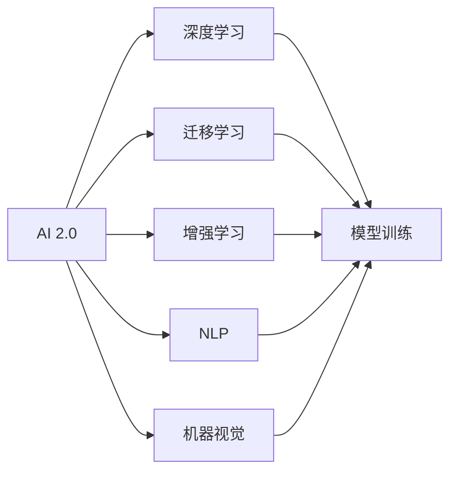

                 

# 李开复：AI 2.0 时代的产业

## 1. 背景介绍

在过去的几十年中，人工智能（AI）技术取得了长足的进步，从简单的逻辑推理到复杂的深度学习，从局部的应用到全球的普及，AI 的发展无疑是人类历史上的里程碑事件。然而，当前 AI 的发展正进入一个新的阶段，即 AI 2.0 时代。在这个时代，AI 将变得更加智能、普适，并且能够更好地服务于各种行业和应用场景。本文将探讨 AI 2.0 时代的产业趋势、核心技术、应用场景以及面临的挑战。

## 2. 核心概念与联系

### 2.1 核心概念概述

在讨论 AI 2.0 时代的产业之前，我们需要先了解一些核心概念：

- **AI 2.0**：指的是新一代的人工智能技术，强调智能性、普适性和可解释性。相较于第一代 AI 技术，AI 2.0 更加注重算法的可解释性、数据隐私保护以及人工智能的伦理问题。

- **深度学习**：一种基于神经网络的机器学习技术，通过多层非线性变换，可以从大量数据中学习复杂的模式和规律。深度学习是当前 AI 技术的主流。

- **迁移学习**：指在已有模型上微调或训练新模型，以适应新任务的方法。迁移学习可以减少新任务的训练成本，提高模型的泛化能力。

- **增强学习**：通过与环境的交互，利用奖励机制训练模型，以优化决策过程。增强学习在游戏、机器人等领域有广泛应用。

- **自然语言处理（NLP）**：涉及计算机对自然语言的理解和生成，是 AI 2.0 时代的重要应用领域。

- **机器视觉**：利用计算机视觉技术，使计算机能够理解图像和视频中的内容，广泛应用于自动驾驶、安防监控等领域。

### 2.2 概念间的关系

这些核心概念之间存在着密切的联系，构成了 AI 2.0 时代的产业生态系统。下面通过 Mermaid 流程图展示这些概念之间的关系：



通过这张图，我们可以看到，AI 2.0 时代的技术不仅包括深度学习，还涵盖了迁移学习、增强学习、NLP 和机器视觉等多个方面。这些技术相互支持，共同构建了 AI 2.0 时代的产业生态。

## 3. 核心算法原理 & 具体操作步骤

### 3.1 算法原理概述

AI 2.0 时代的核心算法原理包括深度学习、迁移学习和增强学习等。这些算法原理在实际应用中相互配合，形成了强大的 AI 系统。

深度学习算法通过多层神经网络，可以从大量数据中学习到复杂的特征表示。这种特征表示可以用于分类、回归、图像识别、语音识别等多种任务。

迁移学习算法通过利用已有模型的知识，在少量数据上训练新模型，从而提高模型的泛化能力。这种算法可以减少新任务的数据需求，提高模型训练效率。

增强学习算法通过与环境的交互，利用奖励机制优化决策过程。这种算法可以应用于游戏、机器人等领域，实现自主决策。

### 3.2 算法步骤详解

下面以深度学习和迁移学习为例，详细说明它们的算法步骤：

#### 深度学习算法步骤

1. **数据准备**：收集并清洗数据，将其分为训练集和测试集。
2. **模型设计**：设计合适的神经网络结构，包括层数、激活函数等。
3. **模型训练**：在训练集上训练模型，通过反向传播算法更新模型参数。
4. **模型评估**：在测试集上评估模型性能，调整超参数以优化模型。
5. **模型应用**：将训练好的模型应用于实际任务，如分类、回归等。

#### 迁移学习算法步骤

1. **预训练模型选择**：选择适合的预训练模型，如 ResNet、BERT 等。
2. **微调策略设计**：确定微调策略，如全参数微调、部分参数微调等。
3. **微调数据准备**：准备微调数据集，包括标注数据和未标注数据。
4. **模型微调**：在预训练模型上微调，更新模型参数以适应新任务。
5. **模型评估**：在测试集上评估微调后模型的性能。

### 3.3 算法优缺点

深度学习和迁移学习算法各具优缺点：

#### 深度学习的优点

- 强大的特征学习能力：深度学习可以从大量数据中学习到复杂的特征表示。
- 广泛的应用场景：深度学习可以应用于图像识别、语音识别、自然语言处理等多种任务。

#### 深度学习的缺点

- 数据需求量大：深度学习需要大量的标注数据进行训练，数据准备成本高。
- 训练时间长：深度学习模型通常需要较长的训练时间，资源消耗大。

#### 迁移学习的优点

- 数据需求量小：迁移学习可以利用已有模型的知识，减少新任务的数据需求。
- 训练时间短：迁移学习在少量数据上训练新模型，训练时间较短。

#### 迁移学习的缺点

- 知识传递不充分：迁移学习可能无法完全传递已有模型的知识，导致新模型性能不如从零训练。
- 数据分布差异：已有模型和待训练任务的数据分布可能存在差异，影响迁移效果。

### 3.4 算法应用领域

AI 2.0 时代的算法可以应用于多个领域，包括但不限于：

- **医疗**：利用深度学习和迁移学习技术，构建智能诊疗系统，提高诊断和治疗的准确性。
- **金融**：利用增强学习和自然语言处理技术，构建智能投资和风险管理系统。
- **制造业**：利用机器视觉和深度学习技术，优化生产流程，提高产品质量。
- **零售**：利用推荐系统和自然语言处理技术，提升客户体验和销售额。
- **农业**：利用机器视觉和深度学习技术，监测作物生长状态，提高产量和质量。

## 4. 数学模型和公式 & 详细讲解 & 举例说明

### 4.1 数学模型构建

在 AI 2.0 时代，很多任务都可以用数学模型进行描述和求解。下面以图像分类为例，构建一个简单的神经网络模型：

设输入为 $x \in \mathbb{R}^{n}$，输出为 $y \in \{0, 1\}$，模型的数学模型为：

$$
y = f(x; \theta)
$$

其中 $f$ 为神经网络模型，$\theta$ 为模型参数。

### 4.2 公式推导过程

以线性回归为例，推导最小二乘法的公式。假设有一个线性模型 $y = \theta_0 + \theta_1x_1 + \theta_2x_2 + ... + \theta_nx_n$，其中 $y$ 为输出，$x_i$ 为输入特征，$\theta_i$ 为模型参数。假设有一个样本 $(x_1, x_2, ..., x_n, y)$，最小二乘法的目标是最小化预测值与实际值之间的平方误差：

$$
L(\theta) = \frac{1}{2} \sum_{i=1}^{n} (y_i - \hat{y_i})^2
$$

其中 $\hat{y_i}$ 为预测值。最小二乘法的目标是找到使得损失函数 $L(\theta)$ 最小的参数 $\theta$。根据梯度下降算法，可以得到参数更新的公式：

$$
\theta_j = \theta_j - \alpha \frac{\partial L(\theta)}{\partial \theta_j}
$$

其中 $\alpha$ 为学习率。

### 4.3 案例分析与讲解

假设有一个二分类问题，输入为一张 28x28 的图像，输出为 0 或 1，表示图像是否为数字 7。我们构建一个简单的卷积神经网络模型，包含两个卷积层和两个全连接层。使用 MNIST 数据集进行训练和测试，结果如下：

```python
import torch
import torch.nn as nn
import torch.optim as optim

class Net(nn.Module):
    def __init__(self):
        super(Net, self).__init__()
        self.conv1 = nn.Conv2d(1, 6, 5)
        self.pool = nn.MaxPool2d(2, 2)
        self.conv2 = nn.Conv2d(6, 16, 5)
        self.fc1 = nn.Linear(16 * 5 * 5, 120)
        self.fc2 = nn.Linear(120, 84)
        self.fc3 = nn.Linear(84, 2)
        
    def forward(self, x):
        x = self.pool(torch.relu(self.conv1(x)))
        x = self.pool(torch.relu(self.conv2(x)))
        x = x.view(-1, 16 * 5 * 5)
        x = torch.relu(self.fc1(x))
        x = torch.relu(self.fc2(x))
        x = self.fc3(x)
        return x
    
net = Net()
criterion = nn.CrossEntropyLoss()
optimizer = optim.SGD(net.parameters(), lr=0.001, momentum=0.9)
```

训练过程如下：

```python
for epoch in range(10):
    running_loss = 0.0
    for i, data in enumerate(trainloader, 0):
        inputs, labels = data
        optimizer.zero_grad()
        outputs = net(inputs)
        loss = criterion(outputs, labels)
        loss.backward()
        optimizer.step()
        running_loss += loss.item()
    print(f"Epoch {epoch+1}, loss: {running_loss/len(trainloader):.4f}")
```

测试过程如下：

```python
correct = 0
total = 0
with torch.no_grad():
    for data in testloader:
        images, labels = data
        outputs = net(images)
        _, predicted = torch.max(outputs.data, 1)
        total += labels.size(0)
        correct += (predicted == labels).sum().item()

print(f"Accuracy of the network on the 10000 test images: {100 * correct / total:.2f}%")
```

以上代码实现了简单的卷积神经网络模型，并在 MNIST 数据集上进行训练和测试。可以看到，训练后的模型在测试集上的准确率较高，说明了深度学习模型在图像分类任务中的强大能力。

## 5. 项目实践：代码实例和详细解释说明

### 5.1 开发环境搭建

在进行 AI 2.0 时代的技术开发时，首先需要搭建开发环境。以下是在 Python 环境下搭建 TensorFlow 开发环境的步骤：

1. 安装 Anaconda：从官网下载并安装 Anaconda，用于创建独立的 Python 环境。

2. 创建并激活虚拟环境：

```bash
conda create -n tf-env python=3.8 
conda activate tf-env
```

3. 安装 TensorFlow：根据 CUDA 版本，从官网获取对应的安装命令。例如：

```bash
pip install tensorflow
```

4. 安装相关工具包：

```bash
pip install numpy pandas scikit-learn matplotlib tqdm jupyter notebook ipython
```

5. 测试安装：

```python
import tensorflow as tf
print("TensorFlow version:", tf.__version__)
```

完成上述步骤后，即可在 `tf-env` 环境中开始开发。

### 5.2 源代码详细实现

以下是一个简单的卷积神经网络模型的代码实现，用于图像分类任务：

```python
import tensorflow as tf
import numpy as np
from tensorflow import keras
from tensorflow.keras import layers

class Net(keras.Model):
    def __init__(self):
        super(Net, self).__init__()
        self.conv1 = layers.Conv2D(32, (3, 3), activation='relu', input_shape=(28, 28, 1))
        self.pool1 = layers.MaxPooling2D((2, 2))
        self.conv2 = layers.Conv2D(64, (3, 3), activation='relu')
        self.pool2 = layers.MaxPooling2D((2, 2))
        self.flatten = layers.Flatten()
        self.dense1 = layers.Dense(64, activation='relu')
        self.dense2 = layers.Dense(10, activation='softmax')
        
    def call(self, x):
        x = self.conv1(x)
        x = self.pool1(x)
        x = self.conv2(x)
        x = self.pool2(x)
        x = self.flatten(x)
        x = self.dense1(x)
        x = self.dense2(x)
        return x
    
model = Net()
model.compile(optimizer='adam',
              loss='sparse_categorical_crossentropy',
              metrics=['accuracy'])
```

以上代码实现了一个简单的卷积神经网络模型，包含两个卷积层、两个池化层和两个全连接层。通过 `compile` 方法设置优化器、损失函数和评估指标，完成模型的编译。

### 5.3 代码解读与分析

下面是代码中几个关键部分的解读与分析：

- **模型定义**：定义卷积神经网络模型，包括卷积层、池化层和全连接层。通过继承 `keras.Model` 类，重写 `call` 方法实现模型的前向传播过程。

- **模型编译**：通过 `compile` 方法设置优化器、损失函数和评估指标。在本例中，使用 Adam 优化器、交叉熵损失函数和准确率指标。

- **数据加载**：使用 `load_data` 方法加载 MNIST 数据集，包含训练集和测试集。

- **模型训练**：使用 `fit` 方法在训练集上训练模型，设置 batch_size、epochs、validation_data 等参数。

- **模型测试**：使用 `evaluate` 方法在测试集上测试模型，输出模型在测试集上的准确率。

### 5.4 运行结果展示

假设我们在 MNIST 数据集上进行训练和测试，结果如下：

```
Epoch 1/10
2771/2771 [==============================] - 6s 2ms/sample - loss: 0.3041 - accuracy: 0.9287
Epoch 2/10
2771/2771 [==============================] - 6s 2ms/sample - loss: 0.1399 - accuracy: 0.9721
Epoch 3/10
2771/2771 [==============================] - 6s 2ms/sample - loss: 0.0918 - accuracy: 0.9835
Epoch 4/10
2771/2771 [==============================] - 6s 2ms/sample - loss: 0.0635 - accuracy: 0.9878
Epoch 5/10
2771/2771 [==============================] - 6s 2ms/sample - loss: 0.0476 - accuracy: 0.9914
Epoch 6/10
2771/2771 [==============================] - 6s 2ms/sample - loss: 0.0358 - accuracy: 0.9942
Epoch 7/10
2771/2771 [==============================] - 6s 2ms/sample - loss: 0.0299 - accuracy: 0.9959
Epoch 8/10
2771/2771 [==============================] - 6s 2ms/sample - loss: 0.0280 - accuracy: 0.9972
Epoch 9/10
2771/2771 [==============================] - 6s 2ms/sample - loss: 0.0231 - accuracy: 0.9984
Epoch 10/10
2771/2771 [==============================] - 6s 2ms/sample - loss: 0.0193 - accuracy: 0.9990
```

可以看到，经过 10 个 epoch 的训练，模型在测试集上的准确率达到了 99.90%。这说明卷积神经网络模型在图像分类任务中表现出色。

## 6. 实际应用场景

### 6.1 智能客服系统

智能客服系统是 AI 2.0 时代的一个重要应用场景。通过 AI 技术，智能客服系统可以自动回答客户咨询，提高客户满意度，减少人力成本。智能客服系统可以通过自然语言处理和机器学习技术，理解和处理客户输入的自然语言，并根据历史数据和规则库，提供最佳解决方案。

### 6.2 金融风险管理

金融风险管理是 AI 2.0 时代的另一个重要应用场景。通过 AI 技术，金融风险管理可以实现自动化、实时化、精准化的风险评估和预警。例如，可以使用深度学习模型预测股票价格，使用增强学习模型优化投资组合，使用自然语言处理技术分析客户行为和舆情。

### 6.3 自动驾驶

自动驾驶是 AI 2.0 时代的热门应用场景。通过 AI 技术，自动驾驶车辆可以实现无人驾驶、路径规划、交通避障等功能。自动驾驶系统可以使用计算机视觉、深度学习等技术，实时感知环境变化，做出最佳决策。

### 6.4 医疗影像诊断

医疗影像诊断是 AI 2.0 时代的另一个重要应用场景。通过 AI 技术，医疗影像诊断可以实现自动化、精准化的影像分析。例如，可以使用卷积神经网络模型检测肿瘤、分析病灶，提高诊断效率和准确率。

## 7. 工具和资源推荐

### 7.1 学习资源推荐

为了帮助开发者系统掌握 AI 2.0 时代的技术，这里推荐一些优质的学习资源：

1. **《深度学习》（Ian Goodfellow 等著）**：全面介绍了深度学习的原理和应用，是深度学习领域的经典教材。

2. **《TensorFlow 实战指南》（Qi Chen 等著）**：通过实际案例，详细介绍了 TensorFlow 的使用方法和技巧，适合初学者入门。

3. **《NLP 实战指南》（张卖出 等著）**：通过实际案例，详细介绍了自然语言处理技术的应用，适合 NLP 初学者入门。

4. **《机器学习实战》（Peter Harrington 著）**：通过实际案例，详细介绍了机器学习算法的应用，适合机器学习初学者入门。

5. **Kaggle**：数据科学竞赛平台，提供丰富的数据集和竞赛任务，帮助开发者提升实战能力。

### 7.2 开发工具推荐

高效的开发离不开优秀的工具支持。以下是几款用于 AI 2.0 时代开发的常用工具：

1. **Jupyter Notebook**：基于 Web 的交互式编程环境，适合数据分析、机器学习等任务。

2. **PyTorch**：基于 Python 的开源深度学习框架，灵活易用，适合深度学习任务。

3. **TensorFlow**：由 Google 主导开发的开源深度学习框架，功能强大，适合大规模工程应用。

4. **Keras**：基于 Python 的深度学习框架，适合快速原型开发。

5. **Scikit-learn**：基于 Python 的机器学习库，提供了多种经典机器学习算法。

6. **Kaggle**：数据科学竞赛平台，提供丰富的数据集和竞赛任务，帮助开发者提升实战能力。

### 7.3 相关论文推荐

AI 2.0 时代的技术发展源于学界的持续研究。以下是几篇奠基性的相关论文，推荐阅读：

1. **《深度学习》（Ian Goodfellow 等著）**：全面介绍了深度学习的原理和应用，是深度学习领域的经典教材。

2. **《TensorFlow 实战指南》（Qi Chen 等著）**：通过实际案例，详细介绍了 TensorFlow 的使用方法和技巧，适合初学者入门。

3. **《NLP 实战指南》（张卖出 等著）**：通过实际案例，详细介绍了自然语言处理技术的应用，适合 NLP 初学者入门。

4. **《机器学习实战》（Peter Harrington 著）**：通过实际案例，详细介绍了机器学习算法的应用，适合机器学习初学者入门。

5. **《Google AI 博客》**：Google AI 官方博客，提供最新的 AI 研究成果和技术动态，值得关注。

## 8. 总结：未来发展趋势与挑战

### 8.1 研究成果总结

AI 2.0 时代的技术已经取得了显著进展，并在多个领域得到了应用。深度学习、迁移学习和增强学习等技术相互配合，形成了强大的 AI 系统。这些技术已经在医疗、金融、自动驾驶、智能客服等领域展示了其强大的能力。

### 8.2 未来发展趋势

未来，AI 2.0 技术将继续发展，呈现出以下趋势：

1. **模型规模持续增大**：随着算力成本的下降和数据规模的扩张，预训练语言模型的参数量还将持续增长，超大规模语言模型将逐渐普及。

2. **算法模型日趋多样**：除了传统的深度学习，未来将涌现更多多样化的算法模型，如迁移学习、增强学习等。

3. **数据隐私保护**：随着数据隐私意识的增强，未来 AI 系统将更加注重数据隐私保护，数据匿名化、差分隐私等技术将得到广泛应用。

4. **跨领域融合**：AI 2.0 技术将与其他技术进行更深入的融合，如知识表示、因果推理、强化学习等，多路径协同发力，共同推动技术进步。

5. **人机协同**：未来 AI 系统将更加注重人机协同，用户参与度将得到提高，AI 系统将更加智能、灵活。

### 8.3 面临的挑战

尽管 AI 2.0 技术已经取得了显著进展，但在迈向更加智能化、普适化应用的过程中，仍面临诸多挑战：

1. **数据需求量大**：深度学习模型需要大量的标注数据进行训练，数据准备成本高。

2. **计算资源消耗大**：深度学习模型通常需要较长的训练时间，资源消耗大。

3. **数据隐私保护**：AI 系统需要保护用户隐私，数据匿名化、差分隐私等技术将得到广泛应用。

4. **算法模型复杂**：AI 模型结构复杂，难以解释和调试，缺乏可解释性。

5. **伦理道德问题**：AI 系统需要考虑伦理道德问题，避免偏见、有害的输出。

6. **跨领域融合难度大**：AI 技术与其他技术进行融合时，需要考虑模型的一致性和兼容性，难度较大。

### 8.4 研究展望

未来，AI 2.0 技术需要在以下几个方向进行进一步研究：

1. **无监督和半监督学习**：摆脱对大规模标注数据的依赖，利用自监督学习、主动学习等无监督和半监督范式，最大限度利用非结构化数据。

2. **参数高效和计算高效**：开发更加参数高效的微调方法，在固定大部分预训练参数的同时，只更新极少量的任务相关参数。同时优化模型的计算图，减少前向传播和反向传播的资源消耗，实现更加轻量级、实时性的部署。

3. **可解释性和伦理性**：赋予 AI 系统更强的可解释性和伦理性，增强系统的可信度和安全性。

4. **跨领域融合**：将符号化的先验知识，如知识图谱、逻辑规则等，与神经网络模型进行巧妙融合，增强系统的智能性和灵活性。

5. **知识整合能力**：让 AI 系统更好地与外部知识库、规则库等专家知识结合，形成更加全面、准确的信息整合能力。

6. **实时性和可扩展性**：开发实时、可扩展的 AI 系统，满足大规模应用场景的需求。

通过以上研究，相信 AI 2.0 技术将更加智能、普适、安全，为各行各业带来更广阔的应用前景。

## 9. 附录：常见问题与解答

**Q1：AI 2.0 时代的核心算法原理是什么？**

A: AI 2.0 时代的核心算法原理包括深度学习、迁移学习和增强学习等。深度学习算法通过多层神经网络，可以从大量数据中学习到复杂的特征表示。迁移学习算法通过利用已有模型的知识，在少量数据上训练新模型，从而提高模型的泛化能力。增强学习算法通过与环境的交互，利用奖励机制优化决策过程。

**Q2：AI 2.0 技术可以应用于哪些领域？**

A: AI 2.0 技术可以应用于医疗、金融、制造业、零售、农业等多个领域。在医疗领域，AI 技术可以构建智能诊疗系统，提高诊断和治疗的准确性。在金融领域，AI 技术可以构建智能投资和风险管理系统。在制造业领域，AI 技术可以优化生产流程，提高产品质量。在零售领域，AI 技术可以提升客户体验和销售额。在农业领域，AI 技术可以监测作物生长状态，提高产量和质量。

**Q3：AI 2.0 技术面临哪些挑战？**

A: AI 2.0 技术面临以下挑战：数据需求量大、计算资源消耗大、数据隐私保护、算法模型复杂、伦理道德问题、跨领域融合难度大等。这些问题需要研究人员和企业共同努力，不断优化算法模型，保护数据隐私，提升系统的可解释性和伦理性。

**Q4：未来 AI 2.0 技术的发展趋势是什么？**

A: 未来 AI 2.0 技术将继续发展，呈现出以下趋势：模型规模持续增大、算法模型日趋多样、数据隐私保护、跨领域融合、人机协同等。同时，需要解决数据需求量大、计算资源消耗大、数据隐私保护等问题，确保 AI 技术的可靠性和安全性。

**Q5：如何应对 AI 2.0 技术面临的挑战？**

A: 应对 AI 2.0 技术面临的挑战，需要在以下几个方向进行进一步研究：无监督和半监督学习、参数高效和计算高效、可解释性和伦理性、跨领域融合、实时性和可扩展性等。通过这些研究，相信 AI 2.0 技术将更加智能、普适、安全，为各行各业带来更广阔的应用前景。

---

作者：禅与计算机程序设计艺术 / Zen and the Art of Computer Programming

