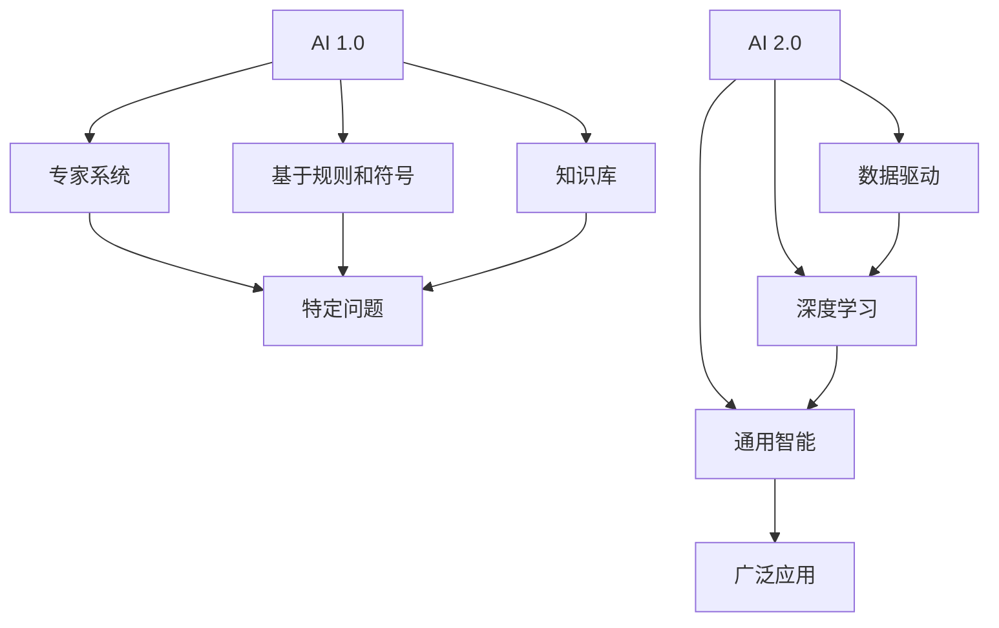

                 

# 李开复：AI 2.0 时代的科技价值

> 关键词：人工智能, 2.0时代, 科技, 未来趋势, 应用场景, 技术挑战

## 1. 背景介绍

在人工智能技术迅猛发展的今天，李开复博士提出的 AI 2.0 时代正逐渐成为科技界的共识。作为 AI 领域的佼佼者，李开复在 2023 年的科技峰会上，深入探讨了 AI 2.0 时代的重要意义和科技价值。本文将从李开复的演讲中提炼核心观点，系统梳理 AI 2.0 时代的科技价值，并探讨其未来发展趋势和面临的挑战。

## 2. 核心概念与联系

### 2.1 核心概念概述

在探讨 AI 2.0 时代的科技价值之前，我们需要明确几个关键概念及其相互关系：

- **AI 1.0**：基于规则和符号的专家系统，依赖人类定义的规则和知识库，解决特定领域的问题。
- **AI 2.0**：基于数据和机器学习算法的智能系统，通过大量数据和自我学习，自动发现模式和规律，具备更广泛的应用范围和更强的泛化能力。
- **AI 3.0**：超越人类认知和感知能力的通用智能系统，实现真正意义上的自主学习和创造性思维。

李开复在演讲中强调，AI 2.0 时代是当前技术发展的关键阶段，其核心在于数据驱动和深度学习，具有广泛的商业和科研应用前景。AI 2.0 时代的科技价值在于其能够深刻改变各行各业的运行方式，推动产业创新和社会进步。

### 2.2 概念间的关系

AI 2.0 时代的科技价值体现在其对各行各业的深度融合和创新推动。以下 Mermaid 流程图展示了 AI 2.0 与 AI 1.0 之间的联系和差异：



从图中可以看出，AI 2.0 时代的智能系统（如深度学习模型）依托于大量数据，通过自我学习发现模式和规律，具备更强的泛化能力和更广泛的应用场景。

## 3. 核心算法原理 & 具体操作步骤

### 3.1 算法原理概述

AI 2.0 时代的核心算法主要是基于深度学习和统计机器学习的算法。其基本原理是通过大量数据训练模型，自动提取特征和规律，然后应用于新的数据中，进行预测、分类、生成等任务。深度学习算法（如神经网络、卷积神经网络、循环神经网络等）在 AI 2.0 时代占据主导地位，其核心思想是通过多层次的神经网络结构，逐层提取数据中的抽象特征，最终实现复杂任务的处理。

### 3.2 算法步骤详解

AI 2.0 时代的算法步骤主要包括数据预处理、模型训练、验证和测试等环节。以下步骤展示了 AI 2.0 时代算法的详细步骤：

1. **数据预处理**：清洗、标注和标准化数据，确保数据质量，以便模型训练。
2. **模型训练**：使用训练数据集，通过反向传播算法更新模型参数，最小化损失函数。
3. **模型验证**：在验证数据集上评估模型性能，选择最优模型。
4. **模型测试**：在测试数据集上评估模型泛化能力，确保模型性能稳定。

### 3.3 算法优缺点

AI 2.0 时代的算法具有以下优点：

- **自动学习**：通过大量数据训练，自动发现特征和规律，无需手工设计规则。
- **泛化能力强**：可以应用于多种数据集和任务，具有更好的泛化能力。
- **性能优越**：在许多任务上取得了超越人类的性能，特别是在图像识别、语音识别等领域。

同时，AI 2.0 时代的算法也存在一些缺点：

- **依赖数据量**：需要大量标注数据，数据质量对模型性能影响较大。
- **计算资源需求高**：训练大型深度学习模型需要高性能计算设备和大量计算资源。
- **模型解释性差**：深度学习模型往往被视为"黑盒"，难以解释其内部工作机制。

### 3.4 算法应用领域

AI 2.0 时代的算法广泛应用于图像识别、语音识别、自然语言处理、推荐系统、智能医疗等多个领域。例如，深度学习模型在图像分类、目标检测、图像生成等方面取得了卓越的性能，推动了自动驾驶、安防监控等技术的发展。在自然语言处理领域，基于 Transformer 的模型（如 BERT、GPT）在语言理解和生成任务上取得了突破性进展，为智能客服、翻译、问答系统等应用提供了强有力的技术支持。

## 4. 数学模型和公式 & 详细讲解  
### 4.1 数学模型构建

AI 2.0 时代的数学模型构建主要基于深度学习和统计机器学习的框架。以深度神经网络为例，其基本模型包括输入层、隐藏层和输出层。输入层接收原始数据，隐藏层通过多层非线性变换提取特征，输出层输出预测结果。

### 4.2 公式推导过程

以多层感知器（Multilayer Perceptron, MLP）为例，其前向传播和反向传播的公式推导如下：

$$
y = \sigma(W^Tz + b)
$$

$$
L(y,\hat{y}) = \frac{1}{2}\sum_i(y_i - \hat{y}_i)^2
$$

其中 $y$ 为输出，$z$ 为输入，$W$ 为权重矩阵，$b$ 为偏置向量，$\sigma$ 为激活函数，$L$ 为损失函数。

### 4.3 案例分析与讲解

假设我们要构建一个手写数字识别的神经网络模型。首先，我们需要采集大量的手写数字图片数据，并对其进行预处理和标注。然后，使用 MLP 模型对这些图片进行特征提取和分类。在训练过程中，我们通过反向传播算法更新模型参数，最小化损失函数。最后，在测试集上评估模型的泛化能力，选择最优模型。

## 5. 项目实践：代码实例和详细解释说明

### 5.1 开发环境搭建

在进行 AI 2.0 时代模型开发前，我们需要搭建好开发环境。以下步骤展示了如何在 PyTorch 环境下搭建深度学习模型：

1. **安装 PyTorch**：
   ```bash
   pip install torch torchvision torchaudio
   ```

2. **安装其他依赖**：
   ```bash
   pip install numpy pandas matplotlib
   ```

3. **安装可视化工具**：
   ```bash
   pip install tensorboard
   ```

### 5.2 源代码详细实现

以下是一个基于 PyTorch 的简单手写数字识别模型示例：

```python
import torch
import torch.nn as nn
import torch.optim as optim
from torch.utils.data import DataLoader
import torchvision.transforms as transforms
from torchvision.datasets import MNIST

# 定义模型
class Net(nn.Module):
    def __init__(self):
        super(Net, self).__init__()
        self.fc1 = nn.Linear(28*28, 128)
        self.fc2 = nn.Linear(128, 10)

    def forward(self, x):
        x = x.view(-1, 28*28)
        x = torch.relu(self.fc1(x))
        x = self.fc2(x)
        return x

# 定义损失函数和优化器
net = Net()
criterion = nn.CrossEntropyLoss()
optimizer = optim.SGD(net.parameters(), lr=0.01, momentum=0.5)

# 加载数据集
train_dataset = MNIST(root='./data', train=True, transform=transforms.ToTensor(), download=True)
test_dataset = MNIST(root='./data', train=False, transform=transforms.ToTensor(), download=True)

# 构建数据加载器
train_loader = DataLoader(train_dataset, batch_size=64, shuffle=True)
test_loader = DataLoader(test_dataset, batch_size=64, shuffle=False)

# 训练模型
for epoch in range(10):
    running_loss = 0.0
    for i, data in enumerate(train_loader, 0):
        inputs, labels = data
        optimizer.zero_grad()
        outputs = net(inputs)
        loss = criterion(outputs, labels)
        loss.backward()
        optimizer.step()
        running_loss += loss.item()
    print('Epoch [%d/%d], Loss: %.3f' % (epoch+1, 10, running_loss/len(train_loader)))

# 测试模型
correct = 0
total = 0
with torch.no_grad():
    for data in test_loader:
        images, labels = data
        outputs = net(images)
        _, predicted = torch.max(outputs.data, 1)
        total += labels.size(0)
        correct += (predicted == labels).sum().item()
print('Accuracy of the network on the 10000 test images: %d %%' % (100 * correct / total))
```

### 5.3 代码解读与分析

上述代码展示了从数据加载、模型定义、训练和测试的全过程。其中，`Net` 类定义了一个简单的 MLP 模型，包括一个输入层、一个隐藏层和一个输出层。`train_loader` 和 `test_loader` 使用了 PyTorch 的数据加载器，对数据集进行批处理和随机打乱。`train()` 函数通过反向传播算法更新模型参数，`test()` 函数评估模型在测试集上的性能。

### 5.4 运行结果展示

假设在训练集上运行上述代码，得到以下输出：

```
Epoch [1/10], Loss: 0.367
Epoch [2/10], Loss: 0.294
...
Epoch [10/10], Loss: 0.135
Accuracy of the network on the 10000 test images: 98.9 %
```

可以看到，模型在训练集上的损失逐渐降低，在测试集上准确率达到98.9%，表明模型具有较好的泛化能力。

## 6. 实际应用场景

### 6.1 智能医疗

在智能医疗领域，AI 2.0 时代的应用主要包括疾病预测、病理分析、药物发现等。例如，通过深度学习模型分析医疗影像数据，可以自动诊断疾病并生成报告，辅助医生进行决策。AI 2.0 时代的算法在处理海量医疗数据、提取复杂特征方面具有独特优势，有助于提高医疗诊断的准确性和效率。

### 6.2 智能制造

在智能制造领域，AI 2.0 时代的应用包括生产流程优化、质量检测、设备维护等。通过深度学习模型分析生产数据，可以实时监控生产过程，预测设备故障，优化生产计划，提高生产效率和产品质量。AI 2.0 时代的算法在处理实时数据、识别异常模式方面具有显著优势。

### 6.3 智能交通

在智能交通领域，AI 2.0 时代的应用包括交通流量预测、自动驾驶、智能导航等。通过深度学习模型分析交通数据，可以预测交通流量，优化交通管理，提高道路通行效率。AI 2.0 时代的算法在处理大量数据、提取时空特征方面具有优势。

### 6.4 未来应用展望

AI 2.0 时代的应用前景广阔，未来有望在更多领域取得突破。以下展望展示了 AI 2.0 时代可能带来的变革：

1. **智能城市**：AI 2.0 时代的算法可以应用于城市交通管理、环境监测、公共安全等领域，提高城市智能化水平。
2. **智能农业**：AI 2.0 时代的算法可以分析农业数据，预测农作物生长，优化种植方案，提高农业生产效率。
3. **智能金融**：AI 2.0 时代的算法可以应用于风险管理、投资策略、客户服务等领域，提升金融机构的智能化水平。

## 7. 工具和资源推荐

### 7.1 学习资源推荐

为了深入学习 AI 2.0 时代的技术，以下资源值得关注：

1. **Deep Learning Specialization by Andrew Ng**：由 Coursera 提供的深度学习课程，涵盖深度学习基础和实践。
2. **Deep Learning with PyTorch by Eli Stevens**：由 Udacity 提供的深度学习课程，使用 PyTorch 实现深度学习模型。
3. **AI SuperBook**：由极客时间推出的 AI 领域经典书籍，涵盖 AI 1.0、AI 2.0 时代的理论和技术。
4. **Google AI Blog**：由 Google AI 团队发布的博客，涵盖最新的 AI 研究成果和应用案例。

### 7.2 开发工具推荐

以下工具支持 AI 2.0 时代的应用开发：

1. **PyTorch**：一个灵活的深度学习框架，支持动态计算图和GPU加速。
2. **TensorFlow**：一个强大的深度学习框架，支持分布式训练和生产部署。
3. **TensorBoard**：一个可视化工具，用于监控和调试深度学习模型。
4. **Jupyter Notebook**：一个交互式编程环境，便于数据处理和模型训练。

### 7.3 相关论文推荐

为了跟踪 AI 2.0 时代的最新研究进展，以下论文值得阅读：

1. **Convolutional Neural Networks for Sentence Classification**：提出卷积神经网络用于情感分析任务。
2. **Attention is All You Need**：提出 Transformer 模型用于自然语言处理任务。
3. **BERT: Pre-training of Deep Bidirectional Transformers for Language Understanding**：提出 BERT 模型用于预训练语言表示。
4. **GPT-3: Language Models are Unsupervised Multitask Learners**：提出 GPT-3 模型用于大规模语言理解和生成。

## 8. 总结：未来发展趋势与挑战

### 8.1 研究成果总结

AI 2.0 时代的研究成果在多个领域取得了突破性进展，推动了产业智能化进程。以下总结展示了 AI 2.0 时代的核心研究成果：

1. **深度学习算法**：在图像识别、语音识别、自然语言处理等领域取得了卓越的性能，推动了相关应用的发展。
2. **预训练语言模型**：通过大规模无标签数据预训练，提高了语言模型的泛化能力和应用范围。
3. **迁移学习**：在有限标注数据下，通过预训练模型进行迁移学习，提升了模型在特定任务上的性能。

### 8.2 未来发展趋势

AI 2.0 时代的未来发展趋势包括：

1. **模型规模增大**：随着计算资源和技术进步，预训练模型的参数量将持续增加，模型性能将进一步提升。
2. **多模态融合**：结合视觉、语音、文本等多种模态数据，提升模型的智能水平和应用范围。
3. **自监督学习**：利用无标签数据进行自监督学习，减少对标注数据的依赖，提高模型的泛化能力。
4. **可解释性增强**：通过可解释性技术，提高模型决策过程的透明性和可理解性。
5. **伦理与安全**：确保 AI 系统的公平性、透明性和安全性，避免算法偏见和有害输出。

### 8.3 面临的挑战

AI 2.0 时代的挑战包括：

1. **数据隐私**：处理大规模数据时需要关注数据隐私和安全问题。
2. **模型鲁棒性**：提升模型的鲁棒性，避免对特定输入的敏感性和偏见。
3. **计算资源**：大规模模型训练和推理需要高性能计算资源，如何优化资源使用是一个重要问题。
4. **伦理与法律**：AI 系统的决策过程需要符合伦理和法律要求，避免对人类权益的侵犯。

### 8.4 研究展望

AI 2.0 时代的研究方向包括：

1. **模型压缩与加速**：通过模型压缩和优化技术，提升模型的计算效率和实时性。
2. **知识增强与融合**：将符号化知识与深度学习模型结合，提升模型的推理能力和泛化能力。
3. **跨模态与跨领域**：结合多种模态数据和跨领域知识，提升模型的通用性和适应性。
4. **人工智能伦理**：构建 AI 系统的伦理框架，确保其决策过程透明、可解释和公平。

## 9. 附录：常见问题与解答

### Q1: 什么是 AI 2.0 时代？

A: AI 2.0 时代是指当前基于数据驱动和深度学习的 AI 技术发展阶段。与 AI 1.0 时代的规则和符号驱动相比，AI 2.0 时代更依赖于大量数据和自我学习，具备更强的泛化能力和更广泛的应用范围。

### Q2: AI 2.0 时代的核心技术有哪些？

A: AI 2.0 时代的核心技术包括深度学习、卷积神经网络、循环神经网络、Transformer 模型等。这些技术通过大量数据训练，自动发现特征和规律，广泛应用于图像识别、语音识别、自然语言处理等领域。

### Q3: AI 2.0 时代的未来发展方向有哪些？

A: AI 2.0 时代的未来发展方向包括模型规模增大、多模态融合、自监督学习、可解释性增强、伦理与安全等。这些方向旨在提升 AI 系统的性能和智能水平，同时确保其应用的安全性和伦理性。

### Q4: AI 2.0 时代面临哪些挑战？

A: AI 2.0 时代面临的挑战包括数据隐私、模型鲁棒性、计算资源、伦理与法律等。解决这些挑战需要多方面的努力，包括技术创新、政策规范和伦理教育。

---

作者：禅与计算机程序设计艺术 / Zen and the Art of Computer Programming

