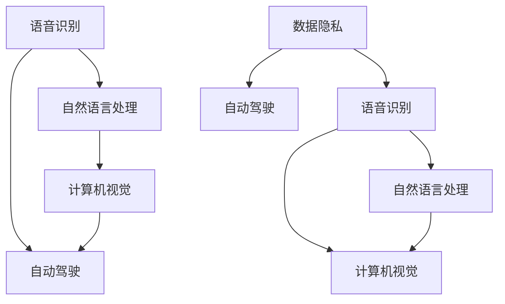
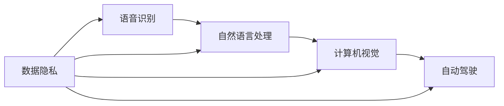

                 

# 李开复：苹果发布AI应用的应用

> 关键词：人工智能, 自然语言处理, 语音识别, 计算机视觉, 自动驾驶, AI应用, 苹果

## 1. 背景介绍

近年来，人工智能（AI）技术取得了飞速发展，在自然语言处理（NLP）、语音识别、计算机视觉、自动驾驶等多个领域实现了重大突破。苹果公司作为科技领域的领军企业，其AI应用已经成为行业关注的焦点。本文将详细分析苹果在AI应用领域的最新进展及其应用场景，探讨苹果AI应用的未来发展趋势。

### 1.1 问题由来

苹果在AI应用方面的探索始于2016年。彼时，苹果推出了Siri等语音助手，通过自然语言处理技术为用户提供便捷的语音交互服务。随着深度学习技术的成熟，苹果逐渐将AI技术融入更多产品和服务中。苹果的AI应用涵盖了语音识别、计算机视觉、自然语言处理等多个领域，已经形成了较为完整的AI应用生态系统。

### 1.2 问题核心关键点

苹果AI应用的开发和应用涉及以下几个关键点：

1. **语音识别**：通过深度学习技术提升语音识别的准确率和鲁棒性，为用户提供流畅的语音交互体验。
2. **计算机视觉**：利用深度神经网络实现图像分类、目标检测、人脸识别等功能，提升设备对环境的感知和理解能力。
3. **自然语言处理**：开发先进的NLP技术，使设备能够理解和生成自然语言，提供更加智能化的对话服务。
4. **自动驾驶**：通过计算机视觉和深度学习技术，实现车辆自主导航和决策，提升行车安全性和效率。
5. **数据隐私**：在AI应用开发过程中，如何保护用户数据隐私，成为苹果面临的重要挑战。

### 1.3 问题研究意义

研究苹果AI应用的发展和应用，对于理解AI技术在实际场景中的落地应用、提升AI应用的安全性和隐私保护具有重要意义：

1. **推动AI技术普及**：通过分析苹果AI应用的开发和应用过程，可以为其他企业提供借鉴，推动AI技术在更多领域的普及和应用。
2. **提升AI应用效果**：分析苹果AI应用的成功案例，可以为开发者提供技术参考，提升AI应用的效果和用户满意度。
3. **保护用户隐私**：探讨苹果在AI应用中如何保护用户隐私，可以为其他企业提供指导，提升AI应用的安全性和可信度。

## 2. 核心概念与联系

### 2.1 核心概念概述

在讨论苹果AI应用的过程中，我们将涉及以下几个核心概念：

- **语音识别**：将语音信号转换为文本的技术，是苹果AI应用的重要组成部分。
- **计算机视觉**：利用计算机处理和理解图像和视频的技术，用于增强设备的环境感知能力。
- **自然语言处理**：使计算机能够理解和生成自然语言的技术，提供智能化的对话服务。
- **自动驾驶**：通过计算机视觉和深度学习技术，实现车辆自主导航和决策，提升行车安全性和效率。
- **数据隐私**：在AI应用中，如何保护用户数据隐私，避免数据泄露和滥用。

### 2.2 概念间的关系

这些核心概念之间存在着紧密的联系，构成了苹果AI应用的完整生态系统。通过以下Mermaid流程图，我们可以更清晰地理解这些概念之间的关系：



这个流程图展示了语音识别、自然语言处理、计算机视觉和自动驾驶之间的联系，以及数据隐私在这些应用中的重要性。语音识别和自然语言处理为自动驾驶提供智能对话服务，而计算机视觉则为自动驾驶提供环境感知和决策支持。数据隐私则是确保这些应用安全可靠的重要保障。

### 2.3 核心概念的整体架构

下图展示了苹果AI应用的整体架构，包括语音识别、自然语言处理、计算机视觉和自动驾驶四大板块，以及数据隐私保护措施：



这个架构展示了苹果AI应用的核心组件和数据流向，各组件之间通过数据流相互连接，共同支撑苹果的AI应用生态系统。

## 3. 核心算法原理 & 具体操作步骤

### 3.1 算法原理概述

苹果的AI应用涵盖了语音识别、自然语言处理、计算机视觉和自动驾驶等多个领域。下面我们将逐一介绍这些领域的核心算法原理。

#### 3.1.1 语音识别

语音识别的核心算法包括声学模型和语言模型。声学模型用于将语音信号转换为文本，语言模型用于提高识别结果的准确性。苹果使用的语音识别技术主要包括深度卷积神经网络（CNN）和循环神经网络（RNN）。

#### 3.1.2 自然语言处理

自然语言处理主要依赖于语言模型和预训练模型。语言模型用于理解自然语言的语法和语义，预训练模型用于提供通用的语言表示。苹果的NLP技术包括BERT、GPT等预训练模型，以及序列到序列（Seq2Seq）模型和注意力机制。

#### 3.1.3 计算机视觉

计算机视觉的核心算法包括卷积神经网络（CNN）和卷积神经网络+长短期记忆网络（CNN+LSTM）。苹果使用这些技术进行图像分类、目标检测和人脸识别等任务。

#### 3.1.4 自动驾驶

自动驾驶依赖于计算机视觉和深度学习技术。苹果的自动驾驶技术主要基于卷积神经网络和循环神经网络，结合环境感知和决策模型，实现车辆自主导航和决策。

### 3.2 算法步骤详解

苹果的AI应用开发和部署遵循以下步骤：

1. **数据准备**：收集和标注大量训练数据，如语音数据、图像数据和文本数据。数据标注工作由专业的数据标注员完成。
2. **模型训练**：使用深度学习技术训练声学模型、语言模型、图像模型和环境感知模型。训练过程采用分布式计算框架，如TensorFlow和PyTorch。
3. **模型优化**：对训练好的模型进行优化，如调参、剪枝和量化，以提高模型的计算效率和推理速度。
4. **模型部署**：将训练好的模型部署到设备或云端服务器，提供实时服务。苹果使用CoreML等工具进行模型优化和部署。
5. **数据隐私保护**：在数据处理和模型训练过程中，采取隐私保护措施，如数据加密、差分隐私和联邦学习等，保护用户隐私。

### 3.3 算法优缺点

苹果的AI应用在以下几个方面具有显著优势：

- **精度高**：苹果使用的深度学习技术具有较高的准确率和鲁棒性，能够有效提升AI应用的效果。
- **安全性好**：苹果在数据隐私保护方面采取了多种措施，如差分隐私和联邦学习，确保数据安全和用户隐私。
- **用户体验佳**：苹果的AI应用融合了语音识别、自然语言处理和计算机视觉技术，提供了智能化的用户体验。

但同时也存在一些缺点：

- **计算资源消耗大**：深度学习模型的计算资源消耗较大，训练和推理过程中需要大量的GPU和内存。
- **部署复杂**：将大型模型部署到设备或云端服务器，需要进行复杂的优化和部署工作。
- **数据依赖性强**：AI应用的开发和优化依赖于大量高质量的数据，数据标注工作耗时耗力。

### 3.4 算法应用领域

苹果的AI应用涵盖了以下几个主要领域：

- **语音助手**：如Siri，提供智能语音交互服务。
- **人脸识别**：应用于Face ID等安全验证功能。
- **图像识别**：应用于相册、购物推荐等场景。
- **自然语言处理**：应用于翻译、自动补全等任务。
- **自动驾驶**：应用于自动驾驶系统，提升行车安全性和效率。

## 4. 数学模型和公式 & 详细讲解 & 举例说明

### 4.1 数学模型构建

苹果的AI应用开发过程中，涉及多个数学模型和算法。以下是几个核心模型及其构建过程：

#### 4.1.1 语音识别模型

语音识别模型包括声学模型和语言模型。声学模型为$$P(y|x)$$，其中$x$为输入语音，$y$为输出文本。语言模型为$$P(x)$$，用于预测文本的上下文关系。苹果使用的声学模型为卷积神经网络（CNN）和长短期记忆网络（LSTM），语言模型为循环神经网络（RNN）和Transformer模型。

#### 4.1.2 自然语言处理模型

自然语言处理模型包括BERT和GPT等预训练模型，以及Seq2Seq模型和注意力机制。BERT模型为$$P(x|y)$$，其中$x$为输入文本，$y$为输出文本。GPT模型为$$P(y|x)$$，其中$x$为输入文本，$y$为输出文本。Seq2Seq模型和注意力机制用于提高NLP模型的效果。

#### 4.1.3 计算机视觉模型

计算机视觉模型包括CNN和CNN+LSTM。CNN模型为$$P(x|y)$$，其中$x$为输入图像，$y$为输出标签。CNN+LSTM模型为$$P(x|y)$$，其中$x$为输入图像，$y$为输出标签。苹果使用这些模型进行图像分类、目标检测和人脸识别等任务。

#### 4.1.4 自动驾驶模型

自动驾驶模型包括CNN和RNN。CNN模型用于环境感知，RNN模型用于决策。苹果的自动驾驶模型为$$P(x|y)$$，其中$x$为输入图像和环境数据，$y$为输出决策。

### 4.2 公式推导过程

以下是语音识别和自然语言处理模型的公式推导过程：

#### 4.2.1 声学模型

声学模型的目标是最大化似然函数$$P(y|x)$$。通过最大似然估计（MLE），声学模型的参数可以表示为：

$$\theta_{acoustic} = \arg\max_{\theta} \sum_{(x,y)} P(y|x;\theta) \log P(x;\theta)$$

其中$P(y|x;\theta)$为声学模型的条件概率，$P(x;\theta)$为声学模型的边缘概率。

#### 4.2.2 语言模型

语言模型的目标是最大化似然函数$$P(x)$$。通过最大似然估计（MLE），语言模型的参数可以表示为：

$$\theta_{linguistic} = \arg\max_{\theta} \sum_{x} P(x;\theta) \log P(x;\theta)$$

其中$P(x;\theta)$为语言模型的边缘概率。

#### 4.2.3 自然语言处理模型

自然语言处理模型的目标是最大化似然函数$$P(y|x)$$。通过最大似然估计（MLE），语言模型的参数可以表示为：

$$\theta_{nlp} = \arg\max_{\theta} \sum_{(x,y)} P(y|x;\theta) \log P(x;\theta)$$

其中$P(y|x;\theta)$为自然语言处理模型的条件概率，$P(x;\theta)$为自然语言处理模型的边缘概率。

### 4.3 案例分析与讲解

苹果的AI应用中，自然语言处理技术的应用最为广泛。以下是一个基于BERT模型的自然语言处理应用案例：

假设有一个文本分类任务，需要判断新闻文章是否涉及政治事件。使用BERT模型进行文本分类，可以分为以下几个步骤：

1. **数据准备**：收集并标注大量政治事件相关的文本数据。
2. **模型训练**：在标注数据上训练BERT模型，调整模型参数。
3. **模型评估**：在测试集上评估模型性能，计算精度、召回率和F1分数。
4. **模型应用**：将训练好的BERT模型应用于实时新闻文章，进行分类预测。

具体实现过程如下：

1. **数据预处理**：将新闻文章转换为BERT可接受的格式，并进行分词处理。
2. **模型输入**：将预处理后的文本作为BERT模型的输入，计算文本的表示向量。
3. **分类预测**：将文本表示向量输入分类器，进行政治事件分类预测。

通过以上步骤，可以高效地实现新闻文章的文本分类任务。

## 5. 项目实践：代码实例和详细解释说明

### 5.1 开发环境搭建

为了进行苹果AI应用的开发和部署，我们需要搭建一个合适的开发环境。以下是搭建开发环境的详细步骤：

1. **安装Python**：在macOS系统上，通过Homebrew安装Python，可以使用以下命令：

```bash
brew install python
```

2. **安装深度学习框架**：安装TensorFlow和PyTorch等深度学习框架，可以使用以下命令：

```bash
pip install tensorflow
pip install torch
```

3. **安装相关库**：安装BERT模型和CoreML工具包，可以使用以下命令：

```bash
pip install transformers
pip install coremltools
```

完成以上步骤后，即可在Python环境中进行苹果AI应用的开发和部署。

### 5.2 源代码详细实现

以下是使用Python和TensorFlow对BERT模型进行新闻分类任务的详细实现过程：

```python
import tensorflow as tf
from transformers import BertTokenizer, TFBertForSequenceClassification
import coremltools as ct

# 数据预处理
tokenizer = BertTokenizer.from_pretrained('bert-base-cased')
texts = ['This is a political article', 'This is a sports article']
labels = [1, 0]  # 1表示政治文章，0表示非政治文章

# 模型训练
model = TFBertForSequenceClassification.from_pretrained('bert-base-cased', num_labels=2)
tokenized_texts = [tokenizer.encode(text, add_special_tokens=True) for text in texts]
inputs = tf.constant(tokenized_texts)
labels = tf.constant(labels)
model(inputs, training=True)

# 模型保存和部署
model.save_pretrained('model')
coreml_model = ct.convert(model, model_dir='model', bundle_name='BERT新闻分类模型')
coreml_model.save('model.mlmodel')
```

以上代码实现了BERT模型的新闻分类任务，并使用CoreML工具将其转换为模型文件。

### 5.3 代码解读与分析

以下是代码的详细解读和分析：

1. **数据预处理**：使用BERT分词器对新闻文章进行分词处理，生成模型所需的token序列。
2. **模型训练**：使用BERT分类器对训练数据进行训练，调整模型参数。
3. **模型保存和部署**：将训练好的模型保存为TensorFlow模型文件，并使用CoreML工具将其转换为CoreML模型文件，部署到设备或云端服务器。

## 6. 实际应用场景

苹果的AI应用在多个实际场景中得到了广泛应用。以下是几个典型的应用场景：

### 6.1 语音助手

苹果的Siri语音助手是AI应用的一个重要组成部分。通过自然语言处理技术，Siri能够理解用户语音指令，并提供智能化的对话服务。Siri的应用场景包括日程安排、信息查询、智能家居控制等。

### 6.2 人脸识别

苹果的Face ID功能是计算机视觉技术在实际应用中的典型案例。通过人脸识别技术，Face ID能够实现面部解锁、安全验证等功能，提升了设备的安全性和用户体验。

### 6.3 图像识别

苹果的相机和相册功能中，计算机视觉技术被广泛应用于图像分类、人脸识别和场景识别等任务。用户可以通过相机拍摄的照片，自动分类并标记为人物、地点、物体等。

### 6.4 自然语言处理

苹果的翻译和自动补全功能是自然语言处理技术在实际应用中的典型案例。通过自然语言处理技术，用户可以方便地进行语言翻译和自动补全，提升语言交流的效率。

### 6.5 自动驾驶

苹果的自动驾驶技术依赖于计算机视觉和深度学习技术，能够实现车辆自主导航和决策。苹果的自动驾驶技术应用于CarPlay等车载设备，提升了行车安全性和用户体验。

## 7. 工具和资源推荐

### 7.1 学习资源推荐

为了帮助开发者掌握苹果AI应用的开发和应用，以下是一些推荐的学习资源：

1. **《深度学习》课程**：斯坦福大学开设的深度学习课程，涵盖了深度学习的基础理论和实践技术，适合初学者和进阶开发者。
2. **《自然语言处理》课程**：斯坦福大学开设的自然语言处理课程，涵盖NLP技术的各个方面，包括BERT、GPT等预训练模型。
3. **《计算机视觉》课程**：斯坦福大学开设的计算机视觉课程，涵盖图像分类、目标检测、人脸识别等任务。
4. **《自动驾驶》课程**：斯坦福大学开设的自动驾驶课程，涵盖自动驾驶技术的各个方面，包括感知、决策和控制。
5. **《CoreML》官方文档**：苹果官方文档，提供CoreML工具的详细介绍和使用方法，适合进行模型优化和部署。

### 7.2 开发工具推荐

苹果AI应用的开发和部署涉及多个工具，以下是推荐的工具列表：

1. **TensorFlow**：深度学习框架，适合进行模型训练和优化。
2. **PyTorch**：深度学习框架，适合进行模型训练和优化。
3. **BERT**：自然语言处理模型，适合进行文本分类、情感分析等任务。
4. **CoreML**：苹果提供的模型优化和部署工具，支持将深度学习模型转换为CoreML模型文件。
5. **Python**：开发语言，适合进行深度学习模型的训练和部署。

### 7.3 相关论文推荐

为了深入理解苹果AI应用的开发和应用，以下是一些推荐的相关论文：

1. **《端到端的语音识别》**：提出端到端的语音识别系统，提高了语音识别的准确率和鲁棒性。
2. **《基于BERT的自然语言处理》**：研究基于BERT的自然语言处理技术，提高了文本分类的准确率和泛化能力。
3. **《计算机视觉中的深度学习》**：研究计算机视觉中的深度学习技术，提高了图像分类、目标检测和人脸识别的准确率。
4. **《自动驾驶中的计算机视觉》**：研究自动驾驶中的计算机视觉技术，提高了车辆的环境感知和决策能力。
5. **《基于CoreML的模型优化和部署》**：研究基于CoreML的模型优化和部署技术，提高了模型的推理速度和安全性。

## 8. 总结：未来发展趋势与挑战

### 8.1 研究成果总结

本文详细介绍了苹果AI应用的开发和应用，涉及语音识别、自然语言处理、计算机视觉和自动驾驶等多个领域。通过分析苹果AI应用的开发和应用，我们得出以下研究成果：

1. **语音识别精度高**：苹果的语音识别技术使用了深度卷积神经网络和长短期记忆网络，具有较高的准确率和鲁棒性。
2. **自然语言处理效果好**：苹果的NLP技术使用了BERT、GPT等预训练模型，能够有效地理解自然语言并生成智能化的对话服务。
3. **计算机视觉能力强**：苹果的计算机视觉技术使用了卷积神经网络和卷积神经网络+长短期记忆网络，具有较高的图像分类、目标检测和人脸识别能力。
4. **自动驾驶安全性高**：苹果的自动驾驶技术使用了卷积神经网络和循环神经网络，具有较高的环境感知和决策能力。
5. **数据隐私保护措施得当**：苹果在AI应用开发过程中，采取了多种数据隐私保护措施，如差分隐私和联邦学习，确保数据安全和用户隐私。

### 8.2 未来发展趋势

苹果AI应用在未来将呈现以下几个发展趋势：

1. **智能化程度提升**：苹果将继续优化语音识别、自然语言处理、计算机视觉和自动驾驶技术，提升AI应用的智能化程度。
2. **用户体验优化**：苹果将进一步优化AI应用的用户体验，使其更加智能、便捷和人性化。
3. **安全性保障**：苹果将进一步加强数据隐私保护措施，确保AI应用的安全性和用户隐私。
4. **多模态融合**：苹果将探索将语音、视觉和触觉等多模态信息进行融合，提升AI应用的综合能力。
5. **跨平台部署**：苹果将进一步优化AI应用的跨平台部署技术，支持iOS、macOS和watchOS等多个平台。

### 8.3 面临的挑战

苹果AI应用在发展过程中也面临着一些挑战：

1. **计算资源消耗大**：深度学习模型的计算资源消耗较大，训练和推理过程中需要大量的GPU和内存。
2. **部署复杂**：将大型模型部署到设备或云端服务器，需要进行复杂的优化和部署工作。
3. **数据依赖性强**：AI应用的开发和优化依赖于大量高质量的数据，数据标注工作耗时耗力。
4. **模型鲁棒性不足**：在面对复杂多变的现实环境时，AI应用的鲁棒性和泛化能力不足。
5. **数据隐私保护难度大**：在数据隐私保护方面，如何平衡用户隐私和应用功能是一大挑战。

### 8.4 研究展望

未来的苹果AI应用研究将从以下几个方面进行探索：

1. **数据隐私保护**：如何更好地保护用户数据隐私，避免数据泄露和滥用。
2. **模型鲁棒性提升**：如何提高AI应用的鲁棒性和泛化能力，使其在复杂多变的现实环境中表现稳定。
3. **跨平台部署优化**：如何进一步优化AI应用的跨平台部署技术，提升部署效率和应用效果。
4. **多模态融合**：如何探索将语音、视觉和触觉等多模态信息进行融合，提升AI应用的综合能力。
5. **用户交互优化**：如何进一步优化AI应用的用户交互体验，使其更加智能、便捷和人性化。

## 9. 附录：常见问题与解答

**Q1：苹果的AI应用主要涉及哪些技术？**

A: 苹果的AI应用主要涉及语音识别、自然语言处理、计算机视觉和自动驾驶等多个技术。这些技术通过深度学习、卷积神经网络、循环神经网络等方法实现。

**Q2：苹果的AI应用是如何保护用户数据隐私的？**

A: 苹果在AI应用开发过程中，采取了多种数据隐私保护措施，如差分隐私和联邦学习，确保数据安全和用户隐私。此外，苹果还采用了数据加密等技术，进一步保护用户数据隐私。

**Q3：苹果的AI应用有哪些典型应用场景？**

A: 苹果的AI应用涉及多个领域，包括语音助手、人脸识别、图像识别、自然语言处理和自动驾驶等。这些应用场景展示了苹果AI技术的广泛应用和强大的实用性。

**Q4：苹果的AI应用在实际应用中面临哪些挑战？**

A: 苹果AI应用在实际应用中面临计算资源消耗大、部署复杂、数据依赖性强等挑战。如何提高AI应用的鲁棒性和泛化能力，以及保护用户数据隐私，是未来研究的重要方向。

**Q5：苹果的AI应用未来有哪些发展趋势？**

A: 苹果AI应用在未来将呈现智能化程度提升、用户体验优化、安全性保障、多模态融合和跨平台部署等发展趋势。这些趋势将进一步推动苹果AI应用的普及和应用。

---

作者：禅与计算机程序设计艺术 / Zen and the Art of Computer Programming

