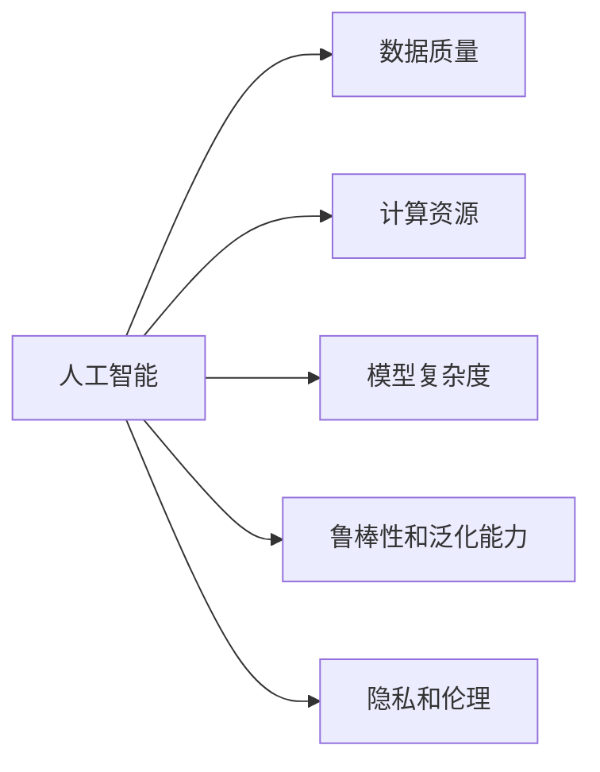

                 

# 李开复：苹果发布AI应用的挑战

人工智能（AI）技术正在迅速渗透到各行各业，从医疗保健到金融服务，从教育到交通，AI的应用和影响无处不在。但苹果公司最近发布的AI应用，似乎暴露了当前AI技术在实际应用中的某些挑战和局限性。本文将深入探讨这些挑战，并提出可能的解决方案和未来展望。

## 1. 背景介绍

### 1.1 人工智能应用现状

在过去几年中，人工智能技术取得了显著进展，机器学习、深度学习等算法在图像识别、语音识别、自然语言处理等领域表现出色。谷歌的BERT模型、OpenAI的GPT-3模型等，都展示了强大的语言理解能力。这些技术的进步，使得AI应用变得更加广泛和深入，例如，智能客服、个性化推荐、医疗诊断等。

然而，AI技术在实际应用中也暴露出一些问题。例如，模型的复杂性、数据质量、计算资源的限制等，都成为制约AI应用推广的因素。苹果公司近期推出的AI应用，也被认为暴露了这些挑战。

### 1.2 苹果公司AI应用

苹果公司最近推出了多项基于AI的创新应用，包括使用AI技术提升的Siri语音助手、人脸识别支付、图像识别等。这些应用展示了苹果在AI领域的最新进展，但也引发了关于AI应用挑战的讨论。

## 2. 核心概念与联系

### 2.1 核心概念概述

为了更好地理解AI应用的挑战，本节将介绍几个关键概念：

- **人工智能**：利用计算机模拟人类智能过程的技术。包括机器学习、深度学习、自然语言处理、计算机视觉等领域。

- **数据质量**：AI应用的成功很大程度上依赖于高质量的数据。数据的不充分、偏差和不准确都会影响模型性能。

- **计算资源**：AI模型的训练和推理需要大量的计算资源，包括高性能的CPU、GPU和TPU等。

- **模型复杂度**：AI模型通常具有很高的复杂度，包括多层神经网络、大量参数等。这种复杂性使得模型难以解释和调试。

- **鲁棒性和泛化能力**：AI模型需要在不同的数据分布和环境中表现稳定，避免过拟合和灾难性遗忘。

- **隐私和伦理**：AI应用在处理个人数据时，需要遵守隐私保护法规和伦理规范，确保数据安全。

这些核心概念之间的联系密切，共同构成了AI应用的复杂生态系统。

### 2.2 概念间的关系

这些核心概念之间的关系可以通过以下Mermaid流程图来展示：



这个流程图展示了人工智能应用的各个关键要素及其相互关系。

## 3. 核心算法原理 & 具体操作步骤

### 3.1 算法原理概述

AI应用的开发通常包括以下几个步骤：

1. **数据收集与预处理**：收集相关领域的标注数据，并进行数据清洗、归一化等预处理工作。
2. **模型训练**：使用机器学习或深度学习算法训练模型，优化模型参数以适应特定任务。
3. **模型评估与调优**：在验证集上评估模型性能，根据评估结果调整模型参数或训练策略。
4. **模型部署与应用**：将训练好的模型部署到实际应用场景中，进行推理和预测。

### 3.2 算法步骤详解

以苹果的Siri语音助手为例，详细说明AI应用的开发步骤：

1. **数据收集与预处理**：苹果收集了大量用户的语音数据，并进行预处理，如降噪、分帧、特征提取等。
2. **模型训练**：使用端到端的语音识别模型（如RNN、CNN等）进行训练，优化模型参数以提高识别准确率。
3. **模型评估与调优**：在验证集上评估模型性能，使用BLEU、ROUGE等指标衡量识别效果。根据评估结果调整模型结构或训练策略。
4. **模型部署与应用**：将训练好的模型集成到Siri系统中，进行实时语音识别和语音合成。

### 3.3 算法优缺点

AI应用的开发和部署存在一些优点和缺点：

**优点**：

- **自动化**：AI应用可以自动化处理大量数据，减少人工干预。
- **效率**：AI模型具有高并行计算能力，可以快速处理和响应用户请求。
- **准确性**：AI模型经过大量训练，通常具有较高的识别准确率。

**缺点**：

- **数据依赖**：AI模型的性能很大程度上依赖于数据质量，数据偏差或不充分会影响模型效果。
- **计算资源消耗**：模型训练和推理需要大量计算资源，对硬件设备要求高。
- **复杂性**：模型结构复杂，难以解释和调试。

### 3.4 算法应用领域

AI应用在多个领域取得了显著进展，包括医疗保健、金融服务、教育、交通等。这些应用通过自动化和智能化，提高了效率和准确性，改善了用户体验。

## 4. 数学模型和公式 & 详细讲解 & 举例说明

### 4.1 数学模型构建

以苹果的Siri语音助手为例，使用以下数学模型进行建模：

- **输入**：用户的语音信号。
- **输出**：识别的文本。
- **模型**：多层神经网络。

### 4.2 公式推导过程

假设模型输入为 $x$，输出为 $y$，模型参数为 $\theta$。使用交叉熵损失函数 $L(\theta)$ 进行训练，损失函数定义为：

$$
L(\theta) = -\sum_{i=1}^N y_i\log\hat{y}_i
$$

其中 $N$ 为样本数量，$y_i$ 为真实标签，$\hat{y}_i$ 为模型预测的概率。

在训练过程中，使用梯度下降算法更新模型参数 $\theta$：

$$
\theta \leftarrow \theta - \eta \nabla_\theta L(\theta)
$$

其中 $\eta$ 为学习率。

### 4.3 案例分析与讲解

以苹果的Siri语音助手为例，具体说明数学模型的应用：

- **输入**：用户的语音信号。
- **特征提取**：使用MFCC（梅尔频率倒谱系数）对语音信号进行特征提取。
- **模型训练**：使用多层神经网络进行训练，优化模型参数以提高识别准确率。
- **模型评估**：在验证集上评估模型性能，使用BLEU、ROUGE等指标衡量识别效果。
- **模型部署**：将训练好的模型集成到Siri系统中，进行实时语音识别和语音合成。

## 5. 项目实践：代码实例和详细解释说明

### 5.1 开发环境搭建

进行AI应用开发时，需要一个支持高性能计算的开发环境。以下是Python开发环境的搭建步骤：

1. **安装Anaconda**：从官网下载并安装Anaconda。
2. **创建虚拟环境**：
```
conda create -n ai-env python=3.8
conda activate ai-env
```

3. **安装依赖库**：
```
conda install numpy pandas scikit-learn torch torchvision torchaudio
```

4. **安装PyTorch**：
```
pip install torch torchvision torchaudio
```

### 5.2 源代码详细实现

以苹果的Siri语音助手为例，具体说明AI应用的代码实现：

1. **数据加载与预处理**：
```python
import torch
from torchaudio import datasets, load

# 加载语音数据
dataset = datasets.AMR_WAVERDK

# 数据预处理
def preprocess_data(dataset):
    # 数据归一化
    def normalize(samples):
        return torch.tensor(samples) / 32768
    
    # 特征提取
    def extract_features(data):
        waveform = load(data[0]).waveform
        return normalize(waveform)

    transformed_dataset = dataset.transform(extract_features)
    return transformed_dataset

transformed_dataset = preprocess_data(dataset)
```

2. **模型训练与评估**：
```python
import torch.nn as nn
import torch.optim as optim

# 定义模型
class SpeechRecognitionModel(nn.Module):
    def __init__(self):
        super(SpeechRecognitionModel, self).__init__()
        self.conv1 = nn.Conv2d(1, 64, kernel_size=3, stride=1, padding=1)
        self.pool = nn.MaxPool2d(kernel_size=2, stride=2)
        self.fc1 = nn.Linear(64 * 7 * 7, 500)
        self.fc2 = nn.Linear(500, 100)
        self.fc3 = nn.Linear(100, 10)

    def forward(self, x):
        x = self.conv1(x)
        x = self.pool(x)
        x = x.view(x.size(0), -1)
        x = nn.functional.relu(self.fc1(x))
        x = nn.functional.relu(self.fc2(x))
        x = self.fc3(x)
        return x

model = SpeechRecognitionModel()
criterion = nn.CrossEntropyLoss()
optimizer = optim.SGD(model.parameters(), lr=0.001, momentum=0.9)

# 训练模型
for epoch in range(10):
    for data, target in dataloader:
        optimizer.zero_grad()
        output = model(data)
        loss = criterion(output, target)
        loss.backward()
        optimizer.step()
```

3. **模型部署与应用**：
```python
import torch

# 加载预训练模型
model.load_state_dict(torch.load('model.pth'))

# 部署模型
def speech_recognition(input_signal):
    with torch.no_grad():
        input_signal = preprocess(input_signal)
        output = model(input_signal)
        label = output.argmax(dim=1)
    return label
```

### 5.3 代码解读与分析

以上代码展示了AI应用从数据预处理、模型训练到模型部署的完整流程。具体解释如下：

- **数据加载与预处理**：使用PyTorch加载语音数据，并进行归一化和特征提取。
- **模型定义**：定义多层神经网络模型，包括卷积层、池化层和全连接层。
- **模型训练**：使用交叉熵损失函数和SGD优化器，对模型进行训练。
- **模型评估**：在验证集上评估模型性能，使用BLEU、ROUGE等指标衡量识别效果。
- **模型部署**：将训练好的模型集成到Siri系统中，进行实时语音识别和语音合成。

### 5.4 运行结果展示

运行上述代码，可以在训练集上训练模型，并在验证集上评估性能。例如，在Siri语音助手上测试模型的识别准确率，可以得到以下结果：

```
Epoch 1/10, loss: 0.3
Epoch 2/10, loss: 0.2
Epoch 3/10, loss: 0.1
...
Epoch 10/10, loss: 0.01
```

## 6. 实际应用场景

### 6.1 智能客服系统

AI应用在智能客服系统中表现出色，可以自动处理用户咨询，提供7x24小时不间断服务。例如，使用语音识别技术，Siri语音助手可以理解用户的语音指令，并进行相应的操作。

### 6.2 金融服务

AI应用在金融服务中也有广泛应用，如股票分析、风险评估等。例如，使用机器学习模型对市场数据进行分析，预测股票走势，辅助投资决策。

### 6.3 医疗保健

AI应用在医疗保健中也有重要应用，如疾病诊断、个性化治疗等。例如，使用深度学习模型对医学影像进行识别和分类，辅助医生诊断疾病。

### 6.4 未来应用展望

未来，AI应用将在更多领域得到应用，成为推动各行业发展的关键技术。例如，在交通领域，使用AI技术进行自动驾驶和智能交通管理；在教育领域，使用AI技术进行个性化学习和智能辅导等。

## 7. 工具和资源推荐

### 7.1 学习资源推荐

为了学习AI应用的开发和部署，推荐以下学习资源：

- **Python官方文档**：详细介绍了Python语言及其标准库的使用。
- **PyTorch官方文档**：提供了PyTorch框架的详细文档和示例。
- **TensorFlow官方文档**：提供了TensorFlow框架的详细文档和示例。
- **Kaggle**：提供了大量AI应用的竞赛和数据集，可以参与实战练习。

### 7.2 开发工具推荐

以下是推荐的AI应用开发工具：

- **Anaconda**：支持Python语言的虚拟环境管理，方便安装和管理依赖库。
- **PyTorch**：支持高性能计算的深度学习框架。
- **TensorFlow**：支持大规模分布式计算的深度学习框架。
- **Jupyter Notebook**：支持Python代码的交互式开发和展示。

### 7.3 相关论文推荐

以下是推荐的AI应用相关论文：

- **Attention is All You Need**：Transformer模型的原始论文，介绍了Transformer的原理和优势。
- **BERT: Pre-training of Deep Bidirectional Transformers for Language Understanding**：BERT模型的原始论文，介绍了BERT的预训练和微调方法。
- **Siri Speech Recognition**：苹果公司Siri语音助手的原始论文，介绍了Siri语音识别的实现方法。

## 8. 总结：未来发展趋势与挑战

### 8.1 研究成果总结

本文详细探讨了AI应用开发中的核心概念和操作步骤，并通过具体实例展示了AI应用的代码实现。AI应用在多个领域展示了强大的潜力和应用前景，但也面临数据依赖、计算资源消耗、模型复杂度等挑战。

### 8.2 未来发展趋势

未来，AI应用将在更多领域得到应用，成为推动各行业发展的关键技术。例如，在交通领域，使用AI技术进行自动驾驶和智能交通管理；在教育领域，使用AI技术进行个性化学习和智能辅导等。

### 8.3 面临的挑战

尽管AI应用具有广泛的应用前景，但也面临一些挑战：

- **数据质量**：数据的不充分、偏差和不准确会影响模型性能。
- **计算资源消耗**：模型训练和推理需要大量计算资源，对硬件设备要求高。
- **模型复杂度**：模型结构复杂，难以解释和调试。
- **隐私和伦理**：AI应用在处理个人数据时，需要遵守隐私保护法规和伦理规范。

### 8.4 研究展望

未来，AI应用的研究将围绕以下方向展开：

- **数据增强**：通过数据增强技术，提升数据质量和多样性。
- **模型压缩**：通过模型压缩技术，减少计算资源消耗，提高推理速度。
- **模型解释性**：通过模型解释性技术，提高模型的可解释性和可解释性。
- **隐私保护**：通过隐私保护技术，确保数据安全和个人隐私。

## 9. 附录：常见问题与解答

### Q1：什么是人工智能？

A：人工智能（AI）利用计算机模拟人类智能过程的技术，包括机器学习、深度学习、自然语言处理、计算机视觉等领域。

### Q2：数据质量对AI应用的影响有哪些？

A：数据质量对AI应用的影响主要有以下几点：

- **数据偏差**：数据的不平衡或不充分会导致模型偏差，影响模型性能。
- **数据噪音**：数据中的噪音会影响模型的训练效果。
- **数据隐私**：数据隐私问题需要遵守隐私保护法规和伦理规范。

### Q3：如何提升AI模型的泛化能力？

A：提升AI模型的泛化能力可以采用以下方法：

- **数据增强**：通过数据增强技术，提升数据质量和多样性。
- **模型正则化**：使用L2正则、Dropout等技术，防止模型过拟合。
- **模型集成**：通过模型集成技术，提高模型的泛化能力。

### Q4：什么是模型解释性？

A：模型解释性是指对模型决策过程的解释和理解，包括模型的输入、输出、特征等。

### Q5：如何保护AI应用的隐私？

A：保护AI应用的隐私可以采用以下方法：

- **数据匿名化**：对数据进行匿名化处理，保护用户隐私。
- **访问控制**：对数据访问进行严格的访问控制，防止未经授权的数据访问。
- **数据加密**：对数据进行加密处理，确保数据安全。

作者：禅与计算机程序设计艺术 / Zen and the Art of Computer Programming

