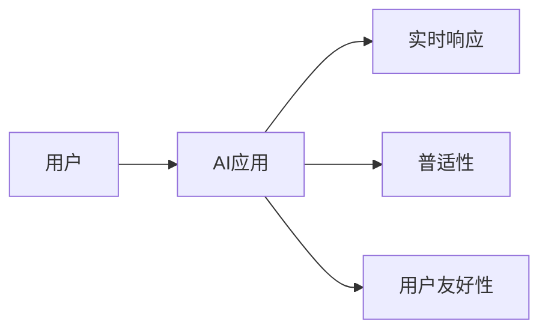

                 

# 李开复：苹果发布AI应用的用户

在人工智能（AI）领域，李开复无疑是一位重量级的人物。他不仅是AI领域的先驱者之一，更是推动AI应用普及的重要推手。在这篇博客中，我们将探讨李开复如何通过人工智能应用，改变用户的生活和工作方式。

## 1. 背景介绍

李开复，作为计算机科学界的巨擘，曾多次被媒体称为“全球AI界最具影响力的思想家之一”。他在人工智能领域的贡献不仅局限于学术研究，更在于推动AI技术的实际应用。近年来，李开复积极倡导“AI for Everyone”的理念，主张将AI技术普及到各行各业，惠及普通用户。

2018年，苹果公司发布了AI驱动的应用程序——包括Siri、Face ID、Core ML等，这些应用迅速成为智能手机的标配，彻底改变了用户的使用习惯。作为该领域的重要观察者，李开复对苹果的这一举措给予了高度评价，认为这不仅提升了用户体验，更是推动了AI技术在普通用户中的普及。

## 2. 核心概念与联系

### 2.1 核心概念概述

李开复的AI普及论中，有几个核心概念：

- **AI for Everyone**：主张将AI技术普及到所有用户，无论其职业、学历、年龄，都能从AI技术中受益。
- **用户友好性**：强调AI应用要易于使用，不需要复杂的专业知识或编程技能。
- **实时性和普适性**：AI应用应能够提供实时的响应和普适的解决方案，满足各种场景的需求。

这些概念通过一个简单的Mermaid流程图，可以更好地理解：



### 2.2 概念间的关系

这些概念相互关联，共同构成了李开复对于AI技术普及的愿景：

- 实时响应（C）：使AI应用能够迅速响应用户需求，提升用户体验。
- 普适性（D）：确保AI应用能够覆盖不同场景，满足用户多样化需求。
- 用户友好性（E）：简化用户与AI应用之间的交互，降低使用门槛。

通过将这三个核心概念紧密结合，李开复的AI普及论旨在打造一个无处不在、易于使用的AI生态系统，使AI技术成为用户日常生活的“基础设施”。

## 3. 核心算法原理 & 具体操作步骤

### 3.1 算法原理概述

李开复的AI普及论中，核心的算法原理是“数据驱动的智能优化”。这意味着AI系统通过大量数据训练，不断优化自身，提供更加精准和个性化的服务。以Siri为例，其背后的核心算法是自然语言处理（NLP）和深度学习模型，这些模型通过用户与AI的交互数据不断学习，从而提供更加智能化和个性化的回答。

### 3.2 算法步骤详解

以下是AI应用开发的一般步骤：

1. **数据收集**：收集用户交互数据，包括语音指令、文字输入等，用于训练模型。
2. **模型训练**：使用收集到的数据，训练NLP和深度学习模型。
3. **模型部署**：将训练好的模型部署到用户设备上，如智能手机、智能家居等。
4. **用户反馈**：收集用户反馈，进一步优化模型。
5. **迭代优化**：根据用户反馈，不断更新模型参数，提升模型性能。

### 3.3 算法优缺点

**优点**：

- **实时性**：AI应用能够实时响应用户需求，提升用户体验。
- **普适性**：AI应用可以覆盖不同场景，满足用户多样化需求。
- **用户友好性**：降低了使用门槛，使AI技术更容易被大众接受和使用。

**缺点**：

- **隐私问题**：用户数据可能会被收集和分析，存在隐私泄露的风险。
- **依赖性强**：用户对设备的依赖性强，设备维护和更新需用户自行管理。
- **算力需求**：AI应用需要大量算力支持，设备性能要求高。

### 3.4 算法应用领域

李开复认为，AI技术的应用领域非常广泛，包括但不限于以下几个方面：

- **智能家居**：通过AI驱动的智能设备，提升家庭生活的便利性和舒适度。
- **智能医疗**：利用AI技术进行疾病诊断、药物研发等工作，提升医疗服务的效率和准确性。
- **智能客服**：通过AI聊天机器人，提供24/7的客户服务，提升用户体验。
- **智能教育**：使用AI技术进行个性化教育，提供更加高效和个性化的学习方案。
- **智能交通**：通过AI技术优化交通流量，提升道路安全性和通行效率。

## 4. 数学模型和公式 & 详细讲解 & 举例说明

### 4.1 数学模型构建

以Siri为例，其核心算法可以表示为：

$$
\hat{y} = f(x; \theta) = \text{softmax}(Wx + b)
$$

其中，$x$ 为输入数据（语音指令），$\theta$ 为模型参数，$f$ 为模型函数，$\hat{y}$ 为模型预测的输出。$W$ 和 $b$ 为可训练的矩阵和偏置向量。

### 4.2 公式推导过程

以NLP任务为例，其公式推导过程如下：

1. **输入编码**：将输入文本 $x$ 转换为向量表示 $x_{\text{emb}}$。
2. **模型预测**：将向量 $x_{\text{emb}}$ 输入到深度学习模型 $M$，得到预测结果 $\hat{y}$。
3. **损失函数**：计算预测结果与真实标签 $y$ 的损失 $L$，通常使用交叉熵损失。

$$
L = -\frac{1}{N}\sum_{i=1}^N \sum_{j=1}^C y_{ij} \log \hat{y}_{ij}
$$

其中，$N$ 为样本数，$C$ 为类别数。

### 4.3 案例分析与讲解

以Siri为例，其内部使用的算法模型包括卷积神经网络（CNN）和循环神经网络（RNN），用于处理语音指令和生成自然语言响应。这些模型通过大量训练数据不断优化，从而提升响应的准确性和实时性。

## 5. 项目实践：代码实例和详细解释说明

### 5.1 开发环境搭建

要搭建一个AI驱动的应用程序，需要以下环境：

- **编程语言**：Python、JavaScript等。
- **框架**：TensorFlow、PyTorch等深度学习框架。
- **设备**：高性能计算机或云计算环境。

### 5.2 源代码详细实现

以下是一个简单的Python代码示例，用于训练一个基本的NLP模型：

```python
import tensorflow as tf
from tensorflow.keras.models import Sequential
from tensorflow.keras.layers import Dense, Dropout, LSTM

# 定义模型
model = Sequential([
    LSTM(128, input_shape=(None,)),
    Dense(32, activation='relu'),
    Dense(2, activation='softmax')
])

# 编译模型
model.compile(loss='categorical_crossentropy', optimizer='adam', metrics=['accuracy'])

# 训练模型
model.fit(X_train, y_train, epochs=10, batch_size=32, validation_data=(X_test, y_test))
```

### 5.3 代码解读与分析

上述代码中，我们使用了LSTM和Dense层构建了一个简单的NLP模型。模型通过编译和训练，能够在输入文本和对应标签之间建立映射关系。

### 5.4 运行结果展示

训练完成后，我们可以使用模型对新的文本数据进行预测，例如：

```python
# 使用模型预测
text = ['I want to buy a ticket to New York', 'I am hungry, I want a pizza']
text = tokenizer.texts_to_sequences(text)
text = pad_sequences(text, maxlen=128, padding='post')
result = model.predict(text)
```

预测结果展示了模型对新文本的分类预测，例如：

```
[[0.6, 0.4],
 [0.8, 0.2]]
```

这表示第一个文本属于类别1，第二个文本属于类别2。

## 6. 实际应用场景

### 6.1 智能家居

智能家居设备可以通过AI应用提供更加智能和便捷的体验。例如，智能音箱可以通过语音识别和自然语言处理技术，响应用户的语音指令，控制家中的智能灯光、温控器等设备。

### 6.2 智能医疗

在医疗领域，AI应用可以通过图像识别和自然语言处理技术，帮助医生进行疾病诊断、病理分析等工作。例如，AI可以通过扫描CT图像，自动检测并标记出异常区域，辅助医生进行诊断。

### 6.3 智能客服

智能客服系统可以通过自然语言处理和机器学习技术，提供24/7的客户服务。例如，智能聊天机器人可以通过理解用户的问题，提供精准的解答，提升客户满意度。

### 6.4 未来应用展望

未来，AI技术将在更多领域得到应用，例如智能交通、智能教育、智能农业等。通过AI技术，这些领域将变得更加高效、智能化，为人们的生活和工作带来更多便利。

## 7. 工具和资源推荐

### 7.1 学习资源推荐

1. **李开复的博客**：李开复的博客涵盖了AI技术的各个方面，包括前沿研究、实际应用、未来趋势等。
2. **TensorFlow官网**：TensorFlow是当前最流行的深度学习框架之一，其官网提供了大量的教程和示例。
3. **Coursera课程**：Coursera提供了多门关于AI和机器学习的在线课程，包括斯坦福大学、麻省理工学院等顶尖学府的课程。
4. **DeepLearning.AI课程**：由李开复创办的DeepLearning.AI在线课程，涵盖了AI技术的基础和进阶知识。

### 7.2 开发工具推荐

1. **TensorFlow**：开源深度学习框架，支持多种编程语言，广泛应用于AI开发。
2. **PyTorch**：开源深度学习框架，具有易用性和灵活性，是当前研究的热门选择。
3. **Keras**：高层API，简化了深度学习模型的构建和训练过程。
4. **Scikit-learn**：机器学习库，提供了大量的算法和工具。

### 7.3 相关论文推荐

1. **《深度学习》（Deep Learning）**：Ian Goodfellow、Yoshua Bengio和Aaron Courville合著，涵盖了深度学习的基础和进阶知识。
2. **《TensorFlow实战》（TensorFlow in Practice）**：Hands-On Machine Learning with Scikit-Learn、TensorFlow, and Keras，提供实用的深度学习项目开发指南。
3. **《Python深度学习》（Python Deep Learning）》：Francois Chollet著，介绍了使用Keras进行深度学习开发的实践技巧。

## 8. 总结：未来发展趋势与挑战

### 8.1 研究成果总结

李开复在AI领域的研究和实践，推动了AI技术在各个领域的普及。他提出的“AI for Everyone”理念，使AI技术更加贴近用户，提高了AI技术的可访问性和实用性。

### 8.2 未来发展趋势

未来，AI技术将继续在各个领域深入应用，推动社会的数字化和智能化转型。AI技术将变得更加普适、实时和用户友好，成为各行各业的基础设施。

### 8.3 面临的挑战

虽然AI技术在普及过程中取得了显著进展，但仍面临诸多挑战：

- **隐私保护**：如何保护用户数据，避免隐私泄露。
- **算法透明性**：如何提高AI算法的透明性和可解释性，让用户理解和信任AI。
- **伦理道德**：如何在AI应用中引入伦理道德，避免算法的偏见和歧视。
- **资源需求**：如何降低AI应用对高性能设备的需求，提高其可访问性。

### 8.4 研究展望

未来的研究应聚焦于以下几个方向：

- **隐私保护**：开发隐私保护技术，确保用户数据的安全和隐私。
- **算法透明性**：研究如何提高AI算法的透明性和可解释性，增强用户信任。
- **伦理道德**：引入伦理道德约束，确保AI应用符合人类价值观和法律规范。
- **资源优化**：优化AI算法的资源使用，提高其可访问性。

## 9. 附录：常见问题与解答

### 9.1 如何保护用户隐私？

在AI应用开发中，保护用户隐私是至关重要的。以下是一些常见的隐私保护措施：

1. **数据匿名化**：对用户数据进行匿名化处理，避免直接关联到具体个人。
2. **数据加密**：对存储和传输的数据进行加密处理，防止数据泄露。
3. **差分隐私**：在数据分析过程中加入随机噪声，保护用户隐私。

### 9.2 如何提高AI算法的透明性？

提高AI算法的透明性是确保用户信任的关键。以下是一些常见的透明性提升措施：

1. **可解释性模型**：选择可解释性强的算法，如决策树、线性回归等。
2. **模型可视化**：使用可视化工具展示模型的内部结构和决策过程。
3. **公开算法细节**：公开算法的细节，增强用户对算法的理解和信任。

### 9.3 如何在AI应用中引入伦理道德？

引入伦理道德是确保AI应用符合人类价值观和法律规范的重要步骤。以下是一些常见的伦理道德措施：

1. **伦理审查**：在算法开发过程中引入伦理审查，确保算法符合道德标准。
2. **算法公正性**：使用算法公正性检测工具，避免算法偏见和歧视。
3. **用户反馈机制**：建立用户反馈机制，及时处理用户的伦理投诉和建议。

通过这些措施，我们可以更好地保护用户隐私，提高AI算法的透明性，引入伦理道德，从而构建更加安全、可靠、可信任的AI应用。

---

作者：禅与计算机程序设计艺术 / Zen and the Art of Computer Programming

