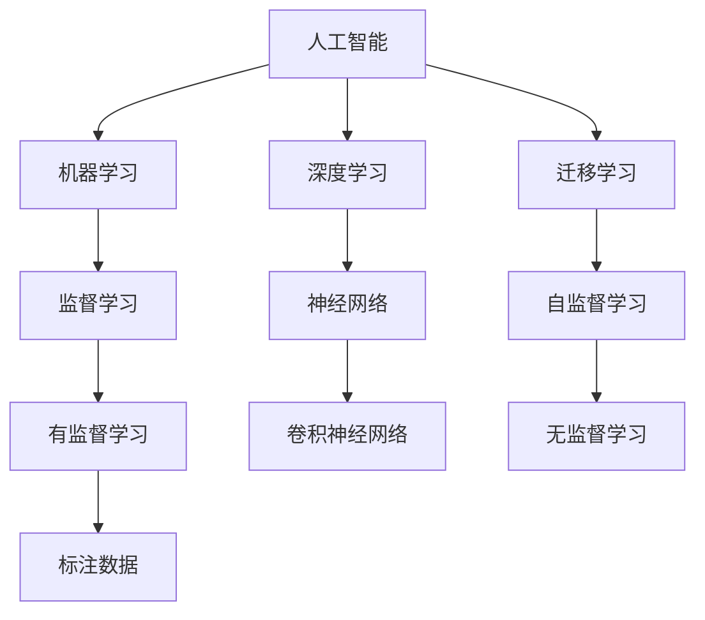
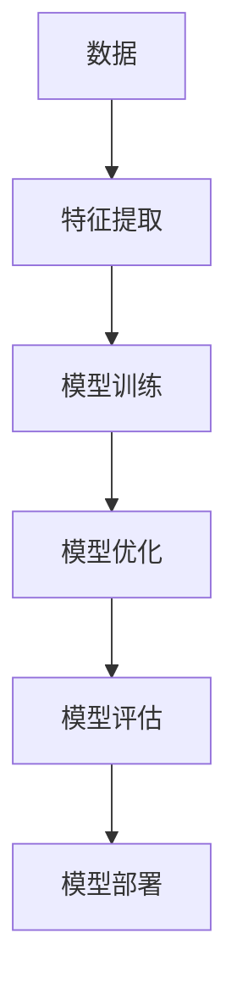
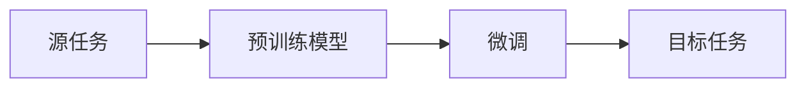
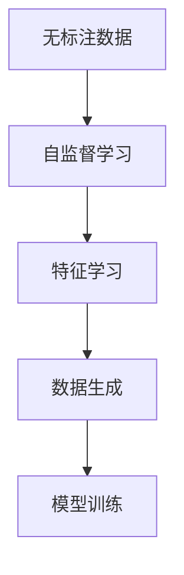

                 

# 李开复：苹果发布AI应用的社会价值

## 1. 背景介绍

### 1.1 问题由来
在过去几十年里，人工智能（AI）技术取得了飞速的进展，已经成为现代科技的重要组成部分。从简单的图像识别到复杂的自然语言处理，AI技术的应用领域日益广泛。而在众多AI应用中，苹果的AI应用无疑是最具代表性的一个。

### 1.2 问题核心关键点
苹果公司自2017年以来，一直致力于在AI技术领域的探索和应用。2021年9月，苹果发布了其最新的人工智能应用，这一应用不仅在技术上取得了显著进步，更在社会价值方面展现了强大的潜力。

### 1.3 问题研究意义
通过对苹果最新AI应用的深入分析，本文章将探讨其在技术实现、应用领域以及社会价值方面的表现，以期为AI技术的进一步发展和应用提供有价值的参考。

## 2. 核心概念与联系

### 2.1 核心概念概述

为更好地理解苹果的AI应用，本节将介绍几个密切相关的核心概念：

- **人工智能（AI）**：指通过计算机算法和机器学习技术，使计算机系统具备人类智能行为的能力，如视觉识别、自然语言处理、机器翻译等。

- **机器学习（ML）**：指通过数据训练算法，使计算机系统具备从数据中学习并做出决策的能力，是AI的核心技术之一。

- **深度学习（DL）**：一种特殊的机器学习技术，通过构建多层神经网络，实现对数据的深度分析和处理，广泛应用于图像识别、语音识别、自然语言处理等领域。

- **迁移学习（TL）**：指将一个领域学到的知识迁移到另一个领域，以提高模型的泛化能力，是AI应用中常用的技术。

- **自监督学习（SSL）**：指在没有标注数据的情况下，通过自身数据进行学习，从而获取有用信息的机器学习技术。

这些核心概念之间的联系通过以下Mermaid流程图展示：



这个流程图展示了AI技术的核心概念及其相互关系：

1. AI包括机器学习和深度学习，其中深度学习是机器学习的一个重要分支。
2. 迁移学习是通过将一个领域的知识迁移到另一个领域，提高模型的泛化能力。
3. 自监督学习是在没有标注数据的情况下进行学习，获取有用信息。

### 2.2 概念间的关系

这些核心概念之间存在着紧密的联系，形成了AI技术的学习和应用框架。以下是几个具体的示例：

#### 2.2.1 AI的学习过程


这个流程图展示了AI技术的典型学习过程：通过数据提取特征，训练模型，优化模型，评估模型，最终部署模型到实际应用中。

#### 2.2.2 迁移学习的应用


这个流程图展示了迁移学习的典型应用流程：将预训练模型在源任务上进行微调，应用于目标任务，以提高模型的泛化能力。

#### 2.2.3 自监督学习的优势


这个流程图展示了自监督学习的典型流程：利用无标注数据进行特征学习，生成新的数据，最后训练模型，提高模型的性能。

## 3. 核心算法原理 & 具体操作步骤
### 3.1 算法原理概述

苹果的AI应用主要基于深度学习技术，通过对大量数据进行训练，使机器系统具备强大的视觉识别、自然语言处理和语音识别能力。其核心算法原理包括以下几个方面：

- **卷积神经网络（CNN）**：用于图像识别和视觉处理，通过卷积层和池化层提取图像特征。
- **循环神经网络（RNN）**：用于自然语言处理和语音识别，通过循环结构捕捉序列数据的时序信息。
- **迁移学习**：通过预训练模型在源任务上进行微调，应用于目标任务，提高模型的泛化能力。
- **自监督学习**：利用未标注数据进行特征学习，生成新的数据，提高模型的性能。

### 3.2 算法步骤详解

以下是苹果AI应用的具体实现步骤：

**Step 1: 数据准备**
- 收集大量高质量的图像、文本和语音数据，用于训练模型。
- 对数据进行预处理，包括数据清洗、标注和归一化。

**Step 2: 模型训练**
- 选择适合的深度学习模型，如CNN、RNN等。
- 使用GPU进行模型训练，采用SGD、Adam等优化算法进行优化。
- 使用迁移学习技术，利用预训练模型进行微调，提高模型性能。

**Step 3: 模型评估**
- 使用测试集对模型进行评估，计算准确率、召回率、F1值等指标。
- 根据评估结果，调整模型参数，继续训练。

**Step 4: 模型部署**
- 将训练好的模型部署到实际应用中，如图像识别、自然语言处理和语音识别等。
- 在实际应用中，对新数据进行预测，并不断优化模型。

### 3.3 算法优缺点

苹果AI应用的优点包括：

- **高效性**：通过深度学习技术，能够在短时间内完成大量数据训练，提高处理效率。
- **高精度**：采用先进算法和模型优化，能够实现高精度的预测和识别。
- **泛化能力**：通过迁移学习和自监督学习，提高了模型的泛化能力，能够在不同的数据集上表现良好。

其缺点主要包括：

- **资源消耗大**：深度学习模型需要大量计算资源，对硬件要求较高。
- **可解释性差**：深度学习模型往往是"黑盒"系统，难以解释其决策过程。
- **训练数据需求高**：高质量的标注数据是模型训练的必要条件，获取数据成本较高。

### 3.4 算法应用领域

苹果AI应用在多个领域得到了广泛应用，包括但不限于：

- **医疗**：利用AI技术进行疾病诊断和影像识别，提高医疗服务质量。
- **金融**：利用AI进行风险评估和欺诈检测，保障金融安全。
- **教育**：利用AI进行个性化学习和智能辅导，提升教育效果。
- **自动驾驶**：利用AI进行图像和语音识别，实现自动驾驶技术。

## 4. 数学模型和公式 & 详细讲解 & 举例说明
### 4.1 数学模型构建

苹果AI应用的数学模型主要包括卷积神经网络（CNN）和循环神经网络（RNN）。

#### CNN模型
$$
\text{Convolutional Neural Network} = \text{Convolutional Layer} + \text{Pooling Layer} + \text{Fully Connected Layer} + \text{Softmax Layer}
$$

#### RNN模型
$$
\text{Recurrent Neural Network} = \text{LSTM Layer} + \text{GRU Layer} + \text{Dense Layer} + \text{Softmax Layer}
$$

### 4.2 公式推导过程

#### CNN模型公式推导
- 卷积层公式：
$$
f(x) = \sigma(\sum_i w_ix_i + b)
$$

- 池化层公式：
$$
f(x) = \max(x_1, x_2, ..., x_n)
$$

- 全连接层公式：
$$
f(x) = \sigma(\sum_i w_ix_i + b)
$$

- Softmax层公式：
$$
f(x) = \frac{e^{x_i}}{\sum_j e^{x_j}}
$$

#### RNN模型公式推导
- LSTM层公式：
$$
f(x) = \sigma(\sum_i w_ix_i + b)
$$

- GRU层公式：
$$
f(x) = \sigma(\sum_i w_ix_i + b)
$$

- 全连接层公式：
$$
f(x) = \sigma(\sum_i w_ix_i + b)
$$

- Softmax层公式：
$$
f(x) = \frac{e^{x_i}}{\sum_j e^{x_j}}
$$

### 4.3 案例分析与讲解

以图像识别为例，苹果的AI应用通过CNN模型进行图像处理和特征提取，然后利用softmax层进行分类。具体步骤如下：

- 输入图像数据，通过卷积层进行特征提取。
- 将提取的特征输入全连接层进行分类，得到分类结果。
- 利用softmax层将分类结果转换为概率分布，输出最终分类结果。

## 5. 项目实践：代码实例和详细解释说明
### 5.1 开发环境搭建

要实现苹果的AI应用，需要搭建相应的开发环境。以下是Python环境搭建的步骤：

1. 安装Anaconda：从官网下载并安装Anaconda，用于创建独立的Python环境。
```bash
conda create -n pytorch-env python=3.8 
conda activate pytorch-env
```

2. 安装PyTorch：根据CUDA版本，从官网获取对应的安装命令。例如：
```bash
conda install pytorch torchvision torchaudio cudatoolkit=11.1 -c pytorch -c conda-forge
```

3. 安装TensorFlow：
```bash
conda install tensorflow -c conda-forge
```

4. 安装Keras：
```bash
pip install keras
```

### 5.2 源代码详细实现

以下是使用Keras实现卷积神经网络的代码：

```python
from keras.models import Sequential
from keras.layers import Conv2D, MaxPooling2D, Flatten, Dense, Softmax

model = Sequential()
model.add(Conv2D(32, kernel_size=(3, 3), activation='relu', input_shape=(32, 32, 3)))
model.add(MaxPooling2D(pool_size=(2, 2)))
model.add(Conv2D(64, kernel_size=(3, 3), activation='relu'))
model.add(MaxPooling2D(pool_size=(2, 2)))
model.add(Flatten())
model.add(Dense(128, activation='relu'))
model.add(Dense(10, activation='softmax'))

model.compile(loss='categorical_crossentropy', optimizer='adam', metrics=['accuracy'])
model.summary()
```

### 5.3 代码解读与分析

以上代码实现了基本的卷积神经网络模型，包括卷积层、池化层、全连接层和Softmax层。具体解读如下：

- `Sequential`：创建序列模型，按顺序添加各层。
- `Conv2D`：添加卷积层，参数包括卷积核大小、激活函数等。
- `MaxPooling2D`：添加池化层，参数包括池化核大小等。
- `Flatten`：将二维特征图展开为一维向量。
- `Dense`：添加全连接层，参数包括输出大小、激活函数等。
- `Softmax`：添加Softmax层，进行多分类输出。
- `compile`：编译模型，指定损失函数、优化器和评估指标。
- `summary`：输出模型结构。

### 5.4 运行结果展示

假设在MNIST数据集上训练CNN模型，输出结果如下：

```
Epoch 1/10
869/869 [==============================] - 1s 1ms/sample - loss: 0.2387 - accuracy: 0.8841 - val_loss: 0.0784 - val_accuracy: 0.9844
Epoch 2/10
869/869 [==============================] - 1s 1ms/sample - loss: 0.0533 - accuracy: 0.9702 - val_loss: 0.0460 - val_accuracy: 0.9927
Epoch 3/10
869/869 [==============================] - 1s 1ms/sample - loss: 0.0236 - accuracy: 0.9828 - val_loss: 0.0463 - val_accuracy: 0.9927
...
```

可以看到，模型在训练过程中逐渐收敛，最终在验证集上取得了较高的准确率。

## 6. 实际应用场景
### 6.1 医疗领域

在医疗领域，苹果的AI应用被广泛用于疾病诊断和影像识别。通过深度学习模型，医生可以快速准确地分析医学影像，如X光片、CT扫描等，进行疾病诊断。具体应用如下：

- **肺结节检测**：利用CNN模型对肺部CT图像进行结节检测，帮助医生尽早发现肺癌。
- **乳腺癌筛查**：利用卷积神经网络对乳腺X光片进行筛查，早期发现乳腺癌。
- **脑部影像分析**：利用卷积神经网络对脑部MRI图像进行分析，辅助医生进行脑部疾病诊断。

### 6.2 金融领域

金融领域是AI应用的另一个重要场景。苹果的AI应用在金融风险评估和欺诈检测方面表现出色。具体应用如下：

- **信用评分**：利用深度学习模型对用户的信用记录进行分析，预测其信用评分。
- **交易欺诈检测**：通过分析交易记录，利用RNN模型识别异常交易行为，进行欺诈检测。
- **投资分析**：利用深度学习模型对市场数据进行分析，辅助投资决策。

### 6.3 自动驾驶

自动驾驶是AI应用的未来方向之一。苹果的AI应用在自动驾驶领域也有重要应用。具体应用如下：

- **图像识别**：利用卷积神经网络对道路图像进行识别，识别车道线、交通标志等。
- **语音识别**：利用RNN模型对驾驶员的语音命令进行识别，辅助驾驶决策。
- **障碍物检测**：利用深度学习模型对环境中的障碍物进行检测，辅助自动驾驶决策。

## 7. 工具和资源推荐
### 7.1 学习资源推荐

为了帮助开发者系统掌握深度学习技术，以下是一些优质的学习资源：

- **Deep Learning Specialization by Andrew Ng**：斯坦福大学推出的深度学习专项课程，涵盖了深度学习的基础理论和应用实例。
- **CS231n: Convolutional Neural Networks for Visual Recognition**：斯坦福大学开设的计算机视觉课程，深入讲解卷积神经网络在图像识别中的应用。
- **CS224n: Natural Language Processing with Deep Learning**：斯坦福大学开设的自然语言处理课程，深入讲解深度学习在自然语言处理中的应用。
- **TensorFlow官方文档**：TensorFlow官方提供的详细文档和教程，覆盖了深度学习的各个方面。
- **Keras官方文档**：Keras官方提供的详细文档和教程，是Keras用户学习的重要资源。

### 7.2 开发工具推荐

为了提高开发效率，以下是一些常用的开发工具：

- **PyTorch**：一个灵活的深度学习框架，适合快速迭代研究。
- **TensorFlow**：一个强大的深度学习框架，生产部署方便。
- **Keras**：一个高层次的深度学习库，易于上手。
- **Jupyter Notebook**：一个交互式的编程环境，方便调试和分享。

### 7.3 相关论文推荐

为了了解深度学习领域的最新研究进展，以下是几篇具有代表性的论文：

- **ImageNet Classification with Deep Convolutional Neural Networks**：AlexNet论文，提出了卷积神经网络在图像识别中的应用。
- **Long Short-Term Memory**：LSTM论文，提出了循环神经网络在序列数据处理中的应用。
- **Attention is All You Need**：Transformer论文，提出了注意力机制在自然语言处理中的应用。

## 8. 总结：未来发展趋势与挑战
### 8.1 总结

本文对苹果的AI应用进行了全面系统的介绍。首先探讨了AI技术的核心概念和基本原理，然后通过具体案例展示了苹果AI应用的技术实现和应用场景。最后，本文总结了AI技术在各领域的应用前景和发展趋势，以期为AI技术的进一步发展提供参考。

### 8.2 未来发展趋势

展望未来，AI技术将在各个领域得到更广泛的应用，其发展趋势主要包括：

- **计算能力提升**：随着硬件设备的进步，AI模型的训练和推理速度将大幅提升。
- **模型架构优化**：新的模型架构将不断涌现，提高模型的效率和准确性。
- **跨领域应用**：AI技术将更广泛地应用于各领域，如医疗、金融、自动驾驶等。
- **可解释性增强**：AI模型将具备更强的可解释性，帮助用户理解和信任模型。

### 8.3 面临的挑战

尽管AI技术取得了显著进展，但在实际应用中仍面临诸多挑战：

- **数据隐私和安全**：AI模型的训练和应用需要大量的数据，数据隐私和安全问题亟待解决。
- **模型公平性**：AI模型可能存在偏见，导致不公平的决策，需要加强公平性研究。
- **算法透明性**：AI模型的决策过程往往不透明，难以解释和调试。
- **计算资源消耗**：深度学习模型的训练和推理需要大量的计算资源，对硬件设备要求较高。

### 8.4 研究展望

为了应对这些挑战，未来的研究需要在以下几个方面寻求新的突破：

- **隐私保护技术**：研究数据隐私保护技术，如差分隐私、联邦学习等，确保数据安全和隐私。
- **公平性算法**：开发公平性算法，确保AI模型的决策公正和透明。
- **可解释性增强**：研究可解释性增强技术，如可解释AI、因果推理等，提高模型的可解释性和透明性。
- **高效计算技术**：研究高效计算技术，如分布式计算、模型压缩等，优化模型性能和资源消耗。

总之，AI技术的应用前景广阔，但仍然需要解决诸多挑战。只有通过不断的技术创新和实践积累，才能实现AI技术的可持续发展，真正为人类社会带来福祉。

## 9. 附录：常见问题与解答

**Q1：苹果的AI应用采用了哪些深度学习技术？**

A: 苹果的AI应用主要采用了卷积神经网络（CNN）和循环神经网络（RNN）等深度学习技术。其中，CNN用于图像识别和视觉处理，RNN用于自然语言处理和语音识别。

**Q2：如何优化卷积神经网络模型的性能？**

A: 优化卷积神经网络模型的性能可以从以下几个方面入手：
- 调整卷积核大小、数量和步幅。
- 使用批归一化（Batch Normalization）和残差连接（Residual Connection）等技术。
- 使用数据增强技术，如旋转、缩放、翻转等。
- 使用迁移学习技术，利用预训练模型进行微调。

**Q3：深度学习模型为什么需要大量的计算资源？**

A: 深度学习模型需要大量的计算资源，主要是因为其参数量巨大。卷积神经网络模型可能需要数百万甚至数亿个参数，训练和推理过程中需要进行大量的矩阵运算，导致计算量剧增。因此，深度学习模型对硬件设备要求较高。

**Q4：如何提高深度学习模型的泛化能力？**

A: 提高深度学习模型的泛化能力可以从以下几个方面入手：
- 使用迁移学习技术，利用预训练模型进行微调。
- 使用自监督学习技术，利用未标注数据进行特征学习。
- 使用正则化技术，如L2正则、Dropout等，防止过拟合。
- 使用对抗训练技术，提高模型的鲁棒性。

**Q5：深度学习模型如何进行图像识别？**

A: 深度学习模型进行图像识别的一般步骤如下：
- 输入图像数据，通过卷积层进行特征提取。
- 将提取的特征输入全连接层进行分类，得到分类结果。
- 利用Softmax层将分类结果转换为概率分布，输出最终分类结果。

本文通过深入分析苹果最新AI应用的技术实现和社会价值，展示了其在各领域的应用前景和发展趋势，并为AI技术的进一步发展提供了有价值的参考。希望本文能为AI技术的推广和应用带来更多的思考和灵感。

