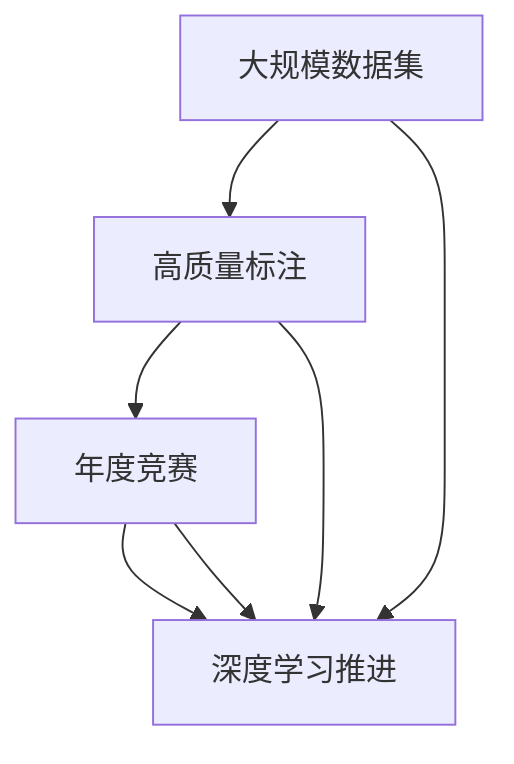
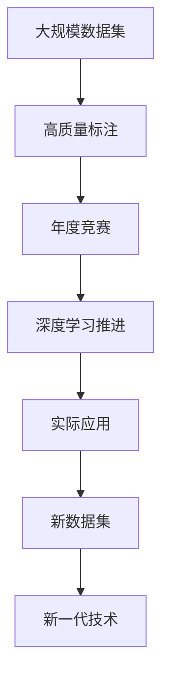

                 

# 李飞飞与ImageNet的故事

> 关键词：ImageNet,深度学习,计算机视觉,人工智能,数据科学,李飞飞,深度学习竞赛

## 1. 背景介绍

### 1.1 问题由来

随着深度学习技术的兴起，计算机视觉（CV）领域迎来了革命性的变化。如何在大规模数据上进行模型训练，以提升视觉任务的性能，成为了一个核心问题。特别是面对大型数据集，如何组织、标注、存储和处理，是业界普遍关注的重点。

**背景和目标：**
1999年，美国斯坦福大学计算机视觉研究中心的李飞飞教授团队，发起了一项名为ImageNet的项目。目标是为大规模图像识别任务提供标准的图像数据集，供深度学习研究者使用。项目团队希望通过大规模的标注数据，推动深度学习在计算机视觉领域的进步。

### 1.2 问题核心关键点

ImageNet项目旨在提供一个高质量的图像数据集，以促进深度学习研究。其关键点包括：

- **大规模数据集**：包含约1400万张图像，覆盖1000个不同的类别，是当时最大的图像数据集之一。
- **高质量标注**：所有图像由人类专家手动标注，确保标签的准确性和一致性。
- **通用性和可扩展性**：数据集涵盖了多种场景和物体，适用于广泛的视觉任务。
- **挑战性**：为了鼓励研究，ImageNet还设立了年度大规模深度学习竞赛（ImageNet Large Scale Visual Recognition Challenge, ILSVRC），以推动视觉领域的发展。

### 1.3 问题研究意义

ImageNet项目不仅为计算机视觉领域提供了强大的数据支撑，还推动了深度学习技术的进步。通过高标准的图像数据和年度竞赛，ImageNet为研究者提供了一个公平、公正的竞赛平台，促进了跨学科、跨领域的交流和合作。

研究ImageNet项目，可以帮助我们理解深度学习在计算机视觉中的应用和发展，对数据集标注和管理的最佳实践有深入的认识，同时也能激发对大型数据集和深度学习竞赛的兴趣和思考。

## 2. 核心概念与联系

### 2.1 核心概念概述

ImageNet项目的核心概念包括：

- **大规模数据集**：ImageNet数据集包含1400万张图像，涵盖了1000个类别，是最大的计算机视觉数据集之一。
- **高质量标注**：每张图像都由人类专家进行精细标注，确保标注的准确性和一致性。
- **年度竞赛**：ImageNet ILSVRC竞赛每年举办一次，是计算机视觉领域最具影响力的竞赛之一。
- **深度学习推进**：ImageNet数据集在推动深度学习技术进步方面发挥了重要作用。

### 2.2 核心概念间的联系

ImageNet项目通过提供大规模、高质量的标注数据，以及公平、公正的竞赛平台，推动了深度学习在计算机视觉领域的应用和发展。其核心概念之间的关系可以通过以下Mermaid流程图来展示：



这个流程图展示了ImageNet项目中各个核心概念之间的联系：

1. 大规模数据集为深度学习模型提供了丰富的训练样本。
2. 高质量标注保证了数据的一致性和准确性，提升了模型的性能。
3. 年度竞赛为研究者提供了公平竞争的平台，推动了视觉任务的技术进步。
4. 深度学习技术通过ImageNet数据集得到了验证和提升，反过来又进一步推动了数据集的发展和应用。

### 2.3 核心概念的整体架构

最后，我们用一个综合的流程图来展示ImageNet项目中各个核心概念的整体架构：



这个综合流程图展示了ImageNet项目从数据集构建到技术应用，再到新数据集和技术发展的完整过程：

1. 从大规模数据集和高质量标注开始，推动深度学习在计算机视觉领域的应用。
2. 通过年度竞赛，评估和推进深度学习技术的进步。
3. 基于ImageNet技术的进步，应用于实际应用场景。
4. 不断更新和扩展新的数据集，开发新一代技术。

## 3. 核心算法原理 & 具体操作步骤
### 3.1 算法原理概述

ImageNet项目的核心算法是深度学习，特别是卷积神经网络（CNN）在图像识别任务中的应用。其基本思想是通过卷积层和池化层，从输入图像中提取特征，然后通过全连接层进行分类。

### 3.2 算法步骤详解

ImageNet数据集主要由以下步骤组成：

1. **数据收集**：团队从互联网上爬取图像，覆盖各种场景和物体。
2. **数据标注**：对每张图像进行手动标注，生成标准的XML文件。
3. **数据预处理**：对图像进行预处理，包括缩放、裁剪、旋转等，以保证数据的一致性。
4. **数据划分**：将数据划分为训练集、验证集和测试集，并进行交叉验证。
5. **模型训练**：使用深度学习模型（如LeNet、AlexNet、VGG等）进行模型训练。
6. **模型评估**：在验证集上评估模型性能，调整超参数。
7. **模型测试**：在测试集上测试模型，输出最终结果。

### 3.3 算法优缺点

**优点：**
- **大规模数据集**：ImageNet提供了丰富的训练样本，有助于提升模型泛化能力。
- **高质量标注**：精细的标注确保了数据集的一致性和准确性。
- **年度竞赛**：提供了一个公平竞争的平台，推动了技术进步。
- **标准化接口**：统一的数据格式和接口，便于数据共享和研究。

**缺点：**
- **数据标注成本高**：手工标注每张图像需要大量时间和人力。
- **数据多样性有限**：数据集覆盖的类别有限，可能无法涵盖所有场景。
- **标注错误可能存在**：尽管标注团队尽力保证准确性，但仍可能存在标注错误。
- **模型计算资源需求大**：深度学习模型的计算资源需求高，需要高性能计算设备和算法优化。

### 3.4 算法应用领域

ImageNet项目在计算机视觉领域的应用非常广泛，涵盖了各种视觉任务，包括但不限于：

- **图像分类**：如物体识别、场景分类等。
- **目标检测**：如物体定位、区域分割等。
- **图像分割**：如像素级别的物体分割、语义分割等。
- **图像生成**：如图像修复、图像生成对抗网络（GAN）等。
- **行为识别**：如动作识别、姿态估计等。

## 4. 数学模型和公式 & 详细讲解 & 举例说明
### 4.1 数学模型构建

ImageNet项目中使用的深度学习模型，主要包括卷积神经网络（CNN）和全连接神经网络（FNN）。其中，CNN通过卷积层、池化层和全连接层，从图像中提取特征并进行分类。

**卷积神经网络（CNN）模型结构**：

```
input -> Conv1 -> ReLU1 -> MaxPool1 -> Conv2 -> ReLU2 -> MaxPool2 -> FullyConnected -> Softmax
```

- **输入层**：原始图像数据，大小为$H \times W \times C$。
- **卷积层**：通过多个卷积核提取图像特征。
- **ReLU层**：引入非线性变换，避免梯度消失问题。
- **池化层**：通过最大池化或平均池化降低特征图尺寸，提高计算效率。
- **全连接层**：将特征映射转换为向量，输入到Softmax层进行分类。

### 4.2 公式推导过程

**前向传播过程**：

1. **输入层到卷积层**：

   $$
   \mathbf{A} = \sigma(\mathbf{X} * \mathbf{W}^{(1)} + \mathbf{b}^{(1)})
   $$

   其中，$\mathbf{X}$表示输入图像，$\mathbf{W}^{(1)}$表示卷积核权重，$\mathbf{b}^{(1)}$表示偏置项。$\sigma$表示ReLU激活函数。

2. **卷积层到池化层**：

   $$
   \mathbf{A}' = \text{MaxPool}(\mathbf{A})
   $$

   其中，$\text{MaxPool}$表示最大池化操作。

3. **池化层到全连接层**：

   $$
   \mathbf{A}'' = \sigma(\mathbf{A}' * \mathbf{W}^{(2)} + \mathbf{b}^{(2)})
   $$

   其中，$\mathbf{W}^{(2)}$和$\mathbf{b}^{(2)}$表示全连接层的权重和偏置项。

4. **全连接层到Softmax层**：

   $$
   \mathbf{Z} = \mathbf{A}'' * \mathbf{W}^{(3)} + \mathbf{b}^{(3)}
   $$

   $$
   \mathbf{P} = \text{Softmax}(\mathbf{Z})
   $$

   其中，$\mathbf{W}^{(3)}$和$\mathbf{b}^{(3)}$表示全连接层的权重和偏置项。$\text{Softmax}$表示Softmax激活函数。

**后向传播过程**：

1. **损失函数**：

   $$
   \mathcal{L} = -\frac{1}{N} \sum_{i=1}^{N} \sum_{j=1}^{C} y_{ij} \log p_{ij}
   $$

   其中，$N$表示样本数量，$C$表示类别数量，$y_{ij}$表示第$i$个样本第$j$个类别的真实标签，$p_{ij}$表示第$i$个样本第$j$个类别的预测概率。

2. **梯度下降优化**：

   $$
   \mathbf{W}^{(l)} \leftarrow \mathbf{W}^{(l)} - \eta \nabla_{\mathbf{W}^{(l)}} \mathcal{L}
   $$

   $$
   \mathbf{b}^{(l)} \leftarrow \mathbf{b}^{(l)} - \eta \nabla_{\mathbf{b}^{(l)}} \mathcal{L}
   $$

   其中，$\eta$表示学习率，$\nabla_{\mathbf{W}^{(l)}} \mathcal{L}$表示权重梯度，$\nabla_{\mathbf{b}^{(l)}} \mathcal{L}$表示偏置梯度。

### 4.3 案例分析与讲解

**LeNet-5模型**：

LeNet-5模型是最早的卷积神经网络之一，用于手写数字识别。其结构如下：

```
input -> Conv1 -> MaxPool1 -> Conv2 -> MaxPool2 -> FullyConnected -> Output
```

- **卷积层1**：$5 \times 5$卷积核，输出64个特征图。
- **池化层1**：$2 \times 2$最大池化，输出28 \times 28的特征图。
- **卷积层2**：$5 \times 5$卷积核，输出128个特征图。
- **池化层2**：$2 \times 2$最大池化，输出14 \times 14的特征图。
- **全连接层**：输入14 \times 14 \times 128，输出120个节点。
- **输出层**：输入120，输出10个节点，进行手写数字分类。

LeNet-5模型在ImageNet数据集上取得了不错的效果，奠定了卷积神经网络在计算机视觉领域的基础。

## 5. 项目实践：代码实例和详细解释说明
### 5.1 开发环境搭建

为了实现ImageNet项目，首先需要搭建好开发环境。以下是使用Python进行TensorFlow开发的第一步：

1. 安装Anaconda：从官网下载并安装Anaconda，用于创建独立的Python环境。

   ```bash
   conda create -n tf-env python=3.7
   conda activate tf-env
   ```

2. 安装TensorFlow：根据CUDA版本，从官网获取对应的安装命令。例如：

   ```bash
   conda install tensorflow
   ```

3. 安装Keras：Keras是一个高层次的神经网络API，可以方便地构建和训练模型。

   ```bash
   pip install keras
   ```

4. 安装图像处理库：如Pillow和OpenCV，用于图像的预处理和增强。

   ```bash
   pip install pillow opencv-python
   ```

完成上述步骤后，即可在`tf-env`环境中开始ImageNet项目。

### 5.2 源代码详细实现

以下是使用Keras实现ImageNet分类任务的完整代码实现：

```python
from keras.applications import VGG16
from keras.preprocessing.image import ImageDataGenerator
from keras.models import Model
from keras.layers import Dense, Flatten
from keras.optimizers import SGD

# 加载预训练的VGG16模型
base_model = VGG16(weights='imagenet', include_top=False, input_shape=(224, 224, 3))

# 冻结预训练层
for layer in base_model.layers:
    layer.trainable = False

# 添加分类层
x = base_model.output
x = Flatten()(x)
x = Dense(256, activation='relu')(x)
predictions = Dense(10, activation='softmax')(x)

# 构建新模型
model = Model(inputs=base_model.input, outputs=predictions)

# 编译模型
model.compile(optimizer=SGD(lr=0.0001, momentum=0.9), loss='categorical_crossentropy', metrics=['accuracy'])

# 数据增强
train_datagen = ImageDataGenerator(
    rescale=1./255,
    shear_range=0.2,
    zoom_range=0.2,
    horizontal_flip=True)

test_datagen = ImageDataGenerator(rescale=1./255)

train_generator = train_datagen.flow_from_directory(
    'train',
    target_size=(224, 224),
    batch_size=32,
    class_mode='categorical')

validation_generator = test_datagen.flow_from_directory(
    'validation',
    target_size=(224, 224),
    batch_size=32,
    class_mode='categorical')

# 训练模型
model.fit_generator(
    train_generator,
    steps_per_epoch=2000,
    epochs=50,
    validation_data=validation_generator,
    validation_steps=800)
```

### 5.3 代码解读与分析

让我们再详细解读一下关键代码的实现细节：

**ImageDataGenerator**：

- `train_datagen`和`test_datagen`：用于数据增强，包括缩放、裁剪、旋转等操作。
- `train_generator`和`validation_generator`：从目录中读取图像，并进行数据增强。

**模型构建**：

- `base_model`：加载预训练的VGG16模型，不包括顶层分类层。
- `Flatten()`：将特征图展平为一维向量。
- `Dense()`：添加全连接层。
- `Softmax()`：添加softmax分类层。

**模型编译**：

- `SGD`：使用随机梯度下降优化器，学习率为0.0001，动量为0.9。
- `categorical_crossentropy`：使用交叉熵损失函数。
- `accuracy`：记录准确率作为评估指标。

**训练过程**：

- `fit_generator`：使用数据生成器进行训练，迭代2000个批次的训练样本，共50个epoch。

## 6. 实际应用场景

### 6.1 智能监控系统

ImageNet技术可以应用于智能监控系统，实时检测和识别监控场景中的物体和行为。通过在监控摄像头前安装图像传感器，系统可以实时捕捉到图像，并通过ImageNet模型进行物体识别和行为分析。

在实际应用中，可以结合其他传感器和设备，如红外、微波等，进行多模态数据融合，提升识别准确性和鲁棒性。同时，系统可以根据识别结果，自动报警或联动其他设备，进行异常处理。

### 6.2 自动驾驶

ImageNet技术可以应用于自动驾驶领域，通过摄像头和传感器获取道路图像和环境数据，进行物体检测和行为识别。自动驾驶系统可以通过ImageNet模型，实时判断道路状况和交通信号，做出相应的驾驶决策。

在实际应用中，系统还需要结合GPS、雷达、激光雷达等设备，进行多模态数据融合，提升感知和决策能力。同时，系统可以根据环境数据，实时调整行驶路线和速度，确保行车安全。

### 6.3 医疗影像分析

ImageNet技术可以应用于医疗影像分析，通过X光片、CT、MRI等图像数据，进行肿瘤、病变等疾病的识别和诊断。系统可以通过ImageNet模型，实时分析图像数据，输出诊断结果。

在实际应用中，系统还需要结合专家知识和规则库，进行诊断结果的解释和验证。同时，系统可以根据历史数据，不断更新和优化模型，提升诊断准确性和泛化能力。

## 7. 工具和资源推荐
### 7.1 学习资源推荐

为了深入理解ImageNet项目和深度学习技术，推荐以下学习资源：

1. 《Deep Learning》（Ian Goodfellow、Yoshua Bengio、Aaron Courville合著）：全面介绍了深度学习的基本概念和应用，是深度学习领域的经典教材。

2. CS231n《Convolutional Neural Networks for Visual Recognition》课程：斯坦福大学开设的计算机视觉课程，详细讲解了卷积神经网络在图像识别任务中的应用。

3. 《ImageNet Large Scale Visual Recognition Challenge》论文：ImageNet ILSVRC竞赛的论文，介绍了竞赛的规则和流程，展示了深度学习在计算机视觉领域的应用进展。

4. TensorFlow官方文档：TensorFlow的官方文档，详细介绍了TensorFlow的API和使用方法，是TensorFlow开发的重要参考资料。

5. PyTorch官方文档：PyTorch的官方文档，详细介绍了PyTorch的API和使用方法，是PyTorch开发的重要参考资料。

6. Keras官方文档：Keras的官方文档，详细介绍了Keras的API和使用方法，是Keras开发的重要参考资料。

通过这些资源的学习和实践，相信你一定能够快速掌握ImageNet项目和深度学习技术的精髓，并用于解决实际的计算机视觉问题。

### 7.2 开发工具推荐

高效的开发离不开优秀的工具支持。以下是几款用于ImageNet项目开发的常用工具：

1. PyTorch：基于Python的开源深度学习框架，灵活动态的计算图，适合快速迭代研究。

2. TensorFlow：由Google主导开发的开源深度学习框架，生产部署方便，适合大规模工程应用。

3. Keras：高层次的神经网络API，可以方便地构建和训练模型。

4. OpenCV：计算机视觉库，提供了丰富的图像处理和计算机视觉算法。

5. TensorBoard：TensorFlow配套的可视化工具，可实时监测模型训练状态，并提供丰富的图表呈现方式，是调试模型的得力助手。

6. PyTorch官方文档：PyTorch的官方文档，详细介绍了PyTorch的API和使用方法，是PyTorch开发的重要参考资料。

7. TensorFlow官方文档：TensorFlow的官方文档，详细介绍了TensorFlow的API和使用方法，是TensorFlow开发的重要参考资料。

8. Keras官方文档：Keras的官方文档，详细介绍了Keras的API和使用方法，是Keras开发的重要参考资料。

合理利用这些工具，可以显著提升ImageNet项目和深度学习模型的开发效率，加快创新迭代的步伐。

### 7.3 相关论文推荐

ImageNet项目在计算机视觉领域的发展，离不开学界的持续研究。以下是几篇奠基性的相关论文，推荐阅读：

1. A Tutorial on Deep Learning：Ian Goodfellow等合著，全面介绍了深度学习的基本概念和应用。

2. ImageNet Challenge 2010：ImageNet ILSVRC竞赛的组织者和获奖者论文，展示了深度学习在计算机视觉领域的应用进展。

3. Learning Multiple Layers of Features from Tiny Images：Alex Krizhevsky等合著，提出了卷积神经网络在图像识别任务中的应用。

4. Deep Residual Learning for Image Recognition：Kaiming He等合著，提出了残差网络在图像识别任务中的应用。

5. Inception-v3, Inception-resnet and the Inception-optimization：Christian Szegedy等合著，提出了Inception网络在图像识别任务中的应用。

这些论文代表了大规模数据集和深度学习技术的发展脉络。通过学习这些前沿成果，可以帮助研究者把握学科前进方向，激发更多的创新灵感。

除上述资源外，还有一些值得关注的前沿资源，帮助开发者紧跟ImageNet项目和深度学习技术的发展，例如：

1. arXiv论文预印本：人工智能领域最新研究成果的发布平台，包括大量尚未发表的前沿工作，学习前沿技术的必读资源。

2. 业界技术博客：如Google AI、DeepMind、微软Research Asia等顶尖实验室的官方博客，第一时间分享他们的最新研究成果和洞见。

3. 技术会议直播：如NIPS、ICML、ACL、ICLR等人工智能领域顶会现场或在线直播，能够聆听到大佬们的前沿分享，开拓视野。

4. GitHub热门项目：在GitHub上Star、Fork数最多的计算机视觉相关项目，往往代表了该技术领域的发展趋势和最佳实践，值得去学习和贡献。

5. 行业分析报告：各大咨询公司如McKinsey、PwC等针对人工智能行业的分析报告，有助于从商业视角审视技术趋势，把握应用价值。

总之，对于ImageNet项目和深度学习技术的学习和实践，需要开发者保持开放的心态和持续学习的意愿。多关注前沿资讯，多动手实践，多思考总结，必将收获满满的成长收益。

## 8. 总结：未来发展趋势与挑战

### 8.1 总结

本文对ImageNet项目和深度学习在计算机视觉领域的应用进行了全面系统的介绍。首先阐述了ImageNet项目的目标和核心概念，明确了其在推动深度学习技术进步中的重要意义。其次，从原理到实践，详细讲解了深度学习模型的构建和优化过程，给出了ImageNet项目开发的完整代码实例。同时，本文还广泛探讨了ImageNet技术在实际应用中的各种场景，展示了其强大的应用潜力。

通过本文的系统梳理，可以看到，ImageNet项目通过提供大规模、高质量的标注数据，以及年度竞赛平台，推动了深度学习技术在计算机视觉领域的应用和发展。深度学习技术通过ImageNet项目得到了验证和提升，反过来又进一步推动了数据集的发展和应用。

### 8.2 未来发展趋势

展望未来，ImageNet项目和深度学习技术将呈现以下几个发展趋势：

1. 模型规模持续增大。随着算力成本的下降和数据规模的扩张，深度学习模型的参数量还将持续增长。超大规模模型蕴含的丰富知识，有望支撑更加复杂多变的计算机视觉任务。

2. 迁移学习范式普及。迁移学习技术可以加速模型在新的数据集上的适应，减少标注数据的需求。未来，迁移学习技术将成为深度学习模型应用的重要范式。

3. 多模态数据融合。当前计算机视觉任务主要聚焦于视觉数据，未来将融合更多的多模态数据（如语音、文本），提升模型的综合感知能力。

4. 自监督学习发展。自监督学习技术可以进一步降低标注成本，利用无标签数据训练深度学习模型。未来，自监督学习技术将成为深度学习模型的重要组成部分。

5. 模型可解释性提升。深度学习模型的"黑盒"特性一直是研究难点，未来将通过引入可解释性技术，提升模型的可解释性和透明性。

### 8.3 面临的挑战

尽管ImageNet项目和深度学习技术已经取得了瞩目成就，但在迈向更加智能化、普适化应用的过程中，仍面临诸多挑战：

1. 数据标注成本高昂。尽管ImageNet项目提供了大规模数据集，但标注每张图像仍需要大量时间和人力。如何降低数据标注成本，是未来需要重点关注的问题。

2. 模型泛化能力不足。深度学习模型在复杂场景下的泛化能力仍有限，存在过拟合的风险。如何提升模型的泛化能力，是未来研究的重要方向。

3. 计算资源需求大。深度学习模型的计算资源需求高，需要高性能计算设备和算法优化。如何在保持模型性能的同时，降低计算成本，是未来需要解决的问题。

4. 模型可解释性不足。深度学习模型的"黑盒"特性使得其决策过程难以解释，增加了应用的风险。如何提升模型的可解释性，是未来研究的重要课题。

5. 数据隐私和安全问题。深度学习模型在处理敏感数据时，存在隐私泄露和数据安全的风险。如何在保护隐私的同时，利用数据提升模型性能，是未来需要解决的挑战。

### 8.4 研究展望

面对ImageNet项目和深度学习技术所面临的挑战，未来的研究需要在以下几个方面寻求新的突破：

1. 探索无监督和半监督学习技术。摆脱对大规模标注数据的依赖，利用自监督学习、主动学习等无监督和半监督范式，最大限度利用非结构化数据，实现更加灵活高效的深度学习模型训练。

2. 研究参数高效和计算高效的模型架构。开发更加参数高效的模型架构，在固定大部分预训练参数的同时，只更新极少量的任务相关参数。同时优化模型的计算图，减少前向传播和反向传播的资源消耗，实现更加轻量级、实时性的部署。

3. 融合因果推断和博弈论技术。将因果推断方法引入深度学习模型，增强模型建立稳定因果关系的能力，学习更加普适、鲁棒的语言表征。同时借助博弈论工具刻画人机交互过程，主动探索并规避模型的脆弱

