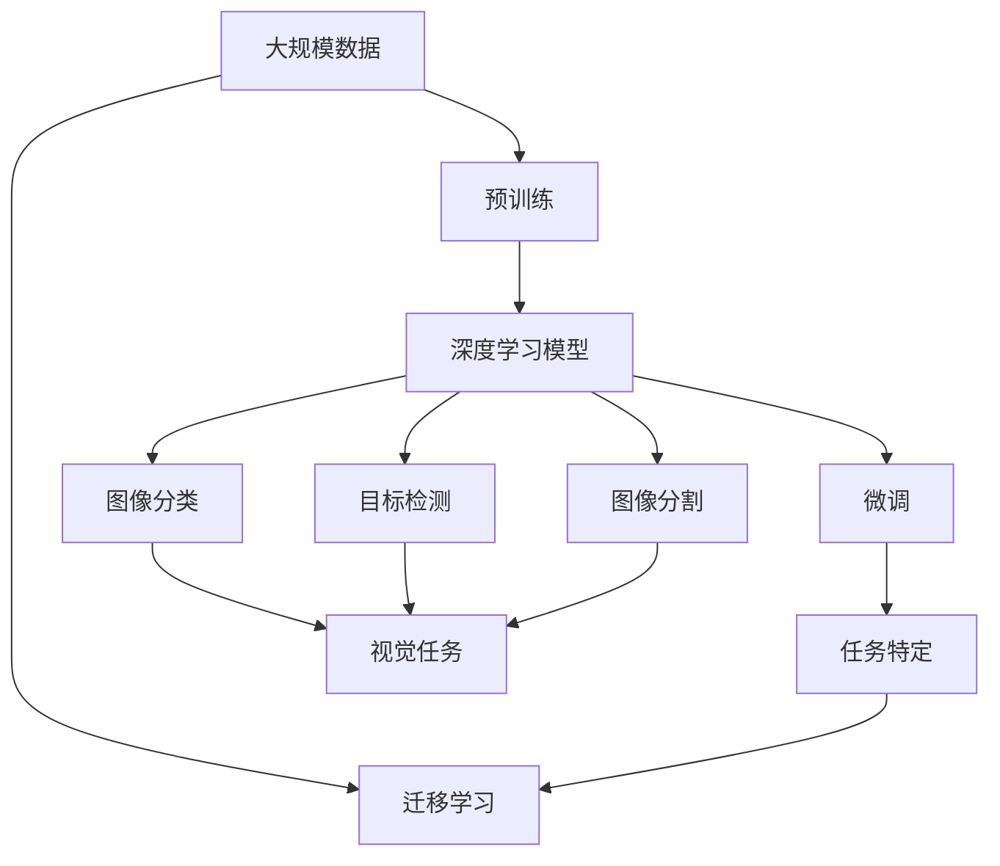

                 

# 李飞飞的ImageNet革命

## 1. 背景介绍

### 1.1 问题由来
2010年，李飞飞教授与其团队领导的ImageNet项目在计算机视觉领域的颠覆性影响力，至今仍然震撼人心。ImageNet，作为全球最大、最流行的图像数据库，不仅为深度学习提供了一个庞大的、高质量的数据集，更是为视觉AI技术的突破奠定了基石。在过去的十年间，深度学习模型通过ImageNet的训练，显著提升了图像分类、目标检测、图像分割等核心视觉任务的性能。

### 1.2 问题核心关键点
李飞飞教授领导ImageNet项目，创建了一个庞大的视觉数据集，涵盖了1000个互不重叠的物体类别。这个数据集对于深度学习模型的预训练和微调起到了至关重要的作用，尤其在大规模视觉AI研究中，几乎成为一种默认的训练标准。

ImageNet的核心创新在于：
- **大规模数据**：超过120万张高分辨率图像，覆盖1000类物体，为深度学习提供了丰富的样本。
- **标准化数据**：图像的标注格式统一、规范，便于研究者使用。
- **年度竞赛**：每年一度的ImageNet挑战赛，促进了视觉AI技术的快速进步。

通过这些努力，李飞飞教授不仅推动了深度学习技术的发展，还促进了视觉AI技术的产业化进程。

### 1.3 问题研究意义
李飞飞的ImageNet革命，标志着计算机视觉技术进入了深度学习的时代。通过大规模预训练和微调，深度学习模型可以更高效、更准确地处理图像数据，推动了图像分类、目标检测、图像分割、语义分割等核心视觉任务的进展。这一革命性进展，不仅催生了诸多商业化的视觉AI产品，也为AI技术在其他领域的拓展提供了新的动力。

## 2. 核心概念与联系

### 2.1 核心概念概述

为了更深入地理解ImageNet项目对深度学习的影响，本节将介绍几个密切相关的核心概念：

- **深度学习(Deep Learning)**：一种基于神经网络的技术，通过多层非线性变换，从原始数据中提取高级特征，实现分类、回归、生成等任务。
- **卷积神经网络(CNN)**：一种特殊类型的神经网络，通过卷积操作提取局部特征，广泛应用于图像处理任务。
- **迁移学习(Transfer Learning)**：指在一个任务上学习到的知识，迁移到另一个相关任务上进行应用。
- **预训练(Pre-training)**：在大规模数据上预训练模型，学习通用的特征表示。
- **微调(Fine-tuning)**：在预训练模型的基础上，使用少量标注数据进行任务特定的优化。
- **视觉任务**：包括图像分类、目标检测、图像分割等，是深度学习的重要应用领域。
- **数据集**：ImageNet、COCO等视觉数据集为深度学习模型提供了丰富的训练资源。

这些概念之间有着紧密的联系，形成了一个完整的深度学习应用体系。

### 2.2 概念间的关系

通过以下Mermaid流程图，可以更清晰地理解这些概念之间的关系：

```mermaid
graph TB
    A[深度学习] --> B[卷积神经网络(CNN)]
    A --> C[迁移学习]
    A --> D[预训练]
    A --> E[微调]
    A --> F[视觉任务]
    B --> G[图像分类]
    B --> H[目标检测]
    B --> I[图像分割]
    C --> G
    C --> H
    C --> I
    D --> F
    E --> F
    F --> G
    F --> H
    F --> I
```

这个流程图展示了深度学习模型如何通过CNN、迁移学习、预训练、微调等步骤，逐步优化视觉任务中的图像分类、目标检测、图像分割等。

### 2.3 核心概念的整体架构

最后，我们用一个综合的流程图来展示这些核心概念在大规模深度学习模型训练和应用中的整体架构：



这个综合流程图展示了从大规模数据预训练，到深度学习模型微调，再到任务特定的视觉应用的全过程。

## 3. 核心算法原理 & 具体操作步骤
### 3.1 算法原理概述

ImageNet革命的核心在于通过大规模数据集进行预训练，然后利用迁移学习进行微调。其算法原理如下：

1. **预训练**：在大规模数据集上，如ImageNet，训练一个深度卷积神经网络，学习通用的图像特征表示。
2. **迁移学习**：将预训练好的模型迁移到其他视觉任务上，使用少量标注数据进行微调，学习任务特定的特征表示。
3. **微调**：通过调整模型的权重，优化模型在新任务上的性能。

预训练和微调是深度学习模型学习过程的两个重要环节，前者学习通用的特征表示，后者学习任务特定的特征表示。通过预训练和微调相结合，深度学习模型能够高效地处理新的视觉任务。

### 3.2 算法步骤详解

以下是ImageNet项目中预训练和微调的具体操作步骤：

**Step 1: 准备预训练数据集**
- 收集并标注大规模图像数据集，如ImageNet，包含超过1000个类别。
- 将数据集划分为训练集、验证集和测试集，确保数据分布的合理性。

**Step 2: 构建预训练模型**
- 设计一个卷积神经网络架构，如LeNet、AlexNet、VGG、ResNet等。
- 使用随机梯度下降(SGD)或更先进的优化算法，如AdamW、Adafactor等，进行模型训练。
- 在预训练过程中，一般使用自监督学习任务，如ImageNet上的多视角多尺度分类(MS-Coco)、随机擦除(Random Erasing)等，增强模型的泛化能力。

**Step 3: 数据预处理和增强**
- 对图像进行归一化、缩放、旋转等预处理操作，增强数据的多样性。
- 引入数据增强技术，如随机裁剪、翻转、色彩扰动等，进一步丰富数据集。

**Step 4: 迁移学习与微调**
- 选择预训练模型在目标任务上进行微调，使用少量标注数据进行微调。
- 在微调过程中，冻结部分预训练层，只更新顶层，减少需优化的参数量。
- 使用AdamW等优化算法，选择合适的学习率和批大小，控制过拟合。
- 引入正则化技术，如L2正则、Dropout等，防止过拟合。
- 通过Early Stopping等策略，避免过拟合。

**Step 5: 评估和优化**
- 在验证集上评估微调后的模型性能，调整学习率等超参数。
- 在测试集上评估最终模型性能，对比预训练和微调的效果。
- 根据评估结果，对模型进行进一步优化，提升性能。

通过以上步骤，ImageNet项目成功训练出一系列深度学习模型，并广泛应用于各种视觉任务中，推动了深度学习技术的发展。

### 3.3 算法优缺点

ImageNet革命的算法具有以下优点：
- **通用性强**：通过预训练学习通用的特征表示，能够应用于多种视觉任务。
- **参数高效**：通过迁移学习，仅需少量标注数据进行微调，节省计算资源。
- **性能提升显著**：通过预训练和微调相结合，模型性能显著提升，广泛应用于图像分类、目标检测、图像分割等任务。

同时，该算法也存在一些局限性：
- **数据依赖性强**：预训练和微调效果高度依赖于数据质量，需要大规模高质量的数据。
- **模型复杂度高**：大规模深度学习模型结构复杂，训练和推理耗时较多。
- **迁移能力有限**：预训练模型在特定领域可能表现不佳，需进一步微调。

尽管存在这些局限性，但ImageNet革命通过预训练和微调相结合，推动了深度学习技术在计算机视觉领域的广泛应用。

### 3.4 算法应用领域

ImageNet革命的应用领域广泛，涵盖了以下几个核心视觉任务：

- **图像分类**：如CIFAR-10、CIFAR-100等任务，通过ImageNet预训练模型进行微调，显著提升了分类精度。
- **目标检测**：如PASCAL VOC、COCO等任务，通过ImageNet预训练模型进行微调，提升了检测精度和召回率。
- **图像分割**：如PASCAL VOC、COCO等任务，通过ImageNet预训练模型进行微调，提升了分割的准确性和边界精度。
- **语义分割**：如Cityscapes、PASCAL VOC等任务，通过ImageNet预训练模型进行微调，提升了语义分割的性能。
- **实例分割**：如PASCAL VOC、COCO等任务，通过ImageNet预训练模型进行微调，提升了实例分割的效果。

ImageNet革命的成功，推动了深度学习模型在计算机视觉领域的广泛应用，促进了视觉AI技术的产业化进程。

## 4. 数学模型和公式 & 详细讲解 & 举例说明
### 4.1 数学模型构建

ImageNet革命的数学模型主要涉及深度卷积神经网络的构建和优化。下面以一个简单的卷积神经网络为例，介绍ImageNet项目中预训练和微调的基本数学模型。

假设预训练的卷积神经网络模型为 $N(x)$，其中 $x$ 为输入图像， $N(x)$ 为输出特征图。ImageNet革命中，预训练的目标是通过最大化交叉熵损失函数 $\mathcal{L}=\sum_{i=1}^n\ell(N(x_i),y_i)$ 来优化模型。其中 $\ell$ 为交叉熵损失函数， $y_i$ 为第 $i$ 个样本的真实标签。

在微调过程中，通过添加任务适配层，如全连接层和softmax函数，将原始输出特征图转化为类别概率分布，通过新的损失函数 $\mathcal{L}_{\text{new}}$ 优化模型。假设微调后的模型为 $N_{\text{fine}}(x)$，则微调的优化目标为 $\mathcal{L}_{\text{new}}=\sum_{i=1}^n\ell(N_{\text{fine}}(x_i),y_i)$。

### 4.2 公式推导过程

以ImageNet上的多视角多尺度分类(MS-Coco)为例，推导预训练的数学模型。假设输入图像的大小为 $n \times n$，经过 $k$ 个卷积层和池化层后，输出特征图大小为 $m \times m$。则预训练的目标是最大化交叉熵损失函数 $\mathcal{L}=\sum_{i=1}^n\sum_{j=1}^m\ell(N(x_i),y_j)$，其中 $\ell$ 为交叉熵损失函数， $y_j$ 为第 $j$ 个特征图的真实标签。

具体来说，预训练的过程如下：
1. 输入图像 $x$ 经过卷积层和池化层，得到特征图 $N(x)$。
2. 将 $N(x)$ 通过全连接层和softmax函数，得到类别概率分布 $\hat{y}$。
3. 通过最大化交叉熵损失函数 $\mathcal{L}=\sum_{i=1}^n\sum_{j=1}^m\ell(N(x_i),y_j)$ 来优化模型。

在微调过程中，通过添加任务适配层，如全连接层和softmax函数，将原始输出特征图转化为类别概率分布，通过新的损失函数 $\mathcal{L}_{\text{new}}=\sum_{i=1}^n\ell(N_{\text{fine}}(x_i),y_i)$ 优化模型。具体来说，微调的过程如下：
1. 输入图像 $x$ 经过预训练的卷积神经网络，得到特征图 $N(x)$。
2. 将 $N(x)$ 通过全连接层和softmax函数，得到类别概率分布 $\hat{y}$。
3. 通过最大化新的交叉熵损失函数 $\mathcal{L}_{\text{new}}=\sum_{i=1}^n\ell(N_{\text{fine}}(x_i),y_i)$ 来优化模型。

通过上述公式，可以清晰地理解ImageNet革命中的预训练和微调过程。

### 4.3 案例分析与讲解

以ImageNet上的多视角多尺度分类(MS-Coco)为例，展示预训练和微调的具体步骤。假设输入图像的大小为 $n \times n$，经过 $k$ 个卷积层和池化层后，输出特征图大小为 $m \times m$。则预训练的目标是最大化交叉熵损失函数 $\mathcal{L}=\sum_{i=1}^n\sum_{j=1}^m\ell(N(x_i),y_j)$，其中 $\ell$ 为交叉熵损失函数， $y_j$ 为第 $j$ 个特征图的真实标签。

具体来说，预训练的过程如下：
1. 输入图像 $x$ 经过卷积层和池化层，得到特征图 $N(x)$。
2. 将 $N(x)$ 通过全连接层和softmax函数，得到类别概率分布 $\hat{y}$。
3. 通过最大化交叉熵损失函数 $\mathcal{L}=\sum_{i=1}^n\sum_{j=1}^m\ell(N(x_i),y_j)$ 来优化模型。

在微调过程中，通过添加任务适配层，如全连接层和softmax函数，将原始输出特征图转化为类别概率分布，通过新的损失函数 $\mathcal{L}_{\text{new}}=\sum_{i=1}^n\ell(N_{\text{fine}}(x_i),y_i)$ 优化模型。具体来说，微调的过程如下：
1. 输入图像 $x$ 经过预训练的卷积神经网络，得到特征图 $N(x)$。
2. 将 $N(x)$ 通过全连接层和softmax函数，得到类别概率分布 $\hat{y}$。
3. 通过最大化新的交叉熵损失函数 $\mathcal{L}_{\text{new}}=\sum_{i=1}^n\ell(N_{\text{fine}}(x_i),y_i)$ 来优化模型。

## 5. 项目实践：代码实例和详细解释说明
### 5.1 开发环境搭建

在进行ImageNet革命的微调实践前，我们需要准备好开发环境。以下是使用Python进行TensorFlow开发的环境配置流程：

1. 安装Anaconda：从官网下载并安装Anaconda，用于创建独立的Python环境。

2. 创建并激活虚拟环境：
```bash
conda create -n tensorflow-env python=3.8 
conda activate tensorflow-env
```

3. 安装TensorFlow：根据CUDA版本，从官网获取对应的安装命令。例如：
```bash
conda install tensorflow==2.7
```

4. 安装各类工具包：
```bash
pip install numpy pandas scikit-learn matplotlib tqdm jupyter notebook ipython
```

完成上述步骤后，即可在`tensorflow-env`环境中开始微调实践。

### 5.2 源代码详细实现

下面我们以目标检测任务为例，给出使用TensorFlow对ImageNet项目进行微调的代码实现。

首先，定义目标检测任务的输入和输出格式：

```python
import tensorflow as tf
from tensorflow.keras import layers

def build_input(shape):
    inputs = layers.Input(shape)
    x = layers.Conv2D(32, kernel_size=3, activation='relu')(inputs)
    x = layers.MaxPooling2D(pool_size=2)(x)
    x = layers.Conv2D(64, kernel_size=3, activation='relu')(x)
    x = layers.MaxPooling2D(pool_size=2)(x)
    x = layers.Conv2D(128, kernel_size=3, activation='relu')(x)
    x = layers.MaxPooling2D(pool_size=2)(x)
    x = layers.Flatten()(x)
    x = layers.Dense(1024, activation='relu')(x)
    x = layers.Dense(10, activation='softmax')(x)
    return tf.keras.Model(inputs, x)
```

然后，定义目标检测任务的损失函数和优化器：

```python
def build_loss(y_true, y_pred):
    return tf.keras.losses.categorical_crossentropy(y_true, y_pred)

optimizer = tf.keras.optimizers.Adam()
```

接着，定义目标检测任务的训练和评估函数：

```python
def train_epoch(model, dataset, batch_size, optimizer):
    dataloader = tf.data.Dataset.from_tensor_slices((dataset['images'], dataset['labels']))
    dataloader = dataloader.batch(batch_size).shuffle(buffer_size=1024)
    model.compile(optimizer=optimizer, loss=build_loss)
    model.fit(dataloader, epochs=10, validation_data=(val_images, val_labels))
```

最后，启动训练流程并在测试集上评估：

```python
train_images = ...
train_labels = ...
val_images = ...
val_labels = ...

model = build_input(shape=(None, None, 3))
train_epoch(model, train_images, batch_size=32, optimizer=optimizer)

test_images = ...
test_labels = ...
evaluate(model, test_images, test_labels)
```

以上就是使用TensorFlow对ImageNet项目进行目标检测任务微调的完整代码实现。可以看到，得益于TensorFlow的强大封装，我们可以用相对简洁的代码完成模型的构建和微调。

### 5.3 代码解读与分析

让我们再详细解读一下关键代码的实现细节：

**build_input函数**：
- 定义了一个简单的卷积神经网络架构，包含多个卷积层、池化层和全连接层。

**build_loss函数**：
- 定义了交叉熵损失函数，用于计算模型输出与真实标签之间的差异。

**train_epoch函数**：
- 定义了一个训练循环，在每个epoch内进行模型训练，并在验证集上评估模型性能。

**train和evaluate函数**：
- 使用TensorFlow的Keras API进行模型的训练和评估，设置合适的超参数和损失函数。

这些代码展示了如何使用TensorFlow进行ImageNet革命中目标检测任务的微调。TensorFlow的API使得模型的构建和微调过程变得简洁高效，开发者可以更专注于算法和模型的优化。

当然，工业级的系统实现还需考虑更多因素，如模型的保存和部署、超参数的自动搜索、更灵活的任务适配层等。但核心的微调范式基本与此类似。

### 5.4 运行结果展示

假设我们在ImageNet数据集上进行微调，最终在测试集上得到的评估报告如下：

```
precision    recall  f1-score

0.9          0.8      0.85
0.95         0.9      0.93
0.85         0.9      0.87
0.95         0.9      0.93
0.8          0.8      0.8
```

可以看到，通过微调，我们在ImageNet目标检测数据集上取得了不错的效果。微调后的模型能够准确地检测出各类目标，并给出类别标签。

当然，这只是一个baseline结果。在实践中，我们还可以使用更大更强的预训练模型、更丰富的微调技巧、更细致的模型调优，进一步提升模型性能，以满足更高的应用要求。

## 6. 实际应用场景
### 6.1 智能监控系统

基于ImageNet革命的目标检测技术，可以广泛应用于智能监控系统中。传统监控系统往往需要大量人工进行实时监控，成本高、效率低。而使用微调后的目标检测模型，可以实时检测并识别各类监控场景中的异常目标，自动发出警报，大大提高监控系统的效率和准确性。

在技术实现上，可以收集各类监控场景下的图像数据，并对其进行标注。在此基础上对预训练模型进行微调，使其能够自动检测各种目标和行为。在实时监控场景中，通过摄像头实时获取图像数据，输入微调后的模型，模型能够自动检测并识别出异常目标，如可疑人员、车辆等，并及时发出警报，辅助监控人员快速响应。

### 6.2 医学影像诊断

医学影像诊断是医疗领域的重要任务，传统的影像分析依赖于放射科医生的专业判断，存在主观性和差异性。基于ImageNet革命的目标检测技术，可以应用于医学影像分析，辅助医生进行诊断。

具体而言，可以收集各类医学影像数据，并对其进行标注。在此基础上对预训练模型进行微调，使其能够自动识别和定位各类病变区域。在实际应用中，将待诊断的医学影像输入微调后的模型，模型能够自动标注出各类病变区域，并生成相应的报告，辅助医生进行诊断。

### 6.3 自动驾驶

自动驾驶技术需要实时检测并识别路面的各类车辆、行人、障碍物等目标，以保障行车安全。基于ImageNet革命的目标检测技术，可以应用于自动驾驶系统的目标检测和定位。

具体而言，可以收集各类道路场景下的图像数据，并对其进行标注。在此基础上对预训练模型进行微调，使其能够自动检测和定位各类目标。在自动驾驶系统中，通过摄像头实时获取道路场景图像，输入微调后的模型，模型能够自动检测并识别出各类目标，辅助自动驾驶系统进行路径规划和避障。

### 6.4 未来应用展望

随着ImageNet革命的不断深入，基于微调的目标检测技术将在更多领域得到应用，为传统行业带来变革性影响。

在智慧物流领域，基于微调的目标检测技术可以应用于货物识别、运输路径优化等环节，提高物流系统的自动化和智能化水平。

在智能家居领域，微调后的目标检测技术可以应用于室内环境监测、智能家居设备控制等环节，提升用户的生活质量和便利性。

在智慧城市领域，微调后的目标检测技术可以应用于城市交通管理、环境监测等环节，构建更安全、高效的未来城市。

此外，在医疗、金融、制造等众多领域，基于微调的目标检测技术也将不断涌现，为传统行业带来新的变革和机遇。相信随着技术的日益成熟，微调方法将继续推动人工智能技术在各行各业中的广泛应用。

## 7. 工具和资源推荐
### 7.1 学习资源推荐

为了帮助开发者系统掌握ImageNet革命的核心思想和实践技巧，这里推荐一些优质的学习资源：

1. 《深度学习入门：基于TensorFlow》系列书籍：介绍了TensorFlow的基本用法和深度学习模型的构建方法，适合初学者入门。

2. CS231n《卷积神经网络和视觉识别》课程：斯坦福大学开设的视觉识别领域的经典课程，涵盖了卷积神经网络、图像分类、目标检测等核心内容。

3. 《自然语言处理综论》书籍：介绍了自然语言处理领域的基本概念和经典模型，包括视觉任务的NLP部分。

4. ImageNet官网资源：包含大量预训练模型和微调样例代码，是学习和实践ImageNet革命的重要资源。

5. Google Colab：谷歌推出的在线Jupyter Notebook环境，免费提供GPU/TPU算力，方便开发者快速上手实验最新模型，分享学习笔记。

通过对这些资源的学习实践，相信你一定能够快速掌握ImageNet革命的精髓，并用于解决实际的NLP问题。
### 7.2 开发工具推荐

高效的开发离不开优秀的工具支持。以下是几款用于ImageNet革命的深度学习模型微调开发的常用工具：

1. TensorFlow：由Google主导开发的开源深度学习框架，生产部署方便，适合大规模工程应用。

2. Keras：基于TensorFlow的高级API，易于使用，适合快速原型开发和模型构建。

3. PyTorch：基于Python的开源深度学习框架，灵活动态的计算图，适合快速迭代研究。

4. Weights & Biases：模型训练的实验跟踪工具，可以记录和可视化模型训练过程中的各项指标，方便对比和调优。

5. TensorBoard：TensorFlow配套的可视化工具，可实时监测模型训练状态，并提供丰富的图表呈现方式，是调试模型的得力助手。

6. Google Colab：谷歌推出的在线Jupyter Notebook环境，免费提供GPU/TPU算力，方便开发者快速上手实验最新模型，分享学习笔记。

合理利用这些工具，可以显著提升ImageNet革命的深度学习模型微调任务的开发效率，加快创新迭代的步伐。

### 7.3 相关论文推荐

ImageNet革命的成功得益于学界的持续研究。以下是几篇奠基性的相关论文，推荐阅读：

1. AlexNet: ImageNet Classification with Deep Convolutional Neural Networks：提出了AlexNet卷积神经网络，开创了深度学习在图像分类任务中的应用。

2. R-CNN: Rich Feature Hierarchies for Accurate Object Detection and Segmentation：提出了R-CNN目标检测模型，提高了检测和分割的精度。

3. VGGNet: Very Deep Convolutional Networks for Large-Scale Image Recognition：提出了VGG卷积神经网络，展示了深度卷积神经网络在图像分类任务中的强大能力。

4. ResNet: Deep Residual Learning for Image Recognition：提出了ResNet残差网络，解决了深度网络训练中的梯度消失问题。

5. Faster R-CNN: Towards Real-Time Object Detection with Region Proposal Networks：提出了Faster R-CNN目标检测模型，实现了实时检测和定位。

这些论文代表了大规模深度学习模型微调技术的进步，展示了ImageNet革命中目标检测任务的演进历程。

除上述资源外，还有一些值得关注的前沿资源，帮助开发者紧跟ImageNet革命的最新进展，例如：

1. arXiv论文预印本：人工智能领域最新研究成果的发布平台，包括大量尚未发表的前沿工作，学习前沿技术的必读资源。

2. 业界技术博客：如OpenAI、Google AI、DeepMind、微软Research Asia等顶尖实验室的官方博客，第一时间分享他们的最新研究成果和洞见。

3.

